# Regal Recovery — MongoDB Data Model

This document provides a comprehensive reference for the MongoDB database schema used in the Regal Recovery API. The database consists of 22 collections organized around user-centric recovery tracking, activity logging, social support, content delivery, and system configuration.

## Entity Relationship Diagram

```mermaid
erDiagram
    users ||--o| user_settings : "has"
    users ||--o{ addictions : "tracks"
    users ||--o{ streaks : "maintains"
    users ||--o{ milestones : "achieves"
    users ||--o{ relapses : "logs"
    users ||--o{ sessions : "authenticates"
    users ||--o{ check_ins : "records"
    users ||--o{ urges : "logs"
    users ||--o{ journals : "writes"
    users ||--o{ meetings : "attends"
    users ||--o{ prayers : "logs"
    users ||--o{ exercises : "tracks"
    users ||--o{ activities : "views"
    users ||--o{ support_contacts : "manages"
    users ||--o{ permissions : "grants"
    users ||--o{ commitments : "creates"
    users ||--o{ goals : "sets"
    
    addictions ||--|| streaks : "tracked-by"
    addictions ||--o{ milestones : "earns"
    addictions ||--o{ relapses : "records"
    addictions ||--o{ urges : "triggers"
    
    support_contacts ||--o{ permissions : "receives"
    
    affirmation_packs ||--o{ affirmations : "contains"
    
    activities }o--|| check_ins : "references"
    activities }o--|| journals : "references"
    activities }o--|| meetings : "references"
    activities }o--|| exercises : "references"
    activities }o--|| prayers : "references"
    activities }o--|| urges : "references"

    users {
        ObjectID _id PK
        String userId UK
        String email UK
        String displayName
        String role
        String primaryAddictionId FK
        String preferredLanguage
        String preferredBibleVersion
        Int birthYear
        String gender
        String maritalStatus
        String timeZone
        Boolean emailVerified
        Boolean biometricEnabled
        String regionId
        String subscriptionTier
        DateTime subscriptionExpiresAt
        String tenantId
        DateTime createdAt
        DateTime modifiedAt
    }

    user_settings {
        ObjectID _id PK
        String userId FK
        Object notificationPreferences
        Object privacySettings
        Object displaySettings
        Object securitySettings
        String tenantId
        DateTime createdAt
        DateTime modifiedAt
    }

    addictions {
        ObjectID _id PK
        String userId FK
        String addictionId UK
        String type
        String sobrietyStartDate
        Boolean isPrimary
        String tenantId
        DateTime createdAt
        DateTime modifiedAt
    }

    streaks {
        ObjectID _id PK
        String userId FK
        String addictionId FK
        Int currentStreakDays
        Int longestStreakDays
        String sobrietyStartDate
        DateTime lastRelapseDate
        Int totalSoberDays
        String tenantId
        DateTime createdAt
        DateTime modifiedAt
    }

    milestones {
        ObjectID _id PK
        String userId FK
        String milestoneId UK
        String addictionId FK
        String type
        Int days
        DateTime achievedAt
        Boolean celebrated
        String coinImageUrl
        String tenantId
        DateTime createdAt
        DateTime modifiedAt
    }

    relapses {
        ObjectID _id PK
        String userId FK
        String relapseId UK
        String addictionId FK
        DateTime timestamp
        Int previousStreakDays
        String notes
        Boolean postMortemCompleted
        String tenantId
        DateTime createdAt
        DateTime modifiedAt
    }

    check_ins {
        ObjectID _id PK
        String userId FK
        String checkInId UK
        String type
        Object responses
        Int score
        String colorCode
        String tenantId
        DateTime createdAt
        DateTime modifiedAt
    }

    urges {
        ObjectID _id PK
        String userId FK
        String urgeId UK
        String addictionId FK
        Int intensity
        Array triggers
        String notes
        Boolean sobrietyMaintained
        Int durationMinutes
        String tenantId
        DateTime createdAt
        DateTime modifiedAt
    }

    journals {
        ObjectID _id PK
        String userId FK
        String entryId UK
        String mode
        String content
        Array emotionalTags
        String prompt
        Boolean isEphemeral
        DateTime ephemeralDeleteAt
        DateTime expiresAt
        String tenantId
        DateTime createdAt
        DateTime modifiedAt
    }

    meetings {
        ObjectID _id PK
        String userId FK
        String meetingId UK
        String meetingType
        String name
        String location
        String notes
        Int durationMinutes
        String tenantId
        DateTime createdAt
        DateTime modifiedAt
    }

    prayers {
        ObjectID _id PK
        String userId FK
        String prayerId UK
        String prayerType
        String content
        Int durationMinutes
        Boolean isEphemeral
        DateTime expiresAt
        String tenantId
        DateTime createdAt
        DateTime modifiedAt
    }

    exercises {
        ObjectID _id PK
        String userId FK
        String exerciseId UK
        String type
        Int durationMinutes
        Int calories
        String source
        String tenantId
        DateTime createdAt
        DateTime modifiedAt
    }

    activities {
        ObjectID _id PK
        String userId FK
        String activityType
        Object summary
        String sourceKey
        String date
        DateTime timestamp
        String tenantId
        DateTime createdAt
        DateTime modifiedAt
    }

    support_contacts {
        ObjectID _id PK
        String userId FK
        String contactId UK
        String contactUserId FK
        String role
        String displayName
        String email
        String status
        DateTime invitedAt
        DateTime acceptedAt
        String tenantId
        DateTime createdAt
        DateTime modifiedAt
    }

    permissions {
        ObjectID _id PK
        String userId FK
        String permissionId UK
        String contactId FK
        String contactUserId FK
        String dataCategory
        String accessLevel
        DateTime grantedAt
        String tenantId
        DateTime createdAt
        DateTime modifiedAt
    }

    commitments {
        ObjectID _id PK
        String userId FK
        String commitmentId UK
        String title
        String frequency
        String category
        Boolean isActive
        Int currentStreakDays
        DateTime lastCompletedAt
        Int totalCompletions
        String tenantId
        DateTime createdAt
        DateTime modifiedAt
    }

    goals {
        ObjectID _id PK
        String userId FK
        String goalId UK
        String title
        String description
        String targetDate
        String category
        String status
        Int progressPercent
        Array milestones
        String tenantId
        DateTime createdAt
        DateTime modifiedAt
    }

    sessions {
        ObjectID _id PK
        String userId FK
        String sessionId UK
        String deviceId
        String ipAddress
        String userAgent
        DateTime expiresAt
        String tenantId
        DateTime createdAt
        DateTime modifiedAt
    }

    flags {
        ObjectID _id PK
        String flagKey UK
        Boolean enabled
        Int rolloutPercentage
        Array tiers
        Array tenants
        Array platforms
        String minAppVersion
        String description
        DateTime updatedAt
        String updatedBy
        String tenantId
        DateTime createdAt
        DateTime modifiedAt
    }

    affirmation_packs {
        ObjectID _id PK
        String packId UK
        String name
        String description
        String tier
        Int price
        Int affirmationCount
        String category
        String tenantId
        DateTime createdAt
        DateTime modifiedAt
    }

    affirmations {
        ObjectID _id PK
        String affirmationId UK
        String packId FK
        String statement
        String scriptureReference
        String category
        String language
        String tenantId
        DateTime createdAt
        DateTime modifiedAt
    }

    devotionals {
        ObjectID _id PK
        Int day UK
        String title
        String scripture
        String scriptureText
        String reflection
        String tenantId
        DateTime createdAt
        DateTime modifiedAt
    }

    prompts {
        ObjectID _id PK
        String promptId UK
        String text
        String category
        Array tags
        Int order
        String tenantId
        DateTime createdAt
        DateTime modifiedAt
    }
```



## Data Glossary

### users

User profiles and account information. Central entity for the entire system.

| Field | Type | Required | Description |
|-------|------|----------|-------------|
| _id | ObjectID | Yes | MongoDB auto-generated document ID |
| userId | String | Yes | Unique user identifier (e.g., "u_alex") |
| email | String | Yes | User email address, must be unique |
| displayName | String | Yes | User's display name |
| role | String | Yes | User role: "User" or "Admin" |
| primaryAddictionId | String | No | Reference to primary addiction being tracked |
| preferredLanguage | String | Yes | ISO language code (e.g., "en") |
| preferredBibleVersion | String | Yes | Bible version code (e.g., "ESV", "NIV") |
| birthYear | Int | No | Year of birth for age calculation |
| gender | String | No | User's gender |
| maritalStatus | String | No | User's marital status |
| timeZone | String | Yes | IANA timezone identifier (e.g., "America/Chicago") |
| emailVerified | Boolean | Yes | Whether email address has been verified |
| biometricEnabled | Boolean | Yes | Whether biometric authentication is enabled |
| regionId | String | Yes | AWS region for data residency |
| subscriptionTier | String | Yes | "free-trial", "premium", or "premium-plus" |
| subscriptionExpiresAt | DateTime | No | When subscription expires |
| tenantId | String | Yes | Tenant identifier, "DEFAULT" for user data |
| createdAt | DateTime | Yes | Document creation timestamp |
| modifiedAt | DateTime | Yes | Last modification timestamp |

**Indexes:** `{userId: 1, tenantId: 1}` (unique), `{email: 1}` (unique)

#### Sample Document

```json
{
  "_id": ObjectId("660a1b2c3d4e5f6a7b8c9d0e"),
  "userId": "u_alex",
  "tenantId": "DEFAULT",
  "createdAt": ISODate("2025-07-04T00:00:00.000Z"),
  "modifiedAt": ISODate("2026-03-31T00:00:00.000Z"),
  "email": "alex@example.com",
  "displayName": "Alex",
  "role": "User",
  "primaryAddictionId": "a_sa",
  "preferredLanguage": "en",
  "preferredBibleVersion": "ESV",
  "timeZone": "America/Chicago",
  "emailVerified": true,
  "biometricEnabled": true,
  "regionId": "us-east-1",
  "subscriptionTier": "premium"
}
```

---

### user_settings

User preferences for notifications, privacy, display, and security settings.

| Field | Type | Required | Description |
|-------|------|----------|-------------|
| _id | ObjectID | Yes | MongoDB auto-generated document ID |
| userId | String | Yes | Owner user ID |
| notificationPreferences | Object | Yes | Notification settings map (e.g., dailyCheckIn, milestoneReminders) |
| privacySettings | Object | Yes | Privacy preferences map (e.g., shareStreakWithSponsor) |
| displaySettings | Object | Yes | Display preferences map (e.g., darkMode, fontSize) |
| securitySettings | Object | Yes | Security preferences map (e.g., biometricEnabled, sessionTimeout) |
| tenantId | String | Yes | Tenant identifier, "DEFAULT" for user data |
| createdAt | DateTime | Yes | Document creation timestamp |
| modifiedAt | DateTime | Yes | Last modification timestamp |

**Indexes:** `{userId: 1, tenantId: 1}` (unique)

#### Sample Document

```json
{
  "_id": ObjectId("660a1b2c3d4e5f6a7b8c9d0f"),
  "userId": "u_alex",
  "tenantId": "DEFAULT",
  "createdAt": ISODate("2025-07-04T00:00:00.000Z"),
  "modifiedAt": ISODate("2026-03-31T00:00:00.000Z"),
  "notificationPreferences": {
    "dailyCheckIn": true,
    "milestoneReminders": true,
    "sponsorMessages": true
  },
  "privacySettings": {
    "shareStreakWithSponsor": true,
    "allowAnalytics": true
  },
  "displaySettings": {
    "darkMode": true,
    "fontSize": "medium"
  },
  "securitySettings": {
    "biometricEnabled": true,
    "sessionTimeout": 30
  }
}
```

---

### addictions

User-tracked addictions with sobriety start dates.

| Field | Type | Required | Description |
|-------|------|----------|-------------|
| _id | ObjectID | Yes | MongoDB auto-generated document ID |
| userId | String | Yes | Owner user ID |
| addictionId | String | Yes | Unique addiction identifier within user (e.g., "a_sa") |
| type | String | Yes | Addiction type: "sex-addiction", "pornography", "alcohol", etc. |
| sobrietyStartDate | String | Yes | ISO date string "YYYY-MM-DD" when sobriety began |
| isPrimary | Boolean | Yes | Whether this is the user's primary tracked addiction |
| tenantId | String | Yes | Tenant identifier, "DEFAULT" for user data |
| createdAt | DateTime | Yes | Document creation timestamp |
| modifiedAt | DateTime | Yes | Last modification timestamp |

**Indexes:** `{userId: 1, tenantId: 1}`, `{userId: 1, addictionId: 1}` (unique)

#### Sample Document

```json
{
  "_id": ObjectId("660a1b2c3d4e5f6a7b8c9d10"),
  "userId": "u_alex",
  "tenantId": "DEFAULT",
  "createdAt": ISODate("2025-07-04T00:00:00.000Z"),
  "modifiedAt": ISODate("2025-07-04T00:00:00.000Z"),
  "addictionId": "a_sa",
  "type": "sex-addiction",
  "sobrietyStartDate": "2025-07-04",
  "isPrimary": true
}
```

---

### streaks

Current and historical sobriety streak data for each addiction.

| Field | Type | Required | Description |
|-------|------|----------|-------------|
| _id | ObjectID | Yes | MongoDB auto-generated document ID |
| userId | String | Yes | Owner user ID |
| addictionId | String | Yes | Linked addiction identifier |
| currentStreakDays | Int | Yes | Current consecutive sober days |
| longestStreakDays | Int | Yes | All-time longest streak in days |
| sobrietyStartDate | String | Yes | ISO date string "YYYY-MM-DD" |
| lastRelapseDate | DateTime | No | Timestamp of last relapse |
| totalSoberDays | Int | Yes | Lifetime sober days count |
| tenantId | String | Yes | Tenant identifier, "DEFAULT" for user data |
| createdAt | DateTime | Yes | Document creation timestamp |
| modifiedAt | DateTime | Yes | Last modification timestamp |

**Indexes:** `{userId: 1, addictionId: 1}` (unique)

#### Sample Document

```json
{
  "_id": ObjectId("660a1b2c3d4e5f6a7b8c9d11"),
  "userId": "u_alex",
  "tenantId": "DEFAULT",
  "createdAt": ISODate("2025-07-04T00:00:00.000Z"),
  "modifiedAt": ISODate("2026-03-31T00:00:00.000Z"),
  "addictionId": "a_sa",
  "currentStreakDays": 270,
  "longestStreakDays": 270,
  "sobrietyStartDate": "2025-07-04",
  "totalSoberDays": 270
}
```

---

### milestones

Sobriety milestone achievements (1, 3, 7, 14, 21, 30, 60, 90, 120, 180, 270, 365 days, etc.).

| Field | Type | Required | Description |
|-------|------|----------|-------------|
| _id | ObjectID | Yes | MongoDB auto-generated document ID |
| userId | String | Yes | Owner user ID |
| milestoneId | String | Yes | Unique milestone identifier (e.g., "m_30d") |
| addictionId | String | Yes | Linked addiction identifier |
| type | String | Yes | Milestone type, typically "sobriety" |
| days | Int | Yes | Day threshold: 1, 3, 7, 14, 21, 30, 60, 90, 120, 180, 270, 365, 540, 730, 1095, 1460, 1825, 2555, 3650 |
| achievedAt | DateTime | Yes | When milestone was reached |
| celebrated | Boolean | Yes | Whether user acknowledged the milestone |
| coinImageUrl | String | No | URL to sobriety coin image |
| tenantId | String | Yes | Tenant identifier, "DEFAULT" for user data |
| createdAt | DateTime | Yes | Document creation timestamp |
| modifiedAt | DateTime | Yes | Last modification timestamp |

**Indexes:** `{userId: 1, addictionId: 1}`, `{userId: 1, addictionId: 1, days: 1}` (unique)

#### Sample Document

```json
{
  "_id": ObjectId("660a1b2c3d4e5f6a7b8c9d12"),
  "userId": "u_alex",
  "tenantId": "DEFAULT",
  "createdAt": ISODate("2025-08-03T12:00:00.000Z"),
  "modifiedAt": ISODate("2025-08-03T12:00:00.000Z"),
  "milestoneId": "m_30d",
  "addictionId": "a_sa",
  "type": "sobriety",
  "days": 30,
  "achievedAt": ISODate("2025-08-03T12:00:00.000Z"),
  "celebrated": true,
  "coinImageUrl": ""
}
```

---

### relapses

Relapse events with context for recovery learning.

| Field | Type | Required | Description |
|-------|------|----------|-------------|
| _id | ObjectID | Yes | MongoDB auto-generated document ID |
| userId | String | Yes | Owner user ID |
| relapseId | String | Yes | Unique relapse identifier (e.g., "r_1") |
| addictionId | String | Yes | Linked addiction identifier |
| timestamp | DateTime | Yes | When relapse occurred |
| previousStreakDays | Int | Yes | Streak length before relapse |
| notes | String | No | User notes about circumstances |
| postMortemCompleted | Boolean | Yes | Whether post-mortem analysis was completed |
| tenantId | String | Yes | Tenant identifier, "DEFAULT" for user data |
| createdAt | DateTime | Yes | Document creation timestamp |
| modifiedAt | DateTime | Yes | Last modification timestamp |

**Indexes:** `{userId: 1, createdAt: -1}`

#### Sample Document

Note: Alex has 0 relapses in the seed data. This is a hypothetical example.

```json
{
  "_id": ObjectId("660a1b2c3d4e5f6a7b8c9d13"),
  "userId": "u_alex",
  "tenantId": "DEFAULT",
  "createdAt": ISODate("2025-09-15T22:30:00.000Z"),
  "modifiedAt": ISODate("2025-09-15T22:30:00.000Z"),
  "relapseId": "r_1",
  "addictionId": "a_sa",
  "timestamp": ISODate("2025-09-15T22:30:00.000Z"),
  "previousStreakDays": 73,
  "notes": "Stressful week at work, isolated from sponsor and group. Lesson: Must stay connected even when busy.",
  "postMortemCompleted": true
}
```

---

### check_ins

Daily and evening check-ins with mood tracking and accountability questions.

| Field | Type | Required | Description |
|-------|------|----------|-------------|
| _id | ObjectID | Yes | MongoDB auto-generated document ID |
| userId | String | Yes | Owner user ID |
| checkInId | String | Yes | Unique check-in identifier (e.g., "ci_5") |
| type | String | Yes | Check-in type: "daily" or "evening" |
| responses | Object | Yes | Check-in response map (mood, sleptWell, prayedToday, etc.) |
| score | Int | Yes | Computed score 1-10 |
| colorCode | String | Yes | Status color: "green", "yellow", or "red" |
| tenantId | String | Yes | Tenant identifier, "DEFAULT" for user data |
| createdAt | DateTime | Yes | Document creation timestamp |
| modifiedAt | DateTime | Yes | Last modification timestamp |

**Indexes:** `{userId: 1, createdAt: -1}`

#### Sample Document

```json
{
  "_id": ObjectId("660a1b2c3d4e5f6a7b8c9d14"),
  "userId": "u_alex",
  "tenantId": "DEFAULT",
  "createdAt": ISODate("2026-03-31T08:00:00.000Z"),
  "modifiedAt": ISODate("2026-03-31T08:00:00.000Z"),
  "checkInId": "ci_5",
  "type": "daily",
  "responses": {
    "mood": 7,
    "sleptWell": true,
    "prayedToday": true,
    "calledSponsor": false,
    "attendedMeeting": false
  },
  "score": 7,
  "colorCode": "green"
}
```

---

### urges

Urge logs with intensity, triggers, and outcome tracking.

| Field | Type | Required | Description |
|-------|------|----------|-------------|
| _id | ObjectID | Yes | MongoDB auto-generated document ID |
| userId | String | Yes | Owner user ID |
| urgeId | String | Yes | Unique urge identifier (e.g., "ur_3") |
| addictionId | String | Yes | Linked addiction identifier |
| intensity | Int | Yes | Urge intensity on scale 1-10 |
| triggers | String[] | Yes | Array of trigger types: "stress", "loneliness", "boredom", "internet-browsing", etc. |
| notes | String | No | Context notes |
| sobrietyMaintained | Boolean | Yes | Whether sobriety was maintained |
| durationMinutes | Int | No | How long the urge lasted |
| tenantId | String | Yes | Tenant identifier, "DEFAULT" for user data |
| createdAt | DateTime | Yes | Document creation timestamp |
| modifiedAt | DateTime | Yes | Last modification timestamp |

**Indexes:** `{userId: 1, createdAt: -1}`

#### Sample Document

```json
{
  "_id": ObjectId("660a1b2c3d4e5f6a7b8c9d15"),
  "userId": "u_alex",
  "tenantId": "DEFAULT",
  "createdAt": ISODate("2026-03-28T14:30:00.000Z"),
  "modifiedAt": ISODate("2026-03-28T14:30:00.000Z"),
  "urgeId": "ur_3",
  "addictionId": "a_porn",
  "intensity": 5,
  "triggers": ["internet-browsing", "stress"],
  "notes": "Closed browser immediately and went for a run. Victory!",
  "sobrietyMaintained": true,
  "durationMinutes": 8
}
```

---

### journals

Recovery journal entries with multiple modes and optional ephemeral deletion.

| Field | Type | Required | Description |
|-------|------|----------|-------------|
| _id | ObjectID | Yes | MongoDB auto-generated document ID |
| userId | String | Yes | Owner user ID |
| entryId | String | Yes | Unique journal entry identifier (e.g., "j_2") |
| mode | String | Yes | Journal mode: "free-form", "prompted", "emotional", "time-based" |
| content | String | Yes | Journal text content |
| emotionalTags | String[] | No | Array of emotion labels (e.g., "grateful", "hopeful") |
| prompt | String | No | Prompt text if prompted mode |
| isEphemeral | Boolean | Yes | Whether entry auto-deletes after specified period |
| ephemeralDeleteAt | DateTime | No | Scheduled deletion time (application-level) |
| expiresAt | DateTime | No | TTL field for MongoDB TTL index |
| tenantId | String | Yes | Tenant identifier, "DEFAULT" for user data |
| createdAt | DateTime | Yes | Document creation timestamp |
| modifiedAt | DateTime | Yes | Last modification timestamp |

**Indexes:** `{userId: 1, createdAt: -1}`, `{expiresAt: 1}` (TTL index with expireAfterSeconds: 0)

**TTL Behavior:** Documents with `expiresAt` set are automatically deleted by MongoDB after the specified timestamp.

#### Sample Document

```json
{
  "_id": ObjectId("660a1b2c3d4e5f6a7b8c9d16"),
  "userId": "u_alex",
  "tenantId": "DEFAULT",
  "createdAt": ISODate("2026-03-30T07:15:00.000Z"),
  "modifiedAt": ISODate("2026-03-30T07:15:00.000Z"),
  "entryId": "j_2",
  "mode": "prompted",
  "content": "The hardest part of my day was resisting the urge to isolate when I felt stressed. I am most grateful for my sponsor Marcus who picked up the phone at 9pm and talked me through it.",
  "emotionalTags": ["grateful", "challenged"],
  "prompt": "What am I most grateful for today, and what was the hardest part of my day?",
  "isEphemeral": false
}
```

---

### meetings

12-step and recovery meeting attendance logs.

| Field | Type | Required | Description |
|-------|------|----------|-------------|
| _id | ObjectID | Yes | MongoDB auto-generated document ID |
| userId | String | Yes | Owner user ID |
| meetingId | String | Yes | Unique meeting log identifier (e.g., "mt_2") |
| meetingType | String | Yes | Meeting type: "SA", "CR", "AA", "other" |
| name | String | Yes | Meeting name |
| location | String | No | Meeting location |
| notes | String | No | Attendance notes |
| durationMinutes | Int | Yes | Meeting duration in minutes |
| tenantId | String | Yes | Tenant identifier, "DEFAULT" for user data |
| createdAt | DateTime | Yes | Document creation timestamp |
| modifiedAt | DateTime | Yes | Last modification timestamp |

**Indexes:** `{userId: 1, createdAt: -1}`

#### Sample Document

```json
{
  "_id": ObjectId("660a1b2c3d4e5f6a7b8c9d17"),
  "userId": "u_alex",
  "tenantId": "DEFAULT",
  "createdAt": ISODate("2026-03-30T10:00:00.000Z"),
  "modifiedAt": ISODate("2026-03-30T10:00:00.000Z"),
  "meetingId": "mt_2",
  "meetingType": "SA",
  "name": "Sunday Morning SA Step Study",
  "location": "Community Church, Room 203",
  "notes": "Working through Step 4. Tough but necessary work. Grateful for the accountability.",
  "durationMinutes": 75
}
```

---

### prayers

Prayer logs with optional ephemeral deletion.

| Field | Type | Required | Description |
|-------|------|----------|-------------|
| _id | ObjectID | Yes | MongoDB auto-generated document ID |
| userId | String | Yes | Owner user ID |
| prayerId | String | Yes | Unique prayer identifier (e.g., "pr_1") |
| prayerType | String | Yes | Prayer type: "morning", "evening", "spontaneous" |
| content | String | Yes | Prayer text |
| durationMinutes | Int | Yes | Prayer duration in minutes |
| isEphemeral | Boolean | Yes | Whether auto-deletes after specified period |
| expiresAt | DateTime | No | TTL field for MongoDB TTL index |
| tenantId | String | Yes | Tenant identifier, "DEFAULT" for user data |
| createdAt | DateTime | Yes | Document creation timestamp |
| modifiedAt | DateTime | Yes | Last modification timestamp |

**Indexes:** `{userId: 1, createdAt: -1}`, `{expiresAt: 1}` (TTL index with expireAfterSeconds: 0)

**TTL Behavior:** Documents with `expiresAt` set are automatically deleted by MongoDB after the specified timestamp.

#### Sample Document

```json
{
  "_id": ObjectId("660a1b2c3d4e5f6a7b8c9d18"),
  "userId": "u_alex",
  "tenantId": "DEFAULT",
  "createdAt": ISODate("2026-03-31T06:30:00.000Z"),
  "modifiedAt": ISODate("2026-03-31T06:30:00.000Z"),
  "prayerId": "pr_1",
  "prayerType": "morning",
  "content": "Lord, guide me through this day. Give me strength to resist temptation and wisdom to see Your hand in my recovery. Thank you for 270 days of sobriety.",
  "durationMinutes": 10,
  "isEphemeral": false
}
```

---

### exercises

Physical activity and exercise logs.

| Field | Type | Required | Description |
|-------|------|----------|-------------|
| _id | ObjectID | Yes | MongoDB auto-generated document ID |
| userId | String | Yes | Owner user ID |
| exerciseId | String | Yes | Unique exercise identifier (e.g., "ex_1") |
| type | String | Yes | Exercise type: "running", "strength-training", "walking", "yoga", etc. |
| durationMinutes | Int | Yes | Exercise duration in minutes |
| calories | Int | No | Calories burned |
| source | String | Yes | Data source: "manual", "healthkit", "google-fit" |
| tenantId | String | Yes | Tenant identifier, "DEFAULT" for user data |
| createdAt | DateTime | Yes | Document creation timestamp |
| modifiedAt | DateTime | Yes | Last modification timestamp |

**Indexes:** `{userId: 1, createdAt: -1}`

#### Sample Document

```json
{
  "_id": ObjectId("660a1b2c3d4e5f6a7b8c9d19"),
  "userId": "u_alex",
  "tenantId": "DEFAULT",
  "createdAt": ISODate("2026-03-30T06:00:00.000Z"),
  "modifiedAt": ISODate("2026-03-30T06:00:00.000Z"),
  "exerciseId": "ex_1",
  "type": "running",
  "durationMinutes": 30,
  "calories": 300,
  "source": "manual"
}
```

---

### activities

Unified calendar view aggregating all user activities.

| Field | Type | Required | Description |
|-------|------|----------|-------------|
| _id | ObjectID | Yes | MongoDB auto-generated document ID |
| userId | String | Yes | Owner user ID |
| activityType | String | Yes | Activity type: "check-in", "journal", "meeting", "exercise", "prayer", "urge", etc. |
| summary | Object | Yes | Activity summary data (structure varies by type) |
| sourceKey | String | Yes | ID of source document (e.g., "ci_5", "j_2", "mt_2") |
| date | String | Yes | ISO date string "YYYY-MM-DD" for calendar grouping |
| timestamp | DateTime | Yes | Exact activity timestamp |
| tenantId | String | Yes | Tenant identifier, "DEFAULT" for user data |
| createdAt | DateTime | Yes | Document creation timestamp |
| modifiedAt | DateTime | Yes | Last modification timestamp |

**Indexes:** `{userId: 1, date: 1}`, `{userId: 1, date: 1, activityType: 1}`

#### Sample Document

```json
{
  "_id": ObjectId("660a1b2c3d4e5f6a7b8c9d1a"),
  "userId": "u_alex",
  "tenantId": "DEFAULT",
  "createdAt": ISODate("2026-03-31T08:00:00.000Z"),
  "modifiedAt": ISODate("2026-03-31T08:00:00.000Z"),
  "activityType": "check-in",
  "summary": {
    "score": 7,
    "colorCode": "green"
  },
  "sourceKey": "ci_5",
  "date": "2026-03-31",
  "timestamp": ISODate("2026-03-31T08:00:00.000Z")
}
```

---

### support_contacts

Support network contacts (sponsors, accountability partners, therapists).

| Field | Type | Required | Description |
|-------|------|----------|-------------|
| _id | ObjectID | Yes | MongoDB auto-generated document ID |
| userId | String | Yes | Owner user ID (the one granting access) |
| contactId | String | Yes | Unique contact identifier (e.g., "sc_1") |
| contactUserId | String | Yes | The contact's user ID |
| role | String | Yes | Contact role: "sponsor", "accountability-partner", "therapist", "spouse" |
| displayName | String | Yes | Contact display name |
| email | String | No | Contact email |
| status | String | Yes | Status: "pending", "accepted", "declined", "revoked" |
| invitedAt | DateTime | Yes | When invitation was sent |
| acceptedAt | DateTime | No | When invitation was accepted |
| tenantId | String | Yes | Tenant identifier, "DEFAULT" for user data |
| createdAt | DateTime | Yes | Document creation timestamp |
| modifiedAt | DateTime | Yes | Last modification timestamp |

**Indexes:** `{userId: 1}`, `{userId: 1, contactId: 1}` (unique)

#### Sample Document

```json
{
  "_id": ObjectId("660a1b2c3d4e5f6a7b8c9d1b"),
  "userId": "u_alex",
  "tenantId": "DEFAULT",
  "createdAt": ISODate("2025-07-10T10:00:00.000Z"),
  "modifiedAt": ISODate("2025-07-10T10:00:00.000Z"),
  "contactId": "sc_1",
  "contactUserId": "u_marcus",
  "role": "sponsor",
  "displayName": "Marcus",
  "email": "marcus@example.com",
  "status": "accepted",
  "invitedAt": ISODate("2025-07-10T10:00:00.000Z"),
  "acceptedAt": ISODate("2025-07-10T10:30:00.000Z")
}
```

---

### permissions

Data access permissions granted to support contacts.

| Field | Type | Required | Description |
|-------|------|----------|-------------|
| _id | ObjectID | Yes | MongoDB auto-generated document ID |
| userId | String | Yes | Data owner user ID |
| permissionId | String | Yes | Unique permission identifier (e.g., "perm_1") |
| contactId | String | Yes | Linked support contact identifier |
| contactUserId | String | Yes | Contact's user ID |
| dataCategory | String | Yes | Data category: "streaks", "check-ins", "milestones", "activities", "journal-summaries" |
| accessLevel | String | Yes | Access level: "read", "summary-only" |
| grantedAt | DateTime | Yes | When permission was granted |
| tenantId | String | Yes | Tenant identifier, "DEFAULT" for user data |
| createdAt | DateTime | Yes | Document creation timestamp |
| modifiedAt | DateTime | Yes | Last modification timestamp |

**Indexes:** `{userId: 1}`, `{userId: 1, contactId: 1}`, `{userId: 1, contactId: 1, dataCategory: 1}` (unique)

#### Sample Document

```json
{
  "_id": ObjectId("660a1b2c3d4e5f6a7b8c9d1c"),
  "userId": "u_alex",
  "tenantId": "DEFAULT",
  "createdAt": ISODate("2025-07-10T10:30:00.000Z"),
  "modifiedAt": ISODate("2025-07-10T10:30:00.000Z"),
  "permissionId": "perm_1",
  "contactId": "sc_1",
  "contactUserId": "u_marcus",
  "dataCategory": "streaks",
  "accessLevel": "read",
  "grantedAt": ISODate("2025-07-10T10:30:00.000Z")
}
```

---

### commitments

Personal commitments and habit tracking.

| Field | Type | Required | Description |
|-------|------|----------|-------------|
| _id | ObjectID | Yes | MongoDB auto-generated document ID |
| userId | String | Yes | Owner user ID |
| commitmentId | String | Yes | Unique commitment identifier (e.g., "cmt_1") |
| title | String | Yes | Commitment title |
| frequency | String | Yes | Commitment frequency: "daily", "weekly", "monthly" |
| category | String | Yes | Category: "accountability", "spiritual", "meetings", "self-care" |
| isActive | Boolean | Yes | Whether actively tracked |
| currentStreakDays | Int | Yes | Consecutive days completed |
| lastCompletedAt | DateTime | No | Last completion timestamp |
| totalCompletions | Int | Yes | Lifetime completions count |
| tenantId | String | Yes | Tenant identifier, "DEFAULT" for user data |
| createdAt | DateTime | Yes | Document creation timestamp |
| modifiedAt | DateTime | Yes | Last modification timestamp |

**Indexes:** `{userId: 1}`, `{userId: 1, commitmentId: 1}` (unique)

#### Sample Document

```json
{
  "_id": ObjectId("660a1b2c3d4e5f6a7b8c9d1d"),
  "userId": "u_alex",
  "tenantId": "DEFAULT",
  "createdAt": ISODate("2025-07-10T00:00:00.000Z"),
  "modifiedAt": ISODate("2026-03-31T00:00:00.000Z"),
  "commitmentId": "cmt_1",
  "title": "Call sponsor daily",
  "frequency": "daily",
  "category": "accountability",
  "isActive": true,
  "currentStreakDays": 14,
  "lastCompletedAt": ISODate("2026-03-31T20:00:00.000Z"),
  "totalCompletions": 200
}
```

---

### goals

Recovery goals with milestones and progress tracking.

| Field | Type | Required | Description |
|-------|------|----------|-------------|
| _id | ObjectID | Yes | MongoDB auto-generated document ID |
| userId | String | Yes | Owner user ID |
| goalId | String | Yes | Unique goal identifier (e.g., "g_1") |
| title | String | Yes | Goal title |
| description | String | Yes | Goal description |
| targetDate | String | Yes | ISO date string "YYYY-MM-DD" |
| category | String | Yes | Category: "step-work", "sobriety", "relationship", "spiritual", "health" |
| status | String | Yes | Status: "not-started", "in-progress", "completed", "abandoned" |
| progressPercent | Int | Yes | Progress percentage 0-100 |
| milestones | Object[] | No | Sub-milestones array [{title, completed}] |
| tenantId | String | Yes | Tenant identifier, "DEFAULT" for user data |
| createdAt | DateTime | Yes | Document creation timestamp |
| modifiedAt | DateTime | Yes | Last modification timestamp |

**Indexes:** `{userId: 1}`, `{userId: 1, goalId: 1}` (unique)

#### Sample Document

```json
{
  "_id": ObjectId("660a1b2c3d4e5f6a7b8c9d1e"),
  "userId": "u_alex",
  "tenantId": "DEFAULT",
  "createdAt": ISODate("2025-10-01T00:00:00.000Z"),
  "modifiedAt": ISODate("2026-03-15T00:00:00.000Z"),
  "goalId": "g_1",
  "title": "Complete Step 4 Inventory",
  "description": "Write a thorough moral inventory of character defects and people harmed",
  "targetDate": "2026-06-01",
  "category": "step-work",
  "status": "in-progress",
  "progressPercent": 60,
  "milestones": [
    { "title": "List character defects", "completed": true },
    { "title": "List people harmed", "completed": true },
    { "title": "Write full narrative", "completed": false },
    { "title": "Review with sponsor", "completed": false }
  ]
}
```

---

### sessions

Authentication sessions with device tracking and TTL expiration.

| Field | Type | Required | Description |
|-------|------|----------|-------------|
| _id | ObjectID | Yes | MongoDB auto-generated document ID |
| userId | String | Yes | Owner user ID |
| sessionId | String | Yes | Unique session identifier (e.g., "sess_1") |
| deviceId | String | Yes | Device identifier |
| ipAddress | String | Yes | Client IP address |
| userAgent | String | Yes | Client user agent string |
| expiresAt | DateTime | No | TTL field for auto-expiry |
| tenantId | String | Yes | Tenant identifier, "DEFAULT" for user data |
| createdAt | DateTime | Yes | Document creation timestamp |
| modifiedAt | DateTime | Yes | Last modification timestamp |

**Indexes:** `{sessionId: 1}` (unique), `{userId: 1}`, `{expiresAt: 1}` (TTL index with expireAfterSeconds: 0)

**TTL Behavior:** Documents with `expiresAt` set are automatically deleted by MongoDB after the specified timestamp.

#### Sample Document

```json
{
  "_id": ObjectId("660a1b2c3d4e5f6a7b8c9d1f"),
  "userId": "u_alex",
  "tenantId": "DEFAULT",
  "createdAt": ISODate("2026-03-31T08:00:00.000Z"),
  "modifiedAt": ISODate("2026-03-31T08:00:00.000Z"),
  "sessionId": "sess_1",
  "deviceId": "dev_iphone_alex",
  "ipAddress": "127.0.0.1",
  "userAgent": "RegalRecovery/1.0 iOS/18.0",
  "expiresAt": ISODate("2026-04-10T08:00:00.000Z")
}
```

---

### flags

Feature flags with progressive rollout and tier/platform restrictions.

| Field | Type | Required | Description |
|-------|------|----------|-------------|
| _id | ObjectID | Yes | MongoDB auto-generated document ID |
| flagKey | String | Yes | Unique flag identifier (e.g., "feature.tracking") |
| enabled | Boolean | Yes | Master kill switch |
| rolloutPercentage | Int | Yes | Rollout percentage 0-100 |
| tiers | String[] | No | Restricted subscription tiers (e.g., ["premium"]) |
| tenants | String[] | No | Restricted tenant IDs |
| platforms | String[] | No | Restricted platforms (e.g., ["ios", "android"]) |
| minAppVersion | String | No | Minimum app version (semver) |
| description | String | Yes | Human-readable description |
| updatedAt | DateTime | Yes | Last update timestamp |
| updatedBy | String | Yes | Who updated the flag |
| tenantId | String | Yes | Tenant identifier, "SYSTEM" for flags |
| createdAt | DateTime | Yes | Document creation timestamp |
| modifiedAt | DateTime | Yes | Last modification timestamp |

**Indexes:** `{flagKey: 1}` (unique)

#### Sample Document

```json
{
  "_id": ObjectId("660a1b2c3d4e5f6a7b8c9d20"),
  "tenantId": "SYSTEM",
  "createdAt": ISODate("2026-01-01T00:00:00.000Z"),
  "modifiedAt": ISODate("2026-03-31T00:00:00.000Z"),
  "flagKey": "feature.recovery-agent",
  "enabled": true,
  "rolloutPercentage": 50,
  "description": "AI-powered Recovery Agent",
  "tiers": ["premium"],
  "tenants": [],
  "platforms": [],
  "minAppVersion": "",
  "updatedAt": ISODate("2026-03-31T00:00:00.000Z"),
  "updatedBy": "system"
}
```

---

### affirmation_packs

Affirmation pack metadata (free and paid).

| Field | Type | Required | Description |
|-------|------|----------|-------------|
| _id | ObjectID | Yes | MongoDB auto-generated document ID |
| packId | String | Yes | Unique pack identifier (e.g., "pack_christian") |
| name | String | Yes | Pack name |
| description | String | Yes | Pack description |
| tier | String | Yes | Access tier: "free" or "premium" |
| price | Int | Yes | Price in cents (0 for free) |
| affirmationCount | Int | Yes | Number of affirmations in pack |
| category | String | Yes | Category: "christian", "aa", "secular" |
| tenantId | String | Yes | Tenant identifier, "DEFAULT" for global content |
| createdAt | DateTime | Yes | Document creation timestamp |
| modifiedAt | DateTime | Yes | Last modification timestamp |

**Indexes:** `{packId: 1}` (unique)

#### Sample Document

```json
{
  "_id": ObjectId("660a1b2c3d4e5f6a7b8c9d21"),
  "tenantId": "DEFAULT",
  "createdAt": ISODate("2026-01-01T00:00:00.000Z"),
  "modifiedAt": ISODate("2026-01-01T00:00:00.000Z"),
  "packId": "pack_christian",
  "name": "Affirmations",
  "description": "44 biblical affirmations for daily recovery",
  "tier": "free",
  "price": 0,
  "affirmationCount": 44,
  "category": "christian"
}
```

---

### affirmations

Individual affirmations linked to packs.

| Field | Type | Required | Description |
|-------|------|----------|-------------|
| _id | ObjectID | Yes | MongoDB auto-generated document ID |
| affirmationId | String | Yes | Unique affirmation identifier (e.g., "aff_1") |
| packId | String | Yes | Parent pack identifier |
| statement | String | Yes | Affirmation text |
| scriptureReference | String | No | Bible verse reference (e.g., "Psalm 139:14") |
| category | String | Yes | Category matching pack category |
| language | String | Yes | ISO language code (e.g., "en") |
| tenantId | String | Yes | Tenant identifier, "DEFAULT" for global content |
| createdAt | DateTime | Yes | Document creation timestamp |
| modifiedAt | DateTime | Yes | Last modification timestamp |

**Indexes:** `{packId: 1}`

#### Sample Document

```json
{
  "_id": ObjectId("660a1b2c3d4e5f6a7b8c9d22"),
  "tenantId": "DEFAULT",
  "createdAt": ISODate("2026-01-01T00:00:00.000Z"),
  "modifiedAt": ISODate("2026-01-01T00:00:00.000Z"),
  "affirmationId": "aff_1",
  "packId": "pack_christian",
  "statement": "I am fearfully and wonderfully made.",
  "scriptureReference": "Psalm 139:14",
  "category": "christian",
  "language": "en"
}
```

---

### devotionals

Daily devotional content (365+ days).

| Field | Type | Required | Description |
|-------|------|----------|-------------|
| _id | ObjectID | Yes | MongoDB auto-generated document ID |
| day | Int | Yes | Day number 1-365+ (unique identifier) |
| title | String | Yes | Devotional title |
| scripture | String | Yes | Scripture reference (e.g., "2 Corinthians 5:17") |
| scriptureText | String | Yes | Full scripture text |
| reflection | String | Yes | Devotional reflection text |
| tenantId | String | Yes | Tenant identifier, "DEFAULT" for global content |
| createdAt | DateTime | Yes | Document creation timestamp |
| modifiedAt | DateTime | Yes | Last modification timestamp |

**Indexes:** `{day: 1}` (unique)

#### Sample Document

```json
{
  "_id": ObjectId("660a1b2c3d4e5f6a7b8c9d23"),
  "tenantId": "DEFAULT",
  "createdAt": ISODate("2026-01-01T00:00:00.000Z"),
  "modifiedAt": ISODate("2026-01-01T00:00:00.000Z"),
  "day": 1,
  "title": "A New Beginning",
  "scripture": "2 Corinthians 5:17",
  "scriptureText": "Therefore, if anyone is in Christ, the new creation has come: The old has gone, the new is here!",
  "reflection": "Every day in recovery is a fresh start. God does not define us by our past failures but by His redeeming love. Today, choose to walk in newness of life, knowing that your identity is secure in Christ."
}
```

---

### prompts

Journal prompts organized by category and recovery framework.

| Field | Type | Required | Description |
|-------|------|----------|-------------|
| _id | ObjectID | Yes | MongoDB auto-generated document ID |
| promptId | String | Yes | Unique prompt identifier (e.g., "prompt_1") |
| text | String | Yes | Prompt text |
| category | String | Yes | Category: "daily", "sobriety", "emotional", "relationships", "spiritual", "shame", "triggers", "amends", "gratitude", "deep" |
| tags | String[] | Yes | Framework tags: "FASTER", "3 Circles", "12-Step", "FANOS/FITNAP", "PCI" |
| order | Int | Yes | Display order within category |
| tenantId | String | Yes | Tenant identifier, "DEFAULT" for global content |
| createdAt | DateTime | Yes | Document creation timestamp |
| modifiedAt | DateTime | Yes | Last modification timestamp |

**Indexes:** `{category: 1}`

#### Sample Document

```json
{
  "_id": ObjectId("660a1b2c3d4e5f6a7b8c9d24"),
  "tenantId": "DEFAULT",
  "createdAt": ISODate("2026-01-01T00:00:00.000Z"),
  "modifiedAt": ISODate("2026-01-01T00:00:00.000Z"),
  "promptId": "prompt_2",
  "text": "What triggers did I encounter today, and how did I respond? What could I do differently next time?",
  "category": "sobriety",
  "tags": ["FASTER", "triggers"],
  "order": 2
}
```

---

## Design Principles

1. **User-Centric Partitioning**: Most collections use `userId` as the primary filter for efficient user data queries.
2. **Immutable Timestamps**: `createdAt` is set once on insert. `modifiedAt` is updated on every write operation.
3. **TTL for Ephemeral Data**: Journals, prayers, and sessions use MongoDB TTL indexes for automatic document expiration.
4. **Tenant Isolation**: Every document carries a `tenantId` field for multi-tenant support ("DEFAULT" for user data, "SYSTEM" for flags).
5. **DocumentDB Compatibility**: Uses MongoDB 5.0 features only, compatible with AWS DocumentDB Serverless.

## Local Development

### Start MongoDB with Docker

```bash
docker compose up -d
```

### Seed Test Data

```bash
./scripts/seed-local-data.sh
```

This creates a comprehensive test dataset for user "Alex" with 270 days of sobriety across all 22 collections.
