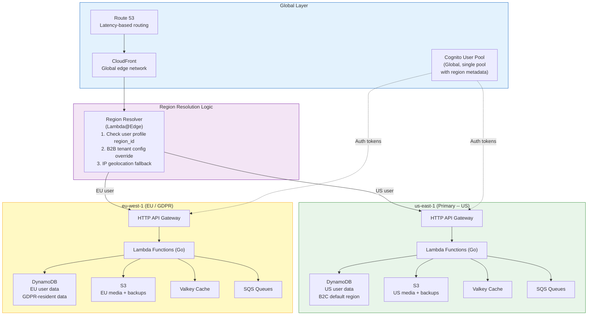
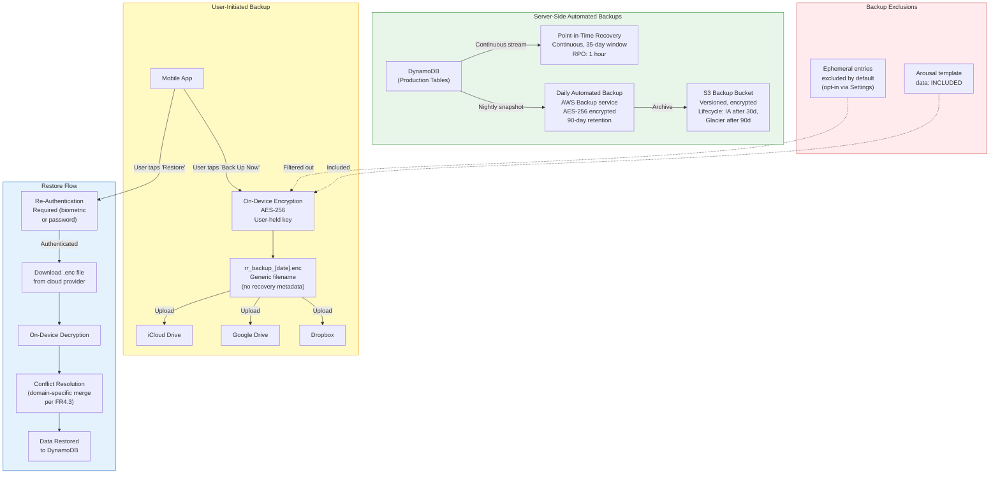

# Regal Recovery -- AWS Infrastructure Architecture

Reference: [Technical Architecture](../03-technical-architecture.md) Section 10

---

## 1. AWS Infrastructure Diagram

```mermaid
flowchart TB
    subgraph Clients["Client Layer"]
        style Clients fill:#E8F5E9,stroke:#388E3C
        iOS["iOS App<br/>(Swift + SwiftUI)"]
        Android["Android App<br/>(Kotlin + Jetpack Compose)"]
    end

    subgraph Edge["Edge / CDN"]
        style Edge fill:#E3F2FD,stroke:#1565C0
        CF["CloudFront CDN<br/>Static assets, media,<br/>API caching"]
    end

    subgraph Auth["Identity"]
        style Auth fill:#FFF3E0,stroke:#E65100
        Cognito["Cognito User Pool<br/>OAuth 2.0 / JWT<br/>Apple ID, Google,<br/>Email/Password, Passkey"]
    end

    subgraph API["API Layer"]
        style API fill:#E3F2FD,stroke:#1565C0
        APIGW["HTTP API Gateway<br/>Cognito Authorizer<br/>Rate limiting (100 req/min/user)<br/>WAF integration"]
    end

    subgraph Compute["Compute -- Lambda (Go)"]
        style Compute fill:#FFF9C4,stroke:#F9A825
        LAuth["Auth Functions<br/>signup, login, MFA,<br/>passkey, session mgmt"]
        LTracker["Tracker Functions<br/>sobriety dates, streaks,<br/>urge logs, check-ins"]
        LJournal["Journal Functions<br/>entries, prompts,<br/>emotional journaling"]
        LContent["Content Functions<br/>affirmations, resources,<br/>devotionals, video"]
        LComm["Community Functions<br/>messaging, sponsor,<br/>support network"]
        LBilling["Billing Functions<br/>IAP validation,<br/>subscription mgmt"]
        LAnalytics["Analytics Functions<br/>PCI scores, trends,<br/>trigger analysis"]
        LAdmin["Admin / B2B Functions<br/>tenant mgmt, aggregate<br/>reporting"]
        LNotify["Notification Functions<br/>push dispatch,<br/>milestone alerts"]
        LBackup["Backup Functions<br/>export, user backup,<br/>data deletion"]
    end

    subgraph Data["Data Layer"]
        style Data fill:#E8F5E9,stroke:#388E3C
        DDB["DynamoDB (on-demand)<br/>Primary datastore<br/>AES-256 SSE<br/>PITR enabled"]
        Valkey["Valkey (ElastiCache)<br/>Streak cache, dashboards,<br/>session state, rate limits"]
        S3["S3<br/>Media, static assets,<br/>encrypted backups,<br/>data exports"]
    end

    subgraph Messaging["Messaging / Events"]
        style Messaging fill:#F3E5F5,stroke:#7B1FA2
        SQS["SQS Queues<br/>urge-followup, backup-jobs,<br/>data-deletion, analytics-ingest,<br/>email-queue"]
        SNS_Events["SNS Topics<br/>milestone-achieved,<br/>check-in-completed,<br/>relapse-event,<br/>account-lifecycle"]
    end

    subgraph Push["Push Notifications"]
        style Push fill:#F3E5F5,stroke:#7B1FA2
        SNS_Push["SNS Platform App"]
        APNS["Apple APNS"]
        FCM["Google FCM"]
    end

    subgraph Email["Email"]
        style Email fill:#E3F2FD,stroke:#1565C0
        SES["SES<br/>Verification, password reset,<br/>milestone emails,<br/>breach notifications"]
    end

    subgraph Config["Secrets / Config"]
        style Config fill:#FFF3E0,stroke:#E65100
        SSM["SSM Parameter Store<br/>API keys, feature flags,<br/>third-party credentials"]
    end

    subgraph Observe["Observability"]
        style Observe fill:#FFEBEE,stroke:#C62828
        CW["CloudWatch<br/>Logs, Metrics, Alarms<br/>Dashboard"]
        XRay["X-Ray<br/>Distributed tracing"]
        CT["CloudTrail<br/>API audit log"]
    end

    subgraph CICD["CI/CD"]
        style CICD fill:#E0E0E0,stroke:#424242
        GHA["GitHub Actions"]
        CDK["CDK (TypeScript)<br/>/ SAM"]
    end

    %% Data flows
    iOS -->|HTTPS/TLS 1.3| CF
    Android -->|HTTPS/TLS 1.3| CF
    CF -->|Origin request| APIGW
    CF -->|Static assets| S3
    APIGW -->|Authorize| Cognito
    APIGW -->|Route| LAuth
    APIGW -->|Route| LTracker
    APIGW -->|Route| LJournal
    APIGW -->|Route| LContent
    APIGW -->|Route| LComm
    APIGW -->|Route| LBilling
    APIGW -->|Route| LAnalytics
    APIGW -->|Route| LAdmin
    APIGW -->|Route| LNotify
    APIGW -->|Route| LBackup

    LAuth -->|Read/Write| DDB
    LTracker -->|Read/Write| DDB
    LTracker -->|Cache streak| Valkey
    LJournal -->|Read/Write| DDB
    LContent -->|Read/Write| DDB
    LContent -->|Fetch media| S3
    LComm -->|Read/Write| DDB
    LBilling -->|Read/Write| DDB
    LAnalytics -->|Read/Write| DDB
    LAnalytics -->|Cache results| Valkey
    LAdmin -->|Read/Write| DDB
    LBackup -->|Read/Write| DDB
    LBackup -->|Upload exports| S3

    LTracker -->|Publish event| SNS_Events
    LNotify -->|Consume queue| SQS
    SNS_Events -->|Fan-out| SQS
    LNotify -->|Send push| SNS_Push
    SNS_Push -->|iOS| APNS
    SNS_Push -->|Android| FCM
    LNotify -->|Send email| SES

    LAuth -->|Read secrets| SSM
    LBilling -->|Read secrets| SSM

    LAuth -.->|Traces| XRay
    LTracker -.->|Traces| XRay
    APIGW -.->|Logs| CW
    DDB -.->|Metrics| CW

    GHA -->|Deploy| CDK
    CDK -->|Provision| APIGW
    CDK -->|Provision| Compute
    CDK -->|Provision| Data
```

### Service Justification

| Service | Purpose | Well-Architected Pillar |
|---|---|---|
| CloudFront | Edge caching for static assets and API responses; TLS termination | Performance, Security |
| HTTP API Gateway | Low-latency routing, native Cognito authorizer, request throttling | Performance, Security |
| Cognito | Managed auth with 50K MAU free tier; OAuth 2.0, passkeys, social sign-in | Cost, Security |
| Lambda (Go) | Sub-10ms cold starts in Go; pay-per-invocation; auto-scales to 500K concurrent users | Cost, Performance, Reliability |
| DynamoDB (on-demand) | Single-digit ms reads; auto-scaling; AES-256 SSE; PITR for 1-hour RPO | Performance, Reliability, Security |
| Valkey (ElastiCache) | Sub-ms cache for streaks, dashboards, rate-limit counters | Performance |
| S3 | Durable object storage for media, backups, exports; lifecycle policies | Cost, Reliability |
| SQS + SNS | Decoupled event processing; dead-letter queues for reliability | Reliability, Operational Excellence |
| SNS Platform App | Fan-out push to APNS and FCM from a single publish call | Operational Excellence |
| SES | Transactional email at $0.10/1K emails | Cost |
| SSM Parameter Store | Free tier for standard parameters; no secrets in code | Security |
| CloudWatch + X-Ray | Centralized logs, custom metrics, alarms, distributed tracing | Operational Excellence |
| CloudTrail | API-level audit logging for compliance (GDPR, CCPA) | Security |
| CDK (TypeScript) | Type-safe IaC; reusable constructs; drift detection | Operational Excellence |

---

## 2. Multi-Region / Data Residency Architecture

Per Section 10.3.13, user data must reside in the AWS region matching the user's jurisdiction. Data never crosses jurisdictional boundaries without explicit consent.

### Region Resolution Rules

| Priority | Signal | Example |
|---|---|---|
| 1 | User profile `region_id` | Existing user with stored region preference |
| 2 | B2B tenant configuration | Tenant provisioned with `data_region: eu-west-1` |
| 3 | IP geolocation (signup only) | New user signing up from Germany routed to eu-west-1 |

### Data Residency Guarantees

- **Primary data**: Stored exclusively in the assigned region's DynamoDB tables
- **Backups**: Subject to the same residency constraints -- S3 buckets are region-specific; no cross-region replication without consent
- **Cache (Valkey)**: Regional; never replicated across jurisdictions
- **CDN (CloudFront)**: Caches only non-user-specific content (static assets, public resources); user-specific API responses are cache-bypassed or use short TTLs with region-pinned origins
- **B2B tenant provisioning**: Admin specifies region at tenant creation; all subsequent user signups under that tenant inherit the region; region cannot be changed after provisioning without a data migration

---

## 3. Backup Architecture

Per Sections 5.2 (NFR9) and 10.3.11.

### Backup Summary

| Aspect | Server-Side | User-Initiated |
|---|---|---|
| Trigger | Automated (daily + continuous PITR) | Manual from Settings |
| Encryption | AES-256 SSE (AWS managed) | AES-256 on-device (user key) |
| Retention | 90 days (snapshots), 35 days (PITR) | User-managed in cloud provider |
| RPO | 1 hour (PITR) | Depends on user backup frequency |
| RTO | 4 hours (server restore) | Minutes (device restore) |
| Ephemeral data | Included in server backups | Excluded by default |
| Residency | Same region as primary data | User's personal cloud account |

### Disaster Recovery Tiers

| Scenario | Strategy | RTO | RPO |
|---|---|---|---|
| Single table corruption | PITR restore to specific timestamp | < 1 hour | 1 second |
| Regional failure (single AZ) | DynamoDB multi-AZ automatic | 0 (automatic) | 0 |
| Full region failure | Cross-region restore from S3 backup | 4 hours | 1 hour |
| Accidental bulk delete | PITR restore + S3 versioned backups | 1-2 hours | Minutes |

---

## 4. Cost Estimation

All pricing uses current AWS public pricing (us-east-1). Free tier applied where eligible (first 12 months).

### Assumptions

- **Year 1 (Conservative)**: 25,000 total users, 850 paid subscribers, ~5,000 DAU
- **Year 3 (Moderate)**: 550,000 total users, 16,500 paid subscribers, ~110,000 DAU
- Average API calls per DAU per day: 40 (login, dashboard load, streak check, content fetch, logging, etc.)
- Average DynamoDB item size: 1 KB
- Valkey cluster: single-node t4g.micro (Year 1), r7g.large (Year 3)

### Year 1 -- Conservative (25K Users, ~850 Paid)

| Service | Configuration | Monthly Requests / Units | Monthly Cost |
|---|---|---|---|
| **Cognito** | User pool, 25K MAU | 25,000 MAU | $0 (free tier: 50K MAU) |
| **API Gateway (HTTP)** | Routes to Lambda | ~6M requests/mo | $6.00 |
| **Lambda** | Go runtime, 256 MB, avg 50ms | ~6M invocations | $0 (free tier: 1M free) + ~$3.00 overage |
| **DynamoDB (on-demand)** | Read + write capacity | ~50M RCU, ~10M WCU | ~$18.75 |
| **DynamoDB Backups** | PITR + daily snapshots | 25 GB stored | ~$5.00 |
| **Valkey (ElastiCache)** | cache.t4g.micro, 1 node | Always on | ~$12.00 |
| **S3** | Standard, 50 GB media + backups | 50 GB + 500K requests | ~$1.50 |
| **CloudFront** | 100 GB transfer/mo | 100 GB | $0 (free tier: 1 TB) |
| **SQS** | Standard queues | ~2M messages | $0 (free tier: 1M free) + $0.40 |
| **SNS (events)** | Pub/sub topics | ~2M publishes | $0 (free tier: 1M free) + $0.50 |
| **SNS (push)** | Mobile push to APNS/FCM | ~150K pushes/mo | $0 (mobile push is free) |
| **SES** | Transactional email | ~50K emails/mo | $5.00 |
| **SSM Parameter Store** | Standard parameters | ~50 parameters | $0 (free) |
| **CloudWatch** | Logs, metrics, alarms | 5 GB logs, 20 alarms | ~$8.00 |
| **X-Ray** | Sampled traces (5%) | ~300K traces | $0 (free tier: 100K) + $1.50 |
| **CloudTrail** | Management events | 1 trail | $0 (free: 1 trail) |
| **Route 53** | 1 hosted zone | 1 zone + queries | ~$1.00 |
| **ACM** | TLS certificates | Public certs | $0 (free) |
| | | | |
| **TOTAL (Year 1)** | | | **~$62.65/mo** |

Year 1 effective cost: **~$62.65/month** (~$752/year)

With 850 paid subscribers at even the lowest $4.99/month tier, monthly subscription revenue is ~$4,242, yielding infrastructure cost at approximately 1.5% of revenue.

### Year 3 -- Moderate (550K Users, ~16.5K Paid)

| Service | Configuration | Monthly Requests / Units | Monthly Cost |
|---|---|---|---|
| **Cognito** | User pool, 550K MAU | 550,000 MAU | ~$2,575 (50K free + 500K at $0.00515) |
| **API Gateway (HTTP)** | Routes to Lambda | ~132M requests/mo | $132.00 |
| **Lambda** | Go runtime, 512 MB, avg 50ms | ~132M invocations | ~$138.00 |
| **DynamoDB (on-demand)** | Read + write capacity | ~1.1B RCU, ~220M WCU | ~$412.50 |
| **DynamoDB Backups** | PITR + daily snapshots | 500 GB stored | ~$100.00 |
| **DynamoDB Global Tables** | US + EU replication (partial) | ~20% cross-region | ~$82.50 |
| **Valkey (ElastiCache)** | cache.r7g.large, 2 nodes (multi-AZ) | Always on | ~$360.00 |
| **S3** | Standard + IA, 2 TB | 2 TB + 10M requests | ~$50.00 |
| **CloudFront** | 5 TB transfer/mo | 5 TB | ~$425.00 |
| **SQS** | Standard queues | ~50M messages | ~$20.00 |
| **SNS (events)** | Pub/sub topics | ~50M publishes | ~$25.00 |
| **SNS (push)** | Mobile push to APNS/FCM | ~3.3M pushes/mo | $0 (mobile push free) |
| **SES** | Transactional email | ~1M emails/mo | $100.00 |
| **SSM Parameter Store** | Standard parameters | ~100 parameters | $0 (free) |
| **CloudWatch** | Logs, metrics, alarms, dashboards | 100 GB logs, 50 alarms | ~$175.00 |
| **X-Ray** | Sampled traces (1%) | ~1.3M traces | ~$6.50 |
| **CloudTrail** | Management + data events | Multi-region | ~$5.00 |
| **Route 53** | 2 hosted zones + health checks | Zones + 50M queries | ~$30.00 |
| **WAF** | API Gateway protection | 132M requests evaluated | ~$56.00 |
| **ACM** | TLS certificates | Public certs | $0 (free) |
| **AWS Backup** | Vault, cross-region copy | 500 GB | ~$25.00 |
| **Multi-region overhead** | EU stack (Lambda, APIGW, DDB, cache) | ~30% of US compute/data | ~$380.00 |
| | | | |
| **TOTAL (Year 3)** | | | **~$5,097.50/mo** |

Year 3 effective cost: **~$5,098/month** (~$61,170/year)

With 16,500 paid subscribers averaging $7/month (blended tiers), monthly subscription revenue is ~$115,500, yielding infrastructure cost at approximately 4.4% of revenue.

### Cost Optimization Strategies

| Strategy | Estimated Savings | When to Apply |
|---|---|---|
| **DynamoDB Reserved Capacity** | 40-60% on read/write | Year 2+ when usage patterns stabilize |
| **Compute Savings Plans** | 20-30% on Lambda | Year 2+ with predictable baseline |
| **ElastiCache Reserved Nodes** | 30-40% on Valkey | Year 1+ (always-on workload) |
| **S3 Intelligent-Tiering** | 20-40% on infrequently accessed data | Year 1+ for backups and old media |
| **CloudFront committed pricing** | Up to 40% on data transfer | Year 3+ with high transfer volumes |
| **Lambda ARM64 (Graviton)** | 20% cost reduction, 34% better perf | Day 1 (Go compiles natively for ARM) |

### How This Maps to the "$12-38/month" PRD Estimate

The PRD's $12-38/month estimate (Section 10.2) refers to the very early stage -- pre-launch or first few hundred users -- where nearly every service falls within AWS free tier limits:

| Stage | Users | Estimated AWS Cost |
|---|---|---|
| Development / pre-launch | < 100 | ~$12-15/mo (Valkey node is the baseline cost) |
| Soft launch (1K users) | 1,000 | ~$20-30/mo |
| Early growth (5K users) | 5,000 | ~$30-40/mo |
| Year 1 target (25K users) | 25,000 | ~$63/mo |
| Year 3 target (550K users) | 550,000 | ~$5,098/mo |

The $12-38 range holds for approximately the first 1,000-3,000 users when Cognito, Lambda, SQS, SNS, CloudFront, and CloudTrail are within free tier. The Valkey cache node (~$12/mo) represents the floor cost, since it runs continuously regardless of traffic.
