# Regal Recovery — C4 Architecture Diagrams

**Version:** 1.0
**Last Updated:** 2026-03-28
**Related Documents:** [Technical Architecture](../03-technical-architecture.md) · [Feature Specifications](../02-feature-specifications.md)

---

## Overview

This document contains C4 architecture diagrams for Regal Recovery, a Christian recovery app supporting individuals recovering from sex addiction, pornography, substance use, and other compulsive behaviors. The architecture follows a serverless, event-driven design on AWS with native mobile clients: Android (Kotlin + Jetpack Compose) and iOS (Swift + SwiftUI).

**Architecture Philosophy:**
- Serverless-first: AWS Lambda + DynamoDB for pay-per-use scaling
- Offline-first mobile: Native Android and iOS clients with local-first data and background sync
- Event-driven: SQS/SNS for async processing (streaks, milestones, analytics)
- Security-first: AES-256 at rest, TLS 1.3 in transit, biometric app lock, ephemeral mode
- Privacy-first: Explicit opt-in for all data sharing, audit trail, no cross-user access

---

## 1. System Context Diagram (C4 Level 1)

Shows Regal Recovery as the central system with all actors and external systems.

```mermaid
C4Context
    title System Context - Regal Recovery

    Person(recoveryUser, "Recovering User", "Individual in recovery tracking sobriety, logging activities, and engaging with resources")
    Person(spouse, "Spouse", "Partner accessing shared recovery data and couples content")
    Person(sponsor, "Sponsor", "Accountability partner viewing shared progress and providing support")
    Person(coach, "Coach / Counselor", "Professional monitoring client progress and assigning activities")
    Person(therapist, "Therapist / CSAT", "Licensed professional viewing client data and managing homework")
    Person(admin, "Platform Admin", "Manages platform content, monitors system health, and handles support")
    Person(tenantAdmin, "B2B Tenant Admin", "White-label client administrator viewing aggregated tenant metrics")

    System(regalRecovery, "Regal Recovery", "Mobile-first Christian recovery platform for tracking sobriety, logging activities, managing accountability, and accessing recovery content")

    System_Ext(appleAppStore, "Apple App Store", "iOS app distribution and In-App Purchase processing")
    System_Ext(googlePlayStore, "Google Play Store", "Android app distribution and subscription billing")
    System_Ext(awsCognito, "AWS Cognito", "User authentication, OAuth 2.0, social sign-in via Apple ID and Google")
    System_Ext(appleHealth, "Apple Health", "Imports exercise, sleep, nutrition, and step count data")
    System_Ext(googleFit, "Google Fit", "Imports exercise, sleep, nutrition, and step count data")
    System_Ext(appleCalendar, "Apple Calendar", "Reads upcoming events for evening review and adds meetings to calendar")
    System_Ext(googleCalendar, "Google Calendar", "Reads upcoming events for evening review and adds meetings to calendar")
    System_Ext(whatsapp, "WhatsApp", "Receives accountability broadcasts and milestone sharing via deep links")
    System_Ext(signal, "Signal", "Receives accountability broadcasts and milestone sharing via deep links")
    System_Ext(telegram, "Telegram", "Receives accountability broadcasts and milestone sharing via deep links")
    System_Ext(nextMeetingSA, "NextMeeting SA API", "Provides real-time SA meeting directory data")
    System_Ext(spotify, "Spotify", "Provides music playback and curated recovery playlists")
    System_Ext(apns, "Apple Push Notification Service", "Delivers push notifications to iOS devices")
    System_Ext(fcm, "Firebase Cloud Messaging", "Delivers push notifications to Android devices")
    System_Ext(bibleApi, "Bible API", "Fetches Scripture verses in multiple translations")
    System_Ext(icloud, "iCloud Drive", "Encrypted backup storage for iOS users")
    System_Ext(googleDrive, "Google Drive", "Encrypted backup storage for Android users")
    System_Ext(dropbox, "Dropbox", "Encrypted backup storage option for all users")
    System_Ext(appleIAP, "Apple In-App Purchase", "Processes subscription payments for iOS")
    System_Ext(googlePlayBilling, "Google Play Billing", "Processes subscription payments for Android")

    Rel(recoveryUser, regalRecovery, "Tracks sobriety, logs urges and activities, reads devotionals, manages commitments", "HTTPS / Mobile App")
    Rel(spouse, regalRecovery, "Views shared recovery data, completes couples check-ins, accesses couples content", "HTTPS / Mobile App")
    Rel(sponsor, regalRecovery, "Monitors sponsee progress, receives accountability broadcasts, sends messages", "HTTPS / Mobile App")
    Rel(coach, regalRecovery, "Views client data per granted permissions, assigns activities, receives crisis alerts", "HTTPS / Web Portal")
    Rel(therapist, regalRecovery, "Manages client caseload, assigns homework, monitors Recovery Health Score", "HTTPS / Web Portal")
    Rel(admin, regalRecovery, "Manages platform content, monitors system health, handles user support", "HTTPS / Admin Portal")
    Rel(tenantAdmin, regalRecovery, "Views aggregated tenant metrics, manages white-label branding", "HTTPS / Admin Portal")

    Rel(regalRecovery, awsCognito, "Authenticates users via email, Apple ID, Google Sign-In", "OAuth 2.0 / JWT")
    Rel(regalRecovery, appleHealth, "Imports exercise, sleep, nutrition, step count", "HealthKit SDK")
    Rel(regalRecovery, googleFit, "Imports exercise, sleep, nutrition, step count", "Health Connect API")
    Rel(regalRecovery, appleCalendar, "Reads upcoming events, adds meetings to calendar", "EventKit SDK")
    Rel(regalRecovery, googleCalendar, "Reads upcoming events, adds meetings to calendar", "Google Calendar API")
    Rel(regalRecovery, whatsapp, "Sends accountability broadcasts and milestone shares", "Deep Link")
    Rel(regalRecovery, signal, "Sends accountability broadcasts and milestone shares", "Deep Link")
    Rel(regalRecovery, telegram, "Sends accountability broadcasts and milestone shares", "Deep Link")
    Rel(regalRecovery, nextMeetingSA, "Queries real-time SA meeting directory", "HTTPS / REST API")
    Rel(regalRecovery, spotify, "Controls music playback, loads curated playlists", "Spotify SDK")
    Rel(regalRecovery, apns, "Sends push notifications for reminders, milestones, and crisis alerts", "APNs HTTP/2")
    Rel(regalRecovery, fcm, "Sends push notifications for reminders, milestones, and crisis alerts", "FCM HTTP v1")
    Rel(regalRecovery, bibleApi, "Fetches Scripture verses in user's preferred translation", "HTTPS / REST API")
    Rel(regalRecovery, icloud, "Uploads encrypted user backups", "CloudKit API")
    Rel(regalRecovery, googleDrive, "Uploads encrypted user backups", "Google Drive API")
    Rel(regalRecovery, dropbox, "Uploads encrypted user backups", "Dropbox API")
    Rel(regalRecovery, appleIAP, "Processes subscription purchases and validates receipts", "StoreKit SDK")
    Rel(regalRecovery, googlePlayBilling, "Processes subscription purchases and validates receipts", "Play Billing Library")

    UpdateLayoutConfig($c4ShapeInRow="4", $c4BoundaryInRow="2")
```



**Key External Dependencies:**
- **Authentication:** AWS Cognito for user identity, OAuth 2.0 for social sign-in
- **Health Data:** Apple Health and Google Fit for exercise, sleep, nutrition tracking
- **Calendar:** Apple Calendar and Google Calendar for event integration
- **Messaging:** WhatsApp, Signal, Telegram for external accountability broadcasts via deep links
- **Meetings:** NextMeeting SA API for real-time SA meeting directory
- **Music:** Spotify SDK for in-app music playback control
- **Push Notifications:** APNs (iOS) and FCM (Android) for reminders and alerts
- **Scripture:** Bible API for multi-translation verse fetching
- **Backup:** iCloud, Google Drive, Dropbox for encrypted user backups
- **Payments:** Apple In-App Purchase and Google Play Billing for subscriptions

---

## 2. Container Diagram (C4 Level 2)

Shows the major containers within Regal Recovery: mobile app, API gateway, backend services, databases, and infrastructure components.

```mermaid
C4Container
    title Container Diagram - Regal Recovery

    Person(recoveryUser, "Recovering User", "Tracks recovery progress via mobile app")
    Person(therapist, "Therapist", "Manages clients via web portal")
    Person(admin, "Admin", "Manages platform via admin portal")

    System_Boundary(regalRecovery, "Regal Recovery") {
        Container(mobileApp, "Mobile App", "Android (Kotlin + Jetpack Compose) / iOS (Swift + SwiftUI)", "Offline-first native mobile apps with per-platform business logic, local database (Room / SwiftData), and background sync")
        Container(webPortal, "Therapist Portal", "React SPA", "Web-based client management dashboard for therapists and counselors")
        Container(adminPortal, "Admin Portal", "React SPA", "Platform administration dashboard for content management and system monitoring")

        Container(apiGateway, "API Gateway", "AWS HTTP API", "Routes requests to Lambda functions, enforces Cognito JWT authentication, rate limiting, and TLS 1.3")
        Container(authService, "Auth Service", "AWS Cognito", "User authentication, OAuth 2.0, social sign-in, password reset, MFA, passkey support")

        Container(coreApi, "Core API", "Go Lambda Functions", "Serverless HTTP API handlers for user data, tracking, activities, content, and analytics")
        Container(eventBus, "Event Bus", "AWS SNS + SQS", "Async message routing for background processing: streak calculations, milestone checks, push notifications, analytics aggregation")
        Container(backgroundWorkers, "Background Workers", "Go Lambda Functions", "Event consumers for streak calculations, milestone checks, notification scheduling, analytics aggregation, and backup processing")

        ContainerDb(primaryDb, "Primary Database", "DynamoDB (on-demand)", "Serverless NoSQL database with single-table design, user data partitioned by userId, AES-256 encryption at rest")
        ContainerDb(cache, "Cache", "Valkey (Redis-compatible)", "In-memory cache for hot data: active streaks, session state, dashboard metrics, content metadata")
        ContainerDb(objectStorage, "Object Storage", "AWS S3", "Media files (profile photos, milestone graphics), encrypted backups, content assets (videos, PDFs, audio)")

        Container(cdn, "CDN", "CloudFront", "Edge caching for static content, images, and video streaming with signed URLs for premium content")
        Container(pushService, "Push Notification Service", "AWS SNS", "Fan-out to APNs and FCM for push notifications: reminders, milestones, crisis alerts, data access alerts")
        Container(emailService, "Email Service", "AWS SES", "Transactional emails: account verification, password reset, support network invitations, weekly progress reports")
    }

    System_Ext(apns, "Apple Push Service", "APNs for iOS")
    System_Ext(fcm, "Firebase Cloud Messaging", "FCM for Android")
    System_Ext(appleHealth, "Apple Health", "HealthKit SDK")
    System_Ext(googleFit, "Google Fit", "Health Connect API")
    System_Ext(bibleApi, "Bible API", "Scripture verses")
    System_Ext(nextMeetingSA, "NextMeeting SA API", "Meeting directory")
    System_Ext(spotify, "Spotify", "Music playback")

    Rel(recoveryUser, mobileApp, "Uses", "Native iOS/Android")
    Rel(therapist, webPortal, "Manages clients", "HTTPS")
    Rel(admin, adminPortal, "Manages platform", "HTTPS")

    Rel(mobileApp, apiGateway, "Syncs data, fetches content, submits activities", "HTTPS / REST + JSON")
    Rel(webPortal, apiGateway, "Views client data, assigns homework, fetches analytics", "HTTPS / REST + JSON")
    Rel(adminPortal, apiGateway, "Manages content, views system metrics, handles support", "HTTPS / REST + JSON")

    Rel(apiGateway, authService, "Validates JWT tokens, enforces RBAC", "OAuth 2.0 / JWT")
    Rel(apiGateway, coreApi, "Routes requests to Lambda handlers", "AWS Lambda Invoke")

    Rel(coreApi, primaryDb, "Reads/writes user data, tracks activity, stores journal entries", "DynamoDB SDK")
    Rel(coreApi, cache, "Caches hot data, session state, dashboard metrics", "Redis Protocol")
    Rel(coreApi, objectStorage, "Uploads media, retrieves content assets, stores encrypted backups", "S3 SDK")
    Rel(coreApi, eventBus, "Publishes events: relapse logged, milestone reached, urge logged, activity completed", "SNS SDK")

    Rel(eventBus, backgroundWorkers, "Delivers events for async processing", "SQS Polling")
    Rel(backgroundWorkers, primaryDb, "Updates streak calculations, milestone status, analytics aggregates", "DynamoDB SDK")
    Rel(backgroundWorkers, cache, "Invalidates cached streaks, updates dashboard metrics", "Redis Protocol")
    Rel(backgroundWorkers, pushService, "Triggers push notifications for milestones, reminders, crisis alerts", "SNS SDK")

    Rel(pushService, apns, "Sends iOS push notifications", "APNs HTTP/2")
    Rel(pushService, fcm, "Sends Android push notifications", "FCM HTTP v1")

    Rel(coreApi, emailService, "Sends transactional emails", "SES SDK")
    Rel(cdn, objectStorage, "Caches static content, video streams", "S3 Origin")

    Rel(mobileApp, appleHealth, "Imports exercise, sleep, nutrition data", "HealthKit SDK")
    Rel(mobileApp, googleFit, "Imports exercise, sleep, nutrition data", "Health Connect API")
    Rel(mobileApp, bibleApi, "Fetches Scripture verses in preferred translation", "HTTPS / REST")
    Rel(mobileApp, nextMeetingSA, "Queries SA meeting directory by location", "HTTPS / REST")
    Rel(mobileApp, spotify, "Controls music playback, loads playlists", "Spotify SDK")

    UpdateLayoutConfig($c4ShapeInRow="3", $c4BoundaryInRow="1")
```



**Container Responsibilities:**

**Mobile Apps (Native Android + Native iOS):**
- Offline-first architecture with local database (Room on Android, SwiftData on iOS)
- Each platform implements its own business logic natively (Kotlin on Android, Swift on iOS)
- Native UI: Jetpack Compose on Android, SwiftUI on iOS
- Per-platform background sync queue with conflict resolution
- Biometric app lock, screenshot prevention, auto-lock
- Integration with Apple Health/Google Fit, Calendar, Contacts, Spotify

**API Gateway (AWS HTTP API):**
- Routes HTTP requests to Lambda functions
- Enforces Cognito JWT authentication and RBAC
- Rate limiting: 100 requests/minute per user
- TLS 1.3 with certificate pinning
- CORS configuration for web portals

**Core API (Go Lambda Functions):**
- HTTP API handlers for all user-facing operations
- Domain-driven design: Auth, Tracking, Activities, Content, Community, Analytics, Notification, Integration, Backup domains
- Single-table DynamoDB design with user-scoped partition keys
- Valkey caching layer for hot data (streaks, dashboard metrics)
- Event publishing to SNS for async processing

**Event Bus (SNS + SQS):**
- Event topics: relapse logged, milestone reached, urge logged, activity completed, user data changed
- Fanout pattern: single SNS topic → multiple SQS queues for different worker types
- Dead-letter queues for failed event processing

**Background Workers (Go Lambda Functions):**
- Streak calculation: triggered by activity completion events
- Milestone checks: triggered by streak updates, sends push notifications
- Analytics aggregation: daily/weekly/monthly rollups for dashboard metrics
- Notification scheduling: batching, quiet hours enforcement, priority-based delivery
- Backup processing: encrypts user data before upload to cloud storage

**Primary Database (DynamoDB):**
- Single-table design with partition key = `userId`, sort key = `entityType#entityId`
- GSIs for querying by date, activity type, tenant
- Point-in-time recovery enabled (24h RPO)
- AES-256 encryption at rest (AWS managed keys)
- On-demand billing for unpredictable traffic

**Cache (Valkey):**
- Active streaks (TTL: 1 hour)
- Dashboard metrics (TTL: 15 minutes)
- Session state (TTL: token expiration)
- Content metadata (TTL: 24 hours)

**Object Storage (S3):**
- User-uploaded media: profile photos, milestone graphics, voice journal audio
- Encrypted backups: user exports (JSON), automated backups
- Content assets: videos, PDFs, audio files for devotionals/prayers
- Lifecycle policies: transition to Glacier after 90 days

**CDN (CloudFront):**
- Edge caching for static content (images, videos, audio)
- Signed URLs for premium content access control
- Origin: S3 bucket with restrictive bucket policy

**Push Notification Service (SNS):**
- Platform endpoints for APNs and FCM
- Message batching, priority-based delivery
- Notification types: reminders, milestones, crisis alerts, data access alerts
- User preferences: quiet hours, notification categories

**Email Service (SES):**
- Transactional emails: account verification, password reset
- Support network invitations
- Weekly progress reports (optional)
- Crisis alert notifications to support contacts

---

## 3. Component Diagram (C4 Level 3) - Core API

Shows the internal components of the Core API (Go Lambda Functions), organized by domain.

```mermaid
C4Component
    title Component Diagram - Core API (Go Lambda Functions)

    Container_Boundary(coreApi, "Core API") {
        Component(authDomain, "Auth & Identity Domain", "Go Package", "User registration, login, password reset, session management, RBAC enforcement, passkey support")
        Component(trackingDomain, "Tracking Domain", "Go Package", "Sobriety tracking, streak calculations, milestone detection, calendar views, multi-addiction tracking, relapse logging")
        Component(activitiesDomain, "Activities Domain", "Go Package", "Sobriety commitment, urge logging, journaling, emotional journaling, check-ins, FASTER Scale, PCI, FANOS/FITNAP, post-mortem analysis")
        Component(contentDomain, "Content Domain", "Go Package", "Affirmations, devotionals, prayers, memory verses, resources, partner content, Bible API integration, content search")
        Component(communityDomain, "Community Domain", "Go Package", "Support network permissions, messaging, data sharing grants, audit trail, spouse/sponsor/counselor roles")
        Component(analyticsDomain, "Analytics Domain", "Go Package", "Recovery Health Score, urge correlation insights, trend analysis, activity completion metrics, dashboard data aggregation")
        Component(notificationDomain, "Notification Domain", "Go Package", "Push notification scheduling, batching, quiet hours, priority routing, crisis alerts, data access alerts")
        Component(integrationDomain, "Integration Domain", "Go Package", "Apple Health/Google Fit sync, Calendar integration, Meeting Finder, Spotify playlists, Bible API client")
        Component(backupDomain, "Backup/Export Domain", "Go Package", "User data export (JSON), encrypted backup creation, DSR (data subject rights) handling, secure delete")
    }

    ContainerDb(primaryDb, "DynamoDB", "NoSQL Database", "User data, activity logs, journal entries, streaks, milestones")
    ContainerDb(cache, "Valkey", "In-Memory Cache", "Active streaks, session state, dashboard metrics")
    ContainerDb(objectStorage, "S3", "Object Storage", "Media files, backups, content assets")
    Container(eventBus, "Event Bus", "SNS + SQS", "Async event publishing")
    Container(authService, "AWS Cognito", "Auth Service", "User authentication, JWT validation")
    System_Ext(bibleApi, "Bible API", "Scripture verses")
    System_Ext(nextMeetingSA, "NextMeeting SA API", "Meeting directory")
    System_Ext(appleHealth, "Apple Health", "Health data")
    System_Ext(googleFit, "Google Fit", "Health data")

    Rel(authDomain, authService, "Validates JWT, manages user sessions", "AWS SDK")
    Rel(authDomain, primaryDb, "Reads/writes user profiles, roles, permissions", "DynamoDB SDK")
    Rel(authDomain, cache, "Caches session state", "Redis Protocol")

    Rel(trackingDomain, primaryDb, "Reads/writes sobriety dates, streaks, relapse logs", "DynamoDB SDK")
    Rel(trackingDomain, cache, "Caches active streaks, calendar data", "Redis Protocol")
    Rel(trackingDomain, eventBus, "Publishes relapse logged, milestone reached events", "SNS SDK")

    Rel(activitiesDomain, primaryDb, "Reads/writes journal entries, check-ins, urge logs, FASTER Scale, PCI, financial data", "DynamoDB SDK")
    Rel(activitiesDomain, eventBus, "Publishes activity completed, urge logged events", "SNS SDK")

    Rel(contentDomain, primaryDb, "Reads content metadata, user favorites, reading history", "DynamoDB SDK")
    Rel(contentDomain, cache, "Caches content catalog, Bible verse cache", "Redis Protocol")
    Rel(contentDomain, objectStorage, "Retrieves videos, PDFs, audio files", "S3 SDK")
    Rel(contentDomain, bibleApi, "Fetches Scripture verses in preferred translation", "HTTPS / REST")

    Rel(communityDomain, primaryDb, "Reads/writes support network, permissions, messages, audit trail", "DynamoDB SDK")
    Rel(communityDomain, eventBus, "Publishes data access event for audit trail", "SNS SDK")

    Rel(analyticsDomain, primaryDb, "Queries activity logs, urge logs, streaks, PCI scores", "DynamoDB SDK")
    Rel(analyticsDomain, cache, "Caches aggregated dashboard metrics", "Redis Protocol")

    Rel(notificationDomain, primaryDb, "Reads user notification preferences, quiet hours", "DynamoDB SDK")
    Rel(notificationDomain, eventBus, "Publishes notification requested events", "SNS SDK")

    Rel(integrationDomain, primaryDb, "Reads/writes synced health data, calendar events", "DynamoDB SDK")
    Rel(integrationDomain, appleHealth, "Imports exercise, sleep, nutrition data", "API Proxy")
    Rel(integrationDomain, googleFit, "Imports exercise, sleep, nutrition data", "API Proxy")
    Rel(integrationDomain, nextMeetingSA, "Queries SA meeting directory", "HTTPS / REST")

    Rel(backupDomain, primaryDb, "Reads all user data for export", "DynamoDB SDK")
    Rel(backupDomain, objectStorage, "Uploads encrypted backups, exports", "S3 SDK")
    Rel(backupDomain, eventBus, "Publishes backup completed event", "SNS SDK")

    UpdateLayoutConfig($c4ShapeInRow="3", $c4BoundaryInRow="1")
```



**Component Responsibilities:**

**Auth & Identity Domain:**
- User registration with email/password, Apple ID, Google Sign-In
- Login, logout, password reset, email verification
- Session management with 15-minute access token rotation
- RBAC enforcement: User, Spouse, Sponsor, Coach, Counselor, Admin roles
- Passkey (FIDO2/WebAuthn) support for passwordless sign-in
- MFA (optional): TOTP, SMS
- Biometric app lock enforcement

**Tracking Domain:**
- Sobriety date management (set, update with reason logging)
- Streak calculation: days since last relapse, consecutive activity days
- Milestone detection: 1, 3, 7, 14, 30, 60, 90 days, 3-12 months, 1, 2, 5, 10 years
- Calendar views: color-coded activity history
- Multi-addiction tracking with independent streaks
- Relapse logging flow with compassion messaging
- Extended sobriety relapse handling (6+ months)
- Offline data sync conflict resolution

**Activities Domain:**
- Daily sobriety commitment logging
- Urge logging with triggers, intensity, coping strategies, location
- Journaling: free-form, bullet lists, prompted, voice-to-text
- Emotional journaling: mood ratings, FANOS (Feelings, Actions, Needs, Ownership, Self-care)
- Check-ins: daily recovery check-ins, person-specific check-ins (spouse, sponsor, counselor)
- FANOS/FITNAP (spouse check-in preparation)
- FASTER Scale tracking (Forgetting Priorities, Anxiety, Speeding Up, Ticked Off, Exhausted, Relapse)
- Personal Craziness Index (PCI) scoring
- Post-mortem analysis after relapse
- Financial tracker (income, expenses, arousal-related spending)
- Acting-in behaviors logging
- Gratitude list
- Prayer logging
- Devotional reading tracking
- Phone call logging (sponsor, accountability partner)
- Meeting attendance tracking
- Step work progress

**Content Domain:**
- Affirmations: daily rotation algorithm, favorite management
- Devotionals: 30-day freemium, 365-day premium
- Prayers: categorized prayer library
- Memory verses: verse packs (Identity in Christ, Temptation & Strength, Freedom & Recovery, premium packs)
- Resources: articles, videos, podcasts, external links
- Partner content: Redemptive Living, T30/60 journaling, Empathy exercises, Backbone, Bow Tie, Empathy Mapping
- Bible API integration: multi-translation support (NIV, ESV, NLT, KJV, NASB, NKJV, CSB, The Message, RVR1960, NVI, DHH, LBLA, Biblia Latinoamericana)
- Content search: full-text search across articles, devotionals, prayers, memory verses
- Freemium vs. premium content enforcement

**Community Domain:**
- Support network management: add/remove sponsor, counselor, coach, accountability partner, spouse
- Permission grants: per-person, per-category, per-activity access control
- All data sharing is explicit opt-in (no default sharing)
- Suggested permission templates during setup (never auto-enabled)
- Messaging: in-app messaging between user and support contacts
- Audit trail: "Who Accessed My Data" screen with push notification option
- Data access logging: who, what, when
- Accountability broadcasts to external messaging apps (WhatsApp, Signal, Telegram via deep links)

**Analytics Domain:**
- Recovery Health Score: 0-100 composite score synthesizing all recovery data
- Urge correlation insights: day of week, time of day, top triggers
- Trend analysis: urge frequency changes, sobriety percentage, streak comparisons
- Activity completion metrics: commitment keeping consistency, check-in completion rates
- PCI score trends over time
- Dashboard data aggregation: daily, weekly, monthly, quarterly rollups
- Premium analytics: deeper insights, predictive risk modeling, pattern detection

**Notification Domain:**
- Push notification scheduling: daily reminders, milestone celebrations, crisis alerts
- Batching: multiple notifications grouped into digest
- Quiet hours enforcement: no notifications during user-configured sleep hours
- Priority routing: crisis alerts override quiet hours
- Notification categories: commitments, milestones, urges follow-up, data access alerts
- User preferences: enable/disable per category
- Snooze functionality (up to 3 times)

**Integration Domain:**
- Apple Health / Google Fit sync: exercise (type, duration, calories), sleep (bedtime, wake, total duration), nutrition (calories, macros), steps (daily count)
- Calendar integration: read upcoming events for evening review, add meetings to calendar
- Meeting Finder: GPS-powered meeting search across SA, Celebrate Recovery, AA, S-Anon
- NextMeeting SA API integration: real-time SA meeting directory
- Spotify integration: in-app music playback control, curated recovery playlists
- Data minimization enforcement: only requested fields, no bulk imports

**Backup/Export Domain:**
- User data export: machine-readable JSON format, all recovery data
- Encrypted backup creation: AES-256 encrypted before upload to iCloud/Google Drive/Dropbox
- DSR (Data Subject Rights) handling: GDPR/CCPA compliance
- Secure delete: purge from primary storage within 30 days, backups within 90 days
- Ephemeral mode: auto-delete entries after 7/30/90 days
- Account deletion flow with confirmation and data export option

---

## 4. Data Flow Examples

### 4.1 Relapse Logging Flow

```
User (Mobile App)
  ↓ [Logs relapse with date, addiction, optional post-mortem]
API Gateway
  ↓ [Validates JWT, enforces rate limit]
Tracking Domain (Core API)
  ↓ [Validates relapse date, calculates previous streak length]
Primary Database (DynamoDB)
  ↓ [Writes relapse log, updates sobriety date, preserves streak history]
Event Bus (SNS)
  ↓ [Publishes "relapse_logged" event]
Background Workers (Lambda)
  ↓ [Recalculates streak, checks for extended sobriety relapse (6+ months)]
Primary Database (DynamoDB)
  ↓ [Updates streak to 0, milestone status reset]
Cache (Valkey)
  ↓ [Invalidates cached streak data]
Push Notification Service (SNS)
  ↓ [Sends compassionate recovery action plan prompt]
Mobile App
  ↓ [Displays relapse logged confirmation, optional support network notification]
```

### 4.2 Milestone Reached Flow

```
Background Worker (Lambda - Scheduled every hour)
  ↓ [Queries active streaks near milestone thresholds]
Primary Database (DynamoDB)
  ↓ [Returns users with streaks at milestone boundaries]
Background Worker (Lambda)
  ↓ [Checks for new milestones: 30 days, 90 days, 1 year, etc.]
Event Bus (SNS)
  ↓ [Publishes "milestone_reached" event]
Background Worker (Lambda)
  ↓ [Processes milestone celebration]
Primary Database (DynamoDB)
  ↓ [Marks milestone as achieved, generates digital sobriety coin]
Object Storage (S3)
  ↓ [Stores milestone graphic]
Push Notification Service (SNS)
  ↓ [Sends milestone celebration notification]
Mobile App
  ↓ [Displays full-screen celebration animation, reflection prompt, share options]
```

### 4.3 Daily Commitment Reminder Flow

```
Background Worker (Lambda - Scheduled daily at user-configured times)
  ↓ [Queries users with active commitment reminders]
Primary Database (DynamoDB)
  ↓ [Returns users due for commitment reminder]
Notification Domain (Core API)
  ↓ [Checks quiet hours, notification preferences]
Event Bus (SNS)
  ↓ [Publishes "notification_requested" event]
Push Notification Service (SNS)
  ↓ [Sends push notification via APNs/FCM]
Mobile App
  ↓ [Displays "Make your daily commitment" notification]
User taps notification
  ↓ [Opens app to commitment screen]
Activities Domain (Core API)
  ↓ [Logs commitment completion]
Event Bus (SNS)
  ↓ [Publishes "activity_completed" event]
Tracking Domain (Core API)
  ↓ [Updates commitment streak]
```

---

## 5. Deployment Architecture

**AWS Regions:**
- **US-East-1 (N. Virginia):** Primary region for North American users
- **EU-West-1 (Ireland):** EU data residency for GDPR compliance
- **Future:** AP-Southeast-2 (Sydney) for Asia-Pacific expansion

**Multi-Tenancy:**
- Default tenant: all individual users
- B2B tenants: white-label instances for ministries, recovery centers, counseling practices
- Tenant isolation: DynamoDB partition keys, IAM boundaries, separate namespaces for tenant-specific resources
- Tenant admins: view aggregated, anonymized metrics only (no individual user data access)

**High Availability:**
- Lambda: auto-scaling, multi-AZ by default
- DynamoDB: global tables for cross-region replication (future)
- Valkey: ElastiCache Redis with Multi-AZ failover
- S3: cross-region replication for critical backups
- CloudFront: global edge network

**Disaster Recovery:**
- RTO: 4 hours (restore from automated backups)
- RPO: 1 hour (point-in-time recovery for DynamoDB)
- Daily automated backups (encrypted), 90-day retention
- Runbook for regional failover

**Security Architecture:**
- TLS 1.3 for all data in transit
- Certificate pinning in mobile app
- AES-256 encryption at rest (DynamoDB, S3)
- JWT tokens with 15-minute expiration, rotating refresh tokens
- Rate limiting: 100 requests/minute per user
- OWASP Top 10 compliance
- Biometric app lock, screenshot prevention, auto-lock
- Ephemeral mode: cryptographic erasure after 7/30/90 days
- Audit trail: data access logging with push notifications

---

## 6. Technology Decisions

| Decision | Technology | Rationale |
|---|---|---|
| Mobile (Android) | Kotlin + Jetpack Compose, Room, Hilt | Native Android app with Jetpack Compose UI, Room local database, Hilt DI, offline-first architecture |
| Mobile (iOS) | Swift + SwiftUI, SwiftData, Swift Package Manager | Native iOS app with SwiftUI, SwiftData local database, native Swift DI, offline-first architecture |
| Backend Language | Go | Fast Lambda cold starts, strong concurrency, single-binary deployments |
| Compute | AWS Lambda | Serverless, pay-per-invocation, auto-scaling, zero infrastructure management |
| API Gateway | AWS HTTP API | Native Lambda integration, built-in Cognito authorizer, WebSocket support for future real-time features |
| Authentication | AWS Cognito | 50K MAU free tier, OAuth 2.0, social sign-in, MFA, passkey support |
| Database | DynamoDB (on-demand) | Serverless NoSQL, single-digit ms latency, single-table design, pay-per-request pricing |
| Cache | Valkey (Redis-compatible) | In-memory caching for hot data, ElastiCache managed service, Multi-AZ failover |
| Object Storage | AWS S3 | Durable, scalable, lifecycle policies for cost optimization, versioning for backups |
| CDN | CloudFront | Global edge network, signed URLs for premium content, origin shield for S3 |
| Email | AWS SES | Transactional email at scale, DKIM/SPF support, reputation management |
| Push Notifications | AWS SNS → APNs / FCM | Fan-out pattern, platform endpoints, message batching |
| Event Bus | SNS + SQS | Async message routing, fanout, dead-letter queues, event-driven architecture |
| IaC | AWS CDK (TypeScript) | Type-safe infrastructure definitions, reusable constructs, synthesizes CloudFormation |
| CI/CD | GitHub Actions | Native GitHub integration, matrix builds for iOS/Android, automated testing, AWS deployment |
| Monitoring | CloudWatch + X-Ray | Logs, metrics, alarms, distributed tracing, Lambda insights |

---

## 7. Validation Checklist

| Check | Status | Notes |
|---|---|---|
| Missing descriptions | ✅ Pass | All elements have descriptions |
| Missing technology | ✅ Pass | All containers and components specify technology |
| Unlabeled relationships | ✅ Pass | All relationships have descriptive labels |
| Element count per view | ✅ Pass | Context: 22 elements (under 25), Container: 21 elements, Component: 18 elements |
| Orphaned elements | ✅ Pass | All elements appear in at least one view |
| Abstraction mixing | ✅ Pass | L1 elements do not appear in L3 diagrams |
| External system tags | ✅ Pass | All external systems use `System_Ext` or `Container_Ext` suffix |
| Bidirectional relationships | ✅ Pass | All relationships are unidirectional with clear data flow |

---

## 8. Maintenance Notes

**Update Triggers:**
- Add new integration (e.g., Strava for exercise tracking) → Update System Context and Integration Domain
- Add new feature domain (e.g., AI Recovery Agent) → Update Component Diagram
- Change backend technology (e.g., migrate to PostgreSQL) → Update Container Diagram and technology table
- Add new deployment region → Update Deployment Architecture section

**Review Cadence:**
- Quarterly: Review diagrams for accuracy against implemented architecture
- Every major release: Update diagrams if new containers or domains are added
- Before architecture review meetings: Validate diagrams match current state

**Related Documentation:**
- [Technical Architecture](../03-technical-architecture.md) — Full technical specification
- [Feature Specifications](../02-feature-specifications.md) — Complete feature list and requirements
- [Strategic PRD](../01-strategic-prd.md) — Product vision and strategy
- [Content Strategy](../04-content-strategy.md) — Content guidelines and rotation algorithms

---

**Diagram Legend:**
- **Person** — Human actor (blue)
- **System** — Software system within scope (blue)
- **System_Ext** — External software system (gray)
- **Container** — Application or data store (blue)
- **ContainerDb** — Database or cache (blue with DB icon)
- **Component** — Internal module or domain (light blue)
- **Rel** — Relationship with description and technology

**Generated:** 2026-03-28
**Tool:** Mermaid C4 Diagrams
**Version Control:** Stored in `/docs/architecture/` alongside technical specifications
