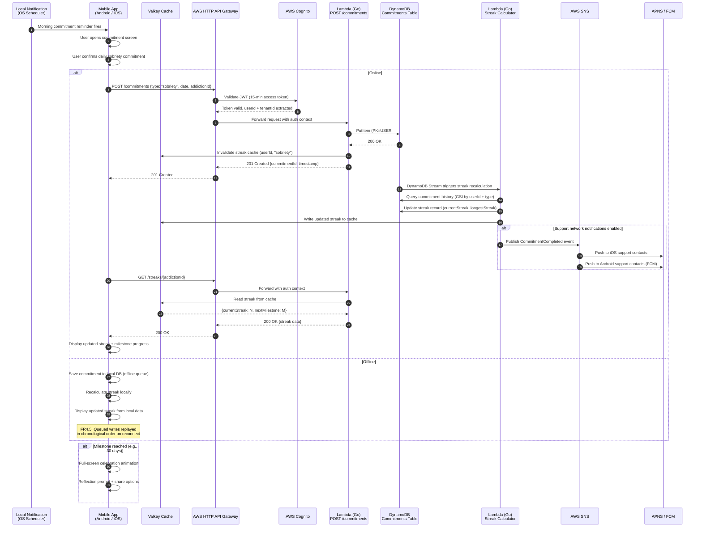
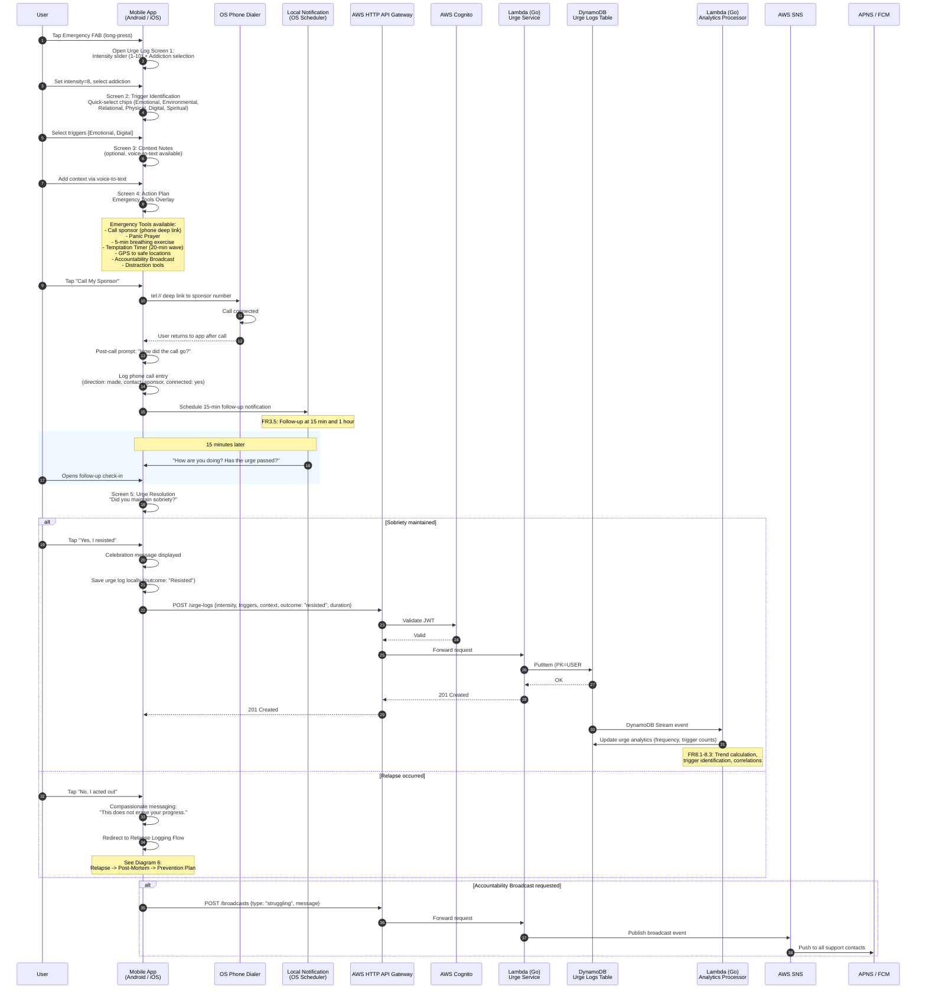
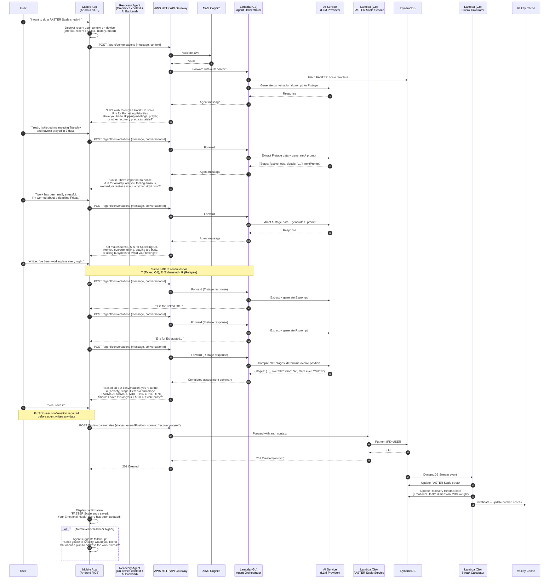
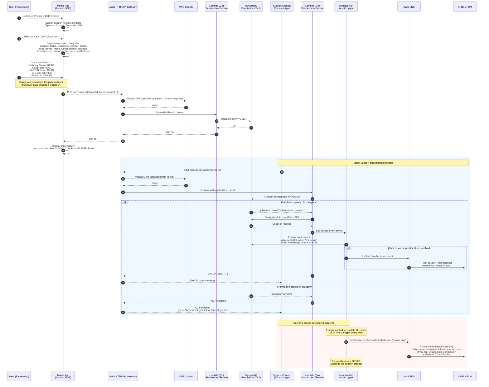
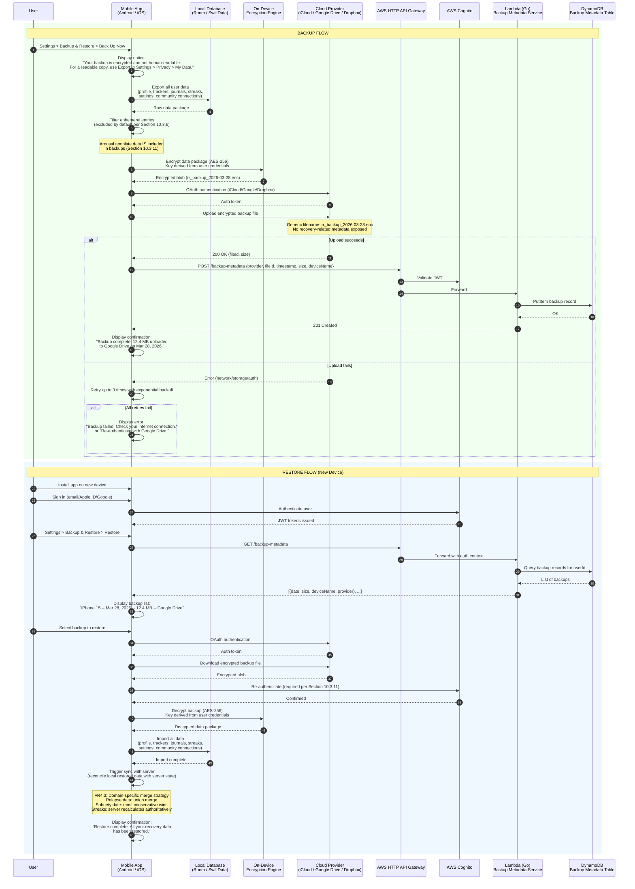
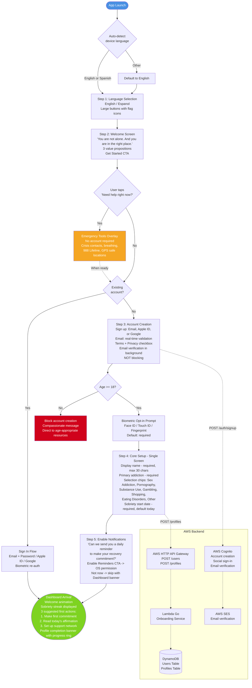
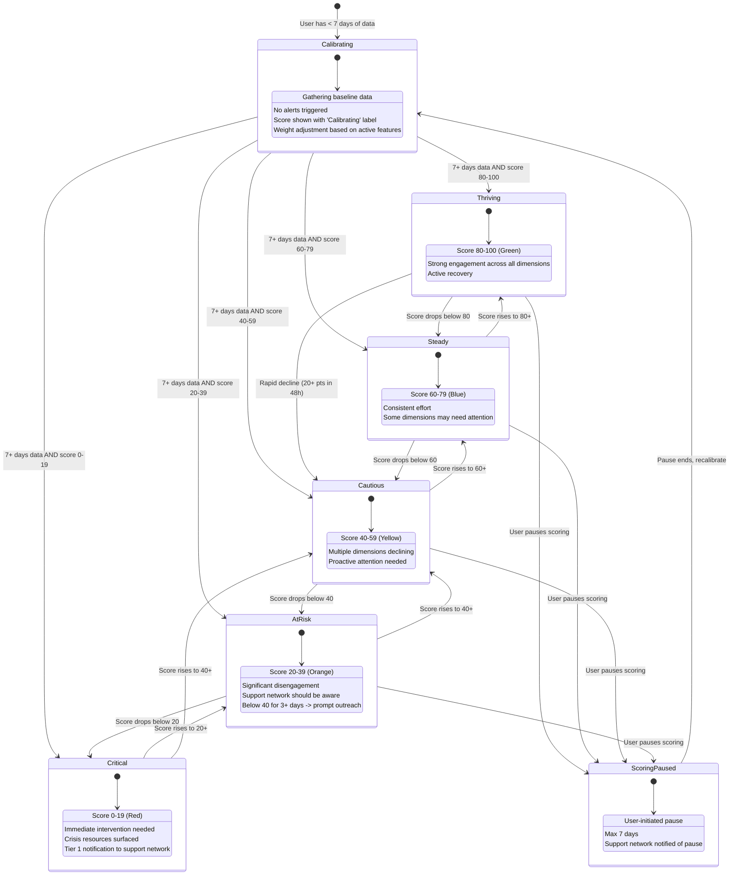
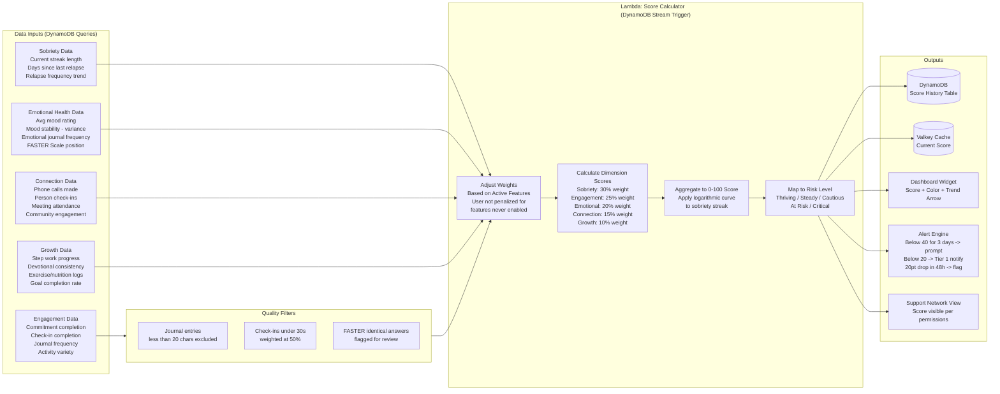

# Regal Recovery -- Sequence and Flow Diagrams

Critical user flows documented as Mermaid diagrams, grounded in the [Feature Specifications](../02-feature-specifications.md) and [Technical Architecture](../03-technical-architecture.md).

---

## Table of Contents

1. [Morning Sobriety Commitment Flow](#1-morning-sobriety-commitment-flow)
2. [Urge Logging to Emergency Tools to Resolution](#2-urge-logging--emergency-tools--resolution)
3. [Recovery Agent Guided Tool Walkthrough](#3-recovery-agent-guided-tool-walkthrough)
4. [Data Sharing Permission Grant](#4-data-sharing-permission-grant)
5. [Backup and Restore Flow](#5-backup-and-restore-flow)
6. [Relapse to Post-Mortem to Prevention Plan Update](#6-relapse--post-mortem--prevention-plan-update)
7. [Onboarding Fast Track](#7-onboarding-fast-track)
8. [Recovery Health Score Calculation State Machine](#8-recovery-health-score-calculation-state-machine)

---

## 1. Morning Sobriety Commitment Flow

The daily commitment is the foundational recovery action. Local notifications trigger the flow; the commitment is saved to DynamoDB and the streak is recalculated. If the user has configured support network notifications, SNS fans out to APNS/FCM for each contact.

**Key design decisions:**
- Local notifications (FR3.2) ensure the reminder fires even without server connectivity.
- Streak recalculation is async via DynamoDB Streams to keep the write path fast (NFR1.4: < 2s).
- Valkey cache avoids recalculating streaks on every dashboard load (NFR1.3: < 500ms).
- Offline-first: commitment is persisted locally before any network call (FR4.1, FR4.5).

---

## 2. Urge Logging to Emergency Tools to Resolution

Triggered by the Emergency FAB (available on every screen). The flow covers urge capture, emergency tool activation, sponsor contact, follow-up notification, and resolution logging. All emergency tools work fully offline (< 1s load).

**Key design decisions:**
- Phone deep link (tel://) avoids requiring CALL_PHONE permission on iOS entirely; Android uses it on-demand.
- All emergency tools are cached locally for offline use (FR4.4) and load in < 1s (NFR1.2).
- Follow-up notifications are local (FR3.2, FR3.5) to guarantee delivery without server dependency.
- Urge log is saved locally first, then synced -- offline queue ensures zero data loss (NFR2.4).

---

## 3. Recovery Agent Guided Tool Walkthrough

The Recovery Agent (P3, Premium+) acts as a conversational interface to all app tools. This diagram shows a FASTER Scale walkthrough where the agent asks each question (F, A, S, T, E, R), the user responds naturally, and the agent submits the completed entry. The agent has read access to user data and write access only with explicit per-entry confirmation.

**Key design decisions:**
- Agent decrypts user context on-device before sending to the backend, sending only what is needed for the current turn (privacy requirement from Feature 8).
- Every agent-written entry is tagged with `source: "via Recovery Agent"` in metadata.
- Write access requires explicit per-entry user confirmation -- the agent never silently writes data.
- FASTER Scale position feeds into Recovery Health Score (Emotional Health dimension, 20% weight).
- If the agent detects crisis indicators (R - Relapse), it escalates to emergency tools (cannot be overridden).

---

## 4. Data Sharing Permission Grant

All data sharing is opt-in (Feature 9). No support contact can view anything by default. The user grants access per person, per category, or per activity. Every data access by a support contact is logged in the audit trail (Section 10.3.8).

**Key design decisions:**
- Permission changes are a sensitive operation requiring re-authentication (biometric or PIN) per Section 10.3.1.
- Permission check happens on every data request -- never cached in a way that would allow stale grants.
- Audit trail (Section 10.3.8) logs every access with who/what/when, retained for 1 year.
- Silent revoke option: user can revoke access without notification to the support contact (Feature 9 safety).
- Coercive access detection is a server-side pattern check, never visible to the flagged contact.

---

## 5. Backup and Restore Flow

User-initiated backup to iCloud, Google Drive, or Dropbox. Data is encrypted on-device before upload. Backup file names are generic (`rr_backup_[date].enc`) to avoid revealing recovery-related information (Section 10.3.11). Ephemeral entries are excluded by default.

**Key design decisions:**
- Encryption happens entirely on-device before any data leaves the phone -- cloud providers never see plaintext.
- Backup metadata (not content) is stored in DynamoDB to support listing backups across devices.
- Restore requires re-authentication as an additional security gate (Section 10.3.11).
- After restore, the app triggers a full sync with the server to reconcile using the domain-specific merge strategy (FR4.3).
- Ephemeral entries are excluded by default but can be included via user setting (Section 10.3.6).

---

## 6. Relapse to Post-Mortem to Prevention Plan Update

This flow begins when a user discloses a relapse (either via direct logging or FASTER Scale reaching R). It proceeds through compassionate relapse logging, guided post-mortem analysis (6 sections), and concludes with actionable prevention plan updates. For users with 180+ days of sobriety, an extended compassion pathway is triggered.

```mermaid
flowchart TD
    Start([User Discloses Relapse]) --> Source{Entry Point}

    Source -->|Direct Logging| RelapseLog[Relapse Logging Screen]
    Source -->|FASTER Scale = R| FASTERRedirect[FASTER Scale redirects<br/>to Relapse Logging]
    Source -->|Recovery Agent| AgentDisclosure[Agent detects relapse<br/>in conversation]

    FASTERRedirect --> RelapseLog
    AgentDisclosure --> RelapseLog

    RelapseLog --> Compassion{Streak >= 180 days?}

    Compassion -->|Yes| ExtendedCompassion[Extended Compassion Message:<br/>'This does not erase 6 months of growth.'<br/>+ Direct link to call sponsor/therapist<br/>+ Curated long-streak recovery plan]
    Compassion -->|No| StandardCompassion[Compassionate Message:<br/>'Recovery is not a straight line.<br/>Every day you fought matters.']

    ExtendedCompassion --> RelapseDetails
    StandardCompassion --> RelapseDetails

    RelapseDetails[Relapse Details:<br/>Date/Time picker<br/>Addiction specification<br/>Duration] --> SaveRelapse

    SaveRelapse[Lambda: POST /relapses<br/>DynamoDB: Save relapse record<br/>Reset sobriety date<br/>Preserve previous streak in history]

    SaveRelapse --> TotalDays[Display Both Counters:<br/>New streak: Day 0<br/>Total sober days: 247 of 250]

    SaveRelapse --> NotifyOption{Notify support<br/>network?}
    NotifyOption -->|Yes| SNSNotify[SNS: Push notification<br/>to support contacts]
    NotifyOption -->|No| PostMortemPrompt

    SNSNotify --> PostMortemPrompt

    PostMortemPrompt{Begin Post-Mortem<br/>Analysis?}
    PostMortemPrompt -->|Not now| SaveReminder[Schedule reminder<br/>for later today]
    PostMortemPrompt -->|Yes| PM1

    PM1[Section 1: The Day Before<br/>Emotional/spiritual state<br/>Recovery practices status<br/>Unresolved conflicts<br/>Mood rating 1-10]

    PM1 --> PM2[Section 2: Morning<br/>Morning commitment status<br/>Wake-up mood<br/>Notable events<br/>Auto-populated from app data]

    PM2 --> PM3[Section 3: Throughout the Day<br/>Hour-by-hour walkthrough<br/>Events, interactions, emotions<br/>When warning signs appeared<br/>FASTER stages identified]

    PM3 --> PM4[Section 4: The Build-Up<br/>First noticed something off<br/>Trigger accumulation<br/>Emotional/Environmental/Relational/<br/>Physical/Digital/Spiritual<br/>Decision point identification:<br/>'I could have ___ but instead I ___']

    PM4 --> PM5[Section 5: The Acting Out<br/>What happened<br/>Thoughts and feelings<br/>Addiction involved<br/>Duration<br/>Compassionate framing throughout]

    PM5 --> PM6[Section 6: Immediately After<br/>Feelings Wheel integration<br/>What did you do next?<br/>Did you reach out?<br/>What would you do differently?]

    PM6 --> Timeline[Generate Visual Timeline<br/>24-hour progression<br/>FASTER stages as color bands<br/>Trigger accumulation indicators<br/>Decision points marked]

    Timeline --> ActionPlan[Action Plan Creation<br/>3-5 specific actionable changes<br/>Format: 'At point X, I could have Y'<br/>Tagged: spiritual/relational/<br/>emotional/physical/practical]

    ActionPlan --> ConvertActions{Convert actions<br/>to app items?}
    ConvertActions -->|Yes| CreateCommitments[Lambda: POST /commitments<br/>Convert items to daily/weekly<br/>commitments or goals]
    ConvertActions -->|No| SavePM

    CreateCommitments --> UpdatePrevention[Lambda: PATCH /prevention-plans<br/>Update Relapse Prevention Plan<br/>with new strategies from post-mortem]

    SavePM[Lambda: POST /post-mortems<br/>DynamoDB: Save complete analysis<br/>metadata: source via Recovery Agent]

    UpdatePrevention --> SavePM

    SavePM --> CrossAnalysis[DynamoDB Stream triggers<br/>Cross-Analysis Update:<br/>Most common triggers<br/>Most frequent FASTER stage at<br/>point of no return<br/>Recurring missed interventions]

    CrossAnalysis --> ShareOption{Share with<br/>sponsor/counselor?}
    ShareOption -->|Full analysis| ShareFull[Share complete post-mortem<br/>via app or PDF export]
    ShareOption -->|Summary only| ShareSummary[Share summary view only]
    ShareOption -->|Not now| End

    ShareFull --> End([Flow Complete:<br/>Streak reset, post-mortem saved,<br/>prevention plan updated,<br/>new commitments active])
    ShareSummary --> End

    SaveReminder --> End

    style Start fill:#D0021B,color:#fff
    style End fill:#7ED321,color:#fff
    style ExtendedCompassion fill:#F5A623,color:#fff
    style StandardCompassion fill:#F5A623,color:#fff
    style ActionPlan fill:#4A90E2,color:#fff
    style UpdatePrevention fill:#4A90E2,color:#fff
```

**Key design decisions:**
- Extended compassion pathway for 180+ day relapses ensures long-streak users receive targeted support and are not left feeling like all progress was erased.
- Post-mortem auto-populates data from existing app records (morning commitment status, mood ratings) to reduce manual entry burden.
- Action plan items can be directly converted into commitments or goals -- closing the loop between analysis and behavior change.
- Cross-analysis runs asynchronously via DynamoDB Streams to identify patterns across multiple relapses.
- All timestamps on relapse events are immutable once created (FR2.7) -- no backdating allowed.

---

## 7. Onboarding Fast Track

Five steps to dashboard in under 2 minutes. Only notifications permission is requested during onboarding; all other permissions are deferred to contextual moments. Crisis access ("Need help right now?") is available from the Welcome Screen without requiring account creation.

**Key design decisions:**
- Crisis access before account creation is a non-negotiable safety requirement -- a user in crisis should never be blocked by a sign-up form.
- Email verification runs in the background (does not block the user) to minimize time-to-dashboard.
- Age verification at Step 3 prevents under-18 users from proceeding (Section 10.3.1).
- Only one OS permission (notifications) is requested during onboarding -- all others are deferred (Section 5.5).
- Onboarding state is auto-saved so interrupted flows resume exactly where the user left off (FR4.1 principle applied to onboarding).

---

## 8. Recovery Health Score Calculation State Machine

The Recovery Health Score (0-100) is calculated daily from five weighted dimensions. The score maps to risk levels that drive notifications, support network alerts, and crisis resource surfacing. During the first 7 days ("Calibrating"), no alerts fire regardless of score.

### Score Calculation Data Flow

**Key design decisions:**
- Logarithmic curve on sobriety streak prevents the score from being dominated by long-term sobriety alone -- engagement and emotional health remain meaningful even at 1,000+ days.
- Quality filters prevent gaming: short journal entries, speed-tapped check-ins, and identical FASTER answers are down-weighted or excluded.
- Weight adjustment for inactive features ensures users are scored fairly based on what they actually use -- a user who never enabled exercise tracking is not penalized.
- Scoring pause (max 7 days) acknowledges that vacations and intentional breaks should not trigger false alarms, while ensuring the pause itself is visible to the support network.
- The score is recalculated asynchronously via DynamoDB Streams whenever underlying data changes, then cached in Valkey for sub-500ms dashboard loads.

---

## AWS Services Summary

For reference, the services involved across all flows:

| Service | Role in Flows |
|---|---|
| **AWS HTTP API Gateway** | All API routing with built-in Cognito authorizer |
| **AWS Cognito** | Authentication (JWT tokens, 15-min access, rotating refresh), social sign-in, email verification |
| **AWS Lambda (Go)** | All business logic: commitment service, urge service, FASTER scale service, permissions service, agent orchestrator, score calculator, streak calculator, audit logger, backup metadata |
| **DynamoDB** | Primary data store (on-demand): users, commitments, urge logs, FASTER entries, permissions, audit trail, post-mortems, scores, backup metadata. DynamoDB Streams for async processing |
| **Valkey (Redis-compatible)** | Cache: streak data, current scores, dashboard hot data, session state |
| **AWS SNS** | Fan-out notifications: support network alerts, milestone celebrations, accountability broadcasts, coercive access alerts |
| **APNS / FCM** | Platform push delivery (via SNS) |
| **AWS SES** | Transactional email: verification, password reset, lapsed user re-engagement |
| **AWS S3** | Media storage, static assets (not used for user backups -- those go to user's own cloud provider) |
| **CloudFront** | CDN for static content and assets |
| **CloudWatch + X-Ray** | Observability: logs, metrics, alarms, distributed tracing across Lambda invocations |
| **SSM Parameter Store** | Secrets and configuration: API keys, feature flags |

---

## Open Questions

1. **Agent AI provider selection**: The Recovery Agent requires an LLM backend. Provider selection (Bedrock, OpenAI, Anthropic) has not been finalized. This affects latency, cost, and data residency for EU users.
2. **Backup encryption key derivation**: The exact key derivation function (KDF) for backup encryption needs specification -- whether to use the user's password directly (PBKDF2/Argon2) or a separate backup passphrase.
3. **Score calculation frequency**: Currently specified as "daily" but the DynamoDB Stream trigger model would recalculate on every data change. Need to decide between true real-time scoring vs. batched daily calculation (cost vs. UX trade-off).
4. **Offline agent capability**: The Recovery Agent flow assumes connectivity. Defining the offline fallback (cached responses? simplified local model? redirect to manual tool entry?) needs specification.
5. **Cross-device backup conflict**: If a user restores a backup on a new device while the old device is still active, the merge strategy for in-flight offline data on the old device needs clarification beyond the general FR4.3 rules.
