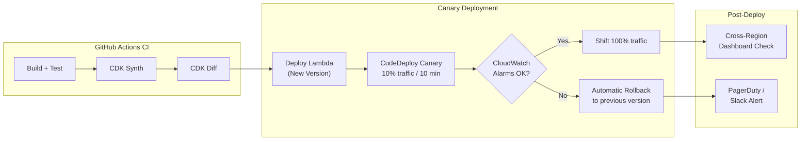
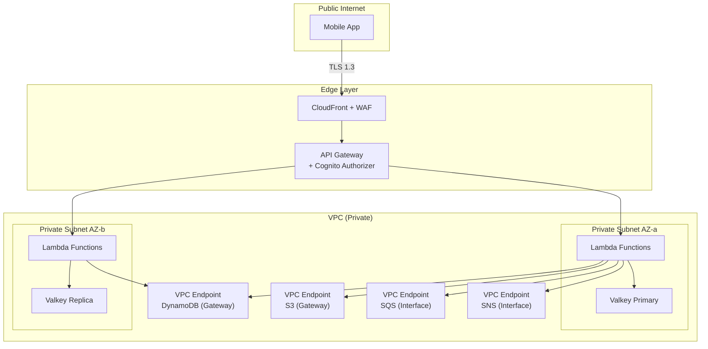

# Regal Recovery -- AWS Well-Architected Framework Review

**Review Date:** 2026-03-28
**Workload:** Regal Recovery -- Christian recovery mobile application (serverless, event-driven)
**AWS Regions:** us-east-1 (primary), eu-west-1 (GDPR)
**Reviewer:** AWS Well-Architected Review
**Lenses Applied:** AWS Well-Architected Framework, Serverless Lens

---

## Executive Summary

Regal Recovery's architecture demonstrates strong foundational design choices: serverless-first compute (Lambda + Go), event-driven async processing (SNS/SQS), DynamoDB single-table design, and infrastructure as code via CDK. The architecture is well-suited for a mobile-first application with unpredictable traffic patterns and cost-sensitive early growth.

This review identified **5 High Risk Issues (HRI)**, **9 Medium Risk Issues (MRI)**, and **7 Low Risk Issues (LRI)** across all six pillars. The most critical gaps are: (1) no WAF protection on API Gateway in the Year 1 deployment, (2) SSM Parameter Store used instead of Secrets Manager for sensitive credentials, (3) no defined DynamoDB throttling runbook or auto-remediation, (4) Valkey cache as a single node without Multi-AZ in Year 1, and (5) no load testing baseline established before production launch.

Estimated remediation effort for all HRIs is approximately 3-4 weeks of engineering time.

---

## Pillar 1: Operational Excellence

### Findings

| ID | Finding | Severity | Recommendation |
|---|---|---|---|
| OPS-01 | IaC adopted via CDK (TypeScript) with GitHub Actions CI/CD. CloudFormation synthesized from CDK. | No Risk | Continue. Ensure CDK snapshots are tested in CI. |
| OPS-02 | CloudWatch Logs, Metrics, Alarms, and X-Ray tracing are specified. Structured JSON logging planned. Correlation IDs propagated. | No Risk | Good observability baseline. |
| OPS-03 | No documented runbooks or automated remediation for common failure modes (DynamoDB throttling, Lambda concurrency exhaustion, Valkey failover, SQS DLQ processing). | **HRI** | Create SSM Automation runbooks for the top 5 failure scenarios. Wire CloudWatch Alarms to automated remediation where possible. |
| OPS-04 | No game days or chaos engineering practices mentioned. DR strategy documented but untested. | **MRI** | Schedule quarterly game days. Use AWS Fault Injection Service (FIS) to simulate AZ failure, DynamoDB throttling, and Lambda timeout scenarios. |
| OPS-05 | X-Ray sampling at 5% (Year 1) and 1% (Year 3). At low traffic, 5% may miss important traces of infrequent code paths. | **LRI** | Use X-Ray sampling rules to sample 100% for errors and high-latency requests, regardless of overall sampling rate. |
| OPS-06 | Deployment strategy not specified (all-at-once, canary, linear). Lambda aliases and traffic shifting not mentioned. | **MRI** | Implement canary deployments using Lambda aliases with CodeDeploy. Route 10% of traffic to new version for 10 minutes before full rollout. Add automatic rollback on CloudWatch alarm triggers. |
| OPS-07 | No centralized dashboard for operational health across both regions (us-east-1 and eu-west-1). | **LRI** | Create a CloudWatch cross-account/cross-region dashboard showing Lambda errors, DynamoDB consumed capacity, SQS DLQ depth, and Valkey hit rate for both regions. |

### Target Architecture: Deployment Pipeline with Canary

---

## Pillar 2: Security

### Findings

| ID | Finding | Severity | Recommendation |
|---|---|---|---|
| SEC-01 | Cognito with OAuth 2.0, JWT (15-min expiry), rotating refresh tokens, passkey support, MFA (optional). RBAC via Lambda authorizer. | No Risk | Strong auth design. Consider making MFA required for Admin and Counselor roles. |
| SEC-02 | TLS 1.3 enforced, certificate pinning in mobile clients, AES-256 at rest for DynamoDB and S3. | No Risk | Good baseline encryption. |
| SEC-03 | SSM Parameter Store used for API keys and third-party credentials. SSM Standard parameters are unencrypted by default. | **HRI** | Migrate sensitive credentials (IAP validation keys, APNS certificates, third-party API keys, database credentials) to AWS Secrets Manager with automatic rotation. Use SSM Parameter Store only for non-sensitive configuration (feature flags, endpoint URLs). |
| SEC-04 | WAF not included in Year 1 deployment. Only present in Year 3 cost estimate. API Gateway is publicly accessible without WAF. | **HRI** | Deploy AWS WAF on API Gateway from Day 1. Apply managed rule groups: AWSManagedRulesCommonRuleSet, AWSManagedRulesKnownBadInputsRuleSet, AWSManagedRulesSQLiRuleSet. Estimated cost: ~$10-15/month at Year 1 traffic. |
| SEC-05 | DynamoDB encryption uses AWS-managed keys (default SSE). No customer-managed KMS keys (CMKs). | **MRI** | For sensitive recovery data, migrate to customer-managed KMS keys. This enables key rotation policies, cross-account key sharing control, and CloudTrail logging of every key usage. Supports future zero-knowledge architecture. |
| SEC-06 | GuardDuty, Security Hub, and IAM Access Analyzer not mentioned in the architecture. | **MRI** | Enable GuardDuty for threat detection, Security Hub for centralized findings, and IAM Access Analyzer to identify overly permissive roles. Estimated cost: < $20/month at Year 1 scale. |
| SEC-07 | CloudTrail captures management events only (1 free trail). No data events for DynamoDB or S3. | **MRI** | Enable CloudTrail data events for S3 (backup buckets) and DynamoDB to audit data-plane access. Critical for GDPR compliance and breach forensics. |
| SEC-08 | VPC configuration not specified for Valkey (ElastiCache). Lambda functions may run in default VPC or no VPC. | **MRI** | Deploy Valkey in a private subnet within a VPC. Configure Lambda functions that access Valkey to run in the same VPC with security groups restricting access to the Valkey port only. Use VPC endpoints for DynamoDB and S3 to keep traffic off the public internet. |
| SEC-09 | Incident response plan documented (Section 10.3.12) with severity classification and 72-hour notification commitment. | No Risk | Good plan. Ensure it is tested annually. |
| SEC-10 | S3 bucket policies not detailed. Public access block settings not confirmed. | **LRI** | Apply S3 Block Public Access at the account level. Ensure all buckets use bucket policies that deny non-SSL access. Enable S3 Access Logging on backup buckets. |

### Target Architecture: Network Security

---

## Pillar 3: Reliability

### Findings

| ID | Finding | Severity | Recommendation |
|---|---|---|---|
| REL-01 | Lambda is multi-AZ by default. DynamoDB is multi-AZ by default. CloudFront is globally distributed. Good baseline. | No Risk | Continue. |
| REL-02 | Valkey cache is a single t4g.micro node in Year 1. No Multi-AZ failover. Cache failure causes increased DynamoDB read latency and potential throttling. | **HRI** | Deploy Valkey with Multi-AZ replication from Day 1, even at the t4g.micro tier. ElastiCache supports Multi-AZ with automatic failover for Redis-compatible mode. Cost increase: ~$12/month. This eliminates a single point of failure in the data path. |
| REL-03 | DynamoDB PITR enabled with 35-day window. Daily snapshots to S3 with 90-day retention. RPO: 1 hour, RTO: 4 hours. | No Risk | Well-defined backup strategy. |
| REL-04 | SQS dead-letter queues mentioned but no DLQ processing strategy or alerting defined. Failed messages could accumulate silently. | **MRI** | Create CloudWatch alarms on DLQ `ApproximateNumberOfMessagesVisible > 0`. Implement a DLQ consumer Lambda that logs, classifies, and either retries or routes to a human review queue. |
| REL-05 | Lambda concurrency limits not specified. Uncontrolled scaling could exhaust DynamoDB on-demand capacity or overwhelm Valkey. | **MRI** | Set reserved concurrency on critical Lambda functions (auth, tracking). Configure provisioned concurrency for the auth function to eliminate cold starts on the critical path. Set account-level concurrent execution limit appropriate to DynamoDB and Valkey capacity. |
| REL-06 | DynamoDB on-demand mode handles burst traffic well but has a default initial throughput of 4,000 WCU. A sudden traffic spike beyond previous peak could be throttled. | **LRI** | Monitor `ConsumedWriteCapacityUnits` and `ThrottledRequests`. For predictable traffic events (app launch, marketing campaigns), pre-warm DynamoDB by gradually increasing traffic or temporarily switching to provisioned mode. |
| REL-07 | Cross-region failover documented as "4 hours RTO from S3 backup restore" but no automated failover mechanism. Route 53 health checks not configured for failover. | **MRI** | Implement Route 53 health checks on the us-east-1 API endpoint. Configure DNS failover to eu-west-1 as the secondary. Pre-deploy infrastructure in eu-west-1 (already planned for GDPR) and keep it warm. |

---

## Pillar 4: Performance Efficiency

### Findings

| ID | Finding | Severity | Recommendation |
|---|---|---|---|
| PERF-01 | Lambda with Go runtime provides sub-10ms cold starts and efficient execution. Excellent compute selection for serverless. | No Risk | Continue. Ensure Lambda functions use ARM64 (Graviton) runtime from Day 1 for 20% cost reduction and better performance. |
| PERF-02 | DynamoDB single-table design with well-defined access patterns. GSIs for cross-entity queries. On-demand pricing for unpredictable traffic. | No Risk | Good design. Monitor GSI consumed capacity separately. |
| PERF-03 | Valkey caching strategy defined (streaks 1h TTL, dashboards 15min, content 24h). | No Risk | Good TTL strategy. Add cache-aside pattern documentation for consistency. |
| PERF-04 | No load testing baseline established. NFRs specify 500K concurrent users, 10K writes/second, and 50K API requests/minute, but no testing plan to validate. | **HRI** | Establish a load testing baseline before production launch using k6 or Artillery. Test against realistic traffic patterns (morning check-in spike, evening journaling peak). Define performance acceptance criteria: p50 < 100ms, p99 < 500ms for API responses. Run load tests in CI/CD pipeline for regression detection. |
| PERF-05 | CloudFront caching strategy for user-specific API responses unclear. "Short TTLs with region-pinned origins" is vague. | **LRI** | Define explicit cache behaviors: static assets (24h TTL, immutable), content catalog (1h TTL), user-specific API responses (no cache / private, max-age=0). Use CloudFront Origin Shield to reduce origin load. |
| PERF-06 | No connection pooling strategy for Valkey from Lambda. Each Lambda invocation could create a new connection, exhausting Valkey connection limits under load. | **MRI** | Use Lambda execution environment reuse to maintain persistent Valkey connections. Implement connection pooling in the Go Lambda handler init phase. Set Valkey `maxclients` appropriately and monitor `connected_clients`. |

---

## Pillar 5: Cost Optimization

### Findings

| ID | Finding | Severity | Recommendation |
|---|---|---|---|
| COST-01 | Serverless-first design (Lambda, DynamoDB on-demand, SQS, SNS) provides excellent cost alignment with usage. Year 1 estimate of $63/month at 25K users is well-optimized. | No Risk | Strong cost efficiency at early stages. |
| COST-02 | Cost optimization strategies documented for Year 2+ (Savings Plans, Reserved Capacity, Intelligent-Tiering). | No Risk | Good forward planning. Set calendar reminders to evaluate at Month 9. |
| COST-03 | Cognito pricing becomes the largest line item at scale ($2,575/month at 550K MAU). No alternative evaluated. | **MRI** | At Year 2+, evaluate migrating to a self-managed auth solution (e.g., Ory Kratos, Keycloak on ECS Fargate, or a custom Go auth service with DynamoDB) to reduce the Cognito cost. At 550K MAU, a self-managed solution could cost $50-100/month in compute versus $2,575 for Cognito. Tradeoff: increased operational burden. |
| COST-04 | Lambda ARM64 (Graviton) listed as a cost optimization strategy but not confirmed as the default runtime configuration. | **LRI** | Ensure all CDK Lambda function constructs specify `architecture: Architecture.ARM_64`. Go cross-compiles to ARM64 natively. Immediate 20% cost reduction on Lambda compute. |
| COST-05 | S3 lifecycle policies mentioned (IA after 30d, Glacier after 90d) but not specified in the CDK stack. | **LRI** | Codify S3 lifecycle rules in CDK. Apply Intelligent-Tiering to the media bucket. Apply lifecycle transitions (Standard -> IA at 30d -> Glacier at 90d -> Deep Archive at 365d) to the backup bucket. |

---

## Pillar 6: Sustainability

### Findings

| ID | Finding | Severity | Recommendation |
|---|---|---|---|
| SUS-01 | Serverless architecture (Lambda, DynamoDB, S3, SQS, SNS) inherently efficient -- resources consumed only when processing requests. No idle compute. | No Risk | Excellent baseline sustainability. |
| SUS-02 | Valkey cache runs continuously (always-on). At t4g.micro (Graviton), this is already the most efficient option. | No Risk | t4g instances are ARM-based. Good selection. |
| SUS-03 | No data lifecycle policy for old recovery data. Users who abandon the app leave data indefinitely. | **MRI** | Implement an account inactivity policy: after 24 months of inactivity, send a re-engagement email. After 30 months, send a data retention notice. After 36 months, archive data to Glacier. After 48 months, delete per retention policy (with user notification at each stage). Reduces storage waste and aligns with GDPR storage limitation principle. |
| SUS-04 | DynamoDB on-demand mode may over-provision during quiet periods. However, on-demand mode only charges for consumed capacity, so there is no waste. | No Risk | On-demand pricing is inherently sustainable -- zero waste during low traffic. |
| SUS-05 | CloudFront data transfer at 5TB/month in Year 3. No compression strategy mentioned for API responses. | **LRI** | Enable gzip/brotli compression on API Gateway and CloudFront for JSON responses. Typical 60-80% size reduction for JSON payloads, reducing data transfer and improving client performance. |

---

## Risk Register (All Findings, Sorted by Severity)

| ID | Pillar | Severity | Finding | Remediation | Effort |
|---|---|---|---|---|---|
| SEC-04 | Security | **HRI** | No WAF on API Gateway in Year 1 | Deploy WAF with managed rule groups from Day 1 | S |
| SEC-03 | Security | **HRI** | SSM Parameter Store used for sensitive credentials | Migrate to Secrets Manager with auto-rotation | S |
| OPS-03 | Operational Excellence | **HRI** | No runbooks or automated remediation | Create SSM Automation runbooks for top 5 failure modes | M |
| REL-02 | Reliability | **HRI** | Valkey single node, no Multi-AZ | Enable Multi-AZ replication on ElastiCache | S |
| PERF-04 | Performance Efficiency | **HRI** | No load testing baseline | Build k6 load test suite, run before launch | M |
| SEC-05 | Security | **MRI** | AWS-managed DynamoDB encryption keys | Migrate to customer-managed KMS keys | M |
| SEC-06 | Security | **MRI** | No GuardDuty, Security Hub, or IAM Access Analyzer | Enable all three services | S |
| SEC-07 | Security | **MRI** | CloudTrail data events not enabled | Enable data events for S3 and DynamoDB | S |
| SEC-08 | Security | **MRI** | VPC configuration not specified for Valkey/Lambda | Deploy Valkey in private VPC with VPC endpoints | M |
| OPS-04 | Operational Excellence | **MRI** | No game days or chaos engineering | Schedule quarterly game days with AWS FIS | M |
| OPS-06 | Operational Excellence | **MRI** | No canary deployment strategy | Implement Lambda alias traffic shifting with CodeDeploy | M |
| REL-04 | Reliability | **MRI** | No DLQ processing strategy or alerting | Add DLQ alarms and consumer Lambda | S |
| REL-05 | Reliability | **MRI** | Lambda concurrency limits not set | Configure reserved and provisioned concurrency | S |
| REL-07 | Reliability | **MRI** | No automated cross-region failover | Configure Route 53 health checks and DNS failover | M |
| PERF-06 | Performance Efficiency | **MRI** | No Valkey connection pooling from Lambda | Implement connection reuse in Lambda init | S |
| COST-03 | Cost Optimization | **MRI** | Cognito cost scales to $2,575/mo at 550K MAU | Evaluate self-managed auth at Year 2 | L |
| SUS-03 | Sustainability | **MRI** | No data lifecycle for inactive accounts | Implement tiered inactivity archival policy | M |
| OPS-05 | Operational Excellence | **LRI** | X-Ray sampling may miss error traces | Configure sampling rules for 100% error capture | S |
| OPS-07 | Operational Excellence | **LRI** | No cross-region operational dashboard | Create cross-region CloudWatch dashboard | S |
| REL-06 | Reliability | **LRI** | DynamoDB burst handling at launch | Monitor throttling, pre-warm for campaigns | S |
| PERF-05 | Performance Efficiency | **LRI** | CloudFront cache behaviors undefined | Define explicit cache policies per content type | S |
| SEC-10 | Security | **LRI** | S3 public access settings unconfirmed | Enable account-level S3 Block Public Access | S |
| COST-04 | Cost Optimization | **LRI** | Lambda ARM64 not confirmed as default | Set ARM64 architecture in CDK constructs | S |
| COST-05 | Cost Optimization | **LRI** | S3 lifecycle policies not codified | Add lifecycle rules to CDK stack | S |
| SUS-05 | Sustainability | **LRI** | No API response compression | Enable gzip/brotli on API Gateway + CloudFront | S |

---

## Prioritized Remediation Plan

### Phase 1: Pre-Launch Critical (Weeks 1-2)

| Priority | ID | Action | Owner | Effort | Acceptance Criteria |
|---|---|---|---|---|---|
| 1 | SEC-04 | Deploy WAF on API Gateway with AWSManagedRulesCommonRuleSet, KnownBadInputs, SQLi rules | Platform Engineering | S | WAF WebACL associated with API Gateway; managed rules logging in count mode for 48h, then block mode |
| 2 | SEC-03 | Migrate APNS certs, IAP keys, and third-party API keys from SSM to Secrets Manager | Platform Engineering | S | Zero secrets in SSM SecureString; all sensitive values in Secrets Manager with rotation enabled |
| 3 | REL-02 | Enable Multi-AZ on Valkey ElastiCache cluster | Platform Engineering | S | ElastiCache replication group with 1 primary + 1 replica in separate AZs; automatic failover enabled |
| 4 | PERF-04 | Build k6 load test suite covering auth, tracking, check-in, and content flows | QA / Backend Engineering | M | Load tests pass at 2x Year 1 peak (10K concurrent users); p99 latency < 500ms; zero errors |
| 5 | SEC-06 | Enable GuardDuty, Security Hub, IAM Access Analyzer | Platform Engineering | S | All three services active in us-east-1 and eu-west-1; Security Hub score visible |
| 6 | SEC-10 | Enable S3 Block Public Access at account level | Platform Engineering | S | Account-level block confirmed; no public S3 buckets |
| 7 | COST-04 | Set Lambda architecture to ARM64 in all CDK constructs | Backend Engineering | S | All Lambda functions deployed on Graviton; verified via CloudFormation |

### Phase 2: Post-Launch Hardening (Weeks 3-4)

| Priority | ID | Action | Owner | Effort | Acceptance Criteria |
|---|---|---|---|---|---|
| 8 | OPS-03 | Create runbooks for DynamoDB throttling, Lambda errors, Valkey failover, DLQ overflow, region failover | Platform Engineering | M | 5 SSM Automation documents created; at least 2 wired to CloudWatch alarms for auto-remediation |
| 9 | SEC-08 | Deploy Valkey in private VPC; configure Lambda VPC access with VPC endpoints | Platform Engineering | M | Valkey accessible only from VPC; Lambda functions in private subnets; VPC endpoints for DynamoDB, S3, SQS, SNS |
| 10 | SEC-07 | Enable CloudTrail data events for S3 backup buckets | Platform Engineering | S | Data events flowing to CloudTrail; queryable in Athena |
| 11 | REL-04 | Add CloudWatch alarms on all DLQs; deploy DLQ consumer Lambda | Backend Engineering | S | Alarm fires within 1 minute of DLQ message; consumer logs and classifies failures |
| 12 | REL-05 | Set reserved concurrency on auth and tracking Lambdas; provisioned concurrency on auth | Backend Engineering | S | Auth Lambda: 50 provisioned concurrency; tracking: 100 reserved; verified under load |
| 13 | OPS-06 | Implement canary deployments via Lambda aliases + CodeDeploy | Platform Engineering | M | Deployments route 10% traffic for 10 min; auto-rollback on p99 latency alarm |
| 14 | PERF-06 | Implement Valkey connection reuse in Lambda init phase | Backend Engineering | S | Connection created once per Lambda execution environment; `connected_clients` metric stable under load |

### Phase 3: Continuous Improvement (Months 2-6)

| Priority | ID | Action | Owner | Effort | Acceptance Criteria |
|---|---|---|---|---|---|
| 15 | SEC-05 | Migrate DynamoDB to customer-managed KMS keys | Platform Engineering | M | All tables encrypted with CMK; key rotation enabled; CloudTrail logs key usage |
| 16 | OPS-04 | Conduct first game day with AWS FIS (simulate AZ failure) | Platform + Backend | M | Documented game day report; identified gaps remediated within 2 weeks |
| 17 | REL-07 | Configure Route 53 health checks and DNS failover to eu-west-1 | Platform Engineering | M | Health check monitors us-east-1 API; failover to eu-west-1 within 60 seconds |
| 18 | SUS-03 | Implement inactive account archival pipeline | Backend Engineering | M | Automated emails at 24/30 months; Glacier archival at 36 months; deletion at 48 months |
| 19 | COST-03 | Evaluate Cognito alternatives (decision at 100K MAU threshold) | Architecture | L | Decision document comparing Cognito vs. self-managed auth at projected Year 2 scale |
| 20 | OPS-05 | Configure X-Ray sampling rules for 100% error/high-latency capture | Backend Engineering | S | All 5xx responses and p99+ latency requests traced at 100% |
| 21 | COST-05 | Codify S3 lifecycle rules in CDK | Platform Engineering | S | Lifecycle transitions in CDK stack; verified in deployed bucket configuration |
| 22 | SUS-05 | Enable gzip/brotli compression on API Gateway + CloudFront | Platform Engineering | S | Content-Encoding header present in responses; payload sizes reduced by > 50% |

---

## Architecture Strengths

The following design decisions align well with AWS best practices and deserve recognition:

1. **Serverless-first compute**: Lambda + Go provides excellent cold start performance, cost alignment with traffic, and zero operational overhead for patching or scaling.

2. **DynamoDB single-table design**: Partition key on `USER#<userId>` ensures all user data is co-located, enabling efficient queries and natural tenant isolation.

3. **Event-driven async processing**: SNS fan-out to SQS queues with DLQs decouples write-path latency from background processing (streaks, milestones, analytics).

4. **Multi-region data residency**: Region resolver via Lambda@Edge with user profile region, tenant config, and IP geolocation fallback is a sound approach for GDPR compliance.

5. **Backup architecture**: Layered approach with PITR (continuous), daily snapshots (90-day retention), and user-initiated encrypted backups to personal cloud storage provides defense in depth.

6. **API security layers**: Nine-layer security model from TLS termination through tenant isolation to audit trail is comprehensive for sensitive health-adjacent data.

7. **Cost trajectory**: Infrastructure at 1.5% of revenue (Year 1) scaling to 4.4% (Year 3) demonstrates strong unit economics for a SaaS application.

---

## Open Questions

The following items require further investigation or clarification from the development team:

1. **Lambda cold start impact on user experience**: With 15-minute JWT expiry and users opening the app sporadically, what percentage of requests will hit cold Lambda execution environments? Should provisioned concurrency be applied to the dashboard/streak API beyond just auth?

2. **DynamoDB Global Tables vs. independent regional tables**: The architecture shows independent DynamoDB tables per region. For users who travel between US and EU, how is cross-region data access handled without Global Tables? Is this an intentional tradeoff for data residency, and if so, what is the user experience when accessing from a non-home region?

3. **Valkey cache invalidation across regions**: If a user's data is cached in Valkey in us-east-1 and they access from eu-west-1, is there a cache coherence strategy, or does each region maintain an independent cache?

4. **Secrets rotation strategy**: The architecture mentions SSM Parameter Store for API keys and credentials. What is the rotation cadence? Are third-party API keys (APNS, FCM, Bible API, Spotify) rotated automatically or manually?

5. **B2B tenant isolation validation**: The architecture describes tenant isolation via DynamoDB partition keys and IAM boundaries. Has this been validated with automated integration tests that attempt cross-tenant data access?

6. **SQS message ordering**: For offline sync replay ("queue all offline writes and replay in chronological order"), are FIFO queues used to guarantee ordering, or is ordering enforced at the application level with standard queues?

7. **Cognito custom domain and advanced security**: Is Cognito Advanced Security Features (compromised credential detection, adaptive authentication) enabled? At scale, this adds cost but significantly improves security posture.

---

## Next Steps

1. Record this review as a milestone in the AWS Well-Architected Tool.
2. Assign owners to all Phase 1 remediation items and begin execution.
3. Schedule a follow-up review in 30 days to verify Phase 1 and Phase 2 completion.
4. Conduct a full re-review after Phase 3 completion or after any major architectural change.
5. Export findings to the project issue tracker for assignment and tracking.

---

**Review Status:** Complete
**Next Review Date:** 2026-04-28 (Phase 1+2 verification)
**Full Re-Review Date:** 2026-09-28 (annual cadence)
