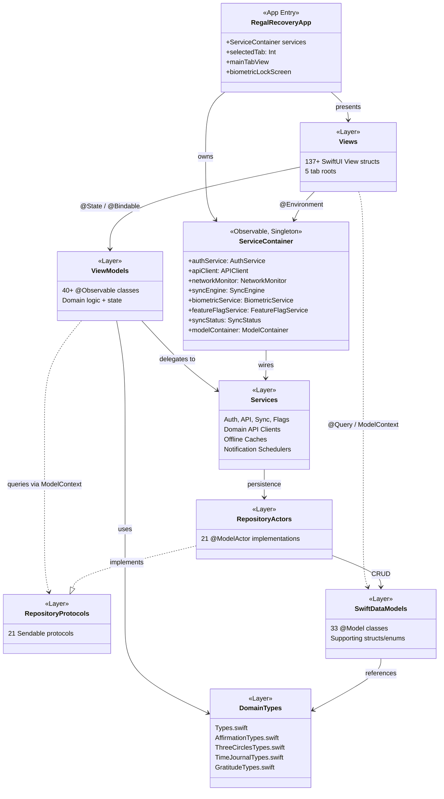
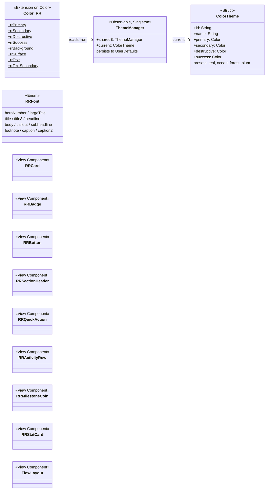

# Regal Recovery iOS -- Class Diagrams

This document contains multiple focused Mermaid class diagrams covering the full iOS architecture.
The diagrams are organized by layer to keep each one readable.

---

## 1. Architecture Overview

High-level layer diagram showing the MVVM + ServiceContainer + Repository pattern.

---

## 2. SwiftData Models

All `@Model` classes with their relationships. Grouped by domain.

```mermaid
classDiagram
    direction TB

    %% ── User & Addiction Core ──

    class RRUser {
        <<Model>>
        +id: UUID
        +name: String
        +email: String
        +birthYear: Int
        +gender: String
        +timezone: String
        +bibleVersion: String
        +motivations: String[]
        +avatarInitial: String
        +createdAt: Date
        +modifiedAt: Date
    }

    class RRAddiction {
        <<Model>>
        +id: UUID
        +name: String
        +sobrietyDate: Date
        +userId: UUID
        +sortOrder: Int
        +createdAt: Date
        +modifiedAt: Date
    }

    class RRStreak {
        <<Model>>
        +id: UUID
        +addictionId: UUID
        +longestStreak: Int
        +totalRelapses: Int
        +currentDays: Int
        +createdAt: Date
    }

    class RRMilestone {
        <<Model>>
        +id: UUID
        +addictionId: UUID
        +days: Int
        +dateEarned: Date
        +scripture: String
    }

    class RRRelapse {
        <<Model>>
        +id: UUID
        +addictionId: UUID
        +date: Date
        +notes: String
        +triggers: String[]
    }

    class RRSupportContact {
        <<Model>>
        +id: UUID
        +userId: UUID
        +name: String
        +role: String
        +phone: String
        +linkedDate: Date
    }

    RRUser "1" --> "*" RRAddiction : addictions (cascade)
    RRUser "1" --> "*" RRSupportContact : supportContacts (cascade)
    RRAddiction "1" --> "*" RRStreak : streaks (cascade)
    RRAddiction "1" --> "*" RRMilestone : milestones (cascade)
    RRAddiction "1" --> "*" RRRelapse : relapses (cascade)

    %% ── Activity & Tracking ──

    class RRActivity {
        <<Model>>
        +id: UUID
        +userId: UUID
        +activityType: String
        +date: Date
        +data: JSONPayload
        +synced: Bool
    }

    class RRCheckIn {
        <<Model>>
        +id: UUID
        +userId: UUID
        +date: Date
        +score: Int
        +answers: JSONPayload
    }

    class RRUrgeLog {
        <<Model>>
        +id: UUID
        +userId: UUID
        +date: Date
        +intensity: Int
        +triggers: String[]
        +notes: String
        +resolution: String
    }

    class RRMoodEntry {
        <<Model>>
        +id: UUID
        +userId: UUID
        +date: Date
        +score: Int
    }

    class RRFASTEREntry {
        <<Model>>
        +id: UUID
        +userId: UUID
        +date: Date
        +stage: Int
        +moodScore: Int?
        +selectedIndicatorsJSON: String?
        +journalInsight: String?
        +journalWarning: String?
    }

    %% ── Journaling ──

    class RRJournalEntry {
        <<Model>>
        +id: UUID
        +userId: UUID
        +date: Date
        +mode: String
        +content: String
        +richContent: String?
        +isEphemeral: Bool
        +ephemeralExpiresAt: Date?
    }

    class RREmotionalJournal {
        <<Model>>
        +id: UUID
        +userId: UUID
        +date: Date
        +emotion: String
        +emotionColor: String
        +intensity: Int
        +activity: String
        +location: String
    }

    class RRTimeBlock {
        <<Model>>
        +id: UUID
        +userId: UUID
        +date: Date
        +startHour: Int
        +startMinute: Int
        +durationMinutes: Int
        +activity: String
        +need: String
    }

    class RRTimeJournalEntry {
        <<Model>>
        +id: UUID
        +userId: UUID
        +date: Date
        +slotIndex: Int
        +mode: String
        +activity: String
        +isFlagged: Bool
        +isSleep: Bool
        +isRetroactive: Bool
        +isAutoFilled: Bool
        +people: PersonEntry[]
        +emotions: EmotionEntry[]
    }

    class RRGratitudeEntry {
        <<Model>>
        +id: UUID
        +userId: UUID
        +date: Date
        +items: GratitudeItem[]
        +moodScore: Int?
        +isFavorite: Bool
    }

    %% ── Activities (Logs) ──

    class RRPrayerLog {
        <<Model>>
        +id: UUID
        +userId: UUID
        +date: Date
        +durationMinutes: Int
        +prayerType: String
    }

    class RRExerciseLog {
        <<Model>>
        +id: UUID
        +userId: UUID
        +date: Date
        +durationMinutes: Int
        +exerciseType: String
    }

    class RRPhoneCallLog {
        <<Model>>
        +id: UUID
        +userId: UUID
        +date: Date
        +contactName: String
        +contactRole: String
        +durationMinutes: Int
    }

    class RRMeetingLog {
        <<Model>>
        +id: UUID
        +userId: UUID
        +date: Date
        +meetingName: String
        +fellowship: String
        +durationMinutes: Int
    }

    class RRSpouseCheckIn {
        <<Model>>
        +id: UUID
        +userId: UUID
        +date: Date
        +framework: String
        +sections: JSONPayload
    }

    %% ── Growth & Planning ──

    class RRStepWork {
        <<Model>>
        +id: UUID
        +userId: UUID
        +stepNumber: Int
        +status: String
        +answers: JSONPayload
    }

    class RRGoal {
        <<Model>>
        +id: UUID
        +userId: UUID
        +title: String
        +dynamic: String
        +isComplete: Bool
        +weekStartDate: Date
    }

    class RRCommitment {
        <<Model>>
        +id: UUID
        +userId: UUID
        +date: Date
        +type: String
        +completedAt: Date?
        +answers: JSONPayload
    }

    %% ── Recovery Plan ──

    class RRRecoveryPlan {
        <<Model>>
        +id: UUID
        +userId: UUID
        +isActive: Bool
        +isPaused: Bool
        +pauseEndDate: Date?
    }

    class RRDailyPlanItem {
        <<Model>>
        +id: UUID
        +planId: UUID
        +activityType: String
        +scheduledHour: Int
        +scheduledMinute: Int
        +instanceIndex: Int
        +daysOfWeek: Int[]
        +isEnabled: Bool
        +sortOrder: Int
    }

    RRRecoveryPlan "1" --> "*" RRDailyPlanItem : items (cascade)

    %% ── Scores & Progress ──

    class RRDailyScore {
        <<Model>>
        +id: UUID
        +userId: UUID
        +date: Date
        +score: Int
        +totalPlanned: Int
        +totalCompleted: Int
        +morningCommitmentCompleted: Bool
        +breakdown: JSONPayload
    }

    class RRDevotionalProgress {
        <<Model>>
        +id: UUID
        +userId: UUID
        +day: Int
        +completedAt: Date?
    }

    class RRAffirmationFavorite {
        <<Model>>
        +id: UUID
        +userId: UUID
        +affirmationText: String
        +scripture: String
        +packName: String
    }

    %% ── Feature Flags ──

    class RRFeatureFlag {
        <<Model>>
        +id: UUID
        +key: String
        +enabled: Bool
        +rolloutPercent: Double
        +flagDescription: String
    }

    %% ── Sync Infrastructure ──

    class RRSyncQueueItem {
        <<Model>>
        +id: String
        +entityType: String
        +entityId: UUID
        +action: String
        +payload: Data
        +retryCount: Int
        +endpointPath: String
        +httpMethod: String
        +conflictStrategy: String
    }

    %% ── Offline Cache Models (nested in Services) ──

    class RRCachedAffirmation {
        <<Model>>
        Nested in AffirmationOfflineCache
    }

    class RROfflineAffirmationSession {
        <<Model>>
        Nested in AffirmationOfflineCache
    }

    class RRCachedCircleSet {
        <<Model>>
        Nested in ThreeCirclesOfflineCache
    }

    class RROfflineCircleMutation {
        <<Model>>
        Nested in ThreeCirclesOfflineCache
    }

    %% ── Supporting Types ──

    class JSONPayload {
        <<Struct>>
        +data: Dictionary~String, AnyCodableValue~
    }

    class AnyCodableValue {
        <<Enum>>
        string / int / double
        bool / array / dictionary / null
    }

    class RRModelConfiguration {
        <<Enum>>
        +allModels$: PersistentModel.Type[]
        +schema$: Schema
        +makeContainer()$ ModelContainer
    }

    JSONPayload --> AnyCodableValue
    RRActivity --> JSONPayload
    RRCheckIn --> JSONPayload
    RRSpouseCheckIn --> JSONPayload
    RRStepWork --> JSONPayload
    RRCommitment --> JSONPayload
    RRDailyScore --> JSONPayload
```

---

## 3. Repository Layer

Protocols linked to their `@ModelActor` implementations and the models they manage.

```mermaid
classDiagram
    direction LR

    %% ── Protocols ──

    class UserRepository {
        <<Protocol, Sendable>>
        +getUser() RRUser?
        +createUser(RRUser)
        +updateUser(RRUser)
    }

    class TrackingRepository {
        <<Protocol, Sendable>>
        +getStreak(addictionId) RRStreak?
        +getStreaks(userId) RRStreak[]
        +getMilestones(addictionId) RRMilestone[]
        +recordRelapse(RRRelapse)
        +createMilestone(RRMilestone)
        +getAddictions(userId) RRAddiction[]
        +createAddiction(RRAddiction)
        +createStreak(RRStreak)
        +getRelapses(addictionId) RRRelapse[]
    }

    class ActivityRepository {
        <<Protocol, Sendable>>
        +logActivity(RRActivity)
        +getActivities() RRActivity[]
        +getActivitiesForDate(Date) RRActivity[]
    }

    class CheckInRepository {
        <<Protocol, Sendable>>
        +logCheckIn(RRCheckIn)
        +getCheckIns() RRCheckIn[]
        +getLatestCheckIn() RRCheckIn?
    }

    class JournalRepository {
        <<Protocol, Sendable>>
        +saveEntry(RRJournalEntry)
        +getEntries() RRJournalEntry[]
        +getEntry(id) RRJournalEntry?
        +deleteEntry(id)
        +purgeExpiredEphemeral() Int
    }

    class EmotionalJournalRepository {
        <<Protocol, Sendable>>
        +saveEntry(RREmotionalJournal)
        +getEntries() RREmotionalJournal[]
        +getEntry(id) RREmotionalJournal?
    }

    class TimeJournalRepository {
        <<Protocol, Sendable>>
        +saveBlock(RRTimeBlock)
        +getBlocks(date) RRTimeBlock[]
        +deleteBlock(id)
    }

    class UrgeLogRepository {
        <<Protocol, Sendable>>
        +logUrge(RRUrgeLog)
        +getUrges() RRUrgeLog[]
        +getLatestUrge() RRUrgeLog?
    }

    class FASTERRepository {
        <<Protocol, Sendable>>
        +saveEntry(RRFASTEREntry)
        +getEntries() RRFASTEREntry[]
        +getLatestEntry() RRFASTEREntry?
    }

    class MoodRepository {
        <<Protocol, Sendable>>
        +saveEntry(RRMoodEntry)
        +getEntries() RRMoodEntry[]
        +getLatestEntry() RRMoodEntry?
    }

    class GratitudeRepository {
        <<Protocol, Sendable>>
        +saveEntry(RRGratitudeEntry)
        +getEntries() RRGratitudeEntry[]
    }

    class PrayerRepository {
        <<Protocol, Sendable>>
        +logPrayer(RRPrayerLog)
        +getLogs() RRPrayerLog[]
    }

    class ExerciseRepository {
        <<Protocol, Sendable>>
        +logExercise(RRExerciseLog)
        +getLogs() RRExerciseLog[]
    }

    class PhoneCallRepository {
        <<Protocol, Sendable>>
        +logCall(RRPhoneCallLog)
        +getLogs() RRPhoneCallLog[]
    }

    class MeetingRepository {
        <<Protocol, Sendable>>
        +logMeeting(RRMeetingLog)
        +getLogs() RRMeetingLog[]
    }

    class SpouseCheckInRepository {
        <<Protocol, Sendable>>
        +saveCheckIn(RRSpouseCheckIn)
        +getCheckIns() RRSpouseCheckIn[]
        +getLatestCheckIn() RRSpouseCheckIn?
    }

    class StepWorkRepository {
        <<Protocol, Sendable>>
        +saveStep(RRStepWork)
        +getStep(number) RRStepWork?
        +getAllSteps() RRStepWork[]
        +updateStepStatus(stepNumber, status)
    }

    class GoalRepository {
        <<Protocol, Sendable>>
        +saveGoal(RRGoal)
        +getGoals(weekStartDate) RRGoal[]
        +getCurrentWeekGoals() RRGoal[]
        +updateGoalCompletion(id, isComplete)
    }

    class CommitmentRepository {
        <<Protocol, Sendable>>
        +saveCommitment(RRCommitment)
        +getCommitments(date) RRCommitment[]
        +getLatestCommitment(type) RRCommitment?
        +markComplete(id)
    }

    class SupportContactRepository {
        <<Protocol, Sendable>>
        +saveContact(RRSupportContact)
        +getContacts(userId) RRSupportContact[]
        +deleteContact(id)
    }

    class FeatureFlagRepository {
        <<Protocol, Sendable>>
        +getAllFlags() RRFeatureFlag[]
        +getFlag(key) RRFeatureFlag?
        +isEnabled(key) Bool
        +saveFlag(RRFeatureFlag)
        +updateFlag(key, enabled)
    }

    class AffirmationRepository {
        <<Protocol, Sendable>>
        +saveFavorite(RRAffirmationFavorite)
        +getFavorites(userId) RRAffirmationFavorite[]
        +removeFavorite(id)
    }

    class DevotionalRepository {
        <<Protocol, Sendable>>
        +saveProgress(RRDevotionalProgress)
        +getProgress(userId) RRDevotionalProgress[]
        +markComplete(day, userId)
        +getCompletedDayCount(userId) Int
    }

    class RecoveryPlanRepository {
        <<Protocol, Sendable>>
        +getActivePlan(userId) RRRecoveryPlan?
        +createPlan(RRRecoveryPlan)
        +addPlanItem(RRDailyPlanItem)
        +updatePlanItem(RRDailyPlanItem)
        +deletePlanItem(RRDailyPlanItem)
        +getPlanItems(planId, dayOfWeek) RRDailyPlanItem[]
    }

    class DailyScoreRepository {
        <<Protocol, Sendable>>
        +getScore(userId, date) RRDailyScore?
        +saveScore(RRDailyScore)
        +getScores(userId, from, to) RRDailyScore[]
    }

    class SyncQueueRepository {
        <<Protocol, Sendable>>
        +enqueue(RRSyncQueueItem)
        +dequeue(limit) RRSyncQueueItem[]
        +markCompleted(id)
        +incrementRetry(id)
        +pendingCount() Int
    }

    %% ── Actor Implementations ──

    class SwiftDataUserRepository {
        <<ModelActor>>
    }
    class SwiftDataTrackingRepository {
        <<ModelActor>>
    }
    class SwiftDataActivityRepository {
        <<ModelActor>>
    }
    class SwiftDataCheckInRepository {
        <<ModelActor>>
    }
    class SwiftDataJournalRepository {
        <<ModelActor>>
    }
    class SwiftDataEmotionalJournalRepository {
        <<ModelActor>>
    }
    class SwiftDataTimeJournalRepository {
        <<ModelActor>>
    }
    class SwiftDataUrgeLogRepository {
        <<ModelActor>>
    }
    class SwiftDataFASTERRepository {
        <<ModelActor>>
    }
    class SwiftDataMoodRepository {
        <<ModelActor>>
    }
    class SwiftDataGratitudeRepository {
        <<ModelActor>>
    }
    class SwiftDataPrayerRepository {
        <<ModelActor>>
    }
    class SwiftDataExerciseRepository {
        <<ModelActor>>
    }
    class SwiftDataPhoneCallRepository {
        <<ModelActor>>
    }
    class SwiftDataMeetingRepository {
        <<ModelActor>>
    }
    class SwiftDataSpouseCheckInRepository {
        <<ModelActor>>
    }
    class SwiftDataStepWorkRepository {
        <<ModelActor>>
    }
    class SwiftDataGoalRepository {
        <<ModelActor>>
    }
    class SwiftDataCommitmentRepository {
        <<ModelActor>>
    }
    class SwiftDataSupportContactRepository {
        <<ModelActor>>
    }
    class SwiftDataFeatureFlagRepository {
        <<ModelActor>>
    }
    class SwiftDataAffirmationRepository {
        <<ModelActor>>
    }
    class SwiftDataDevotionalRepository {
        <<ModelActor>>
    }
    class SwiftDataRecoveryPlanRepository {
        <<ModelActor>>
    }
    class SwiftDataDailyScoreRepository {
        <<ModelActor>>
    }
    class SwiftDataSyncQueueRepository {
        <<ModelActor>>
    }

    SwiftDataUserRepository ..|> UserRepository
    SwiftDataTrackingRepository ..|> TrackingRepository
    SwiftDataActivityRepository ..|> ActivityRepository
    SwiftDataCheckInRepository ..|> CheckInRepository
    SwiftDataJournalRepository ..|> JournalRepository
    SwiftDataEmotionalJournalRepository ..|> EmotionalJournalRepository
    SwiftDataTimeJournalRepository ..|> TimeJournalRepository
    SwiftDataUrgeLogRepository ..|> UrgeLogRepository
    SwiftDataFASTERRepository ..|> FASTERRepository
    SwiftDataMoodRepository ..|> MoodRepository
    SwiftDataGratitudeRepository ..|> GratitudeRepository
    SwiftDataPrayerRepository ..|> PrayerRepository
    SwiftDataExerciseRepository ..|> ExerciseRepository
    SwiftDataPhoneCallRepository ..|> PhoneCallRepository
    SwiftDataMeetingRepository ..|> MeetingRepository
    SwiftDataSpouseCheckInRepository ..|> SpouseCheckInRepository
    SwiftDataStepWorkRepository ..|> StepWorkRepository
    SwiftDataGoalRepository ..|> GoalRepository
    SwiftDataCommitmentRepository ..|> CommitmentRepository
    SwiftDataSupportContactRepository ..|> SupportContactRepository
    SwiftDataFeatureFlagRepository ..|> FeatureFlagRepository
    SwiftDataAffirmationRepository ..|> AffirmationRepository
    SwiftDataDevotionalRepository ..|> DevotionalRepository
    SwiftDataRecoveryPlanRepository ..|> RecoveryPlanRepository
    SwiftDataDailyScoreRepository ..|> DailyScoreRepository
    SwiftDataSyncQueueRepository ..|> SyncQueueRepository
```

---

## 4. Service Layer

ServiceContainer and all services with their dependencies.

```mermaid
classDiagram
    direction TB

    %% ── Service Container ──

    class ServiceContainer {
        <<Observable, Singleton>>
        +shared$: ServiceContainer
        +authService: AuthService
        +apiClient: APIClient
        +networkMonitor: NetworkMonitor
        +syncEngine: SyncEngine
        +biometricService: BiometricService
        +featureFlagService: FeatureFlagService
        +syncStatus: SyncStatus
        +modelContainer: ModelContainer
        +isLocalOnly: Bool
        +isFeatureEnabled(key) Bool
        +onForeground()
    }

    %% ── Auth Services ──

    class AuthService {
        <<Observable>>
        +isAuthenticated: Bool
        +currentUser: AuthUser?
        +accessToken: String?
        +currentRefreshToken: String?
        +register()
        +login()
        +logout()
        +signOut()
        +refreshTokenIfNeeded()
        +updateTokens()
        +enableLocalMode()
    }

    class AuthUser {
        <<Struct, Codable>>
        +id: String
        +email: String
        +name: String
        +tenantId: String
    }

    class BiometricService {
        <<Observable>>
        +biometricType: BiometricType
        +biometricName: String
        +canUseBiometrics() Bool
        +authenticate(reason) Bool
    }

    class KeychainHelper {
        <<Enum, Static>>
        +save(key, data)
        +read(key) Data?
        +delete(key)
    }

    class AuthServiceTokenProvider {
        <<Struct, Sendable>>
        +accessToken: String?
        +refreshToken: String?
        +updateTokens()
        +clearTokens()
    }

    class AuthTokenProvider {
        <<Protocol, Sendable>>
        +accessToken: String?
        +refreshToken: String?
        +updateTokens()
        +clearTokens()
    }

    %% ── API Services ──

    class APIClient {
        <<Sendable>>
        +configuration: APIClientConfiguration
        +authProvider: AuthTokenProvider?
        +get~T~(endpoint) T
        +post~T~(endpoint, body) T
        +put~T~(endpoint, body) T
        +patch~T~(endpoint, body) T
        +delete(endpoint)
    }

    class APIClientConfiguration {
        <<Struct, Sendable>>
        +baseURL: URL
        +maxRetries: Int
        +initialRetryDelay: TimeInterval
        +requestTimeout: TimeInterval
        +local$: APIClientConfiguration
        +staging$: APIClientConfiguration
        +production$: APIClientConfiguration
    }

    class APIError {
        <<Enum>>
        unauthorized
        forbidden
        notFound
        serverError
        networkError
        offline
        +isRetryable: Bool
    }

    class Endpoint {
        <<Enum>>
        30+ cases
        +path: String
        +method: HTTPMethod
        +requiresAuth: Bool
    }

    class HTTPMethod {
        <<Enum>>
        get / post / put / patch / delete
    }

    %% ── Sync Services ──

    class SyncEngine {
        <<Observable>>
        +apiClient: APIClient
        +networkMonitor: NetworkMonitor
        +modelContainer: ModelContainer
        +status: SyncStatus
        +start()
        +stop()
        +triggerSync()
        +enqueue()
        +onAppForeground()
    }

    class SyncStatus {
        <<Observable, Sendable>>
        +state: State
        +pendingCount: Int
        +lastSyncDate: Date?
        +lastError: String?
        +update(state, pendingCount, error)
    }

    class ConflictStrategy {
        <<Enum, Sendable>>
        union
        earliestDate
        lastWriteWins
        +forEndpoint(path)$ ConflictStrategy
    }

    class NetworkMonitor {
        <<Observable>>
        +isConnected: Bool
        +connectionType: ConnectionType
        +isExpensive: Bool
        +start()
        +stop()
    }

    %% ── Feature Flags ──

    class FeatureFlagService {
        <<Observable>>
        +flags: Dictionary
        +isEnabled(key) Bool
        +setFlag(key, enabled)
        +loadFromUserDefaults()
        +syncFromServer(baseURL, accessToken)
    }

    class FeatureFlagStore {
        <<Observable, Singleton>>
        +shared$: FeatureFlagStore
        +version: Int
        +flagDefaults$: Dictionary
        +isEnabled(key) Bool
        +setFlag(key, enabled)
        +seedDefaultsIfNeeded()
    }

    %% ── Domain API Clients ──

    class AffirmationsAPIClient {
        <<Sendable>>
        -apiClient: APIClient
        27 methods: sessions, library,
        favorites, hidden, custom, audio,
        progress, settings, level, sharing
    }

    class ThreeCirclesAPIClient {
        <<Sendable>>
        -apiClient: APIClient
        26 methods: circle sets, items,
        versions, templates, starter packs,
        onboarding, sponsor, patterns, reviews
    }

    %% ── Notification & Reminder ──

    class PlanNotificationScheduler {
        +scheduleFromPlan(items, userName)
        +scheduleCompletionAcknowledgment()
    }

    class TimeJournalReminderManager {
        <<Singleton>>
        +shared$: TimeJournalReminderManager
        +scheduleSlotReminders()
        +scheduleEndOfDayReview()
    }

    %% ── Gratitude Services ──

    class GratitudePromptService {
        +allPrompts: GratitudePrompt[]
        +dailyPrompt() GratitudePrompt
        +nextPrompt() GratitudePrompt
    }

    class GratitudeSharingService {
        <<Struct, Static>>
        +shareText()$
        +styledImage()$
    }

    %% ── Offline Caches ──

    class AffirmationOfflineCache {
        <<Observable>>
        owns RRCachedAffirmation
        owns RROfflineAffirmationSession
    }

    class ThreeCirclesOfflineCache {
        <<Observable>>
        owns RRCachedCircleSet
        owns RROfflineCircleMutation
    }

    %% ── Audio ──

    class AffirmationAudioSessionManager {
        <<Observable>>
        +state: AudioState
        +voiceVolume: Float
        +backgroundMusicVolume: Float
    }

    %% ── Focus ──

    class FocusStatusMonitor {
        <<Singleton>>
        +shared$: FocusStatusMonitor
        monitors Sleep Focus
        auto-fills time journal slots
    }

    %% ── Relationships ──

    ServiceContainer --> AuthService
    ServiceContainer --> APIClient
    ServiceContainer --> NetworkMonitor
    ServiceContainer --> SyncEngine
    ServiceContainer --> BiometricService
    ServiceContainer --> FeatureFlagService
    ServiceContainer --> SyncStatus

    AuthService --> KeychainHelper : persists tokens
    AuthService --> AuthUser : currentUser
    AuthServiceTokenProvider --> AuthService : bridges
    AuthServiceTokenProvider ..|> AuthTokenProvider

    APIClient --> APIClientConfiguration
    APIClient --> AuthTokenProvider : injects tokens
    APIClient --> Endpoint : resolves paths
    APIClient --> HTTPMethod
    APIClient --> APIError : throws

    SyncEngine --> APIClient
    SyncEngine --> NetworkMonitor
    SyncEngine --> SyncStatus : updates
    SyncEngine --> ConflictStrategy

    AffirmationsAPIClient --> APIClient : wraps
    ThreeCirclesAPIClient --> APIClient : wraps
```

---

## 5. ViewModel Layer

All ViewModels with their service/repository dependencies.

```mermaid
classDiagram
    direction TB

    %% ── Tab Root ViewModels ──

    class TodayViewModel {
        <<Observable>>
        +greeting: String
        +streakDays: Int
        +planItems: TodayPlanItem[]
        +score: Int
        +scoreLevel: DailyScoreLevel
        +load(context)
    }

    class RecoveryWorkViewModel {
        <<Observable>>
        +allTiles$: WorkTileItem[]
        +todayStatus()$
    }

    class ProgressViewModel {
        <<Observable>>
        +streak: StreakData?
        +weeklyCheckInAverage: Double
        +fasterScaleMode: FASTERStage?
        +moodAverage: Double
        +stepProgress: Double
    }

    class HomeViewModel {
        <<Observable>>
        +streak: StreakData?
        +commitmentStatus: CommitmentStatus?
        +recentActivity: RecentActivity[]
        +milestones: Milestone[]
        +motivations: String[]
        +load(context)
    }

    %% ── Settings ViewModels ──

    class ProfileViewModel {
        <<Observable>>
        +user profile management
    }

    class PrivacyViewModel {
        <<Observable>>
        +privacy settings
    }

    class FeatureFlagViewModel {
        <<Observable>>
        +features, activities, assessments
    }

    class NotificationViewModel {
        <<Observable>>
        +settings: NotificationSetting[]
    }

    class RecoveryPlanViewModel {
        <<Observable>>
        +planItems: PlanItemState[]
        +manages daily plan items
    }

    %% ── Activity ViewModels ──

    class AffirmationSessionViewModel {
        <<Observable>>
        -apiClient: AffirmationsAPIClient
        +flowStep: AffirmationFlowStep
        +morning/evening/SOS sessions
    }

    class AffirmationsViewModel {
        <<Observable>>
        +packs, favorites
        +weighted delivery algorithm
    }

    class CheckInViewModel {
        <<Observable>>
        +scoreWeights
        Sobriety 30pct, Engagement 25pct
        Emotional 20pct, Connection 15pct
        Growth 10pct
    }

    class FASTERCheckInViewModel {
        <<Observable>>
        +step: FASTERCheckInStep
        +moodScore: Int
        +selectedIndicators
    }

    class FASTERScaleViewModel {
        <<Observable>>
        +currentPhase: FASTERStage?
        +history: FASTEREntry[]
        +assessedStage: FASTERStage?
    }

    class MoodViewModel {
        <<Observable>>
        +todayMood: Int?
        +weeklyMoods
        +averageMood: Double
    }

    class EmotionalJournalViewModel {
        <<Observable>>
        +entries, insights, form state
    }

    class ExerciseViewModel {
        <<Observable>>
        +history: ExerciseEntry[]
    }

    class GratitudeEntryViewModel {
        <<Observable>>
        -promptService: GratitudePromptService
        +items: GratitudeItemDraft[]
    }

    class GratitudeHistoryViewModel {
        <<Observable>>
        +tab: HistoryTab
        +entries
    }

    class GratitudeTrendsViewModel {
        <<Observable>>
        +period: TrendPeriod
        +streak, category, correlation analysis
    }

    class GratitudeViewModel {
        <<Observable>>
        +aggregate gratitude view
    }

    class GoalViewModel {
        <<Observable>>
        +goals, dynamics
    }

    class CommitmentViewModel {
        <<Observable>>
        +morningQuestions
        +eveningQuestions
    }

    class JournalViewModel {
        <<Observable>>
        +createEntry, deleteEntry
    }

    class SpouseCheckInViewModel {
        <<Observable>>
        +FANOS + FITNAP frameworks
    }

    class DevotionalViewModel {
        <<Observable>>
        +days, currentDay, completedDays
    }

    class MeetingViewModel {
        <<Observable>>
        +attendanceHistory
    }

    class MeetingFinderViewModel {
        <<Observable>>
        +meetings, savedMeetings
        +activeFilters
    }

    class StepWorkViewModel {
        <<Observable>>
        +steps: StepWorkItem[]
    }

    class UrgeLogViewModel {
        <<Observable>>
        +log urges, history
    }

    class PhoneCallViewModel {
        <<Observable>>
        +log calls, history
    }

    class PrayerViewModel {
        <<Observable>>
        +log prayers, history
    }

    class ActivityViewModel {
        <<Observable>>
        +generic activity logging
    }

    class StreakViewModel {
        <<Observable>>
        +milestoneThresholds$
        +streak management
    }

    class UrgeSurfingViewModel {
        <<Observable>>
        +timer state
        +breathing exercises
    }

    %% ── Three Circles ViewModels ──

    class ThreeCirclesViewModel {
        <<Observable>>
        +redCircle, yellowCircle, greenCircle
    }

    class ThreeCirclesBuilderViewModel {
        <<Observable>>
        +guided builder flow
    }

    class CircleSetDetailViewModel {
        <<Observable>>
        -apiClient: ThreeCirclesAPIClient
        +circle set management
    }

    class PatternViewModel {
        <<Observable>>
        -apiClient: ThreeCirclesAPIClient
        +pattern analysis
    }

    %% ── Time Journal ViewModels ──

    class TimeJournalViewModel {
        <<Observable>>
        +slots, dailyStatus
        +requires ModelContext
    }

    class TimeJournalEntryViewModel {
        <<Observable>>
        +single slot entry
    }

    %% ── Utility ──

    class DailyScoreCalculator {
        <<Struct>>
        +calculate()$
        +level()$
    }

    class ActivityError {
        <<Enum>>
        validationFailed
        saveFailed
        notImplemented
    }

    %% ── Dependencies ──

    AffirmationSessionViewModel --> AffirmationsAPIClient : uses
    CircleSetDetailViewModel --> ThreeCirclesAPIClient : uses
    PatternViewModel --> ThreeCirclesAPIClient : uses
    GratitudeEntryViewModel --> GratitudePromptService : uses
    NotificationViewModel --> PlanNotificationScheduler : uses
    TodayViewModel --> DailyScoreCalculator : uses
    RecoveryWorkViewModel --> FeatureFlagStore : checks flags
    HomeViewModel --> StreakViewModel : milestoneThresholds
```

---

## 6. View-to-ViewModel Mapping

Which Views instantiate or bind to which ViewModels. Views using `@Environment(\.modelContext)` directly (bypassing a ViewModel) are marked.

```mermaid
classDiagram
    direction LR

    %% ── Tab Roots ──

    class TodayView {
        <<View>>
        @State TodayViewModel
        @Environment modelContext
    }
    TodayView --> TodayViewModel

    class RecoveryWorkView {
        <<View>>
        @Environment modelContext
        uses RecoveryWorkViewModel static
    }
    RecoveryWorkView ..> RecoveryWorkViewModel

    class RecoveryProgressView {
        <<View>>
        Direct ModelContext queries
    }

    class ContentTabView {
        <<View>>
        Static content routing
    }

    class SettingsView {
        <<View>>
        Direct ModelContext / @Environment
    }

    %% ── Home ──

    class HomeView {
        <<View>>
        Uses StreakViewModel static ref
        Direct ModelContext queries
    }
    HomeView ..> StreakViewModel

    %% ── Activities: Affirmations ──

    class AffirmationsHubView {
        <<View>>
        @State AffirmationSessionViewModel
        @Environment modelContext
    }
    AffirmationsHubView --> AffirmationSessionViewModel

    class MorningSessionFlowView {
        <<View>>
    }
    MorningSessionFlowView --> AffirmationSessionViewModel

    class EveningReflectionFlowView {
        <<View>>
    }
    EveningReflectionFlowView --> AffirmationSessionViewModel

    %% ── Activities: FASTER ──

    class FASTERCheckInFlowView {
        <<View>>
        @State FASTERCheckInViewModel
        @Environment modelContext
    }
    FASTERCheckInFlowView --> FASTERCheckInViewModel

    class FASTERResultsView {
        <<View>>
        @Bindable FASTERCheckInViewModel
    }
    FASTERResultsView --> FASTERCheckInViewModel

    class FASTERIndicatorSelectionView {
        <<View>>
        @Bindable FASTERCheckInViewModel
    }
    FASTERIndicatorSelectionView --> FASTERCheckInViewModel

    %% ── Activities: Gratitude ──

    class GratitudeListView {
        <<View>>
        @State GratitudeEntryViewModel
        @Environment modelContext
    }
    GratitudeListView --> GratitudeEntryViewModel

    class GratitudeHistoryView {
        <<View>>
        @State GratitudeHistoryViewModel
        @Environment modelContext
    }
    GratitudeHistoryView --> GratitudeHistoryViewModel

    class GratitudeDetailView {
        <<View>>
        @State GratitudeHistoryViewModel
        @Environment modelContext
    }
    GratitudeDetailView --> GratitudeHistoryViewModel

    class GratitudeTrendsView {
        <<View>>
        @State GratitudeTrendsViewModel
    }
    GratitudeTrendsView --> GratitudeTrendsViewModel

    %% ── Activities: Time Journal ──

    class TimeJournalDailyView {
        <<View>>
        @State TimeJournalViewModel?
        @Environment modelContext
    }
    TimeJournalDailyView --> TimeJournalViewModel
    TimeJournalDailyView ..> TimeJournalEntryViewModel

    class TimeJournalTimelineView {
        <<View>>
        let TimeJournalViewModel
    }
    TimeJournalTimelineView --> TimeJournalViewModel

    %% ── Activities: Check-In ──

    class RecoveryCheckInView {
        <<View>>
        Uses CheckInViewModel
        @Environment modelContext
    }
    RecoveryCheckInView --> CheckInViewModel

    %% ── Activities: Journal ──

    class JournalView {
        <<View>>
        Uses JournalViewModel
        @Environment modelContext
    }
    JournalView --> JournalViewModel

    %% ── Activities: Direct ModelContext (no explicit ViewModel) ──

    class UrgeLogView {
        <<View>>
        @Environment modelContext
    }

    class EmotionalJournalView {
        <<View>>
        @Environment modelContext
    }

    class MoodRatingView {
        <<View>>
        @Environment modelContext
    }

    class PrayerLogView {
        <<View>>
        @Environment modelContext
    }

    class ExerciseLogView {
        <<View>>
        @Environment modelContext
    }

    class PhoneCallLogView {
        <<View>>
        @Environment modelContext
    }

    class MeetingsAttendedView {
        <<View>>
        @Environment modelContext
    }

    class MorningCommitmentView {
        <<View>>
        @Environment modelContext
    }

    class WeeklyGoalsView {
        <<View>>
        @Environment modelContext
    }

    class StepWorkView {
        <<View>>
        @Environment modelContext
    }

    class FANOSCheckInView {
        <<View>>
        @Environment modelContext
    }

    class FITNAPCheckInView {
        <<View>>
        @Environment modelContext
    }

    class SobrietyCommitmentView {
        <<View>>
        @Environment modelContext
    }

    class EveningReviewView {
        <<View>>
        @Environment modelContext
    }

    class PostMortemView {
        <<View>>
        @Environment modelContext
    }

    %% ── Tools: Three Circles ──

    class ThreeCirclesBuilderView {
        <<View>>
        @State ThreeCirclesBuilderViewModel
    }
    ThreeCirclesBuilderView --> ThreeCirclesBuilderViewModel

    class CircleSetDetailView {
        <<View>>
        @State CircleSetDetailViewModel
    }
    CircleSetDetailView --> CircleSetDetailViewModel

    class PatternDashboardView {
        <<View>>
        @Bindable PatternViewModel
    }
    PatternDashboardView --> PatternViewModel

    %% ── Emergency ──

    class UrgeSurfingTimerView {
        <<View>>
        @State UrgeSurfingViewModel
        @Environment modelContext
    }
    UrgeSurfingTimerView --> UrgeSurfingViewModel

    class EmergencyOverlayView {
        <<View>>
        @Environment modelContext
    }

    %% ── Settings ──

    class RecoveryPlanSetupView {
        <<View>>
        @State RecoveryPlanViewModel
        @Environment modelContext
    }
    RecoveryPlanSetupView --> RecoveryPlanViewModel

    class NotificationSettingsView {
        <<View>>
        @State NotificationViewModel
        @Environment modelContext
    }
    NotificationSettingsView --> NotificationViewModel

    class DevotionalView {
        <<View>>
        @Environment modelContext
    }

    class ProfileEditView {
        <<View>>
        @Environment modelContext
    }
```

---

## 7. Domain Type Enums and Structs

Key domain types from `Types.swift` and feature-specific type files.

```mermaid
classDiagram
    direction TB

    %% ── Types.swift ──

    class ActivityType {
        <<Enum, 18 cases>>
        sobrietyCommitment
        recoveryCheckIn
        journal / timeJournal
        fasterScale / postMortem
        urgeLog / mood / gratitude
        prayer / exercise
        phoneCalls / meetingsAttended
        fanos / fitnap
        stepWork / weeklyGoals
        affirmationLog
    }

    class ActivitySection {
        <<Enum, 5 cases>>
        sobrietyCommitment
        journalingReflection
        selfCare
        connection
        growth
    }

    class FASTERStage {
        <<Enum, 7 cases>>
        restoration(-1)
        forgettingPriorities(0)
        anxiety(1) / speedingUp(2)
        tickedOff(3) / exhausted(4)
        relapse(5)
        +indicators: String[]
        +adaptiveContent
    }

    class DailyPlanActivityState {
        <<Enum, 5 cases>>
        completed / pending
        upcoming / overdue / skipped
    }

    class DailyScoreLevel {
        <<Enum, 5 cases>>
        excellent(90-100)
        strong(70-89)
        moderate(50-69)
        low(25-49)
        minimal(0-24)
    }

    class AppearanceMode {
        <<Enum>>
        system / light / dark
    }

    class OnboardingStep {
        <<Enum>>
        welcome / account
        recovery / permissions
    }

    class ContactRole {
        <<Enum>>
        sponsor / counselor
        spouse / accountabilityPartner
    }

    class HistoryItemType {
        <<Enum, 14 cases>>
        morningCommitment / eveningReview
        recoveryCheckIn / journal
        fasterScale / urgeLog / mood
        gratitude / prayer / exercise
        phoneCall / meeting
        fanos / fitnap
    }

    class PrimaryEmotion {
        <<Enum, 6 cases>>
        happy / sad / angry
        fearful / disgusted / surprised
        +secondaryEmotions: String[]
    }

    class CheckInPhase {
        <<Enum>>
        mood / scale / results
    }

    class StepStatus {
        <<Enum>>
        complete / inProgress / locked
    }

    %% ── View-layer structs ──

    class UserProfile {
        <<Struct>>
    }
    class StreakData {
        <<Struct>>
    }
    class Milestone_Type {
        <<Struct>>
    }
    class SupportContact_Type {
        <<Struct>>
    }
    class ActivityEntry {
        <<Struct>>
    }
    class FASTEREntry_Type {
        <<Struct>>
    }
    class CheckInEntry {
        <<Struct>>
    }
    class EmotionalJournalEntry_Type {
        <<Struct>>
    }
    class TimeBlock_Type {
        <<Struct>>
    }
    class Meeting_Type {
        <<Struct>>
    }
    class CommitmentQuestion {
        <<Struct>>
    }
    class CommitmentStatus {
        <<Struct>>
    }
    class WeeklyGoal {
        <<Struct>>
    }
    class StepWorkItem {
        <<Struct>>
    }
    class RecentActivity {
        <<Struct>>
    }
    class GlossaryTerm {
        <<Struct>>
    }
    class CrisisResource {
        <<Struct>>
    }
    class NotificationSetting {
        <<Struct>>
    }
    class PromptItem {
        <<Struct>>
    }
    class DailyEligibleActivity {
        <<Struct>>
    }

    %% ── AffirmationTypes.swift ──

    class AffirmationCategory {
        <<Enum, 10 cases>>
    }
    class AffirmationLevel {
        <<Enum>>
    }
    class AffirmationSessionType {
        <<Enum>>
    }
    class AffirmationBackgroundMusic {
        <<Enum, 5 cases>>
    }

    %% ── ThreeCirclesTypes.swift ──

    class CircleType {
        <<Enum>>
    }
    class CircleSetStatus {
        <<Enum>>
    }
    class RecoveryArea {
        <<Enum, 10 cases>>
    }
    class FrameworkPreference {
        <<Enum, 12 cases>>
    }
    class InsightType {
        <<Enum, 6 cases>>
    }

    %% ── TimeJournalTypes.swift ──

    class TimeJournalMode {
        <<Enum>>
        t30 / t60
    }
    class TimeJournalSlotStatus {
        <<Enum, 5 cases>>
        empty / filled / flagged
        autoFilled / retroactive
    }
    class PersonEntry {
        <<Struct, Codable>>
    }
    class EmotionEntry {
        <<Struct, Codable>>
    }
    class EmotionCatalog {
        <<Enum, 9 categories>>
    }

    %% ── GratitudeTypes.swift ──

    class GratitudeCategory {
        <<Enum, 10 cases>>
    }
    class GratitudeItem {
        <<Struct, Codable>>
    }
    class MoodIcon {
        <<Enum>>
    }

    %% ── Static Content ──

    class ContentData {
        <<Enum, Static Namespace>>
        affirmation packs
        30-day devotional
        prayers, prompts, glossary
        crisis resources, motivations
        commitment questions
    }

    class MockData {
        <<Enum, Static Namespace>>
        270-day mock recovery journey
        Used in previews and tests
    }

    class SeedData {
        <<Enum, Static>>
        +seedDatabase(context)
        Used at app launch for demo data
    }

    class BigBookData {
        <<Enum, Static>>
        +chapters: BigBookChapter[]
    }

    class BookCatalog {
        <<Enum, Static>>
        +bigBook: Book
    }

    class BookData {
        <<Supporting types>>
        Book, BookChapter
        NumberStyle enum
    }
```

---

## 8. Theme Layer

