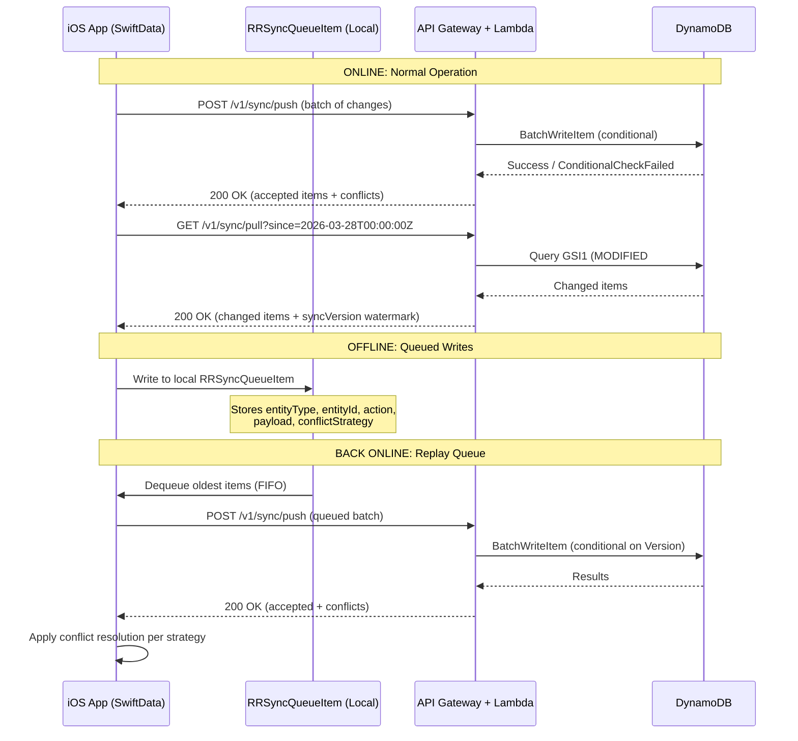
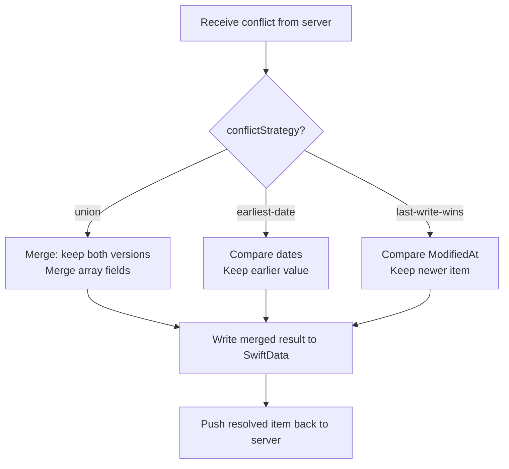

# Regal Recovery -- DynamoDB ERD Proposal

**Version:** 1.0.0
**Date:** 2026-04-02
**Status:** Proposed
**Related:** [API Data Model](architecture/api-data-model.md) | [AWS Infrastructure](architecture/aws-infrastructure.md)

---

## Table of Contents

1. [Design Philosophy](#1-design-philosophy)
2. [Entity Relationship Diagram](#2-entity-relationship-diagram)
3. [Single-Table Design](#3-single-table-design)
4. [Access Patterns](#4-access-patterns)
5. [Entity Mappings](#5-entity-mappings)
6. [Global Secondary Indexes](#6-global-secondary-indexes)
7. [TTL Strategy](#7-ttl-strategy)
8. [Offline-First Sync Strategy](#8-offline-first-sync-strategy)
9. [Cost Considerations](#9-cost-considerations)
10. [SwiftData Migration Guide](#10-swiftdata-migration-guide)
11. [Open Questions](#11-open-questions)

---

## 1. Design Philosophy

### Why Single-Table Design

Regal Recovery is a user-centric application where virtually every query is scoped to a single user. This makes single-table design an excellent fit:

- **All 30 entities belong to a user.** The partition key `USER#<userId>` co-locates all user data, enabling efficient queries without joins.
- **Predictable access patterns.** The app has a finite, well-understood set of read/write patterns (enumerated below). We are not building an ad-hoc analytics platform.
- **Minimized round trips.** A single `Query` call retrieves all entities of a type for a user, or even multiple entity types in a single request using begins_with on the sort key.
- **Cost efficiency.** One table means one set of on-demand capacity, one set of GSIs, and simpler operational overhead.

### Trade-offs

| Advantage | Disadvantage |
|-----------|--------------|
| Single round-trip for user-scoped queries | Schema is encoded in key design, not in a DDL -- harder to reason about without documentation |
| No cross-table joins needed | Requires careful GSI planning upfront; adding new access patterns later may require new GSIs |
| On-demand billing scales linearly | Hot partition risk if a single user generates extreme write volume (mitigated by DynamoDB adaptive capacity) |
| Simple IAM policies (one table) | Backfill and migration require scanning the entire table with entity type filters |

### Key Design Decisions

- **Two tables, not one.** We use a primary table (`rr-main`) for all user-scoped and application data, plus a separate `rr-feature-flags` table for feature flags. Feature flags have completely different access patterns (global reads, admin writes) and should not share capacity with user data.
- **Date-partitioned sort keys.** For time-series entities (check-ins, journal entries, urge logs), the sort key includes an ISO date prefix (`YYYY-MM-DD`) to enable efficient date-range queries.
- **UUID preservation.** SwiftData entity IDs (UUIDs) are preserved as an attribute on every item, but the DynamoDB sort key uses a composite of entity-type prefix + date + UUID to support range queries. This enables bidirectional mapping between SwiftData and DynamoDB.

---

## 2. Entity Relationship Diagram

```mermaid
erDiagram
    RRUser ||--o{ RRAddiction : "tracks"
    RRUser ||--o{ RRActivity : "logs"
    RRUser ||--o{ RRCheckIn : "completes"
    RRUser ||--o{ RRJournalEntry : "writes"
    RRUser ||--o{ RREmotionalJournal : "writes"
    RRUser ||--o{ RRTimeBlock : "schedules"
    RRUser ||--o{ RRUrgeLog : "records"
    RRUser ||--o{ RRFASTEREntry : "assesses"
    RRUser ||--o{ RRMoodEntry : "tracks"
    RRUser ||--o{ RRGratitudeEntry : "lists"
    RRUser ||--o{ RRPrayerLog : "logs"
    RRUser ||--o{ RRExerciseLog : "logs"
    RRUser ||--o{ RRPhoneCallLog : "records"
    RRUser ||--o{ RRMeetingLog : "attends"
    RRUser ||--o{ RRSpouseCheckIn : "shares"
    RRUser ||--o{ RRStepWork : "progresses"
    RRUser ||--o{ RRGoal : "sets"
    RRUser ||--o{ RRCommitment : "commits"
    RRUser ||--o{ RRSupportContact : "connects"
    RRUser ||--o{ RRAffirmationFavorite : "favorites"
    RRUser ||--o{ RRDevotionalProgress : "reads"
    RRUser ||--o{ RRRecoveryPlan : "follows"
    RRUser ||--o{ RRDailyScore : "earns"

    RRAddiction ||--o{ RRStreak : "has"
    RRAddiction ||--o{ RRMilestone : "unlocks"
    RRAddiction ||--o{ RRRelapse : "records"
    RRAddiction ||--o{ RRUrgeLog : "triggers"

    RRRecoveryPlan ||--o{ RRDailyPlanItem : "contains"

    RRUser {
        UUID id PK
        String name
        String email
        Int birthYear
        String gender
        String timezone
        String bibleVersion
        StringArray motivations
        String avatarInitial
        DateTime createdAt
        DateTime modifiedAt
    }

    RRAddiction {
        UUID id PK
        UUID userId FK
        String name
        Date sobrietyDate
        Int sortOrder
        DateTime createdAt
        DateTime modifiedAt
    }

    RRStreak {
        UUID id PK
        UUID addictionId FK
        Int longestStreak
        Int totalRelapses
        DateTime createdAt
        DateTime modifiedAt
    }

    RRMilestone {
        UUID id PK
        UUID addictionId FK
        Int days
        Date dateEarned
        String scripture
        DateTime createdAt
        DateTime modifiedAt
    }

    RRRelapse {
        UUID id PK
        UUID addictionId FK
        Date date
        String notes
        StringArray triggers
        DateTime createdAt
        DateTime modifiedAt
    }

    RRCheckIn {
        UUID id PK
        UUID userId FK
        Date date
        Int score
        JSON answers
        Bool synced
        DateTime createdAt
        DateTime modifiedAt
    }

    RRJournalEntry {
        UUID id PK
        UUID userId FK
        Date date
        String mode
        String content
        String prompt
        Bool isEphemeral
        DateTime ephemeralExpiresAt
        DateTime createdAt
        DateTime modifiedAt
    }

    RRUrgeLog {
        UUID id PK
        UUID userId FK
        Date date
        Int intensity
        UUID addictionId
        StringArray triggers
        String notes
        String resolution
        DateTime createdAt
        DateTime modifiedAt
    }

    RRRecoveryPlan {
        UUID id PK
        UUID userId FK
        Bool isActive
        Bool isPaused
        DateTime pauseEndDate
        DateTime createdAt
        DateTime modifiedAt
    }

    RRDailyPlanItem {
        UUID id PK
        UUID planId FK
        String activityType
        Int scheduledHour
        Int scheduledMinute
        IntArray daysOfWeek
        Bool isEnabled
        Int sortOrder
        DateTime createdAt
        DateTime modifiedAt
    }

    RRDailyScore {
        UUID id PK
        UUID userId FK
        Date date
        Int score
        Int totalPlanned
        Int totalCompleted
        Bool morningCommitmentCompleted
        JSON breakdown
        DateTime createdAt
    }

    RRSupportContact {
        UUID id PK
        UUID userId FK
        String name
        String role
        String phone
        StringArray permissions
        Date linkedDate
        DateTime createdAt
        DateTime modifiedAt
    }
```



---

## 3. Single-Table Design

### Table: `rr-main`

| Attribute | Type | Description |
|-----------|------|-------------|
| `PK` | String | Partition key -- typically `USER#<userId>` |
| `SK` | String | Sort key -- entity type prefix + date/id composite |
| `GSI1PK` | String | Global Secondary Index 1 partition key |
| `GSI1SK` | String | Global Secondary Index 1 sort key |
| `GSI2PK` | String | Global Secondary Index 2 partition key |
| `GSI2SK` | String | Global Secondary Index 2 sort key |
| `EntityType` | String | Discriminator: `User`, `Addiction`, `CheckIn`, etc. |
| `Id` | String | Original SwiftData UUID (preserved for sync) |
| `Data` | Map | Entity-specific attributes |
| `CreatedAt` | String | ISO 8601 timestamp |
| `ModifiedAt` | String | ISO 8601 timestamp |
| `TTL` | Number | Unix epoch for DynamoDB auto-deletion (optional) |
| `Version` | Number | Optimistic locking version counter |
| `SyncVersion` | Number | Monotonically increasing per-item version for sync ordering |

### Table: `rr-feature-flags`

| Attribute | Type | Description |
|-----------|------|-------------|
| `PK` | String | `FLAG#<key>` |
| `SK` | String | `META` |
| `Key` | String | Feature flag key |
| `Enabled` | Boolean | Global on/off |
| `RolloutPercent` | Number | 0-100 rollout percentage |
| `Description` | String | Human-readable description |
| `CreatedAt` | String | ISO 8601 |
| `ModifiedAt` | String | ISO 8601 |

**Rationale for separate table:** Feature flags are read by every request (via cache) and written only by admins. Mixing them into the main table would waste GSI projections and create a conceptually unrelated partition that complicates IAM policies.

---

## 4. Access Patterns

### 4.1 User & Profile

| # | Access Pattern | Operation | PK | SK | Index | Notes |
|---|----------------|-----------|----|----|-------|-------|
| 1 | Get user by ID | GetItem | `USER#<userId>` | `PROFILE` | Table | Single-item read |
| 2 | Get user by email | Query | `EMAIL#<email>` | `USER` | GSI1 | Login lookup |
| 3 | Update user profile | UpdateItem | `USER#<userId>` | `PROFILE` | Table | Conditional on Version |
| 4 | Delete user (cascade) | Query + BatchWrite | `USER#<userId>` | begins_with("") | Table | Deletes all items under PK |

### 4.2 Addictions & Streaks

| # | Access Pattern | Operation | PK | SK | Index | Notes |
|---|----------------|-----------|----|----|-------|-------|
| 5 | List addictions for user | Query | `USER#<userId>` | begins_with(`ADDICTION#`) | Table | Sorted by sortOrder in Data |
| 6 | Get single addiction | GetItem | `USER#<userId>` | `ADDICTION#<addictionId>` | Table | |
| 7 | Get streak for addiction | GetItem | `USER#<userId>` | `STREAK#<addictionId>` | Table | |
| 8 | List milestones for addiction | Query | `USER#<userId>` | begins_with(`MILESTONE#<addictionId>#`) | Table | Ordered by days |
| 9 | List relapses for addiction | Query | `USER#<userId>` | begins_with(`RELAPSE#<addictionId>#`) | Table | Ordered by date desc |
| 10 | Get all milestones for user | Query | `USER#<userId>` | begins_with(`MILESTONE#`) | Table | Across all addictions |

### 4.3 Daily Activities (Time-Series)

| # | Access Pattern | Operation | PK | SK | Index | Notes |
|---|----------------|-----------|----|----|-------|-------|
| 11 | List check-ins by date range | Query | `USER#<userId>` | between(`CHECKIN#<startDate>`, `CHECKIN#<endDate>~`) | Table | Date-range scan |
| 12 | Get check-in for specific date | Query | `USER#<userId>` | begins_with(`CHECKIN#<date>`) | Table | |
| 13 | List journal entries by date range | Query | `USER#<userId>` | between(`JOURNAL#<start>`, `JOURNAL#<end>~`) | Table | |
| 14 | List emotional journals by date range | Query | `USER#<userId>` | between(`EMJOURNAL#<start>`, `EMJOURNAL#<end>~`) | Table | |
| 15 | List urge logs by date range | Query | `USER#<userId>` | between(`URGE#<start>`, `URGE#<end>~`) | Table | |
| 16 | List FASTER entries by date range | Query | `USER#<userId>` | between(`FASTER#<start>`, `FASTER#<end>~`) | Table | |
| 17 | List mood entries by date range | Query | `USER#<userId>` | between(`MOOD#<start>`, `MOOD#<end>~`) | Table | |
| 18 | List gratitude entries by date range | Query | `USER#<userId>` | between(`GRATITUDE#<start>`, `GRATITUDE#<end>~`) | Table | |
| 19 | List prayer logs by date range | Query | `USER#<userId>` | between(`PRAYER#<start>`, `PRAYER#<end>~`) | Table | |
| 20 | List exercise logs by date range | Query | `USER#<userId>` | between(`EXERCISE#<start>`, `EXERCISE#<end>~`) | Table | |
| 21 | List phone call logs by date range | Query | `USER#<userId>` | between(`PHONECALL#<start>`, `PHONECALL#<end>~`) | Table | |
| 22 | List meeting logs by date range | Query | `USER#<userId>` | between(`MEETING#<start>`, `MEETING#<end>~`) | Table | |
| 23 | List spouse check-ins by date range | Query | `USER#<userId>` | between(`SPOUSECHECKIN#<start>`, `SPOUSECHECKIN#<end>~`) | Table | |
| 24 | List time blocks by date | Query | `USER#<userId>` | begins_with(`TIMEBLOCK#<date>`) | Table | |
| 25 | List commitments by date | Query | `USER#<userId>` | begins_with(`COMMITMENT#<date>`) | Table | |

### 4.4 Activity Log (Unified)

| # | Access Pattern | Operation | PK | SK | Index | Notes |
|---|----------------|-----------|----|----|-------|-------|
| 26 | List all activities by date | Query | `USER#<userId>` | begins_with(`ACTIVITY#<date>`) | Table | Calendar view |
| 27 | List activities by type + date | Query | `USER#<userId>` | begins_with(`ACTIVITY#<date>#<type>`) | Table | Filtered calendar |
| 28 | Get single activity by ID | Query | - | - | GSI2 | GSI2PK: `ENTITY#<entityId>` |

### 4.5 Recovery Plan & Daily Scores

| # | Access Pattern | Operation | PK | SK | Index | Notes |
|---|----------------|-----------|----|----|-------|-------|
| 29 | Get active recovery plan | Query | `USER#<userId>` | begins_with(`PLAN#`) | Table | Filter isActive=true |
| 30 | List plan items for plan | Query | `USER#<userId>` | begins_with(`PLANITEM#<planId>#`) | Table | Sorted by sortOrder |
| 31 | Get daily score for date | GetItem | `USER#<userId>` | `DAILYSCORE#<date>` | Table | |
| 32 | List daily scores by date range | Query | `USER#<userId>` | between(`DAILYSCORE#<start>`, `DAILYSCORE#<end>~`) | Table | Dashboard/trends |

### 4.6 Step Work & Goals

| # | Access Pattern | Operation | PK | SK | Index | Notes |
|---|----------------|-----------|----|----|-------|-------|
| 33 | Get step work progress | Query | `USER#<userId>` | begins_with(`STEPWORK#`) | Table | 12 items max |
| 34 | Get single step | GetItem | `USER#<userId>` | `STEPWORK#<stepNumber>` | Table | |
| 35 | List goals for week | Query | `USER#<userId>` | begins_with(`GOAL#<weekStartDate>`) | Table | |
| 36 | List all active goals | Query | `USER#<userId>` | begins_with(`GOAL#`) | Table | Filter isComplete=false |

### 4.7 Support Network

| # | Access Pattern | Operation | PK | SK | Index | Notes |
|---|----------------|-----------|----|----|-------|-------|
| 37 | List support contacts | Query | `USER#<userId>` | begins_with(`CONTACT#`) | Table | |
| 38 | Get single contact | GetItem | `USER#<userId>` | `CONTACT#<contactId>` | Table | |

### 4.8 Content & Favorites

| # | Access Pattern | Operation | PK | SK | Index | Notes |
|---|----------------|-----------|----|----|-------|-------|
| 39 | List affirmation favorites | Query | `USER#<userId>` | begins_with(`AFFIRMFAV#`) | Table | |
| 40 | List devotional progress | Query | `USER#<userId>` | begins_with(`DEVOTIONAL#`) | Table | |
| 41 | Get devotional by day | GetItem | `USER#<userId>` | `DEVOTIONAL#<day>` | Table | Zero-padded day |

### 4.9 Sync & Conflict Resolution

| # | Access Pattern | Operation | PK | SK | Index | Notes |
|---|----------------|-----------|----|----|-------|-------|
| 42 | Get items modified since timestamp | Query | `USER#<userId>` | - | GSI1 | GSI1PK: `USER#<userId>`, GSI1SK > `MODIFIED#<timestamp>` |
| 43 | Get single entity by ID (cross-type) | Query | `ENTITY#<entityId>` | `META` | GSI2 | Lookup any entity by its UUID |

### 4.10 Feature Flags (separate table)

| # | Access Pattern | Operation | PK | SK | Notes |
|---|----------------|-----------|----|----|-------|
| 44 | Get feature flag by key | GetItem | `FLAG#<key>` | `META` | Cached in Valkey |
| 45 | List all feature flags | Scan | - | - | Small table, full scan is fine |

---

## 5. Entity Mappings

### 5.1 PK/SK Pattern Reference

| Entity | PK | SK | Example SK Value |
|--------|----|----|------------------|
| RRUser | `USER#<userId>` | `PROFILE` | `PROFILE` |
| RRAddiction | `USER#<userId>` | `ADDICTION#<addictionId>` | `ADDICTION#a1b2c3d4` |
| RRStreak | `USER#<userId>` | `STREAK#<addictionId>` | `STREAK#a1b2c3d4` |
| RRMilestone | `USER#<userId>` | `MILESTONE#<addictionId>#<days>` | `MILESTONE#a1b2c3d4#0030` |
| RRRelapse | `USER#<userId>` | `RELAPSE#<addictionId>#<date>#<id>` | `RELAPSE#a1b2c3d4#2026-03-15#r5e6f7` |
| RRActivity | `USER#<userId>` | `ACTIVITY#<date>#<type>#<id>` | `ACTIVITY#2026-03-28#journal#x9y8z7` |
| RRCheckIn | `USER#<userId>` | `CHECKIN#<date>#<id>` | `CHECKIN#2026-03-28#c1d2e3` |
| RRJournalEntry | `USER#<userId>` | `JOURNAL#<date>#<id>` | `JOURNAL#2026-03-28#j4k5l6` |
| RREmotionalJournal | `USER#<userId>` | `EMJOURNAL#<date>#<id>` | `EMJOURNAL#2026-03-28#e7f8g9` |
| RRTimeBlock | `USER#<userId>` | `TIMEBLOCK#<date>#<startHour>#<id>` | `TIMEBLOCK#2026-03-28#09#t1u2v3` |
| RRUrgeLog | `USER#<userId>` | `URGE#<date>#<id>` | `URGE#2026-03-28#u4v5w6` |
| RRFASTEREntry | `USER#<userId>` | `FASTER#<date>#<id>` | `FASTER#2026-03-28#f7g8h9` |
| RRMoodEntry | `USER#<userId>` | `MOOD#<date>#<id>` | `MOOD#2026-03-28#m1n2o3` |
| RRGratitudeEntry | `USER#<userId>` | `GRATITUDE#<date>#<id>` | `GRATITUDE#2026-03-28#g4h5i6` |
| RRPrayerLog | `USER#<userId>` | `PRAYER#<date>#<id>` | `PRAYER#2026-03-28#p7q8r9` |
| RRExerciseLog | `USER#<userId>` | `EXERCISE#<date>#<id>` | `EXERCISE#2026-03-28#e1f2g3` |
| RRPhoneCallLog | `USER#<userId>` | `PHONECALL#<date>#<id>` | `PHONECALL#2026-03-28#p4q5r6` |
| RRMeetingLog | `USER#<userId>` | `MEETING#<date>#<id>` | `MEETING#2026-03-28#m7n8o9` |
| RRSpouseCheckIn | `USER#<userId>` | `SPOUSECHECKIN#<date>#<id>` | `SPOUSECHECKIN#2026-03-28#s1t2u3` |
| RRStepWork | `USER#<userId>` | `STEPWORK#<stepNumber>` | `STEPWORK#04` (zero-padded) |
| RRGoal | `USER#<userId>` | `GOAL#<weekStartDate>#<id>` | `GOAL#2026-03-24#g4h5i6` |
| RRCommitment | `USER#<userId>` | `COMMITMENT#<date>#<type>#<id>` | `COMMITMENT#2026-03-28#morning#c7d8e9` |
| RRSupportContact | `USER#<userId>` | `CONTACT#<contactId>` | `CONTACT#s1t2u3v4` |
| RRAffirmationFavorite | `USER#<userId>` | `AFFIRMFAV#<id>` | `AFFIRMFAV#a4b5c6` |
| RRDevotionalProgress | `USER#<userId>` | `DEVOTIONAL#<day>` | `DEVOTIONAL#042` (zero-padded) |
| RRRecoveryPlan | `USER#<userId>` | `PLAN#<planId>` | `PLAN#p7q8r9` |
| RRDailyPlanItem | `USER#<userId>` | `PLANITEM#<planId>#<sortOrder>#<id>` | `PLANITEM#p7q8r9#003#d1e2f3` |
| RRDailyScore | `USER#<userId>` | `DAILYSCORE#<date>` | `DAILYSCORE#2026-03-28` |
| RRSyncQueueItem | Client-only | Client-only | Not stored in DynamoDB |
| RRFeatureFlag | `FLAG#<key>` | `META` | (separate table) |

### 5.2 Detailed Entity Examples

#### RRUser Item

```json
{
  "PK": "USER#550e8400-e29b-41d4-a716-446655440000",
  "SK": "PROFILE",
  "EntityType": "User",
  "Id": "550e8400-e29b-41d4-a716-446655440000",
  "GSI1PK": "EMAIL#john@example.com",
  "GSI1SK": "USER",
  "GSI2PK": "ENTITY#550e8400-e29b-41d4-a716-446655440000",
  "GSI2SK": "META",
  "Data": {
    "name": "John",
    "email": "john@example.com",
    "birthYear": 1985,
    "gender": "male",
    "timezone": "America/New_York",
    "bibleVersion": "NIV",
    "motivations": ["family", "faith", "freedom"],
    "avatarInitial": "J"
  },
  "CreatedAt": "2026-01-15T10:00:00Z",
  "ModifiedAt": "2026-03-28T14:30:00Z",
  "Version": 12,
  "SyncVersion": 47
}
```

#### RRAddiction Item

```json
{
  "PK": "USER#550e8400-e29b-41d4-a716-446655440000",
  "SK": "ADDICTION#a1b2c3d4-5e6f-7a8b-9c0d-e1f2a3b4c5d6",
  "EntityType": "Addiction",
  "Id": "a1b2c3d4-5e6f-7a8b-9c0d-e1f2a3b4c5d6",
  "GSI1PK": "USER#550e8400-e29b-41d4-a716-446655440000",
  "GSI1SK": "MODIFIED#2026-03-28T14:30:00Z",
  "GSI2PK": "ENTITY#a1b2c3d4-5e6f-7a8b-9c0d-e1f2a3b4c5d6",
  "GSI2SK": "META",
  "Data": {
    "name": "Pornography",
    "sobrietyDate": "2026-02-09",
    "sortOrder": 0
  },
  "CreatedAt": "2026-01-15T10:05:00Z",
  "ModifiedAt": "2026-03-28T14:30:00Z",
  "Version": 3,
  "SyncVersion": 45
}
```

#### RRCheckIn Item

```json
{
  "PK": "USER#550e8400-e29b-41d4-a716-446655440000",
  "SK": "CHECKIN#2026-03-28#c1d2e3f4-5a6b-7c8d-9e0f-a1b2c3d4e5f6",
  "EntityType": "CheckIn",
  "Id": "c1d2e3f4-5a6b-7c8d-9e0f-a1b2c3d4e5f6",
  "GSI1PK": "USER#550e8400-e29b-41d4-a716-446655440000",
  "GSI1SK": "MODIFIED#2026-03-28T21:00:00Z",
  "GSI2PK": "ENTITY#c1d2e3f4-5a6b-7c8d-9e0f-a1b2c3d4e5f6",
  "GSI2SK": "META",
  "Data": {
    "date": "2026-03-28",
    "score": 85,
    "answers": {
      "sobrietyStatus": "yes",
      "urgeCount": 2,
      "emotionalState": 7
    },
    "synced": true
  },
  "CreatedAt": "2026-03-28T21:00:00Z",
  "ModifiedAt": "2026-03-28T21:00:00Z",
  "Version": 1,
  "SyncVersion": 46
}
```

#### RRJournalEntry Item (Ephemeral)

```json
{
  "PK": "USER#550e8400-e29b-41d4-a716-446655440000",
  "SK": "JOURNAL#2026-03-28#j4k5l6m7-8n9o-0p1q-2r3s-t4u5v6w7x8y9",
  "EntityType": "JournalEntry",
  "Id": "j4k5l6m7-8n9o-0p1q-2r3s-t4u5v6w7x8y9",
  "GSI1PK": "USER#550e8400-e29b-41d4-a716-446655440000",
  "GSI1SK": "MODIFIED#2026-03-28T08:30:00Z",
  "GSI2PK": "ENTITY#j4k5l6m7-8n9o-0p1q-2r3s-t4u5v6w7x8y9",
  "GSI2SK": "META",
  "Data": {
    "date": "2026-03-28",
    "mode": "freeform",
    "content": "Today I felt strong in my recovery...",
    "prompt": null,
    "isEphemeral": true,
    "ephemeralExpiresAt": "2026-04-04T08:30:00Z"
  },
  "TTL": 1743753000,
  "CreatedAt": "2026-03-28T08:30:00Z",
  "ModifiedAt": "2026-03-28T08:30:00Z",
  "Version": 1,
  "SyncVersion": 44
}
```

#### RRRecoveryPlan + RRDailyPlanItem Items

```json
// Recovery Plan
{
  "PK": "USER#550e8400-e29b-41d4-a716-446655440000",
  "SK": "PLAN#p7q8r9s0-1t2u-3v4w-5x6y-z7a8b9c0d1e2",
  "EntityType": "RecoveryPlan",
  "Id": "p7q8r9s0-1t2u-3v4w-5x6y-z7a8b9c0d1e2",
  "GSI1PK": "USER#550e8400-e29b-41d4-a716-446655440000",
  "GSI1SK": "MODIFIED#2026-03-25T10:00:00Z",
  "Data": {
    "isActive": true,
    "isPaused": false,
    "pauseEndDate": null
  },
  "CreatedAt": "2026-03-01T10:00:00Z",
  "ModifiedAt": "2026-03-25T10:00:00Z",
  "Version": 5
}

// Daily Plan Item
{
  "PK": "USER#550e8400-e29b-41d4-a716-446655440000",
  "SK": "PLANITEM#p7q8r9s0-1t2u-3v4w-5x6y-z7a8b9c0d1e2#003#d1e2f3g4",
  "EntityType": "DailyPlanItem",
  "Id": "d1e2f3g4-5h6i-7j8k-9l0m-n1o2p3q4r5s6",
  "GSI1PK": "USER#550e8400-e29b-41d4-a716-446655440000",
  "GSI1SK": "MODIFIED#2026-03-25T10:00:00Z",
  "Data": {
    "planId": "p7q8r9s0-1t2u-3v4w-5x6y-z7a8b9c0d1e2",
    "activityType": "prayer",
    "scheduledHour": 6,
    "scheduledMinute": 30,
    "instanceIndex": 0,
    "daysOfWeek": [1, 2, 3, 4, 5, 6, 7],
    "isEnabled": true,
    "sortOrder": 3
  },
  "CreatedAt": "2026-03-01T10:00:00Z",
  "ModifiedAt": "2026-03-25T10:00:00Z",
  "Version": 2
}
```

#### RRStepWork Item

```json
{
  "PK": "USER#550e8400-e29b-41d4-a716-446655440000",
  "SK": "STEPWORK#04",
  "EntityType": "StepWork",
  "Id": "sw-unique-uuid-here",
  "GSI1PK": "USER#550e8400-e29b-41d4-a716-446655440000",
  "GSI1SK": "MODIFIED#2026-03-20T15:00:00Z",
  "Data": {
    "stepNumber": 4,
    "status": "inProgress",
    "answers": {
      "question1": "My moral inventory reveals...",
      "question2": "The patterns I see are..."
    }
  },
  "CreatedAt": "2026-02-15T10:00:00Z",
  "ModifiedAt": "2026-03-20T15:00:00Z",
  "Version": 8
}
```

### 5.3 Sort Key Design Rationale

The sort key design follows a consistent pattern with deliberate choices:

| Pattern Element | Purpose | Example |
|-----------------|---------|---------|
| Entity type prefix | Enables begins_with queries for all items of a type | `CHECKIN#`, `JOURNAL#` |
| Date component (YYYY-MM-DD) | Enables date-range queries with between operator | `2026-03-28` |
| Zero-padded integers | Ensures lexicographic ordering matches numeric ordering | `04` (step), `0030` (milestone days) |
| UUID suffix | Guarantees uniqueness within a date partition | `c1d2e3f4` |
| Tilde (`~`) in range queries | ASCII 126 sorts after all alphanumeric characters, creating an inclusive upper bound | `CHECKIN#2026-03-31~` |

---

## 6. Global Secondary Indexes

### GSI1: Modified-At Index (Sync Support)

**Purpose:** Enables the sync protocol to fetch all items modified since a given timestamp for a user. Also used for email-based user lookup.

| GSI1PK | GSI1SK | Use Case |
|--------|--------|----------|
| `USER#<userId>` | `MODIFIED#<ISO8601>` | Get all items changed since last sync |
| `EMAIL#<email>` | `USER` | User lookup by email (login) |

**Projection:** ALL (full item projection needed for sync payloads)

**Example query -- sync pull:**
```
GSI1PK = "USER#550e8400..." AND GSI1SK > "MODIFIED#2026-03-28T00:00:00Z"
```

This returns every item for the user that has been modified since the client's last sync timestamp, regardless of entity type. The client can then reconcile each item against its local SwiftData store.

### GSI2: Entity Lookup Index

**Purpose:** Enables direct lookup of any entity by its UUID, regardless of which user it belongs to. Critical for sync conflict resolution and API endpoint resolution (e.g., `GET /v1/activities/check-ins/:id`).

| GSI2PK | GSI2SK | Use Case |
|--------|--------|----------|
| `ENTITY#<entityId>` | `META` | Lookup any entity by UUID |

**Projection:** KEYS_ONLY (returns PK/SK which can be used for a subsequent GetItem on the main table)

**Rationale for KEYS_ONLY:** This GSI exists purely to resolve "which user owns this entity?" -- the actual item data is fetched from the main table using the returned PK/SK. This minimizes GSI storage and write costs.

### GSI Summary

| Index | Partition Key | Sort Key | Projection | Estimated Size |
|-------|--------------|----------|------------|----------------|
| GSI1 | GSI1PK (String) | GSI1SK (String) | ALL | ~100% of table |
| GSI2 | GSI2PK (String) | GSI2SK (String) | KEYS_ONLY | ~5% of table |

### Why Not More GSIs?

DynamoDB allows up to 20 GSIs per table, but each GSI replicates data and consumes write capacity. For Regal Recovery:

- **No GSI needed for date-range queries.** The sort key on the main table already encodes dates, and all queries are scoped to a single user's partition.
- **No GSI needed for entity-type filtering.** The sort key prefix (`CHECKIN#`, `JOURNAL#`) combined with begins_with provides this natively.
- **No GSI needed for addiction-scoped queries.** Milestones and relapses include the addictionId in their sort key prefix.

Two GSIs handle the only two access patterns that cannot be served by the main table's PK/SK design: (1) cross-entity sync polling, and (2) entity lookup by UUID.

---

## 7. TTL Strategy

### Ephemeral Journal Entries

The `RRJournalEntry` entity supports an ephemeral mode where entries auto-delete after a user-defined period. DynamoDB TTL handles this server-side.

| Field | Description |
|-------|-------------|
| `TTL` | Unix epoch timestamp when DynamoDB should delete the item |
| `Data.isEphemeral` | Boolean flag -- only items with `true` have TTL set |
| `Data.ephemeralExpiresAt` | ISO 8601 human-readable version of the TTL (for client display) |

### TTL Rules

1. **Only ephemeral journal entries use TTL.** No other entity type sets the TTL attribute.
2. **TTL is set at creation time.** Calculated as `createdAt + ephemeralDuration` (user-configurable: 24h, 7d, 30d).
3. **TTL deletion is eventually consistent.** DynamoDB guarantees deletion within 48 hours of the TTL timestamp. For the app's use case (journal entries expiring over days), this latency is acceptable.
4. **Client-side enforcement for immediate UX.** The iOS app filters out expired entries locally using `ephemeralExpiresAt`, so the user never sees an expired entry even before DynamoDB deletes it.
5. **TTL deletes do not consume write capacity.** This is a DynamoDB-managed background process at no additional cost.
6. **DynamoDB Streams captures TTL deletions.** If needed for audit/analytics, TTL-deleted items appear in the stream with `eventName: REMOVE` and `userIdentity.type: Service`.

### TTL Calculation Example

```
User creates ephemeral journal entry at 2026-03-28T08:30:00Z with 7-day expiry.

ephemeralExpiresAt = "2026-04-04T08:30:00Z"
TTL = 1743753000  (Unix epoch of 2026-04-04T08:30:00Z)
```

---

## 8. Offline-First Sync Strategy

### Overview

Regal Recovery is an offline-first app. The SwiftData local store is the source of truth on the device. DynamoDB is the cloud-side source of truth for cross-device sync and backup. The existing `RRSyncQueueItem` model on the client handles write queueing; this section describes the server-side protocol.



### Sync Protocol

#### Push (Client to Server)

**Endpoint:** `POST /v1/sync/push`

The client sends a batch of item mutations (create, update, delete). Each item includes:

| Field | Description |
|-------|-------------|
| `entityType` | Entity discriminator (e.g., `CheckIn`, `JournalEntry`) |
| `entityId` | UUID of the entity |
| `action` | `create`, `update`, or `delete` |
| `payload` | Full entity data (for create/update) |
| `clientVersion` | The `Version` number the client last saw |
| `conflictStrategy` | `union`, `earliest-date`, or `last-write-wins` |
| `clientTimestamp` | ISO 8601 timestamp of when the client made the change |

**Server behavior:**

1. For each item in the batch, the server performs a conditional write: `ConditionExpression: Version = :clientVersion` (or `attribute_not_exists(PK)` for creates).
2. If the condition succeeds, the item is written with `Version += 1` and `SyncVersion` incremented.
3. If the condition fails (conflict), the server returns the current server-side item in the `conflicts` array.
4. The response body groups results into `accepted` and `conflicts`.

**Response:**
```json
{
  "data": {
    "accepted": [
      { "entityId": "c1d2e3f4...", "serverVersion": 3, "syncVersion": 48 }
    ],
    "conflicts": [
      {
        "entityId": "j4k5l6m7...",
        "clientVersion": 2,
        "serverVersion": 4,
        "serverItem": { "...full item data..." },
        "conflictStrategy": "union"
      }
    ],
    "syncWatermark": "2026-03-28T21:05:00Z"
  }
}
```

#### Pull (Server to Client)

**Endpoint:** `GET /v1/sync/pull?since=<ISO8601>&limit=500`

Uses GSI1 to query all items for the user where `GSI1SK > MODIFIED#<since>`. Returns items in modification order with cursor-based pagination.

**Response:**
```json
{
  "data": {
    "items": [
      { "entityType": "CheckIn", "entityId": "c1d2e3f4...", "...full item..." }
    ],
    "syncWatermark": "2026-03-28T21:05:00Z",
    "hasMore": false
  },
  "links": {
    "next": null
  }
}
```

The client stores `syncWatermark` and uses it as `since` on the next pull.

### Conflict Resolution Strategies

These map directly to the `conflictStrategy` field on `RRSyncQueueItem`:

| Strategy | Entities | Behavior |
|----------|----------|----------|
| `union` | Relapse, UrgeLog, JournalEntry, Activity logs (all logging entities) | Both client and server versions are kept. The client item is written as a new item if IDs differ, or the server merges array fields (triggers, items) if the same ID. No data is lost. |
| `earliest-date` | Addiction (sobrietyDate), Relapse (date) | The earlier (more conservative) date wins. If the client has an earlier sobriety date reset, it takes precedence. Protects recovery integrity. |
| `last-write-wins` | User profile, Settings, SupportContact, StepWork, Goals, RecoveryPlan, Commitments | The item with the latest `ModifiedAt` timestamp wins. Simple, predictable, and appropriate for entities where the most recent edit is the intended state. |

### Conflict Resolution Flow (Client-Side)



### Sync Optimizations

1. **Delta sync, not full sync.** GSI1 with `MODIFIED#` sort key means we only transfer items changed since last sync, not the entire dataset.
2. **Batch operations.** Push and pull use DynamoDB `BatchWriteItem` and `Query` respectively, minimizing round trips.
3. **Compression.** Sync payloads use gzip compression (standard API Gateway feature) to reduce transfer size for users on cellular data.
4. **Idempotent writes.** The `Version` field and conditional writes ensure that replaying the same sync push twice does not create duplicate data.
5. **Soft deletes for sync.** Deleted items are marked with `Data.deleted: true` and `ModifiedAt` updated, rather than physically removed. This ensures the deletion propagates to other devices on their next pull. A background cleanup job physically removes soft-deleted items after 30 days.

---

## 9. Cost Considerations

### Capacity Mode: On-Demand

On-demand mode is selected for `rr-main` for the following reasons:

| Factor | On-Demand | Provisioned |
|--------|-----------|-------------|
| Traffic predictability | Recovery app usage is spiky (morning/evening commitment windows) | Requires manual or auto-scaling configuration |
| Development phase | No capacity planning needed during early growth | Requires baseline estimates that may be wrong |
| Cost at low scale | Pay only for actual reads/writes | Minimum provisioned throughput costs even at zero traffic |
| Cost at high scale | More expensive per-unit than provisioned | 40-60% cheaper with reserved capacity |
| Recommendation | **Year 1-2** | **Year 3+** when patterns stabilize |

### Read/Write Capacity Estimates

**Assumptions (Year 1: 25K users, 5K DAU):**

| Operation Type | Estimated Volume | DynamoDB Units |
|----------------|-----------------|----------------|
| User profile reads | 5K/day (login + app open) | 5K RCU |
| Streak reads | 10K/day (dashboard loads, 2x per DAU) | 10K RCU |
| Activity writes | 25K/day (5 activities per DAU avg) | 25K WCU |
| Check-in writes | 5K/day (1 per DAU) | 5K WCU |
| Journal writes | 3K/day (60% of DAU journals) | 3K WCU |
| Sync pull queries | 5K/day (1 per session) | 50K RCU (10 items avg per pull) |
| Sync push batches | 5K/day | 25K WCU (5 items avg per push) |
| **Daily total** | | ~65K RCU, ~58K WCU |
| **Monthly total** | | ~2M RCU, ~1.7M WCU |

**Cost estimate (on-demand pricing, us-east-1):**

| Item | Unit Price | Monthly Volume | Monthly Cost |
|------|-----------|----------------|--------------|
| Read request units | $0.25 per 1M | ~2M | $0.50 |
| Write request units | $1.25 per 1M | ~1.7M | $2.13 |
| Storage (25 GB) | $0.25 per GB | 25 GB | $6.25 |
| GSI1 writes (ALL projection) | $1.25 per 1M | ~1.7M | $2.13 |
| GSI2 writes (KEYS_ONLY) | $1.25 per 1M | ~1.7M | $2.13 |
| PITR | $0.20 per GB | 25 GB | $5.00 |
| **Total** | | | **~$18.14/mo** |

This aligns with the $18.75/mo estimate in the AWS Infrastructure document.

### Cost Optimization Path

1. **Year 1:** On-demand mode. Monitor usage with CloudWatch `ConsumedReadCapacityUnits` and `ConsumedWriteCapacityUnits` metrics.
2. **Year 2:** Evaluate switching to provisioned mode with auto-scaling if usage patterns stabilize. Target 60-70% utilization.
3. **Year 3:** Purchase reserved capacity (1-year or 3-year) for the baseline, with on-demand burst for peaks.
4. **GSI2 KEYS_ONLY projection** already minimizes GSI storage and write costs -- this was a deliberate design choice.

### Item Size Budget

| Entity | Avg Item Size | Max Item Size | Notes |
|--------|--------------|---------------|-------|
| User Profile | 500 B | 2 KB | Motivations array can grow |
| Check-In | 400 B | 1 KB | Answers JSON is bounded |
| Journal Entry | 1 KB | 10 KB | Freeform content is the largest field |
| Urge Log | 300 B | 1 KB | Triggers array + notes |
| Daily Score | 500 B | 2 KB | Breakdown JSON |
| Step Work | 2 KB | 50 KB | Answers can be lengthy |
| Recovery Plan | 200 B | 500 B | Metadata only |
| Daily Plan Item | 300 B | 500 B | |

DynamoDB has a 400 KB item size limit. No entity approaches this limit. Step Work answers are the largest potential items; if a user writes very long answers to all 12 steps, the maximum is well under 400 KB.

---

## 10. SwiftData Migration Guide

### 10.1 ID Mapping

Every SwiftData entity has a `UUID` primary key. This UUID is preserved in the DynamoDB `Id` attribute for bidirectional mapping.

| SwiftData | DynamoDB | Notes |
|-----------|----------|-------|
| `entity.id` (UUID) | `Id` attribute (String) | Stored as lowercase hyphenated UUID string |
| `entity.userId` (UUID FK) | Encoded in `PK` as `USER#<userId>` | Foreign key becomes partition key |
| `entity.addictionId` (UUID FK) | Encoded in `SK` composite | FK embedded in sort key for co-location |
| `entity.planId` (UUID FK) | Encoded in `SK` composite | `PLANITEM#<planId>#...` |

### 10.2 Type Mapping

| SwiftData Type | DynamoDB Type | Conversion |
|----------------|---------------|------------|
| `UUID` | String (S) | `uuid.uuidString.lowercased()` |
| `String` | String (S) | Direct |
| `Int` | Number (N) | Direct |
| `Double` | Number (N) | Direct |
| `Bool` | Boolean (BOOL) | Direct |
| `Date` | String (S) | ISO 8601 format: `yyyy-MM-dd'T'HH:mm:ss'Z'` |
| `[String]` | List (L) of String | `["a", "b", "c"]` |
| `[Int]` | List (L) of Number | `[1, 2, 3]` |
| `JSONPayload` (Codable) | Map (M) | Serialize to DynamoDB Map via `Codable` -> `[String: AttributeValue]` |
| `Data` | Binary (B) | Base64-encoded; prefer Map for queryable data |

### 10.3 Relationship Mapping

SwiftData relationships become DynamoDB item co-location patterns:

| SwiftData Relationship | DynamoDB Pattern |
|------------------------|-----------------|
| `User -> Addictions` (1:many, cascade) | Same PK (`USER#<userId>`), SK prefix `ADDICTION#` |
| `User -> SupportContacts` (1:many, cascade) | Same PK, SK prefix `CONTACT#` |
| `Addiction -> Streak` (1:1) | Same PK, SK `STREAK#<addictionId>` |
| `Addiction -> Milestones` (1:many, cascade) | Same PK, SK prefix `MILESTONE#<addictionId>#` |
| `Addiction -> Relapses` (1:many, cascade) | Same PK, SK prefix `RELAPSE#<addictionId>#` |
| `RecoveryPlan -> DailyPlanItems` (1:many, cascade) | Same PK, SK prefix `PLANITEM#<planId>#` |
| `UrgeLog -> Addiction` (optional FK) | `addictionId` stored in `Data` map; not encoded in SK since it is optional |
| All other `User -> Entity` | Same PK, entity-specific SK prefix |

### 10.4 Cascade Delete Implementation

SwiftData cascade deletes map to DynamoDB batch operations:

```
// Delete user and all associated data
1. Query PK = "USER#<userId>" (no SK filter) -- returns ALL items for this user
2. BatchWriteItem with DeleteRequest for each returned item
3. Note: DynamoDB BatchWriteItem supports max 25 items per call; 
   paginate for users with many items
```

For addiction cascade deletes, the pattern is more selective:

```
// Delete addiction and associated streaks, milestones, relapses
1. DeleteItem: SK = "ADDICTION#<addictionId>"
2. DeleteItem: SK = "STREAK#<addictionId>"
3. Query: SK begins_with("MILESTONE#<addictionId>#") -> BatchDelete results
4. Query: SK begins_with("RELAPSE#<addictionId>#") -> BatchDelete results
5. Update urge logs: Query SK begins_with("URGE#"), filter Data.addictionId = <id>,
   set Data.addictionId = null
```

### 10.5 RRSyncQueueItem: Client-Only Entity

`RRSyncQueueItem` is **not stored in DynamoDB**. It exists only in the SwiftData local store as a transient queue for pending sync operations. Once a sync push succeeds, the corresponding `RRSyncQueueItem` is deleted from SwiftData.

| RRSyncQueueItem Field | Sync Protocol Mapping |
|-----------------------|----------------------|
| `entityType` | Maps to `EntityType` discriminator in DynamoDB |
| `entityId` | Maps to `Id` attribute; used to construct PK/SK |
| `action` (create/update/delete) | Determines whether to use PutItem, UpdateItem, or soft-delete |
| `conflictStrategy` | Sent to server; determines conflict resolution behavior |
| `retryCount` | Client-side retry tracking; not sent to server |
| `payload` (Data) | Serialized entity; deserialized into DynamoDB item attributes |
| `endpointPath` / `httpMethod` | Used by client to construct the sync API call |

### 10.6 Initial Data Migration

For users upgrading from a local-only version to cloud sync:

1. **Full push on first sync.** The client performs a one-time full sync push of all SwiftData entities, using `action: create` for each.
2. **Idempotent creates.** The server uses `ConditionExpression: attribute_not_exists(PK)` to avoid overwriting existing data if the user has already synced from another device.
3. **Progress tracking.** The client tracks migration progress locally and can resume if interrupted. Each successfully synced entity is marked in the local queue.
4. **Estimated migration size.** An active user with 6 months of data has approximately 500-1000 items. At an average of 1 KB per item, this is 500 KB - 1 MB of data, completing in seconds over WiFi.

---

## 11. Open Questions

1. **Soft-delete retention period.** The proposal specifies 30 days for soft-deleted items before physical removal. Should this align with the GDPR 30-day deletion window, or should it be shorter for non-EU users?

2. **Sync batch size limits.** The push endpoint accepts batches. What is the optimal batch size? 25 items (matching DynamoDB BatchWriteItem limit) or larger with server-side chunking?

3. **GSI1 ALL projection cost.** Projecting all attributes to GSI1 doubles write costs and storage. If sync payloads are large, should we switch to KEYS_ONLY and do a follow-up GetItem on the main table? This trades lower write cost for an extra read per synced item.

4. **Multi-device conflict UX.** When `union` conflict resolution creates duplicate entries (e.g., two slightly different journal entries), how does the iOS app present this to the user? Should there be a "merge review" screen?

5. **Feature flag cache invalidation.** Feature flags are in a separate table and cached in Valkey. What is the acceptable staleness window? The proposal assumes 60 seconds; should it be shorter for time-sensitive rollouts?

6. **DynamoDB Streams.** Should we enable DynamoDB Streams for real-time event processing (e.g., triggering milestone notifications when a streak reaches a threshold)? This adds operational complexity but enables reactive patterns without polling.

7. **Encryption at field level.** The AWS Infrastructure document mentions future zero-knowledge architecture with per-user encryption keys. Should the DynamoDB item structure reserve space for encrypted field envelopes (ciphertext + key metadata), or should this be a non-breaking addition later?

8. **Global tables for multi-region.** The AWS Infrastructure document mentions `eu-west-1` for EU data residency. Should `rr-main` be a DynamoDB Global Table with regional replication, or should EU users have a completely separate table instance? Global Tables add ~50% write cost but simplify the sync protocol.

---

## Appendix A: Complete PK/SK Quick Reference

For quick lookup during implementation. All sort keys are listed with their full composite structure.

```
PK: USER#<userId>
  SK: PROFILE
  SK: ADDICTION#<addictionId>
  SK: STREAK#<addictionId>
  SK: MILESTONE#<addictionId>#<days:04d>
  SK: RELAPSE#<addictionId>#<YYYY-MM-DD>#<relapseId>
  SK: ACTIVITY#<YYYY-MM-DD>#<activityType>#<activityId>
  SK: CHECKIN#<YYYY-MM-DD>#<checkInId>
  SK: JOURNAL#<YYYY-MM-DD>#<journalId>
  SK: EMJOURNAL#<YYYY-MM-DD>#<emJournalId>
  SK: TIMEBLOCK#<YYYY-MM-DD>#<startHour:02d>#<timeBlockId>
  SK: URGE#<YYYY-MM-DD>#<urgeId>
  SK: FASTER#<YYYY-MM-DD>#<fasterId>
  SK: MOOD#<YYYY-MM-DD>#<moodId>
  SK: GRATITUDE#<YYYY-MM-DD>#<gratitudeId>
  SK: PRAYER#<YYYY-MM-DD>#<prayerId>
  SK: EXERCISE#<YYYY-MM-DD>#<exerciseId>
  SK: PHONECALL#<YYYY-MM-DD>#<phoneCallId>
  SK: MEETING#<YYYY-MM-DD>#<meetingId>
  SK: SPOUSECHECKIN#<YYYY-MM-DD>#<spouseCheckInId>
  SK: STEPWORK#<stepNumber:02d>
  SK: GOAL#<weekStartDate>#<goalId>
  SK: COMMITMENT#<YYYY-MM-DD>#<type>#<commitmentId>
  SK: CONTACT#<contactId>
  SK: AFFIRMFAV#<favoriteId>
  SK: DEVOTIONAL#<day:03d>
  SK: PLAN#<planId>
  SK: PLANITEM#<planId>#<sortOrder:03d>#<planItemId>
  SK: DAILYSCORE#<YYYY-MM-DD>

PK: FLAG#<key>  (separate table: rr-feature-flags)
  SK: META
```

### GSI Key Assignments

```
GSI1PK                              | GSI1SK
------------------------------------|----------------------------------------
USER#<userId>                       | MODIFIED#<ISO8601>      (sync pull)
EMAIL#<email>                       | USER                    (email lookup)

GSI2PK                              | GSI2SK
------------------------------------|----------------------------------------
ENTITY#<entityId>                   | META                    (ID lookup)
```
