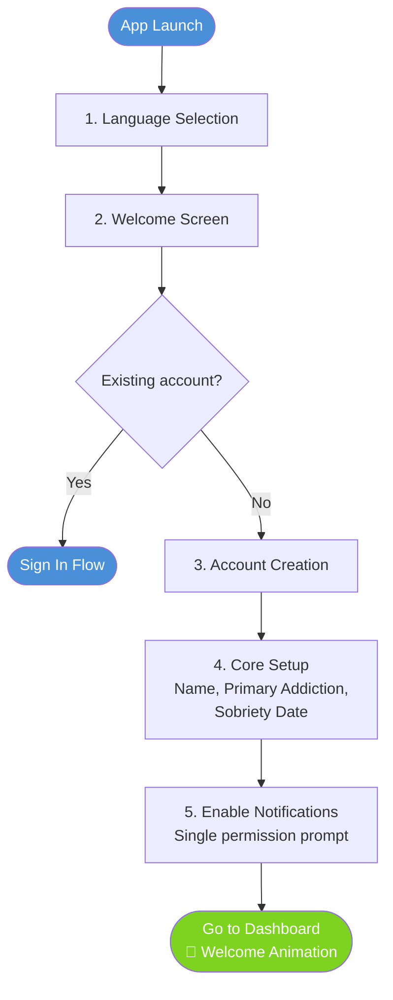

# Regal Recovery — Feature Specifications
**Part 2 of 4** | See also: [Strategic PRD](01-strategic-prd.md) · [Technical Architecture](03-technical-architecture.md) · [Content Strategy](04-content-strategy.md)

### 4.1 Feature Categories Overview

**1. Onboarding & Profile Setup** — Two-track onboarding (Fast Track + Deferred Profile Completion), language selection, role-based onboarding, personal recovery profile

**2. Profile Management** — Support network connections (sponsor, counselor, spouse, accountability partner)

**3. Tracking System** — Tracks both positive and negative behaviors
- Tracker Types:
  1. Counting Days Since Last Activity (sobriety)
  2. Counting Days of Consecutive Activity (commitments, affirmations, journaling, check-ins, custom)
- Activity Being Tracked: Sobriety, Commitments, Affirmations, Journaling, Emotional Journaling, Check-ins, Person Check-ins, Meetings, Step Work, FASTER Scale, Exercise, Nutrition, Mood, Gratitude, Phone Calls, Prayer, Devotionals, Acting In Behaviors, Financial, Integrity Inventory, Time Journal, Custom
- Per Tracker Views: Current Streak, History of Lengths/Milestones, Calendar with History
- Aggregate View: All Current Streaks, Combined History, Calendar with All Activity

**4. Content/Resources System** — Provides content/resources for users
- Freemium: Basic Commitments Pack, Basic Affirmations Pack, Basic Devotionals, Basic Prayers Pack, Partner Content
- Premium (unlocked forever when purchased): More Commitments Packs, More Affirmations Packs, Premium Partner Content, Premium Devotionals, Premium Prayer Packs

**5. Commitments System** — Track personal recovery commitments
- Out-of-the-box commitments (daily check-ins, daily phone calls, daily/weekly meetings, etc.)
- Custom commitments: what is it? how often?

**Activities** — Activities a user can take (see Section 4.3 for detailed specs)
- Daily Sobriety Commitment
- Affirmations
- Urge Logging & Emergency Tools
- Journaling (bullets, free-form, prompted, structured)
- Emotional Journaling
- Recovery Check-ins
- Person Check-ins (Spouse, Sponsor, Counselor/Coach)
- Spouse Check-in Preparation (FANOS/FITNAP)
- Guided 12 Step Work
- Meetings Attended
- Personal Craziness Index (PCI)
- FASTER Scale
- Post-Mortem Analysis
- Financial Tracker
- Acting In Behaviors
- Weekly/Daily Goals
- Devotionals
- Exercise/Physical Activity
- Nutrition
- Mood Ratings
- Gratitude List
- Phone Calls (made and received)
- Prayer
- Partner Activities (Redemptive Living: Emotional Journaling, Empathy exercises, Backbone, Bow Tie, Empathy Mapping, Threats)
- Guided Breathing and Grounding Exercises
- Voice Journal / Audio Entries
- Book Logging / Recovery Bookshelf
- Memory Verse Study and Quizzing
- Daily Integrity Inventory
- Time Journal

**Singular Static Tools** (see Section 4.4 for detailed specs)
- 3 Circles Tool — Visual mapping of inner/middle/outer circle behaviors
- Structured Relapse Prevention Plan — Interactive, data-driven defense strategy
- Vision — Personal recovery vision statement
- Podcasts — Curated recovery podcast directory
- External Links — Vetted directory of recovery organizations, crisis hotlines, fellowships
- Arousal Template — Guided clinical tool based on Patrick Carnes' framework (therapist-recommended)

**6. Analytics Dashboard** — Trends and stats

**7. Premium Advanced Analytics Dashboard** — Deeper trends and recovery insights

**8. Recovery Chatbot / Recovery Agent** — AI-powered recovery agent that provides conversational support, crisis escalation, and acts as a hands-free interface to all tools and activities (entering data on the user's behalf through guided conversation)

**9. Community**
- Roles: Spouse, Accountability Partner, Sponsor, Coach, Counselor, Member (all)
- Permissions: Reading, Commenting; other recommendations
- Viewing Permissions: by Role, by Category/Activity, by Item
- View addict's data on a per-permission basis; **all data sharing is opt-in — no one can view anything by default**
- User explicitly grants access per person, per category, or per activity; suggested permission templates offered during support network setup but never auto-enabled
- Messaging with Spouse, Accountability Partner, Sponsor, Coach, Counselor only

**10. Branding** — Brand the app via configuration for complete white-labeling in private partner contexts

**11. Tenancy**
- Every user is in the main tenant
- B2B (ministries, recovery centers, etc.) are their own tenants, leveraged for white-labeled instances

**12. Data Subject Rights (DSR)** — Export or delete all personal data

**13. Data Backup** — Backup data to iCloud, Google Drive, or Dropbox

**14. Quick Action Shortcuts** — OS-level shortcuts (Apple Action Button, Siri Shortcuts, Android App Shortcuts) for rapid access to key activities

**15. WebKit Content Filter Accountability** — On-device content filtering and screen accountability with AI classification and accountability reports to support contacts

**16. Panic Button with Biometric Awareness** — Enhanced emergency intervention using front-facing camera for self-awareness disruption and facial expression analysis for personalized intervention

**17. Therapist Portal** — Web-based dashboard for therapists/CSATs to manage clients, assign homework, monitor progress, and receive crisis alerts

**18. Recovery Health Score** — Single holistic score (0-100) synthesizing all recovery data into a daily pulse check

**19. Achievement System and Gamification** — Milestone celebrations with digital sobriety coins, consistency achievements, content consumption gamification, and anonymous milestone sharing

**20. Superbill and LMN Generation** — In-app medical billing documents for HSA/FSA reimbursement and insurance submission

**21. Meeting Finder** — GPS-powered meeting search across SA, Celebrate Recovery, AA, and S-Anon with NextMeeting SA integration

**22. Messaging Integrations** — WhatsApp, Signal, and Telegram deep links for accountability broadcasts, support communications, and milestone sharing

**23. Offline-First Content and Low Data Mode** — Pre-downloadable content and reduced bandwidth mode for metered data plans

**24. Trigger-Based Geofencing** — Proactive location-aware recovery support with high-risk zone detection and safe zone recognition

**25. Screen Time and Digital Wellness** — iOS Screen Time / Android Digital Wellbeing integration with recovery-correlated insights and digital boundary tools

**26. Couples Recovery Mode** — Unified couples dashboard with shared goals, trust-rebuilding milestones, couples devotionals, communication exercises, and shared calendar

**27. Sleep Tracking Integration** — Apple Health / Google Fit sleep data with recovery correlation insights and poor-sleep risk alerts

**28. Content Trigger Log** — Behavioral logging of user responses after content filter events for pattern analysis and Post-Mortem correlation

**29. Anonymous Recovery Stories** — Moderated library of user-submitted recovery testimonials filterable by addiction type, gender, stage, and faith background

**30. Spotify Integration** — In-app music playback control with activity-specific playlist suggestions and curated recovery playlists

**31. Light/Dark Mode** — System-following and manual theme switching with recovery-appropriate color palettes

**Assessment Tools** — Structured self-evaluation instruments (see Section 4.10)
- Family Impact Assessment
- Denial Assessment
- Addiction Severity Assessment
- Relationship Health Assessment
- SAST-R (Sexual Addiction Screening Test)

**Notification Strategy** — Priority hierarchy, daily caps, intelligent batching, quiet hours (see Section 4.11)

---
### 4.2 Detailed Feature Specifications

---

#### **FEATURE 1: Onboarding & Profile Setup**

**Priority:** P0 (Must-Have)
**Scope note:** P0 scope: Fast Track onboarding flow only. P1 scope: Deferred Profile Completion strategy, contextual triggers, gamification (progress ring, celebrations, badges), role-based onboarding variants.

**Description:** Language selection, role-based onboarding, personal recovery profile creation, and progressive profile completion strategy designed to minimize drop-off while maximizing the data needed for a personalized recovery experience.

**Onboarding Philosophy:**

- **Speed to value:** Get the user to the Dashboard and their first meaningful recovery action as fast as possible.
- **Progressive disclosure:** Collect only what's essential upfront. Defer everything else to contextual moments.
- **Emotional safety:** Many users are downloading this app during a crisis. Onboarding must feel like a warm welcome, not an intake form.
- **No dead ends:** Every screen must have a clear path forward. Optional steps are always skippable.

**Two-Track Onboarding:**

1. **Fast Track (3-4 steps)** — Gets the user to the Dashboard in under 2 minutes. Collects only what's required to start using the app.
2. **Deferred Profile Completion** — Prompts the user to complete their profile over the first 7-14 days through contextual, in-app nudges tied to natural moments of engagement.

**User Stories:**
- As a **new user**, I want to start using the app as quickly as possible, so that I can get help right now instead of filling out a long form while I'm struggling
- As a **new user**, I want a welcoming experience that feels safe and compassionate, so that I don't feel judged or overwhelmed before I even start
- As a **new user**, I want to set my sobriety start date immediately, so that my streak begins tracking from day one
- As a **new user**, I want to complete my profile gradually over my first week, so that it doesn't feel like a barrier to getting started
- As a **new user**, I want the app to explain why it's asking for each piece of information, so that I trust that my data is being used to help me
- As a **new user**, I want to identify my primary addiction, so that the app shows me relevant tools and content from the start
- As a **new user**, I want to skip optional setup steps without guilt, so that I can return to them when I'm ready
- As a **new user in crisis**, I want to access emergency tools immediately, so that I can get help even before completing onboarding
- As a **returning user**, I want to pick up where I left off if I closed the app during onboarding, so that I don't have to start over
- As a **new user**, I want to be prompted to complete my profile at natural moments, so that finishing setup feels useful rather than arbitrary

**Acceptance Criteria:**
- **Given** a new user launches the app for the first time, **When** they complete the Fast Track onboarding steps (language, account, core setup, notifications), **Then** they arrive at the Dashboard in under 2 minutes without being asked optional profile questions
- **Given** a new user is on any onboarding screen with optional fields, **When** they tap "Skip" or "Not now," **Then** they advance to the next step without error or guilt-inducing messaging
- **Given** a new user selects a sobriety start date during Core Setup, **When** they reach the Dashboard, **Then** their sobriety streak displays correctly calculated from that date
- **Given** a new user in crisis taps "Need help right now?" on the Welcome Screen, **When** the Emergency Tools overlay loads, **Then** it is fully accessible without requiring account creation or sign-in
- **Given** a new user closes the app mid-onboarding, **When** they relaunch the app, **Then** they resume from the exact step where they left off with previously entered data preserved
- **Given** a new user completed Fast Track 3 days ago with an incomplete profile, **When** they complete their first morning commitment, **Then** they are prompted to add birth year and gender with a contextual explanation of why it helps
- **Given** a new user skips the same deferred profile prompt twice, **When** they continue using the app, **Then** that prompt no longer appears in-app and is only accessible via Settings
- **Given** a new user completes the Welcome Screen, **When** the app detects a compassionate tone, **Then** no screen displays clinical or judgmental language and all copy follows the emotional safety guidelines
- **Given** a returning user who previously lapsed re-opens the app, **When** the welcome-back screen appears, **Then** they are offered a sobriety date update prompt with no shame messaging

**Fast Track Flow (Required — Under 2 Minutes):**



**Step 1: Language Selection**
- Auto-detect device language setting
- Display options: "English" / "Español"
- Large, clear buttons with flag icons
- Selection applies immediately; can be changed later in Settings
- If device language is neither English nor Spanish, default to English

**Step 2: Welcome Screen**
- Headline: "You're not alone. And you're in the right place."
- Three brief value propositions (icon + one line each)
- Primary CTA: "Get Started"
- Secondary link: "Already have an account? Sign In"
- Crisis access: "Need help right now? Tap here" → opens Emergency Tools overlay immediately, no account required

**Step 3: Account Creation**
- Sign-up options: Email, Apple ID, Google
- Email flow with real-time validation
- Legal: single checkbox for Terms + Privacy Policy
- Email verification sent in background — user NOT blocked from proceeding
- Biometric opt-in prompt after account creation

**Step 4: Core Setup (Single Screen)**
- Display name (required, max 30 characters)
- Primary addiction (required, selection chips): Sex Addiction, Pornography, Substance Use, Gambling, Shopping, Eating Disorders, Other
- Sobriety start date (required, date picker, default: today)

**Step 5: Enable Notifications (Single Prompt)**
- Single, clear ask: "Can we send you a daily reminder to make your recovery commitment?"
- Primary CTA: "Enable Reminders" → triggers OS notification permission
- Secondary: "Not now" → skips; banner on Dashboard later

**Dashboard Arrival**
- Welcome animation with sobriety streak displayed prominently
- Three suggested first actions: Make first commitment, Read today's affirmation, Set up support network
- Profile completion banner with progress ring

**Deferred Profile Completion Strategy:**

Profile completion is woven into the app experience over the first 7-14 days. Each missing field is requested at the moment when it's most relevant.

| Profile Field | Fast Track? | Deferred Trigger |
|---|---|---|
| Display name | ✅ Required | — |
| Primary addiction | ✅ Required | — |
| Sobriety start date | ✅ Required | — |
| Birth year + Gender | ❌ | Day 2: After first morning commitment |
| Marital status | ❌ | Day 3: Before first spouse check-in prep |
| Time zone | ❌ (auto-detected) | Only if auto-detection fails |
| Co-addictions | ❌ | Day 3-5: After first urge log |
| Previous recovery history | ❌ | Day 5-7: After first milestone |
| Motivations | ❌ | Day 2-3: After first evening review |
| Support network setup | ❌ | Day 3-5: After first "I'm struggling" moment |
| Notification preferences (detailed) | ❌ | Day 4-7: After experiencing 3-4 notification types |
| App permissions | ❌ | Contextually, when feature requiring permission is first used |
| Faith background | ❌ | Day 5-7: After engaging with devotional or prayer content |

Each deferred prompt follows a consistent pattern: context line (why we're asking), value line (what it unlocks), input fields (1-3 max), Save button, and "Not now" skip link. If skipped twice, the prompt moves to Settings only and does not appear again.

**Profile Completion Gamification:**
- Progress ring in Settings → Profile (percentage with visual fill)
- Dashboard banner for first 14 days (dismissible)
- Completing sections unlocks tangible benefits (personalized content, milestone messaging, community matching)
- 80% completion milestone celebration
- 100% completion badge

**App Permissions Strategy — Ask at the Moment of Use:**

| Permission | When Requested | Feature That Triggers It |
|---|---|---|
| Notifications | Fast Track Step 5 | Core app experience |
| Microphone | First voice-to-text attempt | Journaling, urge logging |
| Contacts | First "Call Sponsor" tap | Emergency tools, support network |
| Calendar | First calendar integration use | Evening commitment review |
| Health Data | First Exercise/Nutrition sync | Exercise, Nutrition |
| Location | First "Find meetings nearby" | Meeting finder, emergency tools |

**Role-Based Onboarding:**
- Spouse: 3-step Fast Track → spouse-specific dashboard
- Sponsor/Accountability Partner: 3-step Fast Track → sponsee dashboard
- Counselor/Coach: 4-step Fast Track (includes professional profile) → client management dashboard

**Returning User & Re-Engagement:**
- Interrupted onboarding: auto-saved, resumes on next launch
- Lapsed user: push notifications at Day 3, 7, 14; email at Day 14, 30; no further outreach after Day 30
- Returning after lapse: "Welcome back" with sobriety date update prompt, no shame messaging

**Success Criteria:**
- Fast Track completion rate: 95%+
- Time to Dashboard: Median under 2 minutes
- Day 7 profile completion: 60% of active users at 50%+
- Day 14 profile completion: 50% of active users at 80%+
- Day 1 action rate: 80% complete at least one recovery action

**Edge Cases:**
- User enters false birth date claiming to be 18+ → If age fraud is detected post-registration (e.g., user discloses being under 18 in chatbot conversation, journal entry, or support request), account is suspended with a compassionate message directing the user to age-appropriate resources. All user data is deleted via cryptographic erasure.

---

#### **FEATURE 2: Profile Management**

**Priority:** P0

**Description:** Support network connections (sponsor, counselor, spouse, accountability partner).

**User Stories:**
- As a user, I want to manage my profile information (name, email, gender, marital status, time zone), so that the app stays relevant to my recovery journey
- As a user, I want to update my addictions and sobriety dates, so that tracking remains accurate
- As a user, I want to manage my support network (sponsor, counselor, coach, accountability partner, spouse), so that I can control who is connected to my recovery

**Acceptance Criteria:**
- **Given** a user navigates to Settings then Profile, **When** they edit their name, email, gender, marital status, or time zone and tap Save, **Then** the updated information is persisted and reflected across all app features
- **Given** a user has multiple addictions tracked, **When** they remove an addiction or change their primary addiction designation, **Then** the dashboard updates to reflect the new primary and historical data for removed addictions is preserved
- **Given** a user updates their sobriety date, **When** they confirm the change, **Then** the system logs the reason for the update, recalculates the streak, and preserves the previous sobriety date in history
- **Given** a user adds a sponsor via email invite, **When** the sponsor accepts the invitation, **Then** the sponsor appears in the user's support network and can view shared recovery data per the user's privacy settings
- **Given** a user removes a support network member, **When** the removal is confirmed, **Then** that person immediately loses access to the user's shared recovery data

**Summary:**
- Accessible via Settings → Profile
- Editable fields: Name, email, birth year, gender, photo, time zone
- Addiction management: Add/remove addictions, designate primary
- Sobriety date management: Update with reason/logging
- Support network: Add/remove sponsor, counselor, coach, accountability partner, spouse (with email invites)
- Privacy settings: Control who sees what data
- Account management: Change password, delete account (with confirmation and data export)

**Preferred Bible Version:**
- Set in Profile → Faith Settings → Preferred Bible Version
- Applies globally across all scripture-displaying features: affirmations, devotionals, prayers, memory verses, journal prompts, milestone celebrations
- Supported English translations: NIV (default), ESV, NLT, KJV, NASB, NKJV, CSB, The Message
- Supported Spanish translations: RVR1960 (default for Spanish), NVI, DHH, LBLA, Biblia Latinoamericana, Biblia de Jerusalén
- Catholic-recommended translations flagged for Catholic users: Biblia Latinoamericana, Biblia de Jerusalén, NABRE
- User can view any individual verse in an alternate translation without changing their global preference ("Compare translations" tap on any displayed verse)
- Translation preference synced across all devices

---

#### **FEATURE 3: Tracking System**

**Priority:** P0 (Must-Have)

**Description:** Tracks both positive and negative behaviors across all activities.

**User Stories:**
- As a **recovering user**, I want to see my current sobriety streak, so that I can visualize my progress and stay motivated
- As a **recovering user**, I want to track consecutive days of positive activities, so that I build recovery habits
- As a **recovering user**, I want to view my complete history including past relapses, so that I can learn from patterns and celebrate overall growth
- As a **recovering user**, I want to see a calendar view of all my recovery activity, so that I can quickly identify strong periods and vulnerable times
- As a **recovering user**, I want to celebrate milestone achievements, so that I feel recognized and encouraged
- As a **recovering user** moving from early to active recovery, I want the app to adapt content recommendations, risk thresholds, and check-in questions to my current stage, so that the tools remain relevant as I grow
- As a **recovering user** who has reached a milestone stage, I want my achievements preserved while new stage-appropriate goals are introduced, so that I see continuity in my journey

**Acceptance Criteria:**
- **Given** a recovering user opens the app on a new day, **When** they have maintained sobriety since their sobriety start date, **Then** the current streak count increments by one and the visual progress indicator updates toward the next milestone
- **Given** a recovering user completes a positive activity (e.g., journaling, prayer) on consecutive days, **When** they view their tracker, **Then** the consecutive-day streak reflects each completed day and resets to zero if a day is missed
- **Given** a recovering user has logged a relapse in the past, **When** they view their complete history, **Then** they see a timeline showing all previous streaks, relapse dates, and overall recovery duration without shame-based language
- **Given** a recovering user views the calendar, **When** they tap on any day, **Then** they see color-coded entries for all tracked activities performed that day
- **Given** a recovering user reaches a milestone (e.g., 30 days sober), **When** the milestone triggers, **Then** a full-screen celebration animation displays with a congratulations message, a reflection prompt, and an option to share with their support network
- **Given** a recovering user logs a relapse, **When** they complete the relapse logging flow, **Then** the sobriety streak resets, the previous streak length is preserved in history, and a recovery action plan prompt is offered with compassionate messaging
- **Given** a recovering user's sobriety streak crosses a stage threshold (e.g., 90 days from early to active recovery), **When** the stage transition is detected, **Then** the app updates content recommendations, adjusts risk alert thresholds, and introduces stage-appropriate check-in questions while preserving access to all previous-stage tools and content
- **Given** a recovering user transitions to a new recovery stage, **When** they view their tracking history, **Then** all previously earned milestones, badges, and streak records remain visible and celebrated, and new stage-appropriate goals are introduced alongside existing achievements without replacing them

**Tracker Types:**

1. **Counting Days Since Last Activity** — Used for sobriety tracking
2. **Counting Days of Consecutive Activity** — Used for positive behaviors

**Activity Being Tracked:** Sobriety, Commitments, Affirmations, Journaling, Emotional Journaling, Check-ins, Person Check-ins, Meetings, Step Work, FASTER Scale, Exercise, Nutrition, Mood, Gratitude, Phone Calls, Prayer, Devotionals, Acting In Behaviors, Financial, Integrity Inventory, Custom

**Per Tracker Views:**
1. Current Streak with visual progress indicator toward next milestone
2. History of Lengths/Milestones as timeline visualization
3. Calendar with History (color-coded days per activity)

**Aggregate View:**
1. All Current Streaks dashboard
2. Combined History timeline
3. Calendar with All Activity overlay

**Milestone System:**
- Visual badges for milestones: 1 day, 3 days, 7 days, 14 days, 30 days, 60 days, 3 months, 4 months, 5 months, 6 months, 7 months, 8 months, 9 months, 10 months, 11 months, 1 year, 18 months, 2 years, 5 years, 10 years
- Milestone celebration flow: full-screen animation, congratulations, reflection prompt, share options
- Optional notification to support network

**Relapse Logging Flow:**
- Compassionate messaging throughout
- Date/Time picker, addiction specification, optional Post-Mortem prompt
- Automatically resets sobriety date; previous streak preserved in history
- Support network notification option
- Recovery action plan prompt

**Extended Sobriety Relapse Handling:**

- As a **recovering user** who relapses after 6+ months of sobriety, I want the app to acknowledge the weight of this moment with extra compassion and specific guidance, so that I don't spiral into shame and give up entirely
- As a **recovering user** who just lost a long streak, I want to see my total sober days alongside the reset counter, so that I don't feel like all my progress was erased

**Acceptance Criteria:**
- **Given** a recovering user with 180+ consecutive sober days logs a relapse, **When** the relapse logging flow completes, **Then** the app displays an extended compassion message acknowledging the significance of the loss, offers targeted guidance for long-streak relapse (e.g., "This does not erase 6 months of growth"), provides a direct link to schedule a call with their sponsor or therapist, and presents a curated recovery action plan specific to post-long-streak relapse
- **Given** a recovering user logs a relapse that resets a long streak, **When** they view their sobriety tracker after the reset, **Then** the tracker displays both the new streak counter (days since last relapse) and a cumulative "Total Sober Days" count that includes all previous streaks, along with a message such as "You were sober 247 out of the last 250 days — that matters"

**Multi-Addiction Tracking:**
- Independent tracking per addiction
- Unified view option
- Primary addiction designation for main dashboard

**Edge Cases:**
- Multiple relapses in one day → Only resets streak once
- Sobriety date in the future → Validation error
- Milestone at midnight → Celebration triggers next morning
- Time zone changes → Streak based on user's "home" time zone
- Offline data sync conflict → Most recent change wins; conflict noted
- Accidental relapse log → Allow undo within 24 hours

---

#### **FEATURE 4: Content/Resources System**

**Priority:** P0

**Description:** Provides content and resources for users through freemium and premium tiers.

**User Stories:**
- As a recovering user, I want access to recovery literature, so that I can deepen my understanding
- As a recovering user, I want Christian devotionals, so that I can integrate faith into daily recovery
- As a recovering user, I want to find local meetings and events, so that I can connect with in-person support

**Acceptance Criteria:**
- **Given** a recovering user has a free account, **When** they browse the content library, **Then** they can access all freemium content (basic commitments, 50+ affirmations, 30-day devotionals, basic prayers, meeting finder, crisis lines) without being blocked by a paywall
- **Given** a recovering user purchases a premium content pack, **When** the purchase completes, **Then** the content is unlocked permanently and accessible across all their devices without recurring charges
- **Given** a recovering user opens a devotional or scripture-based content, **When** they have set a preferred Bible version in Profile settings, **Then** all displayed verses render in that preferred translation
- **Given** a recovering user is viewing a displayed verse, **When** they tap "Compare translations," **Then** they can view that verse in an alternate translation without changing their global preference
- **Given** a recovering user taps "Find meetings nearby," **When** they grant location permission, **Then** the app displays local recovery meetings sorted by proximity with date, time, and address details

**Freemium Content:**
- Basic Commitments Pack, Basic Affirmations Pack (50+), Basic Devotionals (30-day rotation), Basic Prayers Pack, Partner Content
- Meeting finder, crisis lines, feeling wheel, free courses, curated music playlist, video library (10 free videos)

**Premium Content (unlocked forever when purchased):**
- More Commitments Packs, More Affirmations Packs, Premium Partner Content, Premium Devotionals (365-day), Premium Prayer Packs

**Counselor/Therapist Content:**
- Freemium and premium content publishing by counselors

**Memory Verses and Verse Packs:**
- **Freemium Verse Packs:** Identity in Christ (10 verses), Temptation & Strength (12 verses), Freedom & Recovery (10 verses)
- **Premium Verse Packs (unlocked forever when purchased):** Shame & Forgiveness, Marriage & Restoration, Anxiety & Peace, Purity & Holiness, Hope & Perseverance, Surrender & Trust (10-15 verses each)
- Verses displayed in user's preferred Bible version (set in Profile → Faith Settings)
- Verse packs integrated with Memory Verse Study and Quizzing activity (see Activity: Memory Verse Study and Quizzing)

---

#### **FEATURE 5: Commitments System**

**Priority:** P0

**Description:** Track personal recovery commitments with out-of-the-box and custom options.

**User Stories:**
- As a recovering user, I want to define specific commitments beyond just sobriety, so that I can build a comprehensive recovery lifestyle
- As a recovering user, I want to review my commitments nightly, so that I maintain honesty and accountability
- As a recovering user, I want to track my commitment-keeping consistency, so that I can see my character growth

**Acceptance Criteria:**
- **Given** a recovering user creates a custom commitment with a specific frequency (e.g., daily exercise), **When** they save it, **Then** the commitment appears in both the morning commitment view and the nightly review flow with the correct schedule
- **Given** a recovering user opens the nightly review, **When** they mark each commitment as kept or broken for that day, **Then** the results are saved and reflected in their commitment-keeping consistency metrics
- **Given** a recovering user marks a commitment as broken during nightly review, **When** the broken commitment is recorded, **Then** a compassionate reflection prompt is displayed instead of shame-based messaging
- **Given** a recovering user has been tracking commitments for 14+ days, **When** they view their consistency metrics, **Then** they see a percentage-based consistency score and a visual trend showing their commitment adherence over time

**Out-of-the-Box Commitments:** Daily check-ins, daily phone calls, daily/weekly meetings, daily prayer/scripture, daily exercise

**Custom Commitments:** User defines what + how often, with category tagging (spiritual, physical, relational, intellectual, emotional)

**Integration:** Integrated into morning commitment and nightly review flows; broken commitments trigger reflection prompts, not shame

---


#### **FEATURE 6: Analytics Dashboard**

**Priority:** P1

**Description:** Trends and stats across all recovery activities.

**Summary:**
- Sobriety metrics: success rate, average streak length, days since last relapse, total relapses
- Urge correlation insights: day of week, time of day, top triggers
- Positive trend indicators: streak comparisons, urge frequency changes, sobriety percentage
- Activity completion rates across commitments, check-ins, journaling
- PCI score trends over time

**User Stories:**
- As a recovering user, I want to view my recovery trends over time (weekly, monthly, quarterly) so that I can see whether my efforts are producing measurable progress
- As a recovering user, I want to identify patterns in my urge triggers (time of day, day of week, emotional state) so that I can proactively plan around high-risk periods
- As a recovering user, I want to see activity completion rates for my commitments, check-ins, and journaling so that I know which recovery practices I am neglecting

**Acceptance Criteria:**
- **Given** a user navigates to the Analytics Dashboard, **When** the dashboard loads, **Then** the user sees sobriety metrics (current streak, average streak length, days since last relapse, total relapses, sobriety percentage) calculated from their tracker history, with the ability to filter by time range (7 days, 30 days, 90 days, all time)
- **Given** a user has logged at least 5 urge entries, **When** they view the urge correlation section, **Then** the dashboard displays a breakdown of urge frequency by day of week and time of day, and lists the top 5 most common triggers sorted by frequency
- **Given** a user has active commitments, **When** they view the activity completion section, **Then** the dashboard shows a completion percentage for each commitment category (check-ins, journaling, phone calls, meetings, etc.) for the selected time range, with visual indicators (green >= 80%, yellow >= 50%, red < 50%)
- **Given** a user has PCI scores recorded over multiple weeks, **When** they view the PCI trends section, **Then** the dashboard displays a line chart of PCI scores over time with a visible trend line and highlights any scores that exceed the user's personal threshold

---

#### **FEATURE 7: Premium Advanced Analytics Dashboard**

**Priority:** P3

**Description:** Deeper trends and recovery insights for premium users.

**Summary:**
- Cross-activity correlation analysis
- Predictive risk indicators based on behavioral patterns
- Detailed heatmaps and pattern analysis
- Exportable reports for sharing with therapist/counselor

**User Stories:**
- As a premium user, I want to see cross-activity correlations (e.g., how exercise frequency relates to urge intensity, or how meeting attendance correlates with sobriety streaks) so that I can understand which recovery activities have the greatest impact on my progress
- As a premium user, I want to receive predictive risk indicators based on my behavioral patterns so that I can intervene before a potential relapse
- As a premium user, I want to export recovery reports as PDF so that I can share them with my therapist, counselor, or sponsor during sessions

**Acceptance Criteria:**
- **Given** a premium user opens the Advanced Analytics Dashboard, **When** they view the correlation analysis section, **Then** the system displays statistically meaningful correlations between at least two activity categories (e.g., meeting attendance vs. sobriety days, exercise vs. urge frequency) with a plain-language explanation of each correlation (e.g., "Weeks where you attended 3+ meetings had 60% fewer urge logs")
- **Given** a premium user has at least 30 days of activity data, **When** the predictive risk engine detects a pattern historically associated with relapse (e.g., declining check-in frequency, rising PCI scores, skipped meetings), **Then** the dashboard displays a risk indicator with a severity level (Low, Medium, High) and a recommended action (e.g., "Consider reaching out to your sponsor")
- **Given** a premium user selects "Export Report," **When** they choose a date range and format (PDF), **Then** the system generates a downloadable report containing sobriety summary, activity completion rates, urge trends, PCI trends, and correlation highlights for the selected period, with all data decrypted on-device before export
- **Given** a non-premium user navigates to the Advanced Analytics section, **When** the section loads, **Then** the user sees a preview of advanced features with a clear upgrade prompt, and no premium data or analysis is accessible

---

#### **FEATURE 8: Recovery Chatbot / Recovery Agent**

**Priority:** P3 (Premium+ Feature)

**Description:** AI-powered recovery agent that provides conversational support, crisis escalation, and acts as a hands-free interface to the app's tools and activities — entering data on the user's behalf through guided conversation.

**Agent Capabilities:**

The Recovery Agent is not just a chatbot — it is a conversational interface to the entire app. The user can interact with any tool or activity through the agent instead of navigating the app UI directly.

**1. Conversational Data Entry**
- User tells the agent what they want to log, and the agent submits the data as an entry on their behalf
- Examples:
  - "Enter a journal entry" → User dictates the entry → Agent saves it as a Journaling entry
  - "Log an urge" → Agent walks through intensity, triggers, context → Saves as an Urge Log entry
  - "I just got off the phone with my sponsor" → Agent logs a Phone Call entry (direction: made, contact: sponsor, connected: yes)
  - "I'm feeling anxious, about a 7" → Agent saves as an Emotional Journaling entry (emotion: anxious, why: [asks follow-up], intensity: 7)
  - "Add to my gratitude list: my wife, my sobriety, a good night's sleep" → Agent saves as Gratitude List entries

**2. Guided Tool Walkthroughs**
- Agent recommends a tool based on context, and if the user agrees, walks them through it conversationally
- The agent poses each section/question of the tool as part of the conversation; user answers naturally
- When complete, the agent submits the data as a completed entry for that tool
- Examples:
  - Agent detects user is struggling → "Would you like to walk through a FASTER Scale check-in?" → User agrees → Agent asks about each stage (F, A, S, T, E, R) → Saves completed FASTER Scale entry
  - After a relapse disclosure → "Let's do a Post-Mortem together. Walk me through your last 24 hours." → Agent guides through each section → Saves completed Post-Mortem Analysis
  - "Can you help me update my Relapse Prevention Plan?" → Agent walks through each section, suggests updates based on recent data → User approves → Plan updated
  - "Help me prepare for my spouse check-in tonight" → Agent walks through FANOS or FITNAP prompts → Saves as Spouse Check-in Preparation entry

**3. Proactive Recommendations**
- Based on user's data, the agent can suggest actions:
  - "You haven't logged a check-in today. Want to do one now?"
  - "Your FASTER Scale has been at A (Anxiety) for 3 days. Should we talk about what's going on?"
  - "You haven't called your sponsor in 5 days. Would you like me to remind you tomorrow morning?"
- User can accept, defer, or dismiss recommendations

**4. Recovery Knowledge & Encouragement**
- Answer recovery questions from SA White Book, AA Big Book, and Christian recovery literature
- Provide encouragement during urges with contextual affirmations and scripture
- Suggest coping strategies based on user's trigger history
- Generate prayers based on the user's current situation
- Role-play difficult conversations (disclosure practice, boundary setting)

**5. Crisis Escalation**
- If the agent detects crisis indicators in conversation, it escalates:
  - Suggests calling sponsor, counselor, or crisis hotline
  - Offers to open Emergency Tools overlay
  - Cannot be overridden — crisis escalation always surfaces

**Integration with User Data:**
- Agent has read access to user's recovery data (streaks, recent urge logs, check-in scores, commitments, FASTER Scale history) to provide personalized responses
- Agent has write access to submit entries on user's behalf (only with explicit user confirmation per entry)
- All agent-created entries are tagged as "via Recovery Agent" in the entry metadata

**Guardrails:**
- Cannot provide medical or legal advice; redirects to professionals
- Cannot access arousal template data (highest privacy tier, encrypted separately)
- All conversations encrypted; not used for model training without explicit consent
- User can delete conversation history at any time
- Theological accuracy: The AI agent operates within a broadly evangelical Christian framework by default. Users can select their denominational lens during onboarding (e.g., Catholic, Protestant, Non-denominational, Orthodox) which adjusts pastoral guidance accordingly. All AI responses on theological topics include a disclaimer: 'This is AI-generated guidance, not pastoral counsel. Please consult your pastor or spiritual director for theological questions.' A theological review board (2-3 advisors from different traditions) periodically audits AI responses for doctrinal accuracy. Users can flag theologically problematic responses via a 'Report' button, triggering human review.

**Privacy:**
- Agent conversations are E2E encrypted like messaging
- When the agent needs to read user data for context, decryption happens on-device; the agent receives only the decrypted context necessary for the current conversation turn
- Agent-submitted entries follow the same encryption as manually entered data

**Note:** Full zero-knowledge integration with the AI Agent is a future enhancement. Initial implementation uses standard encryption (TLS + at-rest) for chatbot conversations, with user-explicit data sharing. See [Future Features](05-future-features.md).

---


#### **FEATURE 9: Community**
 
**Priority:** P2

**Description:** Role-based community with granular permissions and messaging.

**Roles:** Spouse, Accountability Partner, Sponsor, Coach, Counselor, Member (all)

**Permissions System:**
- Reading, Commenting — Base permission types
- Viewing Permissions — Configurable by Role, by Category/Activity, by Item
- **All data sharing is opt-in — no one can view anything by default**
- User explicitly grants access per person, per category, or per activity
- Suggested permission templates offered during support network setup (e.g., "Grant spouse access to check-ins and sobriety status") but **never auto-enabled**
- User can revoke any permission at any time

**Messaging:** In-app messaging limited to Spouse, Accountability Partner, Sponsor, Coach, Counselor

**Additional Features:**
- Accountability Broadcast
- Counselor/Sponsor dashboard
- Assignment feature
- Spouse tools: betrayal trauma resources, support group finder, personal journaling

**Safety & Coercive Control Safeguards:**

- As a **recovering user** in a controlling relationship, I want the ability to silently revoke a support person's access without triggering a notification to them, so that I can protect myself without escalation
- As a **recovering user**, I want the app to never allow any support person to demand or force full data access as a condition of the relationship, so that accountability remains voluntary
- As a **recovering user**, I want access to domestic violence resources if the app detects patterns of coercive data access (e.g., one person checking data 20+ times per day), so that I can get help

**Acceptance Criteria:**
- **Given** a recovering user revokes a support person's access, **When** they select "Silent Revoke" in the permissions settings, **Then** the support person's access is removed immediately without sending any notification, alert, or status change visible to the revoked person, and the support person's dashboard simply shows "No data available" without indicating the access was actively revoked
- **Given** a support person requests "Full Access" data sharing level, **When** the consent screen is displayed to the recovering user, **Then** the app presents a clearly visible notice: "Healthy accountability is voluntary. You always have the right to choose what you share." and provides a "Learn More" link to resources on healthy vs. coercive accountability
- **Given** the app detects a pattern of coercive data access (e.g., a single support person viewing the recovering user's data 20+ times in a 24-hour period), **When** the threshold is crossed, **Then** the recovering user receives a private, discreet notification with the message: "We noticed unusual activity on your account. If you feel unsafe, help is available." with links to the National Domestic Violence Hotline (1-800-799-7233), Crisis Text Line, and relevant organizations — and this notification is never visible to the support person

**Edge Cases:**
- Support person demands full access as a condition of staying in the marriage → App displays a safety notice: "Healthy accountability is voluntary. If you feel pressured, here are resources." Links to National Domestic Violence Hotline (1-800-799-7233) and relevant organizations.

---


#### **FEATURE 10: Branding**

**Priority:** P3 (B2B feature; defer until D2C product-market fit established)

**Description:** Brand the app via configuration for complete white-labeling.

**Summary:** Configurable app name, logo, color scheme, splash screen, icon. Configuration-driven (no code changes per partner).

**User Stories:**
- As a B2B partner administrator, I want to configure the app's name, logo, color scheme, splash screen, and icon through a configuration interface so that our users experience a fully branded version of the app without requiring custom code changes
- As an end user of a partner-branded app, I want to see my organization's branding throughout the app experience (splash screen, headers, icons) so that the app feels like a native part of my recovery program

**Acceptance Criteria:**
- **Given** a B2B partner administrator accesses the branding configuration, **When** they upload a logo, set a color scheme (primary, secondary, accent), app name, splash screen image, and app icon, **Then** all assets are validated (format, dimensions, file size), stored in the tenant's configuration, and reflected in the app within one app restart for all users under that tenant
- **Given** a user belongs to a partner tenant with custom branding, **When** they launch the app, **Then** the splash screen, app header, navigation elements, and icon all display the partner's configured branding instead of the default Regal Recovery branding
- **Given** a partner administrator submits an incomplete branding configuration (e.g., missing logo or color values), **When** the configuration is applied, **Then** the system falls back to default Regal Recovery branding for any unconfigured elements while applying the partner's values for all configured elements

---

#### **FEATURE 11: Tenancy**

**Priority:** P3 (B2B feature; defer until D2C product-market fit established)

**Description:** Multi-tenant architecture.

**Summary:** Main tenant (all users) + B2B tenants (ministries, recovery centers). Tenant isolation for data, users, content.

**User Stories:**
- As a B2B tenant administrator, I want complete data isolation between my organization's users and users in other tenants so that our members' recovery data is never accessible to or commingled with other organizations
- As a B2B tenant administrator, I want to configure tenant-specific content (custom devotionals, organization-specific commitments, curated resource libraries) so that our users receive materials tailored to our recovery program

**Acceptance Criteria:**
- **Given** a user belongs to a B2B tenant, **When** any data query is executed (read or write), **Then** the system enforces tenant-scoped access at the data layer so that the user can only access data belonging to their own tenant, and no cross-tenant data leakage is possible even via direct API calls
- **Given** a B2B tenant administrator configures tenant-specific content (devotionals, commitments, resources), **When** a user in that tenant accesses the content/resources section, **Then** they see the tenant-curated content alongside (or in place of) the default Regal Recovery content, based on the tenant administrator's configuration
- **Given** a new B2B tenant is provisioned, **When** the tenant setup is complete, **Then** the tenant has its own isolated namespace for users, data, content, and branding configuration, and the main tenant's data and content remain unaffected

---

#### **FEATURE 12: Data Subject Rights (DSR)**

**Priority:** P0 (Must-Have)

**Description:** User ability to export or delete all data.

**Summary:**
- Export: JSON and/or PDF, delivered via in-app download or email
- Delete: permanent deletion within 30 days, account deactivated immediately
- Accessible via Settings → Privacy → My Data
- GDPR, CCPA compliant

**User Stories:**
- As a user, I want to export all of my recovery data (journal entries, urge logs, check-ins, tracker history, analytics) in a portable format (JSON or PDF) so that I have a complete copy of my information for personal records or to share with a therapist
- As a user, I want to request permanent deletion of my account and all associated data so that none of my sensitive recovery information remains on the platform after I leave

**Acceptance Criteria:**
- **Given** a user navigates to Settings > Privacy > My Data and selects "Export My Data," **When** they choose a format (JSON or PDF) and confirm, **Then** the system generates a complete export of all user data (profile, tracker history, journal entries, urge logs, check-ins, analytics, community connections, settings) and delivers it via in-app download or email within 24 hours
- **Given** a user navigates to Settings > Privacy > My Data and selects "Delete My Account," **When** they confirm the deletion request (with a secondary confirmation step requiring password re-entry), **Then** the account is immediately deactivated (no login, no data visible to community members), and all associated data is permanently and irreversibly deleted from all systems (primary database, backups, analytics) within 30 calendar days, in compliance with GDPR and CCPA requirements
- **Given** a user has initiated a deletion request, **When** they attempt to log in within the 30-day deletion window, **Then** the system displays a notice that deletion is in progress with an option to cancel the request and reactivate the account before the deletion is finalized

---

#### **FEATURE 13: Data Backup**

**Priority:** P1

**Description:** User-initiated backup to cloud storage.

**Summary:**
- Providers: iCloud, Google Drive, Dropbox
- Modes: Manual (on-demand) and Automatic (daily/weekly)
- Restore from previous backup on new device
- Encrypted at rest; OAuth authentication
- Accessible via Settings → Backup & Restore

**User Stories:**
- As a user, I want to back up my recovery data to my preferred cloud provider (iCloud, Google Drive, or Dropbox) either manually or on an automatic schedule so that my data is protected against device loss or failure
- As a user, I want to restore my recovery data from a previous backup when setting up a new device so that I do not lose my recovery history, streaks, journal entries, or settings

**Acceptance Criteria:**
- **Given** a user navigates to Settings > Backup & Restore and selects a cloud provider (iCloud, Google Drive, or Dropbox), **When** they authenticate via OAuth and tap "Back Up Now" (manual) or enable automatic backup (daily or weekly), **Then** the system creates an encrypted backup of all user data and uploads it to the selected provider, displaying a confirmation with timestamp and backup size upon completion
- **Given** a user sets up the app on a new device and navigates to Settings > Backup & Restore, **When** they authenticate with their cloud provider and select a previous backup from the list (showing date, size, and device name), **Then** the system downloads and decrypts the backup, restoring all user data (profile, trackers, journal entries, streaks, settings, community connections) and confirms successful restoration
- **Given** an automatic backup fails (network error, insufficient cloud storage, expired OAuth token), **When** the failure occurs, **Then** the system retries up to 3 times with exponential backoff, and if all retries fail, notifies the user with a clear error message and recommended action (e.g., "Check your internet connection" or "Re-authenticate with Google Drive")

---

#### **FEATURE 14: Quick Action Shortcuts**

**Priority:** P1

**Description:** OS-level shortcuts for rapid access.

**Platforms:** iOS (Siri Shortcuts, Action Button, Lock Screen widgets), Android (App Shortcuts, Google Assistant, Quick Settings tiles)

**Available Shortcuts:** Call for Help, Log an Urge, Emotional Journal, Journal Entry, Log a Prayer, Morning Commitment, Evening Review, Log a Mood, Gratitude List, Quick Check-in

**Configuration:** Settings → Quick Actions. "Call for Help" contact configurable. Privacy: generic labels/icons, no recovery-related text visible.


#### **FEATURE 15: WebKit Content Filter Accountability**

**Priority:** P1

**Description:** On-device content filtering and screen accountability system that monitors browsing activity, detects explicit content using AI, and sends accountability reports to the user's designated support contacts.

**Deferred to future release.** See [Future Features](05-future-features.md).

---

#### **FEATURE 16: Panic Button with Biometric Awareness**

**Priority:** P0 for basic panic button (motivations display, breathing exercise, sponsor call); P2 for biometric awareness layer (camera, facial expression analysis)

**Description:** An enhanced emergency intervention tool that uses the device's front-facing camera and sensors to show the user their own face during an urge, leveraging self-awareness and facial expression recognition to disrupt the compulsive behavior loop and personalize the intervention response.

**User Stories:**

- As a **recovering user**, I want to see my own face during a moment of temptation, so that I'm confronted with the reality of who I am and who I'm choosing to be — breaking the dissociative trance that precedes acting out
- As a **recovering user**, I want the app to learn my facial patterns over time, so that it can recognize when I'm in a high-risk emotional state and intervene proactively
- As a **recovering user**, I want the panic button to feel like a moment of truth — not a gimmick — so that it becomes a genuine tool I reach for when I'm about to fall
- As a **recovering user**, I want my motivations and family photo displayed alongside my face, so that I see the full picture of what's at stake in this moment

**Acceptance Criteria:**
- **Given** a recovering user activates the Panic Button via long-press or Quick Action Shortcut, **When** the camera permission has been granted, **Then** the front-facing camera opens immediately showing the user's live face with their motivations, family photo (if uploaded), current sobriety streak, and a breathing guide overlay
- **Given** a recovering user has used the Panic Button 30 or more times with biometric learning opted in, **When** the on-device ML model detects early-stage stress patterns matching previous pre-urge states, **Then** the app proactively offers a check-in notification before the user reaches for the Panic Button
- **Given** a recovering user activates the Panic Button and the on-device ML detects stress or anxiety in their facial expression, **When** the personalized intervention is generated after the biometric scan, **Then** the app prioritizes breathing exercises and grounding techniques in the action options
- **Given** a recovering user activates the Panic Button but covers the camera or is in a dark room, **When** the camera feed is unusable for ML analysis, **Then** the app falls back to a text-based intervention displaying motivations, sobriety streak, and all action options without error or shame messaging
- **Given** a recovering user dismisses the Panic Button within 5 seconds by tapping "I'm okay now," **When** the screen closes, **Then** no urge event is logged and no data from the session is recorded
- **Given** a recovering user completes a Panic Button session and taps "I'm okay now" after more than 5 seconds, **When** the session ends, **Then** a follow-up check-in notification is scheduled for 15 minutes later
- **Given** a recovering user has not opted into the biometric learning feature, **When** they use the Panic Button with camera enabled, **Then** no facial expression data is stored on-device and the live feed is processed in real-time only without retention

**Panic Button Flow:**

1. **Activation:** User taps the Emergency FAB (long-press) or triggers via Quick Action Shortcut / voice command ("I'm struggling")
2. **Camera activation:** Front-facing camera opens immediately showing the user's live face filling the screen
3. **Overlay elements** (displayed around the live camera feed):
   - User's motivations (pulled from profile) displayed at the top: "I'm doing this for..."
   - Family photo (if uploaded) displayed in a small frame in the corner
   - Current sobriety streak: "X days. Don't let this moment erase them."
   - Breathing guide: subtle pulse animation around the camera frame guiding slow breathing
4. **Biometric scan** (on-device, real-time):
   - Facial expression analysis using on-device ML (CoreML / TensorFlow Lite)
   - Detects emotional indicators: stress markers, fatigue, distress
   - Does NOT identify the user's identity — only analyzes expression patterns
5. **Personalized intervention** (based on detected state + historical patterns):
   - If stress/anxiety detected: prioritize breathing exercise and grounding techniques
   - If fatigue/exhaustion detected: suggest physical movement, hydration, sleep
   - If anger/frustration detected: suggest journaling, phone call to sponsor, prayer
   - If neutral/calm: suggest reviewing motivations, reading a devotional, connecting with accountability partner
6. **Action options** (displayed below camera feed after 10 seconds):
   - "Call [Sponsor Name]" (one-tap dial)
   - "Pray with me" (opens guided prayer)
   - "Breathe" (opens breathing exercise)
   - "Journal this" (opens urge log / journal)
   - "I'm okay now" (closes with follow-up check-in scheduled for 15 minutes)

**Biometric Learning (On-Device Only):**

- Over time, the on-device ML model learns the user's personal facial expression baseline
- Detects deviations from baseline that correlate with urge intensity, time of day, and outcomes
- After 30+ uses: the app can recognize early-stage stress patterns and offer proactive check-ins before the user reaches the panic button stage
- All biometric data stored and processed exclusively on-device — never transmitted to servers
- User can delete all biometric data at any time via Settings → Privacy → Biometric Data → Delete All

**Privacy & Ethics:**

- **No photos or video are ever saved, transmitted, or stored** — the camera feed is live-only and processed in real-time on-device
- **No facial recognition or identification** — the system analyzes expression patterns, not identity
- **Camera permission required** — clearly explained during first use: "The Panic Button uses your camera to show you your own face during a crisis moment. No photos are ever taken or saved."
- **Opt-in only** — the Panic Button works without the camera feature; users can choose text-only mode
- **Biometric learning opt-in** — separate consent for the ML learning feature, independent of basic camera use

**Integration Points:**

- Panic Button usage logged as an urge event (with user's consent) — feeds into urge log history and Analytics Dashboard
- Biometric stress patterns correlated with time-of-day, day-of-week, and activity data for predictive insights
- Follow-up check-in at 15 minutes and 1 hour (Tier 1 Critical notifications)
- Linked from Emergency Tools overlay and Quick Action Shortcuts
- Feeds into Recovery Health Score (Panic Button usage frequency as an input)

**Edge Cases:**

- User activates in a dark room → Camera adjusts brightness; if too dark for ML analysis, falls back to text-based intervention with motivations and breathing guide only
- User covers camera → Falls back to text-based mode; no error or shame messaging
- Device without front-facing camera → Feature unavailable; standard Emergency Tools overlay used
- User activates accidentally → "I'm okay now" button always visible; no data logged if dismissed within 5 seconds
- ML model gives uncertain reading → Falls back to general intervention (all options presented equally)

---

#### **FEATURE 17: Therapist Portal**

**Priority:** P2 (Requires HIPAA compliance; defer until core platform is stable)

**Description:** A dedicated web-based dashboard for licensed therapists, counselors, and CSATs to manage clients using Regal Recovery, assign therapeutic homework, monitor between-session progress, and coordinate with clients' broader support teams. Designed to convert therapists into a recurring referral channel (B2B2C).

**User Stories:**

- As a **therapist**, I want a single dashboard showing all my clients' recovery progress, so that I can prepare for sessions with real data instead of relying solely on self-report
- As a **therapist**, I want to assign specific recovery activities or exercises to clients between sessions, so that therapeutic homework is tracked and completion is visible
- As a **therapist**, I want to receive alerts when a client is in crisis or showing concerning patterns, so that I can intervene proactively
- As a **therapist**, I want to see my clients' FASTER Scale trends, check-in scores, sobriety streaks, and mood data over time, so that I can identify patterns and adjust treatment plans
- As a **therapist**, I want my clients to be able to use the app without me needing to create their accounts, so that they maintain ownership of their recovery data
- As a **client**, I want to choose exactly what my therapist can see, so that I maintain control and privacy over my most sensitive data
- As a **therapist**, I want to share resources (articles, worksheets, devotionals) with specific clients through the platform, so that I'm not sending materials via email or text

**Acceptance Criteria:**
- **Given** a therapist logs into the portal with connected clients, **When** the Client Dashboard loads, **Then** it displays each client's current sobriety streak, Recovery Health Score, most recent check-in score, active assignment status, last activity date, and any alert indicators
- **Given** a therapist creates an assignment (e.g., "Complete a FASTER Scale check-in") with a due date and assigns it to a client, **When** the client opens the app, **Then** the assignment appears in their task list with the title, instructions, and due date, and the therapist can see its completion status update in real time
- **Given** a therapist has configured an alert for a client's sobriety streak being broken, **When** the client logs a relapse in the app, **Then** the therapist receives a notification via their chosen delivery method (email or in-portal) within the configured alert timeframe
- **Given** a client selects "Standard" data sharing level when connecting with their therapist, **When** the therapist views the Individual Client View, **Then** the therapist can see FASTER Scale trends, check-in scores, sobriety timeline, mood patterns, urge log trends, and commitment completion but cannot access journal entries or financial tracker data
- **Given** a client decides to disconnect from their therapist, **When** the client taps "Disconnect" in the app, **Then** the therapist loses all access to the client's data immediately and sees "Client disconnected" in the portal with no historical data retained
- **Given** a client has not yet invited any therapist, **When** the therapist attempts to search for or add the client by name or email, **Then** the portal does not allow the connection and the therapist is informed that clients must initiate the invitation
- **Given** a therapist shares a resource (article or worksheet) with a specific client, **When** the client opens the app, **Then** the shared resource appears in their "Recommended" section with the therapist's name attributed as the source

**Portal Features:**

- **Client Dashboard:** Overview of all connected clients showing: current sobriety streak, Recovery Health Score, most recent check-in score, active assignments (completed / pending / overdue), last activity date, alert indicators
- **Individual Client View:** Deep dive into a single client showing: FASTER Scale history (with trends), check-in score trends (line graph), sobriety timeline with milestones and relapses, mood patterns, commitment completion rates, urge log trends (frequency, intensity, triggers), journal entries (only if client grants access), post-mortem analyses (only if client grants access)
- **Assignment System:** Therapist creates assignments from a library of activities: complete a FASTER Scale check-in, write a journal entry on a specific prompt, complete a Bow Tie exercise, complete a specific Redemptive Living activity, read a specific devotional or article, custom free-text assignment. Each assignment has: title, description/instructions, due date (optional), priority (required / recommended), recurrence (one-time / daily / weekly). Client sees assignments in their app task list. Completion status visible to therapist in real-time.
- **Alert Configuration:** Therapist configures alerts per client: sobriety streak broken (relapse), FASTER Scale reaches T (Ticked Off) or E (Exhausted), check-in score below threshold for X consecutive days, no app activity for X days, sustained low mood (3+ days average ≤ 2.0). Alerts delivered via email or in-portal notification (therapist's choice).
- **Resource Sharing:** Therapist can push specific content to a client's "Recommended" section: articles, devotionals, worksheets, video content. Therapist can also create and share custom resources (text documents, PDFs).
- **Session Notes (Private):** Therapist can keep private notes per client within the portal. These notes are never visible to the client. Not a replacement for EHR — positioned as a quick-reference supplement.
- **Support Team View:** If the client has connected a sponsor, coach, or spouse, the therapist can see who is in the support network and (with client consent) view their activity with the client (e.g., sponsor check-in frequency). No direct messaging between therapist and sponsor through the portal — this preserves therapeutic boundaries.

**Client Consent Model:**

- Client must explicitly invite their therapist via email or invite code
- Upon connection, client selects a data sharing level:
  - **Summary Only:** Therapist sees Recovery Health Score, sobriety streak, and check-in scores — no detailed data
  - **Standard (recommended):** Therapist sees all tracking data, FASTER Scale, mood, urge trends, commitment completion, and assignment completion — but not journal content or financial data
  - **Full Access:** Therapist sees everything including journal entries and financial tracker
- Client can adjust sharing level at any time
- Client can disconnect from therapist at any time — therapist loses all access immediately

**Pricing:**

- **Therapist portal is free** — the therapist doesn't pay to use the dashboard
- Revenue comes from client subscriptions: therapist-referred clients receive a 30-day free trial of Premium+ (vs. shorter trials for organic users)
- **Therapist referral program:** Therapists who refer 10+ active paid users receive free personal access to all premium content (for their own research/familiarity)
- **Future consideration:** Premium therapist tier ($49–$99/month) with HIPAA-compliant messaging, superbill generation for clients, group management tools, and client outcome analytics

**Technical Requirements:**

- Web-based portal (responsive design, works on desktop and tablet)
- Separate authentication from the mobile app (therapist creates a portal account linked to their professional credentials)
- Client data transmitted via encrypted API calls; data at rest encrypted with client-specific keys
- Therapist cannot modify client data — read-only access + assignment creation
- Audit log of all therapist data access (visible to client in Settings → Privacy → Who Accessed My Data)
- Session timeout: 30 minutes of inactivity
- HIPAA-adjacent data handling practices from launch; full HIPAA compliance targeted for Phase 2 (required for insurance/EAP integration)

**Edge Cases:**

- Client connected to multiple therapists (e.g., individual therapist + couples therapist) → Each therapist has independent access governed by client's consent settings per therapist
- Therapist leaves practice → Therapist can transfer clients to a new therapist (client must approve); or client disconnects and reconnects with new therapist
- Client deletes their account → All therapist access revoked; therapist sees "Client account deactivated" — no historical data retained in portal
- Therapist account compromised → Standard account security (MFA required for portal access); client data encrypted with client-specific keys so portal breach doesn't expose raw data

**Credential Verification:** Deferred to future release. Initial launch relies on manual verification during therapist onboarding. See [Future Features](05-future-features.md).

---

#### **FEATURE 18: Recovery Health Score**

**Priority:** P1

**Description:** A single holistic score (0–100) that synthesizes data across all recovery activities to give the user — and their support network — an instant daily pulse check on their overall recovery health.

**User Stories:**

- As a **recovering user**, I want a single number that tells me how my recovery is going today, so that I don't have to check five different screens to understand my status
- As a **recovering user**, I want to see my Recovery Health Score trend over time, so that I can see whether I'm getting stronger or drifting
- As a **sponsor**, I want to see my sponsee's Recovery Health Score at a glance, so that I know when to reach in versus when to celebrate
- As a **counselor**, I want to track my client's Recovery Health Score over weeks and months, so that I can correlate it with therapeutic interventions

**Acceptance Criteria:**

- **Given** a user has logged recovery data across at least one dimension for 7+ days, **When** they open the Dashboard, **Then** a Recovery Health Score between 0 and 100 is displayed with a color-coded label (Thriving/Steady/Cautious/At Risk/Critical) and a trend arrow comparing to the 7-day average
- **Given** a user taps on their Recovery Health Score, **When** the detail view loads, **Then** individual dimension scores (Sobriety, Engagement, Emotional Health, Connection, Growth) are shown with specific insights explaining each dimension's current value
- **Given** a user has fewer than 7 days of data, **When** the Recovery Health Score is displayed, **Then** the score shows a "Calibrating" label and no alert notifications are triggered regardless of the score value
- **Given** a sponsor has been granted permission to view their sponsee's score, **When** they open their support network dashboard, **Then** the sponsee's current Recovery Health Score, color, and trend arrow are visible at a glance
- **Given** a user's score drops below 40 for 3 consecutive days, **When** the third day's score is calculated, **Then** the user receives a prompt to reach out to their support network
- **Given** a user only uses some app features, **When** the score is calculated, **Then** dimension weights are adjusted based on active features and the user is not penalized for features they have never enabled

**Score Composition:**

The Recovery Health Score is calculated daily from weighted inputs across five dimensions:

| Dimension | Weight | Inputs |
|---|---|---|
| **Sobriety** | 30% | Current streak length (logarithmic — diminishing weight over time), days since last relapse, relapse frequency trend |
| **Engagement** | 25% | Daily commitment completion, check-in completion, journaling frequency, activity variety (how many different tools used this week) |
| **Emotional Health** | 20% | Average mood rating, mood stability (variance), emotional journaling frequency, FASTER Scale position |
| **Connection** | 15% | Phone calls made, person check-ins completed, meeting attendance, community engagement, support network utilization |
| **Growth** | 10% | Step work progress, devotional consistency, exercise/nutrition logging, goal completion rate across all five dynamics |

**Score Ranges:**

| Range | Label | Color | Meaning |
|---|---|---|---|
| 80–100 | Thriving | Green | Strong engagement across all dimensions; active recovery |
| 60–79 | Steady | Blue | Consistent effort; some dimensions may need attention |
| 40–59 | Cautious | Yellow | Multiple dimensions declining; proactive attention needed |
| 20–39 | At Risk | Orange | Significant disengagement; support network should be aware |
| 0–19 | Critical | Red | Immediate intervention needed; crisis resources surfaced |

**Display:**

- Dashboard widget: large circular score with color, trend arrow (↑ ↗ → ↘ ↓), and comparison to 7-day average
- Tap to expand: breakdown by dimension with individual scores and specific insights ("Your Connection score dropped because you haven't called your sponsor in 5 days")
- Historical trend: line graph showing daily score over 7, 30, 90-day views
- Support network view: sponsor, counselor, and spouse can see the score (with permission) in their dashboards

**Alerts:**

- Score below 40 for 3+ consecutive days → prompt user to reach out to support network
- Score below 20 → Tier 1 Critical notification to support network (if enabled)
- Score drops more than 20 points in 48 hours → flag for rapid decline

**Edge Cases:**

- New user with limited data → Score based on available data with a "calibrating" label for the first 7 days; no alerts triggered during calibration
- User only uses some features → Score adjusts weights based on active features; doesn't penalize for features never enabled
- User on vacation / intentional break → "Pause scoring" option available for up to 7 days; support network notified of pause
- User games the score by completing minimal actions that maximize engagement metrics without genuine engagement (e.g., opening and closing journal without writing, tapping through check-in with random answers in under 10 seconds) → Engagement quality signals supplement raw completion counts: journal entries below 20 characters don't count toward engagement score; check-ins completed in under 30 seconds are flagged as 'quick-completed' and weighted at 50%; FASTER Scale assessments with identical answers across all 6 stages are flagged for review. The score algorithm prioritizes depth (time spent, content length, answer variance) over breadth (number of actions completed).

---

#### **FEATURE 19: Achievement System and Gamification**

**Priority:** P1

**Description:** A structured achievement and gamification system that celebrates recovery milestones, rewards consistent engagement, and encourages content consumption — without trivializing the recovery journey.

**User Stories:**

- As a **recovering user**, I want to earn achievements for consistent recovery actions, so that I feel recognized for the daily effort that no one else sees
- As a **recovering user**, I want to see my progress visualized as growth — not competition — so that achievements feel like personal victories, not leaderboard rankings
- As a **recovering user**, I want to unlock content and features through consistent engagement, so that doing my recovery work opens new tools and resources
- As a **recovering user**, I want to share milestone achievements anonymously, so that I can celebrate without exposing my identity or struggle

**Acceptance Criteria:**

- **Given** a user completes their morning commitment for 7 consecutive days, **When** the 7th commitment is logged, **Then** the "Week Warrior" achievement is awarded with a warm celebration animation (soft light effect, gentle haptic) and appears in their achievement gallery
- **Given** a user earns a sobriety milestone (e.g., 30 days), **When** they view the milestone card, **Then** they can share it via WhatsApp, Signal, Telegram, or camera roll with no identifying information unless they explicitly choose to add their name
- **Given** a user has completed 10 devotionals, **When** the 10th devotional is finished, **Then** the "Student of Recovery" content consumption achievement is unlocked and the achievement feeds into the Recovery Health Score Growth dimension
- **Given** a user misses an achievement target, **When** the app surfaces the status, **Then** the message uses affirming language (e.g., "You engaged X times this week. Every time counts.") and never produces shame-based messaging
- **Given** a user finds gamification inappropriate for their recovery, **When** they navigate to Settings and disable achievements, **Then** sobriety milestones are still tracked but all badges, celebrations, and achievement notifications are suppressed

**Achievement Categories:**

**1. Sobriety Milestones** (existing, enhanced)
- Milestones: 1, 3, 7, 14, 30, 60, 90 days, 4–11 months, 1 year, 18 months, 2, 5, 10 years
- Each milestone: custom badge, scripture, reflection prompt, shareable milestone card
- Enhanced: animated celebration sequence (dignified, not gamified — soft light effect, not confetti)

**Digital Sobriety Coins:**

Inspired by the physical sobriety coins and chips that hold deep emotional significance in 12-step culture, each sobriety milestone unlocks a beautifully designed digital coin:

- **Visual design:** 3D-rendered coin with front and back faces. Front: milestone duration (e.g., "90 Days"), Regal Recovery emblem, and date achieved. Back: personalized scripture (user-selected or auto-assigned based on recovery stage) and a personal note the user writes when they earn the coin.
- **Coin collection:** "My Coins" gallery accessible from Profile → Achievements — a visual collection of all earned coins displayed on a velvet-textured background. Users can tap any coin to flip it, read the inscription, and revisit the reflection they wrote when they earned it.
- **AR viewing (optional):** Using ARKit (iOS) / ARCore (Android), users can place a 3D version of their coin on any surface and photograph it — creating shareable images of their milestone "in the real world."
- **Coin materials:** Visual material progresses with recovery duration to mirror traditional 12-step chip progression: Bronze (1–30 days), Silver (60–90 days), Gold (6 months–1 year), Platinum (18 months–2 years), Diamond (5+ years), Crystal (10+ years)
- **Sharing:** Coins shareable as high-resolution images (front/back) via WhatsApp, Signal, Telegram, social media, or saved to camera roll. Personal notes and scripture are included only if the user chooses.
- **Physical coin ordering (future consideration):** Partnership with a coin/medallion vendor to allow users to order a physical version of their digital coin, mailed to them. Engraved with their date and personal scripture. Revenue share opportunity.

**2. Consistency Achievements**
- "First Light" — Complete your first morning commitment
- "Week Warrior" — Complete morning commitment 7 days in a row
- "Month of Mornings" — Complete morning commitment 30 days in a row
- "Faithful Journal" — Journal 7 days consecutively
- "Connected" — Make recovery phone calls 5 days in a row
- "Prayer Warrior" — Log prayer 14 days in a row
- "Body & Soul" — Exercise and pray on the same day, 7 times
- "All Five" — Complete goals across all 5 recovery dynamics in a single week

**3. Content Consumption Achievements**
- "Student of Recovery" — Complete 10 devotionals
- "Deep Diver" — Complete a full 30-day devotional series
- "Step by Step" — Complete Step 1 workbook
- "The Whole Journey" — Complete all 12 Steps
- "Affirmed" — Read 50 affirmations
- "Knowledge Seeker" — Read 25 articles from the resource library
- "Explorer" — Try 10 different recovery tools/activities

**4. Community Achievements**
- "Not Alone" — Add your first support network contact
- "Team Recovery" — Have 3+ active support contacts
- "Mentor Material" — Maintain 180+ days sobriety (unlocks eligibility for peer support roles)
- "Encourager" — Send 10 messages to support contacts through the app

**5. Growth Achievements**
- "Self-Aware" — Complete 10 FASTER Scale assessments
- "Pattern Finder" — Complete 3 Post-Mortem analyses
- "Backbone Built" — Complete the Backbone exercise
- "Empathy Rising" — Complete 5 Empathy exercises
- "Threat Assessment" — Complete the Threats exercise and review once

**Milestone Sharing:**

- Shareable milestone cards generated for sobriety milestones and major achievements
- Card design: clean, modern, anonymous — shows milestone name, days/count, date achieved, optional scripture
- No identifying information on the card — no name, no app-identifying logo unless user chooses to include it
- Sharing options: save to camera roll, share to clipboard, share to WhatsApp / Signal / Telegram / iMessage, share to social media (generates a story-formatted image)
- Card customization: 3-4 background styles (light, dark, nature, abstract), optional personal message overlay
- Share prompt appears after each milestone celebration; user can dismiss and share later from their achievement gallery

**Content Consumption Gamification:**

- **Reading streaks:** Consecutive days of consuming at least one piece of content (devotional, article, prayer, video)
- **Progress paths:** Visual learning paths for structured content (devotional series, step work, courses) showing completed / remaining modules
- **"What's Next" recommendations:** After completing content, the app recommends the next most relevant resource based on: what the user just read, their current recovery stage, their FASTER Scale position, and what other users in similar stages found helpful
- **Content completion badges:** Visual indicators on content items showing "completed" status; users can see their overall content consumption across the library

**Gamification Design Principles:**

- **Personal progress, not competition.** No leaderboards, no ranking against other users, no "streaks vs. others" comparisons
- **Celebration, not trivialization.** Animations are warm and dignified — soft light, gentle checkmarks, subtle haptic — not flashy or game-like
- **Acknowledgment, not pressure.** Missing an achievement target never produces shame messaging. "You didn't hit your weekly goal" is replaced with "You engaged with recovery X times this week. Every time counts."
- **Opt-out available.** Users who find gamification distracting or inappropriate for their recovery can disable the achievement system entirely in Settings → Preferences → Achievements. Milestones (sobriety) still tracked; badges and celebrations suppressed.

**Integration Points:**

- Achievement gallery accessible from Profile
- Achievement progress visible on Dashboard (optional widget)
- Content consumption achievements feed into the Recovery Health Score (Growth dimension)
- Milestone sharing integrates with WhatsApp / Signal / Telegram (see Feature 21)
- Therapist portal shows client achievement progression

---

#### **FEATURE 20: Superbill and Letter of Medical Necessity Generation**

**Priority:** P2

**Description:** In-app generation of medical billing documents (superbills and Letters of Medical Necessity) that enable users to seek reimbursement from insurance or pay with HSA/FSA funds, reducing the effective cost of the subscription by 20–35%.

**User Stories:**

- As a **recovering user**, I want to submit my app subscription for HSA/FSA reimbursement, so that I can use pre-tax healthcare dollars to pay for my recovery tool
- As a **recovering user**, I want a superbill I can submit to my insurance for potential out-of-network reimbursement, so that I can recover some of the cost
- As a **recovering user**, I want the billing documents to use clinical language and diagnostic codes — not "sex addiction app" — so that my privacy is protected in insurance and employer records

**Acceptance Criteria:**

- **Given** a Premium or Premium+ subscriber navigates to Settings and selects Generate Superbill, **When** the superbill PDF is generated, **Then** it includes provider information, patient info, CPT codes, a user-selected ICD-10 diagnosis code, and total amount paid, with no mention of "sex addiction," "pornography," or "Regal Recovery"
- **Given** a user requests a Letter of Medical Necessity, **When** they complete the brief clinical screening questionnaire, **Then** the LMN is reviewed and signed by a licensed provider and delivered to the user within 48 hours
- **Given** a user generates billing documents, **When** the documents are viewed or downloaded, **Then** the billing entity name displays the clinical partner's name (e.g., "Regal Digital Health, LLC") and all language is clinical terminology only

**Superbill Generation:**

- Available for Premium and Premium+ subscribers
- Generated monthly (or on-demand) via Settings → Billing → Generate Superbill
- Includes: provider information (Regal Recovery's clinical partner — a licensed telehealth entity), patient information (user's name, DOB), date(s) of service, CPT codes for digital health interventions (98975–98977 for remote therapeutic monitoring; 90899 for unlisted psychiatric service), ICD-10 diagnosis codes (user selects from applicable codes: F63.8 — Other impulse disorders, F42.8 — Other OCD, F52.8 — Other sexual dysfunction, F60.7 — Dependent personality disorder), total amount paid
- User downloads as PDF and submits to insurance independently
- Disclaimer: "Reimbursement is not guaranteed. Coverage depends on your specific insurance plan."

**Letter of Medical Necessity (LMN):**

- Required for HSA/FSA reimbursement when the product is not a prescribed medication or medical device
- Generated via partnership with a licensed telehealth provider network
- Flow: User requests LMN → completes a brief clinical screening questionnaire (5-7 questions) → a licensed provider reviews and signs the letter → letter delivered to user within 48 hours
- LMN states that the digital recovery tool is medically necessary for the management of the patient's diagnosed condition
- Cost to user: free with Premium+ subscription; $29.99 one-time for Premium tier users
- LMN valid for 12 months; renewal available annually

**Privacy Safeguards:**

- Superbills use clinical language only — no mention of "sex addiction," "pornography," or "Regal Recovery" in patient-facing or insurer-facing descriptions
- Billing entity name on superbill is the clinical partner's name (e.g., "Regal Digital Health, LLC"), not "sex addiction recovery app"
- User's diagnosis code selection is private — the user chooses which applicable code to include
- LMN stored encrypted in user's account; deletable at any time

**Integration Points:**

- LMN generation linked from subscription purchase flow: "Did you know this may be HSA/FSA eligible? Generate a Letter of Medical Necessity."
- Superbill auto-generated monthly for subscribers who opt in (Settings → Billing → Auto-Generate Superbills)
- Therapist portal: therapists can generate LMNs for their clients directly (if the therapist is a licensed provider)

---

#### **FEATURE 21: Meeting Finder**

**Priority:** P0 — basic version (Critical first-week value driver for users like Marcus who have no sponsor or therapist)

**Description:** In-app GPS-powered meeting finder that helps users discover and attend nearby recovery meetings across multiple fellowship types, with integrated support for the NextMeeting SA virtual meeting directory.

**User Stories:**

- As a **recovering user**, I want to find recovery meetings near me, so that I can attend in-person support without searching across multiple websites
- As a **recovering user**, I want to see virtual/online meetings, so that I can attend from anywhere — especially when I'm traveling or can't get to an in-person meeting
- As a **recovering user**, I want to add meetings to my calendar with one tap, so that I don't forget or double-book
- As a **recovering user**, I want meetings I attend to automatically log in the app, so that my attendance is tracked without extra effort
- As a **user who has never attended a meeting**, I want to see meeting etiquette guidelines and "what to expect" content for each meeting type (SA, AA, Celebrate Recovery), so that my first meeting isn't terrifying

**Acceptance Criteria:**

- **Given** a user grants location permission, **When** they tap "Find meetings near me," **Then** the app displays recovery meetings within the selected radius (default 25 miles) as both a map view with fellowship-type icons and a sortable list view showing meeting name, fellowship, distance, and next occurrence
- **Given** a user saves a meeting to "My Meetings," **When** the meeting's scheduled time passes, **Then** the app prompts the user to log attendance and the confirmed attendance is recorded in the Meetings Attended activity and feeds into the Recovery Health Score Connection dimension
- **Given** a user searches for virtual SA meetings, **When** the NextMeeting SA results are displayed, **Then** each listing shows the meeting name, day/time converted to the user's local time zone, format (Zoom/phone), a one-tap join link, and a live status indicator
- **Given** a user is offline, **When** they open the Meeting Finder, **Then** cached meeting data from the last refresh is displayed with a "Data as of [date]" indicator
- **Given** a user who has never attended a meeting taps on a meeting listing, **When** the Meeting Details View loads, **Then** a "What to Expect" section is displayed below the meeting details with fellowship-specific etiquette guidelines (e.g., SA: sobriety definition, crosstalk rules; AA: open vs. closed meeting format; Celebrate Recovery: worship and small group structure), common first-timer fears addressed, and a reassuring tone that normalizes nervousness

**Meeting Sources:**

| Fellowship | Data Source | Meeting Types |
|---|---|---|
| **Sexaholics Anonymous (SA)** | NextMeeting SA API / directory (nextmeeting.org), SA.org meeting list | In-person + virtual (Zoom, phone) |
| **Sex Addicts Anonymous (SAA)** | SAA.org meeting finder | In-person + virtual |
| **Celebrate Recovery** | CelebrateRecovery.com church locator | In-person (church-based) |
| **Alcoholics Anonymous (AA)** | AA.org meeting finder API | In-person + virtual |
| **S-Anon (for spouses)** | S-Anon.org meeting list | In-person + virtual |
| **Custom / Other** | User-added meetings | Any type |

**NextMeeting Integration:**

- Deep integration with the NextMeeting SA directory (nextmeeting.org), which aggregates SA virtual meetings worldwide with live status, Zoom/phone links, and schedule data
- NextMeeting data sourced from their Google Sheets-based directory (updated hourly)
- Displays: meeting name, day/time (converted to user's local time zone), format (Zoom / phone / in-person), meeting link (one-tap join), live status indicator, notes, contact information
- Users can filter NextMeeting SA listings by: day of week, time of day, language, meeting format

**GPS Meeting Search:**

- "Find meetings near me" using device GPS (permission requested on first use)
- Map view showing meeting locations with fellowship-type icons
- List view sortable by: distance, next occurring, fellowship type
- Search radius: adjustable (5, 10, 25, 50 miles; default 25)
- Results show: meeting name, fellowship, address, next meeting date/time, distance, format (in-person / virtual / hybrid)

**Meeting Details View:**

- Meeting name, fellowship, description
- Schedule (day, time, frequency — weekly, monthly, etc.)
- Location with map and directions (deep link to Maps app)
- Virtual meeting link (one-tap join for Zoom, phone)
- Format: open / closed, men / women / mixed
- Accessibility: wheelchair accessible, ASL available, Spanish-language
- Contact information (if provided by fellowship)
- User-contributed notes and ratings (anonymous, moderated)
- "Add to Calendar" button (deep link to device calendar)

**My Meetings:**

- Users can save favorite meetings for quick access
- "My Meetings" section shows saved meetings with next occurrence and one-tap join/navigate
- Attendance tracking: after a saved meeting's scheduled time, prompt to log attendance (integrates with Meetings Attended activity)
- Pre-meeting reminder notification (configurable: 30 min, 1 hour, 1 day before)

**Data Freshness:**

- Meeting data cached locally for offline access
- Cache refreshed daily when connected
- "Report outdated info" button on each meeting → flags for data refresh
- User-submitted meetings reviewed and added to directory within 48 hours

**Integration Points:**

- Meeting attendance auto-logs to Meetings Attended activity and Tracking System
- Calendar integration for meeting reminders
- GPS data used only for meeting search — never stored on server (on-device only)
- Meeting attendance feeds into Recovery Health Score (Connection dimension)
- Visible to support network (meeting attendance, not meeting details)

---

#### **FEATURE 22: Messaging Integrations (WhatsApp, Signal, Telegram)**

**Priority:** P1

**Description:** Deep link integrations with WhatsApp, Signal, and Telegram for accountability broadcasts, support network communications, and milestone sharing — meeting users where they already communicate rather than forcing all interaction through in-app messaging.

**User Stories:**

- As a **recovering user**, I want to send accountability broadcasts through WhatsApp, so that my support network receives my help request on the platform they actually check
- As a **recovering user**, I want to share milestone cards via Signal or Telegram, so that I can celebrate with trusted people using my preferred secure messaging app
- As a **Spanish-speaking user**, I want support network notifications to go through WhatsApp, so that I receive them in the app I use for everything — not a separate notification I might miss
- As a **sponsor**, I want to receive my sponsee's help requests via WhatsApp or Signal, so that I see them immediately alongside my other messages instead of needing to open a separate app

**Acceptance Criteria:**

- **Given** a user taps "Send Help" and selects a support contact with WhatsApp as their preferred platform, **When** the user confirms the broadcast, **Then** the WhatsApp app opens with a pre-populated help message addressed to that contact's phone number and the broadcast is logged in app history
- **Given** a user earns a sobriety milestone, **When** they choose to share the milestone card via Signal, **Then** the OS share sheet opens with Signal pre-selected and the milestone card image attached with no identifying information unless the user explicitly added it
- **Given** a user's preferred messaging platform is not installed on the device, **When** a message is initiated to that platform, **Then** the app falls back to SMS and displays a note: "[App Name] is not installed. Message sent via SMS instead."
- **Given** a user configures per-contact platform preferences, **When** they set WhatsApp for their sponsor and Signal for their accountability partner, **Then** each contact's broadcast uses the correct platform-specific deep link

**Integration Approach:**

These are **deep link integrations**, not full API integrations. The app generates pre-formatted messages and opens the user's chosen messaging app with the message pre-populated. This avoids the complexity and privacy concerns of server-side API integrations while delivering the core value.

**Supported Actions:**

| Action | Message Content | Platforms |
|---|---|---|
| **Accountability Broadcast ("Send Help")** | "I need support right now. Can you check in on me?" + optional custom message | WhatsApp, Signal, Telegram, SMS, In-App |
| **Milestone Sharing** | Milestone card image + congratulatory message | WhatsApp, Signal, Telegram, SMS, Social Media |
| **Support Contact Quick Message** | Pre-formatted check-in message to sponsor, AP, spouse | WhatsApp, Signal, Telegram, SMS |
| **Meeting Invite** | Meeting details + join link | WhatsApp, Signal, Telegram, SMS |
| **Urge Check-In Response** | "I'm struggling. Can we talk?" (post-urge log) | WhatsApp, Signal, Telegram, SMS, Phone |

**Configuration:**

- Settings → Communications → Preferred Platform
  - User selects default messaging platform: WhatsApp (default for Spanish-language users), Signal, Telegram, SMS, In-App Only
  - Per-contact override: user can set different platforms for different support contacts (e.g., WhatsApp for sponsor, Signal for accountability partner)
- Each support contact's preferred platform stored in their profile within the app

**Accountability Broadcast Flow (Enhanced):**

1. User taps "Send Help" (Emergency Tools overlay or Quick Action Shortcut)
2. App shows support contacts with their preferred platform icons
3. User selects recipients (multi-select; default: all support contacts)
4. Optional: add a brief message ("I'm at a hotel alone and struggling")
5. User taps "Send"
6. App generates the message and opens the selected platform(s) with pre-populated content
7. For multiple platforms: messages sent sequentially with a 1-second delay between opens
8. Broadcast logged in app history; follow-up check-in scheduled for 15 minutes

**Technical Implementation:**

- **WhatsApp:** `whatsapp://send?phone={number}&text={message}` deep link (or WhatsApp Business API for broadcast to multiple contacts)
- **Signal:** `sgnl://signal.me/#p/{number}` deep link
- **Telegram:** `tg://msg?to={number}&text={message}` deep link
- **SMS:** Standard `sms:{number}&body={message}` deep link
- **Image sharing (milestone cards):** Uses OS share sheet with the messaging app pre-selected
- **Fallback:** If the selected platform is not installed, fall back to SMS with a note: "[App Name] is not installed. Message sent via SMS instead."

**Privacy Considerations:**

- Messages are generated on-device and sent through the user's own messaging account — Regal Recovery never sees message content
- No message history stored on Regal Recovery servers
- Support contacts' phone numbers stored on-device only (encrypted); synced to server only for backup/restore purposes
- Milestone cards contain no identifying information unless the user explicitly adds their name

**Edge Cases:**

- Messaging app updates break deep link URL schemes → The app maintains a versioned registry of deep link formats for WhatsApp, Signal, and Telegram. On app launch, a lightweight check validates that deep links resolve correctly. If a deep link format is broken: (1) fallback to share-sheet / clipboard copy with instructions, (2) user sees 'Open [App] and paste this message' instead of one-tap send, (3) engineering alert triggered for URL scheme update. Deep link formats are maintained as a remote config value (not hardcoded) so they can be updated without an app release.

---

#### **FEATURE 23: Offline-First Content and Low Data Mode**

**Priority:** P0 (Must-Have)
**Scope note:** P0 scope: core features work offline, data syncs when connected. P1 scope: Low Data Mode, content pre-download system, storage management UI, bandwidth optimization.

**Description:** All accessible content (devotionals, affirmations, prayers, breathing exercises, educational articles, and recovery tools) should be pre-downloadable and available offline by default. A dedicated Low Data Mode further reduces bandwidth consumption for users on metered data plans.

**User Stories:**

- As a **recovering user**, I want all my recovery tools to work without internet, so that I'm never without support — especially in the moments and places where I'm most vulnerable
- As a **recovering user on a limited data plan**, I want to download content over WiFi and use it throughout the week without consuming mobile data, so that recovery doesn't cost me extra money every month
- As a **recovering user**, I want the app to be useful on a plane, in a basement, or in a rural area with no signal, so that my recovery isn't dependent on connectivity
- As a **Spanish-speaking user with a metered data plan**, I want a low data mode that prioritizes text content over video and images, so that I can engage with recovery without worrying about my data bill

**Acceptance Criteria:**

- **Given** a user has no internet connection, **When** they open the app and attempt to complete their morning commitment, log an urge, journal, or use breathing exercises, **Then** all core recovery tools function fully with data queued for sync when connectivity is restored
- **Given** a user enables Low Data Mode in Settings, **When** they browse content, **Then** images show placeholders (loaded only on tap), video content prompts "Download over WiFi," and content sync frequency reduces to every 6 hours
- **Given** a user reconnects to the internet after offline use, **When** the sync process begins, **Then** all queued actions are replayed in chronological order and a sync status indicator on the Dashboard updates from offline to synced
- **Given** the app is connected to WiFi, **When** the pre-download system runs, **Then** all owned affirmation packs, the next 14 days of devotionals, prayer packs, and breathing exercise assets are cached locally within an estimated 50-100MB storage footprint

**Default Offline Behavior:**

All core recovery functionality works offline without any special configuration:

| Feature | Offline Capability |
|---|---|
| Morning/Evening Commitment | Full functionality; syncs when connected |
| Sobriety Tracker | Full functionality; streak calculation on-device |
| Urge Logging | Full functionality; entries queued for sync |
| Emergency Tools | Full functionality including breathing exercises |
| Panic Button | Full functionality (camera, motivations, breathing) |
| Journaling | Full functionality; entries queued for sync |
| Check-ins | Full functionality; results queued for sync |
| FASTER Scale | Full functionality |
| Affirmations | Cached library available (current pack + favorites) |
| Devotionals | Current day + next 7 days pre-cached |
| Prayers | Full prayer library cached on-device |
| Breathing Exercises | Full functionality (all animations on-device) |
| 3 Circles, Backbone, Vision | Full functionality (user data stored locally) |
| Relapse Prevention Plan | Full plan available on-device |
| Meeting Finder | Cached meeting data available (last refresh) |
| Recovery Health Score | Calculated on-device from local data |
| Achievements & Milestones | Full functionality |
| Community Messaging | Read cached messages; new messages queued for sync |

**Content Pre-Download System:**

- On first launch and periodically over WiFi, the app downloads and caches:
  - All owned affirmation packs (text + scripture references)
  - Current devotional series (next 14 days)
  - All owned prayer packs
  - All breathing exercise assets (animations, audio)
  - Freemium article library (text only; images lazy-loaded when online)
  - Meeting directory data (refreshed daily)
- Cache storage: estimated 50–100MB total for full content library
- Cache managed automatically; oldest unused content rotated out if device storage is low
- Manual sync: "Download All Content" button in Settings → Storage → Offline Content

**Low Data Mode:**

Activated via Settings → Storage → Low Data Mode (or auto-suggested when the app detects a metered connection):

| Behavior | Normal Mode | Low Data Mode |
|---|---|---|
| Content images | Loaded automatically | Loaded on tap only; placeholder shown |
| Video content | Streams on demand | WiFi-only; shows "Download over WiFi" prompt |
| Avatar/profile photos | Loaded for all contacts | Text initials only |
| Content sync frequency | Real-time | Every 6 hours (or manual) |
| Analytics/telemetry | Standard reporting | Minimal reporting (errors only) |
| Push notification images | Rich notifications | Text-only notifications |
| Devotional pre-cache | 14 days ahead | 7 days ahead |
| Meeting data refresh | Daily | Every 3 days |

**Estimated Data Consumption:**

| Usage Pattern | Normal Mode | Low Data Mode |
|---|---|---|
| Daily use (commitment, check-in, journal, devotional) | ~5–15 MB/day | ~1–3 MB/day |
| Weekly use including community features | ~50–100 MB/week | ~10–25 MB/week |
| Monthly total | ~200–400 MB/month | ~40–100 MB/month |

**Storage Management:**

- Settings → Storage shows: total app size, cached content size, offline content size, personal data size
- "Clear Cache" button: removes pre-downloaded content (re-downloaded on next WiFi connection)
- "Download All" button: forces full content download (shows estimated size before download)
- Notification when storage exceeds 500MB with optimization suggestions

**Sync Behavior:**

- All offline actions queued with timestamps and replayed in chronological order when connection is restored
- Sync indicator on Dashboard: subtle icon showing sync status (synced ✓, syncing ↻, offline ○, sync failed ✕)
- Conflict resolution follows the offline-first strategy defined in FR4.3
- Background sync (when permitted by OS) keeps content fresh without user needing to open the app

**Integration Points:**

- Low Data Mode preference synced across devices via user profile
- Content pre-download respects user's owned content packs (doesn't download premium content user hasn't purchased)
- Offline meeting data integrated with Meeting Finder — shows "Data as of [date]" when offline
- WhatsApp/Signal/Telegram deep links work offline (opens messaging app which handles its own connectivity)


---


---

#### **FEATURE 24: Trigger-Based Geofencing**

**Priority:** P2

**Description:** Proactive, location-aware recovery support that detects when a user enters or approaches a self-identified high-risk location and intervenes before acting out occurs. Also recognizes safe locations and logs when users go there during crises, creating a spatial dimension to recovery data.

**User Stories:**

- As a **recovering user**, I want to mark specific locations as high-risk, so that the app warns me when I'm approaching a place where I've acted out before
- As a **recovering user**, I want the app to automatically surface the Panic Button and my relapse prevention plan when I enter a danger zone, so that intervention happens before I'm deep in the situation
- As a **recovering user**, I want to mark safe locations (church, sponsor's home, gym), so that the app can recognize when I'm making healthy choices during a crisis and log it as positive behavior
- As a **recovering user**, I want to see a map of my high-risk and safe locations, so that I can plan routes and routines that minimize exposure to triggers
- As a **sponsor**, I want to know (with permission) if my sponsee has entered a high-risk zone, so that I can reach out proactively instead of waiting for a crisis call

**Acceptance Criteria:**

- **Given** a user has marked a location as a Red high-risk zone, **When** they enter that geofenced area, **Then** the Emergency Tools overlay auto-opens with the Panic Button, sponsor quick-dial, and their relapse prevention plan, and an optional accountability broadcast is sent to the support network
- **Given** a user leaves a high-risk zone without logging a relapse, **When** the exit is detected, **Then** the app displays an encouraging message ("You left. That took real strength.") and prompts the user to log an urge entry capturing what happened
- **Given** a user enters a safe zone (e.g., church, gym) during an active crisis window, **When** the safe zone entry is detected, **Then** the visit is logged as a positive coping action in the urge history
- **Given** a user has enabled geofencing with support network sharing for a specific zone, **When** the user dwells in that high-risk zone for longer than the configured threshold, **Then** the sponsor receives a notification stating the sponsee is in a flagged area without revealing the specific location or zone name
- **Given** a user has geofencing enabled but revokes location permissions at the OS level, **When** they open the app, **Then** geofencing is disabled gracefully with an in-app note explaining that location access is off

**High-Risk Zones:**

- User marks locations as high-risk via Settings → Geofencing → Add High-Risk Zone
- Methods to add: drop a pin on a map, enter an address, select from location history, or long-press on the map during any map interaction in the app
- Each zone has: name (optional — for personal reference only), radius (default 500 meters, adjustable 100m–2km), risk level (Yellow / Red), and linked intervention strategy (from Relapse Prevention Plan)
- Examples: a hotel where the user acted out, a massage parlor neighborhood, a bar district, a specific intersection, an ex-partner's address
- Maximum 25 high-risk zones (prevents over-monitoring anxiety)

**Safe Zones:**

- User marks locations as safe via the same interface
- Examples: church, sponsor's home, gym, therapist's office, accountability partner's house, parents' home
- Safe zones serve two purposes:
  1. During crisis: "Get to safety" emergency tool shows nearest safe zone with navigation
  2. Positive reinforcement: app recognizes when user goes to a safe zone during a high-risk window and logs it as a positive coping action

**Geofence Triggers:**

| Scenario | App Response |
|---|---|
| User enters a Yellow high-risk zone | Subtle notification: "Heads up — you're near a place you've marked as risky. How are you doing?" with options: "I'm fine" / "I need help" / "View my plan" |
| User enters a Red high-risk zone | Priority notification + Emergency Tools overlay auto-opens with Panic Button, sponsor quick-dial, and relapse prevention plan. Optionally sends accountability broadcast to support network. |
| User dwells in a high-risk zone >15 minutes | Escalation: second notification + optional auto-broadcast to sponsor: "[User] has been in a flagged area for 15 minutes" |
| User leaves a high-risk zone without acting out | Celebration: "You left. That took real strength." + urge log prompt to capture what happened |
| User enters a safe zone during a crisis window | Positive log: "You chose safety. That's recovery in action." Logged as a coping action in urge history. |

**Geofencing Settings:**

- **Enable/Disable:** Master toggle in Settings → Geofencing (default: OFF — opt-in only)
- **Notification style:** Subtle (notification only) or Assertive (full-screen intervention)
- **Support network sharing:** Per-zone toggle — user chooses which zones, if any, trigger notifications to support contacts
- **Dwell time threshold:** Configurable (5, 10, 15, 30 minutes) before escalation triggers
- **Active hours:** User can restrict geofencing to specific hours (e.g., only evenings 6 PM–6 AM) to reduce battery impact and daytime noise
- **Temporary disable:** "Pause geofencing for 2 hours" option (with accountability contact notification if enabled)

**Privacy & Battery:**

- Location monitoring uses significant geofencing APIs (iOS CLLocationManager region monitoring, Android Geofencing API) which are battery-efficient — OS handles geofence detection without continuous GPS polling
- Maximum 20 monitored regions simultaneously (iOS hardware limit); rotate monitoring based on proximity
- Location data stored exclusively on-device — never sent to Regal Recovery servers
- Geofence locations encrypted on-device; not included in cloud backups unless user explicitly enables "Backup geofence data" in Settings
- Support network notifications contain only "Your [sponsee] is in a flagged area" — never the specific location or zone name

**Integration Points:**

- Linked from Relapse Prevention Plan — each high-risk zone can reference a specific intervention strategy
- Safe zone visits logged to Analytics Dashboard as positive coping actions
- Geofence trigger events appear in urge log history (if user logs an urge during or after a trigger)
- "Nearest safe zone" integrated into Emergency Tools overlay
- Feeds into Recovery Health Score (high-risk zone avoidance as a positive factor)
- Post-Mortem Analysis can reference geofence data: "You entered a flagged zone at 9:47 PM — was this part of the build-up?"

**Edge Cases:**

- User lives or works inside a high-risk zone → Allow "Home" and "Work" exclusion zones that suppress geofence triggers at those specific coordinates during designated hours
- User marks too many zones → Cap at 25 with guidance: "Focus on the locations that represent the highest risk. Quality over quantity."
- User travels to a new city → High-risk zones are location-specific; user can add temporary zones while traveling. "Travel mode" prompt on detecting a new city: "Would you like to flag any locations in [city] as high-risk?"
- GPS accuracy in urban environments → Use 200m minimum radius to account for GPS drift; never trigger on a single GPS ping — require sustained presence (2+ readings within the zone)
- User disables location permissions at OS level → Geofencing disabled gracefully; in-app note: "Geofencing is paused because location access is off"

---

#### **FEATURE 25: Screen Time and Digital Wellness**

**Priority:** P2 (Platform-specific APIs subject to OS restrictions; retention feature, not activation)

**Description:** Integration with iOS Screen Time and Android Digital Wellbeing APIs to surface insights about the user's overall digital behavior patterns and correlate them with recovery data, creating awareness of how phone usage connects to urge patterns, mood, and sobriety.

**User Stories:**

- As a **recovering user**, I want to see how my phone usage patterns correlate with my urges and mood, so that I can identify digital behavior that puts me at risk
- As a **recovering user**, I want to know when my screen time is unusually high, so that I can recognize numbing or avoidance behavior before it escalates
- As a **recovering user**, I want to understand my late-night phone usage patterns, so that I can build healthier boundaries around the time of day when I'm most vulnerable
- As a **recovering user whose phone is my primary trigger device**, I want tools to help me establish a healthier relationship with my phone as part of my recovery

**Acceptance Criteria:**

- **Given** a user has granted Screen Time / Digital Wellbeing permissions and has 14+ days of data, **When** they open the Digital Wellness Dashboard, **Then** recovery correlations are displayed (e.g., "On days your screen time exceeds X hours, your urge frequency is Y% higher") alongside today's total screen time, unlock count, and usage-by-category breakdown
- **Given** a user's screen time exceeds their 7-day average by 50% or more, **When** the threshold is crossed, **Then** the app sends a gentle notification with options to log how they are feeling, access Emergency Tools, or dismiss
- **Given** a user is using their phone past their configured bedtime threshold, **When** the late-night activity is detected, **Then** the app displays a late-night alert with options to set a 15-minute wind-down timer, dismiss, or access help

**Data Sources:**

- **iOS:** Screen Time API (DeviceActivityFramework / ManagedSettings) — reads: total screen time, pickups (unlocks), app category usage (Social, Entertainment, Productivity, etc.), first/last pickup times, notifications received
- **Android:** Digital Wellbeing / UsageStats API — reads: total screen time, unlocks, app usage by category, notification counts

**Note:** These APIs provide aggregate data only — the app never sees which specific apps or websites the user visits. This is a critical privacy distinction from the Content Filter (Feature 15).

**Digital Wellness Dashboard:**

- **Today's snapshot:**
  - Total screen time today (with comparison to 7-day average)
  - Phone unlocks today (with comparison to average)
  - Time of first unlock and last activity
  - Usage by category: Social, Entertainment, Productivity, Communication, Other (pie chart)

- **Recovery correlations (available after 14+ days of data):**
  - "On days your screen time exceeds X hours, your urge frequency is Y% higher"
  - "Your average mood is Z points lower on days with 80+ phone unlocks"
  - "Late-night usage (after 10 PM) precedes 70% of your logged urges"
  - "On days you spend more time in Productivity and Communication apps than Entertainment, your check-in score averages X points higher"
  - "Your screen time has increased 30% this week — last time this happened, your FASTER Scale reached T (Ticked Off) within 5 days"

- **Weekly summary:**
  - Screen time trend (bar chart, daily totals for the week)
  - Best day (lowest screen time) and most concerning day (highest)
  - Category shift: "You spent 40% more time on Social apps this week"

**Alerts:**

- **Unusual usage alert:** If screen time exceeds user's 7-day average by 50%+: "Your screen time is significantly above your average today. Are you okay? Sometimes we reach for our phones when we're avoiding something."
  - Options: "I'm fine" / "Log how I'm feeling" (opens mood entry) / "I need help" (opens Emergency Tools)
- **Late-night alert:** If phone is being used past user-configured bedtime threshold (default: 11 PM): "It's late and your phone is still active. Late-night device use is one of your top risk patterns. Would you like to put your phone down?"
  - Options: "Set a 15-minute wind-down timer" / "I'm just finishing up" / "I need help"
- **Pickup frequency alert:** If phone unlocks exceed 2x the user's average by midday: "You've already unlocked your phone X times today. That's double your usual. Check in with yourself."

**Digital Boundaries (Optional Tools):**

- **Bedtime mode reminder:** Notification at user-set time suggesting phone shutdown for the night
- **Morning delay:** Suggestion to wait X minutes after waking before checking phone (configurable: 15, 30, 60 minutes). Logged as a positive action when the user succeeds.
- **Pickup awareness:** Optional notification after every Nth unlock (configurable: every 10, 20, 30 unlocks) showing current count: "Unlock #47 today. Just noticing."

**Integration Points:**

- Screen time data feeds into Analytics Dashboard (digital wellness trends alongside recovery data)
- Correlations with urge logs, mood ratings, FASTER Scale, and check-in scores
- Feeds into Recovery Health Score (unusually high screen time as a negative factor in the Engagement dimension)
- Linked from Post-Mortem Analysis: "Your screen time was X hours on the day of your relapse. What were you doing on your phone?"
- Linked from FASTER Scale: screen time patterns can indicate Speeding Up (S) or Exhausted (E) stages

**Privacy:**

- Screen time data stored on-device only — never transmitted to servers
- Screen time data sharing is opt-in; not visible to any support contact unless the user explicitly grants access
- No specific app names or URLs visible — only aggregate categories
- User can disable all screen time features without affecting other app functionality

**Edge Cases:**

- User uses multiple devices → Screen time tracked per-device; no cross-device aggregation (API limitation)
- iOS/Android APIs change or restrict access → Graceful degradation; feature marked as "unavailable on your OS version" with no error
- User has Screen Time / Digital Wellbeing disabled at OS level → Prompt to enable with explanation; feature unavailable until enabled
- Screen time includes Regal Recovery itself → App's own usage excluded from totals to avoid penalizing recovery engagement

---

#### **FEATURE 26: Couples Recovery Mode**

**Priority:** P2

**Description:** A unified couples experience that presents both partners' recovery journeys side by side within a shared dashboard, with shared goals, couples devotionals, communication exercises, trust-rebuilding milestones, and a shared calendar. Transforms the app from an individual tool into a relational healing platform.

**User Stories:**

- As a **couple in recovery**, we want a shared space within the app where we can both see each other's progress (with mutual consent), so that recovery feels like something we're doing together rather than separately
- As a **recovering user**, I want shared couples goals with my spouse, so that we have concrete things we're working toward together — not just me working on my addiction while they wait
- As a **betrayed spouse**, I want to see trust-rebuilding milestones that my partner has committed to, so that I can see effort being made in the areas that matter most to me
- As a **couple**, we want couples devotionals designed for recovery, so that our spiritual life reflects and supports the specific healing we need
- As a **couple**, we want a shared calendar of therapy appointments, check-ins, and recovery milestones, so that we're coordinated and neither of us forgets
- As a **couples therapist**, I want to see both partners' data in a unified view through the Therapist Portal, so that I can prepare for sessions with a full picture of the relationship's recovery health

**Acceptance Criteria:**

- **Given** both partners have individual accounts and one sends a Couples Mode invitation, **When** the other partner accepts and both explicitly consent, **Then** a Couples Dashboard becomes accessible showing both partners' Recovery Health Scores side by side, the addict's sobriety streak, shared goal completion status, and trust-rebuilding milestone progress
- **Given** a couple has set shared goals (e.g., weekly date night, daily check-in), **When** either partner marks a shared goal as complete, **Then** the completion is visible to both partners on the Couples Dashboard and feeds into both partners' Recovery Health Scores
- **Given** Couples Mode is active, **When** a partner views the shared space, **Then** individual data (journal entries, urge logs, FASTER Scale details) remains governed by each partner's existing Community permission settings and is not automatically shared
- **Given** one partner decides to deactivate Couples Mode, **When** they toggle the setting off, **Then** the other partner is notified, shared data (goals, milestones) is archived, and both individual accounts continue functioning independently
- **Given** both partners are connected to the same couples therapist, **When** the therapist opens the Therapist Portal, **Then** a unified Couples View displays both partners' individual scores, shared goal completion, trust milestone progress, and communication exercise completion

**Activation:**

- Both partners must have individual Regal Recovery accounts (one as addict, one as spouse)
- Either partner initiates Couples Mode via Settings → Couples Mode → Invite Partner
- Invitation sent via email or in-app notification
- Both partners must explicitly consent to Couples Mode activation
- Both partners independently configure what data they share with the other (per existing Community permission system)
- Either partner can deactivate Couples Mode at any time — the other partner is notified

**Couples Dashboard:**

A shared view accessible from the main navigation (appears as a new tab or an overlay on the existing Dashboard when Couples Mode is active):

- **Our Recovery Summary:**
  - Both partners' current Recovery Health Scores displayed side by side
  - Addict's sobriety streak
  - Spouse's healing milestones (self-defined)
  - Shared goal completion status
  - Days since entering Couples Mode (a "relationship recovery streak")

- **Our Shared Goals:**
  - Couple sets shared goals together: weekly date night, daily check-in conversation, attend couples therapy, read couples devotional, complete a communication exercise
  - Each goal shows: what, frequency, who's responsible (both / addict / spouse), completion status
  - Both partners can mark shared goals as complete
  - Goal completion feeds into both partners' Recovery Health Scores

- **Trust-Rebuilding Milestones:**
  - Customizable milestone checklist that the couple defines together (or with their therapist):
    - "Full disclosure completed"
    - "30 days of daily check-ins with spouse"
    - "First couples therapy session attended"
    - "90 days of sobriety with full transparency"
    - "First overnight trip together after disclosure"
    - "Accountability software active for 6 months"
    - Custom milestones added by either partner
  - Each milestone: name, target date (optional), completion status, notes from both partners
  - Milestone completion celebrated with shared notification to both partners

- **Our Calendar:**
  - Shared calendar overlaying both partners' recovery-related events:
    - Couples therapy sessions
    - Individual therapy sessions (displayed as "Partner has a session" — no details)
    - Recovery group meetings
    - Shared check-in times (FANOS/FITNAP)
    - Trust-rebuilding milestone target dates
  - Calendar syncs with device calendars (with permission)
  - Reminders sent to both partners before shared events

**Couples Content:**

- **Couples Devotionals:**
  - Devotional series designed for couples in recovery (read together or independently, then discuss)
  - Each devotional includes: shared scripture reading, reflection question for the addict, reflection question for the spouse, discussion prompt for both
  - Both partners see whether the other has read the day's devotional
  - 30-day couples devotional series in freemium; 365-day series in premium

- **Communication Exercises:**
  - Structured exercises designed to rebuild safe communication:
    - Active listening exercise (one speaks, one reflects — timed, guided)
    - Needs and boundaries conversation guide
    - Appreciation exchange (structured positive communication)
    - Difficult conversation preparation (beyond FANOS/FITNAP — covers topics like sexual intimacy reintroduction, financial recovery, telling children)
  - Each exercise guided step-by-step with timing and prompts
  - Completion logged for both partners

- **Couples Check-in (Enhanced FANOS/FITNAP):**
  - Both partners complete their own FANOS/FITNAP preparation
  - After both complete: shared review screen showing both sets of responses side by side (if both consent to share)
  - Guided discussion framework for processing the check-in together

**Spouse-Specific Features (Within Couples Mode):**

- **Betrayal Trauma Resources:** Curated content library for the betrayed spouse (articles, devotionals, videos) — accessible whether or not Couples Mode is active
- **Spouse Recovery Health Score:** A separate score tracking the spouse's healing dimensions: emotional processing, boundary setting, self-care, support network engagement, faith engagement
- **Spouse Support Group Finder:** Meeting finder filtered for betrayed partner support groups (S-Anon, Celebrate Recovery partner groups)
- **Spouse Journaling:** Private journal space within the app — never shared with the addict, even in Couples Mode, unless the spouse explicitly chooses to share a specific entry

**Therapist Integration:**

- If both partners are connected to the same couples therapist via the Therapist Portal, the therapist sees a unified Couples View:
  - Both partners' individual Recovery Health Scores
  - Shared goal completion
  - Trust-rebuilding milestone progress
  - Communication exercise completion
  - Both partners' FASTER Scale / check-in trends
- Therapist can assign couples exercises and devotionals to both partners simultaneously

**Privacy Within Couples Mode:**

- Couples Mode does NOT automatically grant full data access — each partner's existing permission settings remain in effect
- Shared goals, trust milestones, and couples content are visible to both by design
- Individual data (journal, urge logs, FASTER Scale details) remains governed by the Community permission system
- Spouse journaling is always private unless explicitly shared
- Either partner can deactivate Couples Mode at any time without the other's approval

**Edge Cases:**

- Partners disagree on data sharing levels → Each partner's settings are independent; the couple can discuss and adjust, but neither can force the other
- Couple separates or divorces → Either partner deactivates Couples Mode; shared data (goals, milestones) archived but no longer active; individual accounts continue independently
- Couple has different subscription tiers → Couples Mode available if at least one partner has Premium+ tier; the other partner gets access to couples-specific features only (devotionals, exercises, shared goals)
- Couple uses different languages → Couples content rendered in each partner's selected language independently
- New relationship (not the original betrayed partner) → Couples Mode can be activated with a new partner; previous couples data archived separately

---

#### **FEATURE 27: Sleep Tracking Integration**

**Priority:** P2 (Requires health API integration and 14+ days of data before providing insight; retention feature, not acquisition)

**Description:** Integration with Apple Health and Google Fit sleep data to surface insights about how sleep quality and duration correlate with recovery outcomes, recognizing that sleep disruption is one of the strongest physiological predictors of relapse.

**User Stories:**

- As a **recovering user**, I want to see how my sleep patterns affect my recovery, so that I can prioritize rest as a defense against relapse
- As a **recovering user**, I want to know when I'm sleep-deprived, so that I can take extra precautions on days when my defenses are down
- As a **recovering user**, I want the app to warn me when poor sleep is putting me at risk, so that I can adjust my recovery plan for the day

**Acceptance Criteria:**

- **Given** a user has connected Apple Health or Google Fit and slept less than 6 hours, **When** they open the app in the morning, **Then** the morning commitment screen displays a sleep summary with a recovery impact warning (e.g., "Short night -- be extra aware of triggers today") and suggests extra recovery activities
- **Given** a user has 14+ days of sleep data, **When** they view the Sleep Dashboard, **Then** recovery correlations are displayed showing how sleep duration relates to urge frequency, mood ratings, and FASTER Scale progression
- **Given** a user has had 3+ consecutive nights below 6 hours of sleep, **When** the cumulative sleep debt is detected, **Then** the app sends a Tier 2 notification warning that relapse risk is elevated and suggesting the user reach out to their support network

**Data Sources:**

- **iOS:** Apple HealthKit (HKCategoryTypeIdentifier.sleepAnalysis) — reads: bedtime, wake time, total sleep duration, sleep stages (awake, REM, core, deep) if available from Apple Watch or connected devices
- **Android:** Google Fit / Health Connect (SleepSessionRecord) — reads: bedtime, wake time, total sleep duration, sleep stages if available from wearables
- **No manual entry required** — data is automatically imported from the user's existing sleep tracking (Apple Watch, Fitbit, Garmin, Oura Ring, Samsung Galaxy Watch, etc.)
- **Manual fallback:** If no sleep data is available via health APIs, user can optionally log: bedtime, wake time, and sleep quality (1-5 scale) manually each morning

**Sleep Dashboard:**

- **Last Night:**
  - Total sleep duration
  - Bedtime and wake time
  - Sleep quality score (derived from stages if available, or user-reported)
  - Comparison to recommended range (7-9 hours for adults)
  - Recovery impact indicator: "Good rest — your defenses are strong today" / "Short night — be extra aware of triggers today"

- **Weekly Sleep Summary:**
  - Average sleep duration this week
  - Sleep consistency score (how regular are bedtime and wake times)
  - Nights below 6 hours (flagged in orange)
  - Trend compared to previous week

**Recovery Correlations (available after 14+ days of data):**

- "On nights you sleep less than 6 hours, your urge frequency the next day is X% higher"
- "Your average mood rating is X points lower after poor sleep nights"
- "Your FASTER Scale reaches Anxiety (A) 3x more often after two consecutive short sleep nights"
- "Every hour of sleep below 7 hours is associated with a Y% increase in your urge intensity"
- "Your last 3 relapses were preceded by 2+ nights of poor sleep"
- "On days after 7+ hours of sleep, your commitment completion rate is X% higher"

**Alerts:**

- **Poor sleep warning (morning):** After a night of <6 hours sleep: "You only got X hours of sleep last night. Short sleep weakens impulse control. Consider extra recovery activities today — call your sponsor, attend a meeting, or use a breathing exercise." (Tier 3 notification)
- **Cumulative sleep debt:** After 3+ consecutive nights below 6 hours: "You've had three short nights in a row. Sleep debt compounds quickly — your relapse risk is elevated. This would be a good day to reach out to your support network." (Tier 2 notification)
- **Late bedtime pattern:** If bedtime is consistently 2+ hours later than baseline: "Your bedtime has shifted later this week. Late nights are your second most common trigger environment."

**Integration Points:**

- Sleep data feeds into Analytics Dashboard (sleep trends alongside recovery metrics)
- Feeds into Recovery Health Score (sleep quality/duration as a factor in the Emotional Health dimension)
- Correlated with urge logs, mood ratings, FASTER Scale, and check-in scores
- Linked from Post-Mortem Analysis: "You slept X hours the night before your relapse. Had you slept poorly the nights before that too?"
- Morning commitment screen shows sleep summary: "You slept X hours. Here's how to protect your recovery today."
- Linked from FASTER Scale — sleep disruption as an indicator of the Exhausted (E) stage

**Privacy:**

- Sleep data stored on-device only — never transmitted to Regal Recovery servers
- Sleep data sharing is opt-in; not visible to any support contact unless the user explicitly grants access
- No raw health data exported; only derived recovery correlations

**Edge Cases:**

- User doesn't have a wearable or sleep-tracking device → Manual entry fallback; feature fully functional with self-reported data
- Sleep data shows naps → Naps counted toward total sleep but flagged separately; insights note: "Including a 45-minute nap"
- User works night shifts → Configurable "sleep window" to align with non-standard schedules
- Health API permissions revoked → Feature disabled gracefully; historical correlations preserved from previously imported data

---

#### **FEATURE 28: Content Trigger Log**

**Priority:** P2 (Depends on Feature 15 Content Filter which is Premium+ only; should launch alongside or after content filter)

**Description:** When the Content Filter (Feature 15) blocks, warns, or flags content, log not just the event but the user's response — what they did next. This transforms the content filter from a reactive blocking tool into a learning tool that generates rich data for Post-Mortem Analysis, FASTER Scale correlation, and relapse prevention planning.

**User Stories:**

- As a **recovering user**, I want to see what I did after the content filter triggered, so that I can identify whether my coping strategies are working or whether I'm circumventing and rationalizing
- As a **recovering user**, I want to understand the pattern of my content filter triggers over time, so that I can see whether triggers are increasing, decreasing, or shifting in nature
- As a **counselor**, I want to see my client's content trigger log (with permission), so that I can identify digital behavior patterns that indicate relapse risk or recovery progress

**Acceptance Criteria:**

- **Given** the content filter blocks or warns on content, **When** the user responds (e.g., closes browser, uses a recovery tool, or attempts to bypass), **Then** a trigger log entry is created recording the timestamp, content category, filter action taken, and the user's auto-detected response -- without storing any URLs, page titles, or content descriptions
- **Given** a user has accumulated content trigger events over multiple weeks, **When** they open the Trigger Log Dashboard, **Then** they see a summary of total events, trend direction (increasing/stable/decreasing), a resistance rate percentage, a time-of-day heatmap, and a response evolution chart showing how post-trigger coping has changed over time
- **Given** a counselor has been granted permission to view a client's trigger log, **When** the counselor opens the client's data in the Therapist Portal, **Then** individual trigger events are visible with category and response type but never specific content, URLs, or screenshots

**What Gets Logged:**

Each content filter event automatically creates a trigger log entry:

- **Timestamp:** When the content was encountered
- **Category:** Type of flagged content (explicit, suggestive, risky, gambling, substance-related)
- **Filter action:** What the filter did (monitored, warned, blocked)
- **User response (auto-detected):**
  - Closed browser/app immediately
  - Waited on warning screen, then closed
  - Waited on warning screen, then continued (if warn mode)
  - Attempted to bypass filter
  - Opened Regal Recovery within 5 minutes
  - Called a support contact within 15 minutes
  - Used a recovery tool (breathing exercise, Panic Button, prayer, journal) within 15 minutes
  - No recovery action taken within 30 minutes
- **Context (optional, user-prompted):** After a filter event, a gentle prompt appears next time the user opens Regal Recovery: "Your content filter was triggered earlier. Would you like to add context?" Free-text input for what triggered it, how they were feeling, what they were looking for.

**Trigger Log Dashboard:**

- **Summary view:**
  - Total filter events this week / month
  - Trend: increasing, stable, decreasing
  - Response breakdown: what percentage of triggers resulted in healthy coping actions vs. no action vs. bypass attempts
  - "Resistance rate": percentage of filter events where user did NOT continue to explicit content

- **Pattern analysis:**
  - Time-of-day heatmap for filter events
  - Day-of-week distribution
  - Correlation with mood, sleep, stress indicators
  - Content category breakdown over time
  - "Your filter events spike on Sunday nights and Wednesday evenings"

- **Response evolution:**
  - Track how the user's post-trigger responses change over time
  - "3 months ago, 60% of filter events led to no recovery action. This month, 75% result in you using a recovery tool within 15 minutes."
  - Visual: stacked bar chart showing response type proportions over time

**Integration Points:**

- Content trigger events linked to urge log entries (auto-prompt to log as an urge)
- Trigger log data available in Post-Mortem Analysis: "The content filter was triggered 3 times in the 48 hours before your relapse"
- FASTER Scale correlation: "Content filter events increase 4x when you're at the Speeding Up (S) stage"
- Relapse Prevention Plan: filter event patterns inform trigger identification and intervention strategy updates
- Therapist Portal: trigger log visible to therapist (with client consent) — shows patterns, not specific content or URLs
- Feeds into Recovery Health Score (filter event frequency and response quality as factors)
- Feeds into Analytics Dashboard

**Privacy:**

- No URLs, page titles, screenshots, or content descriptions are stored — only category, filter action, and user response
- Trigger log stored on-device; optionally synced to backup
- Support network sees only aggregate data (weekly filter event count and resistance rate), never individual events
- Therapist sees individual events (with category and response) but never specific content

---

#### **FEATURE 29: Anonymous Recovery Stories**

**Priority:** P2

**Description:** A moderated library of user-submitted recovery stories and testimonials that other users can browse, filtered by addiction type, recovery stage, gender, marital status, and faith background. Seeing someone who shares your exact situation and came through it is one of the most powerful motivators in recovery.

**User Stories:**

- As a **recovering user**, I want to read stories from people who share my specific situation, so that I know recovery is possible for someone like me
- As a **recovering user with 1+ year of sobriety**, I want to share my story anonymously, so that my experience can help someone who's just starting out
- As a **female recovering user**, I want to filter stories by women, so that I can find representation in a space that's overwhelmingly male
- As a **Spanish-speaking recovering user**, I want stories in my language, so that I can connect emotionally with others' experiences

**Acceptance Criteria:**

- **Given** a user with 90+ days of sobriety navigates to story submission, **When** they complete the guided format (My Addiction, My Rock Bottom, My Recovery Journey, What Helped Most, My Message to You) and submit, **Then** the story enters moderation review and the user is notified when it is approved or if edits are needed within 72 hours
- **Given** a user browses the recovery stories library, **When** they apply filters (addiction type, gender, recovery stage, marital status, faith tradition, language), **Then** only stories matching the selected criteria are displayed, and a "Stories Like Mine" option auto-filters based on the user's profile data
- **Given** a published recovery story is displayed, **When** a reader views it, **Then** the story appears under a randomly generated pseudonym with no real name, no specific location beyond region, and no connection to the submitter's in-app profile

**Story Submission:**

- Available to users with 90+ days of sobriety (minimum threshold for story submission)
- Guided submission format:
  - **My Addiction:** Brief description of what they struggled with (selected from categories + free text)
  - **My Rock Bottom:** What brought them to recovery (500 words max)
  - **My Recovery Journey:** What recovery has looked like — the tools, the people, the turning points (1000 words max)
  - **What Helped Most:** The single most impactful thing in their recovery (200 words max)
  - **My Faith in Recovery:** How faith has played a role (optional, 500 words max)
  - **My Message to You:** Direct encouragement to someone just starting out (200 words max)
- **Demographic tags (optional, for filtering):** Gender, age range (20s, 30s, 40s, 50s+), marital status, faith tradition, primary addiction, recovery duration, single/married at time of recovery start
- Voice recording option: user can submit their story as audio (transcribed for text display; audio available for playback)

**Moderation:**

- All submissions reviewed by trained moderator before publication
- Review criteria: no identifying information about third parties, no explicit or triggering content details, no promotion of specific products/services, appropriate tone (honest but not glorifying acting-out behavior)
- Reviewed within 72 hours
- Submitter notified when story is approved, or if edits are needed
- Stories can be reported by readers; reported stories reviewed within 24 hours

**Browsing & Discovery:**

- **Featured Story:** One highlighted story on the Resources tab (rotated weekly)
- **Browse by filter:**
  - Addiction type: sex addiction, pornography, love addiction, substance, gambling, multiple
  - Gender: male, female, non-specified
  - Recovery stage: early (0-1 year), established (1-5 years), long-term (5+ years)
  - Marital status: single, married, divorced/separated
  - Faith tradition: evangelical, Catholic, non-denominational, other
  - Language: English, Spanish
- **Search:** Full-text search across story content
- **"Stories Like Mine":** Auto-filtered based on user's profile — shows stories matching their gender, addiction type, recovery stage, and faith background

**Engagement:**

- "This helped me" button on each story (anonymous, no public count — but submitters see how many people their story helped)
- "Save" to personal favorites for re-reading during difficult moments
- "Share" — share a story externally (link or styled card) with author's pre-approved anonymous attribution

**Content Pipeline:**

- **Seed content:** Commission 20-30 stories from recovery community leaders, ministry partners, and willing early users before launch
- **Ongoing:** User submissions provide a growing organic library
- **Featured partnerships:** Invite prominent Christian recovery voices (anonymous or named, their choice) to contribute stories
- **Spanish language:** Actively recruit Spanish-speaking story submissions; translate top-performing English stories with cultural adaptation

**Privacy & Anonymity:**

- All stories published under randomly generated pseudonyms (e.g., "Grace42," "NewCreation7") — no real names
- No location information beyond region (e.g., "Southern US," "Midwest")
- Submitters can edit or withdraw their story at any time
- No connection between a story and the submitter's in-app profile — even internally, stories are stored separately from user accounts
- IP addresses not logged on submissions

**Integration Points:**

- Stories accessible from Resources tab and Content/Resources System
- "Stories Like Mine" uses profile data for personalization
- Linked from key emotional moments: after a relapse, after a milestone celebration, during onboarding deferred profile completion ("Read a story from someone like you")
- Feeds into Achievement System (reading stories counts toward content consumption achievements)
- Stories can be assigned by counselors via the Therapist Portal

---


---

#### **FEATURE 30: Spotify Integration**

**Priority:** P3 (Nice-to-have; significant implementation complexity with Spotify SDK, OAuth, playback control)

**Description:** Integration with the Spotify platform enabling users to control music playback from within Regal Recovery, receive activity-specific music recommendations, and use curated recovery playlists as a companion to journaling, prayer, devotionals, breathing exercises, and other recovery activities.

**User Stories:**

- As a **recovering user**, I want to play worship or calming music while I journal, so that the atmosphere supports deep emotional processing without leaving the app
- As a **recovering user**, I want the app to suggest specific playlists or songs when I'm doing recovery activities, so that music becomes part of my recovery toolkit
- As a **recovering user**, I want to control my music from within the recovery app, so that I don't have to switch to Spotify and risk encountering triggering content in my feed
- As a **recovering user**, I want a curated list of recovery-friendly playlists, so that I can find music that supports my spiritual and emotional healing

**Acceptance Criteria:**

- **Given** a user has connected their Spotify account and begins a journaling session, **When** the activity starts, **Then** a non-intrusive music suggestion prompt appears offering a contextual playlist (e.g., "Calm Piano" for journaling) that the user can play with one tap or dismiss
- **Given** a user taps play on a suggested playlist, **When** playback begins, **Then** a mini player bar appears at the bottom of the screen showing album art, song title, artist, and play/pause and skip controls, and the player persists across all in-app activities
- **Given** a user does not have the Spotify app installed, **When** they navigate to music features, **Then** all Spotify playback controls are hidden and curated recovery playlists are offered as deep links to the Spotify web player or app store

**Integration Approach:**

Uses the **Spotify iOS/Android SDK** (not Web API) for in-app playback control. Requires the user to have a Spotify account (free or premium). Spotify Premium required for on-demand playback; Spotify Free users get shuffle play only (Spotify SDK limitation).

**In-App Music Player:**

- **Mini player bar:** Persistent at the bottom of the screen (above navigation bar) when music is playing. Shows: album art thumbnail, song title, artist, play/pause button, skip button.
- **Expanded player:** Tap mini bar to expand. Shows: full album art, song/artist/album, playback controls (previous, play/pause, next), progress bar with scrubber, volume control, "Add to My Recovery Playlist" button.
- **Player accessible during all activities:** User can start music before or during any activity (journaling, prayer, devotional, breathing, check-in) and the player persists.

**Activity-Specific Music Suggestions:**

When a user begins certain activities, the app can suggest contextual music:

| Activity | Music Suggestion | Example Playlists |
|---|---|---|
| Morning Commitment | Worship / Praise | "Morning Worship," "Rise & Pray" |
| Journaling | Instrumental / Ambient | "Calm Piano," "Soaking Worship Instrumental" |
| Prayer | Worship / Soaking | "Prayer Room," "Soaking in His Presence" |
| Devotional Reading | Soft Acoustic / Instrumental | "Quiet Time," "Acoustic Worship" |
| Breathing Exercises | Ambient / Nature Sounds | "Deep Breathing," "Calm" |
| Exercise | Upbeat Worship / Christian Hip Hop | "Workout Worship," "Christian Fitness" |
| Evening Review | Reflective / Calming | "Evening Reflection," "Peaceful Night" |
| Urge Surfing / Emergency | Grounding / Worship | "Battle Music," "Spiritual Warfare Worship" |

- Suggestion appears as a non-intrusive prompt: "🎵 Would you like some music? [Suggested playlist name] → Play" — dismissible with one tap
- User can set a default playlist per activity in Settings → Spotify → Activity Defaults
- User can disable music suggestions entirely or per activity

**Curated Recovery Playlists:**

- **Regal Recovery Official Playlists** (created and maintained on Spotify by the Regal Recovery team):
  - "Recovery Worship" — Songs about freedom, redemption, surrender, and new beginnings
  - "Battle Hymns" — Spiritual warfare and strength for temptation
  - "Morning Recovery" — Start the day with intention and praise
  - "Healing & Restoration" — Gentle songs for processing grief, shame, and loss
  - "Couples Healing" — Music for couples in recovery to listen to together
  - "Soaking Prayer" — Extended instrumental worship for prayer sessions
  - "Recovery en Español" — Spanish-language worship and recovery music
- Playlists linked from the app; open in Spotify for following
- User-submitted playlist suggestions (moderated)

**"My Recovery Playlist":**

- User can create a personal "My Recovery Playlist" within the app
- Adding songs: tap "Add to My Recovery Playlist" from the expanded player, or search Spotify within the app and add tracks
- This playlist syncs to the user's Spotify account as a regular playlist
- Accessible from the mini player and from the Resources section

**Technical Implementation:**

- **Spotify iOS SDK** and **Spotify Android SDK** for authentication, playback control, and content browsing
- Authentication via Spotify OAuth (standard flow)
- Playback requires Spotify app installed on device (SDK requirement)
- If Spotify is not installed: music features gracefully hidden; deep links to Spotify playlists offered instead (opens in browser/app store)
- No music streaming through Regal Recovery's servers — all playback via Spotify's infrastructure
- Data consumption: handled entirely by Spotify; Regal Recovery adds negligible data overhead

**Privacy:**

- Spotify listening history is NOT tracked or stored by Regal Recovery
- Regal Recovery only sends playback commands; it does not receive or store what the user listens to outside of app-initiated playback
- Spotify account connection can be revoked at any time in Settings → Spotify → Disconnect

**Edge Cases:**

- User doesn't have Spotify → Music features hidden; playlists offered as deep links to Spotify web player or app store download
- User has Spotify Free (not Premium) → Shuffle play only; user informed of limitation; playlists still work in shuffle mode
- User is offline → Spotify offline playback works if user has downloaded songs; otherwise, music features unavailable with a note: "Music requires an internet connection"
- User plays explicit content through Spotify → Regal Recovery does not filter Spotify content; the app only suggests curated playlists. User's broader Spotify library is their responsibility.
- Spotify SDK deprecation → If Spotify changes their SDK, fall back to deep links only (open playlists in the Spotify app)

---

#### **FEATURE 31: Light/Dark Mode**

**Priority:** P0 (Must-Have)

**Description:** App-wide theme support with light mode, dark mode, and system-following options. Both themes use recovery-appropriate color palettes designed for emotional safety — calming, non-triggering, and accessible.

**User Stories:**
- As a **recovering user**, I want the app to follow my device's light/dark setting automatically, so that it integrates seamlessly with my phone's appearance
- As a **recovering user who uses their phone at night**, I want a dark mode that reduces eye strain and screen glow, so that late-night recovery work (journaling, check-ins, urge logging) doesn't disrupt my sleep or draw attention
- As a **recovering user**, I want to manually override the theme regardless of my system setting, so that I can choose what feels best for me

**Acceptance Criteria:**
- **Given** a user has not changed any theme settings, **When** they open the app, **Then** the app follows the device's system light/dark mode setting automatically
- **Given** a user selects "Dark Mode" in Settings → Appearance, **When** the app renders any screen, **Then** all UI elements, backgrounds, text, icons, and charts use the dark theme palette regardless of system setting
- **Given** a user is on a sensitive screen (journal, urge log, FANOS/FITNAP) in dark mode, **When** the screen renders, **Then** the background uses a true dark (#121212) with muted accent colors that avoid harsh contrast

**Theme Settings (Settings → Appearance):**
- **Options:** System (default), Light, Dark
- Persisted locally and synced to user profile

**Dark Mode Design Guidelines:**
- Background: True dark (#121212) for OLED battery savings, not pure black (#000000) which is harsh
- Surface: Dark gray (#1E1E1E) for cards and elevated surfaces
- Text: Off-white (#E0E0E0) primary, gray (#9E9E9E) secondary — never pure white (#FFFFFF) on dark backgrounds
- Accent colors: Muted versions of the light theme palette (calming blue, soft green, warm amber)
- Milestone celebrations: Confetti and animations adapted for dark backgrounds
- Charts and graphs: High-contrast data visualization on dark surfaces
- Emergency FAB: Retains amber/orange color in both themes for consistency
- Affirmation display: Dark mode uses deeper gradient backgrounds with softer typography

**Light Mode Design Guidelines:**
- Uses existing color palette from Section 6.2 UI/UX Design Guidelines
- Primary Blue (#4A90E2), Success Green (#7ED321), Caution Amber (#F5A623), etc.

**Accessibility:**
- Both themes meet WCAG AA 4.5:1 contrast ratio minimum
- High contrast mode available as a third option for users with visual impairments
- Dynamic Type / font scaling works in both themes
- Color-blind friendly: all status indicators use icons + color, never color alone

**Technical Notes:**
- Android: Use Compose Material 3 dynamic theming with `isSystemInDarkTheme()` for system following
- iOS: Use SwiftUI `@Environment(\.colorScheme)` with asset catalog color sets for system following
- Theme preference stored in local DataStore, synced to user profile for cross-device consistency
- All UI components must support both themes — no hardcoded colors

---
### 4.3 Activities

Activities are actions a user can take within the app. Each activity may feed into the Tracking System and appear on the calendar.

---

#### **ACTIVITY: Daily Sobriety Commitment**

**Priority:** P0 (Must-Have)

**Description:** Morning commitment ritual with accountability and evening review.

**User Stories:**
- As a **recovering user**, I want to make a daily commitment to sobriety each morning, so that I start my day with intention and accountability
- As a **recovering user**, I want to review my commitment each evening, so that I can reflect on my day and maintain honesty
- As a **recovering user**, I want to be reminded to make my commitment, so that I don't forget this critical daily practice

**Acceptance Criteria:**
- **Given** the user has set a morning commitment reminder time, **When** the scheduled time arrives, **Then** a push notification is delivered prompting the user to make their daily commitment
- **Given** the user opens the morning commitment screen, **When** they answer all enabled questions and tap "Make My Commitment," **Then** the commitment is recorded, the sobriety streak is updated, and a confirmation screen with today's verse/affirmation is displayed
- **Given** the user completes the evening review and selects "Acted Out," **When** the review is submitted, **Then** the app records the response honestly without punitive messaging and offers access to post-mortem analysis and support resources
- **Given** the user taps "I'm Struggling Today" instead of committing, **When** the struggling flow opens, **Then** the user is presented with crisis contacts, urge logging, motivations review, and affirmations without breaking their streak

**Morning Commitment Questions:**

Users can enable/disable individual default questions and add custom questions via Settings → Morning Commitment.

**Default Questions (user selects which to include):**
1. "Do you admit, just for today, that you are powerless over lust and sexual acting out, and do you desire sobriety and freedom for the next 24 hours?"
2. "Will you commit, with God's help, to stay sober for the next 24 hours — abstaining from sex with yourself or anyone other than your spouse — working the SA program and its 12 steps as a tool, while recognizing that it is God, not the tool, who keeps you sober?"
3. "Do you recognize all lust hits as toxic, and are you willing to go to any lengths to protect your sobriety, including bringing any danger zones — past or upcoming — into the light?"
4. "Are you willing, just for today, to turn your will and the care of your life over to the God who kept you sober yesterday and has protected you from the full consequences of your lust in the past?"
5. "Briefly share your last 24 hours, focusing on lust, resentment, fear, and time spent with your Higher Power — and what is your recovery plan for the next 24 hours?" *(free-text response)*
6. "What is one thing in your recovery for which you are grateful or proud?" *(free-text response)*

**Custom Questions:** Yes/No affirmation, free-text response, or scale (1-5)

**Addiction-Specific Question Variants:**
- The default morning commitment questions (Section 4.3) use SA-specific language ("abstaining from sex with yourself or anyone other than your spouse")
- For users whose primary addiction is not sexual (the app supports gambling, substance use, eating disorders, etc.), the default questions must be adapted to their addiction type
- During onboarding, the user's primary addiction selection (Step 5: Addiction Profile) determines which default question set is shown
- Question variants maintain the same structure and spiritual framework but replace addiction-specific language:
  - **Sex/Pornography (default):** "...abstaining from sex with yourself or anyone other than your spouse..."
  - **Substance Use:** "...abstaining from drugs and alcohol..."
  - **Gambling:** "...abstaining from gambling and financial risk-taking..."
  - **General/Custom:** "...abstaining from [user's defined acting-out behaviors from 3 Circles]..."
- Users with co-addictions see questions for their primary addiction; they can add secondary addiction questions via custom questions

**Morning Commitment Flow:**
1. Commitment Prompt Screen (headline, questions, motivations display, "Make My Commitment" / "I'm Struggling Today")
2. Commitment Confirmation Screen (animation, streak display, today's verse/affirmation)
3. "I'm Struggling Today" Flow (crisis contacts, urge logging, motivations review, affirmations)

**Evening Commitment Review Questions:**
1. "Did you keep your commitment to sobriety today?" (required, always shown) — Yes / Struggled / Acted Out
2. "What are you grateful for today?"
3. "What did you learn today?"
4. "What's one thing you'll do differently tomorrow?"

**Evening Commitment Review Flow:**
1. Review Prompt Screen with sobriety status question first
2. Tomorrow's Preparation with optional calendar integration

**Interaction Specifications:**
- Push notification at user-set time (default 8:00 AM morning, 9:00 PM evening)
- Snooze option: 15 minutes (max 3 times)
- Milestone celebrations at standard intervals
- Streak reset policy: Only resets if user intentionally skips

---

#### **ACTIVITY: Affirmations**

**Priority:** P0 (Must-Have)

**Description:** Scripture-based affirmations library (50+) with daily delivery, custom creation, and on-demand access.

**User Stories:**
- As a **recovering user**, I want to receive daily Christian affirmations, so that I can stay spiritually grounded
- As a **recovering user**, I want to create custom affirmations, so that I can personalize encouragement
- As a **recovering user**, I want affirmations tied to scripture, so that my faith and recovery are integrated

**Acceptance Criteria:**
- **Given** the user has affirmation delivery enabled, **When** the scheduled delivery time arrives, **Then** a push notification displays a scripture-based affirmation from the user's owned packs
- **Given** the user opens the custom affirmation creation screen, **When** they enter a statement, scripture reference, and category, **Then** the custom affirmation is saved and included in the rotation based on the selected schedule
- **Given** the user has contextual triggers configured, **When** the user completes an urge log, **Then** the system overrides the current rotation mode and delivers an affirmation relevant to the identified trigger category

**Affirmation Delivery:** Daily push notification, integrated into morning flow, post-urge log, on-demand access

**Affirmation Structure:** First-person statement (present tense), scripture reference, optional expansion, optional prayer

**Affirmation Packs:**
- Freemium: Basic Affirmations Pack (50+ across 5 categories)
- Premium: Additional themed packs (unlocked forever when purchased)

**Affirmation Selection Modes:**
1. Individually Chosen — manual selection from owned packs
2. Random Automatic — system randomly selects from owned packs
3. Package Mode — Permanent Package or Day-of-Week Package

**Custom Affirmation Creation:** Statement, scripture, category/tag, display schedule

**Rotation Logic:** Weighted by triggers (40%), favorites (30%), under-served categories (20%), random (10%); contextual triggers always override mode

---

#### **ACTIVITY: Urge Logging & Emergency Tools**

**Priority:** P0 (Must-Have)

**Description:** Log urges, trigger emergency coping toolkit.

**User Stories:**
- As a **recovering user**, I want to quickly log an urge when triggered, so that I can interrupt the craving cycle
- As a **recovering user**, I want to identify triggers, so that I can recognize patterns
- As a **recovering user**, I want immediate access to healthy coping activities
- As a **recovering user**, I want to send a quick help signal to my support network

**Acceptance Criteria:**
- **Given** the user is experiencing an urge on any screen, **When** they tap the Emergency FAB, **Then** the urge logging flow opens within 1 second and allows the user to record intensity, triggers, and context in 4 screens or fewer
- **Given** the user completes the urge logging flow, **When** the urge resolves, **Then** the resolution screen asks whether sobriety was maintained and the entry is saved to urge history with full trigger and context data
- **Given** the user starts the Temptation Timer, **When** 20 minutes elapse or the user taps "I'm okay now," **Then** a celebration message is displayed and the urge is automatically logged with outcome "Resisted" and the elapsed duration
- **Given** the user has no internet connection, **When** they access any emergency tool, **Then** all tools load and function fully offline in under 1 second

**Quick Access:** Emergency FAB on every screen, Dashboard widget, Lock Screen widget, voice command

**Urge Logging Flow (4 screens max):**
1. Intensity & Addiction (slider 1-10, addiction selection)
2. Trigger Identification (quick-select chips: Emotional, Environmental, Relational, Physical, Digital, Spiritual, Other)
3. Context Notes (optional, 1000 chars, voice-to-text)
4. Action Plan (contact support, healthy activities, recovery tools)
5. Urge Resolution ("Did you maintain sobriety?")

**Urge History View:** Summary dashboard, trend graph, insights, reverse chronological log with filters, pattern analysis (heatmap, trigger breakdown, correlation insights)

**Emergency Tools Overlay:** Crisis contacts, 5-minute breathing timer, GPS to safe locations, Panic Prayer, Accountability Broadcast, Temptation Timer / Urge Surfing Tool, distraction tools

**Temptation Timer / Urge Surfing Tool:**

A live-event intervention tool for acute urges that makes the urge feel finite and survivable by visualizing the physiological reality that most urges peak and pass within 15-20 minutes.

- **Activation:** From Emergency Tools overlay, Urge Log action plan, or standalone from Tools navigation
- **Visual:** Large animated wave that rises, peaks, and falls over a 20-minute cycle — the user "surfs" the wave. Their position on the wave moves forward in real-time.
- **Timer display:** Elapsed time prominently shown: "You've resisted for 4 minutes. Most urges pass in 15. You're almost there."
- **Milestone markers on the wave:** 5 minutes ("The hardest part is starting"), 10 minutes ("You're past the peak — it gets easier from here"), 15 minutes ("Almost through — the urge is fading"), 20 minutes ("You made it.")
- **Recovery data overlay:** During the timer, the screen shows rotating motivations, current sobriety streak, and a family photo (if uploaded)
- **Companion tools accessible during the timer:** Breathing exercise button (overlays breathing guide on the wave animation), Prayer button (opens a contextual prayer without leaving the timer), Call sponsor button (one-tap dial without closing the timer)
- **Completion:** At 20 minutes (or when user taps "I'm okay now" at any point), celebration: "You rode the wave. This urge could not defeat you." Urge automatically logged with outcome "Resisted" and duration.
- **Historical impact display:** "You've successfully surfed X urges. Your average ride-out time is Y minutes. It gets shorter over time."
- **Works fully offline** — no server dependency
- **Haptic feedback:** Optional gentle pulse every 60 seconds as a grounding rhythm

**Technical Notes:** All emergency tools work fully offline; all actions load in <1 second

**Suicidal Ideation Detection & Response:**

- As a **recovering user** experiencing suicidal thoughts, I want the app to recognize crisis language in my journal entries or chatbot conversations and immediately surface crisis resources, so that I get help when I need it most
- As a **recovering user** in crisis, I want one-tap access to the 988 Suicide & Crisis Lifeline, so that I can reach a trained counselor instantly

**Acceptance Criteria:**
- **Given** a recovering user writes a journal entry or chatbot message containing crisis language indicative of suicidal ideation (e.g., "I want to end it," "no reason to live," "better off without me"), **When** the on-device crisis detection model identifies the language, **Then** a compassionate, non-alarmist crisis overlay is immediately displayed with one-tap buttons to call 988 Suicide & Crisis Lifeline, text HOME to 741741 (Crisis Text Line), call their designated emergency contact, and access breathing exercises — and the overlay cannot be auto-dismissed (user must actively choose an option or tap "I'm safe")
- **Given** the crisis detection system is triggered, **When** the overlay is presented, **Then** all detection and language analysis occurs on-device where possible, no crisis event data is transmitted to Regal Recovery servers without user consent, and the user's emergency contact is notified only if the user explicitly opts in
- **Given** a recovering user taps the 988 button from the crisis overlay, **When** the phone dialer opens, **Then** the call is initiated within 1 second with 988 pre-dialed, and upon returning to the app a follow-up check-in is scheduled for 1 hour later

---

#### **ACTIVITY: Journaling**

**Priority:** P0

**Description:** Structured and free-form journaling with multiple modes.

**User Stories:**
- As a recovering user, I want to journal my thoughts and feelings, so that I can process emotions healthily
- As a recovering user, I want quick bullet-style jotting for brief thoughts
- As a recovering user, I want journal prompts, so that I know what to write about

**Acceptance Criteria:**
- **Given** the user selects "Jotting" mode, **When** they enter one or more bullet points and save, **Then** the entry is stored with a timestamp, tagged as a jot, and appears in the searchable journal history
- **Given** the user selects "Free-form with Prompts" journaling mode, **When** the journaling screen loads, **Then** a prompt from the 100+ prompt library is displayed and the user can write a free-text response with voice-to-text available
- **Given** the user has journal entries saved, **When** they search by keyword or filter by emotional tag, **Then** matching entries are returned across all journaling modes (jotting, free-form, structured)

**Journaling Modes:**
1. **Jotting** — bullet points, lightweight
2. **Journaling** — Free-form, Free-form with Prompts (100+), Structured (guided template)

**Features:** Voice-to-text, emotional tagging, daily prompt notification, searchable entries, export to PDF, feeds into Tracking System

---

#### **ACTIVITY: Recovery Check-ins**

**Priority:** P0 (Primary input to Recovery Health Score and Analytics; one of the most common daily commitments)

**Description:** Daily self-assessment questionnaire with scoring, trends, and configurable questions.

**User Stories:**
- As a **recovering user**, I want daily check-ins to assess my recovery health, so that I stay aware of my status
- As a **recovering user**, I want to see my check-in scores over time, so that I can identify patterns and progress
- As a **recovering user**, I want to customize my check-in questions, so that they reflect my specific recovery goals

**Acceptance Criteria:**
- **Given** the user opens the daily check-in, **When** they answer all configured questions, **Then** a score from 0-100 is calculated with sobriety and urge questions weighted higher and displayed with the appropriate color code (Green/Yellow/Orange/Red)
- **Given** the user has at least 7 days of check-in data, **When** they view the trends screen, **Then** a line graph displays their score history with per-question breakdowns and weekly summaries
- **Given** the user navigates to check-in settings, **When** they add, remove, or reorder questions, **Then** the next check-in reflects the updated question set while historical data for removed questions remains accessible

**Default Check-in Questions (5-7):** Sobriety status, urge count, meeting attendance, spiritual practices, emotional state, support network contact, overall recovery health rating

**Scoring:** 0-100 scale, weighted (sobriety + urges weighted higher), color-coded (Green/Yellow/Orange/Red)

**Trends & Insights:** Line graph views, per-question breakdown, weekly summary, correlation insights, alerts for sustained low scores

**Check-in Types:** Daily Check-in and FASTER Scale Check-in

---

#### **ACTIVITY: Spouse Check-in Preparation**

**Priority:** P1

**Description:** Structured preparation tool for couples check-in conversations using FANOS or FITNAP frameworks.

**User Stories:**
- As a **recovering user**, I want a guided framework for checking in with my spouse, so that our conversations are structured and healing
- As a **recovering user**, I want to prepare my thoughts before a spouse check-in, so that I communicate with intentionality and care

**Acceptance Criteria:**
- **Given** the user selects the FANOS framework, **When** they complete all five sections (Feelings, Appreciation, Needs, Ownership, Success), **Then** the preparation is saved to history with a timestamp and the Feelings Wheel selections are recorded
- **Given** the user finishes a spouse check-in preparation, **When** they tap "Review," **Then** a summary screen displays all responses across framework sections with an option to save, edit, or share

**Framework: FANOS** — Feelings (with Feelings Wheel), Appreciation, Needs, Ownership, Success

**Framework: FITNAP** — Feelings (with early memory identification), Integrity (sobriety update), Triggers (hold space for spouse), Needs, Amends, Positives

**Check-in Flow:** Select framework, guided prompts per section, Feelings Wheel reference, voice-to-text, review screen, save to history

---

#### **ACTIVITY: Guided 12 Step Work**

**Priority:** P1

**Description:** Step work tracking and guided exercises.

**User Stories:**
- As a recovering user, I want to work through the 12 steps with guided exercises, so that I can deepen my recovery work
- As a recovering user, I want to share my step work with my sponsor, so that I can receive feedback and accountability

**Acceptance Criteria:**
- **Given** the user selects a step to work on, **When** they open the step, **Then** they see the explanation, 10-15 reflection questions, worksheets, and a prayer, and their progress is tracked per step
- **Given** the user completes a step's reflection questions, **When** they tap "Share with Sponsor," **Then** the completed step work is exported as a PDF or shared via the app's sponsor collaboration feature

**Summary:** Supports SA (with AA supporting materials) and Celebrate Recovery. Each step has explanation, reflection questions (10-15), worksheets, prayer, milestone celebration. Progress tracker, sponsor collaboration, PDF export, feeds into Tracking System.

---

#### **ACTIVITY: Personal Craziness Index (PCI)**

**Priority:** P2

**Description:** 10 custom activities that are tracked and create a daily score (from Patrick Carnes).

**User Stories:**
- As a recovering user, I want to track warning signs that I'm moving toward relapse
- As a recovering user, I want to share my PCI with my sponsor for accountability

**Acceptance Criteria:**
- **Given** the user has defined 10 personal warning behaviors, **When** they complete the daily PCI check, **Then** a score is calculated from the checked items and an alert is triggered if the score exceeds the elevated threshold
- **Given** the user wants to share their PCI, **When** they tap "Share with Sponsor," **Then** the current score and historical trend data are shared with their connected sponsor

**Summary:** User defines 10 personal warning behaviors, daily check marks, score calculated, alerts at elevated scores, historical tracking.

---

#### **ACTIVITY: FASTER Scale**

**Priority:** P0 (Foundational — referenced by 10+ features including Recovery Health Score, Post-Mortem, Analytics, Therapist Portal)

**Description:** Self-assessment tool based on Michael Dye's FASTER Scale.

**User Stories:**
- As a recovering user, I want to assess where I am on the FASTER Scale, so that I can catch myself sliding toward relapse before it happens
- As a recovering user, I want to track my FASTER Scale results over time, so that I can see patterns and share them with my sponsor or counselor

**Acceptance Criteria:**
- **Given** the user opens the FASTER Scale assessment, **When** they answer the stage-identification questions, **Then** the app determines which stage (F, A, S, T, E, or R) the user is in and displays the corresponding color-coded alert
- **Given** the user's assessment result is "R - Relapse," **When** the result is displayed, **Then** the app redirects them to the Post-Mortem Analysis and Relapse Logging flows
- **Given** the user has multiple FASTER Scale entries, **When** they view the historical tracking screen, **Then** a timeline shows their stage progression over time with correlation analysis to other recovery data

**FASTER Scale Stages:**
1. F — Forgetting Priorities
2. A — Anxiety
3. S — Speeding Up
4. T — Ticked Off
5. E — Exhausted
6. R — Relapse (redirects to Post-Mortem and Relapse Logging)

**Scoring & Alerts:** Green (Restoration), Yellow (F/A), Orange (S/T), Red (E), Relapse (R → logging flows)

**Integration:** Standalone or Recovery Check-in type, shareable, historical tracking, correlation analysis, feeds into Tracking System and Analytics Dashboard

---

#### **ACTIVITY: Emotional Journaling**

**Priority:** P1

**Description:** Standalone emotional awareness activity that captures what you're feeling, what you're doing, how intense it is, and optionally a selfie — with automatic GPS location and timestamp. Designed for frequent, low-friction use throughout the day.

**User Stories:**
- As a **recovering user**, I want to identify and name my emotions in a structured way, so that I develop emotional awareness
- As a **recovering user**, I want to track my emotional patterns over time, so that I can see growth in my emotional health
- As a **recovering user**, I want to see where I was and what I was doing when I felt certain emotions, so that I can identify environmental and behavioral triggers
- As a **recovering user**, I want to take a selfie with my emotion log, so that I can connect my internal state with my physical appearance in that moment

**Acceptance Criteria:**
- **Given** the user opens the Emotional Journaling activity, **When** they select an emotion, enter an activity, and set intensity, **Then** the entry is saved with GPS location, timestamp, and optional selfie, and feeds into the Tracking System
- **Given** the user sets intensity to 1, **When** the slider reaches 1, **Then** a "-" option appears allowing the user to indicate even lower intensity (1-)
- **Given** the user sets intensity to 10, **When** the slider reaches 10, **Then** a "+" option appears allowing the user to indicate even higher intensity (10+)
- **Given** the user has 7+ days of entries, **When** they view patterns, **Then** they see most frequent emotions, average intensity trends, time-of-day patterns, and location-based patterns

**Entry Fields:**

1. **Emotion(s)** — Select one or more via Feelings Wheel or emoji picker
2. **Activity** — What are you doing right now? Free-text with quick-select suggestions (working, driving, at home alone, with family, exercising, at church, in a meeting, on my phone, eating, resting, socializing)
3. **Intensity** — Slider scale 1-10
   - At **1**: a "-" button appears, allowing the user to mark as "1-" (indicating intensity below the normal scale — numbness, dissociation, complete emotional flatline)
   - At **10**: a "+" button appears, allowing the user to mark as "10+" (indicating intensity beyond the normal scale — overwhelming, crisis-level emotion)
   - Display: 1- · 1 · 2 · 3 · 4 · 5 · 6 · 7 · 8 · 9 · 10 · 10+
4. **Selfie** (optional) — Front-facing camera capture encouraged but not required
   - **No photo library access** — only live camera capture
   - Purpose: connect internal emotional state with physical appearance
   - Camera permission requested on first use; entry works without selfie if declined

**Automatic Metadata (captured without user action):**
- **GPS Location** — Latitude/longitude; reverse-geocoded to neighborhood/area name (not exact address)
- **Date & Time** — Precise timestamp

**Multiple entries per day allowed.** Designed for high-frequency use — log emotions as they happen, not just at check-in time.

**History & Insights:**
- **Timeline View:** Chronological entries with emotion indicators, activity tags, intensity, and location
- **Map View:** Entries plotted on map with emotion-colored pins
- **Pattern Insights (7+ days):**
  - "You frequently feel anxious when at home alone in the evening"
  - "Your intensity averages 7.2 when on your phone vs. 4.1 when exercising"
  - "Emotions at [location] are consistently negative — consider adding this to your 3 Circles"
- **Intensity Trend:** Line graph showing average daily intensity over time
- **Activity Correlation:** Which activities correlate with positive vs. negative emotions

**Integration Points:**
- Feeds into Tracking System (consecutive days with at least one entry)
- Feeds into Analytics Dashboard (emotional patterns, activity correlations)
- Feeds into Recovery Health Score (emotional awareness dimension)
- Location data cross-referenced with Geofencing zones (if Feature 24 enabled)
- **Redemptive Living extension:** Partner Activities (Redemptive Living) can extend Emotional Journaling with additional guided prompts and structured exercises specific to the RL curriculum
- Entries shareable with support network per standard opt-in permission model

**Permissions Required:**
- **Location (foreground):** `NSLocationWhenInUseUsageDescription` (iOS) / `ACCESS_FINE_LOCATION` (Android)
- **Camera:** `NSCameraUsageDescription` (iOS) / `CAMERA` (Android) — selfie only, no photo library
- **Notifications:** For optional reminder prompts

**Privacy:**
- GPS location stored on-device by default; transmitted to server only if user enables cloud sync
- Selfie photos stored on-device; included in encrypted backups if user enables
- Location and selfie data sharing is opt-in per community permission model

---

#### **ACTIVITY: Meetings Attended**

**Priority:** P1

**Description:** Log meeting attendance with optional notes.

---

##### User Stories

- As a **recovering user**, I want to log each recovery meeting I attend, so that I can track my consistency and commitment to community-based recovery
- As a **recovering user**, I want to categorize meetings by type (12-step, therapy, church, etc.), so that I can see which forms of support I'm engaging with most
- As a **recovering user**, I want to add notes after a meeting, so that I can capture key takeaways, feelings, or action items while they're fresh
- As a **recovering user**, I want to see my meeting attendance history over time, so that I can identify patterns between attendance and my overall recovery health
- As a **sponsor**, I want to see whether my sponsee is attending meetings regularly, so that I can encourage consistency or address gaps early
- As a **recovering user**, I want meeting attendance to count toward my commitments and streaks, so that I'm motivated to keep showing up
- As a **recovering user**, I want to quickly log a meeting with minimal effort, so that tracking doesn't feel like a burden on top of recovery work
- As a **new-to-recovery user**, I want to understand what happens at a 12-step meeting before attending, so that I'm not blindsided by the format and feel safe walking in
- As a **privacy-conscious user**, I want to find online-only meetings, so that I can attend from home without being seen at a physical location

**Acceptance Criteria:**
- **Given** the user has a saved meeting, **When** they tap the saved meeting from the quick-log screen, **Then** the meeting is logged with one tap using the saved name, type, day/time, and location defaults
- **Given** the user logs a meeting with type and optional notes, **When** they save the entry, **Then** the meeting appears in the attendance history with the correct date, type categorization, and any notes attached
- **Given** the user has a weekly meeting commitment of X meetings, **When** they view their attendance history, **Then** the system displays weekly/monthly attendance counts and tracks progress toward the commitment streak
- **Given** a new-to-recovery user has never logged a meeting, **When** they open the Meetings Attended section for the first time, **Then** a "What to Expect at Your First Meeting" guide is displayed covering format, etiquette, anonymity norms, and common fears — with content tailored per meeting type (12-step, Celebrate Recovery, therapy group)
- **Given** a privacy-conscious user wants to attend meetings anonymously, **When** they filter meetings by format, **Then** an "Online Only" filter is available that shows exclusively virtual meetings (Zoom, phone) with no in-person results, and the filter state persists across sessions

---

##### Summary

- **Quick-log entry fields:**
  - Which meeting (name or group — free text or saved favorites)
  - Meeting type: 12-step (SA, AA, Celebrate Recovery), therapy session, group counseling, church, custom
  - Date and time
  - Duration (optional)
  - Notes (optional — free text, voice-to-text available)

- **Saved Meetings:** Users can save frequently attended meetings (name, type, day/time, location) for one-tap logging in the future

- **Attendance History:**
  - Browse past meetings by date
  - Filter by meeting type
  - View monthly/weekly attendance counts
  - Tap any past entry to see full details and notes

- **Integration Points:**
  - Feeds into Tracking System (consecutive days/weeks of meeting attendance based on user's commitment frequency)
  - Feeds into Commitments tracking (if user has a "attend X meetings per week" commitment)
  - Visible to support network (sponsor, counselor, coach) based on community permissions
  - Appears on calendar view in the Tracking System
  - Correlates with Analytics Dashboard (e.g., "Your sobriety score averages 12 points higher on weeks you attend 3+ meetings")

- **Notifications:**
  - Optional reminder before saved meeting times
  - Post-meeting prompt: "You had a meeting scheduled today. Would you like to log it?" (if not already logged)

- **Edge Cases:**
  - Multiple meetings in one day → Each logged independently
  - User attends a meeting type not in the default list → "Custom" type with free-text label
  - Meeting canceled → User can mark as "Canceled" to preserve the record without breaking commitment streaks (configurable: user chooses whether cancellations count or not)
  - Offline logging → Saved locally, synced when connection restored

---

#### **ACTIVITY: Post-Mortem Analysis**

**Priority:** P1

**Description:** Structured review of the entire last 24 hours after a relapse or near-miss event, tracing the full progression from normalcy to acting out.

---

##### User Stories

- As a **recovering user**, I want to walk through the full 24 hours leading up to a relapse, so that I can understand the chain of events, emotions, and decisions that led me there
- As a **recovering user**, I want to identify the specific decision points where I could have intervened, so that I can build a concrete plan for next time
- As a **recovering user**, I want to map my FASTER Scale stages onto the timeline, so that I can recognize how far I had progressed toward relapse before I noticed
- As a **recovering user**, I want to see a visual timeline of my progression, so that the pattern becomes clear and memorable rather than abstract
- As a **recovering user**, I want to create an action plan from my analysis, so that I leave with specific changes I can implement immediately
- As a **recovering user**, I want to share my completed post-mortem with my sponsor or counselor, so that we can discuss it together and strengthen my recovery plan
- As a **recovering user**, I want to review past post-mortems, so that I can spot recurring patterns across multiple relapses and address root causes
- As a **recovering user**, I want the post-mortem process to feel compassionate rather than punishing, so that I engage with it honestly instead of avoiding it out of shame
- As a **sponsor**, I want to see my sponsee's post-mortem analysis, so that I can help them identify blind spots and reinforce healthier decision-making

**Acceptance Criteria:**
- **Given** the user logs a relapse, **When** the relapse logging flow completes, **Then** the app prompts the user to begin a post-mortem analysis with compassionate messaging and guides them through six structured sections covering the full 24-hour period
- **Given** the user completes the guided walkthrough, **When** they reach the action plan step, **Then** the app allows them to create 3-5 specific actionable changes tagged to recovery categories, with the option to convert action items into commitments or daily/weekly goals
- **Given** the user has completed multiple post-mortems, **When** they view the history screen, **Then** cross-analysis insights display the most common triggers, most frequent FASTER stage at point of no return, and recurring missed intervention points

---

##### Guided Walkthrough Sections

The post-mortem guides the user through a structured reconstruction of their day, broken into six sections:

##### 1. The Day Before
- What was your emotional and spiritual state going into the day?
- Had you been keeping up with your recovery practices?
- Were there any unresolved conflicts, stressors, or unmet needs?
- Free-text input with optional mood rating (1-10)

##### 2. Morning
- How did the day start? Did you complete your morning commitment?
- What was your mood when you woke up?
- Did anything notable happen in the first few hours?
- Auto-populated data (if available): morning commitment completion status, mood rating, affirmation viewed

##### 3. Throughout the Day
- Walk through key events, interactions, and emotional shifts hour by hour
- Guided time-block prompts (morning, midday, afternoon, evening) or free-form hour-by-hour entry
- For each block: What were you doing? Where were you? Who were you with? What were you thinking and feeling?
- Identify when warning signs first appeared (FASTER Scale stages, PCI behaviors, acting-in behaviors)

##### 4. The Build-Up
- When did you first notice something was off?
- What triggers accumulated? (link to trigger categories from Urge Logging: Emotional, Environmental, Relational, Physical, Digital, Spiritual)
- What did you do — or not do — in response?
- Were there moments you considered reaching out for help but didn't? Why?
- Decision point identification: "At this moment, I could have _____ but instead I _____"

##### 5. The Acting Out
- What happened? What were you thinking and feeling in that moment?
- Which addiction was involved? (auto-linked to relapse log if already recorded)
- How long did the episode last?
- Free-text input — no judgment framing, compassionate tone throughout

##### 6. Immediately After
- How did you feel? (Feelings Wheel integration)
- What did you do next?
- Did you reach out to anyone?
- What do you wish you had done differently in this moment?

---

##### Visual Timeline

- Plot the full 24-hour progression as an interactive timeline
- Each section maps to a segment on the timeline
- Events, emotions, and decisions are plotted as data points along the timeline
- FASTER Scale stages overlaid as color-coded bands (green → yellow → orange → red)
- Trigger accumulation shown as stacking indicators
- Decision points marked with distinct icons — tappable to view the user's reflection on what they could have done differently

---

##### Trigger Identification

- Surface-level triggers identified via quick-select chips (same categories as Urge Logging)
- Deeper exploration prompts: "What was underneath that trigger?"
  - Surface trigger → Underlying emotion → Core wound
  - Example: Boredom → Loneliness → Fear of being unlovable
- Pattern linking: "This trigger also appeared in your post-mortem from [date]"

---

##### FASTER Scale Mapping

- After completing the walkthrough, the user maps which FASTER stages were active at each point in the timeline
- Pre-populated suggestions based on the user's descriptions (e.g., mentions of skipping meetings → Forgetting Priorities)
- User confirms or adjusts the mapping
- Result: a clear visual of how the FASTER progression unfolded across the day

---

##### Action Plan

- User creates 3-5 specific, actionable changes based on their analysis
- Structured format: "At [point in timeline], I could have [alternative action]"
- Each action item can be tagged to a recovery category: spiritual, relational, emotional, physical, practical
- Option to convert action items into commitments or daily/weekly goals within the app
- Action plan saved alongside the post-mortem for future reference

---

##### Sharing & Visibility

- Completed post-mortem shareable with sponsor, counselor, or coach (opt-in, per-analysis basis)
- Shared version can include full analysis or summary only (user chooses)
- Support network members see shared post-mortems in their dashboard
- Export as PDF for use in therapy sessions or sponsor meetings

---

##### History & Pattern Analysis

- All saved post-mortems accessible in reverse chronological order
- Browse by date, filter by addiction type
- Cross-analysis insights:
  - Most common triggers across all post-mortems
  - Most frequent FASTER stage at the point of no return
  - Most common time of day for acting out
  - Recurring decision points where intervention was missed
- Link post-mortems to related urge logs and FASTER Scale check-ins

---

##### Tone & Messaging

- All prompts written in a compassionate, non-judgmental tone
- Opening message: "A relapse is painful, but it's also an opportunity to learn. This process will help you understand what happened so you can build a stronger foundation going forward."
- Closing message: "Thank you for your honesty and courage. Every insight you've gained here is a step toward lasting freedom."
- No shame-based language — focus on learning, growth, and grace

---

##### Integration Points

- Linked from Relapse Logging flow (prompted automatically after logging a relapse)
- Linked from FASTER Scale (if user selects "R — Relapse")
- Feeds into Analytics Dashboard (post-mortem completion rate after relapses, trigger trends)
- Action plan items can auto-populate into Weekly/Daily Goals or Commitments
- Saved analysis linkable to future urge logs and FASTER Scale check-ins for pattern tracking

---

##### Edge Cases

- User starts post-mortem but doesn't finish → Auto-save progress, prompt to resume later
- Multiple relapses in a short period → Each can have its own post-mortem, or user can do a combined analysis covering the full period
- User completes relapse log but skips post-mortem → Gentle reminder after 24 hours: "Taking a few minutes to reflect on what happened can strengthen your recovery. Would you like to complete a post-mortem?"
- Near-miss events (urge resisted) → User can optionally complete a post-mortem for near-misses to reinforce what worked
- Offline → Full post-mortem flow available offline, synced when connection restored

---

#### **ACTIVITY: Financial Tracker**

**Priority:** P2

**Description:** Track addiction-related financial impact and recovery spending.

---

##### User Stories

- As a **recovering user**, I want to see how much money I've saved since getting sober, so that I have a tangible, motivating reminder of the financial benefits of recovery
- As a **recovering user**, I want to estimate the cost of each acting-out incident, so that I can confront the real financial toll my addiction has taken
- As a **recovering user**, I want to track what I'm spending on recovery (therapy, resources, meetings), so that I can see it as an investment rather than a burden
- As a **recovering user**, I want to see a net savings or cost dashboard, so that I can understand the full financial picture of addiction versus recovery
- As a **recovering user**, I want to set a goal for what I'll do with the money I'm saving, so that I have something positive and concrete to work toward
- As a **recovering user**, I want to track the financial consequences of my addiction (legal fees, medical bills, lost income), so that I have an honest accounting of what this has cost me and my family
- As a **recovering user**, I want my financial data to remain private by default, so that I feel safe being honest about the numbers
- As a **spouse**, I want to understand the financial impact of addiction on our household, so that we can plan our recovery and finances together with full transparency

**Acceptance Criteria:**
- **Given** the user has entered a per-incident cost estimate and sobriety start date, **When** they view the dashboard, **Then** the money saved calculator displays an estimated savings amount based on sobriety days and pre-recovery incident frequency
- **Given** the user logs a recovery-related expense, **When** they categorize it (therapy, resources, meetings, etc.) and save, **Then** the net savings dashboard updates to reflect the new expense against estimated savings
- **Given** the user sets a financial goal with a name and target amount, **When** their estimated savings increase, **Then** the progress bar toward that goal updates daily alongside their sobriety streak

---

##### Cost Estimation Setup

- **Per-incident cost:** User enters an estimated average cost per acting-out incident
  - Guided prompts to help estimate: "Consider money spent on: subscriptions, purchases, travel, gifts, hotels, meals, cover-up expenses, etc."
  - Multiple cost profiles allowed (different addictions may have different costs)
  - Editable at any time — recalculates historical estimates when updated

- **Historical baseline (optional):**
  - "Before recovery, how often were you acting out?" (times per week/month)
  - "How long has this been going on?" (years)
  - Calculates estimated lifetime cost of addiction for perspective

---

##### Money Saved Calculator

- Automatically calculates money saved based on sobriety days and per-incident cost estimate
- Formula: (Days sober ÷ average days between incidents before recovery) × per-incident cost
- Displayed prominently: "You've saved an estimated $X,XXX since starting recovery"
- Updates daily alongside sobriety streak
- Milestone celebrations tied to savings amounts (e.g., $100, $500, $1,000, $5,000)

---

##### Recovery Investment Tracking

- Log recovery-related expenses by category:
  - **Therapy/Counseling** — session fees, insurance copays
  - **Recovery Programs** — retreat fees, intensive outpatient costs, workshop registrations
  - **Resources** — books, courses, app subscriptions, workbooks
  - **Meetings** — travel costs, childcare during meetings, donations
  - **Medical** — prescriptions, psychiatric appointments
  - **Other** — custom category with free-text label
- Each entry: amount, date, category, optional note
- Running total per category and overall

---

##### Consequence Costs

- Track financial consequences directly resulting from addiction:
  - **Legal** — attorney fees, court costs, fines, settlements
  - **Medical** — STI treatment, emergency visits, rehab stays
  - **Lost Income** — job loss, missed work, reduced productivity, career setbacks
  - **Relationship** — marriage counseling, separation costs, divorce proceedings
  - **Other** — custom category with free-text label
- Each entry: amount, date, category, optional note
- Running total per category and overall
- These costs are presented compassionately — framed as information for reflection, not punishment

---

##### Net Savings/Cost Dashboard

- **Summary view:**
  - Money saved (estimated from sobriety)
  - Recovery investment (total spent on recovery)
  - Consequence costs (total financial fallout from addiction)
  - Net position: Money saved − Recovery investment − Consequence costs
- **Visual breakdown:** Pie chart or bar chart showing proportions across categories
- **Time-based view:** Monthly or weekly spending/savings trends over time
- **Comparison:** "Before recovery you were spending an estimated $X/month on your addiction. Now you're investing $Y/month in recovery."

---

##### Goal Setting

- "What will you do with the money you're saving?"
- User sets one or more financial goals:
  - Goal name (e.g., "Family vacation," "Pay off debt," "Emergency fund," "Date nights with spouse")
  - Target amount
  - Target date (optional)
- Progress bar showing savings toward each goal
- Milestone notifications when goals are reached
- Goals displayed alongside sobriety streak for dual motivation

---

##### History & Reports

- Browse all financial entries by date, category, or type (savings, investment, consequence)
- Search and filter entries
- Monthly and annual summaries
- Export as CSV or PDF for personal records, therapy sessions, or financial planning

---

##### Privacy & Permissions

- Financial data sharing is opt-in; not visible to any support contact unless the user explicitly grants access
- User can revoke financial viewing access on a per-person basis via privacy settings

---

##### Integration Points

- Feeds into Tracking System (consecutive days of financial logging, if user chooses to log regularly)
- Feeds into Analytics Dashboard (spending trends, savings milestones)
- Savings amount displayed as optional widget on main Dashboard
- Linked from Post-Mortem Analysis (prompt: "Would you like to log any financial costs associated with this relapse?")
- Linked from Relapse Logging flow (optional prompt to estimate incident cost)

---

##### Notifications

- Weekly savings update: "This week you saved an estimated $XX by staying sober"
- Goal milestone: "You've reached 50% of your goal: Family Vacation!"
- Monthly summary: "Here's your financial recovery snapshot for [month]"
- All financial notifications optional and independently togglable in Settings

---

##### Edge Cases

- User doesn't know their per-incident cost → Provide guided estimation prompts with common ranges; allow "I'm not sure" with option to revisit later
- User relapses → Prompt to log estimated cost of relapse; recalculate net savings
- Currency → Default to user's locale currency; manual currency selection available in Settings
- User has no recovery expenses → Dashboard still functional showing savings and goals only
- Shared finances with spouse → User can optionally note which expenses are from shared vs. personal funds
- Offline → All entries saved locally, synced when connection restored

---

#### **ACTIVITY: Acting In Behaviors**

**Priority:** P2

**Description:** Identify and track subtle ways addiction shows up in relationships — behaviors that may not involve acting out sexually but still harm the user and those around them.

---

##### User Stories

- As a **recovering user**, I want to track my acting-in behaviors daily, so that I can become aware of harmful relational patterns I might otherwise overlook
- As a **recovering user**, I want to see which acting-in behaviors I engage in most frequently, so that I can focus my recovery work on the patterns that are doing the most damage
- As a **recovering user**, I want to add context notes when I log an acting-in behavior, so that I can reflect on what triggered it and how I might respond differently
- As a **recovering user**, I want to add my own custom acting-in behaviors beyond the defaults, so that I can track patterns specific to my relationships and personality
- As a **recovering user**, I want to see trends in my acting-in behaviors over time, so that I can measure whether I'm actually changing — not just staying sober
- As a **recovering user**, I want to understand the connection between my acting-in behaviors and my relapse risk, so that I can recognize when I'm sliding before I act out
- As a **spouse**, I want to see my partner's acting-in behavior patterns (with their permission), so that I can understand what's changing and what still needs work in our relationship
- As a **sponsor**, I want visibility into my sponsee's acting-in trends, so that I can address character issues that sobriety alone doesn't fix
- As a **recovering user**, I want the acting-in tracker to feel like a growth tool rather than a shame list, so that I'm motivated to use it honestly

**Acceptance Criteria:**
- **Given** the user opens the acting-in check-in, **When** they mark one or more behaviors from the enabled list (defaults + custom), **Then** each checked behavior allows optional context notes, trigger selection, and relationship tags, and the check-in is saved with compassionate confirmation messaging
- **Given** the user checks zero behaviors during a check-in, **When** they save, **Then** the app celebrates with a positive message ("No acting-in behaviors today. That's growth worth noticing.") and the clean day is recorded in the tracking history
- **Given** the user has 30+ days of acting-in data, **When** they view the pattern tracking dashboard, **Then** they see frequency bar charts per behavior with trend arrows, trigger-to-behavior correlations, and relationship impact analysis

---

##### Default Acting In Behaviors

The following behaviors are provided out-of-the-box. Users can enable or disable individual defaults in Settings → Acting In Behaviors.

- **Blame** — Shifting responsibility onto others instead of owning your part
- **Shame** — Using shame (toward self or others) as a weapon or control mechanism
- **Criticism** — Harsh, contemptuous, or demeaning comments toward others
- **Stonewall** — Shutting down emotionally, refusing to engage or communicate
- **Avoid** — Dodging difficult conversations, people, or responsibilities
- **Hide** — Concealing information, activities, or feelings from others
- **Lie** — Telling outright falsehoods or lies of omission
- **Excuse** — Rationalizing or minimizing harmful behavior
- **Manipulate** — Using emotional tactics to control outcomes or other people
- **Control with Anger** — Using rage, intimidation, or explosive emotion to dominate
- **Passivity** — Withdrawing from engagement, letting others carry the weight
- **Humor** — Using jokes or sarcasm to deflect from serious topics or real feelings
- **Placating** — People-pleasing or false agreement to avoid conflict
- **Withhold Love/Sex** — Punishing or controlling through emotional or physical withdrawal
- **HyperSpiritualize** — Using scripture, prayer, or faith language to avoid accountability or shut down valid concerns

---

##### Custom Acting In Behaviors

- User can add custom behaviors beyond the defaults via Settings → Acting In Behaviors → Add Custom
- Each custom behavior includes: name (required, 100 char max), optional description
- Custom behaviors appear alongside enabled defaults in the daily/weekly check flow
- Custom behaviors can be edited or deleted at any time

---

##### Check-in Flow

- **Frequency:** Daily or weekly (user configurable in Settings)
  - Daily: prompted at user-set time (default: evening, alongside or after Recovery Check-in)
  - Weekly: prompted on a user-chosen day (default: Sunday evening)

- **Check-in screen:**
  - Display all enabled behaviors (defaults + custom) as a checklist
  - User marks which behaviors occurred since last check-in
  - For each checked behavior:
    - Optional context note (free-text, 500 char max, voice-to-text available)
    - Optional trigger link: "What prompted this?" (quick-select chips: Stress, Conflict, Fear, Shame, Exhaustion, Loneliness, Other)
    - Optional relationship tag: "Who was affected?" (Spouse, Child, Coworker, Friend, Sponsor, Self, Other)
  - Completion confirmation with compassionate messaging: "Awareness is the first step toward change. Thank you for being honest."

- **Zero behaviors checked:** Celebrated — "No acting-in behaviors today. That's growth worth noticing."

---

##### Pattern Tracking & Insights

- **Frequency dashboard:**
  - Bar chart showing how often each behavior occurs over time (7-day, 30-day, 90-day views)
  - Rank order: most frequent behaviors listed first
  - Trend arrows: increasing ↑, stable →, decreasing ↓ for each behavior

- **Trigger analysis:**
  - Most common triggers across all acting-in behaviors
  - Trigger-to-behavior correlation: "When you're stressed, you most often stonewall or avoid"

- **Relationship impact view:**
  - Which relationships are most frequently affected
  - Trend over time: "Acting-in behaviors affecting your spouse have decreased 40% over the last month"

- **Time-of-day and day-of-week patterns:**
  - Heatmap showing when acting-in behaviors are most common
  - Correlation with other recovery data: "Acting-in behaviors spike on days you skip your morning commitment"

- **Cross-tool correlation:**
  - Linked to PCI: elevated PCI scores often coincide with increased acting-in behaviors
  - Linked to FASTER Scale: acting-in behaviors frequently cluster in the A (Anxiety) and T (Ticked Off) stages
  - Linked to Post-Mortem Analysis: acting-in behaviors identified in the build-up phase of past relapses

---

##### History

- Browse past check-ins by date
- Tap any past check-in to see full details: behaviors checked, context notes, triggers, relationship tags
- Search and filter by specific behavior, trigger, or relationship tag
- Export history as CSV or PDF for therapy sessions or sponsor meetings

---

##### Tone & Messaging

- All language framed around growth and self-awareness, never condemnation
- Helper text on first use: "Acting-in behaviors are the subtle ways addiction affects our relationships — even when we're sober. Tracking them helps you see the full picture of your recovery, not just the absence of acting out."
- Post-check-in reflections rotate between encouraging messages:
  - "Sobriety is more than not acting out. The work you're doing here is building real character."
  - "Noticing these patterns takes courage. You're becoming someone new."
  - "Every behavior you name loses a little power over you."

---

##### Integration Points

- Linked to PCI — acting-in behaviors are often PCI warning signs; cross-referenced in insights
- Linked to FASTER Scale — acting-in behaviors mapped to FASTER stages in pattern analysis
- Linked to Post-Mortem Analysis — prompted to review acting-in behaviors during the "Throughout the Day" and "Build-Up" sections
- Linked to Spouse Check-in Preparation (FANOS/FITNAP) — acting-in behaviors can inform the Ownership section
- Feeds into Analytics Dashboard (frequency trends, relationship impact, trigger correlations)
- Feeds into Tracking System (consecutive days/weeks of completing acting-in check-ins)
- Visible to support network (sponsor, counselor, coach) based on community permissions

---

##### Edge Cases

- User checks many behaviors at once → No limit imposed; compassionate confirmation message remains the same
- User skips check-in for multiple days → Gentle re-engagement prompt: "It's been a few days since your last acting-in check. Picking it back up is always worthwhile." No guilt framing.
- User wants to remove a default behavior permanently → Disable toggle in Settings; behavior hidden from check-in but historical data preserved
- User changes check-in frequency (daily ↔ weekly) → Historical data preserved; streak recalculated based on new frequency
- Offline → Full check-in flow available offline, synced when connection restored

---

#### **ACTIVITY: Weekly/Daily Goals**

**Priority:** P1

**Description:** Set and track short-term recovery goals across all five dynamics of holistic recovery.

---

##### User Stories

- As a **recovering user**, I want to set daily and weekly goals for my recovery, so that I have clear, actionable steps to focus on each day
- As a **recovering user**, I want my goals organized across the five dynamics (spiritual, physical, emotional, intellectual, relational), so that I maintain balance in my recovery and don't neglect any area
- As a **recovering user**, I want to see which dynamics have goals and which are empty, so that I can notice blind spots and intentionally round out my recovery work
- As a **recovering user**, I want my active commitments and activities to auto-populate as daily goals, so that I don't have to re-enter the same tasks every day
- As a **recovering user**, I want to add one-off goals on any given day without changing my recurring settings, so that I can stay flexible and responsive to what each day requires
- As a **recovering user**, I want to check off goals as I complete them throughout the day, so that I feel a sense of progress and momentum
- As a **recovering user**, I want to review my goal completion at the end of each day and week, so that I can reflect on what I accomplished and where I fell short
- As a **recovering user**, I want to see my goal completion rate over time, so that I can track whether I'm building consistency or losing ground
- As a **sponsor**, I want to see my sponsee's goal completion patterns, so that I can encourage them in areas of strength and address areas they're consistently skipping
- As a **recovering user**, I want a gentle nudge when a dynamic has no goals for the day or week, so that I'm prompted to think about areas I might be avoiding

**Acceptance Criteria:**
- **Given** the user has active commitments and auto-populate enabled, **When** a new day begins, **Then** daily goals are pre-populated from active commitments and configured activities, tagged to their appropriate dynamics, and visually distinguished as auto-populated
- **Given** the user views Today's Goals, **When** one or more dynamics have no goals, **Then** a subtle, dismissible inline prompt appears suggesting the user add a goal for the empty dynamic
- **Given** the user completes a recovery activity through its native flow (e.g., finishes journaling), **When** a corresponding auto-populated goal exists, **Then** the goal is automatically checked off and the daily progress summary updates in real time

---

##### Five Dynamics of Holistic Recovery

Goals are categorized across five dynamics, encouraging the user to maintain balance in their recovery:

##### 1. Spiritual
Prayer, scripture reading, devotionals, step work, church attendance, meditation on God's Word, worship, service

##### 2. Physical
Exercise, nutrition, sleep hygiene, self-care, medical appointments, hydration, rest

##### 3. Emotional
Journaling, emotional journaling, therapy sessions, mood awareness, gratitude practice, processing feelings, crying, creative expression

##### 4. Intellectual
Recovery reading, podcasts, personal development, learning new skills, creative pursuits, professional growth

##### 5. Relational
Sponsor calls, spouse check-ins, meetings attendance, service work, community connection, quality time with family, amends work, accountability conversations

---

##### Goal Creation

- **Goal text:** Free-text description of the goal (required, 200 char max)
- **Dynamic tag:** Assign to one or more of the five dynamics (required)
- **Scope:** Daily or Weekly
- **Recurrence (optional):**
  - One-time (default for manually added goals)
  - Daily (repeats every day)
  - Specific days of the week (e.g., Mon/Wed/Fri)
  - Weekly (repeats once per week on a chosen day)
- **Priority (optional):** High, Medium, Low — used for sorting within the goal list
- **Notes (optional):** Additional context or intention behind the goal (free-text, 500 char max)

---

##### Auto-Population

Configurable via Settings → Daily Goals:

##### From Commitments
- Daily goals can auto-populate with the user's active commitments that are due that day
- Examples: "Call sponsor," "Attend meeting," "Exercise," "Daily prayer"
- Each commitment appears as a pre-filled goal tagged to the appropriate dynamic

##### From Activities
- Daily goals can auto-populate with activities the user wants to complete that day
- Examples: "Morning commitment," "Recovery check-in," "Journaling," "Prayer," "Affirmation"
- Each activity appears as a pre-filled goal tagged to the appropriate dynamic

##### Configuration
- User toggles which commitments and/or activities auto-populate as goals
- Auto-populated goals appear alongside any manually added goals
- Auto-populated goals are visually distinguished (subtle icon or label indicating "from commitments" or "from activities")
- User can remove an auto-populated goal on any given day without changing the auto-populate settings
- User can add manual goals on any given day without affecting auto-populate configuration

---

##### Daily Goals View

- **Today's Goals screen:**
  - Goals grouped by dynamic, each dynamic shown as a collapsible section with its icon
  - Each goal has a checkbox for completion
  - Tap a goal to expand: view notes, edit, remove, change dynamic tag
  - Progress summary at top: "4 of 7 goals completed today"
  - Dynamic balance indicator: visual bar or ring showing completion per dynamic (e.g., Spiritual 2/2 ✓, Physical 0/1 ✗, Emotional 1/1 ✓, Intellectual 0/0 —, Relational 1/3)

- **Dynamic gap nudge:**
  - If a dynamic has no goals for today: subtle inline prompt — "You don't have any [physical] goals today. Would you like to add one?"
  - Non-intrusive — dismissible, not repeated if dismissed for the same dynamic on the same day
  - Configurable: user can disable nudges per dynamic or entirely in Settings

- **Quick add:** Floating "+" button to add a new goal at any time during the day

---

##### Weekly Goals View

- **This Week's Goals screen:**
  - Goals grouped by dynamic
  - Each goal shows: completion status, due day (if specific), notes
  - Weekly progress summary: "12 of 18 goals completed this week"
  - Dynamic balance for the week: completion percentage per dynamic
  - Tap any goal to mark complete, edit, or remove

- **Week navigation:** Swipe or arrows to view past weeks' goals and completion

---

##### End-of-Day Review

- Prompted at user-set time (default: evening, can be combined with evening commitment review)
- Shows today's goals with completion status
- Uncompleted goals: option to mark as "Carried to tomorrow," "Skipped," or "No longer relevant"
- Reflection prompt (optional): "What made today's goals easy or hard to complete?"
- Free-text input with voice-to-text available
- Completion confirmation with dynamic balance summary

---

##### End-of-Week Review

- Prompted on user's chosen review day (default: Sunday evening)
- Shows the full week's goals with completion status across all five dynamics
- Weekly stats:
  - Total goals set vs. completed
  - Completion rate (percentage)
  - Strongest dynamic (highest completion rate)
  - Weakest dynamic (lowest completion rate or no goals set)
  - Comparison to previous week: "Your relational goal completion improved from 50% to 75% this week"
- Reflection prompts (optional):
  - "What was your biggest win this week?"
  - "What dynamic needs more attention next week?"
- Option to pre-set next week's goals during the review

---

##### Trends & Insights

- **Completion rate over time:** Line graph showing daily and weekly goal completion rates (7-day, 30-day, 90-day views)
- **Per-dynamic trends:** Separate trend lines or stacked bar chart for each dynamic
- **Consistency score:** Based on percentage of days with at least one goal completed across 3+ dynamics
- **Correlation insights:**
  - "On days you complete all your spiritual goals, your check-in score averages 15 points higher"
  - "Weeks with no relational goals have a 2x higher urge frequency"
- **Streaks:** Consecutive days with all goals completed; consecutive weeks with 80%+ completion
- **Dynamic balance history:** How the user's attention across dynamics has shifted over time

---

##### History

- Browse past daily and weekly goals by date
- Tap any day or week to see full goal list, completion status, notes, and reflection
- Filter by dynamic, completion status, or date range
- Search goals by text
- Export as CSV or PDF for therapy sessions or personal review

---

##### Integration Points

- Feeds into Tracking System (consecutive days of completing at least one goal; configurable streak rules)
- Feeds into Analytics Dashboard (completion rates, dynamic balance, correlation with recovery outcomes)
- Action plan items from Post-Mortem Analysis can auto-populate as goals
- Commitments System goals cross-referenced — completing a goal tied to a commitment also marks the commitment as done
- Activities completed through their native flows (e.g., journaling, prayer) automatically check off the corresponding auto-populated goal
- Visible to support network (sponsor, counselor, coach) based on community permissions

---

##### Notifications

- Morning: "You have X goals for today. Here's your plan:" (optional, configurable time)
- Midday nudge: "You've completed X of Y goals so far today. Keep going!" (optional)
- Evening: End-of-day review prompt
- Weekly: End-of-week review prompt
- Dynamic gap: "You haven't set any [emotional] goals this week. Recovery is strongest when it's balanced." (optional, once per week max per dynamic)
- All goal-related notifications independently togglable in Settings

---

##### Edge Cases

- User sets no goals for a day → No penalty; gentle prompt: "Would you like to set some goals for today?" on Dashboard
- User completes a goal via its native activity flow (e.g., finishes journaling) → Auto-populated goal auto-checked; manual goals require manual check-off
- User changes auto-populate settings mid-day → Changes take effect the following day; today's goals unchanged
- User sets a recurring goal then disables it → Future occurrences removed; past completion data preserved
- User has goals in only one dynamic for an extended period → Weekly review highlights the imbalance; nudge frequency increases slightly (max once per review)
- Offline → Full goal creation, editing, and completion available offline; synced when connection restored

---

#### **ACTIVITY: Devotionals**

**Priority:** P1

**Description:** Daily devotional reading and reflection integrated into the recovery journey.

---

##### User Stories

- As a **recovering user**, I want to read a daily devotional that connects scripture to my recovery, so that my faith and sobriety work are woven together rather than separate
- As a **recovering user**, I want to receive a devotional notification each day, so that I'm prompted to spend time with God even on busy or difficult days
- As a **recovering user**, I want to write a reflection or response after reading a devotional, so that I can process what God is speaking to me and apply it to my recovery
- As a **recovering user**, I want to browse past devotionals I've read and my responses, so that I can revisit insights and see how my spiritual growth has progressed
- As a **recovering user**, I want access to devotionals that specifically address addiction, shame, temptation, and restoration, so that the content feels relevant to what I'm actually going through
- As a **recovering user**, I want to favorite devotionals that resonate deeply with me, so that I can return to them during moments of struggle or doubt
- As a **recovering user**, I want to share a devotional with my sponsor, spouse, or accountability partner, so that we can discuss it together and deepen our connection
- As a **recovering user**, I want access to premium 365-day devotional series, so that I have a sustained, structured year-long spiritual growth plan
- As a **spouse**, I want access to devotionals written for betrayed partners, so that I can process my own pain through a faith-based lens
- As a **recovering user**, I want devotionals available in both English and Spanish, so that I can engage with God in the language closest to my heart

**Acceptance Criteria:**
- **Given** the user opens the daily devotional, **When** they read the scripture, reflection, and prayer, **Then** the devotional screen provides a response area with the reflection question as a prompt, and saving a response marks the devotional as completed in the Tracking System
- **Given** the user taps the heart icon on a devotional, **When** the devotional is favorited, **Then** it appears in the "My Favorites" section accessible from the devotional library for quick retrieval during difficult moments
- **Given** the user has a 365-day premium series active, **When** they miss a day, **Then** the series does not auto-advance and waits for the user to complete the current day, with the option to manually skip or catch up

---

##### Devotional Content Tiers

##### Freemium — Basic Devotionals
- 30-day rotation of daily devotionals included at no cost
- Topics cover core recovery themes: surrender, identity in Christ, freedom from shame, trusting God's plan, daily strength, forgiveness, hope
- Each devotional is self-contained — users can start on any day
- Rotation resets after 30 days; same devotionals cycle until user upgrades or new free content is added

##### Premium — Extended Devotionals (unlocked forever when purchased)
- 365-day devotional series by prominent Christian recovery authors
- Structured as a year-long journey with progressive depth and themes
- Multiple series available (each purchased independently):
  - Recovery-focused series (addiction, temptation, relapse prevention, restoration)
  - Marriage and trust rebuilding series
  - Identity and shame series
  - General spiritual growth series
- New series added over time through content partnerships

##### Partner/Counselor Devotionals
- Counselors and partner organizations can publish devotionals through the Content/Resources System
- Freemium partner devotionals available to all users
- Premium partner devotionals available to users who purchase the relevant pack

---

##### Devotional Structure

Each devotional includes the following elements:

- **Title** — Brief, evocative title for the day's reading
- **Scripture passage** — Primary verse(s) displayed in full, with translation noted (NIV default; RVR1960/NVI for Spanish)
- **Reading** — 300-600 word reflection connecting scripture to recovery (written in warm, pastoral tone)
- **Recovery connection** — 1-2 sentences explicitly linking the devotional theme to a practical recovery principle or behavior
- **Reflection question** — A single thought-provoking question for the user to sit with (e.g., "Where in your recovery are you trying to control what only God can do?")
- **Prayer** — A short closing prayer (50-100 words) the user can read or pray aloud
- **Author attribution** — Name and brief bio of the devotional author (when applicable)

---

##### Daily Devotional Flow

1. **Notification** — Push notification at user-configured time (default: 7:00 AM)
   - Notification preview shows devotional title and scripture reference
   - Tap opens directly to the devotional screen

2. **Devotional screen:**
   - Full-screen reading view with clean typography (serif font, 20pt+, generous line spacing)
   - Scripture passage displayed prominently at top
   - Reading body below
   - Recovery connection highlighted in a subtle callout box
   - Reflection question displayed with visual emphasis
   - Closing prayer at bottom

3. **Response area** (below devotional):
   - Reflection question repeated as prompt
   - Free-text input (unlimited length, voice-to-text available)
   - Optional mood tag: "How are you feeling after this reading?" (emoji or word selection)
   - Save button — response saved to devotional history

4. **Post-completion actions:**
   - Favorite (heart icon) — saves to Favorites list
   - Share — send devotional (without personal response) to support network contact, clipboard, or social media graphic
   - Audio — text-to-speech playback of the full devotional including scripture and prayer
   - Next — browse to the next devotional in the series (premium) or a random devotional (freemium)

5. **Completion confirmation:**
   - Subtle checkmark animation
   - "Devotional completed" logged to Tracking System
   - If part of a 365-day series: progress indicator ("Day 47 of 365")

---

##### Devotional Library

- **Today's Devotional** — featured at top, one-tap access
- **My Favorites** — horizontal scroll of favorited devotionals
- **My History** — reverse chronological list of completed devotionals with responses
- **Browse by Series** — for premium users, view all available series with progress indicators
- **Browse by Topic** — filter devotionals by theme: shame, temptation, identity, marriage, forgiveness, surrender, gratitude, restoration, fear, hope
- **Browse by Author** — filter by devotional author
- **Search** — full-text search across devotional titles, scripture references, and body text
- **Locked content** — premium devotionals shown with lock icon and "Unlock" CTA leading to purchase flow

---

##### Reading Plans

- **Freemium:** 30-day rotation (auto-assigned, restarts after completion)
- **Premium series:** User selects a series and progresses sequentially (Day 1, Day 2, etc.)
  - Missed days: devotional waits for user — no auto-advance; user can manually skip or catch up
  - Multiple series: user can have one active series at a time; switching pauses the current series and resumes where they left off when they return
- **Custom plan (future consideration):** User selects specific devotionals to create a personal reading plan

---

##### History & Reflection Review

- Browse all completed devotionals by date
- Tap any past entry to see: full devotional text, user's reflection response, mood tag, date completed
- Filter by series, topic, author, or date range
- Search reflections by keyword (searches user's own response text)
- Export devotional history with reflections as PDF for personal records or therapy sessions

---

##### Integration Points

- Feeds into Tracking System (consecutive days of devotional completion)
- Feeds into Analytics Dashboard (devotional engagement trends, correlation with recovery outcomes)
- Available as a step in the morning routine (after morning commitment and affirmation)
- Linked from Weekly/Daily Goals — completing a devotional auto-checks a "devotional" goal if one is set
- Linked from Prayer activity — devotional prayer can flow into a logged prayer session
- Content delivered through Content/Resources System — devotional packs follow the same freemium/premium model
- Devotional streak displayed as optional widget on main Dashboard

---

##### Notifications

- Daily devotional reminder at user-configured time (default: 7:00 AM)
- Missed devotional follow-up: "You haven't read today's devotional yet. A few minutes with God can change your whole day." (sent once, configurable time, default: 12:00 PM)
- Streak milestone: "You've completed 30 consecutive days of devotionals! Your consistency is building something lasting."
- New content: "A new devotional series is available: [Series Name]. Explore it now."
- All devotional notifications independently togglable in Settings

---

##### Accessibility & Localization

- Text-to-speech (TTS) for full devotional playback — accessible to visually impaired users and useful for commuters
- Dynamic font sizing support
- Scripture translations: NIV (English default), ESV, NLT, KJV selectable in Settings; RVR1960, NVI for Spanish
- All freemium devotionals available in English and Spanish at launch
- Premium devotional translation follows Content Localization Strategy outlined in the PRD

---

##### Edge Cases

- User opens app after midnight but before sleeping → Devotional shown is for the current calendar day (based on user's time zone)
- User completes devotional but doesn't write a reflection → Still counts as completed; reflection prompt available later from history
- User is on Day 15 of a 365-day series and purchases a second series → Second series is queued; user chooses when to switch or can only have one active at a time
- User deletes and reinstalls app → Devotional history and progress restored from account sync
- Premium series content updated by publisher → User sees updated content on next read; completed days unaffected
- Offline → Devotionals cached for offline reading (current day + next 7 days pre-loaded); reflections saved locally and synced when connection restored

---

#### **ACTIVITY: Exercise/Physical Activity**

**Priority:** P1

**Description:** Log workouts and physical activity to support holistic recovery, recognizing that physical health is a critical component of sustained sobriety.

---

##### User Stories

- As a **recovering user**, I want to log my workouts and physical activity, so that I can see how consistently I'm caring for my body as part of my recovery
- As a **recovering user**, I want to choose from common activity types when logging, so that I can quickly record what I did without friction
- As a **recovering user**, I want to sync exercise data from Apple Health or Google Fit, so that workouts I track elsewhere automatically appear in my recovery app
- As a **recovering user**, I want to see my exercise streak over time, so that I'm motivated to maintain the habit even on days I don't feel like it
- As a **recovering user**, I want to understand the connection between my physical activity and my recovery outcomes, so that I can see how exercise impacts my mood, urges, and sobriety
- As a **recovering user**, I want to add notes to my workout log, so that I can capture how I felt before and after exercising
- As a **recovering user**, I want exercise to count toward my physical dynamic goals, so that my workout logs automatically check off related daily or weekly goals
- As a **recovering user**, I want to log low-intensity activities like walking or stretching, so that I don't feel like only intense workouts count toward my recovery
- As a **sponsor**, I want to see whether my sponsee is staying physically active, so that I can encourage them in an area that directly supports sobriety
- As a **recovering user**, I want a simple, judgment-free logging experience, so that exercise feels like a gift to myself rather than another obligation

**Acceptance Criteria:**
- **Given** the user selects an activity type and enters a duration, **When** they save the exercise log, **Then** the entry is recorded with a timestamp, the exercise streak updates, and any corresponding physical dynamic daily goal is automatically checked off
- **Given** the user has Apple Health or Google Fit connected, **When** a new workout is detected from the connected platform, **Then** the workout data (type, duration, calories) syncs to the app with duplicate detection if a manual entry already exists for the same time window
- **Given** the user has 30+ days of exercise data, **When** they view the correlation insights, **Then** the app displays the relationship between exercise days and urge frequency, check-in scores, and mood ratings

---

##### Activity Logging

##### Manual Entry

- **Activity type** (required) — select from predefined list or custom:
  - Walking
  - Running / Jogging
  - Gym / Weight Training
  - Yoga / Stretching
  - Swimming
  - Cycling
  - Sports (basketball, soccer, tennis, etc.)
  - Hiking
  - Dance
  - Martial Arts
  - Group Fitness Class
  - Home Workout
  - Yardwork / Physical Labor
  - Other (free-text label)

- **Duration** (required) — minutes (number input or quick-select: 15, 30, 45, 60, 90)

- **Intensity** (optional) — Light, Moderate, Vigorous
  - Helper text: "Light = easy conversation possible; Moderate = can talk but not sing; Vigorous = can only say a few words"

- **Date and time** (default: now, editable)

- **Notes** (optional) — free-text, 500 char max, voice-to-text available
  - Suggested prompts (shown as placeholder text, rotating):
    - "How did you feel before and after?"
    - "Did this help with stress or urges today?"
    - "What motivated you to move today?"

- **Mood before/after** (optional) — simple emoji or 1-5 scale for each
  - Enables mood-exercise correlation insights over time

##### Quick Log

- One-tap logging for saved favorite activities
- User can save up to 5 favorite activities (type + default duration + default intensity)
- Quick log from Dashboard widget, Quick Action Shortcut, or notification prompt
- Tap to log with defaults; long-press to edit before saving

---

##### Platform Integrations

##### Automatic Sync

- **Apple Health** (iOS) — reads workout data including type, duration, calories, heart rate
- **Google Fit** (Android) — reads activity sessions including type, duration, calories

##### Configuration

- Enabled via Settings → Exercise → Connected Apps
- OAuth authentication flow for each platform
- Sync frequency: real-time (when app is opened) or background sync (if permissions granted)
- Duplicate detection: if user manually logs a workout that also appears via sync, prompt to merge or keep both
- User can disable auto-sync at any time; previously synced data remains in history

##### Future App Integrations (to explore)

- Strava — running, cycling, swimming
- Peloton — indoor cycling, strength, yoga
- Garmin Connect — multi-sport tracking
- Fitbit — steps, workouts, sleep
- Each integration follows the same OAuth + sync model

---

##### Exercise History

- Browse past entries in reverse chronological order
- Each entry shows: activity type icon, type name, duration, intensity, date/time, mood before/after (if logged)
- Tap any entry to view full details including notes
- Filter by activity type, intensity, date range
- Search notes by keyword

---

##### Stats & Trends

- **Weekly summary:**
  - Total active minutes this week
  - Number of workout sessions
  - Most common activity type
  - Comparison to previous week

- **Monthly and 90-day views:**
  - Active minutes per week (bar chart)
  - Sessions per week (line graph)
  - Activity type distribution (pie chart)
  - Intensity distribution over time

- **Streaks:**
  - Current consecutive days with at least one logged activity
  - Longest streak ever
  - Progress toward next streak milestone

- **Correlation insights:**
  - "On days you exercise, your urge frequency is X% lower"
  - "Your average check-in score is X points higher on active days"
  - "You haven't exercised in X days — your last 3 relapses followed similar gaps"
  - Mood before/after trends: "Your post-exercise mood averages 1.5 points higher than pre-exercise"

---

##### Dashboard Widget

- Compact card on main Dashboard showing:
  - Today's exercise status: logged or not
  - Current exercise streak
  - Weekly active minutes (progress bar toward a user-set weekly goal, if configured)
- Tap to open Exercise screen
- Quick log button directly on widget

---

##### Weekly Goal (Optional)

- User can set a weekly exercise target in Settings → Exercise → Weekly Goal:
  - Target active minutes per week (e.g., 150 minutes)
  - Target sessions per week (e.g., 4 sessions)
- Progress bar visible on Dashboard widget and Exercise screen
- Milestone notification when weekly goal is met
- Weekly goal completion feeds into Weekly/Daily Goals dynamic balance (Physical dynamic)

---

##### Integration Points

- Feeds into Tracking System (consecutive days of exercise logged)
- Feeds into Analytics Dashboard (activity trends, correlation with recovery metrics)
- Feeds into Weekly/Daily Goals — completing an exercise log auto-checks a physical dynamic goal if one is set
- Linked from Urge Logging action plan — "Start Exercise" button opens quick log
- Linked from Emergency Tools — physical activity listed as a healthy coping action
- Visible to support network (sponsor, counselor, coach) based on community permissions
- Mood before/after data feeds into Mood Ratings trends (if user also uses Mood Ratings activity)

---

##### Notifications

- Exercise reminder at user-configured time (optional, default: OFF)
  - Configurable: daily, specific days of the week, or smart reminder ("You usually exercise around this time")
- Missed activity nudge: "You haven't logged any exercise in X days. Even a short walk counts." (optional, sent after user-configured inactivity threshold, default: 3 days)
- Streak milestone: "You've exercised X days in a row! Your body and your recovery are stronger for it."
- Weekly goal achieved: "You hit your weekly exercise goal! That's X active minutes this week."
- All exercise notifications independently togglable in Settings

---

##### Tone & Messaging

- All language celebrates movement of any kind — no intensity gatekeeping
- Helper text on first use: "Physical activity is one of the most powerful tools in recovery. It reduces stress, improves mood, and rebuilds your connection with your body. Every minute counts."
- Post-log messages (rotating):
  - "Great work. Moving your body is an act of self-care."
  - "Exercise isn't punishment — it's freedom. You showed up for yourself today."
  - "Your body carried you through today. That's worth celebrating."
- No calorie tracking, weight tracking, or body image language — the focus is on movement as recovery support, not fitness performance

---

##### Edge Cases

- User logs multiple workouts in one day → Each logged independently; all count toward daily active minutes
- User syncs a workout from Apple Health that was already manually logged → Duplicate detection prompt: "This looks similar to a workout you already logged. Merge or keep both?"
- User exercises but doesn't log until the next day → Backdating allowed via date/time picker; streak credit given for the original date
- User sets a weekly goal but doesn't exercise at all → No penalty; gentle nudge after inactivity threshold; weekly review highlights the gap without shame
- Activity type not in predefined list → "Other" with free-text label; if user logs the same custom type 3+ times, prompt to save as a favorite
- Offline → Full logging available offline; synced when connection restored; platform sync queued until online

---

#### **ACTIVITY: Nutrition**

**Priority:** P2

**Description:** Log meals and nutrition to support physical wellness in recovery. The focus is on awareness and healthy habits — not calorie counting, restrictive dieting, or body image. Nourishing the body is an act of self-care that directly supports emotional stability, mental clarity, and sustained sobriety.

---

##### User Stories

- As a **recovering user**, I want to log my meals each day, so that I can build awareness of whether I'm actually nourishing my body or neglecting it during recovery
- As a **recovering user**, I want to track my water intake, so that I can stay hydrated — something I've historically ignored when consumed by my addiction
- As a **recovering user**, I want a simple logging experience focused on what I ate rather than how many calories it contained, so that nutrition tracking supports my recovery without triggering disordered eating patterns
- As a **recovering user**, I want to see my meal consistency over time, so that I can identify patterns like skipping meals on high-stress days or binge eating after emotional events
- As a **recovering user**, I want to understand how my eating habits correlate with my mood and recovery health, so that I can make informed choices about fueling my body
- As a **recovering user**, I want to log meals quickly without needing to weigh food or scan barcodes, so that tracking feels manageable alongside everything else I'm doing in recovery
- As a **recovering user**, I want to note how I felt before and after eating, so that I can recognize emotional eating patterns and develop healthier coping strategies
- As a **recovering user**, I want nutrition tracking to feel like caring for myself — not punishing or controlling myself — so that it strengthens my recovery rather than becoming another compulsion
- As a **recovering user with a co-addiction to eating disorders**, I want the app to focus on balanced awareness without calorie counts, weight metrics, or "good vs. bad" food language, so that this tool supports my recovery from disordered eating rather than reinforcing it
- As a **sponsor**, I want to know whether my sponsee is eating regularly (with permission), so that I can address self-neglect before it compounds into a relapse risk

**Acceptance Criteria:**
- **Given** the user selects a meal type and enters a text description of what they ate, **When** they save the meal log, **Then** the entry is recorded without any calorie calculations, portion judgments, or "good/bad food" language, and the daily meal count updates
- **Given** the user taps "+" on the hydration tracker, **When** one serving is added, **Then** the daily water intake count increments and the visual progress bar updates toward the user-configured daily target
- **Given** the user has an eating disorder listed as a co-addiction in their profile, **When** they use the nutrition tracker, **Then** placeholder prompts shift to nourishment-focused language and insight framing avoids any language that could trigger restriction or binge cycles

---

##### Meal Logging

##### Entry Fields

- **Meal type** (required) — select one:
  - Breakfast
  - Lunch
  - Dinner
  - Snack
  - Other (free-text label — e.g., "post-workout shake," "late night meal")

- **Description** (required) — free-text, 300 char max, voice-to-text available
  - Simple, natural language description of what was eaten
  - Examples: "Scrambled eggs, toast, and coffee," "Leftover chicken and rice," "Granola bar"
  - No structured ingredient input, barcode scanning, or portion measurement — intentionally low friction
  - Placeholder prompts (rotating):
    - "What did you eat?"
    - "Describe your meal in a few words"

- **Date and time** (default: now, editable for backdating)

- **Eating context** (optional) — where and how the meal happened:
  - Home-cooked
  - Takeout / Restaurant
  - On-the-go / Fast food
  - Meal prepped
  - Skipped (intentional)
  - Social meal (eating with others)
  - Alone

- **Mood before eating** (optional) — emoji or 1-5 scale
  - Captures emotional state leading into the meal
  - Helps identify emotional eating patterns

- **Mood after eating** (optional) — emoji or 1-5 scale
  - Captures how the user feels after eating
  - Helps identify meals that support emotional stability vs. those that don't

- **Mindfulness check** (optional) — "Were you present during this meal?"
  - Yes — ate mindfully, paid attention to the food
  - Somewhat — partially distracted
  - No — ate while distracted, rushed, or on autopilot
  - Helps build awareness of mindful vs. mindless eating habits

- **Notes** (optional) — free-text, 500 char max, voice-to-text available
  - Suggested prompts (rotating placeholder text):
    - "How did this meal make you feel?"
    - "Did you eat because you were hungry, or for another reason?"
    - "What's one thing you could do differently next meal?"

##### Quick Log

- One-tap logging from Dashboard widget or notification
- Quick log records: meal type (user selects), timestamp
- User can expand afterward to add description, mood, context, and notes
- Designed for speed — capture the fact that a meal happened, add details later if desired

---

##### Hydration Tracking

- **Daily water intake tracker:**
  - Simple counter: tap "+" to add a glass/bottle of water
  - Configurable serving size: 8 oz (default), 12 oz, 16 oz, custom
  - Visual progress toward daily target

- **Daily target:**
  - Default: 8 glasses (64 oz / ~2 liters)
  - User-configurable in Settings → Nutrition → Hydration Goal
  - Progress bar or fill animation showing progress throughout the day

- **Quick log:** Single tap from Dashboard widget or notification to add one serving

- **History:** Daily water intake viewable on calendar; trend line over time

- **Hydration is intentionally simple** — no electrolyte tracking, no beverage categorization, just water intake awareness

---

##### Meal History

##### List View

- Browse past meal logs in reverse chronological order
- Each entry shows: meal type icon, meal type label, description (truncated), date/time, mood before/after (if logged)
- Tap any entry to view full details including context, mindfulness check, and notes
- Grouped by day with daily summary: meals logged, hydration progress

##### Calendar View

- Monthly calendar with indicators on days with meal logs
- Day indicators show: number of meals logged, hydration goal met (✓/✗)
- Color coding by completeness:
  - Green: 3+ meals and hydration goal met
  - Yellow: 1-2 meals logged or hydration goal partially met
  - Gray: no meals logged
- Tap any day to view that day's full meal log and hydration

##### Filter & Search

- Filter by meal type (breakfast, lunch, dinner, snack)
- Filter by eating context
- Filter by mood rating (before or after)
- Filter by mindfulness check response
- Filter by date range
- Search descriptions and notes by keyword

---

##### Trends & Insights

##### Meal Consistency

- **Meals per day** — bar chart (7-day, 30-day, 90-day views)
  - Breakdown by meal type (stacked bars showing breakfast, lunch, dinner, snack distribution)
  - Average meals per day over time

- **Meal regularity:**
  - "You eat breakfast X% of days" / "You skip dinner X% of days"
  - Time-of-day patterns: when does the user typically eat each meal type?
  - Gap detection: "You've skipped breakfast 5 of the last 7 days"

- **Weekly summary:**
  - Meals logged this week
  - Hydration goal met X of 7 days
  - Most common eating context
  - Comparison to previous week

##### Eating Context Trends

- Distribution of eating contexts over time (pie chart)
- Shift tracking: "You're cooking at home more this month compared to last month"
- Social eating frequency: "You ate with others X times this week"

##### Emotional Eating Patterns

- **Mood before/after comparison:**
  - Average mood before eating vs. after eating (tracked over time)
  - "Your mood tends to improve after meals — you may be under-eating before meals"
  - "Your mood drops after late-night snacks — consider whether these are emotional eating episodes"

- **Mood-to-meal correlation:**
  - "On days when your pre-meal mood is below 3, you're more likely to eat fast food or skip meals"
  - "On days when you eat mindfully, your post-meal mood averages X points higher"

- **Trigger cross-reference:**
  - "Your emotional eating episodes correlate with urge log entries on the same day"
  - "On days you skip meals, your urge frequency increases by X%"

##### Mindfulness Trends

- Percentage of meals eaten mindfully vs. distracted over time
- Trend direction: improving, stable, declining
- "You've eaten mindfully at X% of meals this month, up from X% last month"

##### Correlation Insights

- "On days you eat 3+ meals, your check-in score averages X points higher"
- "On days you meet your hydration goal, your mood rating averages X points higher"
- "Meal skipping increases in the days before a relapse — maintaining regular meals may help protect your sobriety"
- "On days you exercise, you're more likely to log meals and meet your hydration goal"

##### Hydration Trends

- Daily water intake over time (bar chart)
- Days per week hydration goal is met
- Average daily intake over 30 days

---

##### Dashboard Widget

- Compact card on main Dashboard showing:
  - Today's meals: icons for each meal type logged (breakfast ✓, lunch ✓, dinner pending, etc.)
  - Hydration progress: glass icon with fill level or "X of Y glasses"
  - Quick actions: "Log a Meal" button, "+" water button
- Tap widget header to open full Nutrition screen

---

##### Content Safety & Eating Disorder Sensitivity

This section is critical given that eating disorders are a common co-addiction for the target audience.

##### Design Principles

- **No calorie counting** — the app never asks for, calculates, or displays calorie information
- **No weight tracking** — no weight input fields, BMI calculations, or body measurements anywhere in the nutrition activity
- **No "good food / bad food" language** — no foods are labeled as healthy, unhealthy, clean, dirty, cheat, or guilty
- **No portion judgment** — no portion size metrics, no "too much / too little" feedback
- **No food photography requirements** — photo logging is intentionally excluded to avoid appearance-based food anxiety
- **No comparison** — no benchmarking against other users, dietary guidelines, or ideal intake targets (beyond hydration)
- **Focus on patterns, not prescriptions** — insights highlight consistency and emotional connection to eating, never dietary adequacy

##### Eating Disorder Safeguards

- If user's addiction profile includes eating disorders as a co-addiction:
  - Mindfulness check and mood tracking remain available (these support ED recovery)
  - Meal description remains available but placeholder prompts shift to emphasize nourishment: "What did you nourish yourself with?"
  - Insights language adjusted: avoids any framing that could trigger restriction or binge cycles
  - Optional: user can disable specific insight types in Settings → Nutrition → Insight Preferences

- If concerning patterns are detected (e.g., consistently logging 0-1 meals per day for 7+ days, or logging "skipped" for the majority of meals):
  - Gentle, non-alarmist prompt: "We've noticed your meal logging has been low recently. Nourishing your body is an important part of recovery. Would you like to talk to someone about this?"
  - Options: contact counselor, view resources on nutrition in recovery, dismiss
  - No automated alerts to support network for nutrition patterns (risk of triggering shame)

---

##### Platform Integrations

##### Automatic Sync

- **Apple Health** (iOS) — reads nutrition data if available (meal logging, water intake)
- **Google Fit** (Android) — reads nutrition data if available

##### Configuration

- Enabled via Settings → Nutrition → Connected Apps
- OAuth authentication flow for each platform
- Duplicate detection: if user manually logs a meal that also appears via sync, prompt to merge or keep both
- User can disable auto-sync at any time

##### Future App Integrations (to explore)

- MyFitnessPal — meal logging (description only, not calorie data)
- Cronometer — meal logging
- Lose It! — meal logging
- Each integration would import meal descriptions and timestamps only — calorie and macro data intentionally excluded to align with the app's recovery-first, non-diet-culture philosophy

---

##### Integration Points

- Feeds into Tracking System (consecutive days of logging at least one meal)
- Feeds into Analytics Dashboard (meal consistency, hydration trends, emotional eating patterns, correlation with recovery outcomes)
- Feeds into Weekly/Daily Goals — logging a meal auto-checks a physical dynamic goal if one is set
- Mood before/after data feeds into Mood Ratings trends (if user also uses Mood Ratings activity)
- Emotional eating patterns cross-referenced with Urge Logging data and FASTER Scale results
- Linked from Weekly/Daily Goals — "Eat three meals today" as a common physical dynamic goal
- Visible to support network only if user explicitly grants access (all data sharing is opt-in)

---

##### Notifications

- **Meal reminders** (optional) — user-configured times for each meal type
  - Default: OFF for all
  - Suggested times if enabled: Breakfast 8:00 AM, Lunch 12:00 PM, Dinner 6:00 PM
  - Notification text: "Time to nourish yourself. Have you eaten [meal type] today?"

- **Hydration reminders** (optional) — periodic prompts throughout the day
  - Default: OFF
  - If enabled: customizable interval (every 1, 2, or 3 hours during waking hours)
  - Notification text: "Have you had water recently? Stay hydrated."

- **Missed meal nudge:** "You haven't logged any meals today. Your body needs fuel to support your recovery." (optional, sent at user-configured time if no meals logged, default: 2:00 PM)

- **Streak milestone:** "X consecutive days of logging meals. Taking care of your body is an act of recovery."

- **Hydration goal celebration:** "You hit your water goal today! Your body thanks you."

- All nutrition notifications independently togglable in Settings

---

##### Tone & Messaging

- Nutrition framed as nourishment and self-care — never as control, discipline, or penance
- Helper text on first use: "In addiction, we often neglect or abuse our bodies. Learning to feed yourself well — consistently, mindfully, without shame — is a quiet but powerful act of recovery. This tool is here to help you notice, not to judge."
- Post-log messages (rotating):
  - "Fueled and cared for. That's what recovery looks like in the small moments."
  - "Eating well is choosing yourself. You showed up for your body today."
  - "No guilt. No grades. Just awareness. That's all this is."
  - "Your body is carrying you through recovery. Thank you for taking care of it."
- No praise for eating less or skipping meals — consistency and awareness are always the celebrated behaviors
- "Skipped" meal context treated neutrally — logged for awareness, never flagged as failure

---

##### Edge Cases

- User logs multiple meals of the same type (e.g., two lunches) → Both saved independently; no validation error
- User logs a meal with description only and no optional fields → Fully valid; the description alone is valuable
- User logs "Skipped" for every meal in a day → Logged for pattern tracking; if pattern persists, gentle prompt after 7 days (see Eating Disorder Safeguards)
- User has eating disorder as co-addiction and enables nutrition tracking → Safeguarded language and adjusted insights activated automatically based on addiction profile
- User wants to track supplements or vitamins → Can include in meal description or notes; no dedicated supplement tracking feature (keeps scope focused)
- User changes hydration serving size mid-week → Historical data preserved with original serving size; new size applies going forward; weekly total recalculated in ounces/ml for consistency
- User syncs data from Apple Health that includes calorie information → Calorie data intentionally discarded during import; only meal description and timestamp retained
- Offline → Full meal and hydration logging available offline; synced when connection restored

---

#### **ACTIVITY: Mood Ratings**

**Priority:** P1

**Description:** Track mood multiple times throughout the day for emotional awareness, recognizing that emotional blindness is one of the most dangerous drivers of relapse.

---

##### User Stories

- As a **recovering user**, I want to log my mood quickly throughout the day, so that I build awareness of my emotional state instead of numbing or ignoring it
- As a **recovering user**, I want to see my mood patterns over time, so that I can identify emotional trends that correlate with urges, relapses, or strong recovery days
- As a **recovering user**, I want to add a brief note when I log my mood, so that I can capture what's driving how I feel and reflect on it later
- As a **recovering user**, I want to log my mood in under 10 seconds, so that the barrier to tracking is as low as possible and I actually do it consistently
- As a **recovering user**, I want to see what time of day my mood tends to dip, so that I can plan recovery activities and support around my most vulnerable hours
- As a **recovering user**, I want to understand how my mood connects to my other recovery activities, so that I can see which practices (prayer, exercise, meetings) actually improve how I feel
- As a **recovering user**, I want mood tracking to help me name what I'm feeling, so that I grow my emotional vocabulary instead of collapsing everything into "fine" or "bad"
- As a **sponsor**, I want to see my sponsee's mood trends (with permission), so that I can check in proactively when I notice sustained low moods rather than waiting for a crisis
- As a **counselor**, I want access to my client's mood data between sessions, so that I can identify emotional patterns and bring targeted insights into our work together
- As a **recovering user**, I want mood tracking to feel like self-compassion rather than self-surveillance, so that I approach my emotions with curiosity instead of judgment

**Acceptance Criteria:**
- **Given** the user taps an emoji on the Dashboard mood widget, **When** the mood is selected, **Then** the entry is saved with a timestamp in under 10 seconds without requiring navigation to another screen
- **Given** the user selects "Crisis" (1), **When** the entry is saved, **Then** an immediate compassionate prompt is displayed offering emergency tools, sponsor call, crisis line, breathing exercise, and panic prayer options
- **Given** the user has a week of mood data, **When** they view the trends screen, **Then** a time-of-day heatmap and daily average line graph reveal when moods tend to dip and which recovery activities correlate with higher mood scores

---

##### Mood Entry

##### Rating Scale

Two display modes available (user selects preference in Settings → Mood Ratings → Display Mode):

**Emoji Mode (default):**
- 😄 Great
- 🙂 Good
- 😐 Okay
- 😟 Struggling
- 😰 Crisis

**Numeric Mode:**
- 5 — Great
- 4 — Good
- 3 — Okay
- 2 — Struggling
- 1 — Crisis

Both modes map to the same underlying 1-5 scale for consistent data analysis regardless of display preference.

##### Entry Flow

1. **Select mood** — single tap on emoji or number (required)
2. **Context note** (optional) — brief free-text input, 200 char max, voice-to-text available
   - Placeholder prompts (rotating):
     - "What's behind this feeling?"
     - "What just happened?"
     - "One word for right now?"
     - "What do you need?"
3. **Emotion label** (optional) — quick-select from a condensed emotion list for more specificity:
   - Peaceful, Grateful, Hopeful, Confident, Connected
   - Anxious, Lonely, Angry, Ashamed, Overwhelmed
   - Sad, Numb, Restless, Afraid, Frustrated
   - Tap to select one or more; links to Feelings Wheel for deeper exploration if desired
4. **Save** — tap to save; gentle confirmation animation
   - Entry timestamped automatically
   - Total time to complete: under 10 seconds for rating only; under 30 seconds with note and emotion label

##### Multiple Entries Per Day

- Unlimited mood entries per day, each independently timestamped
- Each entry stands alone — no requirement to update a previous entry
- All entries for the day visible in a mini-timeline on the Mood Ratings screen

---

##### Quick Access Points

Mood logging should be frictionless and available from multiple surfaces:

- **Dashboard widget** — "How are you feeling?" with emoji row; single tap logs and saves
- **Quick Action Shortcut** — OS-level shortcut (Siri, Action Button, Android App Shortcut) opens directly to mood entry
- **Post-activity prompts** — optional mood check after key activities:
  - After morning commitment: "How are you feeling this morning?"
  - After urge log resolution: "How are you feeling now?"
  - After exercise: "How do you feel after your workout?"
  - After prayer/devotional: "How are you feeling after spending time with God?"
  - These prompts are configurable — user enables/disables each in Settings
- **Notification prompt** — scheduled mood check-ins at user-configured times (see Notifications section)

---

##### Today's Mood View

- **Mini-timeline:** Horizontal timeline showing all mood entries for today, plotted by time of day
  - Each entry displayed as its emoji (or number) at the corresponding time
  - Tap any entry to expand and see note, emotion labels, and timestamp
- **Today's summary:**
  - Average mood for today (numeric, displayed alongside emoji equivalent)
  - Highest and lowest mood entries
  - Number of entries logged today
- **Quick compare:** "Yesterday at this time you felt: [emoji]" — subtle contextual reference

---

##### Mood History

##### Daily View

- Browse past days in reverse chronological order
- Each day shows: date, number of entries, average mood (emoji + numeric), high/low, mini-timeline preview
- Tap any day to expand and see all individual entries with notes and emotion labels

##### Calendar View

- Monthly calendar with color-coded days based on average daily mood:
  - Green (4.0-5.0) — Great / Good
  - Yellow (3.0-3.9) — Okay
  - Orange (2.0-2.9) — Struggling
  - Red (1.0-1.9) — Crisis
- Days without entries shown as neutral/gray
- Tap any day to view that day's entries
- Swipe between months; "Today" quick-jump button

##### Search & Filter

- Search notes by keyword
- Filter by mood rating (e.g., show only "Struggling" and "Crisis" entries)
- Filter by emotion label
- Filter by date range
- Filter by time of day (morning, afternoon, evening, night)

---

##### Trends & Insights

##### Mood Over Time

- **Daily average line graph** — 7-day, 30-day, 90-day views
  - Smooth line showing average daily mood
  - Individual entries plotted as dots for granularity
  - Trend line overlay showing overall direction (improving, stable, declining)

- **Weekly summary:**
  - Average mood this week vs. last week
  - Best day and most challenging day
  - Most common emotion labels this week
  - Number of entries (engagement consistency)

- **Monthly summary:**
  - Average mood this month
  - Distribution breakdown: X% Great, X% Good, X% Okay, X% Struggling, X% Crisis
  - Comparison to previous month

##### Time-of-Day Patterns

- **Heatmap:** Grid showing average mood by hour of day across weeks/months
  - Reveals vulnerable time windows (e.g., "Your mood drops most between 9 PM and midnight")
  - Reveals strong windows (e.g., "Your mood is highest in the morning after your commitment")

- **Day-of-week patterns:**
  - Average mood by day of week
  - "Your most challenging day tends to be Sunday evening"
  - "Saturdays are your strongest mood days"

##### Emotion Label Trends

- Most frequent emotion labels over time (bar chart, 30-day view)
- Shift tracking: "Compared to last month, you're feeling 'anxious' less often and 'peaceful' more often"
- Emotion co-occurrence: "When you feel 'lonely,' you also tend to feel 'ashamed'"

##### Correlation Insights

- **With recovery activities:**
  - "On days you exercise, your average mood is X points higher"
  - "On days you pray, your average mood is X points higher"
  - "On days you attend meetings, your evening mood averages X points higher than days you don't"
  - "On days you journal, your mood variability is lower (more stable throughout the day)"

- **With urges and sobriety:**
  - "Your average mood in the 24 hours before a logged urge is X"
  - "When your daily average drops below X for 3+ consecutive days, your urge frequency increases by X%"
  - "Your mood has been below 'Okay' for X consecutive days — consider reaching out to your support network"

- **With check-in scores:**
  - "Your mood ratings and check-in scores are strongly correlated — mood is a reliable early indicator for you"

##### Alerts

- **Sustained low mood alert:** If average daily mood is ≤2.0 for 3+ consecutive days, prompt:
  - "Your mood has been low for a few days. This can be a sign that something needs attention. Would you like to reach out to someone?"
  - Options: Contact sponsor, Contact counselor, Log an urge, Journal, View coping tools
  - Alert also optionally sent to support network (configurable — user chooses whether low mood alerts are shared)

- **Crisis entry alert:** If user selects "Crisis" (1/😰), immediate prompt:
  - "It sounds like you're really struggling right now. You're not alone."
  - Options: Emergency tools overlay, Call sponsor, Call crisis line, Breathing exercise, Panic prayer
  - Does not auto-notify support network unless user explicitly chooses to broadcast

---

##### Dashboard Widget

- Compact card on main Dashboard showing:
  - "How are you feeling?" with emoji row for one-tap logging
  - Today's average mood (if entries exist)
  - Current mood streak (consecutive days with at least one entry)
- Tap widget header to open full Mood Ratings screen
- Emoji tap logs directly from Dashboard — no navigation required

---

##### Integration Points

- Feeds into Tracking System (consecutive days with at least one mood entry)
- Feeds into Analytics Dashboard (mood trends, time-of-day patterns, correlation with all recovery metrics)
- Feeds into Weekly/Daily Goals — if user has an emotional dynamic goal related to mood awareness, logging counts toward completion
- Mood before/after data from Exercise, Prayer, and Devotionals activities cross-referenced with standalone mood entries for richer pattern analysis
- Emotion labels contribute to Emotional Journaling insights (shared emotional vocabulary)
- Linked from Urge Logging — mood at time of urge captured and compared to baseline
- Linked from Recovery Check-ins — "How is your emotional state right now?" check-in question compared to mood entry data for consistency
- Visible to support network (sponsor, counselor, coach, spouse) based on community permissions
- Crisis entry triggers emergency tools (see Alerts section)

---

##### Notifications

- **Scheduled mood check-ins** (optional) — user configures 1-3 check-in times per day
  - Default: OFF (mood logging works best when self-initiated or prompted by activities)
  - Suggested times if enabled: morning (8:00 AM), afternoon (2:00 PM), evening (8:00 PM)
  - Notification text: "Quick check — how are you feeling right now?" with emoji options in the notification itself (if OS supports interactive notifications)

- **Missed mood nudge:** "You haven't logged your mood in X days. Checking in with yourself takes just a moment." (optional, sent after user-configured inactivity threshold, default: 3 days)

- **Streak milestone:** "X days of mood tracking. You're building real emotional awareness — that's a superpower in recovery."

- **Low mood alert notification** (to support network, if enabled): "Your [sponsee/client/partner] has had a sustained low mood. Consider reaching out."
  - Only sent after 3+ consecutive low days AND only if user has enabled this sharing in Settings

- All mood notifications independently togglable in Settings

---

##### Tone & Messaging

- Mood tracking framed as emotional awareness — a recovery skill, not a performance metric
- Helper text on first use: "Most people in addiction have spent years ignoring, numbing, or stuffing their emotions. Mood tracking is how you start paying attention again. There are no wrong answers — just honest ones."
- Post-entry messages (rotating):
  - "Noticed. Named. That's more than most people do. Well done."
  - "Your feelings matter. Every single one of them."
  - "Awareness is the beginning of freedom. You're doing the work."
  - "It's okay to not be okay. What matters is that you're paying attention."
- No judgment on low moods — the app never frames a low mood as failure
- Crisis-level entries met with warmth and immediate support, never alarm or shame

---

##### Edge Cases

- User logs only "Great" every day without variation → No intervention; pattern noted in insights as potential emotional avoidance if combined with other indicators (elevated PCI, missed check-ins)
- User logs 20+ entries in a single day → All saved; insights use daily average; no cap imposed
- User selects "Crisis" accidentally → Entry editable for 24 hours; crisis prompt can be dismissed without taking action
- User switches between emoji and numeric display modes → Historical data unaffected; both modes map to the same 1-5 scale
- User wants to delete a mood entry → Deletable within 24 hours; after that, entry is permanent (preserves data integrity for clinical and sponsor use)
- Time zone change during the day → Entries timestamped in UTC; displayed in user's current time zone; daily average calculated based on user's home time zone
- Offline → Full mood logging available offline; entries timestamped at time of creation and synced when connection restored

---

#### **ACTIVITY: Gratitude List**

**Priority:** P1

**Description:** Daily gratitude entries to cultivate a positive mindset and counteract the shame, negativity, and self-pity cycles that fuel addiction.

---

##### User Stories

- As a **recovering user**, I want to write a daily gratitude list, so that I train my mind to notice what's good in my life instead of fixating on what's broken
- As a **recovering user**, I want a simple, low-friction entry experience, so that gratitude feels like a moment of peace rather than another task on my recovery to-do list
- As a **recovering user**, I want to look back at past gratitude entries, so that on hard days I can remind myself of everything I have to be thankful for
- As a **recovering user**, I want my gratitude practice to be distinct from the evening commitment review, so that I can go deeper than a single prompt and build a dedicated habit
- As a **recovering user**, I want to see my gratitude streak, so that I'm encouraged to keep showing up for this practice daily
- As a **recovering user**, I want to see patterns in what I'm grateful for over time, so that I can recognize the areas of my life that bring the most meaning
- As a **recovering user**, I want to share a gratitude entry with my spouse or sponsor, so that we can celebrate the good together and strengthen our connection
- As a **recovering user**, I want a gratitude prompt on difficult days when I can't think of anything, so that I'm not stuck staring at a blank screen
- As a **spouse**, I want to see my partner's gratitude entries (with permission), so that I can see what they value and whether our relationship shows up in their thankfulness
- As a **recovering user**, I want gratitude to feel like worship — not homework — so that it draws me closer to God rather than becoming mechanical

**Acceptance Criteria:**
- **Given** the user opens the gratitude list screen, **When** they enter at least one gratitude item and tap Save, **Then** the entry is timestamped, the gratitude streak updates, and a gentle confirmation animation is displayed
- **Given** the user taps "Need a prompt?", **When** a prompt is displayed, **Then** the prompt is drawn from the curated library of 50+ prompts and the user can dismiss it and request a different one
- **Given** the user has multiple gratitude entries, **When** they view the history screen, **Then** entries are browsable in reverse chronological order with search, category filtering, and a calendar view showing which days have entries

---

##### Gratitude Entry

##### Entry Format

- **Daily list format:** Unlimited gratitude items per entry (minimum 1 to save)
- Each item is a single line of text (free-text, 300 char max per item)
- Voice-to-text available for hands-free entry
- Add items one at a time — tap "+" or press Enter to add another line
- Reorder items via drag-and-drop (optional)
- Delete individual items before saving via swipe or tap "×"

##### Optional Enhancements (per entry, not per item)

- **Category tag** (optional) — tag the overall entry or individual items:
  - Faith / God
  - Family
  - Relationships
  - Health
  - Recovery
  - Work / Career
  - Nature / Beauty
  - Small Moments
  - Growth / Progress
  - Custom (free-text tag)
- **Photo attachment** (optional) — attach one photo to the day's entry to capture a visual moment of gratitude (stored locally, synced to cloud backup if enabled)
- **Mood tag** (optional) — "How are you feeling right now?" (emoji or 1-5 scale) — captures the emotional state during gratitude practice for correlation insights

##### Saving

- Tap "Save" to complete the entry
- Confirmation animation: gentle checkmark with warm messaging
- Entry timestamped and saved to history
- Multiple entries per day allowed — each saved independently with its own timestamp

---

##### Gratitude Prompts

Available when the user needs inspiration — accessible via a "Need a prompt?" link on the entry screen.

- Prompts rotate daily from a curated library (50+ prompts at launch)
- Example prompts:
  - "What is one thing about today that surprised you in a good way?"
  - "Who showed you kindness recently, and how did it make you feel?"
  - "What is something about your recovery journey you're thankful for right now?"
  - "What is a simple pleasure you experienced today?"
  - "What is something God has done in your life that you didn't deserve?"
  - "What is one thing about your body or health you're grateful for?"
  - "Who is someone you're glad is in your life, and why?"
  - "What is a mistake or struggle that taught you something valuable?"
  - "What is one way you've grown in the last 30 days?"
  - "What is something beautiful you noticed today?"
- Tap prompt to auto-insert as a response starter or use as inspiration for a free-form item
- User can dismiss and request a different prompt
- Prompts tagged by category for future filtering and personalization

---

##### Gratitude History

- **Browse view:** Reverse chronological list of all past entries
- Each entry shows: date, number of items, first 1-2 items as preview, category tags (if any), photo thumbnail (if any)
- Tap any entry to view full list of items, category tags, mood tag, and photo
- **Calendar view:** Monthly calendar with indicators on days with gratitude entries — tap any day to view that day's entry
- **Search:** Full-text search across all gratitude items
- **Filter by:** category tag, date range, entries with photos, mood rating
- **Favorites:** Long-press any individual gratitude item to favorite it; favorites accessible from a dedicated "Favorites" tab for quick encouragement

---

##### Trends & Insights

- **Streak tracking:**
  - Current consecutive days with at least one gratitude entry
  - Longest streak ever
  - Total days with gratitude entries (lifetime)

- **Category breakdown:**
  - Pie chart or bar chart showing distribution of category tags over time (30-day, 90-day, all-time)
  - "Your most common source of gratitude is: Family"
  - Shift tracking: "Compared to last month, you're expressing more gratitude for Recovery and less for Work"

- **Volume trends:**
  - Average number of gratitude items per entry over time
  - Days per week with entries (line graph)

- **Correlation insights:**
  - "On days you complete a gratitude list, your check-in score averages X points higher"
  - "Your urge frequency is X% lower on days with gratitude entries"
  - "You haven't written a gratitude list in X days — your mood ratings have trended downward in the same period"

- **Word cloud (optional/future):** Visual word cloud of most frequently used words across all gratitude entries — surfaces recurring themes

---

##### Relationship to Evening Commitment Review

- The evening commitment review includes an optional gratitude prompt: "What are you grateful for today?"
- The Gratitude List activity is a **separate, dedicated practice** — deeper and more structured than the single-prompt review question
- If the user completes a Gratitude List entry on the same day, the evening review can display: "You already captured X gratitude items today. Would you like to add more or skip this question?"
- Both contribute to the Tracking System, but only the Gratitude List activity feeds the gratitude streak — the evening review prompt does not

---

##### Dashboard Widget

- Compact card on main Dashboard showing:
  - Today's gratitude status: completed or not
  - Current gratitude streak
  - One random item from a past entry displayed as encouragement (rotates daily)
- Tap to open Gratitude List entry screen
- Quick entry: "+" button directly on widget to start a new entry

---

##### Sharing

- Share an individual gratitude item or a full day's entry:
  - To support network contacts (spouse, sponsor, accountability partner) via in-app messaging
  - To clipboard for pasting elsewhere
  - As a styled graphic (card with background, typography, and optional scripture) for social media or messaging apps
- Shared content never includes mood tags or category tags — only the gratitude text itself
- Sharing is always opt-in, per item or per entry

---

##### Integration Points

- Feeds into Tracking System (consecutive days with at least one gratitude entry)
- Feeds into Analytics Dashboard (gratitude trends, category breakdown, correlation with recovery outcomes)
- Feeds into Weekly/Daily Goals — completing a gratitude entry auto-checks an emotional dynamic goal if one is set
- Linked from evening commitment review (cross-reference, not duplication)
- Mood tag data feeds into Mood Ratings trends (if user also uses Mood Ratings activity)
- Category data contributes to holistic recovery balance insights (spiritual, relational, physical themes surfaced)
- Visible to support network only if user explicitly grants access (all data sharing is opt-in)

---

##### Notifications

- Daily gratitude reminder at user-configured time (optional, default: OFF — gratitude works best when it's self-initiated, but reminders are available)
  - Suggested times: morning (start the day grateful), evening (reflect before sleep), or after devotional
- Missed gratitude nudge: "It's been X days since your last gratitude entry. Even one thing you're thankful for can shift your perspective." (optional, sent after user-configured inactivity threshold, default: 3 days)
- Streak milestone: "X days of gratitude in a row. You're rewiring how you see the world."
- All gratitude notifications independently togglable in Settings

---

##### Tone & Messaging

- Gratitude framed as a spiritual practice and a recovery tool — not a productivity hack
- Helper text on first use: "Gratitude rewires how your brain processes the world. In recovery, it's one of the most powerful antidotes to shame, self-pity, and resentment. Start with just one thing."
- Post-entry messages (rotating):
  - "A grateful heart is a guarded heart. Thank you for pausing to notice the good."
  - "Every item on this list is evidence that God is at work in your life."
  - "Gratitude doesn't ignore the pain — it refuses to let pain have the last word."
- No minimum pressure — saving a single item is celebrated just as much as saving ten

---

##### Edge Cases

- User saves an entry with only one item → Fully valid; celebrated the same as any entry
- User opens gratitude list but doesn't save → No data recorded; no penalty; no "abandoned entry" tracking
- User writes multiple entries in one day → Each saved independently with its own timestamp; all count as one day for streak purposes
- User wants to edit a past entry → Entries are editable for 24 hours after creation; after that, read-only (preserves authenticity of the original reflection)
- User uses the evening review gratitude prompt but not the Gratitude List activity → Evening review response saved in commitment review history, not in gratitude history; gratitude streak not advanced
- Offline → Full entry and browsing available offline; synced when connection restored

---

#### **ACTIVITY: Phone Calls**

**Priority:** P1

**Description:** Log recovery-related phone calls — both made and received. The point is staying connected. Isolation is one of the greatest threats to recovery, and consistent phone contact with support people is one of the simplest and most effective defenses against it.

---

##### User Stories

- As a **recovering user**, I want to log recovery phone calls I make and receive, so that I can track how consistently I'm staying connected to my support network
- As a **recovering user**, I want to track whether I actually connected with someone or just attempted the call, so that I can see both my effort and my actual support contact rate
- As a **recovering user**, I want to see my phone call streak, so that I'm motivated to pick up the phone every day even when I don't feel like it
- As a **recovering user**, I want to categorize calls by contact type (sponsor, accountability partner, counselor), so that I can see which relationships I'm investing in and which I'm neglecting
- As a **recovering user**, I want to log calls quickly with minimal friction, so that tracking doesn't become an excuse to avoid making the call in the first place
- As a **recovering user**, I want to see how my call frequency correlates with my recovery health, so that I have data-driven motivation to keep reaching out
- As a **recovering user**, I want to log received calls too, so that I get credit for being available and responsive when someone in my network reaches out to me
- As a **sponsor**, I want to see whether my sponsee is making daily phone calls, so that I can address isolation before it becomes dangerous
- As a **recovering user**, I want a gentle nudge when I haven't made a call in a few days, so that I'm reminded to break through the inertia of isolation before it takes hold
- As a **recovering user**, I want logging a call to feel like celebrating connection — not documenting compliance — so that I associate reaching out with something positive

**Acceptance Criteria:**
- **Given** the user logs a phone call, **When** they select direction (Made/Received), contact type, and connected status (Yes/No), **Then** the call is saved and counts toward the daily call streak regardless of whether the call connected
- **Given** the user has not logged any calls for 3 consecutive days (default threshold), **When** the inactivity threshold is reached, **Then** an in-app prompt appears encouraging the user to reach out, with quick-dial buttons for saved contacts
- **Given** the user has 30+ days of call data, **When** they view the trends screen, **Then** they see call frequency over time, connection rate percentage, contact type distribution, and correlation insights between call frequency and recovery health metrics

---

##### Call Logging

##### Entry Fields

- **Direction** (required) — Made or Received
  - Made: user initiated the call
  - Received: someone in the user's recovery network called them

- **Contact type** (required) — who the call was with:
  - Sponsor
  - Accountability Partner
  - Counselor
  - Coach
  - Support Person (fellow recovery member, church friend, trusted person)
  - Custom (free-text label for contacts outside standard categories)

- **Contact name** (optional) — free-text, 50 char max
  - Not required — some users may prefer anonymity in their logs
  - If entered, name is saved for future quick-select

- **Connected** (required) — Did you actually talk?
  - Yes — a conversation happened
  - No — call attempted but no answer, voicemail left, or missed call
  - For outgoing calls: tracks both the effort of reaching out AND whether a conversation happened
  - For incoming calls: "No" would indicate a missed call the user is logging for awareness

- **Date and time** (default: now, editable for backdating)

- **Duration** (optional) — minutes (number input or quick-select: 5, 10, 15, 20, 30, 60)
  - Not required — the act of calling matters more than the length

- **Notes** (optional) — free-text, 500 char max, voice-to-text available
  - Suggested prompts (rotating placeholder text):
    - "What did you talk about?"
    - "How did you feel after the call?"
    - "What made you pick up the phone today?"
    - "Is there anything you need to follow up on?"

##### Quick Log

- One-tap logging from Dashboard widget, Quick Action Shortcut, or notification
- Quick log records: direction (defaults to Made), contact type (defaults to last used), connected (defaults to Yes), timestamp
- User can expand the quick log entry afterward to add name, duration, and notes
- Quick log designed for post-call capture — log it right after you hang up

---

##### Saved Contacts

- Users can save frequently called recovery contacts for faster logging:
  - Contact name
  - Contact type (Sponsor, Accountability Partner, etc.)
  - Phone number (optional — enables "Call Now" button that deep-links to phone dialer)
- Saved contacts appear as quick-select options during call logging
- Maximum 10 saved contacts
- Managed via Settings → Phone Calls → Saved Contacts
- Saved contacts are also accessible from the Emergency Tools overlay for crisis calls

---

##### Call History

##### List View

- Browse past call logs in reverse chronological order
- Each entry shows: direction icon (↗ Made / ↙ Received), contact type, contact name (if entered), connected status (✓ or ✗), date/time, duration (if logged)
- Tap any entry to view full details including notes
- Color coding: Connected calls in standard text; Attempted-but-not-connected calls in muted gray with "Attempted" label

##### Filter & Search

- Filter by direction (Made / Received / Both)
- Filter by contact type
- Filter by connected status (Connected / Not Connected / Both)
- Filter by date range
- Search notes by keyword

##### Calendar View

- Monthly calendar with indicators on days with logged calls
- Day indicators show: number of calls, connected vs. attempted
- Tap any day to view that day's call log entries

---

##### Trends & Insights

##### Call Frequency

- **Calls per day/week** — bar chart (7-day, 30-day, 90-day views)
  - Separate bars for Made vs. Received
  - Connected vs. Attempted breakdown within each bar

- **Weekly summary:**
  - Total calls this week (made + received)
  - Connection rate: X% of calls resulted in actual conversation
  - Most contacted person/type this week
  - Comparison to previous week

- **Monthly summary:**
  - Average calls per week this month
  - Contact type distribution (pie chart)
  - Direction distribution (Made vs. Received)

##### Connection Rate

- Percentage of outgoing calls that resulted in actual conversation
- Tracked over time — "Your connection rate has improved from 60% to 82% over the last 30 days"
- Insight: "You're reaching out more AND connecting more. That's real growth."

##### Contact Type Distribution

- Which types of support contacts the user calls most and least
- Balance indicator: "You've called your sponsor 12 times this month but your accountability partner only twice. Consider spreading your support."
- Gap detection: "You haven't called your counselor between sessions in 3 weeks"

##### Correlation Insights

- "On days you make at least one phone call, your urge frequency is X% lower"
- "Your average check-in score is X points higher on days with phone contact"
- "The last 3 times you went 5+ days without a call, your FASTER Scale reached T (Ticked Off) within the following week"
- "You tend to make the most calls on Mondays and the fewest on Fridays"

##### Isolation Warning

- If no calls logged for a user-configurable number of consecutive days (default: 3 days):
  - In-app prompt: "It's been X days since you last connected with someone by phone. Isolation is addiction's favorite weapon. Who could you call right now?"
  - Options: quick-dial saved contacts, open phone dialer, dismiss
  - Optionally shared with support network (configurable)

---

##### Dashboard Widget

- Compact card on main Dashboard showing:
  - Today's call status: number of calls logged today (or "No calls yet today")
  - Current call streak (consecutive days with at least one call logged)
  - Quick actions: "Log a Call" button, "Call [Sponsor Name]" button (if saved contact exists)
- Tap widget header to open full Phone Calls screen

---

##### Relationship to Person Check-ins

- **Phone Calls** and **Person Check-ins** are related but distinct activities:
  - **Phone Calls** tracks the act of calling — frequency, direction, connection rate, consistency
  - **Person Check-ins** tracks interpersonal check-in conversations — the substance and depth of the interaction
- A phone call and a person check-in can be logged from the same conversation, but they serve different purposes
- Cross-reference: "You logged a call with your sponsor today. Would you also like to log a person check-in?" (optional prompt, dismissible)
- Both feed into the Tracking System independently

---

##### Integration Points

- Feeds into Tracking System (consecutive days with at least one call logged — connected or attempted)
- Feeds into Analytics Dashboard (call frequency, connection rate, contact distribution, correlation with recovery outcomes)
- Feeds into Weekly/Daily Goals — logging a call auto-checks a relational dynamic goal if one is set
- Feeds into Commitments tracking — if user has a "make X calls per day/week" commitment, call logs count toward fulfillment
- Linked from Urge Logging action plan — "Call My Sponsor" and "Text Accountability Partner" buttons; post-call prompt to log the call
- Linked from Emergency Tools overlay — crisis contact buttons deep-link to phone dialer; post-call prompt to log
- Saved contacts accessible from Emergency Tools for rapid crisis calling
- Linked from Person Check-ins — cross-reference prompt after logging a call
- Visible to support network (sponsor, counselor, coach) based on community permissions

---

##### Notifications

- **Daily call reminder** (optional) — user-configured time, default: OFF
  - Suggested use: set for a time the user is likely free (lunch break, commute, evening)
  - Notification text: "Have you connected with someone today? A quick call can make all the difference."

- **Missed call streak nudge:** "You haven't logged a call in X days. Breaking isolation starts with one call. Who could you reach out to?" (sent after user-configured inactivity threshold, default: 3 days)

- **Streak milestone:** "X consecutive days of phone contact. Staying connected is one of the bravest things you can do in recovery."

- **Commitment reminder:** If user has a daily call commitment that hasn't been fulfilled by a certain time: "You haven't logged your daily call yet. Your sponsor is just a phone call away."

- All phone call notifications independently togglable in Settings

---

##### Tone & Messaging

- Phone calls framed as lifelines — not obligations
- Helper text on first use: "Addiction thrives in isolation. Every phone call you make — even a short one — is an act of rebellion against the lie that you're alone. The point isn't what you talk about. The point is that you reached out."
- Post-log messages (rotating):
  - "Connected. That's what recovery looks like."
  - "Picking up the phone takes more courage than most people realize. Well done."
  - "You didn't isolate today. That matters more than you know."
  - "Even the calls that don't connect show that you're fighting for your recovery."
- Attempted-but-not-connected calls celebrated equally — the effort to reach out is the behavior being reinforced, not just the outcome
- No shaming for low call volume — gentle encouragement only

---

##### Edge Cases

- User logs a call with no duration → Fully valid; duration is optional by design
- User logs a call as "Not Connected" → Still counts toward daily streak (the effort matters); connection rate tracked separately
- User receives a non-recovery call and wants to log it → Custom contact type allows logging any call the user considers meaningful to their recovery
- User makes multiple calls to the same person in one day → Each logged independently; all entries preserved
- User wants to log a text conversation instead of a phone call → Phone Calls activity is specifically for voice calls; text-based support interactions are captured via Person Check-ins or in-app messaging; helper text clarifies the distinction
- User backdates a call from yesterday → Backdating allowed; streak recalculated to include the original date
- User deletes a saved contact → Contact removed from quick-select; historical call logs referencing that contact are preserved
- Offline → Full logging available offline; synced when connection restored

---

#### **ACTIVITY: Prayer**

**Priority:** P1

**Description:** Log prayer sessions as a standalone recovery activity and access a curated library of prayers for personal and guided use.

---

##### User Stories

- As a **recovering user**, I want to log my prayer sessions, so that I can track my consistency in spending time with God as a core part of my recovery
- As a **recovering user**, I want access to a library of curated prayers, so that I have words to pray when I don't know what to say
- As a **recovering user**, I want to browse prayers by topic (temptation, shame, marriage, gratitude), so that I can find a prayer that matches what I'm going through right now
- As a **recovering user**, I want to read step-specific prayers as I work through the 12 steps, so that each step is grounded in conversation with God
- As a **recovering user**, I want to write and save my own personal prayers, so that I can return to them and see how my prayer life has grown over time
- As a **recovering user**, I want to favorite prayers that resonate with me, so that I can access them quickly during moments of struggle or worship
- As a **recovering user**, I want a full-screen reading mode with optional audio playback, so that I can pray along without distractions
- As a **recovering user**, I want to see my prayer streak, so that I'm motivated to maintain a daily rhythm of talking to God
- As a **recovering user**, I want to log different types of prayer (personal, guided, group, scripture-based), so that my prayer life is reflected in its full variety
- As a **spouse**, I want to know that my partner is praying consistently (with permission), so that I can see spiritual effort even when other parts of recovery feel uncertain
- As a **recovering user**, I want prayer to feel like a living conversation with God — not just another checkbox — so that it deepens my relationship with Him rather than becoming routine

**Acceptance Criteria:**
- **Given** the user selects a prayer type and taps Save, **When** the prayer session is logged, **Then** the entry is recorded with the selected type, timestamp, and optional duration/notes, and the prayer streak updates accordingly
- **Given** the user selects "Pray this" on a library prayer, **When** the full-screen prayer mode opens, **Then** the prayer displays in clean typography with optional text-to-speech audio, and after closing, the user is prompted to log the session as a Guided Prayer entry
- **Given** the user browses the prayer library, **When** they filter by topic, **Then** only prayers matching the selected topic tags (temptation, shame, marriage, gratitude, etc.) are displayed, with locked premium content showing a purchase CTA

---

##### Prayer Session Logging

##### Manual Entry

- **Date and time** (default: now, editable for backdating)

- **Prayer type** (required) — select one:
  - Personal Prayer — private, unstructured time with God
  - Guided Prayer — praying along with a prayer from the library
  - Group Prayer — prayer with others (meeting, church, sponsor, accountability partner)
  - Scripture-Based Prayer — praying scripture directly (e.g., Psalms, prayers of Paul)
  - Intercessory Prayer — praying for someone else (spouse, children, sponsee, friend)
  - Listening Prayer — silent, contemplative time focused on hearing from God

- **Duration** (optional) — minutes (number input or quick-select: 5, 10, 15, 20, 30, 60)
  - Not required — some prayer moments are brief and spontaneous; logging the fact that prayer happened matters more than the length

- **Notes** (optional) — free-text, 1000 char max, voice-to-text available
  - Suggested prompts (shown as placeholder text, rotating):
    - "What did you pray about?"
    - "Did you sense God speaking to you? What did you hear?"
    - "What are you laying at His feet today?"
    - "How do you feel after spending time with God?"

- **Linked prayer** (optional) — if the user prayed a prayer from the library, they can link the session to that specific prayer for reference

- **Mood before/after** (optional) — simple emoji or 1-5 scale for each
  - Enables mood-prayer correlation insights over time

##### Quick Log

- One-tap logging from Dashboard widget, Quick Action Shortcut, or notification
- Quick log records: prayer type (defaults to Personal Prayer), timestamp
- User can expand the quick log entry to add duration, notes, mood, and linked prayer afterward

---

##### Prayers Content Library

##### Structure

Each prayer in the library includes:
- **Title** — brief, descriptive name (e.g., "Prayer for Strength Against Temptation")
- **Body** — full prayer text, written in first person where appropriate
- **Topic tags** — one or more topics for browsing and search
- **Source attribution** — author name, book/resource title, or "Traditional" / "App Original"
- **Scripture connection** (optional) — associated verse(s) displayed alongside the prayer

##### Freemium Prayers

Available to all users at no cost:

- **Step Prayers** — one prayer for each of the 12 steps, written to align with the spiritual intent of each step
- **Serenity Prayer** — full version (not just the commonly quoted opening)
- **Lord's Prayer** — with optional recovery-focused reflection notes
- **Recovery-Focused Prayers** — prayers for sobriety, freedom from shame, courage to be honest, surrender, healing from past harm
- **Daily Morning Prayer** — a prayer to start the day with intention and surrender
- **Daily Evening Prayer** — a prayer to close the day with gratitude and reflection

##### Premium Prayer Packs (unlocked forever when purchased)

Each pack is a themed collection of prayers:

- **Temptation & Urges** — prayers for moments of acute temptation, urge surfing, fleeing lust, spiritual warfare
- **Shame & Identity** — prayers for freedom from shame, receiving God's love, reclaiming identity in Christ
- **Marriage Restoration** — prayers for rebuilding trust, healing betrayal wounds, loving a spouse well, reconciliation
- **Gratitude & Praise** — prayers of thanksgiving, worship, awe, and celebration of God's faithfulness
- **Forgiveness** — prayers for forgiving others, forgiving self, receiving God's forgiveness, releasing resentment
- **Fear & Anxiety** — prayers for peace, courage, trust, surrender of control
- **Grief & Loss** — prayers for processing loss (relationships, innocence, time, identity)
- **Prayers from Christian Recovery Authors** — curated prayers from partnered authors and organizations (revenue share agreements)
- **Partner Prayer Packs** — prayers from counselor and partner organization content

##### Library Browsing

- **Today's Prayer** — featured prayer at top (rotates daily, drawn from user's owned packs)
- **My Favorites** — horizontal scroll of favorited prayers
- **My Personal Prayers** — user-written prayers (see below)
- **Browse by Topic** — filter by topic tags
- **Browse by Pack** — view all prayers within a specific pack
- **Browse by Step** — quick access to step prayers (1-12)
- **Search** — full-text search across prayer titles and body text
- **Locked content** — premium prayers shown with lock icon and "Unlock" CTA leading to purchase flow

---

##### Full-Screen Prayer Mode

When the user selects "Pray this" on any library prayer or personal prayer:

- **Full-screen display:** Clean, distraction-free reading view
  - Large serif typography (22pt+), generous line spacing
  - Soft, calming background (subtle gradient or muted texture — user preference in Settings)
  - Scripture connection displayed at top if available
  - Prayer body centered on screen

- **Audio playback:** Text-to-speech option for the full prayer
  - Play/pause controls
  - Adjustable reading speed
  - Useful for eyes-closed prayer, commuting, or accessibility

- **Timer (optional):** If the user wants to continue praying silently after the guided prayer, a quiet timer can run in the background
  - Configurable duration or open-ended with manual stop
  - Gentle chime at completion

- **Post-prayer prompt:** After closing full-screen mode:
  - "Would you like to log this as a prayer session?" (pre-fills prayer type as Guided Prayer, links the prayer)
  - "How do you feel?" (mood tag)

---

##### Personal Prayers

Users can write, save, and manage their own prayers:

- **Create:** Tap "Write a Prayer" from the library or prayer entry screen
  - Title (required, 100 char max)
  - Body (required, unlimited length)
  - Topic tags (optional — same tag list as library prayers)
  - Associated scripture (optional — Bible API lookup for verse reference)

- **Manage:** Personal prayers stored in "My Personal Prayers" section of the library
  - Edit, delete, reorder at any time
  - Favorite personal prayers for quick access

- **Share (optional):**
  - Share with support network contacts via in-app messaging
  - Share to clipboard or as styled graphic for external messaging
  - Future consideration: submit personal prayers for community review and potential inclusion in the shared library

---

##### Prayer History

- Browse all logged prayer sessions in reverse chronological order
- Each entry shows: prayer type icon, type name, date/time, duration (if logged), linked prayer title (if any), mood before/after (if logged)
- Tap any entry to view full details including notes
- Filter by prayer type, date range, linked prayer, mood
- Search notes by keyword
- Export history as PDF for personal records or spiritual direction conversations

---

##### Trends & Insights

- **Streak tracking:**
  - Current consecutive days with at least one prayer session logged
  - Longest prayer streak ever
  - Total days with prayer sessions (lifetime)

- **Frequency & duration:**
  - Sessions per week (line graph, 7-day / 30-day / 90-day views)
  - Average duration per session over time
  - Prayer type distribution (pie chart — personal vs. guided vs. group vs. scripture-based, etc.)

- **Time-of-day patterns:**
  - When does the user pray most often? (morning, midday, evening, late night)
  - Trend shifts over time

- **Correlation insights:**
  - "On days you pray, your check-in score averages X points higher"
  - "Your urge frequency is X% lower on days with prayer sessions"
  - "You haven't logged a prayer session in X days — consider reconnecting"
  - Mood before/after trends: "Your post-prayer mood averages X points higher than pre-prayer"

- **Spiritual dynamic balance:**
  - Prayer data contributes to the spiritual dynamic in Weekly/Daily Goals
  - Combined with devotional and scripture engagement data for a holistic spiritual health view

---

##### Dashboard Widget

- Compact card on main Dashboard showing:
  - Today's prayer status: logged or not
  - Current prayer streak
  - Today's featured prayer title (tap to open in full-screen mode)
- Tap to open Prayer screen
- Quick log button directly on widget

---

##### Integration Points

- Feeds into Tracking System (consecutive days with at least one prayer session logged)
- Feeds into Analytics Dashboard (prayer frequency, type distribution, correlation with recovery outcomes)
- Feeds into Weekly/Daily Goals — completing a prayer session auto-checks a spiritual dynamic goal if one is set
- Linked from Devotionals — devotional closing prayer can flow into a logged prayer session
- Linked from morning commitment flow — morning prayer can be logged directly after commitment
- Linked from Urge Logging emergency tools — "Panic Prayer" opens a random prayer from Temptation & Urges pack in full-screen mode and logs the session
- Linked from FASTER Scale — prayer suggested as intervention at every stage
- Content delivered through Content/Resources System — prayer packs follow the same freemium/premium model
- Visible to support network based on community permissions

---

##### Notifications

- Daily prayer reminder at user-configured time (optional, default: OFF)
  - Suggested pairing: after morning commitment or devotional
- Missed prayer nudge: "It's been X days since you last prayed. Even a minute with God can change everything." (optional, sent after user-configured inactivity threshold, default: 3 days)
- Streak milestone: "X consecutive days of prayer. You're building something beautiful with God."
- New content: "A new prayer pack is available: [Pack Name]. Explore it now."
- All prayer notifications independently togglable in Settings

---

##### Accessibility & Localization

- Text-to-speech (TTS) for all library and personal prayers — accessible for visually impaired users and useful for eyes-closed prayer
- Dynamic font sizing support in full-screen prayer mode
- Scripture translations follow user's selected Bible translation in Settings (NIV, ESV, NLT, KJV for English; RVR1960, NVI for Spanish)
- All freemium prayers available in English and Spanish at launch
- Premium prayer pack translation follows Content Localization Strategy outlined in the PRD

---

##### Tone & Messaging

- Prayer framed as relationship — conversation with a loving God — not religious obligation
- Helper text on first use: "Prayer is the heartbeat of recovery. It's where you bring everything — your fears, your failures, your gratitude, your hope — to the One who already knows and still loves you. There's no wrong way to start."
- Post-session messages (rotating):
  - "Time with God is never wasted. Thank you for showing up."
  - "He heard you. He sees you. He's with you."
  - "Prayer doesn't change your circumstances first — it changes you first. And that changes everything."
- No performance pressure — a 30-second prayer and a 30-minute prayer are celebrated equally

---

##### Edge Cases

- User logs a prayer session with no duration → Fully valid; duration is optional by design
- User prays a library prayer but doesn't log it → No data recorded; prayer mode can prompt logging but never forces it
- User logs multiple prayer sessions in one day → Each logged independently; all count as one day for streak purposes
- User wants to edit prayer notes after saving → Editable for 24 hours after creation; after that, read-only
- User prays offline → Full logging and library browsing available offline (library prayers cached, including current pack); synced when connection restored
- User's prayer streak breaks → Compassionate re-engagement: "Every conversation with God is a fresh start. Welcome back."
- User favorites a premium prayer then cancels subscription → Favorited prayers remain accessible as long as the pack was purchased (unlocked forever model — no subscription loss)

---

#### **ACTIVITY: Person Check-ins**

**Priority:** P1

**Description:** Track interpersonal check-ins with key support people, separate from app-based Recovery Check-ins. While Recovery Check-ins measure internal self-assessment, Person Check-ins track the relational dimension of recovery — the real conversations that build trust, accountability, and connection.

---

##### User Stories

- As a **recovering user**, I want to log check-ins with my spouse, sponsor, and counselor separately, so that I can track how consistently I'm investing in each of these critical relationships
- As a **recovering user**, I want to record how the check-in happened (in-person, phone, video, text), so that I can see what methods I rely on most and whether I'm having enough face-to-face connection
- As a **recovering user**, I want to add notes after a check-in, so that I can capture key takeaways, commitments made, or things I need to follow up on
- As a **recovering user**, I want independent streaks for each check-in type (spouse, sponsor, counselor/coach), so that I can see where I'm consistent and where I'm falling behind
- As a **recovering user**, I want to see my check-in frequency with each person over time, so that I can hold myself accountable to maintaining all my support relationships — not just the easiest ones
- As a **recovering user**, I want Person Check-ins to be distinct from Phone Calls, so that I'm tracking the depth of connection (check-ins) separately from the act of reaching out (calls)
- As a **recovering user**, I want to be prompted when it's been too long since I checked in with a key support person, so that I don't let important relationships go quiet without realizing it
- As a **spouse**, I want to see that my partner is consistently checking in with their sponsor and counselor (with permission), so that I know they're engaging with their recovery support system beyond just me
- As a **sponsor**, I want to see my sponsee's check-in patterns across their whole support team, so that I can encourage balanced engagement and identify if they're relying too heavily on one person
- As a **counselor**, I want to see how often my client is checking in with their sponsor and spouse between sessions, so that I can address relational avoidance patterns in our work together

**Acceptance Criteria:**
- **Given** the user logs a person check-in, **When** they select a sub-type (Spouse, Sponsor, or Counselor/Coach), method, and optional quality rating, **Then** the check-in is saved and the corresponding sub-type streak updates independently
- **Given** the user has not checked in with their sponsor for 5 days (default threshold), **When** the inactivity threshold is reached, **Then** a gentle prompt is displayed with a quick-log button and optional call/text shortcut to the saved sponsor contact
- **Given** the user views the balance analysis, **When** check-in data exists for multiple sub-types, **Then** a visual comparison shows frequency, method distribution, and quality trends across all three sub-types with gap detection for underserved relationships

---

##### Check-in Sub-Types

Each sub-type is independently tracked with its own streak, history, and frequency metrics:

##### 1. Spouse Check-in
- Check-ins with spouse or committed partner
- Distinct from the Spouse Check-in Preparation activity (FANOS/FITNAP), which is a preparation tool — this logs that an actual conversation happened
- Cross-reference: "You completed a FANOS preparation today. Did you also have the check-in conversation with your spouse?" (optional prompt)

##### 2. Sponsor Check-in
- Check-ins with 12-step sponsor
- May include step work discussions, accountability conversations, or general support
- Cross-reference with Phone Calls: if a call to sponsor is logged, prompt to also log a person check-in if the conversation included substantive recovery discussion

##### 3. Counselor/Coach Check-in
- Check-ins with therapist, counselor, or recovery coach
- Includes formal sessions and informal between-session contact
- Sub-categories (optional): Scheduled Session, Between-Session Contact
  - Scheduled sessions: regular appointments (therapy, coaching)
  - Between-session contact: unscheduled calls, emails, or messages for support or crisis

---

##### Check-in Logging

##### Entry Fields

- **Check-in type** (required) — Spouse, Sponsor, or Counselor/Coach

- **Contact name** (optional, auto-populated if previously entered) — free-text, 50 char max
  - Saved per sub-type so user doesn't have to re-enter each time

- **Date and time** (default: now, editable for backdating)

- **Method** (required) — how the check-in happened:
  - In-Person
  - Phone Call
  - Video Call
  - Text / Message
  - App Messaging (via Regal Recovery in-app messaging)

- **Duration** (optional) — minutes (number input or quick-select: 5, 10, 15, 20, 30, 45, 60, 90)

- **Quality rating** (optional) — "How meaningful was this check-in?"
  - Scale: 1-5 (1 = Surface-level, 5 = Deep and honest)
  - Helps the user reflect on whether they're showing up authentically or going through the motions

- **Topics discussed** (optional) — quick-select chips:
  - Sobriety / Recovery progress
  - Step work
  - Triggers / Urges
  - Emotions / Feelings
  - Relationships / Marriage
  - Boundaries
  - Goals / Commitments
  - Accountability
  - Spiritual life
  - General life / Support
  - Crisis / Emergency
  - Other

- **Notes** (optional) — free-text, 1000 char max, voice-to-text available
  - Suggested prompts (rotating placeholder text):
    - "What was the most important thing discussed?"
    - "Is there anything you need to follow up on?"
    - "Were you fully honest in this conversation?"
    - "How did you feel after this check-in?"

- **Follow-up items** (optional) — user can add 1-3 brief action items that came out of the check-in
  - Each item: free-text, 200 char max
  - Follow-up items can optionally be converted into Daily/Weekly Goals

##### Quick Log

- One-tap logging from Dashboard widget or notification
- Quick log records: check-in type (user selects), method (defaults to last used), timestamp
- User can expand afterward to add quality rating, topics, notes, and follow-up items

---

##### Check-in History

##### List View

- Browse past check-ins in reverse chronological order
- Filterable by sub-type (Spouse / Sponsor / Counselor-Coach / All)
- Each entry shows: sub-type icon and label, contact name, method icon, quality rating (if logged), date/time, duration (if logged)
- Tap any entry to view full details including topics, notes, and follow-up items
- Follow-up items display with completion status (if converted to goals)

##### Calendar View

- Monthly calendar with color-coded indicators by sub-type:
  - Spouse: one color (e.g., pink/rose)
  - Sponsor: another color (e.g., blue)
  - Counselor/Coach: another color (e.g., green)
- Multiple check-in types on the same day shown as stacked dots
- Tap any day to view that day's check-in entries

##### Filter & Search

- Filter by sub-type, method, quality rating, topics discussed, date range
- Search notes by keyword
- Search follow-up items by keyword

---

##### Streaks & Frequency

##### Independent Streaks (per sub-type)

Each sub-type has its own streak tracked independently:

- **Spouse check-in streak** — consecutive days (or weeks, configurable) with at least one spouse check-in
- **Sponsor check-in streak** — consecutive days (or weeks) with at least one sponsor check-in
- **Counselor/Coach check-in streak** — consecutive weeks with at least one counselor/coach check-in (default: weekly, since sessions are typically weekly)

Streak frequency is configurable per sub-type in Settings → Person Check-ins:
- Daily: streak requires at least one check-in per day
- X times per week: streak requires X check-ins per rolling 7-day window
- Weekly: streak requires at least one check-in per calendar week

##### Frequency Dashboard

- **Per sub-type:**
  - Current streak
  - Longest streak
  - Check-ins this week / this month
  - Average check-ins per week (30-day rolling)

- **Combined view:**
  - All three sub-type streaks displayed side by side
  - Total check-ins across all types this week / month
  - Balance indicator: visual comparison of frequency across sub-types

---

##### Trends & Insights

##### Check-in Patterns

- **Frequency over time** — line graph per sub-type (7-day, 30-day, 90-day views)
- **Method distribution** — pie chart showing in-person vs. phone vs. video vs. text breakdown per sub-type
  - Insight: "80% of your sponsor check-ins are via text. Consider scheduling a phone call or in-person meeting for deeper connection."
- **Quality trends** — average quality rating over time per sub-type
  - Insight: "Your spouse check-in quality has improved from 2.8 to 4.1 over the last month. The honesty is paying off."

##### Topic Trends

- Most discussed topics across all check-ins (bar chart, 30-day view)
- Topic distribution per sub-type: "With your sponsor you mostly discuss step work and accountability; with your counselor you mostly discuss emotions and triggers"
- Topic shifts: "Compared to last month, you're discussing 'boundaries' more frequently"

##### Balance Analysis

- Comparison across sub-types: which relationships are getting the most and least attention
- Gap detection: "You've checked in with your sponsor 8 times this month but your counselor only twice (outside of scheduled sessions)"
- Recommendation: "Consider increasing between-session contact with your counselor during this phase of recovery"

##### Correlation Insights

- "On weeks with 3+ person check-ins, your average check-in score is X points higher"
- "Your urge frequency is X% lower in weeks where you check in with all three support types"
- "Your spouse check-in quality correlates strongly with your overall mood rating"
- "When you go 7+ days without a sponsor check-in, your FASTER Scale tends to reach A (Anxiety) or higher"

##### Inactivity Alerts

Per sub-type, if no check-in logged for a configurable number of days (defaults below):
- **Spouse:** 3 days → "It's been a few days since you checked in with [spouse name]. How are things between you?"
- **Sponsor:** 5 days → "You haven't connected with your sponsor in X days. Recovery works best when you stay connected."
- **Counselor/Coach:** 10 days (between sessions) → "Consider reaching out to your counselor between sessions. You don't have to wait for your next appointment."
- Each alert includes: quick-log button, call/text shortcut (if saved contact), dismiss option
- Alerts optionally shared with the relevant support person (configurable per sub-type)

---

##### Relationship to Other Activities

##### vs. Phone Calls
- **Phone Calls** tracks the act of calling — frequency, direction, connection rate, effort
- **Person Check-ins** tracks the substance of the conversation — depth, topics, quality, follow-up
- A single conversation can generate both a Phone Call log and a Person Check-in log
- Cross-reference prompt after logging a phone call with a support person: "Would you also like to log this as a person check-in?"

##### vs. Recovery Check-ins
- **Recovery Check-ins** are self-assessment questionnaires the user completes within the app
- **Person Check-ins** are real conversations with real people logged after they happen
- Both are valuable; they measure different dimensions of recovery health (internal awareness vs. relational engagement)

##### vs. Spouse Check-in Preparation (FANOS/FITNAP)
- **Spouse Check-in Preparation** is a tool for organizing thoughts before a conversation
- **Person Check-ins (Spouse)** logs that the actual conversation happened and captures its substance
- Ideal flow: Prepare (FANOS/FITNAP) → Have the conversation → Log the Person Check-in

---

##### Dashboard Widget

- Compact card on main Dashboard showing:
  - Check-in status for each sub-type today/this week: ✓ or pending
  - Current streak per sub-type (compact display)
  - Quick log button: "Log a Check-in"
- Tap widget header to open full Person Check-ins screen

---

##### Integration Points

- Feeds into Tracking System (per sub-type, consecutive days/weeks based on configured frequency)
- Feeds into Analytics Dashboard (check-in frequency, quality trends, method distribution, topic trends, correlation with recovery outcomes)
- Feeds into Weekly/Daily Goals — logging a person check-in auto-checks a relational dynamic goal if one is set
- Feeds into Commitments tracking — if user has check-in commitments (e.g., "check in with sponsor daily"), person check-in logs count toward fulfillment
- Linked from Phone Calls — cross-reference prompt after call logging
- Linked from Spouse Check-in Preparation — prompt to log person check-in after completing FANOS/FITNAP preparation
- Follow-up items convertible to Daily/Weekly Goals
- Visible to support network based on community permissions (each sub-type visible to the relevant role: spouse check-in data to spouse, sponsor check-in data to sponsor, etc.)

---

##### Notifications

- **Check-in reminders** (optional, per sub-type) — user-configured time and frequency
  - Spouse: "Have you checked in with [spouse name] today?" (default: daily, OFF)
  - Sponsor: "Time to connect with your sponsor this week." (default: weekly, OFF)
  - Counselor/Coach: "Consider reaching out to your counselor before your next session." (default: OFF)

- **Inactivity alerts** — sent when no check-in logged for X days per sub-type (see Inactivity Alerts section)

- **Streak milestones:**
  - "X consecutive [days/weeks] of checking in with your [spouse/sponsor/counselor]. Relationships are the backbone of recovery."

- **Follow-up reminders:** If follow-up items were logged, optional reminder the next day: "You noted a follow-up from yesterday's check-in: '[item text]'. Have you taken care of it?"

- All person check-in notifications independently togglable per sub-type in Settings

---

##### Tone & Messaging

- Person check-ins framed as relational investment — the lifeblood of recovery
- Helper text on first use: "Recovery doesn't happen alone. The people around you — your spouse, your sponsor, your counselor — are part of your healing. Tracking your check-ins helps you stay intentional about the relationships that hold you up."
- Post-log messages (rotating):
  - "Showing up for that conversation took courage. That's recovery in action."
  - "The people in your corner need to hear from you. And you need to hear from them."
  - "Every honest conversation builds something that addiction tried to destroy: trust."
  - "You didn't do today alone. That's worth celebrating."
- Quality rating framed as self-reflection, not self-criticism: "This isn't about grading the conversation. It's about noticing whether you're bringing your real self."
- Low quality ratings met with encouragement: "Surface-level check-ins are still check-ins. Depth comes with practice and safety."

---

##### Edge Cases

- User logs multiple check-ins with the same person in one day → Each logged independently; all count as one day for streak purposes
- User has a check-in that covers multiple sub-types (e.g., a group meeting with sponsor and counselor present) → User can log as one check-in and tag the primary sub-type, or log separate check-ins for each
- User doesn't have a sponsor or counselor yet → Sub-types without a configured contact are hidden from the dashboard widget and not included in balance analysis; prompted to add contacts when they're ready
- User switches sponsors or counselors → Historical check-in data preserved under the original contact name; new contact name used going forward; streak continues (streak tracks the relationship type, not the specific individual)
- User logs a text exchange as a check-in → Valid; method recorded as "Text / Message"; quality rating and notes capture the substance
- User completes Spouse Check-in Preparation (FANOS/FITNAP) but doesn't have the actual conversation → Preparation logged in its own activity; no person check-in logged; gentle prompt the next day: "You prepared a spouse check-in yesterday. Were you able to have the conversation?"
- User backdates a check-in → Allowed; streak recalculated to include the original date
- Offline → Full logging available offline; synced when connection restored

---

#### **ACTIVITY: Partner Activities — Redemptive Living**

**Priority:** P2

**Description:** Partner-provided structured recovery exercises from Redemptive Living, a recovery methodology focused on emotional health, empathy development, and relational repair. These activities go beyond sobriety maintenance into the deeper character and relational work that sustains long-term recovery and rebuilds what addiction destroyed.

---

##### User Stories

- As a **recovering user**, I want access to structured Redemptive Living exercises within the app, so that I can do the deep emotional and relational work my counselor or coach assigns without juggling separate workbooks and paper journals
- As a **recovering user**, I want to practice empathy exercises, so that I can rebuild my capacity to understand and care about how my addiction has affected the people I love
- As a **recovering user**, I want to use the Backbone tool to identify my core needs and the healthy activities that meet them, so that I stop turning to addiction as a counterfeit solution for unmet needs
- As a **recovering user**, I want to use the Bow Tie tool to map how events lead to thoughts, feelings, and behaviors, so that I can interrupt my reactive patterns before they lead to acting out
- As a **recovering user**, I want to create empathy maps for the people my addiction has hurt, so that I can see the full impact of my behavior through their eyes — not just my own
- As a **recovering user**, I want to identify and categorize threats to my recovery, so that I can build specific defenses instead of being blindsided
- As a **recovering user**, I want my completed partner exercises saved and accessible in my history, so that I can revisit them, track my growth, and share them with my counselor or sponsor
- As a **spouse**, I want my partner to engage with empathy exercises and empathy mapping (with visibility if they grant it), so that I can see evidence of genuine understanding — not just sobriety
- As a **counselor**, I want to assign specific Redemptive Living exercises to my clients and see their completed work, so that I can guide their deeper recovery between sessions
- As a **recovering user**, I want these exercises to feel like meaningful recovery work — not busywork — so that I engage with them honestly and see real change in myself and my relationships

**Acceptance Criteria:**
- **Given** a counselor assigns a Redemptive Living exercise, **When** the assignment appears in the user's task list, **Then** it displays the exercise type, optional due date, and counselor instructions, and the completed exercise is visible to the assigning counselor upon submission
- **Given** the user completes a Bow Tie exercise, **When** they finish both the reactive chain and alternative pathway, **Then** a visual diagram is generated showing both paths color-coded (amber/red for reactive, green/blue for alternative) and saved to history

---

##### Sub-Activities Overview

Redemptive Living includes six structured sub-activities. Each is independently trackable, assignable by a counselor or coach, and saved to the user's history.

| Sub-Activity | Purpose | Typical Frequency |
|---|---|---|
| Emotional Journaling | Identifying and naming emotions | Daily |
| Empathy Exercises | Developing empathy for self and others | Weekly |
| Backbone | Identifying core needs and commitments | One-time setup, periodic review |
| Bow Tie | Mapping reactive patterns | As needed / weekly |
| Empathy Mapping | Understanding others' experience of your addiction | As assigned / periodic |
| Threats | Identifying and defending against recovery threats | One-time setup, periodic review |

---

##### Sub-Activity: Emotional Journaling (extends standalone activity)

**Extends:** The standalone Emotional Journaling activity (see Section 4.3). When accessed through Redemptive Living, the standard Emotional Journaling entry (emotion, activity, intensity, GPS, selfie) is enhanced with additional RL-specific guided prompts.

##### Additional Redemptive Living Prompts

When accessed through the Redemptive Living section, the following optional fields are added after the standard entry fields:

- **When did you first experience this emotion?** — Free-text prompt encouraging the user to trace the emotion back to an early life experience (ages 6-16)
  - Prompt: "Can you remember a time early in life when you felt this same way? What was happening?"
- **What did you do with this emotion?** — How did you respond?
  - Quick-select: Expressed it healthily, Stuffed it, Numbed it, Acted out, Talked to someone, Prayed, Journaled, Other
- **What would a healthy response look like?** — Free-text, 500 char max

##### Notes

- Tagged as "Redemptive Living" when completed through the partner activities section; tagged as standalone when completed through the main activity — both count toward the same streak
- All standard Emotional Journaling features apply (GPS, selfie, patterns, map view, insights)

---

##### Sub-Activity: Empathy Exercises

##### Description

Exercises designed to develop and strengthen the user's capacity for empathy — for themselves, their spouse, their children, and others affected by their addiction. Empathy atrophy is a hallmark of active addiction; these exercises rebuild it intentionally.

##### Exercise Types

**1. Self-Empathy Exercise**
- Prompt: "Think about yourself in a recent moment of struggle. What were you feeling? What did you need? What would you say to a friend in that same situation?"
- Guided reflection: describe the situation → identify the feeling → identify the unmet need → write a compassionate response to yourself
- Purpose: break the cycle of self-contempt that fuels relapse

**2. Spouse/Partner Empathy Exercise**
- Prompt: "Think about a recent moment when your addiction affected your spouse. Put yourself in their shoes completely. What did they see? What did they feel? What do they need from you?"
- Guided reflection: describe what your spouse experienced → identify what they likely felt → identify what they need → write what you wish you could say to them
- Purpose: develop genuine understanding of betrayal trauma from the spouse's perspective

**3. Child Empathy Exercise**
- Prompt: "Think about how your addiction has affected your children — even in ways they may not fully understand yet. What have they experienced? What might they be feeling?"
- Guided reflection: describe what your child(ren) have witnessed or sensed → identify what they might be feeling → identify what they need from you → write a commitment to your child
- Purpose: confront the impact on children without minimization

**4. Other Person Empathy Exercise**
- Prompt: "Think about someone else your addiction has affected — a friend, family member, coworker, or community member."
- Same guided reflection structure as above
- Purpose: expand empathy beyond immediate family

##### Flow

1. User selects exercise type
2. Guided prompts presented one at a time with generous text input areas
3. Feelings Wheel available as reference throughout
4. Voice-to-text available for all inputs
5. Review screen showing complete exercise
6. Save to history
7. Optional: share with counselor or sponsor

---

##### Sub-Activity: Backbone

##### Description

A foundational tool for identifying core needs, the healthy activities that meet those needs, and the commitments required to maintain them. The "backbone" is the structural support system the user builds to replace the counterfeit solutions addiction provided.

##### Structure

The Backbone exercise has three layers:

**Layer 1: Core Needs Identification**
- Prompt: "What are your fundamental needs as a person? What do you need to thrive — not just survive?"
- Pre-populated need categories (user selects and customizes):
  - Connection / Belonging
  - Significance / Purpose
  - Security / Safety
  - Autonomy / Freedom
  - Physical Health
  - Emotional Expression
  - Spiritual Life
  - Recreation / Play
  - Intimacy (healthy)
  - Creative Expression
  - Custom (free-text)
- User selects their top 5-7 core needs and ranks them by importance

**Layer 2: Healthy Activities**
- For each identified core need, the user defines 2-3 healthy activities that meet that need
- Prompt: "For [need], what healthy activities fulfill this need for you?"
- Example: Connection/Belonging → "Weekly recovery group," "Date night with spouse," "Phone call with best friend"
- Free-text input per activity, 200 char max

**Layer 3: Commitments**
- For each healthy activity, the user defines a specific commitment
- Prompt: "What commitment will you make to ensure this activity happens regularly?"
- Structure: What + How Often + When
- Example: "Attend recovery group — weekly — every Tuesday at 7 PM"
- Commitments created here can optionally be synced to the Commitments System for tracking

##### Flow

1. User works through Layer 1 (needs identification and ranking)
2. For each need, defines healthy activities (Layer 2)
3. For each activity, defines commitments (Layer 3)
4. Review screen showing complete Backbone: Needs → Activities → Commitments
5. Save to history
6. Backbone accessible anytime as a reference document (like a static tool)
7. Periodic review prompt: "It's been X weeks since you reviewed your Backbone. Would you like to revisit it?"

##### Notes

- One-time setup with periodic review (recommended: monthly)
- Saved Backbone displayed as a structured reference document
- Editable at any time — changes saved as a new version with history preserved
- Commitments from Backbone can be pushed to the Commitments System with one tap

---

##### Sub-Activity: Bow Tie

##### Description

A visual mapping tool that traces the chain from an external event to an internal thought to a feeling to a behavior — revealing the reactive patterns that drive acting out. Named for its shape: event and behavior on the outer edges, thoughts and feelings at the center.

##### Structure

```
EVENT → THOUGHT → FEELING → BEHAVIOR
```

**Step 1: Event**
- "What happened? Describe the triggering event or situation."
- Free-text, 500 char max

**Step 2: Thought**
- "What thought did this event trigger? What story did you tell yourself?"
- Free-text, 500 char max
- Common thought patterns offered as examples: "I'm not enough," "Nobody cares," "I deserve this," "It doesn't matter," "I can't handle this"

**Step 3: Feeling**
- "What emotion arose from that thought?"
- Feelings Wheel available
- Intensity slider (1-10)

**Step 4: Behavior**
- "What did you do as a result?"
- Free-text, 500 char max
- Category tag: Healthy response, Acting in, Acting out, Numbing, Isolating, Other

**Step 5: Alternative Pathway (the intervention)**
- "Now rewrite the chain. Same event — but what if you chose a different thought?"
- Alternative thought → Alternative feeling → Alternative behavior
- Purpose: practice cognitive restructuring in a recovery-specific context

##### Visual Display

- Completed Bow Tie displayed as a visual diagram:
  - Top path: the reactive chain (event → thought → feeling → behavior)
  - Bottom path: the alternative chain (same event → new thought → new feeling → new behavior)
  - Center: the "bow tie" — the point where thought is the fulcrum
- Color-coded: reactive path in amber/red, alternative path in green/blue

##### Flow

1. User works through Steps 1-4 (the reactive chain)
2. User completes Step 5 (the alternative pathway)
3. Visual Bow Tie diagram generated and displayed
4. Review and save to history
5. Optional: share with counselor or sponsor

---

##### Sub-Activity: Empathy Mapping

##### Description

Create structured empathy maps for specific people affected by the user's addiction. More detailed and formalized than the Empathy Exercises — empathy maps create a comprehensive portrait of another person's experience.

##### Structure

For a chosen person (spouse, child, parent, friend, etc.):

**1. Who are you mapping?**
- Name or relationship label
- Context: "What is their relationship to your addiction? How have they been affected?"

**2. What do they SEE?**
- "What does this person see when they look at your behavior, your recovery, your daily life?"
- Free-text, 500 char max

**3. What do they HEAR?**
- "What do they hear you say? What do they hear from others about you or about addiction?"
- Free-text, 500 char max

**4. What do they THINK?**
- "What thoughts might be going through their mind? What beliefs have they formed?"
- Free-text, 500 char max

**5. What do they FEEL?**
- "What emotions are they likely experiencing?"
- Feelings Wheel available as reference
- Free-text elaboration, 500 char max

**6. What do they NEED?**
- "What does this person need from you? What would healing look like for them?"
- Free-text, 500 char max

**7. What are their FEARS?**
- "What are they afraid of? What keeps them up at night because of your addiction?"
- Free-text, 500 char max

##### Visual Display

- Completed empathy map displayed as a structured visual card or diagram with all six perspectives arranged around the person's name
- Printable/exportable as PDF

##### Flow

1. User selects who to map (or creates a new map)
2. Works through each perspective one at a time with guided prompts
3. Review screen showing complete empathy map
4. Save to history
5. Optional: share with counselor or spouse (with sensitivity — sharing should be discussed with a counselor first)

##### Notes

- Multiple empathy maps can be created (one per person)
- Each map is revisitable and editable — changes saved as new version with history preserved
- Recommended: create empathy maps as assigned by counselor, not self-directed (the exercise can be emotionally intense)
- Periodic review prompt: "Would you like to revisit your empathy map for [person]? Your understanding may have deepened since you last reflected."

---

##### Sub-Activity: Threats

##### Description

Identify, categorize, and build defenses against specific threats to recovery. Threats are anything — internal or external — that could undermine sobriety, relational healing, or spiritual growth.

##### Structure

**Step 1: Identify Threats**
- Prompt: "What are the biggest threats to your recovery right now?"
- User lists threats as individual items (free-text, 200 char max each)
- Unlimited items; minimum 5 recommended

**Step 2: Categorize Each Threat**
- For each identified threat, assign a category:
  - Internal — thoughts, beliefs, emotions, character defects
  - Relational — people, relationships, conflicts, isolation
  - Environmental — places, situations, routines, access points
  - Digital — apps, websites, devices, social media
  - Spiritual — disconnection from God, faith doubts, spiritual neglect
  - Physical — exhaustion, hunger, illness, neglected self-care
  - Professional — work stress, travel, workplace dynamics
  - Financial — money stress, spending triggers, financial consequences

**Step 3: Assess Each Threat**
- Likelihood: How likely is this threat to occur? (Low / Medium / High)
- Impact: If it occurs, how much damage could it do? (Low / Medium / High)
- Current defense: What am I currently doing to protect against this? (free-text, 300 char max)
- Defense gap: Is my current defense sufficient? (Yes / Partially / No)

**Step 4: Build Defenses**
- For each threat with a "Partially" or "No" defense gap:
  - "What specific action, boundary, or change would protect you from this threat?"
  - Free-text, 300 char max
  - Each defense can optionally be converted into a commitment or daily/weekly goal

##### Visual Display

- Completed threat assessment displayed as a structured table or card view:
  - Each threat shows: description, category icon, likelihood/impact indicators, current defense, planned defense
- Sortable by category, likelihood, or impact
- Color-coded by defense gap: Green (sufficient), Yellow (partial), Red (insufficient)

##### Flow

1. User identifies threats (Step 1)
2. Categorizes each threat (Step 2)
3. Assesses each threat (Step 3)
4. Builds defenses for under-protected threats (Step 4)
5. Review screen showing complete threat assessment
6. Save to history
7. Defenses convertible to Commitments or Goals with one tap

##### Notes

- One-time setup with periodic review (recommended: monthly or after a relapse/near-miss)
- Saved threat assessment accessible anytime as a reference document
- Editable at any time — changes saved as new version with history preserved
- New threats can be added incrementally without redoing the full exercise
- Linked from Post-Mortem Analysis: "Based on this relapse, are there any new threats you should add to your threat assessment?"

---

##### Partner Activity History

- All completed partner exercises accessible in a unified history view
- Browse by sub-activity type (Emotional Journaling, Empathy Exercises, Backbone, Bow Tie, Empathy Mapping, Threats)
- Browse by date (reverse chronological)
- Each entry shows: sub-activity icon and label, date completed, brief preview (first line or title)
- Tap any entry to view full completed exercise
- Filter by sub-activity type, date range
- Search content by keyword
- Export individual exercises or full history as PDF for therapy sessions, sponsor meetings, or personal records

---

##### Counselor/Coach Assignment Integration

- Counselors and coaches can assign specific Redemptive Living exercises to their clients through the Community permissions system
- Assigned exercises appear in the user's task list with: exercise type, due date (optional), instructions or focus area (optional, free-text from counselor)
- User completes the exercise within the app and marks it as complete
- Completed assignment visible to the assigning counselor/coach in their dashboard
- Assignment status: Assigned → In Progress → Completed
- Overdue assignments generate a gentle reminder (not a penalty)

---

##### Integration Points

- Feeds into Tracking System:
  - Emotional Journaling — consecutive days (shared streak with standalone Emotional Journaling activity)
  - Empathy Exercises — completion count (not streak-based; these are periodic, not daily)
  - Backbone — completion and review dates tracked
  - Bow Tie — completion count
  - Empathy Mapping — completion and review dates tracked
  - Threats — completion and review dates tracked
- Feeds into Analytics Dashboard (partner activity engagement, completion rates, assignment compliance)
- Feeds into Weekly/Daily Goals — completing a partner activity auto-checks an emotional or relational dynamic goal if one is set
- Backbone commitments sync to Commitments System
- Threat defenses sync to Commitments System or Weekly/Daily Goals
- Bow Tie entries linked to Urge Logging and FASTER Scale data for pattern cross-referencing
- Empathy Maps linked to Spouse Check-in Preparation (FANOS/FITNAP) — insights from empathy mapping can inform the Triggers and Needs sections
- Visible to support network (counselor, coach, sponsor) based on community permissions
- Counselor assignment integration through Community system

---

##### Notifications

- **Assignment notification:** "Your counselor has assigned a new exercise: [exercise type]. Tap to get started."
- **Assignment reminder:** "You have an incomplete assignment: [exercise type]. Due [date]." (sent day before and day of due date)
- **Periodic review reminders:**
  - Backbone: "It's been X weeks since you reviewed your Backbone. Your needs and commitments may have evolved."
  - Threats: "It's been X weeks since you reviewed your threat assessment. Are your defenses still strong?"
  - Empathy Maps: "Would you like to revisit your empathy map for [person]? Recovery deepens your understanding over time."
- **Completion celebration:** "You completed [exercise type]. This is the kind of deep work that changes everything. Well done."
- All partner activity notifications independently togglable in Settings

---

##### Tone & Messaging

- Partner activities framed as transformational work — the exercises that turn sobriety into genuine recovery and character change
- Helper text on first use: "These exercises go deeper than daily tracking. They're designed to help you understand yourself, rebuild empathy, and become the person you were created to be. They may be uncomfortable — that's where the growth happens."
- Post-completion messages (rotating):
  - "This is the work that changes who you are — not just what you do. Thank you for going there."
  - "Empathy, honesty, and self-awareness are muscles. You just worked out."
  - "The hardest exercises produce the deepest healing. You didn't take the easy way today."
  - "This kind of work is what separates sobriety from true recovery. You're doing both."
- Exercises that involve confronting harm to others (Empathy Exercises, Empathy Mapping) include compassionate framing: "This exercise may be painful. That pain is a sign that your heart is coming back to life. Be gentle with yourself."
- No shaming for incomplete or skipped exercises — gentle re-engagement only

---

##### Edge Cases

- User completes Emotional Journaling through the standalone activity and through Redemptive Living on the same day → Both entries saved; both tagged appropriately; only one day counted toward the shared streak
- User has no counselor to assign exercises → All exercises available for self-directed use; assignment integration simply not activated
- Counselor assigns an exercise the user has already completed recently → User can complete again (repetition is valuable) or mark as "Already completed" with a link to the previous entry
- User creates a Backbone but never converts commitments to the Commitments System → Backbone still functions as a reference document; gentle prompt: "Would you like to turn these commitments into trackable goals?"
- User creates multiple Bow Ties for the same event → Each saved independently; pattern analysis can surface recurring events
- User wants to delete an empathy map → Deletable with confirmation; counselor notified if the map was part of an assignment
- Offline → All exercises fully available offline (no server dependency for content); completed exercises synced when connection restored

---


#### **ACTIVITY: Guided Breathing and Grounding Exercises**

**Priority:** P0 (Must-Have)

**Description:** Polished, purpose-built breathing and grounding exercises designed specifically for urge interruption and emotional regulation in recovery. These are not meditation — they are rapid-intervention tools for acute moments of temptation, anxiety, and emotional flooding.

**User Stories:**

- As a **recovering user**, I want a guided breathing exercise I can access in under 2 seconds, so that I have an immediate physiological intervention when an urge hits
- As a **recovering user**, I want grounding exercises that pull me out of a dissociative or compulsive trance, so that I reconnect with my body and surroundings before making a decision I'll regret
- As a **recovering user**, I want exercises designed for recovery — not generic wellness — so that the experience acknowledges what I'm going through and speaks to it directly
- As a **recovering user**, I want exercises that work fully offline, so that I can use them anywhere — including in a bathroom, a car, or a hotel room where I have no signal

**Acceptance Criteria:**
- **Given** the user taps the Emergency FAB or "Breathe" shortcut, **When** the guided breathing screen loads, **Then** the exercise begins within 2 seconds with a smooth 60fps animation and optional haptic feedback, functioning fully offline
- **Given** the user selects the 5-4-3-2-1 Grounding exercise, **When** each sensory prompt is presented, **Then** the prompts appear one at a time with generous pauses and optional voice-to-text input for responses
- **Given** the user completes any breathing or grounding exercise, **When** the exercise ends, **Then** a post-exercise mood check is offered and the completion is logged to the Tracking System feeding into emotional or spiritual dynamic goals

**Exercises:**

**1. Box Breathing (4-4-4-4)**
- Inhale 4 seconds → Hold 4 seconds → Exhale 4 seconds → Hold 4 seconds
- Visual: animated square/box that traces each phase
- Duration: 2 minutes (3 cycles) default, extendable
- Audio: optional soft tone marking transitions
- Best for: general anxiety reduction, calming the nervous system

**2. Physiological Sigh (Double Inhale, Long Exhale)**
- Two quick inhales through the nose → one long exhale through the mouth
- Visual: animated lungs or wave pattern
- Duration: 1 minute (5 cycles) default
- Research-backed as the fastest single-breath calming technique (Huberman Lab)
- Best for: acute stress, panic, urge spike

**3. 5-4-3-2-1 Grounding**
- Guided prompts: Name 5 things you see → 4 things you can touch → 3 things you hear → 2 things you smell → 1 thing you taste
- Each prompt displayed one at a time with generous pause for response
- Optional: user types or speaks responses (voice-to-text)
- Duration: 2-3 minutes
- Best for: dissociation, compulsive trance state, feeling disconnected from reality

**4. Cold Water Reset**
- Instructions: splash cold water on your face, hold ice cubes, or step outside into cold air
- Guided timer: 60 seconds of cold exposure with breathing guidance
- Physiological rationale displayed: "Cold activates your dive reflex, slowing your heart rate and interrupting the urge cycle"
- Best for: intense urges where cognitive strategies aren't enough

**5. Body Scan (Recovery-Focused)**
- 3-minute guided body scan from head to toes
- Recovery framing: "Where are you holding tension? Where does the urge live in your body? Breathe into that space."
- Audio guidance (TTS or pre-recorded)
- Best for: emotional flooding, end-of-day decompression, pre-sleep anxiety

**Access Points:**

- Emergency Tools overlay (one-tap access from any screen)
- Dedicated "Breathe" section under Tools navigation
- Post-urge log: "Would you like to try a breathing exercise?"
- Panic Button flow: breathing guide integrated into camera overlay
- Quick Action Shortcut: "Breathe" shortcut available at OS level
- Lock screen widget (timer display only — no recovery-identifying text)

**Technical Requirements:**

- All exercises work 100% offline — no server dependency
- Animations render at 60fps for smooth visual guidance
- Haptic feedback option: gentle vibration pulses matching breathing rhythm (configurable)
- Audio: optional ambient sound or silence (user preference)
- Screen stays awake during exercise
- Total app size impact: <5MB for all exercise assets

**Integration Points:**

- Exercise completion logged to Tracking System (feeds into "spiritual" or "emotional" dynamic goals)
- Post-exercise mood check: "How do you feel now?" (1-5 scale, feeds into Mood Ratings)
- Usage data feeds into Analytics Dashboard (which exercises used most, when, correlation with urge outcomes)
- Feeds into Recovery Health Score

---

#### **ACTIVITY: Voice Journal / Audio Entries**

**Priority:** P1

**Description:** Audio-first journaling mode that preserves the raw voice recording alongside an auto-generated transcript, capturing tone, emotion, and nuance that text alone loses. Designed for users who process verbally, those who find typing difficult or slow, and for capturing the emotional authenticity of late-night or crisis-moment reflections.

**User Stories:**

- As a **recovering user**, I want to record my thoughts by voice and have the app save both the audio and a transcript, so that I can journal without typing — especially when I'm emotional, exhausted, or in a crisis
- As a **recovering user**, I want to listen back to my own voice recordings from earlier in my recovery, so that I can hear how I've changed and remember what I was going through
- As a **recovering user**, I want my counselor to be able to hear my voice entries (with my permission), so that they can pick up on emotional cues that text doesn't convey
- As a **recovering user who speaks Spanish**, I want voice journaling that works in my language, so that I can process in the language I feel in

**Acceptance Criteria:**
- **Given** the user taps the record button in Voice Journal mode, **When** they speak and then tap stop, **Then** both the audio file and an on-device-generated transcript are saved, with the transcript visible alongside audio playback controls
- **Given** the user has saved voice journal entries, **When** they browse journal history, **Then** voice entries appear alongside text entries (tagged with a microphone icon) and their transcripts are included in full-text search results
- **Given** the user's counselor has been granted journal access, **When** the counselor opens a voice entry in the Therapist Portal, **Then** they can stream the audio securely and read the transcript without downloading the audio file

**Recording Flow:**

1. User opens Journaling and selects "Voice Journal" mode (microphone icon)
2. Tap to start recording — large, clear record button with visual waveform showing audio input
3. Recording continues until user taps stop (no time limit; suggested max: 15 minutes)
4. On-device speech-to-text generates transcript in real-time (visible during recording as live caption)
5. After stopping: user sees transcript with audio playback controls above it
6. User can: edit transcript (for accuracy corrections), add mood tags (before/after), add category tags, title the entry (optional), or re-record
7. Save — both audio file and transcript stored

**Audio Storage:**

- Audio files stored on-device in compressed format (AAC, ~1MB per minute)
- Optionally backed up to user's cloud backup (iCloud, Google Drive, Dropbox) — configurable in Settings
- Audio files encrypted at rest on-device
- Estimated storage: 15MB per week for a user who records one 2-minute entry daily
- Storage management: Settings → Storage shows audio storage usage; option to "Delete audio, keep transcripts" for older entries

**Transcript Features:**

- Real-time transcription using on-device speech recognition (Apple Speech Framework / Android Speech-to-Text)
- Supported languages: English, Spanish (matching app language support)
- Transcript searchable alongside text journal entries
- Transcript appears in journal history view — audio playback available on tap
- If transcription quality is poor (noisy environment, unclear speech), user can manually edit or add a text note

**Playback:**

- Audio playback available from journal history — each voice entry shows a play button and duration
- Playback speed: 0.75x, 1x, 1.25x, 1.5x
- Scrub through audio with timeline slider
- Bookmark moments within a recording for easy return (tap to add bookmark at current position)

**Counselor Access:**

- If journal access is granted to therapist via Community permissions, voice entries are accessible:
  - Therapist sees transcript in the Therapist Portal
  - Therapist can listen to audio playback through the portal (secure streaming, not download)
  - Therapist can add private notes referencing specific timestamps in the recording
- Audio access follows the same consent model as text journal access — if the user grants journal access, voice entries are included; if not, they're excluded

**Integration Points:**

- Voice journal entries appear in the same journal history as text entries (tagged with a microphone icon)
- Feeds into Tracking System (voice entries count toward journaling streak equally with text entries)
- Searchable transcripts included in full-text journal search
- Mood tags from voice entries feed into Mood Ratings trends
- Feeds into Analytics Dashboard (voice vs. text journaling patterns, emotional intensity analysis)
- Export: voice entries can be exported as audio files + transcript PDF (for therapy sessions)

**Edge Cases:**

- Recording interrupted (phone call, app crash) → Partial recording auto-saved; user prompted to resume or save as-is
- Background noise affects transcription → "Transcription may be inaccurate. You can edit the text or rely on the audio recording."
- User records in a language different from their app setting → Speech recognition uses device's language setting; user can switch language per recording
- Very long recordings (30+ minutes) → Warning at 15 minutes: "Long recordings can be harder to review. Consider stopping and saving, then starting a new entry." No hard limit.
- Offline recording → Full recording functionality works offline; transcript generated on-device; audio file synced to backup when connection restored
- Storage running low → Alert when audio files exceed 500MB; suggestions to archive or delete older recordings

---

#### **ACTIVITY: Book Logging / Recovery Bookshelf**

**Priority:** P2

**Description:** A personal reading tracker where users log recovery-related books they're reading, track progress, write chapter notes, and receive recommendations based on their recovery stage and interests.

**User Stories:**

- As a **recovering user**, I want to log the recovery books I'm reading, so that I can track my intellectual growth and see how much I've invested in understanding my addiction
- As a **recovering user**, I want to write notes as I read each chapter, so that I can capture insights and bring specific discussion points to my sponsor or therapist
- As a **recovering user**, I want book recommendations based on my recovery stage, so that I'm reading the right material at the right time
- As a **sponsor**, I want to see what books my sponsee is reading and what they're noting, so that we can discuss the material together
- As a **counselor**, I want to assign specific reading to my clients and track their progress, so that bibliotherapy is part of the treatment plan

**Acceptance Criteria:**
- **Given** the user searches for a book by title or author, **When** results are returned from the Open Library or Google Books API, **Then** the user can add the book to their bookshelf with metadata auto-populated and status set to "Want to Read" or "Currently Reading"
- **Given** the user is reading a book, **When** they update their current page or chapter, **Then** the progress bar updates and the reading streak increments if this is the first progress update of the day
- **Given** a counselor assigns a book via the Therapist Portal, **When** the assignment appears in the user's bookshelf, **Then** it is tagged as an assignment in the "Want to Read" list and the counselor can track the user's reading progress and chapter notes

**Bookshelf Features:**

- **Add a Book:**
  - Search by title, author, or ISBN (uses Open Library API or Google Books API for metadata)
  - Manual entry: title, author, total pages/chapters
  - Quick-add from curated list of recommended recovery books (see below)
  - Status: Want to Read, Currently Reading, Finished, Abandoned

- **Reading Progress:**
  - Track current page or chapter
  - Progress bar (% complete)
  - Start date and finish date
  - Time spent reading (optional manual entry or estimated from progress updates)

- **Chapter Notes:**
  - Add notes per chapter or section
  - Notes searchable and browsable
  - Voice-to-text available for capturing thoughts while reading
  - Tag notes: "Key insight," "Discuss with sponsor," "Discuss with therapist," "Apply to my recovery," "Question"
  - Notes exportable as PDF for therapy sessions

- **Reading Streak:**
  - Consecutive days with reading progress logged
  - Feeds into Tracking System and Recovery Health Score (Intellectual / Growth dimension)

- **My Bookshelf View:**
  - Visual bookshelf showing covers of all logged books
  - Filterable by status (reading, finished, want to read)
  - Sortable by date added, progress, title
  - Finished books display with completion date and overall notes

**Curated Recommendations:**

Books recommended based on recovery stage, addiction type, gender, and faith background:

- **Early Recovery:** Unwanted (Jay Stringer), Out of the Shadows (Patrick Carnes), Every Man's Battle (Arterburn/Stoeker), Surfing for God (Michael John Cusick)
- **Active Recovery:** Facing the Shadow (Patrick Carnes), The Body Keeps the Score (Bessel van der Kolk), Healing the Wounds of Sexual Addiction (Mark Laaser)
- **Spouse/Partner:** Beyond Betrayal (Stephanie Carnes), Your Sexually Addicted Spouse (Steffens/Means), Shattered Vows (Debra Laaser)
- **Faith-Focused:** Samson and the Pirate Monks (Nate Larkin), Finally Free (Heath Lambert), The Purity Principle (Randy Alcorn)
- **Women's Recovery:** She Has a Name (Magdalene Hope), Secret Shame (Kerry Skinner)
- **Spanish Language:** Fuera de las Sombras (Patrick Carnes — Spanish edition), Cada Batalla del Hombre (Arterburn/Stoeker — Spanish edition)

Recommendations personalized based on: books already read (avoid duplicates), recovery stage (from profile), addiction type, gender, and faith tradition.

**Counselor/Sponsor Integration:**

- Therapist can assign specific books via the Therapist Portal (appears in user's "Want to Read" list with assignment tag)
- Sponsor can see reading progress and notes (with permission)
- Chapter notes tagged "Discuss with sponsor" or "Discuss with therapist" appear highlighted in their respective dashboards

**Integration Points:**

- Feeds into Tracking System (reading streak)
- Feeds into Recovery Health Score (Growth / Intellectual dimension)
- Feeds into Weekly/Daily Goals (reading as an Intellectual dynamic goal)
- Feeds into Achievement System ("Student of Recovery" achievement for books completed)
- Linked from Content/Resources System — premium books available for in-app purchase feed into the bookshelf automatically
- Therapist Portal assignment integration
- Notes exportable for therapy sessions

**Edge Cases:**

- Book not found in search API → Manual entry with cover photo option (camera or upload)
- User abandons a book → "Abandoned" status available; no shame messaging; prompt: "Not every book is the right book at the right time. You can always come back to it."
- User re-reads a book → Create a new reading instance; previous notes preserved separately
- Offline → Book logging and notes fully functional offline; search requires connectivity

**Expanded Recommended Reading List:**

Comprehensive recommended reading organized by recovery stage, topic, gender, and role:

**Foundational Recovery (Start Here):**
- *Out of the Shadows* — Patrick Carnes (the foundational text on sex addiction)
- *Unwanted* — Jay Stringer (data-driven exploration of why people turn to pornography and sexual addiction)
- *Facing the Shadow* — Patrick Carnes (workbook for beginning recovery)
- *Every Man's Battle* (Revised) — Stephen Arterburn & Fred Stoeker (Christian men's sexual integrity)
- *Surfing for God* — Michael John Cusick (why men turn to porn and how grace restores desire)
- *Finally Free* — Heath Lambert (biblical approach to freedom from pornography)

**Deeper Recovery Work:**
- *Don't Call It Love* — Patrick Carnes (recovery from sexual addiction, research-based)
- *Healing the Wounds of Sexual Addiction* — Mark Laaser (Christian therapeutic approach)
- *The Body Keeps the Score* — Bessel van der Kolk (how trauma lives in the body)
- *Contrary to Love* — Patrick Carnes (understanding the addictive cycle)
- *In the Shadows of the Net* — Patrick Carnes (Internet-specific sexual compulsivity)
- *Wired for Intimacy* — William Struthers (neuroscience of pornography's effect on the male brain)

**12-Step & Program Literature:**
- *Sexaholics Anonymous White Book* — SA (foundational SA text)
- *Sex Addicts Anonymous Green Book* — SAA (foundational SAA text)
- *Alcoholics Anonymous Big Book* — AA (12-step foundation, applicable to all addictions)
- *Celebrate Recovery Participant's Guides* — John Baker (8-guide series)
- *A Gentle Path through the Twelve Steps* — Patrick Carnes (workbook for all addictions)

**Faith-Focused Recovery:**
- *Samson and the Pirate Monks* — Nate Larkin (honest Christian men's recovery memoir)
- *The Purity Principle* — Randy Alcorn (biblical case for sexual purity)
- *Closing the Window* — Tim Chester (Christian approach to overcoming pornography)
- *At the Altar of Sexual Idolatry* — Steve Gallagher (deep Christian examination of sexual sin)
- *L.I.F.E. Guide for Men* — Mark Laaser (Living in Freedom Everyday — Christian men's recovery workbook)

**For Women:**
- *No Stones* — Marnie Ferree (comprehensive Christian women's sex addiction recovery)
- *She Has a Name* — Magdalene Hope (women's stories of recovery)
- *Worthy of Her Trust* — Jason Martinkus & Stephen Arterburn (for men whose behavior has hurt women)
- *Beggar's Daughter* — Jessica Harris (Christian woman's journey from pornography addiction)

**For Spouses/Partners:**
- *Beyond Betrayal* — Stephanie Carnes (recovering from partner's sex addiction)
- *Your Sexually Addicted Spouse* — Barbara Steffens & Marsha Means (understanding betrayal trauma)
- *Shattered Vows* — Debra Laaser (hope and healing for women facing sex addiction in marriage)
- *Mending a Shattered Heart* — Stefanie Carnes (anthology for partners of sex addicts)
- *Intimate Deception* — Sheri Keffer (healing the wounds of sexual betrayal)

**For Couples:**
- *Open Hearts* — Patrick Carnes, Debra Laaser, Mark Laaser (recovery as a couple)
- *Love You, Hate the Porn* — Mark Chamberlain (couples guide)
- *Worthy of Her Trust* — Stephen Arterburn & Jason Martinkus (rebuilding trust after betrayal)

**Neuroscience & Understanding Addiction:**
- *Your Brain on Porn* — Gary Wilson (neuroscience of internet pornography addiction)
- *The Porn Myth* — Matt Fradd (exposing the reality behind the fantasy)
- *Fortify* — Fight the New Drug (young adult-focused understanding of porn's effects)

**Parenting & Prevention:**
- *Good Pictures Bad Pictures* — Kristen Jenson (teaching children about pornography, ages 7+)
- *Good Pictures Bad Pictures Jr.* — Kristen Jenson (ages 3-6)
- *Talking to Your Kids About Sex* — Mark Laaser (Christian parenting guide)

**Spanish-Language Editions:**
- *Fuera de las Sombras* — Patrick Carnes (Out of the Shadows — Spanish)
- *Cada Batalla del Hombre Joven* — Stephen Arterburn (Every Young Man's Battle — Spanish)
- *Cada Batalla del Hombre* — Stephen Arterburn & Fred Stoeker (Every Man's Battle — Spanish)

**Catholic-Specific:**
- *The Porn Myth* — Matt Fradd (Catholic author)
- *Delivered* — Matt Fradd (practical Catholic approach to overcoming pornography)
- *Theology of the Body for Beginners* — Christopher West (John Paul II's vision of sexuality)
- *Love & Responsibility* — Karol Wojtyła (John Paul II) (philosophical foundation for sexual ethics)

Each book entry in the app includes: title, author, brief editorial description (2-3 sentences on why it matters for recovery), applicable tags (stage, topic, gender, role, faith tradition), Amazon/Bookshop.org affiliate link (potential revenue), and "Add to My Bookshelf" button.

---

#### **ACTIVITY: Memory Verse Study and Quizzing**

**Priority:** P1

**Description:** A structured scripture memorization system with verse packs, spaced repetition, and interactive quizzing — integrating God's Word into the user's daily recovery as a spiritual weapon against temptation and a foundation for identity transformation.

**User Stories:**

- As a **recovering user**, I want to memorize specific Bible verses that speak to my struggles, so that I have God's truth ready when temptation, shame, or doubt attacks
- As a **recovering user**, I want a structured system that helps me actually retain verses, so that I don't just read them once and forget them
- As a **recovering user**, I want to be quizzed on verses I'm learning, so that I can test my memorization and build confidence
- As a **recovering user**, I want verse packs organized by recovery topic, so that I'm memorizing the most relevant scriptures for what I'm going through
- As a **recovering user**, I want my memory verses displayed in my preferred Bible translation, so that I'm memorizing the version that resonates with how I pray and worship

**Acceptance Criteria:**
- **Given** the user has verses due for review, **When** they open the daily review screen, **Then** each due verse is presented based on its spaced repetition box level (daily for new, weekly for familiar, monthly for memorized) and the user can self-assess their recall to advance or reset the verse
- **Given** the user selects a Fill-in-the-Blank quiz, **When** the quiz starts, **Then** key words are removed from the verse text with difficulty adapting based on learning progress (2 blanks with multiple choice for new learners, 5 blanks with free-text for advanced)
- **Given** the user changes their preferred Bible translation in settings, **When** they view any memory verse, **Then** the verse text displays in the newly selected translation across all verse packs and quizzing modes

**Verse Packs:**

Organized by recovery-relevant themes, each pack contains 10-15 curated verses:

**Freemium Packs:**
- **Identity in Christ** — Who God says I am (2 Cor 5:17, Eph 2:10, Rom 8:1, Gal 2:20, 1 Pet 2:9, etc.)
- **Temptation & Strength** — Standing firm when tempted (1 Cor 10:13, James 4:7, Ps 119:11, Rom 6:14, Eph 6:10-11, etc.)
- **Freedom & Recovery** — Breaking chains (John 8:36, Gal 5:1, Is 61:1, Rom 8:2, 2 Cor 3:17, etc.)

**Premium Packs (unlocked forever when purchased):**
- **Shame & Forgiveness** — Freedom from shame (Ps 34:5, Rom 8:1, Is 43:25, 1 John 1:9, Heb 10:17, etc.)
- **Marriage & Restoration** — Rebuilding trust and intimacy (Eph 5:25, 1 Cor 13:4-7, Col 3:19, Prov 5:18-19, etc.)
- **Anxiety & Peace** — Calming fear and worry (Phil 4:6-7, Is 26:3, Ps 46:10, Matt 6:34, John 14:27, etc.)
- **Purity & Holiness** — Living set apart (Ps 51:10, Matt 5:8, 1 Thess 4:3-4, Phil 4:8, 2 Tim 2:22, etc.)
- **Hope & Perseverance** — Enduring through recovery (Jer 29:11, Rom 5:3-5, Is 40:31, Heb 12:1-2, James 1:2-4, etc.)
- **Surrender & Trust** — Letting go of control (Prov 3:5-6, Ps 37:5, Matt 11:28-30, Rom 12:1-2, etc.)

**Custom Verses:**
- User can add any verse to their personal memory list
- Custom verses don't belong to a pack — they appear in "My Verses" alongside pack verses
- User enters the reference; app auto-retrieves the verse text via Bible API in the user's preferred translation

**Bible Translation Support:**

- Verses displayed in the user's **preferred Bible version** (set in Profile → Faith Settings → Preferred Bible Version)
- Supported translations: NIV, ESV, NLT, KJV, NASB, NKJV, CSB, The Message (English); RVR1960, NVI, DHH, LBLA (Spanish); Biblia Latinoamericana, Biblia de Jerusalén (Catholic Spanish)
- User can view any verse in an alternate translation with a tap ("Compare translations")
- Translation preference synced across all app features (affirmations, devotionals, prayers, memory verses)

**Memorization System (Spaced Repetition):**

- Based on a modified Leitner system (spaced repetition):
  - **Box 1 (New):** Verse shown daily
  - **Box 2 (Learning):** Verse shown every 2 days
  - **Box 3 (Reviewing):** Verse shown every 4 days
  - **Box 4 (Familiar):** Verse shown weekly
  - **Box 5 (Memorized):** Verse shown monthly for maintenance
- Correct quiz answer advances the verse to the next box; incorrect sends it back to Box 1
- Visual progress: each verse shows its current box and days until next review

**Daily Verse Review Flow:**

1. Push notification at user-configured time (default: morning, after commitment): "Time to review your verses. You have X verses due today."
2. Review screen shows each due verse one at a time:
   - **Read mode:** Full verse displayed with reference. User reads aloud or silently. Tap "Got it" or "Need more practice."
   - **Recall mode:** Reference shown, verse text hidden. User attempts to recall from memory. Tap "Reveal" to check. Self-assess: "Nailed it" (advance box) / "Almost" (stay in current box) / "Forgot" (back to Box 1).
3. After reviewing all due verses: completion confirmation with streak update

**Quizzing Modes:**

**1. Fill-in-the-Blank**
- Verse displayed with key words removed (2-5 blanks per verse)
- User types or selects the missing words from multiple choice
- Difficulty adapts: early learning = 2 blanks with multiple choice; advanced = 5 blanks with free-text entry

**2. Reference Recall**
- Verse text displayed; user must identify the book, chapter, and verse reference
- Multiple choice format (4 options)

**3. First Letter Prompts**
- Only the first letter of each word is shown (e.g., "F G s l t w, t H g H o S t b w y" for John 3:16)
- User recites the verse using the first letters as cues
- Self-assessment: "Got it" / "Need practice"

**4. Audio Recitation**
- User records themselves reciting the verse from memory
- Playback alongside the correct text for self-comparison
- Recording optionally saved for personal reference

**5. Verse of the Day Challenge**
- Daily featured verse (from the user's active packs or custom list)
- Timed recall challenge: can you recite it in under 30 seconds?
- Streak: consecutive days of successful daily challenge

**Integration Points:**

- Feeds into Tracking System (consecutive days of verse review)
- Feeds into Recovery Health Score (Growth/Spiritual dimension)
- Feeds into Achievement System ("Word Warrior" — memorize 10 verses; "Hidden in My Heart" — memorize 50 verses; "Sword of the Spirit" — complete an entire verse pack)
- Linked from Affirmations — affirmations with scripture references can link to the corresponding memory verse
- Linked from Devotionals — devotional scripture passages can be added to memory verse list with one tap ("Memorize this verse")
- Linked from Emergency Tools — "Battle Verse" feature: during an urge, display a random memorized verse from the Temptation & Strength pack as immediate spiritual intervention
- Bible translation preference shared with all scripture-displaying features app-wide
- Verse review completion logged as a spiritual dynamic goal in Weekly/Daily Goals

---

#### **ACTIVITY: Daily Integrity Inventory**

**Priority:** P1

**Description:** A daily self-assessment of honesty and integrity across five dimensions, producing an Integrity Score that trends over time. Includes an optional support network perception component and passive consistency cross-referencing to surface discrepancies without accusation.

**User Stories:**
- As a **recovering user**, I want to assess my honesty daily, so that I build the discipline of rigorous honesty that recovery demands
- As a **recovering user**, I want to see my integrity trending over time, so that I can recognize growth or catch myself slipping
- As a **recovering user**, I want my spouse/sponsor to be able to share their perception of my honesty, so that I can see the gap between how honest I think I am and how honest I appear to others

**Acceptance Criteria:**
- **Given** the user completes the daily integrity inventory by rating all five dimensions (Transparency, Accuracy, Omission, Secrecy, Proactive Disclosure), **When** they have at least 7 days of entries, **Then** the Integrity Score (0-100) is revealed with a color-coded display and the full 7-day trend
- **Given** the user has invited their spouse to provide perception ratings, **When** the spouse submits their weekly perception, **Then** the Perception Gap between the user's self-reported score and the spouse's perception score is calculated and displayed as a visual indicator with trend over time
- **Given** the app detects an inconsistency between the user's integrity self-report and their logged data (e.g., high integrity score but "Lie" checked in Acting In Behaviors), **When** the discrepancy is surfaced, **Then** it appears as a gentle, dismissible, non-accusatory prompt inviting the user to reflect, and is never shared with the support network

**Five Dimensions of Honesty:**

Each dimension is assessed with a question rated on a scale of 1-5 (Never → Fully):

1. **Transparency** — "Did I share what needed sharing today?"
   - Did I proactively communicate with my spouse, sponsor, or support network about things that matter?
   - Scale: 1 (Avoided all sharing) → 5 (Shared everything that needed sharing)

2. **Accuracy** — "Did I represent things truthfully today?"
   - Were my words and actions honest representations of reality?
   - Scale: 1 (Misrepresented multiple things) → 5 (Everything I said was truthful)

3. **Omission** — "Did I leave anything important out today?"
   - Did I tell the truth but strategically leave out key details?
   - Scale: 1 (Left out significant things) → 5 (Nothing important was omitted)

4. **Secrecy** — "Did I hide anything today?"
   - Did I actively conceal information, behaviors, or feelings from people who deserve to know?
   - Scale: 1 (Actively hiding things) → 5 (Nothing hidden)

5. **Proactive Disclosure** — "Did I bring something into the light that I could have kept hidden?"
   - Did I voluntarily share something difficult, uncomfortable, or vulnerable that I wasn't required to share?
   - Scale: 1 (Kept everything hidden) → 5 (Disclosed something I could have hidden)

**Optional free-text per dimension:** Brief note on what specifically happened (e.g., "I didn't tell Sarah about the triggering email I received at work")

**Integrity Score (0-100):**

- Calculated from the five dimension ratings (each dimension contributes up to 20 points)
- **Score is hidden until the user has completed at least 7 days of entries** — this prevents gaming and ensures the user builds the habit before seeing metrics
- After 7 days: score revealed along with the full 7-day trend
- Score color-coded: Green (80-100), Yellow (60-79), Orange (40-59), Red (0-39)

**Support Network Perception (Optional):**

- User can invite spouse, sponsor, or counselor to provide a periodic perception rating
- Support contact receives a simple prompt (weekly or configurable): "On a scale of 1-5, how honest and transparent has [user] felt to you this week?"
  - Covers the same 5 dimensions but from the observer's perspective
  - Takes <60 seconds to complete
- **Perception Gap:** The difference between the user's self-reported Integrity Score and their support network's perception score
  - Gap displayed as a visual indicator once both scores exist
  - Clinically meaningful: if user consistently reports 90+ integrity but spouse reports feeling distrusted, the discrepancy itself is a powerful therapeutic data point
  - Gap trends over time: is the perception gap closing or widening?
  - Shared with counselor/therapist (if connected) as part of the Therapist Portal data

**Consistency Cross-Referencing (Passive):**

The app surfaces inconsistencies between the user's self-reports and their actual logged data — without accusing or shaming. These appear as gentle, curious prompts:

- **Sobriety vs. Urge Resolution:** User marks "Yes, I stayed sober" in evening review but logged 3 high-intensity urges with no resolution recorded → "You logged some intense urges today but we don't see how they resolved. Would you like to update your urge log?"
- **Phone Calls vs. Check-in:** User says "I called my sponsor" in a check-in but no phone call entry was logged → "Your check-in mentions calling your sponsor, but we don't see a call logged. Would you like to log it now?"
- **FASTER Scale vs. Goals:** FASTER Scale shows E (Exhausted) but daily goals show everything marked complete → "Your FASTER Scale shows you're feeling exhausted, but your goals are all marked done. That's impressive — or worth a second look. How are you really doing?"
- **Integrity Score vs. Acting In:** User reports 90+ integrity but has checked "Lie" or "Hide" in Acting In Behaviors within the same day → "Your integrity inventory and your acting-in log seem to tell different stories today. Would you like to revisit either one?"

**Consistency Cross-Reference Principles:**
- Never accusatory — always framed as curiosity and an invitation to reflect
- Never blocks the user — prompts are dismissable
- Appears as a gentle notification or dashboard card, not a pop-up interruption
- User can disable specific cross-reference types in Settings → Privacy → Consistency Prompts
- Cross-reference data is never shared with support network — it is only visible to the user

**Trends & Insights:**
- Daily score plotted on a line graph (7-day, 30-day, 90-day views)
- Per-dimension breakdown: "Your Transparency score has improved 15% this month, but Omission has declined"
- Perception gap trend line overlaid on integrity score trend
- Weekly summary: average score, strongest dimension, weakest dimension
- Correlation insights: "On days you complete your Integrity Inventory, your overall Recovery Health Score is 12 points higher"

**Integration Points:**
- Feeds into Tracking System (consecutive days of inventory completion)
- Feeds into Recovery Health Score (integrity as a component)
- Feeds into Analytics Dashboard (integrity trends)
- Linked from Evening Commitment Review (optional: "Complete your Integrity Inventory" prompt)
- Perception scores visible in Therapist Portal (if connected)
- Cross-reference prompts linked to relevant activities (urge log, phone calls, FASTER Scale, acting in behaviors)

---

#### **ACTIVITY: Time Journal**

**Priority:** P1

**Description:** A structured, interval-based journaling activity that prompts the user to check in with themselves every 30 or 60 minutes throughout the day. Each entry automatically captures GPS location, timestamp, and available sensor metadata, while the user records their emotions, needs, and notes. Designed to build emotional awareness and create a detailed map of the user's day for pattern recognition.

**Benchmark:** T30 Journal app (https://apps.apple.com/us/app/t30-journal/id6759007280) — interval-based journaling with location and emotional check-ins. Key T30 features informing this spec: 30-minute check-in cadence, automatic location capture per entry, emotion/mood tagging, selfie attachment for embodied awareness, timeline and map-based history views, streak tracking for consistency, and a focus on building self-awareness through structured micro-journaling rather than long-form writing. T30's emphasis on minimal friction per entry (quick tag-and-go vs. essay writing) is a core design principle carried forward here, as is the philosophy that high-frequency low-effort entries yield richer recovery data than infrequent detailed entries.

**User Stories:**
- As a **recovering user**, I want to check in with myself at regular intervals throughout the day, so that I build awareness of my emotional state before triggers escalate
- As a **recovering user**, I want my journal to automatically capture where I am and when, so that I can later see patterns between locations, times, and emotional states
- As a **recovering user**, I want to take a selfie with each entry, so that I can see my own face and connect with my physical state in that moment
- As a **recovering user in early recovery**, I want structured prompts every 30 minutes, so that I stay present and don't dissociate into autopilot during high-risk periods
- As a **recovering user**, I want entries to be fast and frictionless, so that I actually complete them throughout the day instead of skipping because it feels like too much work
- As a **recovering user**, I want to see my emotional patterns on a map, so that I can identify which places in my life are associated with risk versus safety

**Acceptance Criteria:**
- **Given** a user has enabled the Time Journal with 30-minute intervals, **When** 30 minutes have elapsed since the last entry, **Then** a local notification prompts: "Time to check in. How are you right now?"
- **Given** a user opens a Time Journal entry, **When** the entry screen loads, **Then** the current GPS location, date, time, and available sensor data are automatically captured without additional user action
- **Given** a user taps the selfie button, **When** the front camera activates, **Then** the photo is captured and attached to the entry — no access to the photo library is requested or available
- **Given** a user completes 7 days of Time Journal entries, **When** they view their history, **Then** they see a map view plotting entries by location with emotion color-coding
- **Given** a user opens a new entry from a notification, **When** the entry form appears, **Then** the user can complete a minimal entry (emotion selection only) in under 15 seconds to minimize friction and maximize compliance
- **Given** a user has accumulated 14+ days of entries, **When** they view Pattern Insights, **Then** the system surfaces at least one location-time-emotion correlation (e.g., "You tend to feel anxious at [location] around [time]")

**Configuration:**
- **Interval:** User selects 30-minute or 60-minute check-in intervals
- **Active Hours:** User defines start and end time (e.g., 7:00 AM – 10:00 PM) to avoid overnight prompts
- **Days:** User selects which days of the week the Time Journal is active
- **Quick Entry Mode:** Toggle to enable a streamlined entry form (emotion only + optional note) for maximum speed; full form available via "Add More" expansion
- Configurable via Settings → Activities → Time Journal

**Entry Fields:**

1. **Emotion(s)** — Select one or more emotions via Feelings Wheel or emoji picker (same component as Emotional Journaling). Supports quick-tap for most recent/frequent emotions to reduce entry time.
2. **Notes** — Free-text field for thoughts, observations, context (voice-to-text available). Collapsible in Quick Entry Mode.
3. **Needs** — What do you need right now? Free-text or quick-select from common needs (connection, rest, safety, support, movement, prayer, food, alone time). Collapsible in Quick Entry Mode.
4. **Energy Level** — Quick 1-5 scale or low/medium/high selector capturing physical and mental energy at the moment of check-in

**Automatic Metadata (captured without user action):**

- **GPS Location** — Latitude/longitude captured at entry creation; displayed as map pin and reverse-geocoded to neighborhood/area name (not exact address for privacy)
- **Date & Time** — Precise timestamp
- **Weather Conditions** — Current temperature and weather condition (sunny, cloudy, rainy, etc.) fetched from device weather API or location-based weather service; useful for mood-weather correlation insights
- **Sensor Inferences (where available):**
  - Motion state: stationary, walking, driving, exercising (from device motion sensors / Activity Recognition API)
  - Ambient light level (bright, dim, dark)
  - Device orientation (face-up on table, in hand, face-down)
  - Headphones connected (yes/no)
  - Battery level and charging state
  - Step count since last entry (from pedometer)

**Selfie Camera:**
- Front-facing camera access encouraged (not required) for each entry
- **No photo library access** — only live camera capture; user cannot browse or select existing photos
- Selfie stored with the entry; viewable in entry history
- Purpose: self-awareness and physical state connection (same philosophy as Panic Button's mirror feature)
- Camera permission requested on first use; entry works without selfie if declined
- Optional: side-by-side selfie comparison view showing how the user's face changes across entries throughout the day

**History & Insights:**

- **Timeline View:** Chronological list of entries with emotion indicators, location names, and optional selfie thumbnails. Entries grouped by day with daily summary stats (entry count, dominant emotion, total distance traveled).
- **Map View:** Entries plotted on a map with emotion-colored pins; tap pin to see entry details. Supports date range filtering and emotion filtering.
- **Calendar View:** Month view with color-coded dots per day indicating dominant emotion and entry completion rate; tap a day to see that day's timeline.
- **Pattern Insights (after 7+ days of data):**
  - "You tend to feel anxious at [location] around [time]"
  - "Your mood improves after entries where you report 'movement' as a need"
  - "Mornings at home show consistently positive emotions; evenings at work show stress"
  - "Your energy level drops consistently between 2:00 PM and 4:00 PM"
  - "On days with 10,000+ steps, your average mood is 1.5 points higher"
  - "Rainy days correlate with lower energy and more 'rest' need selections"
- **Heatmap:** Day/time grid showing emotional intensity patterns
- **Streak & Compliance Stats:** Current streak of consecutive days with at least one entry, completion rate (entries made vs. expected based on interval/active hours), and average entries per day

**Integration Points:**
- Feeds into Tracking System (consecutive days of Time Journal use)
- Feeds into Analytics Dashboard (emotional patterns, location correlations)
- Feeds into Recovery Health Score (awareness/engagement dimension)
- Location data cross-referenced with Geofencing zones (if Feature 24 enabled): "You were in a flagged zone at 3:15 PM and reported feeling 'lonely'"
- Entries shareable with support network per standard opt-in permission model
- Cross-referenced with FASTER Scale entries on the same day for validation (e.g., FASTER shows Restoration but Time Journal entries show declining mood)
- Time Journal data available in Therapist Portal for session preparation (therapist can see client's emotional map for the week)

**Privacy:**
- GPS location stored on-device by default; only transmitted to server if user enables cloud sync
- Selfie photos stored on-device; included in encrypted backups if user enables
- Location data sharing is opt-in per the community permission model
- Sensor metadata is never shared with support network — used only for personal pattern insights
- All data included in data export (DSR) and deletable per user request
- Reverse-geocoded location names use general area (neighborhood/district) rather than exact addresses

**Permissions Required:**
- **Location (foreground):** `NSLocationWhenInUseUsageDescription` (iOS) / `ACCESS_FINE_LOCATION` (Android) — for GPS capture per entry
- **Camera:** `NSCameraUsageDescription` (iOS) / `CAMERA` (Android) — for selfie capture; no photo library access
- **Motion/Activity:** `NSMotionUsageDescription` (iOS) / `ACTIVITY_RECOGNITION` (Android) — for sensor inferences
- **Notifications:** For interval reminders (uses existing notification permission)

**Edge Cases:**
- User is in a location with no GPS signal (indoors, underground) → Entry saved with "Location unavailable" tag; sensor data still captured; last known location offered as fallback with "approximate" label
- User completes entry but declines selfie → Entry saved without photo; no re-prompt
- User misses an interval notification → No penalty; next notification fires at the next interval; missed intervals shown as gaps in timeline
- User changes interval setting mid-day → New interval takes effect from next scheduled notification
- User is in Do Not Disturb mode → Local notification queued; delivered when DND ends (unless user has excluded the app from DND)
- User completes an entry immediately before the next interval fires → Next interval timer resets from the completed entry timestamp to avoid back-to-back prompts
- User has location permissions denied → Time Journal still functions; entries saved without location data; map view unavailable; pattern insights limited to time-based correlations only

---
### 4.4 Singular Static Tools

One-time setup tools that users configure and reference periodically.

---

#### **TOOL: 3 Circles Tool**

**Priority:** P2

**Description:** Visual mapping of inner/middle/outer circle behaviors.

**Summary:**
- Three concentric circles: Green (Safe), Yellow (Risky), Red (Acting Out)
- Users populate each circle with specific behaviors, places, people, situations
- Interactive: tap behavior to see categorization, move between circles
- Linked to urge logging and check-in questions

---

#### **TOOL: Structured Relapse Prevention Plan**

**Priority:** P0 (Must-Have)

**Description:** An interactive, data-driven relapse prevention plan that builds on the user's historical urge data, FASTER Scale patterns, 3 Circles mapping, and Post-Mortem analyses to create a living, personalized defense strategy.

**User Stories:**

- As a **recovering user**, I want a personalized relapse prevention plan built from my actual trigger data, so that my defenses are based on my patterns — not generic advice
- As a **recovering user**, I want the plan to update as my recovery evolves, so that it stays relevant as I learn new things about myself
- As a **recovering user**, I want specific intervention strategies mapped to specific risk scenarios, so that when a trigger hits, I already know exactly what to do
- As a **recovering user**, I want to share my prevention plan with my sponsor and counselor, so that they can hold me to the strategies I've committed to
- As a **counselor**, I want to review and contribute to my client's relapse prevention plan, so that therapeutic insights are built into their daily defense

**Acceptance Criteria:**

- **Given** a user has logged at least 5 urges, **When** they open the Relapse Prevention Plan for the first time, **Then** the My Triggers section is auto-populated with their top triggers ranked by frequency and intensity
- **Given** a user has defined intervention strategies mapped to trigger categories, **When** they log an urge matching one of those categories, **Then** the app proactively surfaces the corresponding intervention strategy
- **Given** a user completes a Post-Mortem analysis revealing a new pattern, **When** the plan detects an unmapped trigger, **Then** the app prompts the user to add an intervention strategy for that trigger
- **Given** a recovering user modifies their plan, **When** they view plan history, **Then** all previous versions are listed with timestamps and change summaries
- **Given** a counselor is connected via the Therapist Portal, **When** the counselor suggests an edit to the client's plan, **Then** the client receives a notification and must approve the change before it is applied
- **Given** a recovering user wants to share their plan with their sponsor, **When** they initiate sharing, **Then** the shared version is read-only and exportable as a PDF

**Plan Sections:**

**1. My Triggers (Auto-Populated + Editable)**
- Populated from urge log history: top 10 triggers ranked by frequency and intensity
- Each trigger shows: category (emotional, environmental, relational, physical, digital, spiritual), frequency (times/month), average intensity, most common time of day, most common outcome (resisted / acted out)
- User can add triggers not yet captured in urge logs
- Each trigger linked to a specific intervention strategy (Section 4)

**2. My FASTER Scale Patterns (Auto-Populated)**
- Summary of the user's typical FASTER progression based on historical FASTER Scale data
- "Your most common entry point is A (Anxiety). When you reach S (Speeding Up), you've historically acted out 60% of the time."
- Intervention thresholds: "When you detect yourself at [stage], take [action]"
- Linked to Post-Mortem analyses for evidence-based pattern recognition

**3. My Circles (Linked from 3 Circles Tool)**
- Green/Yellow/Red circle behaviors imported from the 3 Circles tool
- Used as reference within the prevention plan
- "If you find yourself in a Yellow circle behavior, execute Strategy [X]"

**4. Intervention Strategies**
- For each identified trigger and each FASTER stage threshold, the user defines a specific strategy:
  - **What I will do:** Specific action (call sponsor, leave the situation, open the app, breathing exercise, pray)
  - **Who I will contact:** Named person with phone number (one-tap dial from plan)
  - **Where I will go:** Safe location (physically leave the risky environment)
  - **What I will read/pray:** Specific scripture, prayer, or affirmation linked from the library
  - **How long to wait:** Minimum delay before making any decision (e.g., "Wait 15 minutes and reassess")
- Strategies ranked by intensity: Green (first response), Yellow (escalation), Red (emergency)
- Each strategy can be linked to an automated app action: trigger-specific strategies can be offered proactively when the app detects the relevant trigger category in an urge log

**5. Daily Practices (from Commitments)**
- Imported from the Commitments System
- Displays the user's current daily recovery commitments as the foundation of prevention
- Gap detection: "You committed to calling your sponsor daily, but you've only called twice this week"

**6. Emergency Contacts**
- Ranked list of who to call in crisis, with one-tap dialing
- Includes: sponsor, accountability partner, counselor, crisis hotline, custom contacts
- Displayed in the same format as Emergency Tools overlay for consistency

**7. Post-Relapse Protocol**
- Pre-defined plan for what to do immediately after a relapse
- "If I act out, I will: (1) Not act out again today, (2) Call [person] within 1 hour, (3) Complete a Post-Mortem within 24 hours, (4) Not make any major decisions for 48 hours"
- Compassionate framing: "This is not a plan for failure — it's a plan for getting back up"

**Living Document Features:**

- **Auto-updates:** As new urge data, FASTER Scale assessments, and Post-Mortem analyses accumulate, the plan suggests updates: "You have a new top trigger: [trigger]. Would you like to add an intervention strategy?"
- **Version history:** Changes tracked with timestamps; previous versions viewable
- **Review prompts:** Monthly reminder to review and update the plan; additional prompt after any relapse or near-miss
- **Counselor collaboration:** If connected to a therapist via the Therapist Portal, the counselor can suggest additions or edits to the plan (client must approve before changes are applied)

**Sharing:**

- Shareable with sponsor, counselor, spouse (per community permissions)
- Export as PDF for therapy sessions or sponsor meetings
- Shared version shows full plan; shared recipients can view but not edit

**Integration Points:**

- Draws data from: Urge Logs, FASTER Scale, 3 Circles, Post-Mortem Analysis, Commitments, Person Check-ins
- Linked from Post-Mortem Analysis (prompt to update prevention plan after completing a post-mortem)
- Linked from Relapse Logging flow (prompt to review prevention plan after logging a relapse)
- Feeds into Recovery Health Score (plan completeness and review recency as factors)
- Visible in Therapist Portal
- Accessible from Emergency Tools overlay ("View My Plan")

---

#### **TOOL: Vision**

**Priority:** P2

**Description:** Personal vision statement for recovery.

**Summary:**
- Guided creation: who I want to become, what my life looks like in recovery, my values, my commitments
- Displayed as motivational reference
- Periodically prompted to review and update

### 4.10 Assessment Tools

Assessment tools are structured self-evaluation instruments that help users gain insight into specific dimensions of their addiction, recovery, and relational impact. Unlike activities (which are recurring daily/weekly actions), assessments are periodic evaluations taken at intervals to measure change over time.

---

#### **ASSESSMENT: Sexual Addiction Screening Test (SAST-R)**

**Priority:** P0 (Must-Have)

**Description:** An in-app implementation of the Sexual Addiction Screening Test — Revised (SAST-R), the most widely used clinical screening instrument for sex addiction. Developed by Patrick Carnes, Ph.D., the SAST-R has been used since 1983 and validated across tens of thousands of individuals to help discriminate between addictive and non-addictive sexual behavior.

**User Stories:**

- As a **new user**, I want to take the SAST-R during onboarding, so that I have a clinical baseline for my addiction severity from day one
- As a **recovering user**, I want to retake the SAST-R periodically, so that I can see whether my scores are improving as my recovery progresses
- As a **counselor**, I want my clients to complete the SAST-R within the app, so that I have standardized screening data in their recovery record
- As a **user unsure if I have a problem**, I want a validated screening tool, so that I can understand whether my behavior meets clinical thresholds for concern

**Acceptance Criteria:**

- **Given** a new user reaches the deferred onboarding prompt (Day 3-5), **When** they are offered the SAST-R, **Then** the assessment presents all 20 core items one per screen with Yes/No buttons and a progress indicator
- **Given** a user completes the SAST-R, **When** the results screen is displayed, **Then** the score is shown with the correct interpretation band, compassionate framing appropriate to the score range, and a disclaimer that the SAST-R is a screening tool and not a diagnosis
- **Given** a recovering user completed the SAST-R more than 90 days ago, **When** they open the Assessments section, **Then** the app prompts them to retake the SAST-R and displays their previous score for comparison
- **Given** a user has taken the SAST-R multiple times, **When** they view their assessment history, **Then** a line graph shows their score trend over time with dates labeled

**Assessment Structure:**

The SAST-R consists of **20 core screening items** (Yes/No format) plus additional subscale items for clinical use:

**Core Screening Items (20 questions):**

Each question answered Yes (1 point) or No (0 points):

1. Were you sexually abused as a child or adolescent?
2. Did your parents have trouble with sexual behavior?
3. Do you often find yourself preoccupied with sexual thoughts?
4. Do you feel that your sexual behavior is not normal?
5. Does your sexual behavior ever make you feel bad about yourself?
6. Has your sexual behavior ever created problems for you and your family?
7. Have you ever sought help for sexual behavior you did not like?
8. Has anyone been hurt emotionally because of your sexual behavior?
9. Are any of your sexual activities against the law?
10. Have you made efforts to quit a type of sexual activity and failed?
11. Do you hide some of your sexual behavior from others?
12. Have you attempted to stop some parts of your sexual activity?
13. Have you ever felt degraded by your sexual behavior?
14. When you have sex, do you feel depressed afterwards?
15. Do you feel controlled by your sexual desire?
16. Have you ever felt that your sexual desire is stronger than you are?
17. Is sex almost all you think about?
18. Has sex (or romantic fantasies) been a way for you to escape your problems?
19. Has sex become the most important thing in your life?
20. Are you in crisis over sexual matters?

**Scoring:**

| Score | Interpretation |
|---|---|
| 0-2 | Not indicative of sexual addiction |
| 3-5 | May indicate a problem; further evaluation recommended |
| 6+ | Meets threshold for likely sexual addiction; professional evaluation strongly recommended |

**Additional Subscales (for clinical depth — Premium/Therapist-assigned):**

- **Internet subscale** (5 items) — Assessing online-specific compulsive sexual behavior
- **Men's subscale** (5 items) — Male-specific behavioral indicators
- **Women's subscale** (5 items) — Female-specific behavioral indicators
- **Homosexual men's subscale** (5 items) — Context-specific indicators

Subscales scored separately; used for clinical profiling, not overall screening threshold.

**In-App Flow:**

1. **Access:** Available via Tools → Assessments → SAST-R, or prompted during deferred onboarding (Day 3-5), or assigned by therapist
2. **Introduction screen:** "The Sexual Addiction Screening Test (SAST-R) was developed by Dr. Patrick Carnes and has been used by thousands of therapists worldwide. It helps identify patterns of sexual behavior that may indicate a need for support. Your results are completely private. Answer honestly — this is for you."
3. **Questions:** Presented one per screen with large Yes/No buttons. Progress indicator at top.
4. **Results screen:**
   - Score displayed with interpretation band
   - Compassionate framing for all results:
     - Low score: "Based on your responses, your sexual behavior does not appear to be in the addictive range. However, if you're here, something brought you. The tools in this app can still support your growth."
     - Moderate score: "Your responses suggest some patterns that may benefit from attention. Consider speaking with a counselor who specializes in sexual behavior."
     - High score: "Your responses are consistent with patterns seen in sexual addiction. You're not alone — millions of people share this struggle. The tools in this app and the support of a professional can help you find freedom."
   - **No diagnosis:** Clear disclaimer: "The SAST-R is a screening tool, not a diagnosis. Only a qualified professional can diagnose a sexual behavior disorder."
   - Next steps: "Find a CSAT therapist" (link to external directory), "Start your recovery journey" (link to onboarding next steps), "Share results with your counselor" (if connected)
5. **Save results:** Stored in assessment history with date and score

**Retake Policy:**

- Recommended intervals: at intake, 90 days, 6 months, 1 year, then annually
- App prompts at these intervals: "It's been X months since your last SAST-R. Retaking it shows how far you've come."
- Score trend displayed as a line graph in assessment history (expected to remain stable or decrease with active recovery — the SAST-R measures behavior patterns, not just current behavior)

**Licensing & Attribution:**

- The SAST-R is published by Patrick Carnes through the International Institute for Trauma and Addiction Professionals (IITAP) and Recovery Zone
- Proper licensing/permission required before inclusion in a commercial product
- Attribution displayed on the assessment: "Sexual Addiction Screening Test — Revised (SAST-R) by Patrick Carnes, Ph.D. Used with permission."
- If licensing is not obtainable: implement a "Take the SAST-R" deep link to RecoveryZone.com's free online assessment, with results manually entered into the app

**Integration Points:**

- Score tracked over time in Analytics Dashboard
- Baseline score used to calibrate Addiction Severity Assessment and personalize onboarding recommendations
- Results visible to therapist via Therapist Portal (with consent)
- Linked from deferred profile completion (Day 3-5 prompt)
- Linked from the Recovery Health Score (SAST-R trend as a long-term factor in Growth dimension)
- Feeds into Achievement System ("Self-Aware" achievement for completing the SAST-R)


---

#### **ASSESSMENT: Family Impact Assessment**

**Priority:** P0

**Description:** A structured, periodic self-assessment of how the user's addiction and recovery are affecting their family members — spouse, children, parents, siblings, and extended family.

**User Stories:**

- As a **recovering user**, I want to honestly assess how my addiction has affected each family member, so that I can see beyond my own recovery and into the relational damage that needs healing
- As a **recovering user**, I want to track how my family's experience is changing over time, so that I can see whether my recovery is actually improving things at home or just maintaining the status quo
- As a **couples therapist**, I want my client to complete family impact assessments periodically, so that we can discuss relational healing with structured data

**Acceptance Criteria:**

- **Given** a user has identified family members in their profile, **When** they start the Family Impact Assessment, **Then** the assessment presents role-specific questions for each identified family member (spouse, child, parent/sibling)
- **Given** a user completes the assessment, **When** results are displayed, **Then** a Family Impact Score (0-100) is shown with a breakdown by family member and a comparison to previous scores if available
- **Given** a user completes the free-text commitment question, **When** they save the assessment, **Then** the app offers to convert that commitment into a trackable weekly or daily goal

**Assessment Structure:**

The assessment is completed for each family member the user identifies:

**For Spouse/Partner:**
1. "How would you rate the current level of trust in your relationship?" (1-10)
2. "How often does your spouse express feeling safe with you?" (Never / Rarely / Sometimes / Often / Always)
3. "How has your addiction affected your spouse's emotional health?" (Severely / Significantly / Moderately / Mildly / Minimally / Improving)
4. "How present and emotionally available are you for your spouse?" (1-10)
5. "What is one specific way your addiction is still affecting your spouse today?" (free-text)
6. "What is one specific improvement your spouse would notice?" (free-text)

**For Each Child (age-appropriate questions):**
1. "How has your addiction affected your availability as a parent?" (Severely / Significantly / Moderately / Mildly / Minimally)
2. "Does your child show signs of anxiety, withdrawal, or behavioral changes?" (Yes / Somewhat / No / Not Sure)
3. "How present are you during family time?" (1-10)
4. "What does your child need from you right now that you're not providing?" (free-text)

**For Parents/Siblings (optional):**
1. "Does this family member know about your addiction?" (Yes / Partially / No)
2. "How has your addiction affected this relationship?" (free-text)
3. "What would repair look like?" (free-text)

**Overall Family Health:**
1. "Overall, how would you rate your family's recovery health?" (1-10)
2. "What is the biggest unaddressed family impact of your addiction?" (free-text)
3. "What is one commitment you will make to your family this month?" (free-text — can be converted to a goal)

**Scoring:**

- Numeric questions generate a Family Impact Score (0-100)
- Score tracked over time to measure relational healing trajectory
- Score breakdown by family member

**Frequency:** Recommended monthly; prompted at user-configured intervals

**Integration Points:**

- Feeds into Analytics Dashboard (Family Impact Score trends)
- Linked from Empathy Mapping exercises (insights from assessment inform empathy maps)
- Family commitments convertible to Weekly/Daily Goals
- Visible to therapist via Therapist Portal (with consent)
- Feeds into Couples Mode trust-rebuilding milestones

---

#### **ASSESSMENT: Denial Assessment**

**Priority:** P0

**Description:** A structured self-evaluation designed to help users identify and confront patterns of denial, minimization, rationalization, and blame that sustain addictive behavior. Based on common clinical denial inventories used in sex addiction treatment.

**User Stories:**

- As a **recovering user**, I want to honestly assess how much denial I'm still operating in, so that I can confront the parts of my thinking that keep me stuck
- As a **recovering user**, I want to retake this assessment periodically, so that I can see whether I'm becoming more honest with myself over time
- As a **sponsor**, I want to discuss my sponsee's denial assessment results, so that I can challenge blind spots with specific examples
- As a **counselor**, I want to assign denial assessments at key points in treatment, so that I can track cognitive shifts over the course of therapy

**Acceptance Criteria:**

- **Given** a user completes the Denial Assessment, **When** results are displayed, **Then** the overall Denial Score (0-100) is shown alongside a per-category breakdown (Minimization, Rationalization, Blame, Entitlement, Avoidance) with visual bars
- **Given** a user scores high in a specific denial category, **When** they view that category's results, **Then** an explanation of that denial pattern in daily life and one concrete action step are displayed
- **Given** a counselor assigns the Denial Assessment via the Therapist Portal, **When** the user opens the app, **Then** the assigned assessment appears as a pending task with the counselor's name and recommended completion timeframe
- **Given** a sponsor has been granted access to denial results, **When** the sponsee completes the assessment, **Then** the sponsor can view the overall score and category breakdown to facilitate discussion

**Assessment Structure:**

30 statements rated on a 5-point scale (Strongly Agree → Strongly Disagree):

**Minimization (Statements 1-6):**
1. "My behavior isn't really that bad compared to what others do."
2. "I've never actually hurt anyone."
3. "It's just a phase — I'll grow out of it."
4. "Everyone looks at pornography. I'm normal."
5. "It only happens when I'm stressed. The rest of the time I'm fine."
6. "I haven't done anything illegal, so it's not a real problem."

**Rationalization (Statements 7-12):**
7. "I deserve this because of how hard my life is."
8. "If my spouse met my needs, I wouldn't need this."
9. "I only do it because I'm not getting enough sex/intimacy."
10. "It's not affecting my work or relationships."
11. "I can stop whenever I want — I just don't want to right now."
12. "Using pornography is better than having an affair."

**Blame (Statements 13-18):**
13. "My spouse drove me to this."
14. "If I had a better childhood, this wouldn't be a problem."
15. "Society makes this too accessible — it's not my fault."
16. "My therapist/sponsor doesn't understand me."
17. "The people around me aren't supporting my recovery enough."
18. "God hasn't answered my prayers, so how can I be expected to change?"

**Entitlement (Statements 19-24):**
19. "I work hard. I deserve some kind of outlet."
20. "What I do in private is my business."
21. "My spouse is overreacting."
22. "I've been sober for [X] days. I've earned a break."
23. "One time won't hurt."
24. "I'm different from other addicts."

**Avoidance (Statements 25-30):**
25. "I don't need to talk about the details of what I've done."
26. "Dwelling on the past doesn't help."
27. "I'd rather focus on the future than dig up old wounds."
28. "I don't need a meeting/group — I can do this on my own."
29. "I'll deal with it later."
30. "Things aren't as bad as my spouse/counselor makes them seem."

**Scoring:**

- Each "Strongly Agree" or "Agree" response contributes to the Denial Score
- Score broken down by category: Minimization, Rationalization, Blame, Entitlement, Avoidance
- Overall Denial Score (0-100): Higher = more denial

| Range | Label | Interpretation |
|---|---|---|
| 0-20 | Low Denial | High self-awareness; honest engagement with recovery |
| 21-40 | Moderate | Some blind spots; specific categories may need attention |
| 41-60 | Significant | Active denial patterns affecting recovery; therapeutic intervention recommended |
| 61-80 | High | Pervasive denial; recovery progress likely stalled; intensive intervention needed |
| 81-100 | Critical | Deep denial across all categories; foundational recovery work needed before progress is possible |

**Post-Assessment:**

- Results screen shows overall score and per-category breakdown with visual bars
- For each high-scoring category: explanation of what this denial pattern looks like in daily life, and one concrete action step
- Compassionate framing: "Denial isn't a character flaw — it's a survival mechanism your brain developed to protect you from pain. Seeing it clearly is the first step to moving past it."
- Prompt to share results with sponsor or counselor
- Prompt to journal about reactions to the assessment

**Frequency:** Recommended at intake (first week), 30 days, 90 days, 6 months, and annually. Prompted by the app at these intervals. Therapist can assign at any time via the Therapist Portal.

**Integration Points:**

- Denial Score tracked over time in Analytics Dashboard
- Results visible to therapist and sponsor (with consent)
- High Denial Scores can trigger specific content recommendations (articles, devotionals addressing denial patterns)
- Linked from 12-Step Work (Step 1 work directly addresses denial)
- Feeds into Recovery Health Score (Denial Score as a factor in the Growth dimension — declining denial = positive growth)

---

#### **ASSESSMENT: Addiction Severity Assessment**

**Priority:** P0

**Description:** A structured self-evaluation of addiction severity across multiple dimensions, helping users and their care team understand the depth and breadth of the addiction at intake and periodically throughout recovery.

**User Stories:**

- As a **new user**, I want to understand the severity of my addiction across different dimensions, so that I know what I'm dealing with and can plan my recovery accordingly
- As a **recovering user**, I want to retake this assessment periodically, so that I can measure whether the severity is actually decreasing over time
- As a **counselor**, I want a structured severity assessment at intake, so that I can develop an appropriate treatment intensity plan

**Acceptance Criteria:**

- **Given** a new user completes the Addiction Severity Assessment during deferred profile completion, **When** results are displayed, **Then** a visual radar chart shows severity across all 10 dimensions with a Severity Score (0-100) and classification label (Mild, Moderate, Severe, Very Severe)
- **Given** a user completes the assessment, **When** the output is generated, **Then** personalized recommendations are shown including suggested tool intensity and professional support level appropriate to their severity
- **Given** a recovering user retakes the assessment after 90 days, **When** results are displayed, **Then** the current scores are compared against previous scores with the change in severity highlighted per dimension

**Assessment Dimensions:**

1. **Behavioral Frequency:** How often acting-out behavior occurs (daily → monthly → rarely)
2. **Escalation:** Whether the behavior has escalated in risk, intensity, or type over time
3. **Consequences:** Extent of consequences experienced (legal, financial, relational, health, professional, spiritual)
4. **Control:** Degree of perceived inability to stop or moderate
5. **Preoccupation:** Amount of daily thought/planning devoted to acting out
6. **Withdrawal:** Emotional/physical distress when unable to act out
7. **Impact on Functioning:** Degree to which addiction interferes with work, relationships, self-care, and spiritual life
8. **Co-Occurring Issues:** Presence and severity of co-occurring conditions (depression, anxiety, substance use, other behavioral addictions)
9. **Trauma History:** Self-reported trauma history that may underlie the addiction (childhood abuse, neglect, attachment wounds)
10. **Recovery Capital:** Existing resources for recovery (support network, financial stability, faith community, motivation)

Each dimension assessed on a 1-5 scale with descriptive anchors.

**Scoring:**

- Severity Score (0-100) with dimensional breakdown
- Classification: Mild, Moderate, Severe, Very Severe
- Recovery Capital scored separately (higher = better prognosis with appropriate support)

**Output:**

- Visual radar chart showing severity across all 10 dimensions
- Recommendations: suggested tool intensity (which app features to prioritize), suggested professional support level (self-guided, group-based, outpatient therapy, intensive outpatient, residential)
- Personalized onboarding path based on severity (which activities and tools the app surfaces first)

**Frequency:** At intake (during deferred profile completion), 90 days, 6 months, annually

**Integration Points:**

- Severity Score tracked over time (expected to decrease with active recovery)
- Used to personalize feature recommendations during onboarding
- Feeds into Therapist Portal (severity trajectory visible to clinicians)
- Feeds into Recovery Health Score (severity trend as a long-term factor)
- Linked from Recovery Health Score insights: "Your Addiction Severity Score has decreased from 72 to 48 over the past 6 months"

---

#### **ASSESSMENT: Relationship Health Assessment**

**Priority:** P0

**Description:** A structured evaluation of the health of the user's primary romantic relationship, assessing trust, communication, intimacy, safety, and recovery-specific relational dynamics.

**User Stories:**

- As a **recovering user in a relationship**, I want to assess the health of my relationship from my perspective, so that I can identify specific areas that need attention beyond just my sobriety
- As a **couple in recovery**, we want to both take this assessment and compare results, so that we can see where our perceptions align and where they differ
- As a **couples therapist**, I want both partners' assessments to inform treatment planning

**Acceptance Criteria:**

- **Given** a recovering user in a relationship starts the assessment, **When** they complete all 9 dimensions, **Then** a Relationship Health Score (0-100) is displayed with a dimensional breakdown and a category label (Crisis, Fragile, Rebuilding, Stabilizing, or Thriving)
- **Given** both partners in Couples Mode complete the assessment in the same period, **When** results are viewed, **Then** scores are displayed side by side with perception gaps highlighted (e.g., "You rated Trust at 7; your partner rated it at 3")
- **Given** a user provides free-text responses to "What would improvement look like?" for each dimension, **When** the assessment is saved, **Then** those responses are stored and available for review by the couples therapist (with consent) to inform treatment planning

**Assessment Dimensions:**

1. **Trust:** Level of trust the user believes exists in the relationship (both given and received)
2. **Communication:** Quality, frequency, and safety of conversations about difficult topics
3. **Emotional Safety:** Whether both partners feel safe expressing vulnerability
4. **Physical Intimacy:** Current state of physical/sexual relationship (if applicable — sensitive framing, no pressure)
5. **Accountability & Transparency:** Degree to which the recovering partner is practicing honesty and openness
6. **Boundary Respect:** Whether both partners' boundaries are understood and honored
7. **Shared Recovery Engagement:** How much the couple is engaging in recovery together vs. separately
8. **Individual Self-Care:** Whether each partner is taking care of their own emotional health
9. **Hope & Future Orientation:** Whether both partners feel hopeful about the relationship's future

Each dimension assessed on a 1-10 scale with follow-up free-text: "What would improvement look like in this area?"

**Couples Comparison (Couples Mode only):**

- If both partners complete the assessment in the same period, results displayed side by side
- Highlights perception gaps: "You rated Trust at 7; your partner rated it at 3"
- Shared insights generate discussion prompts for couples therapy or FANOS/FITNAP check-ins

**Scoring:**

- Relationship Health Score (0-100) with dimensional breakdown
- Tracked over time to measure relational healing trajectory
- Category labels: Crisis, Fragile, Rebuilding, Stabilizing, Thriving

**Frequency:** Monthly (recommended); prompted at user-configured intervals

**Integration Points:**

- Feeds into Couples Mode dashboard
- Feeds into Therapist Portal (couples therapist sees both partners' scores)
- Linked from Couples Recovery Mode trust-rebuilding milestones
- Comparison data informs couples communication exercises and check-in preparation

### 4.11 Notification Strategy

**Priority:** P0 (Must-Have — foundational to user experience across all features)

**Description:** A unified notification framework that ensures users receive timely, relevant recovery support without experiencing notification fatigue. This strategy governs all push notifications, in-app notifications, and badge counts across every feature in the app.

---

#### 1. The Problem

Across all activities and features, Regal Recovery defines approximately 40-50 distinct notification types. A user who enables every default notification could receive 8-12 push notifications per day — morning commitment, affirmation, devotional, mood check, exercise reminder, hydration reminders (multiple), gratitude prompt, evening review, check-in reminder, call reminder, and streak celebrations.

For a population already managing anxiety, shame, and overwhelm, excessive notifications create three risks:

1. **Notification fatigue** — User disables all notifications, losing the accountability structure that makes the app effective
2. **Anxiety amplification** — Constant pings feel like surveillance or pressure rather than support, especially for users in early recovery
3. **OS-level suppression** — Mobile operating systems (iOS Focus modes, Android notification channels) may silently suppress notifications if the app sends too many, making critical notifications (crisis follow-ups, urge check-ins) unreliable

The goal is to make every notification feel like a gift — not a burden.

---

#### 2. Core Principles

- **Every notification must earn its place.** If the user wouldn't miss it, don't send it.
- **Recovery-critical notifications are sacred.** Morning commitment, crisis follow-ups, and support network messages are never suppressed by internal caps or batching.
- **The app should feel like a thoughtful friend, not an anxious manager.** A friend checks in once or twice a day. They don't send 12 messages.
- **Silence is a feature.** The absence of a notification is sometimes the most supportive thing the app can do.
- **User control is absolute.** Every notification type is independently togglable. The system applies intelligent defaults, but the user always has final say.

---

#### 3. Notification Priority Hierarchy

Every notification in the app is assigned to one of four priority tiers. Priority determines whether a notification can be suppressed, batched, delayed, or skipped when the daily cap is reached.

##### Tier 1: Critical (Never Suppressed)

These notifications are essential to user safety and core recovery function. They are never subject to daily caps, batching, or quiet hours suppression. They always generate a push notification with sound/vibration.

| Notification | Trigger | Rationale |
|---|---|---|
| Crisis follow-up | 15 min and 1 hour after urge log | User may be in active danger; timely check-in can prevent relapse |
| Support network message | Incoming message from sponsor, counselor, spouse, AP | Real human reaching out — delay could undermine trust or miss a crisis |
| Accountability broadcast response | Someone responded to user's "Send Help" | User asked for help and someone answered — must be immediate |
| Sustained low mood alert | 3+ consecutive days with average mood ≤ 2.0 | Potential mental health risk; early intervention matters |
| Crisis entry response | User logged a "Crisis" mood rating | Immediate support resources must be surfaced |
| Counselor assignment | Counselor assigns a new exercise or task | Professional instruction — timely delivery respects the therapeutic relationship |

**Tier 1 rules:**
- Always delivered immediately regardless of daily cap, quiet hours, or batch window
- Always produce a push notification (never silently added to in-app queue only)
- Sound and vibration enabled (unless user has device on silent)
- Badge count updated immediately

##### Tier 2: Recovery Routine (Protected)

These notifications support the user's daily recovery structure. They are protected from batching and daily cap suppression but respect quiet hours (with exceptions noted).

| Notification | Default Time | Rationale |
|---|---|---|
| Morning commitment reminder | 8:00 AM | Anchors the daily recovery rhythm; most important daily touchpoint |
| Evening review reminder | 9:00 PM | Closes the daily accountability loop |
| Daily affirmation | 12:00 PM | Midday spiritual grounding |
| Devotional reminder | 7:00 AM | Morning spiritual practice |
| Sobriety milestone celebration | Morning after achievement | Positive reinforcement at a key moment |

**Tier 2 rules:**
- Delivered at user-configured times (or defaults above)
- Not subject to daily cap — these are the core recovery cadence
- Respect quiet hours EXCEPT morning commitment (which may be scheduled before quiet hours end — user configures this explicitly)
- Not batched with other notifications — each stands alone because each represents a distinct recovery action
- Snooze option: 15 minutes, max 3 times
- If missed: one follow-up reminder (see missed notification policy below)

##### Tier 3: Engagement (Managed)

These notifications encourage deeper engagement with recovery tools but are not essential to the daily routine. They are subject to daily caps, intelligent batching, and quiet hours.

| Notification | Trigger | Default State |
|---|---|---|
| Check-in reminder | User-configured time | ON |
| Exercise reminder | User-configured time | OFF |
| Meal reminder | User-configured times | OFF |
| Hydration reminder | Periodic interval | OFF |
| Gratitude prompt | User-configured time | OFF |
| Prayer reminder | User-configured time | OFF |
| Phone call reminder | User-configured time | OFF |
| Mood check-in prompt | User-configured times | OFF |
| Weekly goal review | Sunday evening | ON |
| Streak milestones (non-sobriety) | Upon achievement | ON |
| Dynamic gap nudge | When a recovery dynamic has no goals | ON |
| Profile completion prompt | Contextual (first 14 days) | ON |
| New content available | When new packs/resources published | ON |

**Tier 3 rules:**
- Subject to daily cap (see Section 4)
- Eligible for intelligent batching (see Section 5)
- Suppressed during quiet hours (see Section 6)
- When daily cap is reached, Tier 3 notifications are queued as in-app notifications only (no push)
- Priority within Tier 3: notifications with user-configured times take precedence over system-generated prompts

##### Tier 4: Informational (Best-Effort)

These notifications provide useful but non-urgent information. They are the first to be suppressed when the daily cap is reached and are always candidates for batching.

| Notification | Trigger | Default State |
|---|---|---|
| Missed activity nudge (exercise, gratitude, prayer, etc.) | X days of inactivity per activity | ON (but only triggers once per activity per threshold) |
| Inactivity re-engagement | 3, 7, 14 days of no app usage | ON |
| Weekly summary available | End of week | ON |
| Partner activity review reminder | X weeks since last Backbone/Threats review | ON |
| Sponsor/counselor viewed your data | Support network member accessed shared data | OFF |
| App update available | New version released | ON |
| Community announcement | Admin broadcast | ON |

**Tier 4 rules:**
- First to be suppressed when daily cap is reached
- Always eligible for batching
- Suppressed during quiet hours
- If suppressed by daily cap: queued as in-app notification only; never generates a push the next day to "catch up"
- Maximum one Tier 4 push notification per day (even if cap isn't reached)

---

#### 4. Daily Notification Cap

##### Hard Cap

- **Maximum push notifications per day: 6** (excluding Tier 1 Critical notifications)
- This cap applies across all Tier 2, 3, and 4 notifications combined
- Tier 1 (Critical) notifications are never counted against the cap

##### How the Cap Works

1. Each day at midnight (user's local time), the notification counter resets to 0
2. Each push notification sent increments the counter by 1
3. When the counter reaches 6, no additional Tier 3 or Tier 4 push notifications are sent for the rest of the day
4. Suppressed notifications are delivered as in-app notifications (visible when the user opens the app)
5. Tier 2 (Recovery Routine) notifications are protected — they are sent even if the counter is at 6, but they still increment the counter (so Tier 3/4 may be suppressed earlier on heavy days)

##### Cap Priority Order

When the cap is approaching, the system prioritizes in this order:

1. Tier 2 notifications at their scheduled times (always sent)
2. Tier 3 notifications with user-configured times (sent until cap reached)
3. Tier 3 system-generated prompts (sent until cap reached)
4. Tier 4 notifications (first suppressed; max 1/day even without cap pressure)

##### User-Adjustable Cap

- Users can adjust their daily cap in Settings → Notifications → Daily Limit
- Options: 4, 6 (default), 8, 10, Unlimited
- "Unlimited" disables the cap entirely — all enabled notifications sent as push
- Helper text: "This controls how many notifications you receive per day. Recovery-critical and safety notifications are always delivered regardless of this setting."

---

#### 5. Intelligent Batching

##### What Is Batching?

Instead of sending multiple individual notifications within a short window, the system combines related notifications into a single, consolidated push notification. This reduces interruption frequency while preserving the information.

##### Batching Rules

**Eligible for batching:** Tier 3 and Tier 4 notifications only
**Never batched:** Tier 1 (Critical) and Tier 2 (Recovery Routine) notifications — these always stand alone

**Batching window:** 30 minutes
- If two or more eligible notifications are scheduled within 30 minutes of each other, they are combined into a single push notification
- The combined notification is sent at the time of the earliest notification in the batch

**Batching groups:** Notifications are only batched with related notifications. The system defines the following batching groups:

| Batch Group | Notifications That Can Combine | Example Batched Notification |
|---|---|---|
| Morning routine | Devotional reminder + Affirmation + Prayer reminder | "Good morning, [Name]. Your devotional, affirmation, and prayer are ready." |
| Activity reminders | Exercise + Meal + Hydration reminders | "Time to take care of your body — log a meal, drink some water, or get moving." |
| Evening routine | Evening review + Check-in + Gratitude prompt | "Time to wrap up your day — your evening review, check-in, and gratitude list are waiting." |
| Streak celebrations | Multiple streak milestones achieved on the same day | "You hit milestones today: 30-day prayer streak and 14-day exercise streak!" |
| Missed activity nudges | Multiple "you haven't done X in Y days" nudges | "It's been a few days since you journaled, exercised, or logged a call. Pick one to do today." |
| Content updates | Multiple new resources or packs available | "New content is available: 2 new devotionals and a prayer pack." |

**Notifications that are never batched together (even if eligible and within the window):**
- Notifications from different batch groups (e.g., a morning devotional and an exercise reminder are not combined even if scheduled at the same time)
- Notifications requiring distinct user actions (e.g., mood check-in and gratitude list — each requires a different flow, so combining them creates confusion)

##### Batched Notification Design

- **Title:** Batch group name or a combined summary (e.g., "Morning Recovery Routine")
- **Body:** Brief list of items included (e.g., "Devotional, affirmation, and prayer are ready")
- **Tap action:** Opens a "Today's Plan" screen showing all items in the batch with individual action buttons
- **Expandable (if OS supports):** On Android, expanded notification shows individual items; on iOS, opens directly to the Today's Plan screen

##### Batching Settings

- Users can disable batching entirely in Settings → Notifications → Batching
- If disabled: all eligible notifications sent individually (subject to daily cap)
- Users cannot configure individual batch groups — the system handles this automatically
- Helper text: "Batching combines related reminders into a single notification so your phone buzzes less. Your daily cap still applies."

---

#### 6. Quiet Hours

##### Definition

Quiet hours are a user-defined window during which all non-critical push notifications are silenced. Notifications scheduled during quiet hours are either held until quiet hours end or converted to in-app-only notifications.

##### Default Configuration

- **Default quiet hours:** 10:00 PM – 7:00 AM (user's local time)
- **Default state:** ON
- Configurable in Settings → Notifications → Quiet Hours

##### Quiet Hours Behavior by Tier

| Tier | During Quiet Hours |
|---|---|
| Tier 1 (Critical) | **Always delivered immediately** — crisis follow-ups, support network messages, and safety alerts override quiet hours entirely |
| Tier 2 (Recovery Routine) | **Held until quiet hours end**, then delivered immediately — EXCEPT morning commitment, which the user can explicitly schedule during quiet hours (e.g., 6:00 AM) via a dedicated toggle: "Allow morning commitment during quiet hours" |
| Tier 3 (Engagement) | **Silenced** — converted to in-app notification only; not delivered as push when quiet hours end (prevents a burst of notifications in the morning) |
| Tier 4 (Informational) | **Silenced** — converted to in-app notification only; never delivered as push after quiet hours end |

##### Morning Transition

When quiet hours end, the system delivers held Tier 2 notifications in a controlled sequence:

1. **Wait 5 minutes** after quiet hours end before sending any held notifications (avoids waking the user at exactly 7:00 AM with a burst)
2. **Deliver morning commitment first** (if held — or it may already be scheduled for a specific time)
3. **Wait 10 minutes**, then deliver any other held Tier 2 notifications (devotional, affirmation)
4. **No catch-up for Tier 3/4** — these are simply available as in-app notifications; no morning push burst

##### Quiet Hours Exceptions

Users can configure specific exceptions in Settings → Notifications → Quiet Hours → Exceptions:

- **Morning commitment during quiet hours:** Toggle ON/OFF — allows the morning commitment notification to push during quiet hours if the user's commitment time is within the quiet window (e.g., 6:00 AM commitment, quiet hours until 7:00 AM)
- **Support network messages during quiet hours:** Toggle ON (default) / OFF — allows incoming messages from sponsor, counselor, spouse, and accountability partner during quiet hours; some users may want to silence even these overnight
- **Override quiet hours for milestone celebrations:** Toggle ON/OFF (default OFF) — if a sobriety milestone is achieved at midnight, notification waits until morning by default

##### Custom Quiet Hours Schedules

- Users can set different quiet hours for different days of the week
  - Example: Weekdays 10:00 PM – 6:00 AM; Weekends 11:00 PM – 8:00 AM
- Accessible via Settings → Notifications → Quiet Hours → Custom Schedule
- If no custom schedule is set, the single default window applies to all days

---

#### 7. Missed Notification Policy

When a user misses a recovery-critical notification (doesn't act on it within a reasonable window), the system follows a defined escalation path.

##### Morning Commitment Missed

| Time After Scheduled Reminder | Action |
|---|---|
| +2 hours | Second reminder: "Your morning commitment is waiting. A few minutes can set the tone for your whole day." (Tier 2, counts toward cap) |
| +6 hours | Final reminder: "You can still make your commitment for today. It's never too late." (Tier 3, counts toward cap) |
| Next morning | Gentle note on Dashboard: "You missed yesterday's commitment. Today is a fresh start." (In-app only, no push) |

- Maximum 2 follow-up reminders for morning commitment (original + 2 follow-ups = 3 total touches)
- If the user completes the commitment at any point, all pending follow-ups are canceled

##### Evening Review Missed

| Time After Scheduled Reminder | Action |
|---|---|
| +1 hour | One follow-up: "Quick evening check — how did today go?" (Tier 3) |
| Next morning | Morning commitment screen shows: "You didn't complete last night's review. Would you like to do it now?" (In-app only) |

- Maximum 1 follow-up reminder for evening review
- Missing the evening review does NOT break the commitment streak (the morning commitment is the streak anchor)

##### Urge Log Follow-Up Missed

| Time After Urge Log | Action |
|---|---|
| +15 minutes | "How are you doing? Are you safe?" (Tier 1 — always delivered) |
| +1 hour | "Checking in again. You logged an urge earlier. Did you maintain sobriety?" (Tier 1 — always delivered) |
| +4 hours | No further push notifications — in-app prompt when user next opens the app |

- Urge follow-ups are Tier 1 (Critical) — always delivered, no cap, no quiet hours suppression
- If user responds to either follow-up, the remaining follow-up is canceled

##### General Activity Reminders Missed

- If user doesn't act on a Tier 3 activity reminder (exercise, gratitude, etc.): **no follow-up push notification**
- The activity remains accessible from the Dashboard and in-app notification center
- After the user's configured inactivity threshold (default: 3 days for most activities), a single "missed activity nudge" may be sent (Tier 4, subject to cap and batching)
- No escalation beyond the single nudge — the app respects the user's choice not to engage with a particular activity

---

#### 8. Notification Channels (OS-Level)

##### Android Notification Channels

Android requires apps to define notification channels that users can independently control at the OS level. Regal Recovery defines the following channels:

| Channel ID | Channel Name | Importance | Description |
|---|---|---|---|
| `critical_safety` | Safety & Crisis | High (sound + vibration) | Crisis follow-ups, support network messages, safety alerts |
| `recovery_routine` | Recovery Routine | High (sound) | Morning commitment, evening review, daily affirmation, devotional |
| `milestone_celebration` | Milestones | Default (sound) | Sobriety milestones, streak celebrations |
| `activity_reminders` | Activity Reminders | Default (no sound) | Exercise, meal, hydration, gratitude, prayer, mood, call reminders |
| `engagement` | Check-ins & Goals | Default (no sound) | Check-in reminders, goal reviews, dynamic nudges |
| `community` | Community & Sharing | Default (no sound) | Community messages, content updates, assignments |
| `system` | App Updates & Info | Low (silent) | App updates, system announcements, profile prompts |

##### iOS Notification Categories

iOS does not support user-configurable channels in the same way, but the app uses notification categories to define action buttons and grouping:

- **Critical notifications** use the iOS Critical Alerts framework (requires Apple approval) for Tier 1 safety notifications — these bypass Do Not Disturb and silent mode
- **Time-sensitive notifications** (iOS 15+) used for Tier 2 Recovery Routine notifications — these appear prominently even during Focus modes
- **Standard notifications** for Tier 3 and Tier 4
- **Notification grouping** enabled — notifications from the same batch group are visually grouped in Notification Center

---

#### 9. In-App Notification Center

When push notifications are suppressed (by daily cap, quiet hours, or user preference), they are stored in the in-app notification center.

##### Design

- Accessible via bell icon on Dashboard (top right)
- Badge count shows unread in-app notifications
- Reverse chronological list of all notifications (pushed and suppressed)
- Each notification shows: icon, title, body text, timestamp, action button (e.g., "Make Commitment," "Log Mood")
- Swipe to dismiss individual notifications
- "Mark all as read" button
- Suppressed notifications labeled subtly: "Delivered quietly" (so user understands why they didn't get a push)

##### Retention

- In-app notifications retained for 7 days, then auto-cleared
- Milestone celebrations retained for 30 days (users like to revisit these)
- Users can clear all notifications manually at any time

---

#### 10. User Settings Interface

All notification settings are accessible via Settings → Notifications.

##### Settings Structure

```
Settings → Notifications
├── Daily Limit: [4 / 6 / 8 / 10 / Unlimited]
├── Quiet Hours
│   ├── Enabled: [ON / OFF]
│   ├── Start Time: [10:00 PM]
│   ├── End Time: [7:00 AM]
│   ├── Custom Schedule: [Weekday / Weekend]
│   └── Exceptions
│       ├── Allow morning commitment: [ON / OFF]
│       ├── Allow support messages: [ON / OFF]
│       └── Allow milestone celebrations: [ON / OFF]
├── Batching: [ON / OFF]
├── Recovery Routine
│   ├── Morning Commitment: [ON] — Time: [8:00 AM]
│   ├── Evening Review: [ON] — Time: [9:00 PM]
│   ├── Daily Affirmation: [ON] — Time: [12:00 PM]
│   └── Devotional Reminder: [ON] — Time: [7:00 AM]
├── Activity Reminders
│   ├── Check-in: [ON] — Time: [9:00 PM]
│   ├── Exercise: [OFF] — Time: [—]
│   ├── Meals: [OFF] — Times: [—]
│   ├── Hydration: [OFF] — Interval: [—]
│   ├── Gratitude: [OFF] — Time: [—]
│   ├── Prayer: [OFF] — Time: [—]
│   ├── Phone Call: [OFF] — Time: [—]
│   ├── Mood Check-in: [OFF] — Times: [—]
│   └── Spouse/Sponsor/Counselor Check-in: [OFF]
├── Milestones & Streaks
│   ├── Sobriety milestones: [ON]
│   └── Activity streak milestones: [ON]
├── Community & Content
│   ├── Support network messages: [ON]
│   ├── Counselor assignments: [ON]
│   ├── New content available: [ON]
│   └── Community announcements: [ON]
├── Nudges & Re-engagement
│   ├── Missed activity nudges: [ON]
│   ├── Inactivity threshold: [3 days]
│   └── Re-engagement messages: [ON]
└── Advanced
    ├── Notification sound: [Default / Custom / Silent]
    ├── Vibration: [ON / OFF]
    └── Badge count: [ON / OFF]
```

##### Onboarding Default State

During the Fast Track onboarding, if the user grants notification permission, the following defaults are activated:

**ON by default:**
- Morning commitment (8:00 AM)
- Evening review (9:00 PM)
- Daily affirmation (12:00 PM)
- Check-in reminder (9:00 PM — batched with evening review)
- Sobriety milestone celebrations
- Support network messages
- Quiet hours (10:00 PM – 7:00 AM)
- Batching (ON)
- Daily cap (6)

**OFF by default:**
- Devotional reminder (prompted during deferred profile completion when user first engages with devotionals)
- All activity-specific reminders (exercise, meals, hydration, gratitude, prayer, mood, calls)
- Activity streak milestones
- New content notifications
- Community announcements
- Custom quiet hours schedule

This ensures a new user receives approximately **3-4 push notifications per day** on their first day (morning commitment, affirmation, evening review/check-in batch, and possibly a milestone), well within the daily cap and far below the fatigue threshold.

##### Smart Defaults Adaptation

After 14 days of usage, the app can suggest notification adjustments based on behavior:

- "You've completed devotionals 12 of the last 14 days without a reminder. Would you like to keep the devotional reminder, or are you good without it?"
- "You've never opened the affirmation notification. Would you like to turn it off or change the time?"
- "You seem to journal most around 7 PM. Want us to send a journaling reminder at that time?"

These suggestions appear as in-app cards (not push notifications) and are fully optional. The user can dismiss them permanently with "Don't suggest notification changes."

---

#### 11. Notification Copy Guidelines

##### Tone

- Warm, brief, and actionable
- Never guilt-inducing ("You missed your commitment!" ✗) — always inviting ("Your commitment is waiting when you're ready" ✓)
- Use the user's name sparingly — once per day maximum in notifications (overuse feels performative)
- No exclamation marks in recovery-critical contexts — save them for genuine celebrations (milestones)

##### Length

- **Title:** 5-8 words maximum (must be readable without expanding the notification)
- **Body:** 1-2 sentences maximum (under 100 characters ideal; never more than 150)
- **Action button text:** 2-3 words (e.g., "Make Commitment," "Log Mood," "View Milestone")

##### Examples by Tier

**Tier 1 (Critical):**
- Title: "Checking in"
- Body: "You logged an urge 15 minutes ago. How are you doing?"
- Action: "I'm Okay" / "I Need Help"

**Tier 2 (Recovery Routine):**
- Title: "Good morning, [Name]"
- Body: "Your daily commitment is ready. Start your day with intention."
- Action: "Make Commitment"

**Tier 3 (Engagement) — Individual:**
- Title: "Time to check in"
- Body: "A quick check-in helps you stay aware. How was your day?"
- Action: "Check In"

**Tier 3 (Engagement) — Batched:**
- Title: "Evening recovery routine"
- Body: "Your review, check-in, and gratitude list are waiting."
- Action: "Start Routine"

**Tier 4 (Informational):**
- Title: "It's been a few days"
- Body: "You haven't journaled since Tuesday. Even one sentence counts."
- Action: "Open Journal"

##### Localization

- All notification copy must be translated into Spanish with cultural adaptation (not literal translation)
- Spanish notifications should match the emotional register of the Spanish-speaking user personas — warm, familial, faith-resonant
- Example: English "Your daily commitment is ready" → Spanish "Tu compromiso diario te espera" (not "Su compromiso diario está listo")
- Scripture references in notifications use the user's selected Bible translation

---

#### 12. Analytics & Monitoring

##### Metrics to Track

| Metric | Description | Target |
|---|---|---|
| Daily push count per user | Average number of push notifications sent per user per day | 3-5 (excluding Tier 1) |
| Notification open rate | % of push notifications that result in app open | 35%+ for Tier 2; 20%+ for Tier 3 |
| Notification dismissal rate | % of push notifications swiped away without opening | < 40% for Tier 2; < 60% for Tier 3 |
| Cap hit rate | % of users hitting the daily cap on any given day | < 10% of daily active users |
| Quiet hours override rate | % of users who configure exceptions to quiet hours | Track for insight; no target |
| Batching adoption | % of users with batching enabled | 80%+ (it's ON by default) |
| Notification-driven action rate | % of notifications that result in the prompted action being completed | 50%+ for Tier 2; 25%+ for Tier 3 |
| Notification opt-out rate | % of users who disable all notifications | < 5% (alarm threshold: > 10%) |
| Time from notification to action | Median minutes between push notification and action completion | < 15 min for Tier 2 |

##### Alerting

- If notification opt-out rate exceeds 10% for any 7-day window: flag for product review — likely indicates fatigue or poor notification quality
- If Tier 2 open rate drops below 25%: review notification copy and timing
- If daily push count per user exceeds 6 (excluding Tier 1) for more than 5% of users: investigate batching or cap logic failure

##### Quarterly Review

- Review notification metrics quarterly
- A/B test notification copy, timing, and batching strategies
- Survey users on notification satisfaction: "Do you feel you receive too many, too few, or the right number of notifications?"
- Adjust defaults based on aggregate data (e.g., if 60% of users disable a specific notification type, consider changing its default to OFF)

---

#### 13. Edge Cases

- **User in multiple time zones during a day (travel):** Notification times follow the user's configured home time zone, not current GPS location. Quiet hours follow home time zone. User can manually update time zone in Settings if they relocate.
- **User disables all notifications at the OS level:** App detects this on next launch and displays a gentle banner: "Notifications are disabled for Regal Recovery. Your reminders and support messages won't come through. Enable them in Settings?" with a deep link to OS notification settings. No repeated nagging — banner shown once per session, dismissible, reappears on next launch if still disabled.
- **User enables 15+ activity reminders:** Daily cap (6) naturally suppresses the excess. In-app card suggests: "You have a lot of reminders enabled. We'll send the most important ones as push notifications and keep the rest in your notification center."
- **Two Tier 2 notifications scheduled at the exact same time:** Both sent — Tier 2 notifications are never batched. 30-second delay between them to avoid simultaneous buzzing.
- **User receives a Tier 1 crisis notification during quiet hours at 2 AM:** Delivered immediately with sound and vibration. This is by design — crisis notifications exist precisely for these moments.
- **User hasn't opened the app in 30+ days:** Re-engagement notifications follow the defined cadence (Day 3, 7, 14, 30). After Day 30, no further push notifications sent. If user returns, all notification defaults restored as they were; no "welcome back" notification burst.
- **User's device has low battery or power saving mode:** OS may defer notifications. The app cannot control this but can surface in-app notifications when the user next opens the app, noting any missed notifications: "You may have missed some reminders while your phone was in power saving mode."
- **Notification permission revoked mid-use:** App detects on next launch. Banner prompts re-enabling. All notification logic continues to run server-side so that if permission is re-granted, scheduling resumes without reconfiguration.
- **Multiple batched notifications where user only wants to act on one:** "Today's Plan" screen (opened from batched notification) shows all items with individual action buttons and a "Dismiss" option per item. User is not forced to complete all items in a batch.

---
