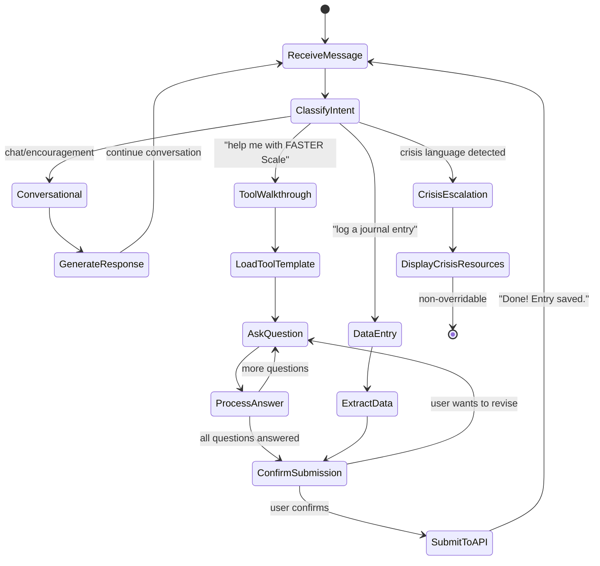
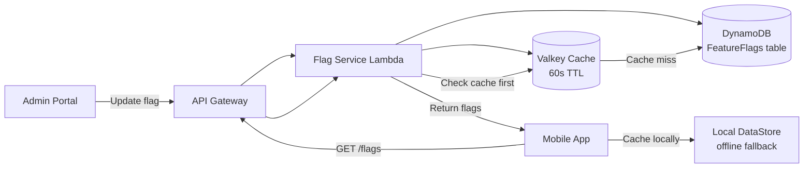

# Regal Recovery — Technical Architecture
**Part 3 of 4** | See also: [Strategic PRD](01-strategic-prd.md) · [Feature Specifications](02-feature-specifications.md) · [Content Strategy](04-content-strategy.md)

---

## 5. Functional & Non-Functional Requirements

### 5.1 Functional Requirements

**User Authentication & Account Management:**
- FR1.1: System shall support email/password, Apple ID, and Google Sign-In authentication
- FR1.2: System shall send email verification upon account creation
- FR1.3: System shall support password reset via email link
- FR1.4: System shall allow users to delete their account with data export option
- FR1.5: System shall support multi-factor authentication (optional)
- FR1.6: System shall support passkey authentication (FIDO2/WebAuthn) as a passwordless sign-in option

**Data Tracking & Storage:**
- FR2.1: System shall track sobriety date(s) for each addiction independently
- FR2.2: System shall calculate and display current streak in real-time
- FR2.3: System shall store complete urge log history with timestamps
- FR2.4: System shall store journal entries with rich text formatting
- FR2.5: System shall store user-created commitments and track compliance
- FR2.6: System shall maintain complete history of check-ins and reviews
- FR2.7: All timestamps on recovery data (urge logs, check-ins, journal entries, sobriety dates, relapse events) shall be immutable once created — no backdating or modification of when an event was recorded

**Notifications & Reminders:**
- FR3.1: System shall send push notifications at user-configured times
- FR3.2: System shall support local notifications (not dependent on server)
- FR3.3: System shall allow users to snooze notifications up to 3 times
- FR3.4: System shall send milestone celebration notifications immediately upon achievement
- FR3.5: System shall send follow-up notifications after urge logging (15 min, 1 hour)

**Offline Functionality:**
- FR4.1: System shall allow core features to function fully offline
- FR4.2: System shall sync offline data automatically when connection restored
- FR4.3: System shall resolve data conflicts using domain-specific merge strategy:
  - Relapse and urge log data: Always preserved from all devices (union merge)
  - Sobriety date: Most conservative value wins (earliest relapse date)
  - Streak calculations: Server recalculates authoritatively after merge
  - Journal entries: Preserved from all devices with timestamps, no overwrite
  - Commitments/check-ins: Deduplicated by date, preserving all unique entries
  - Profile changes: Most recent write wins
  - User notified of any conflicts requiring manual review
- FR4.4: System shall cache affirmations, tools, and resources for offline access
- FR4.5: System shall queue all offline writes and replay in chronological order upon reconnection

**Community & Sharing:**
- FR5.1: System shall allow users to send accountability broadcasts to support network, including via external messaging apps (WhatsApp, Signal, Telegram) through deep links
- FR5.2: System shall support in-app messaging between user and sponsor/counselor
- FR5.3: System shall allow users to invite support contacts via email
- FR5.4: System shall support privacy-controlled data sharing with spouse accounts

**Payments & Subscriptions:**
- FR6.1: System shall integrate with Apple In-App Purchase and Google Play Billing
- FR6.2: System shall support Free Trial, Premium, and Premium+ subscription tiers with monthly and annual billing
- FR6.3: System shall allow subscription management (upgrade, downgrade, cancel)
- FR6.4: System shall provide free trials with variable lengths based on referral source and funnel entry (e.g., 7-day organic, 14-day partner referral, 30-day therapist referral)

**Content Delivery:**
- FR7.1: System shall deliver daily affirmations based on rotation algorithm
- FR7.2: System shall serve premium resources only to paying subscribers
- FR7.3: System shall provide embedded video player
- FR7.4: System shall support content search across articles, devotionals, and videos

**Analytics & Insights:**
- FR8.1: System shall calculate and display urge frequency trends
- FR8.2: System shall identify top triggers automatically
- FR8.3: System shall provide correlation insights
- FR8.4: System shall generate PCI scores and track changes over time

---

### 5.2 Non-Functional Requirements

**Performance:**
- NFR1.1: App launch in <3 seconds
- NFR1.2: Screen navigation in <1 second
- NFR1.3: Streak calculation in <500ms
- NFR1.4: Urge log submission in <2 seconds
- NFR1.5: Calendar view (1 year) in <2 seconds
- NFR1.6: Search results in <1 second

**Reliability:**
- NFR2.1: 99.5% uptime
- NFR2.2: 95% push notification delivery
- NFR2.3: 99% data sync success
- NFR2.4: Zero data loss
- NFR2.5: 100% streak accuracy across time zones

**Scalability:**
- NFR3.1: 500,000 concurrent users
- NFR3.2: 10,000 writes/second
- NFR3.3: 50,000 API requests/minute

**Security:**
- NFR4.1: TLS 1.3+ for all transmission, certificate pinning
- NFR4.2: AES-256 server-side encryption for all data at rest
- NFR4.3: TLS-encrypted messaging for support network conversations
- NFR4.4: bcrypt password hashing (minimum 12 rounds)
- NFR4.5: Rate limiting (100 requests/minute per user)
- NFR4.6: OWASP Top 10 compliance
- NFR4.7: Biometric app lock (Face ID / Touch ID / fingerprint) separate from device unlock
- NFR4.8: Configurable auto-lock, remote session kill, configurable screenshot/screen recording prevention (enabled by default)
- NFR4.9: Secure delete via data purge within 30 days of deletion request
- NFR4.10: Pre-launch penetration test, annual third-party security audit, bug bounty program
- NFR4.11: Age verification: 18+ required during onboarding
- NFR4.12: Passkey (FIDO2/WebAuthn) support

**Privacy:**
- NFR5.1: All recovery data treated as sensitive personal data
- NFR5.2: User content access restricted to the user's own account
- NFR5.3: GDPR and CCPA compliance
- NFR5.4: Jurisdiction-aware data residency
- NFR5.5: Machine-readable data export (JSON)
- NFR5.6: Data deletion within 30 days of request
- NFR5.7: Location data only with explicit consent
- NFR5.8: Data minimization for integrations (Apple Health/Google Fit: specific metrics only)
- NFR5.9: Anonymized product analytics; no analytics on text-based user-generated content (exception: aggregate counters permitted); aggregated financial data permitted
- NFR5.10: Ephemeral mode with configurable auto-delete (7/30/90 days)
- NFR5.11: Explicit opt-in for all analytics
- NFR5.12: All data sharing opt-in; no one can view anything by default
- NFR5.13: User audit trail with optional push notifications for data access events
- NFR5.14: Mandated reporting: individuals legally required to report must abide by their obligations if they view client data revealing illegal behavior; Regal Recovery does not actively monitor user content

**Usability:**
- NFR6.1: iOS 15+, Android 10+ support
- NFR6.2: Screen reader support (VoiceOver/TalkBack)
- NFR6.3: Dynamic font sizing
- NFR6.4: Dark mode
- NFR6.5: One-hand usability
- NFR6.6: 4.5:1 contrast ratio (WCAG AA)

**Compatibility:**
- NFR7.1: Latest 2 versions of Chrome/Safari/Firefox/Edge
- NFR7.2: iPhone SE (2020)+, iPad 6th gen+
- NFR7.3: Android 2GB+ RAM
- NFR7.4: Cross-device sync in <30 seconds

**Localization:**
- NFR8.1: i18n framework from launch
- NFR8.2: English and Spanish at launch
- NFR8.3: Local date/time formats
- NFR8.4: Fully translated UI
- NFR8.5: Settings-based language switch

**Backup & Recovery:**
- NFR9.1: Daily automated server backups (encrypted), 90-day retention
- NFR9.2: Point-in-time recovery (24h)
- NFR9.3: RTO: 4 hours, RPO: 1 hour
- NFR9.4: User backups encrypted before upload (see 10.3.11)

**Monitoring & Logging:**
- NFR10.1: Error logging with stack traces
- NFR10.2: Crash reporting
- NFR10.3: API response time monitoring
- NFR10.4: Engagement metrics (DAU, MAU)
- NFR10.5: Anonymized logs (no PII)

---

### 5.3 Content Safety

**Automated Filtering:** Profanity/hate speech filter, keyword detection for self-harm/suicidal ideation with immediate escalation, spam/link detection

**Crisis Disclosure Protocol:** If self-harm or suicidal ideation detected: immediately display crisis resources, notify emergency contact (if configured)

---

### 5.4 Content Localization Strategy

**Scope:** All user-facing content in English and Spanish at launch.

AI-generated translations with human cultural review for all UI strings (~500), onboarding flows, affirmations, journal prompts, notifications, error messages, and crisis resources. Scripture uses established Spanish translations (RVR1960, Biblia Latinoamericana). Legal documents require professional legal translation.

**Technical Requirements:** Externalized strings, RTL layout support for future expansion, dynamic text sizing for Spanish expansion (~20-30% longer), server-side content by language preference, fallback to English

---

### 5.5 OS Permission Map

Every OS-level permission required by the app, mapped to the features that need it and when it's requested.

#### Permission Summary Table

| Permission | iOS Key | Android Permission | Features | When Requested | Required? |
|---|---|---|---|---|---|
| **Notifications** | Runtime (`UNUserNotificationCenter`) | `POST_NOTIFICATIONS` (13+) | Daily commitment reminders, affirmations, check-ins, milestones, crisis alerts, data access alerts | Onboarding (Fast Track step 5) | Strongly recommended |
| **Biometric Auth** | `NSFaceIDUsageDescription` | `USE_BIOMETRIC` | App lock, session re-auth, sensitive operation gating | First app launch after onboarding | Default required (can disable) |
| **Camera** | `NSCameraUsageDescription` | `CAMERA` | Panic Button biometric awareness (P2) | First Panic Button activation with camera | Opt-in (text fallback) |
| **Microphone** | `NSMicrophoneUsageDescription` | `RECORD_AUDIO` | Voice-to-text (journaling, urge logs, check-ins, FANOS/FITNAP, emotional journaling) | First voice-to-text attempt | Opt-in (text alternative) |
| **Location (foreground)** | `NSLocationWhenInUseUsageDescription` | `ACCESS_FINE_LOCATION` | Meeting Finder (Feature 21) | First "Find meetings nearby" tap | On-demand |
| **Location (background)** | `NSLocationAlwaysAndWhenInUseUsageDescription` | `ACCESS_FINE_LOCATION` + `ACCESS_BACKGROUND_LOCATION` | Trigger-Based Geofencing (Feature 24) | During geofencing setup | Opt-in (default OFF) |
| **Contacts** | `NSContactsUsageDescription` | `READ_CONTACTS` | Support network setup (invite sponsor, AP, counselor) | First "Add support contact" | On-demand (explicit selection only) |
| **Calendar (read)** | `NSCalendarsUsageDescription` | `READ_CALENDAR` | Evening review tomorrow's events, Couples Mode shared calendar | First calendar integration use | On-demand |
| **Calendar (write)** | `NSCalendarsWriteOnlyAccessUsageDescription` | `WRITE_CALENDAR` | Add meetings to calendar (Meeting Finder) | First "Add to Calendar" tap | On-demand |
| **Health (read)** | `NSHealthShareUsageDescription` | `BODY_SENSORS` + Health Connect | Exercise sync, Sleep tracking (Feature 27), Nutrition sync | During integration setup in Settings | Opt-in |
| **Photo Library (read)** | `NSPhotoLibraryUsageDescription` | `READ_MEDIA_IMAGES` (13+) | Family photo upload for Panic Button | First photo upload attempt | Optional |
| **Photo Library (write)** | `NSPhotoLibraryAddOnlyUsageDescription` | Scoped storage (no permission needed) | Save milestone coin images, share achievement graphics | First milestone share/save | Optional |
| **Phone** | N/A (URI scheme) | `CALL_PHONE` (if direct dial) | Panic Button sponsor call, crisis hotline (988), Emergency Tools | On-demand | On-demand |

#### Data Minimization Rules

Per Section 10.3.7, strict data minimization applies to all integrations:

- **Apple Health / Google Fit:** Only: workout type, duration, calories; sleep bedtime/wake/duration; daily step count. **Excluded:** heart rate, blood pressure, medications, reproductive health, clinical records
- **Calendar:** Read title and time only. **Excluded:** attendees, descriptions, locations, attachments (unless user opts in per-field)
- **Contacts:** Only contacts user explicitly selects. **Never:** scan, import, or read the full address book

#### Permission Request Timing

| Phase | Permissions Requested |
|---|---|
| **Onboarding (Day 0)** | Notifications only |
| **First use (contextual)** | Biometric (app lock), Microphone (voice-to-text), Contacts (support network), Calendar (evening review), Location (meeting finder) |
| **Feature setup** | Health integrations (Settings), Geofencing (Settings), Camera (Panic Button biometric layer) |
| **Content sharing** | Photo Library (milestone sharing, family photo upload) |

No permissions are requested during onboarding except Notifications. All others are deferred to the moment they're needed, with clear explanation of why.

---

## 6. User Interaction & Wireframe Ideas

### 6.1 Information Architecture

**Primary Navigation (Bottom Tab Bar - Mobile):**
1. Home/Dashboard
2. Tracker
3. Tools
4. Resources
5. Profile/Settings

### 6.2 UI/UX Design Guidelines

**Color Palette:**
- Primary Blue: #4A90E2 (Trust, stability)
- Success Green: #7ED321 (Achievements)
- Caution Amber: #F5A623 (Struggling)
- Danger Red: #D0021B (Used sparingly)
- Neutral Gray: #4A4A4A
- Gold Accent: #F8E71C (Milestones)
- Calming Purple: #BD10E0 (Evening/spiritual content)

**Typography:**
- Headings: SF Pro Display / Roboto, bold, 24-32pt
- Body: SF Pro Text / Roboto, regular, 16-18pt
- Affirmations: Georgia (serif), medium, 20-24pt

**Iconography:** Rounded, friendly icons, consistent 2px stroke, outline inactive / filled active

**Spacing:** 44x44pt minimum tap targets, 16px card padding, 24px section spacing, generous whitespace

**Animations:** Subtle, purposeful, 300ms transitions, ease-in-out, confetti for milestone celebrations

**Accessibility:** Dynamic Type, scalable fonts, color-blind friendly (icons + color), VoiceOver/TalkBack labels, haptic feedback

---

## 10. Technical Architecture (High-Level)

### 10.1 System Architecture

Decoupled serverless architecture on AWS with native Android (Kotlin + Jetpack Compose) and native iOS (Swift + SwiftUI) clients, API Gateway + Cognito, Lambda functions (Go), DynamoDB, Valkey cache, SQS/SNS event bus, and third-party integrations.

### 10.2 Technology Stack

| Layer | Technology | Rationale |
|---|---|---|
| Mobile (Android) | Kotlin + Jetpack Compose, Room, Hilt | Native Android app with Jetpack Compose UI, Room local database, Hilt DI |
| Mobile (iOS) | Swift + SwiftUI, SwiftData, Swift Package Manager | Native iOS app with SwiftUI, SwiftData local database, native Swift DI |
| Backend Language | Go | Fast Lambda cold starts, strong concurrency, single language |
| Compute | AWS Lambda | Serverless, pay-per-invocation, auto-scaling |
| API Gateway | AWS HTTP API | Native Lambda integration, built-in Cognito authorizer |
| Authentication | AWS Cognito | 50K MAU free tier, OAuth 2.0, social sign-in |
| Database | DynamoDB (on-demand) | Serverless NoSQL, single-digit ms latency |
| Cache | Valkey (Redis-compatible) | In-memory caching for hot data (streaks, dashboards, session state) |
| Object Storage | AWS S3 | Media, backups, static assets |
| CDN | CloudFront | Edge caching |
| Email | AWS SES | Transactional and notification emails |
| Push Notifications | SNS → APNS / FCM | Fan-out to Apple and Google push services |
| Async Messaging | SQS + SNS | Event-driven architecture |
| Secrets | SSM Parameter Store | API keys, config values |
| Monitoring | CloudWatch + X-Ray | Logs, metrics, alarms, tracing |
| CI/CD | GitHub Actions | Deploys via AWS SAM or CDK |
| IaC | AWS CDK (TypeScript) or SAM | All infrastructure as code |
| AI Gateway | LiteLLM + AWS Bedrock | Unified LLM API proxy via Bedrock — provider-agnostic model access (Claude, Llama, Mistral); model fallback, rate limiting, cost tracking |
| AI Orchestration | LangGraph | Stateful agent workflows — multi-step tool walkthroughs, conditional branching, human-in-the-loop |
| AI Observability | Langfuse | LLM tracing, prompt management, evaluation, cost analytics, latency monitoring |

**Estimated Monthly Cost (post-free-tier):** ~$12-38/month (production, excluding LLM API costs); staging is near-zero when idle

### 10.2.3 Recovery Agent Architecture

The Recovery Agent (Feature 8) uses a three-layer AI stack: **LiteLLM** for provider abstraction, **LangGraph** for agent orchestration, and **Langfuse** for observability.

```mermaid
flowchart TD
    subgraph Client["Mobile App (Android / iOS)"]
        UI[Chat UI] --> API_Call[POST /agent/conversations/{id}/messages]
    end

    subgraph AgentService["Agent Service (Go Lambda)"]
        Handler[Agent Handler] --> LG[LangGraph\nAgent Orchestrator]
        LG --> Router{Intent Router}
        Router -->|Conversational| Chat[Chat Node]
        Router -->|Tool Walkthrough| Tool[Tool Execution Node]
        Router -->|Crisis Detected| Crisis[Crisis Escalation Node]

        Chat --> LiteLLM[LiteLLM\nLLM Gateway]
        Tool --> LiteLLM
        Tool --> ToolAPI[Internal API\nActivity/Tool Submission]
        Crisis --> CrisisAPI[Crisis Protocol\nEmergency Tools]

        LiteLLM --> Bedrock[AWS Bedrock]
        Bedrock --> Claude[Claude\nprimary]
        Bedrock --> Llama[Llama\nfallback]
        Bedrock --> Mistral[Mistral\nfallback]
    end

    subgraph Observability["Observability"]
        LG -.->|Trace every step| LF[Langfuse]
        LiteLLM -.->|Log LLM calls| LF
        LF --> Dashboard[Langfuse Dashboard\nCost · Latency · Quality]
    end

    subgraph Data["Data Layer"]
        DDB[(DynamoDB\nConversations)]
        Valkey[(Valkey\nSession Cache)]
    end

    API_Call --> Handler
    Handler --> DDB
    Handler --> Valkey
    ToolAPI --> DDB
```

#### LiteLLM — LLM Gateway

**Purpose:** Provider-agnostic LLM access via AWS Bedrock with automatic failover, rate limiting, and cost control.

**Configuration:**
- **Backend:** AWS Bedrock — all LLM calls routed through Bedrock, keeping data within AWS infrastructure (no external API calls)
- **Primary model:** Claude on Bedrock — best for empathetic, nuanced recovery conversations
- **Fallback chain:** Claude → Llama → Mistral (all via Bedrock; automatic failover on throttling or model unavailability)
- **Rate limiting:** Per-user rate limits to prevent abuse (10 agent messages/minute, 100/hour)
- **Cost controls:** Per-user daily spend cap; alert at 80% of budget; hard cutoff at 100%
- **Model routing:** Different Bedrock models for different tasks:
  - Conversational support → Claude (empathy, safety)
  - Tool data extraction → Claude (structured output via tool use)
  - Content recommendations → Mistral (fast, cost-effective)

**Deployment:**
- **Production/Staging:** LiteLLM proxy runs as a Lambda function with Bedrock IAM permissions. No external API keys needed — uses IAM roles for Bedrock access. Data never leaves AWS.
- **Local:** LiteLLM routes to Ollama (`http://localhost:11434`) running Qwen. Same LiteLLM config interface — application code doesn't know the difference. `make local-up` pulls and starts Ollama with Qwen automatically.

**Why Bedrock:**
- Data stays within AWS VPC — no user context sent to external APIs
- IAM-based access control (no API keys to manage or rotate)
- Bedrock Guardrails for content filtering and topic denial
- Pay-per-token with no provisioned throughput commitment
- Same region as DynamoDB/Valkey — low latency
- Bedrock model evaluation for comparing model performance

#### LangGraph — Agent Orchestration

**Purpose:** Stateful, multi-step agent workflows with tool use, conditional branching, and recovery-specific safety rails.

**Agent Graph:**



**Key design decisions:**
- **Stateful conversations:** LangGraph maintains conversation state across messages (stored in DynamoDB, cached in Valkey). The agent remembers what tool step it's on, what the user has answered so far, and the conversation context.
- **Tool execution requires confirmation:** The agent never submits data without explicit user approval. After collecting all inputs, it shows a summary: "Here's what I'll submit: [data]. Confirm?"
- **Crisis escalation is non-overridable:** If crisis language is detected at any node, the graph immediately transitions to CrisisEscalation. The user cannot redirect back to normal conversation until crisis resources are displayed.
- **Recovery-specific system prompt:** The agent's system prompt includes recovery terminology (from glossary), compassionate language guidelines, and theological guardrails (denominational lens from user settings).

**Supported tool walkthroughs:**
- FASTER Scale (6-stage guided assessment)
- Post-Mortem Analysis (6-section 24-hour review)
- Recovery Check-in (5-7 configurable questions)
- Integrity Inventory (5 dimensions)
- Spouse Check-in Preparation (FANOS/FITNAP)
- Relapse Prevention Plan (review and update)
- Any activity with structured input fields

#### Langfuse — AI Observability

**Purpose:** Full tracing, evaluation, and cost tracking for all AI interactions.

**What is traced:**
- Every LLM call (input, output, model, tokens, latency, cost)
- Every LangGraph state transition (node entered, decision made, time spent)
- Every tool execution (tool name, input data, success/failure)
- Conversation-level metrics (turns to completion, user satisfaction, escalation rate)

**Dashboards:**
- **Cost:** Daily/weekly/monthly LLM spend by model, per-user averages, cost per conversation
- **Latency:** P50/P95/P99 response times, time-to-first-token, model comparison
- **Quality:** Crisis escalation rate, tool completion rate (started vs. finished), user re-engagement after agent interaction
- **Safety:** Flagged responses (theological review needed), crisis detections, guardrail triggers

**Prompt management:**
- All system prompts and prompt templates versioned in Langfuse
- A/B testing of prompt variants (e.g., more vs. less directive tone)
- Prompt performance tracking (which prompt version produces better tool completion rates)

**Evaluation:**
- Periodic human review of random agent conversations (weekly sample)
- Theological review board audits flagged conversations (denominational accuracy)
- Automated quality checks: response length, empathy keywords, crisis detection accuracy

**Privacy:**
- Langfuse traces include conversation metadata (turn count, model used, latency, cost) but **NOT** user-generated text content
- Conversation content is logged only as token counts and classification labels (e.g., "user discussed: urge, trigger:stress, tool:faster-scale") — never raw text
- Langfuse instance is self-hosted (not cloud) to maintain data control
- Traces are retained for 90 days, then purged

### 10.2.1 Environment Plan

Three environments: Local, Staging (ephemeral), and Production.

#### Local Environment

**Purpose:** Developer workstation — fast iteration, offline-capable, zero AWS cost.

| Service | Local Equivalent | Notes |
|---|---|---|
| Lambda | `go run` or SAM CLI `sam local invoke` | Hot reload via `air` for Go |
| API Gateway | SAM CLI `sam local start-api` | Local HTTP server on port 3000 |
| DynamoDB | LocalStack DynamoDB | Persistent data in `./data/dynamodb/` |
| Valkey | Docker `valkey/valkey:latest` | Port 6379 |
| S3 | LocalStack S3 | Local file storage |
| SQS/SNS | LocalStack SQS/SNS | Event processing |
| Cognito | LocalStack Cognito or mocked JWT | Simplified auth for dev |
| SES | Mailhog (Docker) | Captures emails at `localhost:8025` |
| Bedrock (LLM) | Ollama with Qwen | Local LLM for agent development; LiteLLM routes to Ollama in local env |

**Setup:**
```
docker-compose.yml:
  - localstack (DynamoDB, S3, SQS, SNS, Cognito)
  - valkey
  - ollama (with qwen model pulled on first start)
  - mailhog

make local-up       # Start all local services
make local-seed     # Seed DynamoDB with test data (personas: Alex, Marcus, Diego)
make local-down     # Stop all services
make local-reset    # Wipe and re-seed data
```

**Dev workflow:**
```
Terminal 1: make local-up          # Infrastructure
Terminal 2: make dev-api           # Go API with hot reload
Terminal 3: Android Studio / Xcode   # Mobile app pointing to localhost:3000
```

#### Staging Environment

**Purpose:** Pre-production validation — mirrors production architecture but auto-shuts down when idle to minimize cost.

**Deployment:** Same CDK/SAM stack as production, deployed to a separate AWS account or namespace (`regal-staging-*`).

| Component | Staging Configuration | Cost Control |
|---|---|---|
| Lambda | Same Go binaries as production | Pay-per-invocation; $0 when idle |
| API Gateway | Same routes, separate stage | Pay-per-request; $0 when idle |
| DynamoDB | On-demand mode (same as prod) | Pay-per-request; $0 when idle |
| Valkey | `cache.t4g.micro` single node | **Auto-shutdown:** CloudWatch alarm triggers Lambda to stop instance after 2 hours of zero connections |
| S3 | Separate bucket (`regal-staging-*`) | Lifecycle rule: delete objects >7 days old |
| Cognito | Separate user pool | Free tier (50K MAU) |
| CloudFront | Not deployed in staging | Direct API Gateway access |

**Ephemeral Auto-Shutdown:**
- **CloudWatch Alarm:** Monitors `NetworkBytesIn` on Valkey and API Gateway `5XXError` + `Count` metrics
- **If zero traffic for 2 hours:**
  1. Lambda function stops Valkey instance (`elasticache:stop-replication-group`)
  2. SNS notification sent to dev channel: "Staging shut down due to inactivity"
- **Wake-up:** First API request to staging triggers a wake-up Lambda:
  1. Starts Valkey instance (~2-3 minutes)
  2. Returns 503 with `Retry-After: 180` header during warm-up
  3. Subsequent requests route normally once Valkey is healthy
- **Nightly cleanup (2:00 AM UTC):**
  - Purge all DynamoDB test data older than 7 days
  - Delete S3 objects older than 7 days
  - Force-stop Valkey if still running

**Estimated staging cost:** ~$3-8/month (Valkey micro when running + minimal request costs; $0 most of the time)

**Staging-specific configuration:**
- Shorter token expiry (5 min access, 30 min refresh) for faster auth testing
- Aggressive rate limiting (10 req/min) to catch rate-limit handling bugs
- All push notifications routed to a test SNS topic (never to real APNS/FCM)
- SES in sandbox mode (emails only to verified addresses)
- Seeded with persona test data (Alex, Marcus, Diego) on each deploy

#### Production Environment

**Purpose:** Live user-facing environment — high availability, monitoring, alerting.

| Component | Production Configuration | Notes |
|---|---|---|
| Lambda | Go ARM64 (Graviton), 128-512MB memory per function | Provisioned concurrency for auth + tracking (critical path) |
| API Gateway | HTTP API with WAF (per Well-Architected review) | Rate limiting: 100 req/min/user |
| DynamoDB | On-demand with PITR enabled | Auto-scaling; 90-day backup retention |
| Valkey | `cache.t4g.small` Multi-AZ (per Well-Architected review) | Automatic failover |
| S3 | Standard + Intelligent-Tiering lifecycle | Versioning enabled for user backups |
| Cognito | Production user pool with MFA + passkey | Advanced security features enabled |
| CloudFront | Global CDN for static content and API caching | Certificate pinning from mobile clients |
| Monitoring | CloudWatch dashboards + X-Ray tracing + alarms | PagerDuty/SNS alerts for P1 incidents |

**Production safeguards:**
- CDK diff review required before any production deploy
- Canary deployment: new Lambda version receives 10% traffic for 10 minutes, auto-rollback on errors
- DynamoDB PITR: continuous backup, restore to any second within 35 days
- Separate AWS account from staging (account-level isolation)
- All secrets in AWS Secrets Manager (not SSM Parameter Store, per Well-Architected review)

#### Environment Comparison

| Aspect | Local | Staging | Production |
|---|---|---|---|
| **AWS Cost** | $0 | ~$3-8/mo | ~$12-38/mo (early) |
| **Data** | Seeded test data | Seeded + ephemeral test data | Real user data |
| **Auth** | Mocked JWT | Cognito (sandbox) | Cognito (production) |
| **Push Notifications** | Console log | Test SNS topic | Real APNS/FCM |
| **Email** | Mailhog | SES sandbox | SES production |
| **Valkey** | Docker container | Auto-shutdown micro | Multi-AZ small |
| **Monitoring** | Console output | CloudWatch (basic) | CloudWatch + X-Ray + alarms |
| **Deploy method** | `make dev-api` | `make deploy-staging` | `make deploy-prod` (with canary) |
| **Data retention** | Persistent locally | 7-day auto-purge | Indefinite (user-controlled) |
| **WAF** | N/A | N/A | Enabled |
| **LLM** | Ollama + Qwen (local) | Bedrock (sandbox) | Bedrock (Claude primary) |

#### CI/CD Pipeline per Environment

```
git push → GitHub Actions:
  ├── lint + unit tests (always)
  ├── integration tests against LocalStack (always)
  ├── deploy to staging (on merge to main)
  │   ├── staging wakes up if asleep
  │   ├── E2E tests run against staging
  │   └── staging auto-sleeps after tests complete
  └── deploy to production (manual approval or tag-based)
      ├── canary deployment (10% for 10 min)
      ├── auto-rollback on error spike
      └── full rollout if healthy
```

### 10.2.2 Feature Flag System

Lightweight feature flagging attached to every feature, activity, and tool. Enables gradual rollout, kill switches, A/B testing, and per-tenant/per-tier gating without app releases.

#### Architecture

Feature flags are stored in DynamoDB and cached in Valkey with a 60-second TTL. The mobile app fetches flags on launch and every 5 minutes in the background. No third-party feature flag service required.



#### Flag Definition

Every feature, activity, and tool has a corresponding flag:

| Flag Key | Type | Description |
|---|---|---|
| `feature.onboarding` | boolean | Feature 1: Onboarding & Profile Setup |
| `feature.profile-management` | boolean | Feature 2: Profile Management |
| `feature.tracking` | boolean | Feature 3: Tracking System |
| `feature.content-resources` | boolean | Feature 4: Content/Resources System |
| `feature.commitments` | boolean | Feature 5: Commitments System |
| `feature.analytics-dashboard` | boolean | Feature 6: Analytics Dashboard |
| `feature.premium-analytics` | boolean | Feature 7: Premium Advanced Analytics |
| `feature.recovery-agent` | boolean | Feature 8: Recovery Agent |
| `feature.community` | boolean | Feature 9: Community |
| `feature.branding` | boolean | Feature 10: Branding |
| `feature.tenancy` | boolean | Feature 11: Tenancy |
| `feature.dsr` | boolean | Feature 12: Data Subject Rights |
| `feature.backup` | boolean | Feature 13: Data Backup |
| `feature.quick-actions` | boolean | Feature 14: Quick Action Shortcuts |
| `feature.panic-button` | boolean | Feature 16: Panic Button (basic) |
| `feature.panic-button-biometric` | boolean | Feature 16: Panic Button biometric layer |
| `feature.therapist-portal` | boolean | Feature 17: Therapist Portal |
| `feature.health-score` | boolean | Feature 18: Recovery Health Score |
| `feature.achievements` | boolean | Feature 19: Achievement System |
| `feature.superbill` | boolean | Feature 20: Superbill/LMN |
| `feature.meeting-finder` | boolean | Feature 21: Meeting Finder |
| `feature.messaging-integrations` | boolean | Feature 22: Messaging Integrations |
| `feature.offline-first` | boolean | Feature 23: Offline-First |
| `feature.geofencing` | boolean | Feature 24: Geofencing |
| `feature.screen-time` | boolean | Feature 25: Screen Time |
| `feature.couples-mode` | boolean | Feature 26: Couples Recovery Mode |
| `feature.sleep-tracking` | boolean | Feature 27: Sleep Tracking |
| `feature.content-trigger-log` | boolean | Feature 28: Content Trigger Log |
| `feature.recovery-stories` | boolean | Feature 29: Anonymous Recovery Stories |
| `feature.spotify` | boolean | Feature 30: Spotify Integration |
| `feature.dark-mode` | boolean | Feature 31: Light/Dark Mode |
| `activity.sobriety-commitment` | boolean | Daily Sobriety Commitment |
| `activity.affirmations` | boolean | Christian Affirmations |
| `activity.urge-logging` | boolean | Urge Logging & Emergency Tools |
| `activity.journaling` | boolean | Journaling/Jotting |
| `activity.emotional-journaling` | boolean | Emotional Journaling |
| `activity.time-journal` | boolean | Time Journal |
| `activity.check-ins` | boolean | Recovery Check-ins |
| `activity.person-check-ins` | boolean | Person Check-ins |
| `activity.spouse-checkin-prep` | boolean | Spouse Check-in Preparation |
| `activity.step-work` | boolean | Guided 12 Step Work |
| `activity.meetings` | boolean | Meetings Attended |
| `activity.pci` | boolean | Personal Craziness Index |
| `activity.faster-scale` | boolean | FASTER Scale |
| `activity.post-mortem` | boolean | Post-Mortem Analysis |
| `activity.financial` | boolean | Financial Tracker |
| `activity.acting-in` | boolean | Acting In Behaviors |
| `activity.goals` | boolean | Weekly/Daily Goals |
| `activity.devotionals` | boolean | Devotionals |
| `activity.exercise` | boolean | Exercise/Physical Activity |
| `activity.nutrition` | boolean | Nutrition |
| `activity.mood` | boolean | Mood Ratings |
| `activity.gratitude` | boolean | Gratitude List |
| `activity.phone-calls` | boolean | Phone Calls |
| `activity.prayer` | boolean | Prayer |
| `activity.integrity-inventory` | boolean | Daily Integrity Inventory |
| `activity.partner-redemptive-living` | boolean | Partner Activities (Redemptive Living) |
| `activity.breathing` | boolean | Guided Breathing |
| `activity.voice-journal` | boolean | Voice Journal |
| `activity.book-logging` | boolean | Book Logging |
| `activity.memory-verses` | boolean | Memory Verse Study |
| `tool.three-circles` | boolean | 3 Circles Tool |
| `tool.relapse-prevention-plan` | boolean | Relapse Prevention Plan |
| `tool.vision` | boolean | Vision |

#### Flag Properties

Each flag supports these properties:

```json
{
  "key": "feature.recovery-agent",
  "enabled": true,
  "rolloutPercentage": 25,
  "tiers": ["premium-plus"],
  "tenants": ["*"],
  "platforms": ["ios", "android"],
  "minAppVersion": "1.2.0",
  "description": "AI-powered Recovery Agent with guided tool walkthroughs",
  "updatedAt": "2026-04-01T12:00:00Z",
  "updatedBy": "admin@regalrecovery.com"
}
```

| Property | Type | Description |
|---|---|---|
| `key` | string | Unique flag identifier |
| `enabled` | boolean | Master on/off switch (kill switch) |
| `rolloutPercentage` | number (0-100) | Percentage of users who see the feature (gradual rollout) |
| `tiers` | string[] | Subscription tiers that can access: `["free-trial", "premium", "premium-plus"]` or `["*"]` for all |
| `tenants` | string[] | Tenant IDs that can access, or `["*"]` for all |
| `platforms` | string[] | `["ios", "android"]` or `["*"]` |
| `minAppVersion` | string | Minimum app version required (semver) |

#### Flag Evaluation Logic

```
1. Is flag.enabled == false?          → DISABLED (kill switch)
2. Is user's tier in flag.tiers?      → If not, DISABLED
3. Is user's tenant in flag.tenants?  → If not, DISABLED
4. Is user's platform in flag.platforms? → If not, DISABLED
5. Is user's app version >= minAppVersion? → If not, DISABLED
6. Hash(userId + flagKey) % 100 < rolloutPercentage? → If not, DISABLED
7. → ENABLED
```

Evaluation is deterministic per user (same user always gets same result for a given rollout percentage). Uses consistent hashing so increasing rolloutPercentage from 25% to 50% doesn't re-shuffle the first 25%.

#### API

- `GET /flags` — Returns all flags evaluated for the current user (called on app launch + every 5 min)
- `PUT /admin/flags/{key}` — Update a flag (admin only)
- `GET /admin/flags` — List all flags with current values (admin only)
- `GET /admin/flags/{key}/audit` — Flag change history (admin only)

#### Client-Side Implementation

**Android (Kotlin + Jetpack Compose):**

```kotlin
// Hilt-injected feature flag manager
@Singleton
class FeatureFlags @Inject constructor(
    private val flagStore: FlagStore
) {
    fun isEnabled(key: String): Boolean {
        // 1. Check local cache
        // 2. Fallback to last-known state from DataStore
        // 3. Default to false if never fetched (fail closed)
    }
}

// Usage in Compose UI
@Composable
fun DashboardScreen(featureFlags: FeatureFlags = hiltViewModel()) {
    if (featureFlags.isEnabled("activity.time-journal")) {
        TimeJournalCard()
    }
    if (featureFlags.isEnabled("feature.recovery-agent")) {
        RecoveryAgentFAB()
    }
}
```

**iOS (Swift + SwiftUI):**

```swift
// Feature flag manager
@Observable
class FeatureFlags {
    func isEnabled(_ key: String) -> Bool {
        // 1. Check local cache
        // 2. Fallback to last-known state from UserDefaults
        // 3. Default to false if never fetched (fail closed)
    }
}

// Usage in SwiftUI
struct DashboardView: View {
    @Environment(FeatureFlags.self) var featureFlags

    var body: some View {
        VStack {
            if featureFlags.isEnabled("activity.time-journal") {
                TimeJournalCard()
            }
            if featureFlags.isEnabled("feature.recovery-agent") {
                RecoveryAgentFAB()
            }
        }
    }
}
```

#### Offline Behavior

- Flags cached in local DataStore on every successful fetch
- If offline, app uses last-cached flag state
- If app has never fetched flags (first launch offline), all flags default to **false** (fail closed) — only core P0 features hardcoded as always-on (onboarding, sobriety tracker, emergency tools)

#### DynamoDB Storage

| PK | SK | Attributes |
|---|---|---|
| `FLAGS` | `feature.recovery-agent` | enabled, rolloutPercentage, tiers, tenants, platforms, minAppVersion, updatedAt, updatedBy |

Single query `PK = FLAGS` returns all flags. Cached in Valkey with 60-second TTL.

#### Use Cases

| Scenario | How Flags Help |
|---|---|
| **Gradual rollout** | Set `rolloutPercentage: 10` → only 10% of users see the feature; increase over days |
| **Kill switch** | Set `enabled: false` → instantly disable a broken feature without app release |
| **Tier gating** | Set `tiers: ["premium-plus"]` → feature only available to Premium+ subscribers |
| **B2B customization** | Set `tenants: ["tenant-abc"]` → enable a feature for one specific B2B partner |
| **Platform-specific** | Set `platforms: ["ios"]` → iOS-only feature while Android build catches up |
| **Version gating** | Set `minAppVersion: "1.3.0"` → feature only on latest app version |
| **Emergency disable** | Any feature can be turned off in <60 seconds (cache TTL) without a deploy |

### 10.3 Security & Privacy Architecture

#### 10.3.1 Authentication & Session Security

- OAuth 2.0 + JWT tokens (15 min access, rotating refresh)
- RBAC: User, Spouse, Sponsor, Coach, Counselor, Admin
- **Biometric App Lock:** Face ID / Touch ID / fingerprint required to open the app, separate from device unlock
  - Configurable in Settings → Security
  - Required by default; user can disable at own risk with warning
- **Session Security:**
  - Auto-lock after configurable inactivity period (default: 2 minutes; options: 1, 2, 5, 10, 30 minutes, 1 hour, never)
  - Re-authentication required after auto-lock (biometric or PIN)
  - Remote session kill: user can terminate all active sessions from any device via Settings → Security → Active Sessions, or via web portal if device is lost
  - Force re-authentication for sensitive operations: financial data access, arousal template, data export/delete, permission changes
- **Screenshot/Screen Recording Prevention:** Enabled by default on sensitive screens (journals, urge logs, financial data, arousal template, messaging, FANOS/FITNAP entries, post-mortem analysis) using platform APIs (iOS: `UIScreen.isCaptured`; Android: `FLAG_SECURE`)
  - **Configurable:** User can disable in Settings → Privacy → Screenshot Protection
  - When a screenshot attempt is blocked, the app displays: "Screenshot blocked to protect your privacy. You can change this in Settings → Privacy → Screenshot Protection."
- **Age Verification:** 18+ required during onboarding; date of birth collected and validated; users under 18 are blocked from account creation with a message directing them to age-appropriate resources

#### 10.3.2 Data Encryption for User Content

**Zero-knowledge architecture is a future goal.** See [Future Features](05-future-features.md) for the full ZK specification.

**Initial implementation:**
- All data encrypted at rest using AES-256 via AWS DynamoDB server-side encryption (automatic, transparent)
- TLS 1.3 for all data in transit
- Standard account recovery via email/OAuth/passkey
- Server-side search available for user's own content (user-scoped queries only; no cross-user access)
- Field-level encryption is a future enhancement (see [Future Features](05-future-features.md))

#### 10.3.3 Messaging Security

- All in-app messages encrypted in transit (TLS 1.3) and at rest (AES-256 server-side encryption)
- Message content accessible only to sender and recipient (user-scoped access controls)
- Message metadata (timestamps, sender/receiver IDs) stored server-side for delivery
- E2E encryption (Signal Protocol) is a future enhancement (see [Future Features](05-future-features.md))

#### 10.3.4 Encryption & Key Management

- **At Rest:** AES-256 encryption at rest for all data in DynamoDB (AWS managed server-side encryption)
- **In Transit:** TLS 1.3 minimum, certificate pinning for all API calls
- **Key Rotation:** Session tokens rotate every 15 minutes
- **Data Deletion:** On account deletion, all user data is purged from primary storage within 30 days and from backups within 90 days
- **Future enhancements:** Field-level encryption, per-user KMS CMKs, and user-derived client-side keys — see [Future Features](05-future-features.md)

#### 10.3.5 Secure Delete

- Individual item deletion: data record permanently removed from primary storage
- Full account deletion: account deactivated immediately, all user data purged from primary storage within 30 days, purged from backups within 90 days
- Ephemeral mode entries: auto-deleted on configured schedule (7/30/90 days)
- **Future enhancement:** When field-level encryption and per-user keys are implemented, deletion will use cryptographic erasure (key destruction) for immediate, verifiable data destruction

#### 10.3.6 Ephemeral Mode

- User can mark individual entries as ephemeral when creating them (journal, emotional journaling, urge logs, gratitude entries, mood ratings)
- Ephemeral entries auto-delete after a user-configured period: 7 days, 30 days, or 90 days
- Deletion is via cryptographic erasure (key destruction)
- Ephemeral entries are excluded from data exports and cloud backups by default; user can optionally include them via Settings → Privacy → Ephemeral Mode → "Include in exports/backups"
- Visual indicator on ephemeral entries showing time remaining
- User can convert an ephemeral entry to permanent before expiration
- Configurable default: user can set "all new entries are ephemeral" or "ask each time" in Settings → Privacy → Ephemeral Mode

#### 10.3.7 Data Minimization for Integrations

- **Apple Health / Google Fit:** Only pull specific metrics needed:
  - Exercise: workout type, duration, calories burned
  - Sleep: bedtime, wake time, total sleep duration
  - Steps: daily step count
  - Do NOT access: heart rate, blood pressure, medications, reproductive health, clinical records, or any other health categories
- **Calendar (Apple Calendar / Google Calendar):** Read-only access; pull event title and time only; do NOT access attendees, descriptions, locations, or attachments unless user explicitly opts in per-field
- **Contacts:** Only access contacts the user explicitly selects for their support network; never scan or import the full address book

#### 10.3.8 Audit Trail

- **"Who Accessed My Data" screen** (Settings → Privacy → Data Access Log):
  - Every time any support contact (sponsor, spouse, counselor, coach, accountability partner) views any user data, an audit entry is created
  - Each entry shows: who accessed, what data category was viewed, timestamp
  - Audit log stored for 1 year, exportable
- **Push Notification Option:**
  - User can enable push notifications for data access events
  - Example: "Your sponsor viewed your check-in data" / "Your counselor viewed your FASTER Scale results"
  - Configurable: notify for all access, only specific roles, or only specific data categories
  - Enabled via Settings → Privacy → Access Notifications

#### 10.3.9 Anonymized Analytics

- Product analytics (feature usage, engagement, retention) use differential privacy techniques
- Analytics events are never tied to identifiable recovery data
- **No analytics on:** text-based user-generated content (journals, urge log notes, check-in text responses, FANOS/FITNAP entries, post-mortem analysis, prayers, gratitude entries, affirmations, vision, relapse prevention plan). **Exception:** aggregate counters are permitted (e.g., "total journal entries created," "average check-in score across all users") — these count events without accessing content.
- **Aggregated analytics permitted for:** financial tracker data (aggregate only, never individual), feature usage counts, session durations, streak statistics
- Analytics data stored separately from recovery data with no join path to user identity

#### 10.3.10 Tenant Isolation (B2B)

- Tenant data stored in separate DynamoDB partition key spaces with IAM-enforced access boundaries
- **Tenant admin cannot access individual user recovery data** — admin dashboards show only aggregate, anonymized metrics (active users, engagement rates, feature adoption)
- B2B reporting exposes only aggregate, anonymized metrics; no individual-level data
- Tenant deletion purges all tenant data from primary storage within 30 days and backups within 90 days
- Cross-tenant data leakage prevention: API layer enforces tenant context on every request; no shared caches across tenants

#### 10.3.11 Secure Backup Architecture

- **Encryption:** All backup data is encrypted before upload to cloud providers (iCloud, Google Drive, Dropbox)
- **Backup Metadata:** File names and sizes do not reveal recovery-related information (generic naming: `rr_backup_[date].enc`)
- **Backup Restoration:** Requires re-authentication
- **Ephemeral entries:** Excluded from backups by default (optionally included via Settings)
- **Arousal template data:** Included in backups
- **User notice on manual backup:** When a user initiates a manual backup, display: "Your backup is encrypted and not human-readable. If you need a readable copy of your data, use the Export feature in Settings → Privacy → My Data."

#### 10.3.12 Incident Response Plan

- **Breach Notification Commitment:** Users notified within 72 hours of confirmed breach (aligned with GDPR)
- **Severity Classification:**
  - Critical: encryption keys potentially compromised → immediate key rotation, forced re-authentication, user notification
  - High: server breach with potential access to encrypted user data → immediate key rotation, user notification, audit, remediation
  - Medium: metadata exposure (timestamps, user IDs, feature usage) → user notification within 72 hours
  - Low: non-sensitive system data → internal remediation, no user notification required
- **Pre-Written Notification Templates:** Maintained for each severity level and data category
- **Response Team:** Designated incident commander, security lead, communications lead
- **Post-Incident:** Root cause analysis published within 30 days; security improvements documented and implemented

#### 10.3.13 Jurisdiction-Aware Data Residency

- User data stored in the AWS region closest to the user's jurisdiction by default
- B2B tenants can specify required data residency region during provisioning
- For EU users: data stored in EU region (e.g., eu-west-1) to comply with GDPR data residency requirements
- Data never transferred across jurisdictional boundaries without explicit user consent
- Backup data subject to same residency constraints as primary data

#### 10.3.14 Mandated Reporting

- **Regal Recovery's Position:** Regal Recovery does not actively monitor user-generated content. When zero-knowledge architecture is implemented (future release), the platform will be technically unable to read user content.
- **Individual Obligation:** Any individual who is legally required to report (e.g., licensed counselors, therapists, clergy in certain jurisdictions) must abide by their legal mandated reporting obligations if they view client data through the platform that reveals illegal behavior
- **Platform Responsibility:** Regal Recovery will:
  - Clearly disclose in Terms of Service that the platform does not monitor content and cannot fulfill reporting obligations
  - Display a notice to counselor/therapist role users at account creation reminding them of their mandated reporting obligations
  - Not impede any legally required reporting by support contacts
- **No Active Monitoring:** Regal Recovery will not implement content scanning, keyword detection, or automated review of user-generated content. When zero-knowledge architecture is implemented, this commitment will be enforced architecturally.
