# Regal Recovery — Feature Dependency Map
**Supplementary Document** | See also: [Strategic PRD](01-strategic-prd.md) · [Feature Specifications](02-feature-specifications.md) · [Technical Architecture](03-technical-architecture.md) · [Content Strategy](04-content-strategy.md)

---

## Visual Dependency Map

```mermaid
flowchart TD
    %% ───────────────────────────────────────
    %% Style definitions by priority
    %% ───────────────────────────────────────
    classDef p0 fill:#2d8a4e,stroke:#1a5c33,color:#fff
    classDef p1 fill:#2563eb,stroke:#1a44a8,color:#fff
    classDef p2 fill:#d97706,stroke:#92400e,color:#fff
    classDef p3 fill:#6b7280,stroke:#4b5563,color:#fff
    classDef future fill:#dc2626,stroke:#991b1b,color:#fff
    classDef external fill:#7c3aed,stroke:#5b21b6,color:#fff

    %% ───────────────────────────────────────
    %% Foundation Layer (P0)
    %% ───────────────────────────────────────
    subgraph Foundation ["Foundation Layer (P0)"]
        F1["F1: Onboarding &\nProfile Setup"]
        F2["F2: Profile\nManagement"]
        F3["F3: Tracking\nSystem"]
        F12["F12: Data Subject\nRights"]
        F16_base["F16: Panic Button\n(Basic)"]
        F21["F21: Meeting\nFinder"]
        F23["F23: Offline-First\nContent"]
        Activities["Activities\n(Sobriety, Check-ins,\nJournaling, FASTER,\nPCI, Mood, etc.)"]
    end

    %% ───────────────────────────────────────
    %% Core Layer (P1)
    %% ───────────────────────────────────────
    subgraph Core ["Core Layer (P1)"]
        F4["F4: Content/Resources\nSystem"]
        F5["F5: Commitments\nSystem"]
        F6["F6: Analytics\nDashboard"]
        F13["F13: Data Backup"]
        F14["F14: Quick Action\nShortcuts"]
        F15["F15: Content Filter\nAccountability"]
        F17["F17: Therapist\nPortal"]
        F18["F18: Recovery\nHealth Score"]
        F19["F19: Achievement\nSystem"]
        F22["F22: Messaging\nIntegrations"]
    end

    %% ───────────────────────────────────────
    %% Enhanced Layer (P2)
    %% ───────────────────────────────────────
    subgraph Enhanced ["Enhanced Layer (P2)"]
        F9["F9: Community"]
        F10["F10: Branding"]
        F11["F11: Tenancy"]
        F16_bio["F16: Panic Button\n(Biometric Layer)"]
        F20["F20: Superbill/LMN\nGeneration"]
        F24["F24: Trigger-Based\nGeofencing"]
        F25["F25: Screen Time &\nDigital Wellness"]
        F26["F26: Couples\nRecovery Mode"]
        F27["F27: Sleep Tracking\nIntegration"]
        F28["F28: Content\nTrigger Log"]
        F29["F29: Anonymous\nRecovery Stories"]
    end

    %% ───────────────────────────────────────
    %% Premium Layer (P3)
    %% ───────────────────────────────────────
    subgraph Premium ["Premium Layer (P3)"]
        F7["F7: Premium Advanced\nAnalytics"]
        F8["F8: Recovery Chatbot\n/ Agent"]
        F30["F30: Spotify\nIntegration"]
    end

    %% ───────────────────────────────────────
    %% External Dependencies
    %% ───────────────────────────────────────
    subgraph External ["External Dependencies"]
        EXT_clinical["Clinical Partner\nEntity"]
        EXT_platform["Platform APIs\n(Screen Time /\nDigital Wellbeing)"]
        EXT_health["Apple Health /\nGoogle Fit"]
        EXT_spotify["Spotify SDK\n& OAuth"]
        EXT_meeting["NextMeeting SA API\nor Alternative"]
        EXT_location["Location\nPermissions"]
    end

    %% ───────────────────────────────────────
    %% Dependency Arrows
    %% ───────────────────────────────────────

    %% Feature 18: Recovery Health Score
    F3 --> F18
    F5 --> F18
    F6 --> F18
    Activities --> F18

    %% Feature 7: Premium Advanced Analytics
    F6 --> F7

    %% Feature 8: Recovery Chatbot / Agent
    Activities --> F8
    F3 --> F8
    F5 --> F8

    %% Feature 19: Achievement System
    F3 --> F19
    Activities --> F19

    %% Feature 14: Quick Action Shortcuts
    Activities --> F14

    %% Feature 28: Content Trigger Log (blocked by F15)
    F15 --> F28

    %% Feature 26: Couples Recovery Mode
    F9 --> F26

    %% Feature 22: Messaging Integrations
    F9 --> F22

    %% Feature 16: Biometric layer depends on basic Panic Button
    F16_base --> F16_bio

    %% Feature 24: Geofencing
    EXT_location --> F24
    F16_base --> F24

    %% Feature 20: Superbill/LMN Generation
    EXT_clinical --> F20

    %% Feature 25: Screen Time
    EXT_platform --> F25

    %% Feature 27: Sleep Tracking
    EXT_health --> F27

    %% Feature 30: Spotify Integration
    EXT_spotify --> F30

    %% Feature 21: Meeting Finder
    EXT_meeting --> F21

    %% ───────────────────────────────────────
    %% Apply styles
    %% ───────────────────────────────────────
    class F1,F2,F3,F12,F16_base,F21,F23,Activities p0
    class F4,F5,F6,F13,F14,F15,F17,F18,F19,F22 p1
    class F9,F10,F11,F16_bio,F20,F24,F25,F26,F27,F28,F29 p2
    class F7,F8,F30 p3
    class EXT_clinical,EXT_platform,EXT_health,EXT_spotify,EXT_meeting,EXT_location external
```

**Legend:**
- **Green** = P0 (Foundation / Must-Have)
- **Blue** = P1 (Core)
- **Orange** = P2 (Enhanced)
- **Gray** = P3 (Premium)
- **Purple** = External Dependency

---

## Dependency Table

| Feature | Priority | Depends On | Blocked By |
|---------|----------|------------|------------|
| F1: Onboarding & Profile Setup | P0 | None | -- |
| F2: Profile Management | P0 | None | -- |
| F3: Tracking System | P0 | None | -- |
| F12: Data Subject Rights | P0 | None | -- |
| F16: Panic Button (Basic) | P0 | None | -- |
| F21: Meeting Finder | P0 | NextMeeting SA API or alternative meeting database | External: meeting database availability |
| F23: Offline-First Content | P0 | None | -- |
| Activities (Sobriety, Check-ins, Journaling, FASTER Scale, PCI, Mood Ratings, etc.) | P0 | None | -- |
| F4: Content/Resources System | P1 | None | -- |
| F5: Commitments System | P1 | None | -- |
| F6: Analytics Dashboard | P1 | None | -- |
| F7: Premium Advanced Analytics | P3 | F6 (Analytics Dashboard) | F6 must be built first |
| F8: Recovery Chatbot / Agent | P3 | Activities, F3 (Tracking), F5 (Commitments) — acts as conversational interface to most tools | Most activities and tools must be built first |
| F9: Community | P2 | None | -- |
| F10: Branding | P2 | None | -- |
| F11: Tenancy | P2 | None | -- |
| F13: Data Backup | P1 | None | -- |
| F14: Quick Action Shortcuts | P1 | Activities it shortcuts to | Target activities must be built first |
| F15: Content Filter Accountability | P1 | None | **Deferred to future release** |
| F16: Panic Button (Biometric Layer) | P2 | F16 Basic Panic Button (P0) | Basic Panic Button must ship first |
| F17: Therapist Portal | P1 | None | -- |
| F18: Recovery Health Score | P1 | F3 (Tracking), F5 (Commitments), F6 (Analytics Dashboard), Activities (FASTER Scale, Recovery Check-ins, PCI, Mood Ratings, etc.) | F6 (Analytics Dashboard) must be built; sufficient activity data sources required |
| F19: Achievement System | P1 | F3 (Tracking System), multiple Activities | F3 and core Activities must be built first |
| F20: Superbill/LMN Generation | P2 | Clinical partner entity (external) | **External: clinical partner entity not yet established** |
| F22: Messaging Integrations | P1 | F9 (Community) for support network contacts | F9 (Community, P2) must be built first |
| F24: Trigger-Based Geofencing | P2 | Location permissions (external), F16 Basic Panic Button (Urge Logging / Emergency Tools) | External: location permissions |
| F25: Screen Time & Digital Wellness | P2 | Platform APIs: iOS Screen Time, Android Digital Wellbeing (external) | External: platform API availability and restrictions |
| F26: Couples Recovery Mode | P2 | F9 (Community) for permissions model | F9 (Community) must be built first |
| F27: Sleep Tracking Integration | P2 | Apple Health / Google Fit integration (external) | External: health platform API integration |
| F28: Content Trigger Log | P2 | F15 (Content Filter Accountability) | **Blocked: F15 is deferred to future release** |
| F29: Anonymous Recovery Stories | P2 | None | -- |
| F30: Spotify Integration | P3 | Spotify SDK, OAuth (external) | External: Spotify SDK and OAuth integration |

---

## Key Observations

### Blocked Features
1. **F28 (Content Trigger Log)** is fully blocked because it depends on F15 (Content Filter), which is deferred to a future release. F28 cannot ship until F15 ships.
2. **F20 (Superbill/LMN Generation)** is blocked on establishing a clinical partner entity — a business dependency, not a technical one.

### Inverse Dependency (Higher Priority Depends on Lower)
- **F22 (Messaging Integrations, P1)** depends on **F9 (Community, P2)**. This means F9 either needs to be promoted or F22 scoped to work without full Community features.

### Highest Fan-In Features (Most Depended Upon)
| Feature | Depended On By |
|---------|---------------|
| Activities (P0) | F8, F14, F18, F19 |
| F3: Tracking System (P0) | F8, F18, F19 |
| F6: Analytics Dashboard (P1) | F7, F18 |
| F9: Community (P2) | F22, F26 |
| F16: Panic Button Basic (P0) | F16 Biometric, F24 |
| F15: Content Filter (P1, deferred) | F28 |

### Recommended Build Order
1. **Wave 1 (Foundation):** F1, F2, F3, F12, F16 Basic, F23, core Activities
2. **Wave 2 (Core):** F4, F5, F6, F13, F17
3. **Wave 3 (Core + Enhanced):** F9, F14, F18, F19, F21, F22
4. **Wave 4 (Enhanced):** F10, F11, F16 Biometric, F24, F25, F26, F27, F29
5. **Wave 5 (Premium):** F7, F8, F30
6. **Unblocked when ready:** F15, F20, F28
