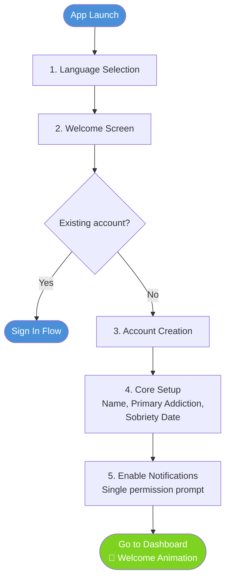

# Feature: Onboarding & Profile Setup

**Priority:** P0 (Must-Have)

**Description:** Language selection, role-based onboarding, personal recovery profile creation, and progressive profile completion strategy designed to minimize drop-off while maximizing the data needed for a personalized recovery experience.

---

## 1. Onboarding Philosophy

### Core Principles

- **Speed to value:** Get the user to the Dashboard and their first meaningful recovery action (morning commitment or urge log) as fast as possible. Every screen before the Dashboard is a barrier between a struggling person and the help they need.
- **Progressive disclosure:** Collect only what's essential upfront. Defer everything else to contextual moments when the information is naturally relevant and the user is motivated to provide it.
- **Emotional safety:** Many users are downloading this app during a crisis — after a relapse, after discovery by a spouse, or at a low point. Onboarding must feel like a warm welcome, not an intake form.
- **No dead ends:** Every screen must have a clear path forward. Optional steps are always skippable. Required steps are minimal and fast.

### Key Design Decision: Two-Track Onboarding

The onboarding is split into two tracks:

1. **Fast Track (3-4 steps)** — Gets the user to the Dashboard in under 2 minutes. Collects only what's required to start using the app.
2. **Deferred Profile Completion** — Prompts the user to complete their profile over the first 7-14 days through contextual, in-app nudges tied to natural moments of engagement.

This replaces the original 11-step linear onboarding, which carried a high risk of drop-off for users in emotional distress.

---

## 2. User Stories

- As a **new user**, I want to start using the app as quickly as possible, so that I can get help right now instead of filling out a long form while I'm struggling
- As a **new user**, I want a welcoming experience that feels safe and compassionate, so that I don't feel judged or overwhelmed before I even start
- As a **new user**, I want to set my sobriety start date immediately, so that my streak begins tracking from day one
- As a **new user**, I want to complete my profile gradually over my first week, so that it doesn't feel like a barrier to getting started
- As a **new user**, I want the app to explain why it's asking for each piece of information, so that I trust that my data is being used to help me — not collected unnecessarily
- As a **new user**, I want to identify my primary addiction, so that the app shows me relevant tools and content from the start
- As a **new user**, I want to skip optional setup steps without guilt, so that I can return to them when I'm ready
- As a **new user in crisis**, I want to access emergency tools immediately, so that I can get help even before completing onboarding
- As a **returning user**, I want to pick up where I left off if I closed the app during onboarding, so that I don't have to start over
- As a **new user**, I want to be prompted to complete my profile at natural moments (after a check-in, before sharing with a sponsor), so that finishing setup feels useful rather than arbitrary

---

## 3. Fast Track Onboarding (Required — 3-4 Steps)

The Fast Track is the only mandatory onboarding path. It collects the minimum information needed to deliver a functional, personalized first session.

**Target completion time:** Under 2 minutes
**Target completion rate:** 95%+

### Flow Diagram



### Step 1: Language Selection

- Auto-detect device language setting
- Display options: "English" / "Español"
- Large, clear buttons with flag icons
- Selection applies immediately to all subsequent screens
- Can be changed later in Settings
- If device language is neither English nor Spanish, default to English
- **No "Next" button needed** — selection advances automatically

### Step 2: Welcome Screen

- **Headline:** "You're not alone. And you're in the right place."
- **Sub-headline:** "Regal Recovery is a private, faith-integrated companion for your recovery journey."
- Three brief value propositions (icon + one line each):
  - 🔒 "Completely private and secure"
  - ✝️ "Faith-integrated tools and community"
  - 📊 "Track your progress, celebrate your growth"
- **Primary CTA:** "Get Started" (large, prominent)
- **Secondary link:** "Already have an account? Sign In"
- **Crisis access:** Small but visible link at bottom: "Need help right now? Tap here" → opens Emergency Tools overlay immediately, no account required
- **Design:** Warm, calming imagery. No clinical or sterile aesthetic. Feels like a safe place, not a medical intake.

### Step 3: Account Creation

- **Sign-up options:** Email, Apple ID, Google (social sign-in buttons at top for one-tap creation)
- **Email flow:**
  - Email field with validation
  - Password field (min 8 characters, 1 uppercase, 1 number, 1 special character)
  - Real-time validation with inline success indicators (not just errors)
- **Legal:** "By creating an account, you agree to our Terms of Service and Privacy Policy" with links — single checkbox, not two
- **"Create Account" button**
- **Email verification:** Sent in background; user is NOT blocked from proceeding. Verification reminder shown on Dashboard with a soft banner: "Verify your email to secure your account." Account fully functional before verification.
- **Biometric opt-in:** After account creation, prompt to enable Face ID / Touch ID / fingerprint for future logins: "Want to skip the password next time?" (single toggle, dismissible)

### Step 4: Core Setup (Single Screen)

This is the only profile screen in the Fast Track. It collects the three pieces of information the app needs to function on day one.

**Fields:**

1. **Display name** (required)
   - Used for community features and personalization ("Good morning, Alex")
   - Helper text: "This is how you'll appear in the app. You can use a nickname."
   - Max 30 characters

2. **Primary addiction** (required)
   - "What brings you here today?"
   - Selection chips (not a dropdown — visible, tappable, friendly):
     - Sex Addiction
     - Pornography
     - Substance Use
     - Gambling
     - Shopping
     - Eating Disorders
     - Other (opens text input)
   - Single select — co-addictions deferred to profile completion
   - Helper text: "This helps us show you the most relevant tools and content."

3. **Sobriety start date** (required)
   - "When did you last act out?"
   - Date picker (default: today)
   - Helper text: "This starts your sobriety tracker. You can update this anytime."
   - No follow-up questions about first attempt or previous streaks — deferred

**"Let's Go" button** — advances to notification permission, then Dashboard

### Step 5: Enable Notifications (Single Prompt)

- **Not a multi-toggle settings screen** — a single, clear ask
- **Message:** "Can we send you a daily reminder to make your recovery commitment?"
- **Context:** "Most people in recovery say this is the single most helpful feature. You can customize notification types and times later."
- **Primary CTA:** "Enable Reminders" → triggers OS notification permission prompt
- **Secondary link:** "Not now" → skips; banner on Dashboard later: "Enable reminders to get the most from your recovery"
- **If granted:** Default notifications activated (morning commitment 8:00 AM, evening review 9:00 PM, daily affirmation 12:00 PM)
- **If denied:** App proceeds normally; notification-dependent features show inline prompts to enable

### Dashboard Arrival

- **Welcome animation:** Brief, warm celebratory moment — not confetti, something dignified (soft glow, gentle checkmark, welcoming message)
- **Message:** "Welcome to your recovery journey, [Name]. Day [X] starts now."
- **Sobriety streak displayed prominently** (even if Day 0 — that's still the beginning)
- **Three suggested first actions** (cards, tappable):
  1. "Make your first commitment" → Morning Commitment flow
  2. "Read today's affirmation" → Affirmation screen
  3. "Set up your support network" → Profile completion (support contacts)
- **Profile completion banner** (persistent but dismissible): "Complete your profile to unlock personalized insights" with progress ring showing X% complete

---

## 4. Deferred Profile Completion Strategy

### Philosophy

Profile completion is not a separate task — it's woven into the app experience over the user's first 7-14 days. Each piece of missing profile information is requested at the moment when it's most relevant and the user is most motivated to provide it.

### Profile Completion Score

- Visible in Settings → Profile as a percentage with progress ring
- Also shown as a subtle, non-intrusive banner on the Dashboard for the first 14 days
- Completing profile sections unlocks specific benefits (insights, personalization, community features)
- **Target:** 80% profile completion within 14 days for active users

### Profile Data & Collection Triggers

The following table maps every profile field to when and how it's collected:

| Profile Field | Fast Track? | Deferred Trigger | Why This Moment? |
|---|---|---|---|
| Display name | ✅ Required | — | Needed for personalization from first screen |
| Primary addiction | ✅ Required | — | Needed for relevant tools and content |
| Sobriety start date | ✅ Required | — | Needed for streak tracking on day one |
| Birth year | ❌ | Day 2: After first morning commitment | "Help us personalize your experience" — low friction, builds on established trust |
| Gender | ❌ | Day 2: After first morning commitment (same screen as birth year) | Helps with content personalization and community matching |
| Marital status | ❌ | Day 3: Before first spouse check-in prep or when browsing spouse-related content | Unlocks spouse features and relevant content; naturally relevant at this moment |
| Time zone | ❌ (auto-detected) | Only if auto-detection fails or user travels | Auto-set; manual override available in Settings |
| Co-addictions | ❌ | Day 3-5: After user logs their first urge or views addiction-related content | "Do you struggle with additional addictions?" — relevant after they've engaged with primary addiction tools |
| Previous recovery history | ❌ | Day 5-7: After first milestone or after viewing streak history | "Is this your first attempt at recovery?" + "Previous longest streak?" — relevant when user is thinking about progress |
| Motivations | ❌ | Day 2-3: After first evening review or affirmation engagement | "What keeps you going?" — emotionally primed after reflecting on the day |
| Support network setup | ❌ | Day 3-5: After first "I'm struggling" moment, or after viewing community features | Motivation to add support contacts is highest when the user feels the need for connection |
| Notification preferences (detailed) | ❌ | Day 4-7: After user has experienced 3-4 different notification types | "Customize your reminders" — user now knows which ones they value |
| App permissions (contacts, calendar, health, location, microphone) | ❌ | Contextually, when the feature that requires the permission is first used | Each permission requested at the moment of use with a clear explanation of why |
| Faith background / denomination | ❌ | Day 5-7: After engaging with devotional or prayer content | Helps personalize spiritual content; user is already in a spiritual mindset |
| Photo | ❌ | Day 7-14: After first community interaction or when viewing their profile | Low priority; optional for community features |

### Contextual Prompt Design

Each deferred profile prompt follows a consistent pattern:

1. **Context line:** Why we're asking right now (tied to what the user just did)
2. **Value line:** What completing this unlocks for them
3. **Input field(s):** As few as possible per prompt (1-3 fields max)
4. **Primary CTA:** "Save" or "Continue"
5. **Skip link:** "Not now" — always available, never guilted
6. **Persistence:** If skipped, the prompt returns once more at the next relevant trigger. After two skips, it moves to Settings → Profile only and does not appear as a prompt again.

### Example Contextual Prompts

**After first morning commitment (Day 2):**
```
┌─────────────────────────────────────────┐
│  Nice work on your first commitment! 🎯 │
│                                          │
│  A couple of quick questions to help     │
│  personalize your experience:            │
│                                          │
│  Birth year: [____]                      │
│  Gender: [Male] [Female] [Prefer not     │
│           to say]                         │
│                                          │
│  [Save]              [Not now]           │
└─────────────────────────────────────────┘
```

**After first evening review (Day 2-3):**
```
┌─────────────────────────────────────────┐
│  You just completed your first day of   │
│  recovery tracking. That's real courage. │
│                                          │
│  What keeps you going? Identifying your │
│  motivations helps on the hard days.     │
│                                          │
│  Select 3 or more:                       │
│  [Restore my relationship with God]      │
│  [Rebuild trust with my spouse]          │
│  [Be a better parent]                    │
│  [Live with integrity]                   │
│  [Freedom from shame]                    │
│  [+ Add your own]                        │
│                                          │
│  [Save]              [Not now]           │
└─────────────────────────────────────────┘
```

**After first "I'm Struggling" tap or urge log (Day 3-5):**
```
┌─────────────────────────────────────────┐
│  You reached out. That matters.          │
│                                          │
│  Do you have people in your corner?      │
│  Connecting your support network means   │
│  help is one tap away next time.         │
│                                          │
│  [Add Sponsor]                           │
│  [Add Accountability Partner]            │
│  [Add Counselor/Coach]                   │
│  [Add Spouse]                            │
│                                          │
│  [Save]              [I'll do this later]│
└─────────────────────────────────────────┘
```

**When user first tries to use voice-to-text (contextual permission):**
```
┌─────────────────────────────────────────┐
│  To use voice journaling, Regal          │
│  Recovery needs access to your           │
│  microphone.                             │
│                                          │
│  Your recordings are processed on-device │
│  and never stored.                       │
│                                          │
│  [Allow Microphone]    [Type Instead]    │
└─────────────────────────────────────────┘
```

**When user first opens calendar integration feature in evening review (contextual permission):**
```
┌─────────────────────────────────────────┐
│  Want to review tomorrow's schedule      │
│  for potential triggers?                 │
│                                          │
│  Connecting your calendar lets you flag  │
│  risky situations before they catch you  │
│  off guard. Calendar data stays on your  │
│  device — it's never sent to our servers.│
│                                          │
│  [Connect Calendar]     [Skip]           │
└─────────────────────────────────────────┘
```

---

## 5. Profile Completion Gamification

### Progress Ring

- Displayed in Settings → Profile and on the Dashboard banner (first 14 days)
- Fills as profile sections are completed
- Shows percentage and "X of Y sections complete"
- Each completed section animates the ring filling with a subtle celebratory pulse

### Unlockable Benefits

Completing specific profile sections unlocks tangible app benefits, giving users a reason beyond compliance:

| Profile Section | What It Unlocks |
|---|---|
| Primary addiction | Relevant tools, content, and affirmation categories |
| Sobriety date | Streak tracking, milestone celebrations |
| Birth year + Gender | Personalized content recommendations, community matching |
| Motivations | Daily motivation display on commitment screen, personalized encouragement during urges |
| Co-addictions | Multi-addiction tracking, relevant secondary content |
| Support network (1+ contact) | Emergency contact buttons, accountability broadcast, person check-in tracking |
| Notification preferences | Customized reminder schedule optimized for their routine |
| Faith background | Denomination-appropriate devotionals, scripture translations, prayer styles |
| Previous recovery history | Personalized milestone messaging ("This is your longest streak since starting recovery" vs. "This is your first streak ever") |

### Completion Milestone

- When profile reaches 80%: brief celebration message — "Your profile is set up! The app is now fully personalized for your recovery journey."
- When profile reaches 100%: badge awarded — "Profile Complete" (visible in profile, optional share)

---

## 6. App Permissions Strategy

### Principle: Ask at the Moment of Use

No permissions are requested during the Fast Track except notifications. All other permissions are requested the first time the user tries to use a feature that requires them.

### Permission Map

| Permission | When Requested | Feature That Triggers It | Explanation Shown |
|---|---|---|---|
| Notifications | Fast Track Step 5 | Core app experience | "So we can send you daily recovery reminders" |
| Microphone | First voice-to-text attempt | Journaling, urge logging, check-ins | "So you can speak your thoughts instead of typing" |
| Contacts | First time user taps "Call Sponsor" or adds support contact by phone | Emergency tools, support network | "So you can quickly reach your support network" |
| Calendar | First time user opens calendar integration in evening review | Evening commitment review | "So you can review tomorrow's events for potential triggers" |
| Health Data | First time user opens Exercise or Nutrition activity with sync option | Exercise, Nutrition | "So we can sync your workouts and activity automatically" |
| Location | First time user taps "Find meetings nearby" or GPS in emergency tools | Meeting finder, emergency tools | "So we can help you find nearby meetings and safe places" |
| Camera / Photos | First time user tries to attach a photo (gratitude list, profile pic) | Gratitude List, Profile | "So you can attach photos to your entries" |

### Permission Denial Handling

- If denied: feature gracefully degrades with a clear explanation of what's limited
- "You can enable this anytime in Settings → Permissions"
- No repeated prompts for the same permission within 7 days
- After OS-level denial: direct link to system Settings (iOS/Android) for manual enable

---

## 7. Onboarding for Non-Addict Roles

The Fast Track described above is for the primary user (the person in recovery). Secondary roles have tailored onboarding flows:

### Spouse Onboarding

**Trigger:** Invited via email by the recovering user, or self-selects "I'm supporting someone in recovery" on the Welcome screen.

**Fast Track (3 steps):**
1. Account creation (same as primary)
2. Role selection: "I'm a spouse/partner supporting someone in recovery"
3. Core setup: Display name, connection to recovering partner (via invite code or email lookup)

**Dashboard:** Spouse-specific dashboard showing partner's shared data (per permissions), betrayal trauma resources, spouse community access, personal journaling

### Sponsor/Accountability Partner Onboarding

**Trigger:** Invited via email by the recovering user.

**Fast Track (3 steps):**
1. Account creation
2. Role selection: "I'm a sponsor/accountability partner"
3. Core setup: Display name, connection to sponsee(s) via invite code

**Dashboard:** Sponsee dashboard showing permitted data, assignment tools, communication

### Counselor/Coach Onboarding

**Trigger:** Self-registration with professional verification, or invited by a client.

**Fast Track (4 steps):**
1. Account creation
2. Role selection: "I'm a counselor/coach"
3. Professional profile: Name, credentials, specializations, website (optional)
4. Client connections: via invite codes or email lookup

**Dashboard:** Client management dashboard, assignment tools, content publishing tools

---

## 8. Returning User & Re-Engagement

### Interrupted Onboarding

- If user exits during Fast Track: progress auto-saved at last completed step
- On next app launch: resumes from where they left off with a welcoming message — "Welcome back. Let's pick up where you left off."
- If user clears app data: account exists (if created), sign-in flow restores progress

### Lapsed User Re-Engagement

- If user completes Fast Track but doesn't open the app for 3+ days:
  - Day 3: Push notification — "Recovery is a daily choice. Your app is ready when you are."
  - Day 7: Push notification — "It's been a week. No judgment — just an open door. Tap to check in."
  - Day 14: Email — "We're still here for you" with a link to open the app directly to the morning commitment
  - Day 30: Final email — "Your data is safe and waiting. Whenever you're ready, we're here."
  - After Day 30: No further automated outreach. User can return at any time; data preserved.

- If user returns after a lapse:
  - No shame messaging
  - "Welcome back, [Name]. Every return is a victory."
  - Sobriety date prompt: "Has your sobriety date changed since you were last here?" (Yes → update; No → continue with existing date)
  - Dashboard shows current state; streak reflects reality without editorializing

### Account Recovery

- Forgot password: email reset link (standard flow)
- Lost access to email: support contact form accessible from sign-in screen
- New device: sign in → all data synced from server; profile and settings restored
- Reinstall after deletion: sign in → data restored if within 30-day deletion window; otherwise, fresh start with option to restore from personal backup (iCloud/Google Drive/Dropbox)

---

## 9. Edge Cases

- **User closes app mid-Fast Track** → Progress auto-saved; resumes on next launch
- **User enters invalid email during account creation** → Inline error: "Please enter a valid email address" — field highlighted, cursor returns to email field
- **User tries to proceed without required fields** → "Let's Go" button disabled; unfilled required fields highlighted with subtle animation drawing attention
- **User selects "Other" for primary addiction** → Text input appears inline; user types custom addiction name; app treats it as a valid addiction for tracking purposes
- **User sets sobriety date in the future** → Validation error: "Your sobriety start date can't be in the future. Please select today or an earlier date."
- **Network failure during account creation** → Error toast: "Something went wrong. Please check your connection and try again." Retry button. All entered data preserved in form.
- **User downloads app during active crisis** → "Need help right now?" link on Welcome screen opens Emergency Tools overlay (crisis hotline, breathing exercise, panic prayer) without requiring account creation
- **User creates account via Apple ID / Google and has no email on file** → App generates a placeholder; prompts for email during deferred profile completion: "Add an email so you can recover your account if needed"
- **User switches language after partial onboarding** → All completed and future screens render in new language; no data loss; available in Settings at any time
- **User is under 18** → Birth year collected during deferred profile completion; if under 18, content adjusted for age-appropriateness; parental consent flow triggered per COPPA/applicable regulations
- **Multiple users on same device** → Each account is independent; sign-out available; no cross-account data leakage; biometric login distinguishes between accounts if both enrolled

---

## 10. Success Criteria

### Fast Track Metrics

- **Completion rate:** 95%+ of users who start the Fast Track reach the Dashboard
- **Time to Dashboard:** Median under 2 minutes (from app launch to Dashboard arrival)
- **Drop-off per step:** < 3% at any individual Fast Track step
- **Crisis access usage:** Track how many users tap "Need help right now?" before creating an account — informs whether crisis features should be even more prominent

### Deferred Profile Completion Metrics

- **Day 7 profile completion:** 60% of active users reach 50%+ profile completion
- **Day 14 profile completion:** 50% of active users reach 80%+ profile completion
- **Day 30 profile completion:** 40% of active users reach 100% profile completion
- **Prompt acceptance rate:** 50%+ of contextual profile prompts accepted on first display
- **Prompt skip-then-complete rate:** 20%+ of skipped prompts completed on second display or via Settings
- **Permission grant rate:** 70%+ for notifications (Fast Track); 60%+ for other permissions when contextually prompted

### Engagement Metrics (First 7 Days)

- **Day 1 action rate:** 80% of users who reach the Dashboard complete at least one recovery action (commitment, affirmation, or urge log) on their first day
- **Day 3 return rate:** 60% of users return to the app within 3 days of onboarding
- **Day 7 return rate:** 40% of users return to the app within 7 days of onboarding
- **Support network connection:** 25% of users add at least one support contact within 7 days
- **Motivations set:** 70% of users define their motivations within 7 days

### Qualitative Metrics

- **Onboarding NPS:** Survey after Day 3 — "How would you rate your first experience with Regal Recovery?" Target: 40+
- **Sentiment analysis:** Monitor support inquiries and app store reviews for onboarding-related friction or praise
- **User testing:** Conduct moderated user testing with 5-10 individuals in recovery before launch; iterate on pain points

---

## 11. Onboarding Content & Messaging Guide

### Tone

- Warm, compassionate, hopeful — never clinical, corporate, or preachy
- Second person ("you") — personal and direct
- Present tense — the journey starts now
- Short sentences — the user may be emotional, distracted, or in crisis
- No exclamation marks in serious contexts — save energy for genuine celebrations

### Key Messages by Stage

| Stage | Primary Message | Emotional Goal |
|---|---|---|
| Welcome screen | "You're not alone. And you're in the right place." | Safety, belonging |
| Account creation | "Your information is private and secure. Always." | Trust, security |
| Core setup | "Just a few things so we can help you today." | Simplicity, no overwhelm |
| Notifications | "One daily reminder can change everything." | Motivation, hope |
| Dashboard arrival | "Welcome to your recovery journey. Day [X] starts now." | Empowerment, beginning |
| First deferred prompt | "Nice work on [action]. Here's one more thing to help you." | Momentum, reward |
| Profile completion | "Your profile is set up. The app is now fully yours." | Ownership, accomplishment |

### Copy to Avoid

- "You must..." / "You need to..." → Use "Would you like to..." / "You can..."
- "Don't forget to..." → Use "When you're ready..."
- "Complete your profile" (as a demand) → "Finish setting up" (as an invitation)
- "Required" (displayed prominently) → Minimize; use inline validation instead
- Any language implying the user is broken, sick, or deficient — they are courageous for being here

---

## 12. Technical Notes

### Auto-Save

- All onboarding form data auto-saved to local storage every field change
- If user exits and returns, all fields pre-populated with previously entered data
- After account creation, auto-saved data pushed to server
- Local auto-save data cleared after successful server sync

### Analytics Events

Track the following events for funnel analysis:

| Event | Description |
|---|---|
| `onboarding_started` | User opens app for the first time |
| `language_selected` | Language chosen (with value) |
| `welcome_screen_viewed` | Welcome screen displayed |
| `crisis_access_tapped` | "Need help right now?" tapped before account creation |
| `account_creation_started` | User begins creating account |
| `account_creation_method` | Which method chosen (email, Apple, Google) |
| `account_created` | Account successfully created |
| `core_setup_completed` | Name, addiction, sobriety date submitted |
| `notification_permission_granted` | User allowed notifications |
| `notification_permission_denied` | User declined notifications |
| `dashboard_reached` | User arrives at Dashboard for the first time |
| `first_action_completed` | First recovery action (commitment, affirmation, urge log) |
| `profile_prompt_shown` | Deferred profile prompt displayed (with prompt type) |
| `profile_prompt_accepted` | User completed a deferred profile prompt |
| `profile_prompt_skipped` | User tapped "Not now" on a deferred profile prompt |
| `profile_completion_percent` | Profile completion percentage (logged daily for first 30 days) |
| `permission_requested` | App permission requested (with permission type) |
| `permission_granted` | App permission granted (with permission type) |
| `permission_denied` | App permission denied (with permission type) |

### A/B Testing Candidates

- Welcome screen messaging variants (different headlines, value propositions)
- Fast Track with vs. without motivations included (4 steps vs. 5 steps)
- Deferred prompt timing (Day 2 vs. Day 3 for first prompt)
- Profile completion banner placement (Dashboard top vs. bottom vs. Settings only)
- Notification permission screen copy variants
- "Need help right now?" placement and visibility on Welcome screen

### Accessibility

- All onboarding screens fully accessible via VoiceOver (iOS) and TalkBack (Android)
- Form fields properly labeled with accessibility hints
- Minimum 44x44pt tap targets on all buttons and interactive elements
- Dynamic font sizing supported throughout
- Color contrast ratio 4.5:1 minimum (WCAG AA)
- Screen reader announces progress: "Step 3 of 5" at each stage
- Error messages announced to screen reader immediately on validation failure
