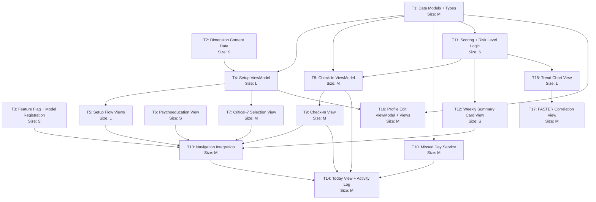

# Life Balance Index (LBI) -- Multi-Agent Implementation Plan

| Field | Value |
|---|---|
| **Feature** | Life Balance Index (PCI/LBI) |
| **Date** | 2026-04-22 |
| **Agent Type** | ios-expert (all tasks) |
| **Target Directory** | `ios/RegalRecovery/RegalRecovery/` |
| **Estimated Waves** | 7 (sequential waves, tasks within each wave run in parallel) |

---

## Table of Contents

1. [Architecture Overview](#1-architecture-overview)
2. [Task Dependency Graph](#2-task-dependency-graph)
3. [Execution Waves](#3-execution-waves)
4. [Task Specifications](#4-task-specifications)
5. [Concurrency Matrix](#5-concurrency-matrix)
6. [Failure Mode Table](#6-failure-mode-table)
7. [Shared Resources and Coordination](#7-shared-resources-and-coordination)
8. [Post-Execution Verification](#8-post-execution-verification)

---

## 1. Architecture Overview

The LBI feature follows the existing MVVM + SwiftData architecture used throughout the Regal Recovery iOS app. Key patterns extracted from the codebase:

- **Models**: `@Model final class` with `@Attribute(.unique) var id: UUID`, `createdAt`/`modifiedAt` timestamps, JSON-encoded arrays stored as `String` properties, registered in `RRModelConfiguration.allModels`
- **ViewModels**: `@Observable class` pattern (not `ObservableObject`), direct `ModelContext` operations in save methods, no repository layer
- **Views**: SwiftUI views using `@Environment(\.modelContext)`, `@Query` for data, `@State private var viewModel = ...` for local VM state
- **Navigation**: `ActivityDestinationView` switch-case routing, `RecoveryWorkView` tile grid, `QuickActionDefinition` catalog, `TodayViewModel` activity log
- **Feature Flags**: `FeatureFlagStore.shared.isEnabled("key")` with UserDefaults-backed storage, seeded in `flagDefaults`
- **Types**: Supporting enums and structs in `Models/Types.swift` with `displayName`, `color`, `icon` computed properties

### File Organization

```
Data/Models/RRModels.swift          -- @Model classes + RRModelConfiguration
Models/Types.swift                  -- Supporting enums, structs, display types
ViewModels/                         -- @Observable view model classes
Views/Activities/PCI/               -- NEW: PCI-specific SwiftUI views
Views/Shared/ActivityDestinationView.swift -- Navigation routing
Views/Work/RecoveryWorkView.swift   -- Recovery Work tab tiles
Views/Today/TodayView.swift         -- Today view integration
Services/FeatureFlagStore.swift     -- Feature flag defaults
```

---

## 2. Task Dependency Graph



---

## 3. Execution Waves

### Wave 1: Foundation (no dependencies)
| Task | Name | Size | Files Created/Modified |
|------|------|------|----------------------|
| T1 | Data Models + Types | M | `Data/Models/RRModels.swift`, new `Models/PCITypes.swift` |
| T2 | Dimension Content Data | S | New `Models/PCIDimensionContent.swift` |
| T3 | Feature Flag + Model Registration | S | `Services/FeatureFlagStore.swift`, `Data/Models/RRModels.swift` |

### Wave 2: Core Business Logic (depends on Wave 1)
| Task | Name | Size | Files Created/Modified |
|------|------|------|----------------------|
| T4 | Setup ViewModel | L | New `ViewModels/PCISetupViewModel.swift` |
| T11 | Scoring + Risk Level Logic | S | New `ViewModels/PCIScoringService.swift` |

### Wave 3: Views + Check-In Logic (depends on Wave 2)
| Task | Name | Size | Files Created/Modified |
|------|------|------|----------------------|
| T5 | Setup Flow Views | L | New `Views/Activities/PCI/PCISetupFlowView.swift`, `PCIDimensionEntryView.swift`, `PCISetupConfirmationView.swift` |
| T6 | Psychoeducation View | S | New `Views/Activities/PCI/PCIPsychoeducationView.swift` |
| T7 | Critical-7 Selection View | M | New `Views/Activities/PCI/PCICriticalSelectionView.swift` |
| T8 | Check-In ViewModel | M | New `ViewModels/PCICheckInViewModel.swift` |
| T10 | Missed Day Service | M | New `Services/PCIMissedDayService.swift` |

### Wave 4: Check-In Views + Summary (depends on Wave 3)
| Task | Name | Size | Files Created/Modified |
|------|------|------|----------------------|
| T9 | Check-In View | M | New `Views/Activities/PCI/PCICheckInView.swift` |
| T12 | Weekly Summary Card View | S | New `Views/Activities/PCI/PCIWeeklySummaryCard.swift` |

### Wave 5: Navigation Integration (depends on Wave 4)
| Task | Name | Size | Files Created/Modified |
|------|------|------|----------------------|
| T13 | Navigation Integration | M | `Views/Shared/ActivityDestinationView.swift`, `Views/Work/RecoveryWorkView.swift`, `ViewModels/RecoveryWorkViewModel.swift` |

### Wave 6: Today View + Trends (depends on Wave 5)
| Task | Name | Size | Files Created/Modified |
|------|------|------|----------------------|
| T14 | Today View + Activity Log | M | `ViewModels/TodayViewModel.swift` |
| T15 | Trend Chart View | L | New `Views/Activities/PCI/PCITrendChartView.swift` |
| T16 | Profile Edit ViewModel + Views | M | New `ViewModels/PCIProfileEditViewModel.swift`, `Views/Activities/PCI/PCIProfileEditView.swift`, `Views/Activities/PCI/PCICriticalItemEditView.swift` |

### Wave 7: Correlation + Polish (depends on Wave 6)
| Task | Name | Size | Files Created/Modified |
|------|------|------|----------------------|
| T17 | FASTER Correlation View | M | New `Views/Activities/PCI/PCICorrelationView.swift` |

---

## 4. Task Specifications

### T1: Data Models + Types

**Agent:** `ios-expert`
**Size:** M
**Wave:** 1
**Dependencies:** None
**Files to create/modify:**
- MODIFY: `ios/RegalRecovery/RegalRecovery/Data/Models/RRModels.swift` -- Add 3 new `@Model` classes
- CREATE: `ios/RegalRecovery/RegalRecovery/Models/PCITypes.swift` -- Supporting Codable types and enums

**Prompt:**

Add the Life Balance Index (LBI/PCI) data models to the Regal Recovery iOS app. This task creates the SwiftData persistence layer and supporting types.

**Part A: SwiftData Models (add to `Data/Models/RRModels.swift`)**

Add these 3 `@Model` classes following the existing patterns in the file (UUID PKs with `@Attribute(.unique)`, `createdAt`/`modifiedAt` timestamps, JSON-encoded complex data stored as `String` properties):

1. `RRPCIProfile` -- One active profile per user
   - `id: UUID` (unique), `userId: UUID`, `isActive: Bool`, `createdAt: Date`, `modifiedAt: Date`, `needsSync: Bool`
   - `@Relationship(deleteRule: .cascade)` to `versions: [RRPCIProfileVersion]?`
   - Inverse relationship: `\RRPCIProfileVersion.profile`
   - Init takes `userId: UUID`, defaults: `id = UUID()`, `isActive = true`, `needsSync = true`, dates = `Date()`

2. `RRPCIProfileVersion` -- Immutable snapshot of indicators + critical selection
   - `id: UUID` (unique), `versionNumber: Int`, `effectiveFrom: Date`, `dimensionsJSON: String`, `criticalItemsJSON: String`, `createdAt: Date`
   - `var profile: RRPCIProfile?` (relationship back-link)
   - Init takes `(profile: RRPCIProfile, versionNumber: Int, dimensions: [PCIDimension], criticalItems: [PCICriticalItem])`, JSON-encodes the arrays to strings using the same pattern as `RRFASTEREntry.selectedIndicatorsJSON`

3. `RRPCIDailyEntry` -- One entry per user per calendar day
   - `id: UUID` (unique), `userId: UUID`, `date: Date`, `profileVersionId: UUID`, `scoresJSON: String`, `totalScore: Int`, `isMissedDay: Bool`, `createdAt: Date`, `modifiedAt: Date`, `needsSync: Bool`
   - Init takes `(userId: UUID, date: Date, profileVersionId: UUID)`, strips time from date using `Calendar.current.startOfDay(for:)`, defaults `scoresJSON = "{}"`, `totalScore = 0`, `isMissedDay = false`
   - Add computed property `scores: [String: Bool]` that decodes/encodes `scoresJSON` (same pattern as `RRUrgeLog.addictionIds`)

Do NOT add these models to `RRModelConfiguration.allModels` yet -- that is a separate task (T3).

**Part B: Supporting Types (create new file `Models/PCITypes.swift`)**

Create a new file at `ios/RegalRecovery/RegalRecovery/Models/PCITypes.swift` with these types:

```swift
import SwiftUI

// MARK: - PCI Dimension Type

enum PCIDimensionType: String, Codable, CaseIterable, Identifiable {
    case physicalHealth = "physical_health"
    case environment = "environment"
    case work = "work"
    case interests = "interests"
    case socialLife = "social_life"
    case familyAndSignificantOthers = "family_significant_others"
    case finances = "finances"
    case spiritualLife = "spiritual_life"
    case compulsiveBehaviors = "compulsive_behaviors"
    case recoveryPractice = "recovery_practice"
    
    var id: String { rawValue }
    
    var displayName: String { /* localized display names */ }
    var sortOrder: Int { /* 0-9 matching the dimension order */ }
}

// MARK: - PCI Risk Level

enum PCIRiskLevel: String, Codable, CaseIterable {
    case optimalHealth = "optimal_health"        // 0-9
    case stableSolidity = "stable_solidity"      // 10-19
    case mediumRisk = "medium_risk"              // 20-29
    case highRisk = "high_risk"                  // 30-39
    case veryHighRisk = "very_high_risk"         // 40-49
    
    static func from(weeklyScore: Int) -> PCIRiskLevel { /* switch on ranges */ }
    
    var displayName: String { /* localized names */ }
    var color: Color { /* green=#34C759, blue=#007AFF, amber=#FF9500, orange=#FF6B35, red=#FF3B30 */ }
    var description: String { /* risk level descriptions from PRD Appendix B */ }
    var scoreRange: ClosedRange<Int> { /* 0...9, 10...19, etc. */ }
}

// MARK: - PCI Codable Types (stored as JSON in profile versions)

struct PCIDimension: Codable, Identifiable {
    var id: UUID
    var dimensionType: PCIDimensionType
    var indicators: [PCIIndicator]
}

struct PCIIndicator: Codable, Identifiable {
    var id: UUID
    var text: String            // Max 200 chars
    var isPositive: Bool        // True only for Interests dimension
}

struct PCICriticalItem: Codable, Identifiable {
    var id: UUID                // Matches the PCIIndicator.id it references
    var dimensionType: PCIDimensionType
    var displayText: String     // For Interests: "Lack of [original text]"
    var originalText: String
    var sortOrder: Int          // 0-6
}
```

Use `String(localized:)` for all user-facing strings, matching the pattern in `Types.swift`.

---

### T2: Dimension Content Data

**Agent:** `ios-expert`
**Size:** S
**Wave:** 1
**Dependencies:** None
**Files to create:**
- CREATE: `ios/RegalRecovery/RegalRecovery/Models/PCIDimensionContent.swift`

**Prompt:**

Create the static content data for the 10 LBI life dimensions. This data is shown during setup to guide users in defining their personal behavioral indicators.

Create a new file at `ios/RegalRecovery/RegalRecovery/Models/PCIDimensionContent.swift` with a struct:

```swift
import Foundation

struct PCIDimensionContent {
    let dimensionType: PCIDimensionType
    let title: String
    let description: String
    let promptQuestion: String
    let exampleBehaviors: [String]
}

extension PCIDimensionContent {
    static let all: [PCIDimensionContent] = [ /* 10 entries */ ]
    
    static func content(for type: PCIDimensionType) -> PCIDimensionContent {
        all.first { $0.dimensionType == type }!
    }
}
```

The 10 dimensions with their content (use `String(localized:)` for all strings):

| # | Dimension Type | Title | Prompt Question | Example Behaviors |
|---|---|---|---|---|
| 1 | `.physicalHealth` | "Physical Health" | "How do you know that you are not taking care of your body?" | "Exceeding target weight", "Missing exercise 2+ days", "Skipping meals", "Not sleeping enough", "Neglecting medication", "Skipping hygiene routines" |
| 2 | `.environment` | "Environment" | "What are ways in which you neglect your living space or daily logistics?" | "Unwashed dishes", "Overdue laundry", "Depleted groceries", "Neglected vehicle maintenance", "Cluttered living space", "Missed routine appointments", "Reckless driving" |
| 3 | `.work` | "Work" | "When your life is unmanageable at work, what are your behaviors?" | "Unreturned calls/emails 24+ hours", "Late to meetings", "Falling behind on commitments", "Overloaded schedule", "Procrastinating important tasks" |
| 4 | `.interests` | "Interests" | "What positive activities give you perspective and joy when you're not overextended?" | "Reading", "Music", "Cooking", "Gardening", "Fishing", "Photography", "Sports", "Creative hobbies", "Time in nature" |
| 5 | `.socialLife` | "Social Life" | "What are signs that you've become isolated from your social support network?" | "Canceling plans", "Not returning friends' calls", "Avoiding social gatherings", "Spending weekends alone", "Losing touch with non-family friends" |
| 6 | `.familyAndSignificantOthers` | "Family, Relationships & Significant Others" | "What behaviors indicate disconnection from those closest to you?" | "Going silent", "Passive-aggressive behavior", "Avoiding conflict conversations", "Breaking promises to family", "Neglecting quality time", "Lying or withholding truth", "Boundary violations" |
| 7 | `.finances` | "Finances" | "What signs indicate that you are financially overextended?" | "Unbalanced checking account", "Overdue bills", "Spending more than earning", "Impulse purchases", "Avoiding looking at bank statements" |
| 8 | `.spiritualLife` | "Spiritual Life & Personal Reflection" | "What sources of spiritual nourishment and personal reflection do you neglect when overextended?" | "Skipping prayer/devotionals", "Missing church", "No Bible reading", "Neglecting journaling", "Avoiding quiet time", "Skipping therapy appointments" |
| 9 | `.compulsiveBehaviors` | "Other Compulsive/Symptomatic Behaviors" | "What negative compulsive or symptomatic behaviors appear when you feel 'on the edge'?" | "Excessive screen time", "Overeating", "Nail biting", "Compulsive shopping", "Jealousy", "Forgetfulness", "Irritability", "Caffeine/sugar overuse" |
| 10 | `.recoveryPractice` | "Recovery Practice & Therapeutic Self-Care" | "What recovery activities do you neglect first?" | "Missing SA/Celebrate Recovery meetings", "Not calling sponsor", "Skipping step work", "Avoiding accountability check-ins", "Neglecting therapeutic homework" |

Add a description paragraph for each dimension. For the Interests dimension, include a note that this is the only positive category -- users should enter activities they enjoy (not warning signs). When an Interest indicator is selected as a critical item, it will be automatically rephrased as "Lack of [activity]" for daily tracking.

---

### T3: Feature Flag + Model Registration

**Agent:** `ios-expert`
**Size:** S
**Wave:** 1
**Dependencies:** None
**Files to modify:**
- MODIFY: `ios/RegalRecovery/RegalRecovery/Services/FeatureFlagStore.swift`
- MODIFY: `ios/RegalRecovery/RegalRecovery/Data/Models/RRModels.swift` (only `RRModelConfiguration.allModels`)

**Prompt:**

Register the PCI data models and ensure the feature flag is properly configured.

**Part A: Model Registration**

In `ios/RegalRecovery/RegalRecovery/Data/Models/RRModels.swift`, add the 3 new PCI model types to `RRModelConfiguration.allModels` array. Add them after the existing entries, before the closing bracket:

```swift
RRPCIProfile.self,
RRPCIProfileVersion.self,
RRPCIDailyEntry.self,
```

IMPORTANT: These models must already exist in the file (added by task T1). If they don't exist yet, this task cannot run. Only modify the `allModels` array -- do not add/change the model classes themselves.

**Part B: Feature Flag**

In `ios/RegalRecovery/RegalRecovery/Services/FeatureFlagStore.swift`, the `activity.pci` flag already exists in `flagDefaults` and is set to `true`. Verify this is the case. No changes needed if it's already there.

The feature flag key used throughout the PCI feature is `"activity.pci"`.

---

### T4: Setup ViewModel

**Agent:** `ios-expert`
**Size:** L
**Wave:** 2
**Dependencies:** T1, T2
**Files to create:**
- CREATE: `ios/RegalRecovery/RegalRecovery/ViewModels/PCISetupViewModel.swift`

**Prompt:**

Create the ViewModel for the LBI setup flow. This manages the progressive dimension-by-dimension indicator entry, save/resume across sessions, and critical-7 selection state.

Create `ios/RegalRecovery/RegalRecovery/ViewModels/PCISetupViewModel.swift` following the `@Observable class` pattern used in `FASTERCheckInViewModel.swift` and `FASTERScaleViewModel.swift`.

```swift
import Foundation
import SwiftUI
import SwiftData

enum PCISetupStep: Equatable {
    case psychoeducation
    case dimension(Int)    // 0-9 index into PCIDimensionType.allCases
    case criticalSelection
    case confirmation
}

@Observable
class PCISetupViewModel {
    // MARK: - Flow State
    var currentStep: PCISetupStep = .psychoeducation
    var hasSeenPsychoeducation: Bool = false
    
    // MARK: - Dimension Entry State
    /// Working copy of dimensions being built during setup.
    /// Keyed by PCIDimensionType, value is array of indicator text strings.
    var dimensionIndicators: [PCIDimensionType: [String]] = [:]
    
    /// Current text fields for the active dimension (up to 5).
    var currentIndicatorTexts: [String] = [""]
    
    // MARK: - Critical Selection State
    var selectedCriticalIds: Set<UUID> = []
    
    // MARK: - Computed Properties
    var currentDimensionIndex: Int { /* extract from currentStep */ }
    var currentDimensionType: PCIDimensionType? { /* allCases[index] */ }
    var currentDimensionContent: PCIDimensionContent? { /* lookup */ }
    var progressFraction: Double { /* currentDimensionIndex / 10.0 */ }
    var progressLabel: String { /* "X of 10" */ }
    var allIndicatorsForSelection: [(PCIDimensionType, PCIIndicator)] { /* flat list */ }
    var canSelectMore: Bool { selectedCriticalIds.count < 7 }
    var selectedCount: Int { selectedCriticalIds.count }
    var isSelectionComplete: Bool { selectedCriticalIds.count == 7 }
    
    // MARK: - Navigation
    func startSetup() { /* move from psychoeducation to dimension(0) */ }
    func nextDimension() { /* save current, advance index or move to criticalSelection */ }
    func previousDimension() { /* go back */ }
    func skipDimension() { /* save empty, advance */ }
    var isFirstDimension: Bool { /* index == 0 */ }
    var isLastDimension: Bool { /* index == 9 */ }
    
    // MARK: - Indicator Entry
    func addIndicatorField() { /* add empty string if under 5 */ }
    func removeIndicatorField(at index: Int) { /* remove if more than 1 */ }
    func loadCurrentDimensionIndicators() { /* populate currentIndicatorTexts from dimensionIndicators */ }
    func saveCurrentDimensionIndicators() { /* store non-empty texts into dimensionIndicators */ }
    
    // MARK: - Critical Selection
    func toggleCriticalSelection(indicatorId: UUID) { /* toggle, enforce max 7 */ }
    func isCriticallySelected(_ id: UUID) -> Bool { /* check set */ }
    
    // MARK: - Build Final Profile Data
    func buildDimensions() -> [PCIDimension] { /* build from dimensionIndicators */ }
    func buildCriticalItems() -> [PCICriticalItem] {
        /* Build from selectedCriticalIds.
           For Interests dimension indicators (isPositive == true),
           set displayText = "Lack of \(originalText)".
           All others: displayText = originalText. */
    }
    
    // MARK: - Persistence
    func save(context: ModelContext, userId: UUID) {
        /* Create RRPCIProfile + RRPCIProfileVersion(versionNumber: 1)
           with built dimensions and critical items.
           Insert into context. */
    }
    
    // MARK: - Resume Support
    func loadExistingProgress(context: ModelContext, userId: UUID) {
        /* Check for existing RRPCIProfile without any versions
           (setup started but not completed).
           If draft data stored, restore dimensionIndicators.
           Use a simple approach: store draft progress as a
           temporary RRPCIProfileVersion with versionNumber 0. */
    }
    
    func saveDraftProgress(context: ModelContext, userId: UUID) {
        /* Save current dimensionIndicators as draft (version 0)
           so setup can resume after app close. */
    }
}
```

Key behaviors:
- Interests dimension indicators should be created with `isPositive = true`
- All other dimension indicators have `isPositive = false`
- Text input fields should be 1-5 per dimension, starting with 1 field
- Empty text fields are filtered out when saving
- A dimension can be skipped (0 indicators)
- The critical selection screen shows all entered indicators grouped by dimension
- Exactly 7 must be selected -- enforce by preventing selection beyond 7 and enabling Done only at exactly 7
- For Interests items selected as critical, prepend "Lack of " to the display text

Follow the pattern of `FASTERCheckInViewModel` for the save method -- take `context: ModelContext` and `userId: UUID` as parameters, create the model objects, and insert into context.

---

### T5: Setup Flow Views

**Agent:** `ios-expert`
**Size:** L
**Wave:** 3
**Dependencies:** T4
**Files to create:**
- CREATE: `ios/RegalRecovery/RegalRecovery/Views/Activities/PCI/PCISetupFlowView.swift`
- CREATE: `ios/RegalRecovery/RegalRecovery/Views/Activities/PCI/PCIDimensionEntryView.swift`
- CREATE: `ios/RegalRecovery/RegalRecovery/Views/Activities/PCI/PCISetupConfirmationView.swift`

**Prompt:**

Create the SwiftUI views for the LBI setup flow. Follow the patterns in `FASTERCheckInFlowView.swift` for the flow container, and standard SwiftUI form patterns for the dimension entry.

**File 1: `Views/Activities/PCI/PCISetupFlowView.swift`**

The top-level flow container that switches between setup steps. Pattern: same as `FASTERCheckInFlowView` -- `NavigationStack` with `Group` switching on `viewModel.currentStep`.

```swift
struct PCISetupFlowView: View {
    @Environment(\.modelContext) private var modelContext
    @Environment(\.dismiss) private var dismiss
    @Query(sort: \RRUser.createdAt) private var users: [RRUser]
    @State private var viewModel = PCISetupViewModel()
    
    var body: some View {
        NavigationStack {
            Group {
                switch viewModel.currentStep {
                case .psychoeducation:
                    PCIPsychoeducationView { viewModel.startSetup() }
                case .dimension(let index):
                    PCIDimensionEntryView(viewModel: viewModel)
                case .criticalSelection:
                    PCICriticalSelectionView(viewModel: viewModel)
                case .confirmation:
                    PCISetupConfirmationView(viewModel: viewModel) {
                        saveAndDismiss()
                    }
                }
            }
            .toolbar { /* back button, dismiss */ }
        }
        .onAppear {
            viewModel.loadExistingProgress(
                context: modelContext,
                userId: users.first?.id ?? UUID()
            )
        }
    }
}
```

**File 2: `Views/Activities/PCI/PCIDimensionEntryView.swift`**

Single dimension screen showing:
- Progress bar at top ("4 of 10" with proportional ProgressView)
- Dimension title (large, bold)
- Description paragraph
- Prompt question (italic or secondary style)
- Example behaviors as bullet points in a secondary-colored card
- 1-5 text input fields with "+" button to add more (up to 5)
- "Skip" and "Next" buttons at bottom

Use `RRFont` for typography if it exists, otherwise standard SwiftUI font modifiers. Use `Color.rrBackground`, `Color.rrSurface`, `Color.rrText`, `Color.rrTextSecondary`, `Color.rrPrimary` for theming (these are used throughout the app).

Each text field should have a 200-character limit. Show "X/200" counter when text is being entered.

On "Next", call `viewModel.saveCurrentDimensionIndicators()` then `viewModel.nextDimension()`.
On "Skip", call `viewModel.skipDimension()`.
On appear, call `viewModel.loadCurrentDimensionIndicators()`.

Auto-save draft progress when navigating between dimensions (call `viewModel.saveDraftProgress(context:userId:)`).

**File 3: `Views/Activities/PCI/PCISetupConfirmationView.swift`**

Shows the final 7 critical items with a "Start Tracking" button. List the 7 items with their dimension labels. For Interests items, show the "Lack of..." rephrased version. Include encouraging text about what happens next (daily check-in explanation).

---

### T6: Psychoeducation View

**Agent:** `ios-expert`
**Size:** S
**Wave:** 3
**Dependencies:** None (can reference T4's types but is just static content)
**Files to create:**
- CREATE: `ios/RegalRecovery/RegalRecovery/Views/Activities/PCI/PCIPsychoeducationView.swift`

**Prompt:**

Create the psychoeducation/onboarding screen shown the first time a user accesses the LBI feature. This is a static content screen with a single action button.

Create `ios/RegalRecovery/RegalRecovery/Views/Activities/PCI/PCIPsychoeducationView.swift`:

```swift
struct PCIPsychoeducationView: View {
    let onGetStarted: () -> Void
    
    var body: some View {
        ScrollView { /* content */ }
    }
}
```

Content to display (use `String(localized:)` for all text):
1. Title: "Life Balance Index"
2. Subtitle: "Inspired by Patrick Carnes' Personal Craziness Index"
3. Section: "What is the Life Balance Index?"
   - Paragraph explaining: "The Life Balance Index (LBI) is your early warning system. It tracks the daily routines and behaviors across 10 areas of your life that keep your recovery strong. When these routines start to slip -- even in small ways -- your LBI score rises, alerting you to take action before the erosion becomes a crisis."
4. Section: "The Boulder Metaphor"
   - Paragraph: "Think of relapse risk like a boulder at the top of a hill. The boulder doesn't suddenly appear -- it gets nudged into motion by dozens of small slips in daily life: skipped meals, missed meetings, unpaid bills, broken promises. By the time you feel the emotional weight (the FASTER Scale stages), the boulder is already rolling. The LBI catches those first nudges."
5. Section: "How It Works"
   - Step 1: "Define your personal warning signs across 10 life dimensions (about 15-20 minutes, and you can save and come back)"
   - Step 2: "Choose your 7 most critical indicators for daily tracking"
   - Step 3: "Each evening, spend less than 60 seconds checking which warning signs showed up today"
   - Step 4: "Watch your weekly trends to catch lifestyle erosion early"
6. Section: "About Missed Days"
   - Paragraph: "If you miss a day, it automatically counts as 7 out of 7. This isn't a punishment -- it's information. When life is so unmanageable that you can't spend 60 seconds checking in, that itself tells you something important."
7. "Get Started" button (prominent, full-width, calls `onGetStarted`)

Use `Color.rrPrimary` for the button, `Color.rrText`/`Color.rrTextSecondary` for text, `Color.rrSurface` for section cards.

---

### T7: Critical-7 Selection View

**Agent:** `ios-expert`
**Size:** M
**Wave:** 3
**Dependencies:** T4
**Files to create:**
- CREATE: `ios/RegalRecovery/RegalRecovery/Views/Activities/PCI/PCICriticalSelectionView.swift`

**Prompt:**

Create the view where users select exactly 7 indicators from all entered indicators across dimensions for daily tracking.

Create `ios/RegalRecovery/RegalRecovery/Views/Activities/PCI/PCICriticalSelectionView.swift`:

```swift
struct PCICriticalSelectionView: View {
    @Bindable var viewModel: PCISetupViewModel
    
    var body: some View { /* ... */ }
}
```

Layout:
1. Header: "Choose Your Critical 7" with subtext "Select the 7 warning signs that matter most to your recovery. These will be your daily check-in items."
2. Counter: "X of 7 selected" -- updates in real-time as items are toggled. Use `Color.rrPrimary` when count < 7, `Color.rrSuccess` when exactly 7.
3. Grouped list: indicators organized by dimension (section headers showing dimension name)
   - Each indicator row shows the text with a checkmark toggle
   - For Interests dimension indicators, show "(will track as: Lack of [text])" in secondary text below the indicator
   - Disabled/grayed checkboxes when 7 are selected and this item is not one of them (prevent selecting 8th)
   - Animate toggle changes
4. "Done" button at bottom -- enabled only when exactly 7 selected, disabled otherwise with label "Select X more"
5. When "Done" is tapped, advance to `viewModel.currentStep = .confirmation`

Skip dimensions that have 0 indicators (don't show an empty section).

Use haptic feedback (UIImpactFeedbackGenerator) on toggle, matching the pattern used elsewhere in the app.

---

### T8: Check-In ViewModel

**Agent:** `ios-expert`
**Size:** M
**Wave:** 3
**Dependencies:** T1, T11
**Files to create:**
- CREATE: `ios/RegalRecovery/RegalRecovery/ViewModels/PCICheckInViewModel.swift`

**Prompt:**

Create the ViewModel for the daily LBI check-in. This manages loading the active profile's critical-7 items, toggle state for each item, scoring, and persistence.

Create `ios/RegalRecovery/RegalRecovery/ViewModels/PCICheckInViewModel.swift`:

```swift
import Foundation
import SwiftUI
import SwiftData

@Observable
class PCICheckInViewModel {
    // MARK: - State
    var criticalItems: [PCICriticalItem] = []
    var toggleStates: [UUID: Bool] = [:]  // item ID -> occurred
    var isEditingExisting: Bool = false
    var existingEntryId: UUID?
    var isLoading: Bool = true
    var hasActiveProfile: Bool = false
    var setupComplete: Bool = false
    
    // MARK: - Computed
    var dailyScore: Int { toggleStates.values.filter { $0 }.count }
    var scoreLabel: String { "\(dailyScore) / 7" }
    
    // MARK: - Load
    func load(context: ModelContext, userId: UUID) {
        /* 
        1. Fetch active RRPCIProfile for userId
        2. Get latest RRPCIProfileVersion (highest versionNumber, versionNumber > 0)
        3. Decode criticalItemsJSON -> [PCICriticalItem]
        4. Set criticalItems sorted by sortOrder
        5. Check for existing RRPCIDailyEntry for today
           - If exists: load its scoresJSON into toggleStates, set isEditingExisting = true
           - If not: initialize all toggleStates to false
        6. Set hasActiveProfile, setupComplete flags
        */
    }
    
    // MARK: - Actions
    func toggleItem(_ itemId: UUID) {
        toggleStates[itemId] = !(toggleStates[itemId] ?? false)
    }
    
    func isItemToggled(_ itemId: UUID) -> Bool {
        toggleStates[itemId] ?? false
    }
    
    // MARK: - Save
    func save(context: ModelContext, userId: UUID) {
        /*
        Encode toggleStates to scoresJSON as [String: Bool] where key is UUID string.
        
        If isEditingExisting:
          - Fetch existing entry by existingEntryId, update scoresJSON, totalScore, modifiedAt
        Else:
          - Create new RRPCIDailyEntry with today's date, active profileVersionId
          - Set scoresJSON, totalScore
          - Insert into context
        */
    }
    
    // MARK: - Weekly Score (for display)
    var currentWeekScore: Int { /* computed from this week's entries */ }
    var currentWeekRiskLevel: PCIRiskLevel { PCIRiskLevel.from(weeklyScore: currentWeekScore) }
}
```

The load method should handle these states:
- No profile exists -> `hasActiveProfile = false`, `setupComplete = false`
- Profile exists but no version with versionNumber > 0 -> `setupComplete = false` (setup was started but not finished)
- Profile + version exists -> load critical items and check for today's entry

Duplicate prevention: query for `RRPCIDailyEntry` where `date == Calendar.current.startOfDay(for: Date())` and `userId` matches. If found, load it for editing.

---

### T9: Check-In View

**Agent:** `ios-expert`
**Size:** M
**Wave:** 4
**Dependencies:** T8
**Files to create:**
- CREATE: `ios/RegalRecovery/RegalRecovery/Views/Activities/PCI/PCICheckInView.swift`

**Prompt:**

Create the daily LBI check-in SwiftUI view with 7 binary toggles, running score, and save button. The target UX is sub-60-second completion.

Create `ios/RegalRecovery/RegalRecovery/Views/Activities/PCI/PCICheckInView.swift`:

```swift
struct PCICheckInView: View {
    @Environment(\.modelContext) private var modelContext
    @Environment(\.dismiss) private var dismiss
    @Query(sort: \RRUser.createdAt) private var users: [RRUser]
    @State private var viewModel = PCICheckInViewModel()
    
    var body: some View { /* ... */ }
}
```

Layout:
1. Navigation title: "Life Balance Check-In"
2. Date display: today's date formatted as "Tuesday, April 22"
3. Score display: large prominent counter showing "X / 7" that updates in real-time. Color-code:
   - 0-2: `Color.rrSuccess` (green)
   - 3-4: amber/orange
   - 5-7: `Color.rrDestructive` (red)
4. 7 toggle rows, each showing:
   - The critical item's `displayText`
   - The dimension type as a subtle subtitle (e.g., "Physical Health")
   - A toggle/checkbox on the right side
   - Row background tints when toggled ON (subtle red/warning tint)
   - Haptic feedback on toggle (`UIImpactFeedbackGenerator(style: .light)`)
5. If editing an existing entry, show "Editing today's check-in" banner at top
6. "Save" button at bottom (always enabled since the user can save with 0 toggles)
7. On save: call `viewModel.save(context:userId:)` then `dismiss()`

On appear: call `viewModel.load(context:userId:)`.

If `viewModel.hasActiveProfile == false`, show a message and button to start setup (navigate to `PCISetupFlowView`).

If `viewModel.setupComplete == false`, show a message about completing setup first.

---

### T10: Missed Day Service

**Agent:** `ios-expert`
**Size:** M
**Wave:** 3
**Dependencies:** T1
**Files to create:**
- CREATE: `ios/RegalRecovery/RegalRecovery/Services/PCIMissedDayService.swift`

**Prompt:**

Create a service that detects and backfills missed days for the LBI. This runs on app launch/foreground and creates automatic score-7 entries for any days the user did not check in.

Create `ios/RegalRecovery/RegalRecovery/Services/PCIMissedDayService.swift`:

```swift
import Foundation
import SwiftData

struct PCIMissedDayService {
    
    /// Check for and backfill any missed days between the last entry and yesterday.
    /// Does NOT create an entry for today (that's the user's responsibility).
    /// Does NOT create entries for days before the profile was set up.
    static func backfillMissedDays(context: ModelContext, userId: UUID) {
        /*
        1. Fetch the active RRPCIProfile for userId
        2. Get the latest RRPCIProfileVersion with versionNumber > 0
           - If none exists, setup is not complete; return early
        3. Get the effectiveFrom date of the first version (version 1)
           - This is the earliest date we should check for missed days
        4. Fetch all existing RRPCIDailyEntry dates for this userId
        5. Determine the range: from max(profileSetupDate, firstEntryDate) to yesterday
        6. For each calendar day in the range that has no entry:
           - Create RRPCIDailyEntry with:
             - date: that day (startOfDay)
             - profileVersionId: the version that was active on that day
               (find the version whose effectiveFrom <= day, with highest versionNumber)
             - scoresJSON: encode all 7 critical item IDs as true
             - totalScore: 7
             - isMissedDay: true
        7. Save context
        */
    }
    
    /// Find the profile version that was active on a given date.
    static func activeVersion(
        for date: Date,
        versions: [RRPCIProfileVersion]
    ) -> RRPCIProfileVersion? {
        /*
        Sort versions by effectiveFrom descending.
        Return the first version where effectiveFrom <= date.
        */
    }
}
```

Key edge cases to handle:
- Multi-day gaps (user gone for 5 days)
- Timezone: use `Calendar.current.startOfDay(for:)` for all date comparisons
- DST transitions: rely on Calendar API which handles this
- Do not create entries for days before the profile was set up
- Do not create an entry for today (only backfill up to yesterday)
- If profile version changed mid-gap, use the correct version for each day
- If no entries exist yet and profile was set up today, do nothing

---

### T11: Scoring + Risk Level Logic

**Agent:** `ios-expert`
**Size:** S
**Wave:** 2
**Dependencies:** T1
**Files to create:**
- CREATE: `ios/RegalRecovery/RegalRecovery/ViewModels/PCIScoringService.swift`

**Prompt:**

Create the scoring logic for computing weekly LBI scores and mapping them to risk levels.

Create `ios/RegalRecovery/RegalRecovery/ViewModels/PCIScoringService.swift`:

```swift
import Foundation
import SwiftData

struct PCIScoringService {
    
    /// Compute the weekly score for a given ISO week (Monday-Sunday).
    /// Returns the sum of daily totalScore values for that week.
    static func weeklyScore(
        for weekStart: Date,
        entries: [RRPCIDailyEntry]
    ) -> Int {
        let calendar = Calendar.current
        let weekEnd = calendar.date(byAdding: .day, value: 7, to: weekStart)!
        let weekEntries = entries.filter { entry in
            entry.date >= weekStart && entry.date < weekEnd
        }
        return weekEntries.reduce(0) { $0 + $1.totalScore }
    }
    
    /// Get the Monday start date of the ISO week containing the given date.
    static func weekStart(for date: Date) -> Date {
        var calendar = Calendar.current
        calendar.firstWeekday = 2 // Monday
        let components = calendar.dateComponents([.yearForWeekOfYear, .weekOfYear], from: date)
        return calendar.date(from: components)!
    }
    
    /// Compute weekly scores for the last N weeks.
    /// Returns array of (weekStart, score, riskLevel) sorted chronologically.
    static func weeklyScores(
        weeks: Int,
        from date: Date,
        entries: [RRPCIDailyEntry]
    ) -> [(weekStart: Date, score: Int, riskLevel: PCIRiskLevel)] {
        var results: [(Date, Int, PCIRiskLevel)] = []
        var calendar = Calendar.current
        calendar.firstWeekday = 2
        
        for i in (0..<weeks).reversed() {
            let ws = calendar.date(byAdding: .weekOfYear, value: -i, to: weekStart(for: date))!
            let score = weeklyScore(for: ws, entries: entries)
            results.append((ws, score, PCIRiskLevel.from(weeklyScore: score)))
        }
        return results
    }
    
    /// Week-over-week delta.
    static func weeklyDelta(
        currentWeekStart: Date,
        entries: [RRPCIDailyEntry]
    ) -> Int? {
        let calendar = Calendar.current
        guard let previousWeekStart = calendar.date(
            byAdding: .weekOfYear, value: -1, to: currentWeekStart
        ) else { return nil }
        
        let current = weeklyScore(for: currentWeekStart, entries: entries)
        let previous = weeklyScore(for: previousWeekStart, entries: entries)
        
        // Only return delta if previous week has data
        let prevEnd = calendar.date(byAdding: .day, value: 7, to: previousWeekStart)!
        let hasPreviousData = entries.contains { $0.date >= previousWeekStart && $0.date < prevEnd }
        return hasPreviousData ? current - previous : nil
    }
    
    /// Partial week info for display.
    static func partialWeekInfo(
        weekStart: Date,
        entries: [RRPCIDailyEntry]
    ) -> (daysCompleted: Int, runningScore: Int) {
        let calendar = Calendar.current
        let weekEnd = calendar.date(byAdding: .day, value: 7, to: weekStart)!
        let weekEntries = entries.filter { $0.date >= weekStart && $0.date < weekEnd }
        return (weekEntries.count, weekEntries.reduce(0) { $0 + $1.totalScore })
    }
}
```

Weeks run Monday through Sunday (ISO 8601). Use `Calendar` with `firstWeekday = 2` for all week calculations.

---

### T12: Weekly Summary Card View

**Agent:** `ios-expert`
**Size:** S
**Wave:** 4
**Dependencies:** T11
**Files to create:**
- CREATE: `ios/RegalRecovery/RegalRecovery/Views/Activities/PCI/PCIWeeklySummaryCard.swift`

**Prompt:**

Create a reusable weekly summary card that shows the current week's LBI score, risk level, and week-over-week change.

Create `ios/RegalRecovery/RegalRecovery/Views/Activities/PCI/PCIWeeklySummaryCard.swift`:

```swift
struct PCIWeeklySummaryCard: View {
    let weeklyScore: Int
    let riskLevel: PCIRiskLevel
    let delta: Int?           // Week-over-week change, nil if no previous data
    let daysCompleted: Int    // 0-7, for partial week display
    let isPartialWeek: Bool
    
    var body: some View { /* ... */ }
}
```

Layout:
1. Card with rounded corners, `Color.rrSurface` background
2. Left side: large score number with risk level color
3. Center: risk level name and one-line description
4. Right side (if delta is not nil):
   - Up arrow + positive number in amber/red (score went up = worse)
   - Down arrow + negative number in green (score went down = better)
   - Dash for zero change
5. Bottom: if partial week, show "X of 7 days so far this week"
6. Risk level color as a left border accent

Use the risk level colors from `PCIRiskLevel.color`:
- Optimal Health: Green (#34C759)
- Stable Solidity: Blue (#007AFF)
- Medium Risk: Amber (#FF9500)
- High Risk: Orange (#FF6B35)
- Very High Risk: Red (#FF3B30)

---

### T13: Navigation Integration

**Agent:** `ios-expert`
**Size:** M
**Wave:** 5
**Dependencies:** T3, T5, T6, T7, T9, T12
**Files to modify:**
- MODIFY: `ios/RegalRecovery/RegalRecovery/Views/Shared/ActivityDestinationView.swift`
- MODIFY: `ios/RegalRecovery/RegalRecovery/Views/Work/RecoveryWorkView.swift`
- MODIFY: `ios/RegalRecovery/RegalRecovery/ViewModels/RecoveryWorkViewModel.swift`

**Prompt:**

Wire up the LBI feature into the app's navigation system. The LBI needs to be accessible from the Recovery Work tab and from quick action routing.

**Part A: `ActivityDestinationView.swift`**

Replace the existing PCI placeholder:
```swift
case "pci":
    Text("PCI - Coming Soon")
        .font(RRFont.title3)
        .foregroundStyle(Color.rrTextSecondary)
```

With a view that checks setup state and routes accordingly:
```swift
case "pci":
    PCIEntryPointView()
```

Create a new lightweight view (can be in the same file or in `Views/Activities/PCI/PCIEntryPointView.swift`) that:
1. Queries for existing `RRPCIProfile` with `isActive == true` for the current user
2. Checks if a completed profile version exists (versionNumber > 0)
3. If no profile or no completed version: show `PCISetupFlowView` (start/resume setup)
4. If setup complete: show `PCICheckInView` (or a hub view with check-in + summary card)

**Part B: `RecoveryWorkViewModel.swift`**

Find the PCI tile entry in `allTiles`:
```swift
WorkTileItem(
    id: "activity.pci",
    title: String(localized: "PCI"),
    icon: "checklist",
    iconColor: .rrDestructive,
    category: .activities,
    featureFlagKey: nil,
    implemented: false,
    activityTypeKey: nil
),
```

Replace with:
```swift
WorkTileItem(
    id: "activity.pci",
    title: String(localized: "Life Balance"),
    icon: "checklist",
    iconColor: .orange,
    category: .activities,
    featureFlagKey: "activity.pci",
    implemented: true,
    activityTypeKey: "pci"
),
```

**Part C: `RecoveryWorkView.swift`**

In the `destinationView(for:)` method, replace:
```swift
case "pci":
    Text("PCI - Coming Soon")
        .font(RRFont.title3)
        .foregroundStyle(Color.rrTextSecondary)
```

With:
```swift
case "pci":
    PCIEntryPointView()
```

Also add PCI to the `todayStatus` method in `RecoveryWorkViewModel` to show completion status on the tile. Add a case for `"pci"` that queries today's `RRPCIDailyEntry` and returns `.completed` if one exists or `.hasEntries("X/7")` with the score.

NOTE: The RecoveryWorkView already has `@Query` for many model types. You will need to add `@Query(sort: \RRPCIDailyEntry.date, order: .reverse) private var pciEntries: [RRPCIDailyEntry]` and pass it through to the status computation. Follow the same pattern used for FASTER entries.

---

### T14: Today View + Activity Log

**Agent:** `ios-expert`
**Size:** M
**Wave:** 6
**Dependencies:** T8, T9, T10, T13
**Files to modify:**
- MODIFY: `ios/RegalRecovery/RegalRecovery/ViewModels/TodayViewModel.swift`

**Prompt:**

Integrate LBI into the Today view's activity log and completion tracking.

Modify `ios/RegalRecovery/RegalRecovery/ViewModels/TodayViewModel.swift`:

**Part A: Activity Log**

In the `loadTodayActivityLog(context:)` method, add a new section after the existing entries (follow the exact pattern used for FASTER Scale entries):

```swift
// PCI / Life Balance
let pciDesc = FetchDescriptor<RRPCIDailyEntry>(
    predicate: #Predicate { $0.date >= todayStart && $0.date < tomorrow },
    sortBy: [SortDescriptor(\.date, order: .reverse)]
)
if let results = try? context.fetch(pciDesc) {
    for p in results {
        let scoreText = "\(p.totalScore)/7"
        let detail = p.isMissedDay ? "Missed - Auto-scored 7" : scoreText
        all.append((p.createdAt, RecentActivity(
            title: "Life Balance",
            detail: detail,
            time: fmt.localizedString(for: p.createdAt, relativeTo: now),
            icon: "checklist",
            iconColor: .orange
        )))
    }
}
```

**Part B: Completion Timestamps**

In the `completionTimestamps(activityType:context:)` method, add a case for `"pci"`:

```swift
if activityType == "pci" {
    return fetchDates(
        RRPCIDailyEntry.self,
        predicate: #Predicate { $0.date >= todayStart && $0.date < tomorrow && $0.isMissedDay == false },
        dateKeyPath: \.createdAt,
        context: context
    )
}
```

**Part C: Completion Check**

In the `isActivityCompleted(activityType:context:)` method, add a case for `"pci"`:

```swift
if activityType == "pci" {
    return hasRecord(
        RRPCIDailyEntry.self,
        predicate: #Predicate { $0.date >= todayStart && $0.date < tomorrow && $0.isMissedDay == false },
        context: context
    )
}
```

**Part D: Missed Day Backfill on Load**

In the `load(context:)` method, add a call to run missed-day backfill:

```swift
func load(context: ModelContext) {
    loadAddictions(context: context)
    loadUser(context: context)
    loadStreak(context: context)
    loadSobriety(context: context)
    loadPlanItems(context: context)
    computeScore()
    loadRecoveryWorkCards(context: context)
    loadTodayActivityLog(context: context)
    
    // Backfill missed PCI days
    if let userId = (try? context.fetch(FetchDescriptor<RRUser>()))?.first?.id {
        PCIMissedDayService.backfillMissedDays(context: context, userId: userId)
    }
}
```

---

### T15: Trend Chart View

**Agent:** `ios-expert`
**Size:** L
**Wave:** 6
**Dependencies:** T11
**Files to create:**
- CREATE: `ios/RegalRecovery/RegalRecovery/Views/Activities/PCI/PCITrendChartView.swift`

**Prompt:**

Create a 12-week trend line chart using Swift Charts with color-coded risk level bands.

Create `ios/RegalRecovery/RegalRecovery/Views/Activities/PCI/PCITrendChartView.swift`:

```swift
import SwiftUI
import Charts
import SwiftData

struct PCITrendChartView: View {
    @Environment(\.modelContext) private var modelContext
    @Query(sort: \RRUser.createdAt) private var users: [RRUser]
    @Query(sort: \RRPCIDailyEntry.date) private var allEntries: [RRPCIDailyEntry]
    
    var body: some View { /* ... */ }
}
```

Chart specification:
1. **Line chart** using Swift Charts (`Chart { LineMark(...) }`)
2. **X-axis**: Week labels (e.g., "W1", "W2", ... "W12" or date labels like "Apr 7")
3. **Y-axis**: Score range 0-49
4. **Data points**: Weekly scores computed via `PCIScoringService.weeklyScores(weeks: 12, ...)`
5. **Risk level bands**: Background `RectangleMark` areas with low-opacity fills:
   - 0-9: Green (`.opacity(0.1)`)
   - 10-19: Blue
   - 20-29: Amber
   - 30-39: Orange
   - 40-49: Red
6. **Data point styling**: Circle symbols on the line, colored by risk level of that week's score
7. **Tappable data points**: Use `chartOverlay` with `DragGesture` to detect taps near data points. Show a popover/annotation with "Week N: Score X (Risk Level)" and the daily breakdown for that week
8. **Placeholder**: If fewer than 2 weeks of data, show "Keep tracking -- your trend will appear after 2 weeks" message instead of the chart

Chart should be responsive to different screen sizes (iPhone SE through Pro Max).

Use `Color(red:green:blue:)` with the exact hex values from the PRD:
- Green: #34C759
- Blue: #007AFF
- Amber: #FF9500
- Orange: #FF6B35
- Red: #FF3B30

---

### T16: Profile Edit ViewModel + Views

**Agent:** `ios-expert`
**Size:** M
**Wave:** 6
**Dependencies:** T1, T4
**Files to create:**
- CREATE: `ios/RegalRecovery/RegalRecovery/ViewModels/PCIProfileEditViewModel.swift`
- CREATE: `ios/RegalRecovery/RegalRecovery/Views/Activities/PCI/PCIProfileEditView.swift`
- CREATE: `ios/RegalRecovery/RegalRecovery/Views/Activities/PCI/PCICriticalItemEditView.swift`

**Prompt:**

Create the profile editing flow that lets users view/edit indicators and change their critical-7 selection, with automatic profile versioning.

**File 1: `ViewModels/PCIProfileEditViewModel.swift`**

```swift
@Observable
class PCIProfileEditViewModel {
    var dimensions: [PCIDimension] = []
    var criticalItems: [PCICriticalItem] = []
    var selectedCriticalIds: Set<UUID> = []
    var currentVersionNumber: Int = 0
    var profileId: UUID?
    
    func load(context: ModelContext, userId: UUID) {
        /* Load current profile and latest version.
           Decode dimensionsJSON and criticalItemsJSON.
           Populate selectedCriticalIds from current critical items. */
    }
    
    func saveIndicatorChanges(context: ModelContext, userId: UUID) {
        /* Create a new RRPCIProfileVersion with incremented versionNumber.
           Encode updated dimensions and current critical items.
           Set effectiveFrom to now. */
    }
    
    func saveCriticalChanges(context: ModelContext, userId: UUID) {
        /* Create a new RRPCIProfileVersion with incremented versionNumber.
           Build new critical items from selectedCriticalIds.
           Handle Interests rephrasing.
           Set effectiveFrom to now. */
    }
}
```

**File 2: `Views/Activities/PCI/PCIProfileEditView.swift`**

Shows all 10 dimensions with their indicators in an editable list:
- Section per dimension with dimension name header
- Each indicator as an editable text field
- "+" button to add indicator (if under 5)
- Swipe to delete indicator
- "Save Changes" button that calls `saveIndicatorChanges` (creates new version)

**File 3: `Views/Activities/PCI/PCICriticalItemEditView.swift`**

Similar to `PCICriticalSelectionView` but for editing existing selections:
- Shows all indicators grouped by dimension
- Current critical items pre-selected
- Toggle to change selection (maintain exactly 7)
- "Save Changes" creates new profile version
- Show warning: "Historical entries will keep your previous selections. New check-ins will use these updated items."

---

### T17: FASTER Correlation View

**Agent:** `ios-expert`
**Size:** M
**Wave:** 7
**Dependencies:** T15
**Files to create:**
- CREATE: `ios/RegalRecovery/RegalRecovery/Views/Activities/PCI/PCICorrelationView.swift`

**Prompt:**

Create a view that displays the LBI weekly trend alongside FASTER Scale stage history on a shared timeline, showing the upstream-downstream relationship.

Create `ios/RegalRecovery/RegalRecovery/Views/Activities/PCI/PCICorrelationView.swift`:

```swift
import SwiftUI
import Charts
import SwiftData

struct PCICorrelationView: View {
    @Environment(\.modelContext) private var modelContext
    @Query(sort: \RRPCIDailyEntry.date) private var pciEntries: [RRPCIDailyEntry]
    @Query(sort: \RRFASTEREntry.date) private var fasterEntries: [RRFASTEREntry]
    
    var body: some View { /* ... */ }
}
```

Layout:
1. Title: "Life Balance & FASTER Correlation"
2. Top chart: LBI weekly trend line (reuse `PCIScoringService` for data)
3. Bottom chart: FASTER stage markers on the same time axis
   - Each FASTER entry shown as a point/dot colored by stage (`FASTERStage.color`)
   - X-axis aligned with the LBI chart above
4. Shared time axis: both charts cover the same date range (12 weeks)
5. Visual alignment: use the same x-axis scale so users can see how LBI score rises precede FASTER stage escalation

If user has LBI data but no FASTER data, show only the LBI trend with a message: "Add FASTER Scale check-ins to see how life balance relates to relapse risk."

If user has neither, show a placeholder encouraging them to start tracking.

Use `FASTERStage(rawValue:)` to convert stored `Int` stage values to the enum. Reference the colors from `FASTERStage.color` (defined in `Types.swift`).

---

## 5. Concurrency Matrix

Tasks that can safely execute in parallel within each wave (no shared file conflicts):

| Wave | Parallel Tasks | Shared Resource Conflicts |
|------|---------------|--------------------------|
| 1 | T1, T2, T3 | T1 and T3 both modify `RRModels.swift` -- T3 depends on T1's model classes existing. Sequence T3 after T1, or T3 only modifies `allModels` array. **Resolution: T3 MUST run after T1 in practice, despite being in the same wave.** |
| 2 | T4, T11 | None -- separate new files |
| 3 | T5, T6, T7, T8, T10 | None -- all create new files in different paths |
| 4 | T9, T12 | None -- separate new files |
| 5 | T13 | Single task; modifies 3 existing files |
| 6 | T14, T15, T16 | T14 modifies `TodayViewModel.swift`; T15 and T16 create new files. Safe in parallel. |
| 7 | T17 | Single task; creates new file |

### Wave 1 Constraint

T1 and T3 both modify `RRModels.swift`. To prevent merge conflicts:
- **T1** adds the 3 `@Model` classes anywhere in the file (above the `RRModelConfiguration` enum)
- **T3** only adds 3 lines to the `allModels` array inside `RRModelConfiguration`

These modify non-overlapping sections. However, T3 references types defined by T1, so **T3 must wait for T1 to complete**. Execution order within Wave 1: T1 and T2 in parallel, then T3 after T1 completes.

---

## 6. Failure Mode Table

| Task | Criticality | Timeout | Retries | Fallback | Compensating Action |
|------|-------------|---------|---------|----------|---------------------|
| T1 | Critical | 10 min | 2 | Abort wave; no downstream tasks can proceed | None (no side effects on failure) |
| T2 | Critical | 5 min | 2 | Abort wave; setup flow needs content data | None |
| T3 | Critical | 5 min | 2 | T13 can add registration later; warn | None |
| T4 | Critical | 15 min | 2 | Blocks T5, T7, T16 | None |
| T5 | Critical | 15 min | 1 | Setup flow non-functional; blocks T13 | None |
| T6 | Important | 5 min | 2 | Skip; psychoeducation is Should priority | None |
| T7 | Critical | 10 min | 2 | Critical-7 selection broken; blocks T13 | None |
| T8 | Critical | 10 min | 2 | Daily check-in non-functional | None |
| T9 | Critical | 10 min | 2 | No check-in UI; blocks T13, T14 | None |
| T10 | Important | 10 min | 2 | Skip; missed days won't backfill but app still works | None |
| T11 | Critical | 5 min | 2 | No scoring; blocks T12, T15 | None |
| T12 | Important | 5 min | 2 | No summary card; app still functional | None |
| T13 | Critical | 10 min | 2 | Feature not accessible in app navigation | Revert file modifications |
| T14 | Important | 10 min | 2 | No Today view integration; feature still works from Recovery Work tab | Revert TodayViewModel changes |
| T15 | Supplementary | 15 min | 1 | No trend chart; weekly summary card still shows data | None |
| T16 | Important | 15 min | 1 | Users cannot edit profile; can recreate from scratch | None |
| T17 | Supplementary | 10 min | 1 | No FASTER correlation; independent LBI chart still works | None |

### Degradation Tiers

- **Tier 1 (Full)**: All 17 tasks succeed. Complete LBI feature with trends, correlation, profile editing.
- **Tier 2 (Rich)**: T6, T10, T15, T17 can fail. Core setup + daily check-in + navigation works. No psychoeducation, no missed-day auto-scoring, no charts.
- **Tier 3 (Minimal)**: T1-T5, T7-T9, T11, T13 must succeed. User can set up, check in, and see scores. No Today view integration, no trend charts, no profile editing.
- **Tier 4 (Abort)**: Any of T1, T4, T5, T7, T8, T9, T11, T13 fails. Feature is non-functional.

---

## 7. Shared Resources and Coordination

### File-Level Locks

| File | Tasks That Modify | Coordination Mechanism |
|------|-------------------|----------------------|
| `Data/Models/RRModels.swift` | T1, T3 | Sequential within Wave 1 (T3 after T1) |
| `Views/Shared/ActivityDestinationView.swift` | T13 | Single task |
| `Views/Work/RecoveryWorkView.swift` | T13 | Single task |
| `ViewModels/RecoveryWorkViewModel.swift` | T13 | Single task |
| `ViewModels/TodayViewModel.swift` | T14 | Single task |
| `Services/FeatureFlagStore.swift` | T3 | Single task (verify only, likely no change) |

### New File Ownership

Each new file is created by exactly one task. No two tasks create the same file:

| New File | Owning Task |
|----------|-------------|
| `Models/PCITypes.swift` | T1 |
| `Models/PCIDimensionContent.swift` | T2 |
| `ViewModels/PCISetupViewModel.swift` | T4 |
| `ViewModels/PCIScoringService.swift` | T11 |
| `ViewModels/PCICheckInViewModel.swift` | T8 |
| `ViewModels/PCIProfileEditViewModel.swift` | T16 |
| `Services/PCIMissedDayService.swift` | T10 |
| `Views/Activities/PCI/PCISetupFlowView.swift` | T5 |
| `Views/Activities/PCI/PCIDimensionEntryView.swift` | T5 |
| `Views/Activities/PCI/PCISetupConfirmationView.swift` | T5 |
| `Views/Activities/PCI/PCIPsychoeducationView.swift` | T6 |
| `Views/Activities/PCI/PCICriticalSelectionView.swift` | T7 |
| `Views/Activities/PCI/PCICheckInView.swift` | T9 |
| `Views/Activities/PCI/PCIWeeklySummaryCard.swift` | T12 |
| `Views/Activities/PCI/PCIEntryPointView.swift` | T13 |
| `Views/Activities/PCI/PCITrendChartView.swift` | T15 |
| `Views/Activities/PCI/PCIProfileEditView.swift` | T16 |
| `Views/Activities/PCI/PCICriticalItemEditView.swift` | T16 |
| `Views/Activities/PCI/PCICorrelationView.swift` | T17 |

### Communication Contracts

Each task produces files that downstream tasks consume. The contract is the Swift type signatures:

| Producer | Consumer | Contract |
|----------|----------|----------|
| T1 | T3, T4, T8, T10, T11, T16 | `RRPCIProfile`, `RRPCIProfileVersion`, `RRPCIDailyEntry` class interfaces |
| T1 | T4, T5, T7, T8, T9, T11, T12, T13, T15, T16, T17 | `PCIDimensionType`, `PCIRiskLevel`, `PCIDimension`, `PCIIndicator`, `PCICriticalItem` type interfaces |
| T2 | T4, T5 | `PCIDimensionContent.all` static data, `PCIDimensionContent.content(for:)` |
| T4 | T5, T7, T16 | `PCISetupViewModel` class interface |
| T8 | T9 | `PCICheckInViewModel` class interface |
| T11 | T8, T12, T15, T17 | `PCIScoringService` static methods |
| T10 | T14 | `PCIMissedDayService.backfillMissedDays(context:userId:)` |

---

## 8. Post-Execution Verification

After all waves complete, verify the following:

### Build Verification
- [ ] Project compiles without errors (`xcodebuild build`)
- [ ] All 3 new models registered in `RRModelConfiguration.allModels`
- [ ] No circular dependencies between new files

### Feature Flow Verification
- [ ] Navigate to Recovery Work tab -> "Life Balance" tile exists and is tappable
- [ ] First access shows psychoeducation screen
- [ ] Setup flow progresses through 10 dimensions with progress bar
- [ ] Setup saves/resumes across app restarts
- [ ] Critical-7 selection enforces exactly 7 items
- [ ] Interests items show "Lack of..." rephrasing
- [ ] Daily check-in shows 7 toggles with running score
- [ ] Duplicate check-in for same day loads existing entry for editing
- [ ] Missed days are backfilled with score 7 on app launch
- [ ] Weekly summary card shows score, risk level, and delta
- [ ] Trend chart renders with 12-week data and risk bands
- [ ] Profile editing creates new version, preserves historical entries
- [ ] Today view shows LBI activity log entry after check-in
- [ ] Feature flag `activity.pci` controls visibility

### Data Integrity Verification
- [ ] Profile versioning: editing critical items creates new version
- [ ] Historical entries reference the version active when created
- [ ] Missed day entries have `isMissedDay = true` and `totalScore = 7`
- [ ] No duplicate entries for the same calendar day
- [ ] Date comparisons use `Calendar.current.startOfDay(for:)` consistently
