# Regal Recovery — Complete User Journey

All user paths through the app from first launch to daily use, organized by flow.

---

## 1. App Launch & Gating

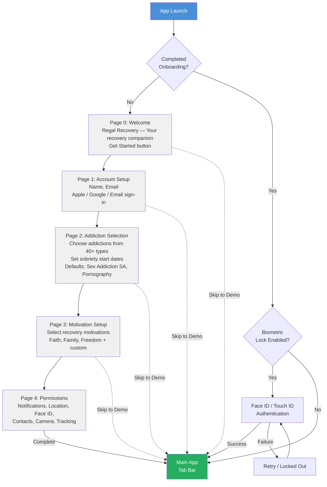

---

## 2. Main App Navigation (Tab Bar)

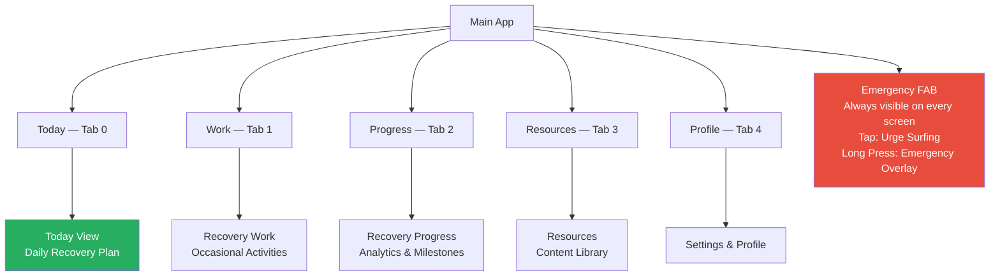

---

## 3. Today View — Daily Recovery Plan

### State Routing

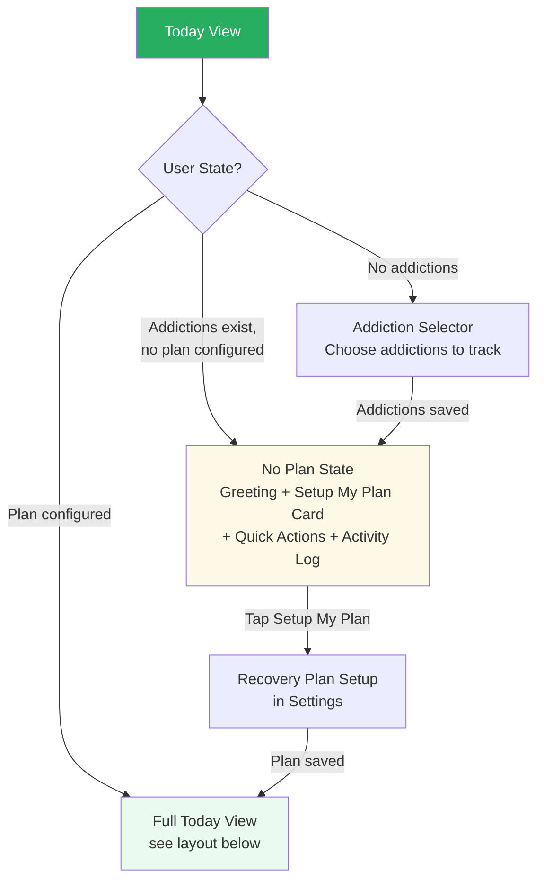

### Full Today View — Scroll Layout

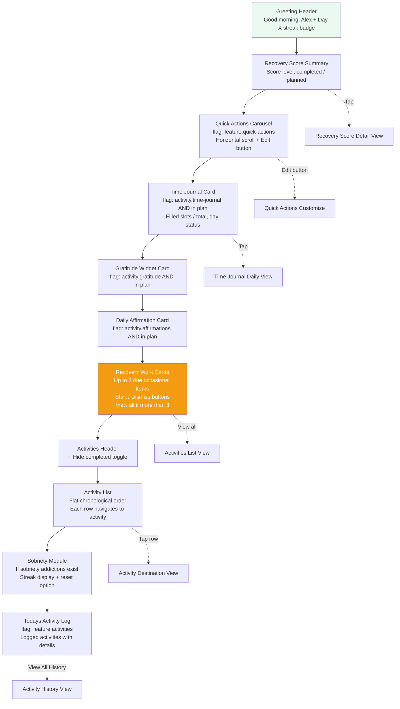

### Activity Row Interactions

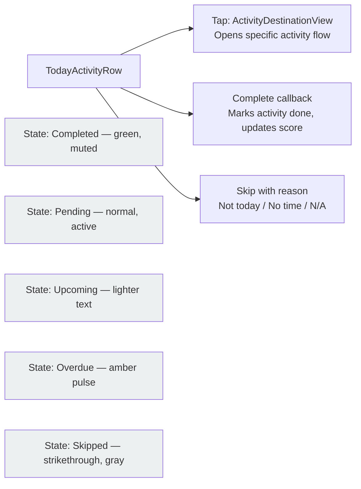

---

## 4. Activity Flows — All 25+ Activities

```mermaid
flowchart TD
    ACTIVITY_DEST[Activity Destination<br/>Routes by ActivityType] --> WHICH{Activity Type?}

    WHICH -->|sobrietyCommitment| SC[Sobriety Commitment View<br/>Daily commitment statement<br/>Confirm commitment for the day]
    WHICH -->|morningCommitment| MC[Morning Commitment View<br/>Setup commitment statements<br/>Read and confirm each morning]
    WHICH -->|journal| JRN[Journal View<br/>Freeform text journaling<br/>Category and mood tagging]
    WHICH -->|emotionalJournal| EJ[Emotional Journal View<br/>Structured emotional reflection<br/>Up to 5 per day]
    WHICH -->|mood| MOOD[Mood Rating View<br/>1-10 scale with color gradient<br/>red→orange→yellow→green<br/>Emotion hierarchy selection]
    WHICH -->|gratitude| GRAT[Gratitude Tab View]
    WHICH -->|prayer| PRAY[Prayer Log View<br/>Multiple prayer types<br/>Once-daily lock, 2-min cooldown]
    WHICH -->|affirmationLog| AFF[Affirmation Settings View<br/>→ Affirmation Deck View]
    WHICH -->|urgeLog| URGE[Urge Log View<br/>4-step form]
    WHICH -->|triggerLog| TRIGGER[Trigger Log<br/>Identify and record triggers]
    WHICH -->|fasterScale| FASTER[FASTER Scale View<br/>→ FASTER Check-In Flow]
    WHICH -->|postMortem| PM[Post-Mortem View<br/>Post-relapse analysis]
    WHICH -->|exercise| EX[Exercise Log View<br/>Type and duration logging]
    WHICH -->|phoneCalls| PHONE[Phone Call Log View<br/>Contact, duration, type]
    WHICH -->|meetingsAttended| MEET[Meetings Attended View<br/>Meeting type, notes]
    WHICH -->|stepWork| STEP[Step Work View<br/>12-step work with journaling]
    WHICH -->|fanos| FANOS[FANOS Check-In View<br/>Feelings, Affirmation, Needs,<br/>Ownership, Sobriety]
    WHICH -->|fitnap| FITNAP[FITNAP Check-In View<br/>Spouse check-in preparation]
    WHICH -->|weeklyGoals| GOALS[Weekly Goals View<br/>Set and review weekly targets]
    WHICH -->|timeJournal| TJ[Time Journal View<br/>→ Time Journal Daily View]
    WHICH -->|motivations| MOT[Motivation Review View<br/>Review personal motivations]
    WHICH -->|lbi| LBI[LBI Check-In View<br/>→ LBI Entry Point]
    WHICH -->|bowtie| BOW[Bowtie Session View<br/>→ Bowtie Diagram Flow]
    WHICH -->|eveningReview| EVE[Evening Review View<br/>End-of-day reflection]

    style ACTIVITY_DEST fill:#4a90d9,color:#fff
```

---

## 5. Urge Log Flow (4-Step Form)

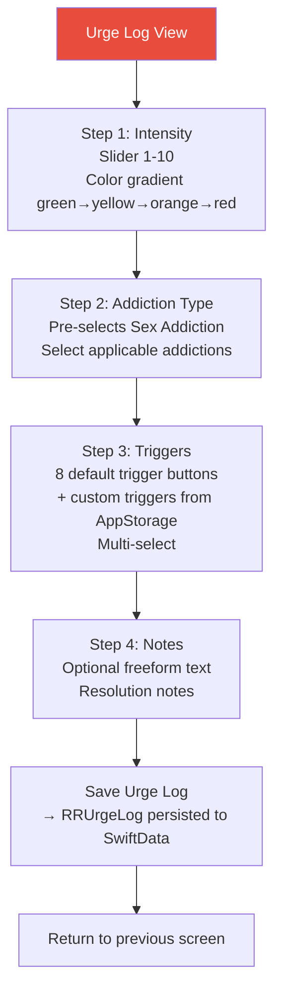

---

## 6. FASTER Scale Flow

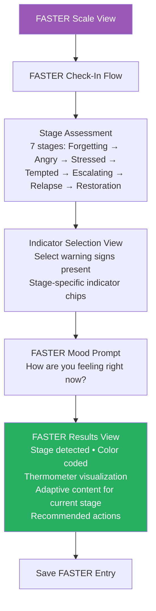

---

## 7. Gratitude Flow

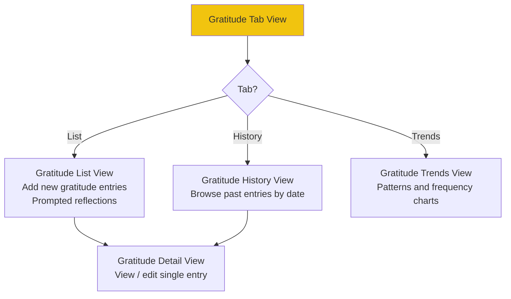

---

## 8. Time Journal Flow

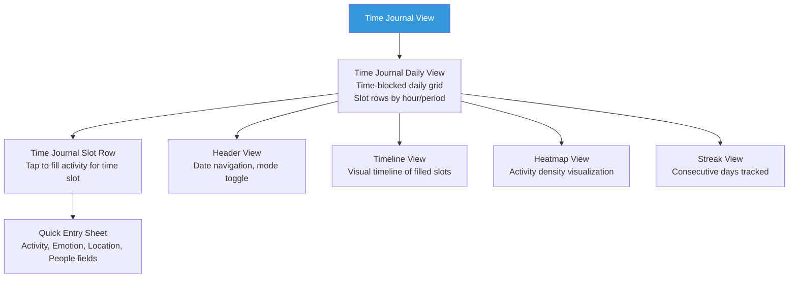

---

## 9. Bowtie Diagram Flow

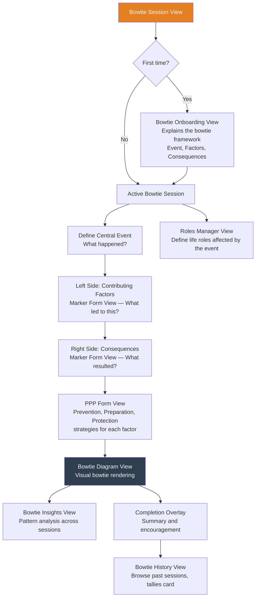

---

## 10. LBI (Life Balance Inventory) Flow

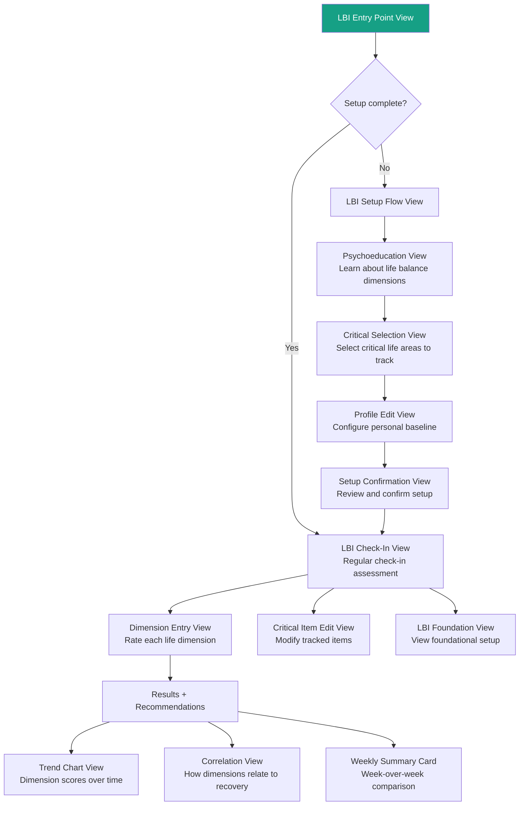

---

## 11. Emergency Layer — Always Available

### Emergency FAB Routing

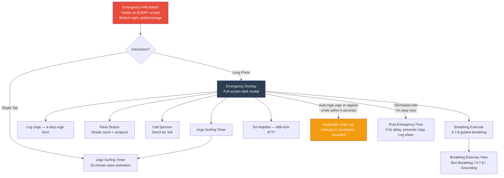

### Urge Surfing Timer

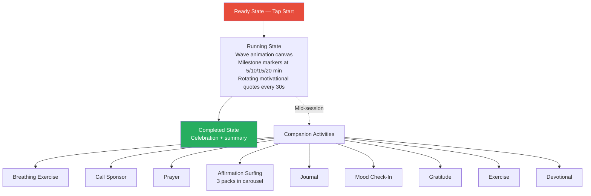

---

## 12. Recovery Work (Tab 1 — Occasional Activities)

### Work Sections

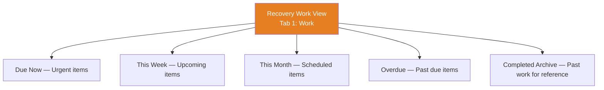

### Recovery Work Types

```mermaid
flowchart TD
    REACTIVE[Reactive — Event Triggered] --> R1[Post-Mortem Analysis<br/>Triggered by relapse log, due within 24h]
    REACTIVE --> R2[FASTER Scale Ad-Hoc<br/>Triggered by urge log]
    REACTIVE --> R3[Urge Follow-Up<br/>15 min and 1 hour after urge]

    PROACTIVE[Proactive — Scheduled] --> P1[Bowtie Exercise<br/>As needed / therapist assigned]
    PROACTIVE --> P2[Backbone Review — Monthly]
    PROACTIVE --> P3[Threats Review<br/>Monthly or after relapse]
    PROACTIVE --> P4[Book Reading — User-initiated]

    ASSESSMENTS[Assessments — Clinical Intervals] --> A1[SAST-R<br/>Intake, 90d, 6mo, 1yr, annually]
    ASSESSMENTS --> A2[Denial Assessment<br/>Intake, 30d, 90d, 6mo, annually]
    ASSESSMENTS --> A3[Addiction Severity<br/>Intake, 90d, 6mo, annually]
    ASSESSMENTS --> A4[Family Impact — Monthly]
    ASSESSMENTS --> A5[Relationship Health — Monthly]

    ASSIGNED[Therapist-Assigned Work]

    style REACTIVE fill:#e74c3c,color:#fff
    style ASSESSMENTS fill:#9b59b6,color:#fff
```

### Recovery Work Card on Today View

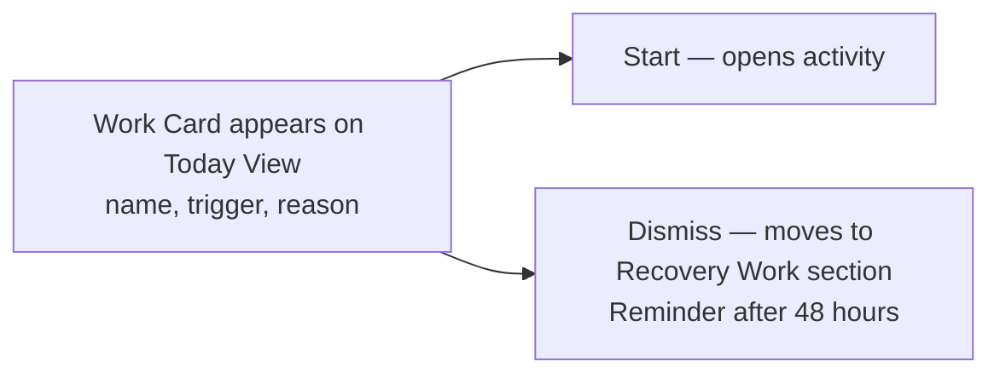

---

## 13. Progress (Tab 2 — Analytics & Milestones)

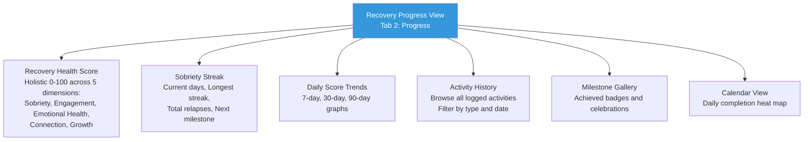

### Two Score Systems

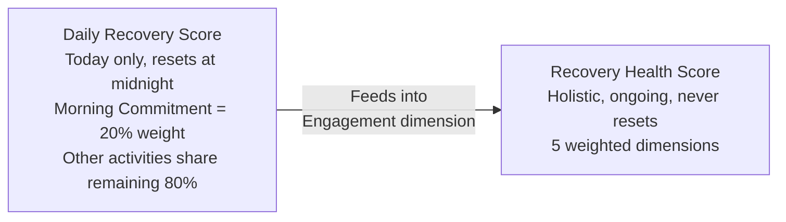

### Daily Score Levels

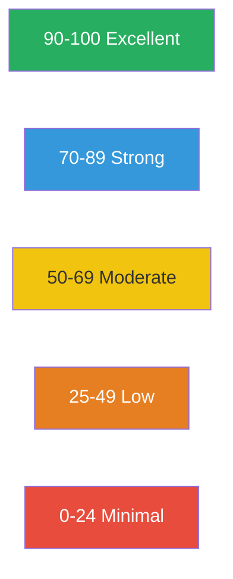

---

## 14. Resources (Tab 3 — Content Library)

```mermaid
flowchart TD
    RESOURCES_TAB[Content Tab View<br/>Tab 3: Resources] --> RES_SECTIONS{Section?}

    RES_SECTIONS -->|Resources| RESOURCES_VIEW[Resources View<br/>Crisis hotlines, glossary,<br/>external support links]
    RES_SECTIONS -->|Library| BOOK_LIB[Book Library View<br/>Available books with progress bars<br/>Multi-language support]
    RES_SECTIONS -->|Affirmations| AFF_DECK[Affirmation Deck View<br/>6 curated packs]
    RES_SECTIONS -->|Devotions| DEVOT_VIEW[Devotional View<br/>30-day devotional program]

    RESOURCES_VIEW --> CRISIS[Crisis Hotlines View<br/>10 categories, clickable phone numbers]
    RESOURCES_VIEW --> GLOSSARY[Glossary View<br/>50+ recovery terms, searchable]
    RESOURCES_VIEW --> PRAYERS[Prayers View<br/>Prayer text display, log with cooldown]

    BOOK_LIB --> BL_SELECT[Select Book<br/>Title, author, progress bar]
    BL_SELECT --> BL_TOC[Table of Contents<br/>Chapters with progress indicators]
    BL_TOC --> BL_READER[Chapter Reader<br/>Text-to-Speech, font adjustment,<br/>paragraph journal/copy context menu,<br/>progress auto-saved on scroll]

    AFF_DECK --> AFF_CARD[Affirmation Card Interface<br/>6 packs: I Am Accepted, I Am Secure,<br/>I Am Significant, Morning, Daily Faith, AA Promises<br/>Swipe carousel, heart to favorite,<br/>scripture reference, logged when 3+ seconds]

    DEVOT_VIEW --> DEV_LIST[Day List<br/>Progress: complete, current, upcoming<br/>Sections: Today, Upcoming, Completed]
    DEV_LIST --> DEV_DETAIL[Devotional Detail Sheet<br/>Scripture, reflection prompt, mark complete]
    DEV_DETAIL --> DEV_JOURNAL[Optional Journal<br/>Devotional prompt pre-filled]

    style RESOURCES_TAB fill:#9b59b6,color:#fff
    style CRISIS fill:#e74c3c,color:#fff
```

---

## 15. Profile & Settings (Tab 4)

### Profile Management

```mermaid
flowchart TD
    SETTINGS_TAB[Settings View<br/>Tab 4: Profile<br/>6 Collapsible Sections] --> SEC_PROFILE[Profile Management]
    SETTINGS_TAB --> SEC_RECOVERY[Recovery Configuration]
    SETTINGS_TAB --> SEC_PREFS[Preferences]
    SETTINGS_TAB --> SEC_PRIVACY[Privacy & Data]
    SETTINGS_TAB --> SEC_INFO[Information]
    SETTINGS_TAB --> SEC_DEBUG[Debug & Testing<br/>Dev builds only]

    SEC_PROFILE --> PROFILE_EDIT[Profile Edit View<br/>Name, email, birth year,<br/>gender, timezone, auto-save]
    SEC_PROFILE --> ADDICTION_MGMT[Addiction Management View<br/>40+ addiction types<br/>Sobriety dates, streaks, relapses]
    SEC_PROFILE --> SUPPORT_NET[Support Network View<br/>Sponsor, Counselor,<br/>Spouse, Accountability Partner]

    style SETTINGS_TAB fill:#7f8c8d,color:#fff
```

### Recovery Configuration

```mermaid
flowchart TD
    SEC_RECOVERY[Recovery Configuration] --> PLAN_SETUP[Recovery Plan Setup View<br/>Toggle activities ON/OFF<br/>Set scheduled times<br/>Day-of-week selection<br/>Overload warning at 15+ activities]
    SEC_RECOVERY --> FOUNDATION[Recovery Foundation View<br/>Hub for 5 tools]
    SEC_RECOVERY --> NOTIF[Notification Settings View<br/>Master toggle<br/>Per-time-block scheduling]

    FOUNDATION --> FT_3C[Three Circles Tool]
    FOUNDATION --> FT_RPP[Relapse Prevention Plan]
    FOUNDATION --> FT_VISION[Vision Statement]
    FOUNDATION --> FT_SUPPORT[Support Network]
    FOUNDATION --> FT_PLAN[Recovery Plan]

    style FOUNDATION fill:#2ecc71,color:#fff
```

### Preferences, Privacy, Info, Debug

```mermaid
flowchart TD
    SEC_PREFS[Preferences] --> APPEARANCE[Appearance Settings<br/>Light / Dark / System<br/>Color themes: feature.themes flag]
    SEC_PREFS --> LANGUAGE[Language Settings<br/>Requires app restart]
    SEC_PREFS --> PERMISSIONS[App Permissions<br/>Notifications, Location, Face ID,<br/>App Tracking, Contacts, Camera]

    SEC_PRIVACY[Privacy & Data] --> PRIVACY[Export data as JSON or PDF]
    SEC_INFO[Information] --> ABOUT[About — version, legal, glossary]

    SEC_DEBUG[Debug & Testing] --> DEBUG_FLAGS[Debug Flags<br/>5 features, 20 activities,<br/>5 assessments, 17+ future]
    SEC_DEBUG --> TESTING[Testing Mode<br/>Seed personas, erase data,<br/>reset commitments]
```

---

## 16. Three Circles Tool Flow

### Three Circles — Main Routes

```mermaid
flowchart TD
    TC_START[Three Circles View] --> TC_STATE{Has existing<br/>circle set?}

    TC_STATE -->|No| TC_BUILDER[Three Circles Builder<br/>7-step flow]
    TC_STATE -->|Yes| TC_LIST[Circle Set List View<br/>Browse existing sets]

    TC_LIST --> TC_SET_DETAIL[Circle Set Detail View<br/>View items in each circle]
    TC_LIST --> TC_VERSION[Version History View]
    TC_LIST --> TC_SPONSOR[Sponsor Review View]
    TC_LIST --> TC_PATTERN[Pattern Dashboard<br/>Analysis, timeline, insights,<br/>drift alerts, export]
    TC_LIST --> TC_REVIEW_Q[Quarterly Review<br/>Every 60 days prompted]

    TC_SET_DETAIL --> TC_ITEM_DETAIL[Circle Item Detail View]
    TC_SET_DETAIL --> TC_CRISIS[Crisis Support View<br/>Immediate help if triggered]
    TC_REVIEW_Q --> TC_REFLECTION[Review Reflection View<br/>What has changed?]

    style TC_START fill:#2ecc71,color:#fff
    style TC_PATTERN fill:#8e44ad,color:#fff
```

### Three Circles Builder — 7 Steps

```mermaid
flowchart TD
    B_MODE[1. Mode Selection<br/>Guided or Freeform]
    B_MODE --> B_FRAMEWORK[2. Framework Selection<br/>Choose recovery framework]
    B_FRAMEWORK --> B_AREA[3. Recovery Area Selection<br/>Select life areas to address]
    B_AREA --> B_STARTER[4. Starter Pack Selection<br/>Pre-populated behavior sets]
    B_STARTER --> B_BUILD[5. Circle Building<br/>Drag behaviors into 3 circles:<br/>Inner, Middle, Outer]
    B_BUILD --> B_EMOTIONAL[6. Emotional Check-in<br/>How does this exercise feel?]
    B_EMOTIONAL --> B_REVIEW[7. Review and Commit<br/>Finalize circle set]
    B_REVIEW --> TC_VIS[Circle Visualization View<br/>Concentric circles rendering]

    style B_MODE fill:#2ecc71,color:#fff
```

---

## 17. Vision Statement Wizard Flow

```mermaid
flowchart TD
    VISION_HUB[Vision Hub View<br/>Existing vision display or create new] --> VISION_STATE{Has vision?}

    VISION_STATE -->|No| WIZARD[Vision Wizard View]
    VISION_STATE -->|Yes| VISION_VIEW[View Current Vision<br/>Read-only display, Edit / New buttons]

    WIZARD --> V_IDENTITY[1. Identity Step<br/>Who are you becoming?]
    V_IDENTITY --> V_VALUES[2. Values Step<br/>What matters most?]
    V_VALUES --> V_SCRIPTURE[3. Scripture Step<br/>Select anchoring scripture]
    V_SCRIPTURE --> V_PROMPTS[4. Prompts Step<br/>Guided reflection questions]
    V_PROMPTS --> V_REVIEW[5. Review Step<br/>Final vision statement, edit and confirm]
    V_REVIEW --> VISION_SAVE[Save Vision Statement]

    VISION_VIEW --> VISION_HISTORY[Vision History View<br/>Past statements, track evolution]
    VISION_VIEW --> WIZARD

    style VISION_HUB fill:#f39c12,color:#fff
```

---

## 18. Motivation System Flow

```mermaid
flowchart TD
    MOT_START[Motivation Review View<br/>Daily motivation review] --> MOT_LIST[View Personal Motivations<br/>Faith, Family, Freedom + custom<br/>Icons, quotes, scripture references]

    MOT_LIST --> MOT_DETAIL[Motivation Detail View<br/>Deep dive on single motivation<br/>Scripture, personal notes]

    MOT_START --> MOT_DISCOVER[Motivation Discovery View<br/>Explore new motivations<br/>Curated library]
    MOT_DISCOVER --> MOT_LIBRARY[Motivation Library View<br/>Browse all available motivations<br/>Add to personal collection]
    MOT_LIBRARY --> MOT_CAPTURE[Motivation Capture Sheet<br/>Customize and save<br/>new personal motivation]

    MOT_START --> MOT_SURFACE[Motivation Surfacing Card<br/>Appears on Today view<br/>Rotating motivation reminders]

    style MOT_START fill:#e74c3c,color:#fff
```

---

## 19. Commitment Flow

```mermaid
flowchart TD
    COMMIT_START[Morning Commitment View<br/>First activity of the day] --> COMMIT_READ[Read Commitment Statements<br/>Personal commitment declarations]

    COMMIT_READ --> COMMIT_CONFIRM[Confirm Commitment<br/>"I commit to my recovery today"<br/>Logged as completed]

    COMMIT_CONFIRM --> COMMIT_DONE[Commitment Logged<br/>20% of Daily Recovery Score earned<br/>Notification: "Commitment made.<br/>Whatever else happens today,<br/>you started right."]

    COMMIT_START --> COMMIT_EDIT[Edit Commitment Statements<br/>→ Edit Commitment Statements View]
    COMMIT_EDIT --> STMT_MANAGER[Commitment Statements Manager<br/>Add / remove / reorder<br/>personal commitment statements]

    COMMIT_START --> COMMIT_SETUP[Commitment Setup View<br/>Initial commitment configuration]

    style COMMIT_START fill:#27ae60,color:#fff
    style COMMIT_DONE fill:#2ecc71,color:#fff
```

---

## 20. Tools Hub

```mermaid
flowchart TD
    TOOLS_HUB[Tools View<br/>Recovery tools collection] --> T_3C[Three Circles Tool]
    TOOLS_HUB --> T_FASTER[FASTER Scale Tool View]
    TOOLS_HUB --> T_PANIC[Panic Button View<br/>Streak count + scripture]
    TOOLS_HUB --> T_MOT[Motivations<br/>Review / Discovery / Library]
    TOOLS_HUB --> T_VISION[Vision Hub / Wizard]

    style TOOLS_HUB fill:#8e44ad,color:#fff
```

---

## 21. Notification-Driven Re-Entry Paths

```mermaid
flowchart TD
    NOTIF[Push Notification] --> NOTIF_TYPE{Type?}

    NOTIF_TYPE -->|Morning batch| MORNING[Today View<br/>scrolled to morning block<br/>"Your morning commitment,<br/>affirmations, devotional,<br/>and prayer are ready."]
    NOTIF_TYPE -->|Evening batch| EVENING[Today View<br/>scrolled to evening block<br/>"Evening recovery time.<br/>Your activities are waiting."]
    NOTIF_TYPE -->|Recovery work due| WORK_CARD[Today View<br/>Recovery Work card highlighted]
    NOTIF_TYPE -->|Assessment due| ASSESSMENT[Recovery Work section<br/>Assessment card]
    NOTIF_TYPE -->|Review prompt| REVIEW[Foundation tool review<br/>"It's been 60 days since<br/>you reviewed your 3 Circles."]
    NOTIF_TYPE -->|Low score alert| SUPPORT["Your recovery engagement<br/>has been low for 3+ days.<br/>Would you like to reach out?"]
    NOTIF_TYPE -->|Completion celebration| CELEBRATE["100% today. Every single one.<br/>That's what recovery looks like."]
    NOTIF_TYPE -->|Urge follow-up| FOLLOWUP[Urge follow-up<br/>15 min or 1 hour after urge log]

    style NOTIF fill:#f39c12,color:#fff
    style CELEBRATE fill:#27ae60,color:#fff
```

---

## 22. Offline-First Data Flow

```mermaid
flowchart TD
    USER_ACTION[User Performs Activity] --> LOCAL_SAVE[Save to SwiftData<br/>Immediate local persistence]
    LOCAL_SAVE --> NET_CHECK{Network<br/>Available?}

    NET_CHECK -->|Yes| SYNC[Sync Engine<br/>Push to API server]
    NET_CHECK -->|No| QUEUE[Queue for Later<br/>SyncEngine queues changes]

    QUEUE --> NET_MONITOR[Network Monitor<br/>Watches for connectivity]
    NET_MONITOR -->|Connectivity restored| SYNC

    SYNC --> CONFLICT{Conflict?}
    CONFLICT -->|No conflict| SUCCESS[Synced Successfully]
    CONFLICT -->|Relapse/Urge logs| UNION[Union Merge<br/>Keep all entries]
    CONFLICT -->|Sobriety dates| CONSERVATIVE[Most Conservative<br/>Earlier date wins]
    CONFLICT -->|Profile fields| LWW[Last Write Wins]

    style USER_ACTION fill:#3498db,color:#fff
```

---

## 23. Complete User Day — End-to-End Journey

```mermaid
flowchart TD
    WAKE[User Wakes Up] --> NOTIF_MORNING["📱 Morning notification:<br/>'Good morning, Alex. Your morning<br/>activities are ready.'"]
    NOTIF_MORNING --> OPEN_APP[Open App]
    OPEN_APP --> BIO[Face ID Unlock]
    BIO --> TODAY[Today View<br/>Day 47 streak • Score: 0/100]

    TODAY --> MORNING_BLOCK[Morning Block — 7:00 AM]

    MORNING_BLOCK --> COMMIT[✅ Morning Commitment<br/>Read statements, confirm<br/>Score: 20/100]
    COMMIT --> AFFIRM[✅ Affirmations<br/>Swipe through pack<br/>≥3 seconds logged<br/>Score: 30/100]
    AFFIRM --> DEVOT[✅ Devotional<br/>Read scripture, reflection<br/>Mark day complete<br/>Score: 40/100]
    DEVOT --> PRAY[✅ Prayer<br/>Log morning prayer<br/>Score: 50/100]
    PRAY --> JOURNAL[✅ Journal<br/>Freeform morning reflection<br/>Score: 60/100]

    JOURNAL --> MIDDAY[Midday — 12:00 PM]
    MIDDAY --> CALL1[✅ Phone Call #1<br/>Call sponsor, log duration<br/>Score: 70/100]

    CALL1 --> AFTERNOON[Afternoon — 3:00 PM]

    AFTERNOON --> URGE_EVENT["⚠️ Urge Hits"]
    URGE_EVENT --> FAB_TAP[Tap Emergency FAB]
    FAB_TAP --> URGE_SURF_SESSION[Urge Surfing Timer<br/>20 minutes with wave animation<br/>Uses prayer + affirmations<br/>as companion activities]
    URGE_SURF_SESSION --> OKAY["'I'm okay now'"]
    OKAY --> LOG_URGE[Post-Emergency Urge Log<br/>Intensity: 7, Triggers: Stress + Loneliness<br/>Resolution: Urge surfing worked]
    LOG_URGE --> RECOVERY_WORK_TRIGGERED[Recovery Work Card Appears:<br/>"FASTER Scale — After today's urge"]

    RECOVERY_WORK_TRIGGERED --> EVENING[Evening Block — 8:00 PM]
    EVENING --> MEETING[✅ Meeting Attendance<br/>SA meeting logged<br/>Score: 80/100]
    MEETING --> FASTER_CHECKIN[✅ FASTER Scale<br/>Assessed at "Stressed" stage<br/>Reviewed adaptive content<br/>Recovery work completed]
    FASTER_CHECKIN --> GRATITUDE_EVE[✅ Gratitude<br/>3 things grateful for today<br/>Score: 90/100]
    GRATITUDE_EVE --> MOOD_EVE[✅ Mood Rating<br/>Rating: 6/10, Emotion: Hopeful<br/>Score: 100/100]

    MOOD_EVE --> CELEBRATION["🎉 '100% today. Every single one.<br/>That's what recovery looks like.'"]

    CELEBRATION --> PROGRESS_CHECK[Check Progress Tab<br/>Daily score: 100 🟢 Excellent<br/>Health score: 78 🔵 Strong<br/>Streak: Day 47]

    style WAKE fill:#f39c12,color:#fff
    style URGE_EVENT fill:#e74c3c,color:#fff
    style CELEBRATION fill:#27ae60,color:#fff
    style PROGRESS_CHECK fill:#3498db,color:#fff
```

---

## 24. First-Time User Journey (Day 1)

```mermaid
flowchart TD
    INSTALL[Download & Install App] --> FIRST_LAUNCH[First Launch]
    FIRST_LAUNCH --> WELCOME[Welcome Screen<br/>"Regal Recovery —<br/>Your recovery companion"]
    WELCOME --> ACCOUNT[Account Setup<br/>Name, email<br/>Apple / Google / Email]
    ACCOUNT --> ADDICTIONS[Addiction Selection<br/>Choose from 40+ types<br/>Set sobriety start dates]
    ADDICTIONS --> MOTIVATIONS[Motivation Setup<br/>Why are you pursuing recovery?<br/>Faith, Family, Freedom + custom]
    MOTIVATIONS --> PERMISSIONS[Permissions<br/>Notifications, Location,<br/>Face ID, Contacts, Camera]
    PERMISSIONS --> FIRST_TODAY[Today View — Empty State]

    FIRST_TODAY --> EMPTY_STATE{No plan configured}
    EMPTY_STATE --> SUGGESTIONS[Suggested First Actions:<br/>"Make your first commitment"<br/>"Set up your recovery plan"<br/>"Explore your tools"]

    SUGGESTIONS --> FIRST_COMMIT[Make First Commitment<br/>→ Morning Commitment View]
    SUGGESTIONS --> SETUP_PLAN[Set Up Recovery Plan<br/>→ Recovery Plan Setup<br/>Toggle activities, set times]
    SUGGESTIONS --> EXPLORE_TOOLS[Explore Tools<br/>→ Three Circles, Vision,<br/>FASTER Scale]

    SETUP_PLAN --> PLAN_DONE[Plan Configured<br/>Activities scheduled]
    PLAN_DONE --> DAY2[Day 2: Full Today View<br/>Activities appear in chronological order<br/>Begin daily recovery rhythm]

    DAY2 --> FS_3C[Day 3-5: Three Circles<br/>Define inner/middle/outer behaviors]
    FS_3C --> FS_VISION[Day 5-7: Vision Statement<br/>Define recovery vision]
    FS_VISION --> FS_SUPPORT[Day 7-10: Support Network<br/>Add sponsor, AP, counselor]
    FS_SUPPORT --> FS_RPP[Day 10-14: Relapse Prevention Plan<br/>Build prevention strategies]

    FS_RPP --> AD_NOTIF[Day 14: Notification Preferences<br/>Adapt schedule based on usage]
    AD_NOTIF --> AD_SUGGEST[Day 30: Activity Suggestions<br/>Users at your stage benefit<br/>from adding FASTER Scale]
    AD_SUGGEST --> AD_REVIEW[Day 60: Foundation Review<br/>Has anything changed in your circles?]

    style INSTALL fill:#4a90d9,color:#fff
    style FIRST_TODAY fill:#f39c12,color:#fff
    style DAY2 fill:#27ae60,color:#fff
```

---

## 25. Feature Flag Gating Map

### Flag Categories

```mermaid
flowchart TD
    FLAGS[Feature Flag System<br/>FeatureFlagStore.shared.isEnabled] --> FEATURES[Feature Flags — 5]
    FLAGS --> ACTIVITIES[Activity Flags — 20]
    FLAGS --> ASSESSMENTS[Assessment Flags — 5]

    FEATURES --> FF1[feature.vision]
    FEATURES --> FF2[feature.quick-actions]
    FEATURES --> FF3[feature.activities]
    FEATURES --> FF4[feature.themes]
    FEATURES --> FF5[feature.geofencing]

    ACTIVITIES --> AF1[activity.time-journal]
    ACTIVITIES --> AF2[activity.gratitude]
    ACTIVITIES --> AF3[activity.affirmations]
    ACTIVITIES --> AF4[activity.devotionals]
    ACTIVITIES --> AF5[activity.sobriety-commitment]
    ACTIVITIES --> AF6[activity.journal]
    ACTIVITIES --> AF7[activity.mood]
    ACTIVITIES --> AF8[activity.prayer]
    ACTIVITIES --> AF9[activity.exercise]
    ACTIVITIES --> AF10[activity.faster-scale]
    ACTIVITIES --> AF11[activity.lbi]
    ACTIVITIES --> AF12[activity.bowtie]

    ASSESSMENTS --> AS1[assessment.sast-r]
    ASSESSMENTS --> AS2[assessment.denial]
    ASSESSMENTS --> AS3[assessment.addiction-severity]
    ASSESSMENTS --> AS4[assessment.family-impact]
    ASSESSMENTS --> AS5[assessment.relationship-health]

    style FLAGS fill:#8e44ad,color:#fff
```

### Flag Evaluation Order

```mermaid
flowchart TD
    FE1[1. Is flag enabled?] --> FE2[2. User tier check]
    FE2 --> FE3[3. Tenant check]
    FE3 --> FE4[4. Platform check]
    FE4 --> FE5[5. Min version check]
    FE5 --> FE6[6. Rollout % — SHA256 hash of userId:flagKey]
    FE6 --> FE7[7. Fail closed — unknown flags = disabled]
```
